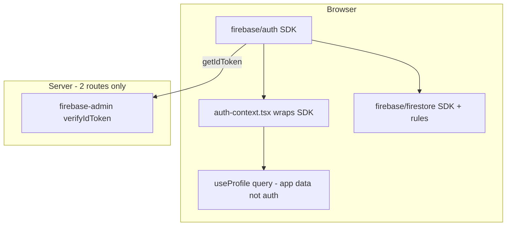

# Auth Reset — Final Ultra-Minimal Plan (2 Files)

## Final sharpen pass — what changed

| Question | Choice | Rationale |
|----------|--------|-----------|
| File count | **2 auth lib files** | Merge `firebase-auth-errors.ts` into `auth-context.tsx` — errors only used at sign-in |
| Root `/` | **Redirect → `/dashboard`** | Returning users land in app in one hop; `(app)` layout sends unauthed users to `/login` |
| Onboarding routing | **`useProfile()` not `isOnboardingComplete()`** | Reuse existing TanStack query + cache; no duplicate Firestore helper in auth layer |
| Sign out | **`queryClient.clear()` on signOut** | Prevents stale meal/profile data on shared devices |

Previous sharpen (still locked): redirect-only Google, no middleware/cookies, Bearer API auth, `router.push`, no new dependencies, `useRequireAuth` hook (not component), inline Bearer at 2 fetch sites.

---

## The entire auth system — 2 files

| File | Role |
|------|------|
| [`lib/auth/auth-context.tsx`](calsnap-web/lib/auth/auth-context.tsx) | Thin wrapper around **Firebase Auth SDK only** + `useRequireAuth` + merged error map |
| [`lib/auth/verify-bearer-token.ts`](calsnap-web/lib/auth/verify-bearer-token.ts) | **Firebase Admin SDK only** — `verifyIdToken` for 2 Gemini routes |

**Hosting glue (Firebase docs, not custom auth logic):**
- [`lib/firebase/resolve-auth-domain.ts`](calsnap-web/lib/firebase/resolve-auth-domain.ts) + `/__/auth` rewrite in [`next.config.ts`](calsnap-web/next.config.ts)

**Everything else is deleted** (~12 files, ~500 lines).

---

## What "Firebase SDK only" means here



**Not auth (do not add back):** middleware, session cookies, `jose`, `createSessionCookie`, `establishSession`, bootstrap workarounds, dual JWT verify, `SessionErrorBanner`.

**Not auth (app routing, stays in layouts):** onboarding complete check via `useProfile` — this is profile data, not identity.

---

## `auth-context.tsx` — complete spec (~110 lines)

### Exports
```typescript
export function AuthProvider({ children, onSignOut?: () => void })
export function useAuth()
export function useRequireAuth()  // (app) layout only
```

### `useAuth()` returns
```typescript
{
  user: User | null;
  loading: boolean;
  signInWithEmail(email, password): Promise<void>;
  signUpWithEmail(email, password): Promise<void>;
  signInWithGoogle(): Promise<void>;  // signInWithRedirect only
  signOut(): Promise<void>;            // onSignOut?.(); firebaseSignOut()
}
```

### Provider internals (only non-obvious code)
```typescript
// Strict Mode safe — Firebase docs pattern for getRedirectResult
let redirectPromise: Promise<UserCredential | null> | undefined;
function consumeRedirect(auth: Auth) {
  redirectPromise ??= getRedirectResult(auth);
  return redirectPromise;
}

useEffect(() => {
  void consumeRedirect(auth);
  return onAuthStateChanged(auth, (u) => { setUser(u); setLoading(false); });
}, []);
```

### Error handling
- Inline `mapFirebaseAuthError()` at bottom of same file (content from current `firebase-auth-errors.ts`)
- Delete [`lib/auth/firebase-auth-errors.ts`](calsnap-web/lib/auth/firebase-auth-errors.ts) as separate file
- Update unit test: `firebase-auth-errors.test.ts` imports from `auth-context` or tests via `mapFirebaseAuthError` export

### `AppProviders` wiring
```typescript
const queryClient = useState(() => createQueryClient())[0];
<AuthProvider onSignOut={() => queryClient.clear()}>
```

---

## Routing — one hook, one inline layout

### [`app/(app)/layout.tsx`](calsnap-web/app/(app)/layout.tsx) — `useRequireAuth()`
```typescript
const { user, loading } = useAuth();
const profile = useProfile(user?.uid);

// loading: auth OR profile
// !user → router.replace('/login')
// profile loaded + !onboardingCompleted → router.replace('/onboarding')
// else → ready, render app shell
```

Single gate for the main app. No `mode` parameter.

### [`app/(onboarding)/layout.tsx`](calsnap-web/app/(onboarding)/layout.tsx) — inline (~12 lines, no hook)
```typescript
const { user, loading } = useAuth();
const profile = useProfile(user?.uid);
// !user → /login
// onboardingCompleted → /dashboard
// else → render children
```

Onboarding guard is layout-specific, not auth infrastructure.

### [`app/(auth)/login/page.tsx`](calsnap-web/app/(auth)/login/page.tsx) + signup
```typescript
const { user, loading, signInWithGoogle, signInWithEmail, ... } = useAuth();
const profile = useProfile(user?.uid);
const router = useRouter();

useEffect(() => {
  if (loading || !user || profile.isLoading) return;
  router.replace(profile.data?.onboardingCompleted ? '/dashboard' : '/onboarding');
}, [user, loading, profile, router]);

// Google button: signInWithGoogle() → leaves page → returns to /login → effect runs
// Email submit: await signInWithEmail() → effect runs (no duplicate redirect in handler)
```

**Rule:** Never redirect inside global `onAuthStateChanged`. Only login/signup pages redirect after auth.

### Root URL
[`next.config.ts`](calsnap-web/next.config.ts):
```typescript
{ source: '/', destination: '/dashboard', permanent: false }
```
Delete [`app/page.tsx`](calsnap-web/app/page.tsx).

**Flows:**
- Returning user → `/` → `/dashboard` → `useRequireAuth` → app (one hop)
- New visitor → `/` → `/dashboard` → no user → `/login`
- After Google OAuth → lands on `/login` → profile fetch → dashboard or onboarding

---

## API routes — unchanged minimal pattern

**Server:** [`verify-bearer-token.ts`](calsnap-web/lib/auth/verify-bearer-token.ts) — `admin.verifyIdToken` only.

**Client (2 call sites, inline):**
```typescript
headers: { Authorization: `Bearer ${await user.getIdToken()}` }
```

Remove `credentials: 'include'`.

---

## Delete list (complete)

**Session / middleware stack:**
`middleware.ts`, `session-edge.ts`, `app/api/auth/session/`, `verify-api-session.ts`, `auth-redirect-state.ts`, `wait-for-first-auth-event.ts`, `auth-bootstrap.ts`, `google-redirect.ts`, `google-sign-in-strategy.ts`, `navigate-after-auth.ts`, `use-auth.ts`, `SessionErrorBanner.tsx`, `jose`

**Merged away:**
`firebase-auth-errors.ts` → into `auth-context.tsx`

**Pages:**
`app/page.tsx`

**Tests to delete/update:**
`session-edge.test.ts`, `auth-redirect-state.test.ts`, session parts of `session-route.test.ts`; update imports from `use-auth` → `auth-context`

---

## Production checklist — "works out of the box"

Code cannot fix misconfigured Firebase/Vercel. Before declaring done, verify:

| Check | Where |
|-------|-------|
| `FIREBASE_ADMIN_CLIENT_EMAIL` + `FIREBASE_ADMIN_PRIVATE_KEY` on Vercel | Vercel env |
| `NEXT_PUBLIC_USE_FIREBASE_EMULATOR=false` on Vercel | Vercel env |
| `GEMINI_API_KEY` set | Vercel env |
| Production URL in Firebase **Authorized domains** | Firebase Console → Auth → Settings |
| Google sign-in provider **enabled** | Firebase Console → Auth → Sign-in method |
| Redeploy after env var changes | Vercel |
| Google OAuth starts from **`/login`** (redirect returns to same URL) | Code — document in WR09 |

Document in [`PR-WR09-auth-reset.md`](docs/implementation/web/PR-WR09-auth-reset.md).

---

## Manual QA (Safari private window)

1. Google redirect login → dashboard or onboarding, **no loop**
2. Email login → same
3. Sign out → `/login`; dashboard blocked; **no stale data** on re-login
4. `/` bookmark → dashboard (if logged in)
5. Meal scan + insight generation work
6. Refresh `/dashboard` while logged in → stays

---

## Implementation order

1. Add `verify-bearer-token.ts` + unit test
2. Rewrite `auth-context.tsx` (merge errors, Provider, hooks)
3. Wire `AppProviders` with `onSignOut` → `queryClient.clear()`
4. Update `(app)` layout → `useRequireAuth` with `useProfile`
5. Update `(onboarding)` layout → inline `useAuth` + `useProfile`
6. Update login/signup → profile-based redirect effect
7. `next.config` redirect `/` → `/dashboard`; delete `app/page.tsx`
8. Bearer in scanner + insight; update API routes
9. Delete delete-list files; remove `jose`
10. Tests + merge gate + docs + deploy + Safari QA

---

## Success criteria

| Metric | Target |
|--------|--------|
| Auth lib files | **2** (~135 lines total) |
| Middleware | **0** |
| Session route | **0** |
| Cookie sync | **0** |
| Google login Safari | No loop |
| Merge gate | Green |

---

## What we cannot simplify further (honest floor)

| Requirement | Why no simpler option exists |
|-------------|------------------------------|
| `AuthProvider` + `onAuthStateChanged` | Firebase's client primitive — no smaller API |
| `getRedirectResult` singleton | React Strict Mode + Google redirect — Firebase docs |
| `/__/auth` proxy | Custom domain on Vercel — Firebase redirect best practice |
| `verify-bearer-token.ts` | Gemini key must stay server-side |
| `useRequireAuth` in `(app)` layout | Something must block dashboard without a user |
| `useProfile` onboarding check | Product requirement — not identity, stays in layouts |

This is the **Firebase-documented floor** for: client Firestore app + 2 secured Next.js API routes + Google OAuth on Vercel.
