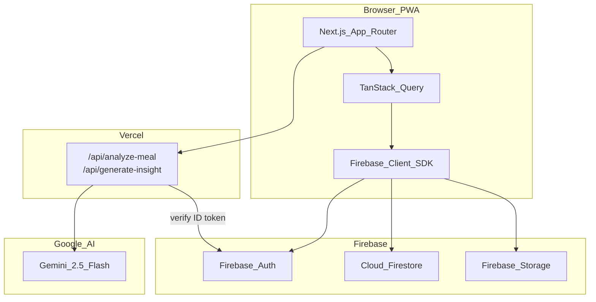
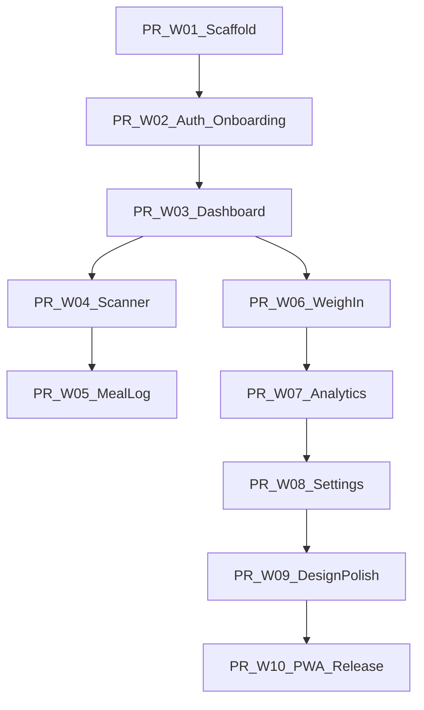

# CalSnap Web — PR Scope Plan

## Context

Build a mobile-first PWA in [`calsnap-web/`](calsnap-web/) within the existing CalSnap repo. Product and science source of truth remain [docs/product-research.md](docs/product-research.md) and [docs/technical-spec.md](docs/technical-spec.md). iOS implementation docs under [docs/implementation/](docs/implementation/) are the feature reference; web PRs port behavior, not SwiftUI code.

**Stack (fixed):** Next.js App Router, TypeScript strict, Tailwind + shadcn/ui, TanStack Query, Firebase Auth + Firestore + Storage, Gemini 2.5 Flash via Vercel Route Handlers.

**Web vs iOS deltas (apply across all PRs):**

| iOS | Web |
|-----|-----|
| SwiftData local | Firestore per `users/{uid}/...` |
| No auth | Firebase Auth (email + Google) |
| User BYOK Gemini key | `GEMINI_API_KEY` server-only on Vercel |
| HealthKit | Not available — manual weigh-in only |
| WidgetKit / Siri | PWA install + optional Web Push (PR 10) |
| Metric internal | Same — kg/cm/g stored; lbs/ft-in display toggles |

**Repo layout:**

```
cal-snap/
├── CalSnap/                  # existing iOS (unchanged)
├── docs/
│   ├── technical-spec.md
│   └── implementation/
│       └── web/              # new: PR-W01.md … PR-W10.md per merge
└── calsnap-web/              # new Next.js app (all web PRs)
```

**Architecture:**



**PR dependency map:**



PRs W04, W05, W06 may be parallelized after W03 merges.

**Per-PR deliverable:** Each merged PR adds `docs/implementation/web/PR-W0N.md` with objective, files changed, test results, and acceptance checklist (mirroring [docs/implementation/PR-01.md](docs/implementation/PR-01.md) format).

---

## PR W01: Project Scaffold and Core Infrastructure

**Goal:** Next.js skeleton, domain types, full `NutritionCalculator` port, Vitest suite, Firebase client init, placeholder screen. No auth UI, no Gemini, no feature screens.

**In scope:**
- `calsnap-web/` via `create-next-app` — App Router, TypeScript, Tailwind, ESLint strict, `pnpm`
- [`calsnap-web/lib/constants.ts`](calsnap-web/lib/constants.ts) — port [`CalSnap/Core/Utilities/Constants.swift`](CalSnap/Core/Utilities/Constants.swift)
- [`calsnap-web/lib/nutrition/calculator.ts`](calsnap-web/lib/nutrition/calculator.ts) — port all methods from [`NutritionCalculator.swift`](CalSnap/Core/Services/NutritionCalculator.swift) including `weightProjection`, `isOnPlateau`
- Types/enums: `BiologicalSex`, `ActivityLevel`, `MealType` (+ `suggestedForDate`), `UserProfile`, `MealEntry`, `FoodItem`, `WeighIn`
- [`calsnap-web/lib/firebase/client.ts`](calsnap-web/lib/firebase/client.ts) — modular SDK init (no feature usage yet)
- Firebase emulator config in [`calsnap-web/firebase.json`](calsnap-web/firebase.json)
- Placeholder [`calsnap-web/app/page.tsx`](calsnap-web/app/page.tsx)
- Vitest + [`calsnap-web/tests/unit/nutrition-calculator.test.ts`](calsnap-web/tests/unit/nutrition-calculator.test.ts)
- Root [`.gitignore`](.gitignore) updates for `calsnap-web/node_modules`, `.next`, `.env.local`
- Vercel project linked to `calsnap-web/` subdirectory

**Out of scope:** Auth, Firestore reads/writes, API routes, shadcn install, PWA, any tab navigation

**Tests (parity with iOS PR1):**
- BMR male → 1663 kcal (±1), BMR female → 1268 kcal (±1)
- TDEE, daily target floor (1500 male), deficit warnings (800 → capped 750)
- Macro targets at 2000 kcal / 0.28·0.47·0.25
- BMI 25.2, plateau detection, weight projection 13 pairs

**Acceptance:**
- `pnpm dev` and Vercel preview deploy succeed
- All Vitest tests green
- No secrets in client bundle

---

## PR W02: Auth and Onboarding

**Goal:** Firebase Auth + multi-step onboarding persisting `users/{uid}/profile`. One auth user = one profile (matches [PR-single-user-local-only-addendum.md](docs/implementation/PR-single-user-local-only-addendum.md)).

**In scope:**
- Auth pages: [`calsnap-web/app/(auth)/login/page.tsx`](calsnap-web/app/(auth)/login/page.tsx), `signup/page.tsx` — email/password + Google
- Onboarding wizard: welcome → profile → goal → calorie target preview → done
- [`calsnap-web/lib/repositories/profile.ts`](calsnap-web/lib/repositories/profile.ts) — create/update `users/{uid}/profile`
- [`calsnap-web/middleware.ts`](calsnap-web/middleware.ts) — gate `(app)` routes; redirect incomplete onboarding
- [`calsnap-web/firestore.rules`](calsnap-web/firestore.rules) — user-scoped read/write
- Auth provider wrapper in root layout
- Profile defaults: macro fractions 0.28 / 0.47 / 0.25; deficit slider 250–500, 750 with acknowledgment

**Removed from iOS PR2:**
- HealthKit permission step
- API key setup step (Gemini is server-side)

**Out of scope:** Dashboard feature UI (stub redirect OK), meal/weigh-in collections, Gemini

**Tests:**
- Goal date validation (minimum 2 weeks)
- Profile doc round-trip via Firestore emulator
- Onboarding TDEE matches calculator unit tests

**Acceptance:**
- New user signs up, completes onboarding, profile doc written
- Returning user with `onboardingCompleted: true` skips to dashboard stub
- Unauthenticated users cannot reach `(app)` routes

---

## PR W03: Dashboard — Core Daily View

**Goal:** Primary home screen with calorie ring, macros, today's meals, weight sparkline, plateau alert, scan CTA.

**In scope:**
- App shell: [`calsnap-web/app/(app)/layout.tsx`](calsnap-web/app/(app)/layout.tsx) with bottom tab nav (Dashboard, Log, Scan, Progress, Settings)
- [`calsnap-web/app/(app)/dashboard/page.tsx`](calsnap-web/app/(app)/dashboard/page.tsx)
- Components: `CalorieRingCard`, `MacroBarCard`, `TodaysMealsSection`, `WeightTrendMiniChart`, `DailySummaryFooter` (fiber/net calories stub OK for full footer in W05)
- TanStack Query hooks: `useProfile`, `useTodaysMeals`, `useRecentWeighIns`
- [`calsnap-web/lib/repositories/meals.ts`](calsnap-web/lib/repositories/meals.ts) — read today's meals
- Plateau sheet: Diet Break / Small Reduction / Dismiss (logic from iOS PR3)
- Scan tab links to `/scan` stub

**Out of scope:** Gemini scanner, meal CRUD, full analytics, design polish pass

**Tests:**
- Dashboard aggregation (3 meals → correct totals)
- Progress color boundaries (green < 90%, yellow 90–110%, red > 110%)
- Remaining calories including overages

**Acceptance:**
- Dashboard renders live Firestore data for authenticated user
- Ring shows consumed/target/remaining correctly
- Plateau alert fires when `isOnPlateau` true
- Tab navigation works on 320px mobile viewport

---

## PR W04: Meal Scanner — Gemini Integration

**Goal:** Camera/upload → compress → Storage → `/api/analyze-meal` → review → log. Primary value-add feature.

**In scope:**
- [`calsnap-web/app/(app)/scan/page.tsx`](calsnap-web/app/(app)/scan/page.tsx) — capture via `<input capture="environment">` + gallery
- [`calsnap-web/lib/services/meal-photo-processor.ts`](calsnap-web/lib/services/meal-photo-processor.ts) — client resize/compress (port intent of [`MealPhotoProcessor.swift`](CalSnap/Core/Utilities/MealPhotoProcessor.swift))
- Storage upload to `users/{uid}/meals/{mealId}/photo.jpg`
- [`calsnap-web/app/api/analyze-meal/route.ts`](calsnap-web/app/api/analyze-meal/route.ts) — verify Firebase ID token, call Gemini 2.5 Flash
- [`calsnap-web/lib/gemini/`](calsnap-web/lib/gemini/) — port response schema from [`GeminiService.swift`](CalSnap/Core/Services/GeminiService.swift), zod validation, JSON parser tests
- `MealAnalysisResultView`, `EditableFoodItem` with weight-ratio scaling, `MealTypeSelector`, confidence badge
- `ManualMealEntryView` fallback
- Error states: offline, API failure, low confidence banner (< 0.60)
- [`calsnap-web/storage.rules`](calsnap-web/storage.rules) — uid-scoped paths
- Write `MealEntryDoc` on "Log This Meal"

**Out of scope:** Meal edit/delete (W05), analytics insight generation, USDA lookup

**Tests:**
- `EditableFoodItem` weight scaling (2× weight → 2× macros)
- Meal analysis JSON parser (port [`MealAnalysisJSONParser`](CalSnap/Core/Services/MealAnalysisJSONParser.swift) tests)
- API route with mocked Gemini

**Acceptance:**
- Camera and gallery work on mobile Safari + Chrome Android
- Analysis completes in ~5s on WiFi
- Adjusting item weight recalculates totals live
- Log persists meal + photo reference; discard writes nothing
- `GEMINI_API_KEY` never exposed to client

---

## PR W05: Meal Detail, Edit and Daily Log

**Goal:** Full meal CRUD; expanded log view; dashboard footer completion.

**In scope:**
- [`calsnap-web/app/(app)/log/page.tsx`](calsnap-web/app/(app)/log/page.tsx) — grouped by meal type, empty states
- [`calsnap-web/app/(app)/log/[mealId]/page.tsx`](calsnap-web/app/(app)/log/[mealId]/page.tsx) — detail, edit, delete
- Edit flow reopens scanner state pre-populated
- Delete with confirmation; TanStack Query invalidation refreshes dashboard
- Share summary card (html-to-canvas or `@vercel/og`)
- Complete `DailySummaryFooter` on dashboard

**Out of scope:** HealthKit reversal writes, image renderer parity with iOS `ImageRenderer`

**Tests:**
- Meal deletion updates daily aggregates
- Meal edit recalculates totals

**Acceptance:**
- CRUD end-to-end on Firestore
- Dashboard totals update immediately after edit/delete
- Swipe or context-menu delete on mobile

---

## PR W06: Weight Logging and Progress

**Goal:** Weigh-in sheet, dynamic TDEE recalculation, weight chart with projection.

**In scope:**
- [`calsnap-web/app/(app)/progress/page.tsx`](calsnap-web/app/(app)/progress/page.tsx)
- Weigh-in sheet (weight input, unit toggle, date, TDEE preview, save/skip)
- On save: write `WeighInDoc`, update profile `currentWeightKg` / `tdee` / `dailyCalorieTarget`, plateau check
- Recharts line chart: actual weigh-ins, dashed projection ([`weightProjection`](CalSnap/Core/Services/NutritionCalculator.swift)), goal line
- Stats grid: lost so far, to goal, rate, projected goal date
- Weigh-in history list
- Store weekly reminder prefs on profile (scheduling in W10)

**Out of scope:** HealthKit body mass write, push notification delivery (W10)

**Tests:**
- Weigh-in recalculation updates TDEE and target
- Projected goal date sanity
- Plateau triggered on save with flat weigh-ins

**Acceptance:**
- Weigh-in immediately updates dashboard target
- Chart renders with real Firestore data
- History sorted newest first

---

## PR W07: Analytics and Insights

**Goal:** Timeframe analytics + on-demand Gemini insight from aggregates only.

**In scope:**
- [`calsnap-web/app/(app)/analytics/page.tsx`](calsnap-web/app/(app)/analytics/page.tsx)
- Port [`AnalyticsAggregator.swift`](CalSnap/Core/Services/AnalyticsAggregator.swift) to [`calsnap-web/lib/services/analytics-aggregator.ts`](calsnap-web/lib/services/analytics-aggregator.ts)
- Sections: calorie adherence, macro trends, fiber, patterns (day of week, time of day, top 5 foods), embedded weight progress
- Timeframe picker: 7D / 30D / 90D / custom
- [`calsnap-web/app/api/generate-insight/route.ts`](calsnap-web/app/api/generate-insight/route.ts) — aggregates-only prompt, 2–3 sentence insight
- Empty state when < 3 days of data

**Out of scope:** Multi-profile switcher (web is single-user per account)

**Tests:**
- Adherence % (±10% band)
- Day-of-week breakdown
- Top 5 foods by frequency

**Acceptance:**
- All charts refresh on timeframe change
- Insight generates on demand in < 5s
- No raw meal photos sent to Gemini for insights

---

## PR W08: Settings

**Goal:** Profile management, units, notification prefs, export, delete all data.

**In scope:**
- [`calsnap-web/app/(app)/settings/page.tsx`](calsnap-web/app/(app)/settings/page.tsx)
- Sections: Profile edit (recalculates TDEE), optional display name, macro sliders (sum = 100%), units, notification prefs, export CSV, delete all data, About/science sources
- [`calsnap-web/lib/services/data-export.ts`](calsnap-web/lib/services/data-export.ts) — CSV from Firestore query
- Delete: batch delete user subcollections + Storage objects + profile doc

**Removed from iOS PR8:**
- API key management
- HealthKit sync toggles

**Out of scope:** Stripe/billing, account email change flow

**Tests:**
- Macro slider validation
- Recalculation on profile edit
- CSV headers and row shape

**Acceptance:**
- Profile edits propagate to dashboard without reload
- Export downloads valid CSV
- Delete wipes all user data under `users/{uid}/`

---

## PR W09: Design System Polish and UX

**Goal:** Production visual language, dark mode, accessibility, animations — port iOS design tokens.

**In scope:**
- [`calsnap-web/lib/design/`](calsnap-web/lib/design/) — colors, typography, `calorieProgress(ratio)` (port [`Colors.swift`](CalSnap/DesignSystem/Colors.swift))
- Finalize shared components: `CalorieRingView`, `MacroBarView`, `FoodItemRowView`, `ConfidenceBadge`, `SectionCard`, `EmptyStateView`
- shadcn/ui theme aligned to CalSnap palette (warm green primary, teal secondary, amber accent)
- Dark mode via CSS variables / Tailwind `dark:`
- Animations: ring spring, staggered scan results; respect `prefers-reduced-motion`
- Accessibility: ARIA on ring/charts, 44px touch targets, color-independent status, focus traps in sheets
- English-only copy module [`calsnap-web/lib/copy/`](calsnap-web/lib/copy/) (i18n-ready keys, no hardcoded strings in components)

**Out of scope:** New features, new routes, Firestore schema changes

**Tests:**
- Calorie ring accessibility label/value
- Component snapshot tests for dashboard light/dark (optional)

**Acceptance:**
- Light/dark visual QA pass
- 320px–428px layouts do not break at XL text scaling
- All empty states have copy + action button
- No hardcoded user-facing strings outside copy module

---

## PR W10: PWA, Notifications and Release Hardening

**Goal:** Installable mobile web app, reminders, CI, release QA gate (combines iOS PR10 + PR12 intent).

**In scope:**
- PWA: [`calsnap-web/public/manifest.webmanifest`](calsnap-web/public/manifest.webmanifest), service worker (`@serwist/next` or equivalent), install prompt banner
- Notifications: v1 minimum = in-app overdue weigh-in banner on dashboard; stretch = Web Push via FCM after explicit permission
- Privacy policy page accurate for photos, AI analysis, Firebase storage
- Playwright E2E: signup → onboarding → scan (mocked API) → log → weigh-in
- GitHub Actions: Vitest + Playwright on PR
- Release QA checklist adapted from iOS PR10/PR12:
  - Mobile Lighthouse performance baseline
  - Gemini request abort on navigate-away (`AbortController`)
  - Keyboard does not cover form inputs
  - Firebase rules tested against emulator
  - No secrets in client bundle audit

**Out of scope:** WidgetKit, Siri intents, HealthKit, App Store submission

**Acceptance:**
- Add to Home Screen works on iOS Safari and Android Chrome
- Playwright happy path green in CI
- `docs/implementation/web/PR-W10.md` documents QA matrix with pass/fail evidence
- Production Vercel deploy with env vars documented

---

## Cross-cutting rules (all PRs)

- **Scope discipline:** Build only current PR; no future-PR features (same as [engineering-rules.md](docs/engineering-rules.md))
- **Units:** Store metric; convert at display only
- **Architecture:** Business logic in `lib/`; views thin; no Gemini calls from client
- **Docs:** Add `docs/implementation/web/PR-W0N.md` on each merge
- **Source references for ports:**
  - Nutrition: [`NutritionCalculator.swift`](CalSnap/Core/Services/NutritionCalculator.swift), [`NutritionCalculatorTests.swift`](CalSnapTests/NutritionCalculatorTests.swift)
  - Scanner: [`GeminiService.swift`](CalSnap/Core/Services/GeminiService.swift), [`MealScannerViewModel.swift`](CalSnap/Features/MealScanner/MealScannerViewModel.swift)
  - Analytics: [`AnalyticsAggregator.swift`](CalSnap/Core/Services/AnalyticsAggregator.swift)
  - Design: [`CalSnap/DesignSystem/`](CalSnap/DesignSystem/)

## Open decisions (lock before W04)

Document choices in `docs/implementation/web/README.md` when W01 lands:

1. **Gemini cost model** — operator-funded API key vs future user billing
2. **Photo retention** — keep indefinitely vs TTL delete in Storage
3. **Web Push** — v1 in-app reminder only vs FCM in W10
4. **Account deletion** — immediate hard delete vs grace period
