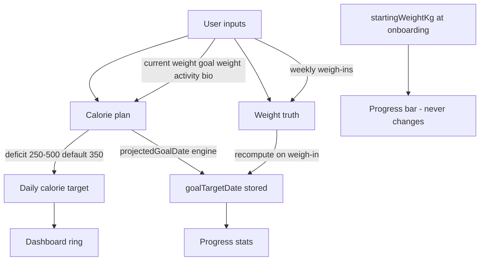

# Goal Pathway MVP (Web)

## Design contract



**Rules (MVP):**
- `startingWeightKg` set once at onboarding; never updated on goal/deficit/weigh-in changes.
- `goalTargetDate` is **computed only** via existing [`projectedGoalDate()`](calsnap-web/lib/nutrition/calculator.ts); never user-picked.
- Recompute `goalTargetDate` when: onboarding save, settings save, weigh-in save, plateau actions that change `deficitKcal`.
- Calorie budget is **not** auto-tuned from meal logs (out of scope).
- Goal-reached celebration / journey reset: **deferred**.

---

## Locked decisions (sharpened)

| Decision | Choice | Rationale |
|---|---|---|
| Platform | Web only (`calsnap-web`) | Ship pathway here first |
| Goal vs current weight | **Require `goalWeightKg < currentWeightKg`** at onboarding + settings | Loss-pathway MVP; block save with validation message |
| Min 14-day user date rule | **Dropped** | Applied to user-picked dates; show engine-computed date as-is |
| Settings deficit UI | **Mirror onboarding** — 250–500, 750 with unlock alert | One mental model |
| Deficit slider implementation | **Extract shared `DeficitSlider` component** | Onboarding + settings stay in sync; no drift |
| Weigh-in recompute anchor | **Weigh-in date** (form field) | Weight truth is `(weight, date)`; matches chart projection |
| Settings save anchor (no new weigh-in) | **Today** | Form weight is “as of save”; no extra weigh-in lookup |
| Settings save that triggers weigh-in | **Weigh-in date** | Same rule as weigh-in path when weight change ≥ threshold |
| Onboarding save anchor | **Today** | Current weight captured at signup |
| Plateau / `updateCalorieTargets` anchor | **Today** + `extras.currentWeightKg` | Profile update, not a weigh-in event |
| Progress stat source | **Stored `profile.goalTargetDate`** | Single source of truth; updated only on write paths |
| Settings / onboarding preview | **Live preview** before save | Draft intent; Progress unchanged until Save |
| Progress stat label | **"Estimated goal date"** | Honest; matches onboarding calorie step |
| At goal or `deficitKcal === 0` | **`goalTargetDate = null`**; show "Maintaining" or em dash | No fake timeline |
| Unreachable in 104 weeks | **Em dash / unavailable** | Engine returns `null`; no new copy for MVP |
| `goalTargetDate` type | **`Date \| null`** on `UserProfile` + Firestore mapper | Nullable for at-goal, maintenance, unreachable |

### Reference-date rule (single helper)

`computeGoalTargetDate({ ..., referenceDate })` — callers pass:

```text
onboarding save     → today
settings save       → today (weight-only / goal / deficit / activity edits)
weigh-in save       → normalized weigh-in date
plateau target save → today
```

---

## 1. Shared engine helper

Add a small module e.g. [`calsnap-web/lib/nutrition/goal-pathway.ts`](calsnap-web/lib/nutrition/goal-pathway.ts):

```ts
export function computeGoalTargetDate(input: {
  currentWeightKg: number;
  goalWeightKg: number;
  heightCm: number;
  dateOfBirth: Date;
  sex: BiologicalSex;
  activityLevel: ActivityLevel;
  deficitKcal: number;
  referenceDate?: Date;
}): Date | null
```

- Thin wrapper around `projectedGoalDate()` + `ageFromDateOfBirth()`.
- Returns `null` when at/below goal, zero deficit, or unreachable within `maxWeeks` (existing engine behavior).
- Add `validateGoalBelowCurrent(goalWeightKg, currentWeightKg)` in same module (or validation.ts).
- Unit tests in [`calsnap-web/tests/unit/goal-pathway.test.ts`](calsnap-web/tests/unit/goal-pathway.test.ts).

All write paths call this helper — no duplicated projection logic in UI.

### Nullable `goalTargetDate`

Update [`calsnap-web/lib/models/user-profile.ts`](calsnap-web/lib/models/user-profile.ts), [`profile-doc.ts`](calsnap-web/lib/models/profile-doc.ts), and mappers in [`profile.ts`](calsnap-web/lib/repositories/profile.ts): `goalTargetDate: Date | null`. Omit or store `null` in Firestore when unavailable.

---

## 2. Onboarding changes

### Remove manual target date

| File | Change |
|---|---|
| [`calsnap-web/components/onboarding/GoalSetupStep.tsx`](calsnap-web/components/onboarding/GoalSetupStep.tsx) | Remove `LocalDateInput` for target date and related copy (`minWeeksHint`). Keep goal weight + activity level. |
| [`calsnap-web/lib/onboarding/validation.ts`](calsnap-web/lib/onboarding/validation.ts) | `canAdvanceGoalSetup`: require valid goal weight **and** `goalWeightKg < weightKg`. Drop `validateGoalTargetDate` and goal-date validation messages. |
| [`calsnap-web/lib/onboarding/profile-draft.ts`](calsnap-web/lib/onboarding/profile-draft.ts) | Remove `defaultGoalTargetDate()`; remove `goalTargetDate` from draft type if unused, or keep as optional computed cache only (not user-edited). |

### Show computed date on calorie preview

| File | Change |
|---|---|
| [`calsnap-web/components/onboarding/CalorieTargetPreviewStep.tsx`](calsnap-web/components/onboarding/CalorieTargetPreviewStep.tsx) | Add read-only **Estimated goal date** row; updates when deficit slider moves. Accept `profileDraft` (or precomputed date prop). |
| [`calsnap-web/lib/onboarding/use-onboarding.ts`](calsnap-web/lib/onboarding/use-onboarding.ts) | Extend `OnboardingTargets` with `goalTargetDate: Date \| null`; compute in `calculateTargets()` via `computeGoalTargetDate()` using `draft.weightKg` as current weight. |
| [`calsnap-web/app/(onboarding)/onboarding/page.tsx`](calsnap-web/app/(onboarding)/onboarding/page.tsx) | Pass draft into calorie preview for date display. |

### Persist computed date on save

| File | Change |
|---|---|
| [`calsnap-web/lib/repositories/profile.ts`](calsnap-web/lib/repositories/profile.ts) `makeProfileFromDraft` | Set `goalTargetDate` from `computeGoalTargetDate({ currentWeightKg: draft.weightKg, ... })` instead of `draft.goalTargetDate`. |

---

## 3. Weigh-in: recompute date on each log

| File | Change |
|---|---|
| [`calsnap-web/lib/services/weigh-in-service.ts`](calsnap-web/lib/services/weigh-in-service.ts) | After `recalculateWeighIn`, compute `goalTargetDate` via helper using `newWeightKg` and **`normalizedDate`** (weigh-in date). |
| [`calsnap-web/lib/repositories/profile.ts`](calsnap-web/lib/repositories/profile.ts) `updateProfileAfterWeighIn` | Merge nullable `goalTargetDate` into returned profile. |

Weigh-in preview UI (if any) does not need date display for MVP unless already present.

---

## 4. Settings: editable goal + deficit; read-only date

### Fix existing deficit bug

[`profile-update-service.ts`](calsnap-web/lib/services/profile-update-service.ts) `apply()` currently uses `profile.deficitKcal` instead of `draft.requestedDeficit` — settings cannot change deficit today. Fix:

```ts
deficitKcal: draft.requestedDeficit  // not profile.deficitKcal
```

Also recompute `goalTargetDate` in `apply()` using `weightKg`, `draft.requestedDeficit`, and **`referenceDate: today`**.

When settings save triggers a weigh-in (`save-settings-profile.ts` weight-change path), goal date uses **weigh-in date** (delegated to weigh-in service).

### UI

| File | Change |
|---|---|
| [`calsnap-web/components/onboarding/DeficitSlider.tsx`](calsnap-web/components/onboarding/DeficitSlider.tsx) (new) | Shared deficit slider + hard-deficit unlock alert; used by onboarding and settings. |
| [`calsnap-web/components/onboarding/CalorieTargetPreviewStep.tsx`](calsnap-web/components/onboarding/CalorieTargetPreviewStep.tsx) | Use `DeficitSlider`; show estimated goal date. |
| [`calsnap-web/components/settings/ProfileSection.tsx`](calsnap-web/components/settings/ProfileSection.tsx) | Remove goal date picker. Add `DeficitSlider` + read-only estimated goal date (live preview from `use-settings-form`). |
| [`calsnap-web/lib/settings/use-settings-form.ts`](calsnap-web/lib/settings/use-settings-form.ts) | `preview()` uses `draft.requestedDeficit`. Add `previewGoalTargetDate` memo via `computeGoalTargetDate` with `referenceDate: today`. Mirror `hardDeficitUnlocked` state from onboarding. |
| [`calsnap-web/lib/settings/validation.ts`](calsnap-web/lib/settings/validation.ts) | Remove `validateGoalTargetDate`. Add `goalWeightKg < currentWeightKg` check. |

### Copy

Update [`calsnap-web/lib/copy/onboarding.ts`](calsnap-web/lib/copy/onboarding.ts), [`calsnap-web/lib/copy/settings.ts`](calsnap-web/lib/copy/settings.ts):
- Remove/deprecate target-date picker strings.
- Add `onboarding.calorie.estimatedGoalDate`, `settings.profile.estimatedGoalDate`, `common.unavailable` reuse for null date.

---

## 5. Progress: single source of truth

Today Progress computes `projectedGoalDate` live in [`deriveProgressStats()`](calsnap-web/lib/progress/progress-stats.ts) while profile stores a separate unused `goalTargetDate`.

**MVP approach:** Display **stored** `profile.goalTargetDate` (kept fresh by weigh-ins and settings). Keep `projectionPoints()` in `deriveProgressStats` for the chart dashed line (model trajectory).

| File | Change |
|---|---|
| [`calsnap-web/lib/queries/use-progress.ts`](calsnap-web/lib/queries/use-progress.ts) | `formatProjectedGoalDate()` reads `profile.goalTargetDate` (with null/maintaining handling). |
| [`calsnap-web/lib/copy/progress.ts`](calsnap-web/lib/copy/progress.ts) | Rename `progress.stats.projectedGoal` → `progress.stats.estimatedGoalDate`: **"Estimated goal date"**. |

---

## 6. Plateau / diet-break paths

When deficit changes outside settings:

| File | Change |
|---|---|
| [`calsnap-web/lib/repositories/profile.ts`](calsnap-web/lib/repositories/profile.ts) `updateCalorieTargets` | After updating `deficitKcal`, recompute nullable `goalTargetDate` using `extras.currentWeightKg` and **`referenceDate: today`**. |
| [`calsnap-web/lib/dashboard/plateau-state.ts`](calsnap-web/lib/dashboard/plateau-state.ts) | No logic change if repository handles recompute; diet break (`deficitKcal: 0`) → date becomes `null` / "Maintaining". |

---

## 7. Cleanup

- Remove [`goalTargetDateInputBounds`](calsnap-web/lib/utilities/date-input.ts) and `validateGoalTargetDate` — no longer used.
- Remove `AppConstants.Onboarding.minGoalDaysFromToday` / `maxGoalDaysFromToday` if no callers remain.
- Remove orphaned copy keys: `onboarding.goal.targetDate`, `onboarding.goal.minWeeksHint`, `settings.profile.goalDate`, goal-date validation strings.

---

## 8. Tests

| Area | Files |
|---|---|
| New helper | `tests/unit/goal-pathway.test.ts` |
| Onboarding validation | [`tests/unit/onboarding-validation.test.ts`](calsnap-web/tests/unit/onboarding-validation.test.ts) — remove date tests; add `goal < current` required cases |
| Goal pathway helper | reference-date matrix: onboarding=today, weigh-in=weigh-in date, settings=today |
| Profile save | [`tests/unit/profile-repository.test.ts`](calsnap-web/tests/unit/profile-repository.test.ts) — assert computed date on `makeProfileFromDraft` |
| Weigh-in | [`tests/unit/weigh-in-service.test.ts`](calsnap-web/tests/unit/weigh-in-service.test.ts) — assert `goalTargetDate` updates after save |
| Settings | [`tests/unit/save-settings-profile.test.ts`](calsnap-web/tests/unit/save-settings-profile.test.ts), [`tests/unit/profile-update-service.test.ts`](calsnap-web/tests/unit/profile-update-service.test.ts) — deficit change + date recompute |
| Progress display | [`tests/unit/progress-stats.test.ts`](calsnap-web/tests/unit/progress-stats.test.ts) — chart projection unchanged |
| E2E | [`tests/e2e/helpers/onboarding.ts`](calsnap-web/tests/e2e/helpers/onboarding.ts) — remove `input[type="date"]` fill on goal step |
| Date bounds | [`tests/unit/date-input.test.ts`](calsnap-web/tests/unit/date-input.test.ts) — remove goal-date bounds test if helper deleted |

Run: `cd calsnap-web && pnpm test` and relevant e2e onboarding spec.

---

## 9. Documentation

Add [`docs/implementation/web/PR-WR10-goal-pathway.md`](docs/implementation/web/PR-WR10-goal-pathway.md) (or next WR number) summarizing:
- Design contract above
- Acceptance criteria checklist
- Explicit out-of-scope list (iOS parity, goal-reached flow, empirical TDEE tuning)

Link from [`docs/implementation/web/ROLLOUT.md`](docs/implementation/web/ROLLOUT.md) manual QA section: verify onboarding shows computed date, settings deficit changes date, weigh-in shifts date.

---

## Acceptance criteria

- [ ] Onboarding goal step has no date picker; goal weight must be below current weight.
- [ ] Calorie preview shows **estimated goal date** that updates with deficit slider.
- [ ] Saved profile has `goalTargetDate` computed at onboarding (reference: today); not user input.
- [ ] `startingWeightKg` unchanged after settings save and weigh-ins.
- [ ] Settings: goal weight + deficit editable (shared `DeficitSlider`, 750 unlock); estimated goal date read-only live preview; save recomputes stored date (reference: today).
- [ ] Weigh-in save recomputes `goalTargetDate` from new weight (reference: weigh-in date).
- [ ] Progress stat shows stored `goalTargetDate` — label **"Estimated goal date"**; null → em dash or "Maintaining" when deficit 0.
- [ ] Goal ≥ current blocked in settings validation.
- [ ] Diet break / at-goal → `goalTargetDate` null.
- [ ] All unit tests and onboarding e2e pass.

---

## Out of scope (this PR)

- iOS (`CalSnap/`) parity
- Goal-reached celebration or journey reset
- Auto-adjusting calorie budget from meal logs vs weight
- Empirical TDEE refinement
- Extending goal date during 2-week diet break (date goes null; acceptable for MVP)

---

## Implementation order

1. `computeGoalTargetDate` helper + unit tests
2. Onboarding UI + save path
3. Weigh-in recompute
4. Settings (fix deficit bug + UI + apply recompute)
5. Progress display + copy
6. Plateau `updateCalorieTargets` recompute
7. Test sweep + e2e + doc
