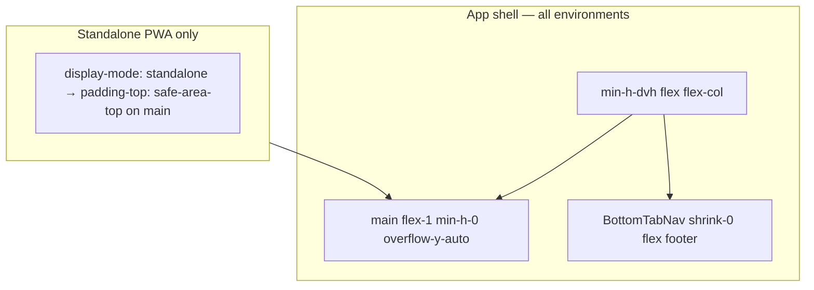

# iPhone PWA + Settings UX Fixes

## Test matrix (locked from device QA)

| Issue | Standalone PWA (home icon) | Safari mobile browser |
|-------|---------------------------|----------------------|
| Log tab nav jumps / too high | **Broken** — always on `/log` | **OK** — no jump |
| Top content under status bar | **Broken** — slightly obscured | **OK** — spacing fine |
| Settings DOB overflows | **Broken** | **Broken** |
| Settings save bar jumps | **Broken** | **Broken** |
| ScanFab redundant | N/A (remove) | N/A (remove) |

**Implication:** Shell/layout changes for nav + top spacing must target **standalone PWA** without regressing **Safari browser**, which already works.

**Packaging:** Single PR.

---

## Sharpened decisions (locked)

| # | Decision | Choice |
|---|----------|--------|
| 1–7 | Round 1 | Unchanged (single PR, header Save, dead code removal, etc.) |
| 8 | Tab bar | Flex footer globally — fixes standalone; verify Safari regression |
| 9 | Top inset | `pt-safe` **standalone-only** via `@media (display-mode: standalone)` |
| 10 | Scroll-to-top | Include on tab navigation |
| 11 | Save button | Always visible, disabled when clean |
| 12 | Log jump | Always on `/log` in standalone only |
| 13 | PWA retest | Force-close + relaunch from icon |
| **14** | **Safari browser** | **Nav + top spacing OK — do not add global pt-safe or py→pb changes** |
| **15** | **Settings fixes** | **Both environments** — DOB + header Save |

---

## Architecture



---

## A. Standalone PWA only — shell fixes

### A1. Log tab nav always too high

**Root cause:** `position: fixed` tab bar is unreliable in **standalone PWA** (not reproduced in Safari browser). Flex footer pins tab bar to viewport bottom via `min-h-dvh` flex column.

**Fix — [(app)/layout.tsx](calsnap-web/app/(app)/layout.tsx):**

```tsx
<div className="flex min-h-dvh flex-col overflow-x-hidden bg-cs-background">
  <InstallPromptBanner uid={user!.uid} />
  <main
    ref={mainScrollRef}
    className="app-main flex-1 min-h-0 overflow-y-auto overflow-x-hidden w-full min-w-0"
  >
    {children}
  </main>
  <BottomTabNav onNavigate={() => scrollMainToTop(mainScrollRef)} />
</div>
```

- Update `layout.tabBar.nav`: remove `fixed inset-x-0 bottom-0`; use `shrink-0` flex footer (keep blur + `pb-safe`).
- Scroll-to-top on tab nav in [BottomTabNav.tsx](calsnap-web/components/app/BottomTabNav.tsx).
- Simplify `layout.content.bottomPadding` to `pb-6` (tab bar no longer overlays content).
- Remove `layout.fixed.aboveTabBar` + `.bottom-above-tab-bar`.
- Remove settings page `overflow-y-auto` shell quirk.

### A2. Top content under status bar (standalone only)

**Do NOT** add `pt-safe` globally — Safari browser spacing is already correct.

**Fix — [globals.css](calsnap-web/app/globals.css):**

```css
@media (display-mode: standalone) {
  .app-main {
    padding-top: var(--safe-area-top);
  }
  .onboarding-main {
    padding-top: var(--safe-area-top);
  }
}
```

- Add `app-main` class to app `<main>`; add `onboarding-main` to [(onboarding)/layout.tsx](calsnap-web/app/(onboarding)/layout.tsx) wrapper/main.
- **Keep existing `py-*` on tab pages** — do not convert to `pb-*` globally (would reduce top spacing in Safari).
- Skeleton components: add same standalone-only class if they render under notch during bootstrap.

**Token:** `layout.content.topPadding` documents `app-main` + standalone media query (not a Tailwind `pt-safe` class on all envs).

---

## B. Both environments — settings fixes

### B1. DOB input overflows

- [LocalDateInput.tsx](calsnap-web/components/design/LocalDateInput.tsx): overflow wrapper + `max-w-full`.
- [globals.css](calsnap-web/app/globals.css): `input[type='date'] { max-width: 100%; min-width: 0; }`.
- [ProfileSection.tsx](calsnap-web/components/settings/ProfileSection.tsx): `min-w-0` on DOB label.
- E2E: DOB width ≤ viewport in [viewport-320.spec.ts](calsnap-web/tests/e2e/viewport-320.spec.ts).

### B2. Settings save — header Save button

- Compact PrimaryButton in header: label `Save`, `aria-label` = `Save profile`.
- Always visible; `disabled` when `!form.isDirty || !form.canSave`.
- Remove floating save bar + all `bottomPaddingWithSaveBar` / save-bar CSS tokens.
- Keep `keyboardInset` on settings scroll content; verify with new `<main>` scroll ancestor on both Safari + standalone.

---

## C. Both environments — remove ScanFab

Remove from [dashboard/page.tsx](calsnap-web/app/(app)/dashboard/page.tsx); delete component + copy keys + `elevation.fab`.

---

## Dead code removal

- `content.bottomPaddingWithSaveBar`, `fixed.aboveTabBar`, `elevation.fab` from [layout.ts](calsnap-web/lib/design/layout.ts)
- `--app-save-bar-height`, `--app-content-bottom-padding-with-save-bar`, `.pb-tab-content-with-save-bar`, `.bottom-above-tab-bar` from [globals.css](calsnap-web/app/globals.css)
- Simplify `.pb-tab-content` / bottom padding token for flex-footer model

---

## Verification

### Merge gate
`pnpm lint && pnpm test && pnpm build && pnpm test:integration && pnpm test:e2e`

### Manual — standalone PWA (force-close + relaunch from icon)
- [ ] Log tab nav flush to physical bottom on `/log`
- [ ] Top titles clear of notch/Dynamic Island
- [ ] Settings DOB inside card
- [ ] Settings header Save (no floating bar)
- [ ] No ScanFab on dashboard

### Manual — Safari mobile browser (regression)
- [ ] Log tab nav still pinned correctly (no new jump)
- [ ] Top spacing unchanged (no extra gap from standalone-only CSS)
- [ ] Settings DOB inside card
- [ ] Settings header Save works
- [ ] No ScanFab on dashboard

---

## Residual risks

| Risk | Mitigation |
|------|------------|
| Flex footer regresses Safari nav | Explicit Safari regression checklist (user reports Safari OK today) |
| Standalone pt-safe double-stacks with page `py-*` | Acceptable; tune down page `py-top` in standalone only if too much space after retest |
| DOB CSS insufficient | Follow-up: split date fields |
| Keyboard scroll with new main ancestor | Test settings on both Safari + standalone |
