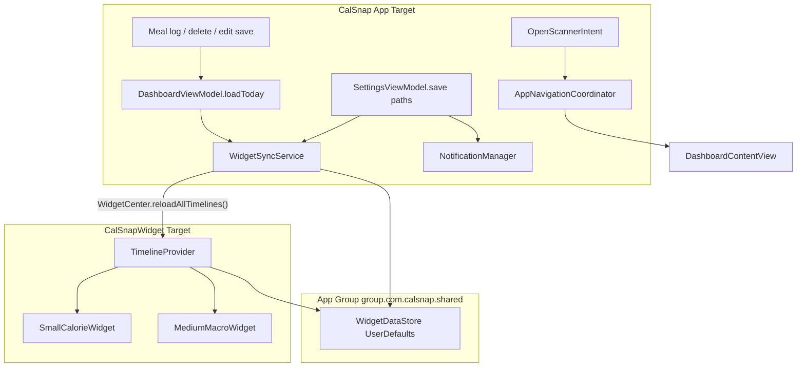

# PR10: Notifications, Widgets & App Polish

**Baseline:** 88 passing unit tests ([PR-09.md](docs/implementation/PR-09.md)); single-user architecture per [PR-single-user-local-only-addendum.md](docs/implementation/PR-single-user-local-only-addendum.md).  
**Source of truth:** [technical-spec.md](docs/technical-spec.md) PR 10 section + engineering rules.

---

## 0. Pre-build verification checkpoint (required before any entitlement or target edits)

Do **not** edit `project.pbxproj`, entitlements, or App Group identifiers until the live Xcode project is read and the following are confirmed against actual target settings (not plan assumptions):

| Item | Current repo value (verify at build time) | Action if mismatch |
|---|---|---|
| App bundle ID | `com.calsnap.app` ([project.pbxproj](CalSnap.xcodeproj/project.pbxproj)) | Derive widget ID from confirmed app ID (e.g. `com.calsnap.app.widget`) |
| Test bundle ID | `com.calsnap.app.tests` | Leave unchanged |
| App entitlements file | `CalSnap/Resources/CalSnap.entitlements` (`CODE_SIGN_ENTITLEMENTS`) | Use exact path in pbxproj |
| Widget entitlements file | *new* — propose `CalSnapWidget/CalSnapWidget.entitlements` | Match whatever path Xcode target wizard creates |
| App Group identifier | `group.com.calsnap.shared` (spec) | Must match Apple Developer portal App Group + both entitlements arrays |
| Development team | Currently empty in pbxproj | Set in Xcode before device/widget testing |
| Shared source paths | `CalSnap/Shared/*` (proposed) | Confirm group/folder exists in pbxproj after add; dual-target membership explicit |
| Privacy manifest path | `CalSnap/Resources/PrivacyInfo.xcprivacy` (proposed) | Confirm added to app target Copy Bundle Resources |

**Gate:** Widget target creation, App Group capability, and `WidgetDataStore.suiteName` all depend on this checkpoint. If the portal App Group uses a different string, update spec extension #1 in PR-10.md and all code references together.

---

## Architecture overview



---

## 1. Daily log reminders (extends PR6 NotificationManager)

**Constraint:** Keep `@MainActor` injected instance in [AppContainer.swift](CalSnap/App/AppContainer.swift) — no `shared` singleton. Mirror existing weigh-in patterns in [NotificationManager.swift](CalSnap/Core/Services/NotificationManager.swift).

### Notification center test seam (do this before daily-log feature code)

PR6 tests assert notification *behavior* via `NotificationManager` public API and pending-sheet state, but do not verify `UNNotificationRequest` content. PR10 daily-log tests need a seam **up front** — add before `scheduleDailyLogReminder` implementation:

1. **`NotificationCenterScheduling` protocol** (in `CalSnap/Core/Services/`):
   - `add(_ request: UNNotificationRequest) async throws`
   - `removePendingNotificationRequests(withIdentifiers: [String])`
   - `notificationSettings() async -> UNNotificationSettings` (or reuse existing permission path)
2. **`LiveNotificationCenter`** — thin wrapper around `UNUserNotificationCenter.current()`
3. **`NotificationManager` init** — accept `center: NotificationCenterScheduling = LiveNotificationCenter()`; store as property instead of calling `.current()` directly for schedule/cancel/add paths
4. **`MockNotificationCenter`** in tests — records added requests and removed identifiers; no system notification center in unit tests

Daily-log tests (`NotificationDailyLogTests`) assert against `MockNotificationCenter` recorded requests: identifier `daily-log-{userId}`, `DAILY_LOG` category, trigger hour/minute, enabled vs cancelled. Existing PR6 weigh-in tests continue passing without rewrite (default live center in production; mock only in new tests).

### NotificationManager additions

| Method / property | Behavior |
|---|---|
| `dailyLogReminderEnabled(for:)` / `setDailyLogReminderEnabled` | AppStorage-backed toggle (per `userId`, same key pattern as weigh-in) |
| `dailyLogReminderHour/Minute(for:)` / `setDailyLogReminderSchedule` | Time-only schedule |
| `scheduleDailyLogReminder(userId:)` | `UNCalendarNotificationTrigger` daily repeat at stored hour/minute; identifier `daily-log-{userId}` |
| `cancelDailyLogReminder(userId:)` | Remove pending request |
| Delegate branch | New category `DAILY_LOG` (add to `AppConstants.Notifications`) |

**Notification copy** (localize via xcstrings — see §5):
- Title: daily log reminder
- Body: neutral single-user copy (no required name); use display name when `profile.name` non-empty

**Tap behavior (approved spec extension):** Daily-log tap sets `AppNavigationCoordinator.pendingScannerRoute = .create(initialMealType: nil)` and selects Dashboard tab — parallel to weigh-in’s `pendingWeighInSheet` cold-launch pattern, but routes to scanner instead of weigh-in sheet.

### Settings UI (PR8 deferral closure)

Extend [SettingsView.swift](CalSnap/Features/Settings/SettingsView.swift) `notificationsSection` and [SettingsViewModel.swift](CalSnap/Features/Settings/SettingsViewModel.swift):

- `Toggle` “Daily log reminder” (default **off** — optional feature per spec)
- `DatePicker` hour/minute (disabled when toggle off)
- `updateDailyLogReminderSchedule(context:)` — mirrors `updateReminderSchedule`; calls `setDailyLogReminderSchedule` then `scheduleDailyLogReminder` or `cancelDailyLogReminder`

### Constants & cleanup

Add to [Constants.swift](CalSnap/Core/Utilities/Constants.swift):
- `AppStorageKey.dailyLogReminderEnabled/Hour/Minute(userId:)`
- `AppConstants.Notifications.dailyLogCategoryIdentifier`

Update [UserDataDeletionService.swift](CalSnap/Core/Services/UserDataDeletionService.swift):
- `cancelDailyLogReminder` + clear daily-log AppStorage keys in `clearPerUserDefaults`

Update [Info.plist](CalSnap/Resources/Info.plist) `NSUserNotificationsUsageDescription` to mention both weekly weigh-in and optional daily log reminders.

**Single-user note:** Scheduling targets `activeProfile.id` only (already true in [DashboardView.swift](CalSnap/Features/Dashboard/DashboardView.swift) `scheduleReminderIfNeeded`). Remove any lingering dual-profile scheduling language in new code; do not reintroduce profile switching.

---

## 2. Home screen widget (CalSnapWidget target)

### Target & entitlements

| Item | Value |
|---|---|
| New target | `CalSnapWidget` (Widget Extension) — **name confirmed at Checkpoint 0** |
| Bundle ID | Proposed `com.calsnap.app.widget` — **derive from verified app bundle ID** |
| App Group | `group.com.calsnap.shared` on **both** [CalSnap.entitlements](CalSnap/Resources/CalSnap.entitlements) and new widget entitlements file |
| Shared signing | Same team; enable App Groups capability in Xcode for both targets |

Register in [project.pbxproj](CalSnap.xcodeproj/project.pbxproj): widget target, embed extension, test-host unchanged. Prefer Xcode target wizard for initial widget scaffold, then align pbxproj paths with Checkpoint 0 table.

### Shared data contract

New files with **dual target membership** (app + widget):

**[CalSnap/Shared/WidgetData.swift](CalSnap/Shared/WidgetData.swift)** — Codable per spec, plus **approved extension** for medium widget macro bars:

```swift
struct WidgetData: Codable, Sendable {
    let displayName: String          // was activeUserName; empty → widget omits greeting
    let targetCalories: Int
    let consumedCalories: Int
    let proteinConsumedG: Double
    let carbsConsumedG: Double
    let fatConsumedG: Double
    let proteinTargetG: Double       // from NutritionCalculator.macroTargets
    let carbsTargetG: Double
    let fatTargetG: Double
    let updatedAt: Date
}
```

**[CalSnap/Shared/WidgetDataStore.swift](CalSnap/Shared/WidgetDataStore.swift)**:
- `static let suiteName = "group.com.calsnap.shared"`
- `static let storageKey = "widgetData"`
- `save(_:)` / `load()` via `JSONEncoder`/`JSONDecoder` on `UserDefaults(suiteName:)`
- `clear()` for data deletion

**[CalSnap/Core/Services/WidgetSyncService.swift](CalSnap/Core/Services/WidgetSyncService.swift)** (`@MainActor`, app target only):
- `sync(from profile: UserProfile, dashboard: DashboardViewModel)` — builds `WidgetData` from today’s aggregates + macro targets
- `sync(from profile: UserProfile, context: ModelContext, …)` — lightweight path for Settings-only target changes (re-fetch today’s meals or accept precomputed totals)
- Calls `WidgetCenter.shared.reloadAllTimelines()` after every successful write

### Exact app-side write points

| Trigger | Call site | Notes |
|---|---|---|
| Meal logged (scanner save) | [DashboardView.swift](CalSnap/Features/Dashboard/DashboardView.swift) `reloadDashboard()` | After `loadToday` succeeds |
| Meal deleted | `confirmDelete()` → `reloadDashboard()` | Same |
| Meal edited | `onMealChanged` / navigation pop → `reloadDashboard()` | Same |
| Profile target change | [SettingsViewModel.swift](CalSnap/Features/Settings/SettingsViewModel.swift) after `bumpProfileDataRevision()` | User may not visit Dashboard |
| Weigh-in save | `onWeighInSaved` → `reloadDashboard()` | Target may change |
| App launch / tab appear | `DashboardView.task` after initial `reloadDashboard()` | Cold-start widget freshness |
| Delete all data | [UserDataDeletionService.swift](CalSnap/Core/Services/UserDataDeletionService.swift) | `WidgetDataStore.clear()` + reload |

**Do not** call `reloadAllTimelines()` from widget extension itself.

### Widget UI (separate target, no main-app imports)

| File | Widget |
|---|---|
| `CalSnapWidget/CalSnapWidgetBundle.swift` | `@main` bundle |
| `CalSnapWidget/SmallCalorieWidget.swift` | Small: ring + remaining kcal (static `Gauge`/`Circle` trim — no PR9 spring animation) |
| `CalSnapWidget/MediumMacroWidget.swift` | Medium: ring + three macro progress bars |
| `CalSnapWidget/WidgetColors.swift` | Duplicate minimal asset refs OR small widget-local colorset (Primary, Protein, Carbs, Fat, Success, Warning, Danger) — **do not** link full DesignSystem into extension |

Timeline: `AppIntentTimelineProvider` or `TimelineProvider` with `.after(updatedAt + 15min)` fallback; reload driven primarily by app writes.

**Empty / no-profile state:** Widget shows placeholder “Open CalSnap to get started” when `WidgetData` nil.

---

## 3. App Intent / Siri shortcut scope

**In scope (spec):** Open meal scanner only — no auto-log, no meal-type parameter, no edit-existing.

| File | Purpose |
|---|---|
| `CalSnap/AppIntents/OpenScannerIntent.swift` | `AppIntent` with `LocalizedStringResource` title “Log a Meal” |
| `CalSnap/AppIntents/CalSnapShortcuts.swift` | `AppShortcutsProvider` — phrase “Log a meal in CalSnap” |

**Navigation wiring (approved spec extension — replaces outdated `NSUserActivityTypes` note):**

1. Add `@Observable AppNavigationCoordinator` to [AppContainer.swift](CalSnap/App/AppContainer.swift) with `var pendingScannerRoute: MealScannerRoute?`
2. `OpenScannerIntent.perform()` sets `pendingScannerRoute = .create(initialMealType: nil)` on main actor
3. [RootView.swift](CalSnap/App/RootView.swift) observes coordinator: force `selectedTab = .dashboard`
4. [DashboardContentView.swift](CalSnap/Features/Dashboard/DashboardContentView.swift) `.onChange(of: coordinator.pendingScannerRoute)` appends to `navigationPath` and clears pending

**Out of scope:** Widget tap actions, deep links to meal detail, parameterized shortcuts.

---

## 4. Info.plist & entitlement changes

### CalSnap app Info.plist

- Update `NSUserNotificationsUsageDescription` (daily + weekly)
- No camera/HealthKit key changes (already present)
- App Intents: auto-registered via `AppShortcutsProvider`; no manual `NSUserActivityTypes` entry needed

### New / modified entitlements

**CalSnap.entitlements** — add:
```xml
<key>com.apple.security.application-groups</key>
<array>
    <string>group.com.calsnap.shared</string>
</array>
```

**CalSnapWidget.entitlements** — HealthKit **not** included; App Group only.

### PrivacyInfo.xcprivacy (ship requirement)

Create [CalSnap/Resources/PrivacyInfo.xcprivacy](CalSnap/Resources/PrivacyInfo.xcprivacy) and add to app target **Copy Bundle Resources**. This file is a **binary deliverable** validated by Xcode archive — not documentation.

| Declaration | Rationale |
|---|---|
| `NSPrivacyTracking` = false | No tracking |
| `NSPrivacyCollectedDataTypes` | Health & Fitness (weight, nutrition via HealthKit); Photos/Videos (meal photos, local capture); User Content (meal logs, local) — linked=false, tracking=false |
| `NSPrivacyAccessedAPITypes` | `NSPrivacyAccessedAPICategoryUserDefaults` (reason CA92.1 — App Group widget sync); `NSPrivacyAccessedAPICategoryFileTimestamp` only if file-timestamp APIs are used |

**Acceptance:** Privacy manifest present in app bundle; Xcode Privacy Report generates without missing required API declarations.

### App Store Privacy Nutrition Labels (documentation only — not in PrivacyInfo.xcprivacy)

Record separately in [docs/implementation/PR-10.md](docs/implementation/PR-10.md) § App Store privacy labels — this is **operator guidance** for App Store Connect, not code:

- Data types to declare: Health & Fitness, Photos/Videos, User Content
- Each: collected for app functionality, not linked to identity, not used for tracking
- Third-party sharing: Gemini API receives meal image/description for analysis (disclose as data sent off-device when user scans)
- Manual QA checkbox: “Nutrition label answers in App Store Connect match PR-10.md table”

Do **not** conflate nutrition-label prose with `PrivacyInfo.xcprivacy` XML contents.

---

## 5. Localizable.xcstrings — controlled two-phase migration

This is likely the **largest diff in the sprint**. Treat as a deliberate migration, not incidental cleanup while touching other files.

Create [CalSnap/Resources/Localizable.xcstrings](CalSnap/Resources/Localizable.xcstrings) — **English only v1**, all keys `extractionState: manual`, symbol-style keys (e.g. `dashboard.greeting.morning`).

### Phase 1: String audit (no behavior change)

1. Grep inventory: `Text("…")`, `Label("…")`, `Button("…")`, `Section("…")`, alert titles, `NotificationManager` copy, accessibility labels/hints
2. Produce a **file checklist** with literal counts (~35 Swift files expected) — attach to PR-10.md or plan appendix
3. Define symbol-key naming convention (`feature.surface.element`, e.g. `settings.notifications.dailyLogToggle`)
4. Mark exclusions: `#Preview` mock data, test fixtures, `Logger` messages, Gemini prompt text (not user-facing UI)
5. **Gate:** No Swift file string replacements until checklist is complete

### Phase 2: Migration pass (controlled replacements)

1. Add keys to `Localizable.xcstrings` in batches matching feature order (minimize merge conflicts):
   - DesignSystem components → Dashboard/MealLog → MealScanner → Progress → Analytics → Settings → Onboarding
2. Replace literals with `Text(.key)` / `String(localized: .key)` / `LocalizedStringResource` for App Intents
3. One feature batch per commit or logical chunk; run full test suite after each batch
4. **Preserve PR9:** String extraction only — no color/token/layout changes

### High-impact files (audit starting points)

[DashboardContentView.swift](CalSnap/Features/Dashboard/DashboardContentView.swift), [MealListView.swift](CalSnap/Features/MealLog/MealListView.swift), [SettingsView.swift](CalSnap/Features/Settings/SettingsView.swift), [MealScannerCaptureView.swift](CalSnap/Features/MealScanner/MealScannerCaptureView.swift), [CalorieRingView.swift](CalSnap/DesignSystem/Components/CalorieRingView.swift), [EmptyStateView.swift](CalSnap/DesignSystem/Components/EmptyStateView.swift), onboarding step views, analytics section views.

---

## 6. Final QA remediation

Audit-first, fix only failing items. Current codebase status:

| Criterion | Current state | PR10 action |
|---|---|---|
| Cold launch &lt; 1.5s | Unverified | Manual Instruments; avoid new blocking work in `CalSnapApp` launch |
| Memory leaks | Unverified | Manual Leaks template |
| Dashboard scroll (Release, device) | Unverified | Manual SwiftUI template; verify nested `List` in [MealListView.swift](CalSnap/Features/MealLog/MealListView.swift) not regressed |
| No DateFormatter/NumberFormatter in `body` | **Pass** (grep clean) | Spot-check during localization pass |
| Stable `Identifiable` list IDs | **Mostly pass** | Ensure `aggregateMeals()` sorts each `mealsByType` bucket by `timestamp` ascending (repository returns sorted, but re-sort in VM for safety) |
| No filter/sort inside `ForEach` | **Pass** | Keep precomputed `mealsByType`, `chartWeighInsAscending`, `chartDailySeries` in VMs |
| Gemini cancel on navigate away | **Partial** — [MealScannerView.swift](CalSnap/Features/MealScanner/MealScannerView.swift) `.onDisappear { cancelAnalysis() }` | Add unit test `testCancelAnalysisResetsPhase` in [MealScannerViewModelTests.swift](CalSnapTests/MealScannerViewModelTests.swift) |
| Sheet dismiss on swipe | **Partial** — [WeighInView.swift](CalSnap/Features/Progress/WeighInView.swift) blocks during save; [PlateauAlertSheet.swift](CalSnap/Features/Dashboard/PlateauAlertSheet.swift) `interactiveDismissDisabled()` | Manual QA all sheets; add `interactiveDismissDisabled` to export sheet only if dismissal loses data |
| Keyboard avoidance | Unverified | Manual QA: Settings Form, WeighInView Form, ManualMealEntryView, onboarding |
| Hardcoded strings | **Fail** | Full xcstrings migration (§5) |
| Privacy manifest | **Missing** | Create (§4) |

**Out of scope for PR10** (note in PR-10.md): Refactoring `NWPathMonitor`/`DispatchQueue` in [MealScannerViewModel.swift](CalSnap/Features/MealScanner/MealScannerViewModel.swift) — pre-existing, not introduced by PR10; defer unless network check blocks QA.

**Do not touch:** SwiftData models, `profileDataRevision` contract, tab shell, PR9 `Color.cs*` tokens, Analytics aggregation logic.

---

## 7. Files summary

### Create

| Path | Target |
|---|---|
| `CalSnap/Shared/WidgetData.swift` | App + Widget |
| `CalSnap/Shared/WidgetDataStore.swift` | App + Widget |
| `CalSnap/Core/Services/WidgetSyncService.swift` | App |
| `CalSnap/AppIntents/OpenScannerIntent.swift` | App |
| `CalSnap/AppIntents/CalSnapShortcuts.swift` | App |
| `CalSnap/App/AppNavigationCoordinator.swift` | App |
| `CalSnapWidget/*` (bundle, providers, views, assets) | Widget |
| `CalSnapWidget/CalSnapWidget.entitlements` | Widget |
| `CalSnap/Resources/PrivacyInfo.xcprivacy` | App |
| `CalSnap/Resources/Localizable.xcstrings` | App |
| `CalSnapTests/WidgetDataStoreTests.swift` | Tests |
| `CalSnap/Core/Services/NotificationCenterScheduling.swift` | App (protocol + live wrapper) |
| `CalSnapTests/MockNotificationCenter.swift` | Tests |
| `CalSnapTests/NotificationDailyLogTests.swift` | Tests |
| `docs/implementation/PR-10.md` | Docs |

### Modify

| Path | Change |
|---|---|
| [NotificationManager.swift](CalSnap/Core/Services/NotificationManager.swift) | Injectable center seam + daily log schedule/cancel/delegate |
| [AppContainer.swift](CalSnap/App/AppContainer.swift) | Wire `navigationCoordinator`; pass live notification center to manager |
| [Constants.swift](CalSnap/Core/Utilities/Constants.swift) | Daily log keys + category |
| [SettingsView.swift](CalSnap/Features/Settings/SettingsView.swift) | Daily log UI + localized strings |
| [SettingsViewModel.swift](CalSnap/Features/Settings/SettingsViewModel.swift) | Daily log schedule + widget sync on profile save |
| [DashboardView.swift](CalSnap/Features/Dashboard/DashboardView.swift) | Widget sync in `reloadDashboard`; consume scanner intent |
| [DashboardContentView.swift](CalSnap/Features/Dashboard/DashboardContentView.swift) | Pending scanner route consumption |
| [DashboardViewModel.swift](CalSnap/Features/Dashboard/DashboardViewModel.swift) | Sort meals within type buckets |
| [RootView.swift](CalSnap/App/RootView.swift) | Tab switch on intent |
| [UserDataDeletionService.swift](CalSnap/Core/Services/UserDataDeletionService.swift) | Daily log + widget clear |
| [CalSnap.entitlements](CalSnap/Resources/CalSnap.entitlements) | App Group |
| [Info.plist](CalSnap/Resources/Info.plist) | Notification usage string |
| [project.pbxproj](CalSnap.xcodeproj/project.pbxproj) | Widget target, shared files, privacy manifest, xcstrings |
| ~35 view/component files | xcstrings migration |
| [MealScannerViewModelTests.swift](CalSnapTests/MealScannerViewModelTests.swift) | Cancel analysis test |

---

## 8. Test plan

### Automatable (add in PR10)

| Test | File |
|---|---|
| `testWidgetDataRoundTrip()` | Encode/decode + UserDefaults suite in test |
| `testWidgetSyncWritesExpectedFields()` | WidgetSyncService with in-memory profile + meals |
| `testDailyLogReminderSchedulesWhenEnabled()` | Via `MockNotificationCenter` — assert request identifier, category, trigger components |
| `testDailyLogReminderCancelledWhenDisabled()` | Mock records `removePendingNotificationRequests` with `daily-log-{userId}` |
| `testDailyLogKeysClearedOnDelete()` | UserDataDeletionService |
| `testCancelAnalysisResetsPhase()` | MealScannerViewModel |
| Regression | Full suite ≥ 88 tests passing |

### Manual QA (document in PR-10.md)

- [ ] Daily log toggle on → notification fires at set time (simulator `simctl` or short-future test)
- [ ] Daily log notification tap → Dashboard → scanner opens
- [ ] Weigh-in reminder regression (PR6 cold-launch sheet unchanged)
- [ ] Small + medium widget show correct data after log/delete/edit
- [ ] Widget updates after Settings target change without opening Dashboard
- [ ] Siri Shortcut / Shortcuts app “Log a Meal” opens scanner
- [ ] Light/dark widget readability (PR9 colors duplicated in widget assets)
- [ ] Dynamic Type spot-check Dashboard after localization
- [ ] Keyboard + sheet dismiss matrix (Settings, WeighIn, Manual entry, export sheet)
- [ ] Release build cold launch timing on iPhone 14+ class device
- [ ] Instruments Leaks + SwiftUI scroll profile
- [ ] Privacy manifest validates in Xcode Privacy Report (ship artifact)
- [ ] App Store Connect nutrition labels filled per PR-10.md documentation table (operator step)

---

## 9. Acceptance criteria mapping

| Spec criterion | PR10 deliverable |
|---|---|
| Home screen widget (small ring, medium ring+macros) | CalSnapWidget target + WidgetData contract |
| App Group `group.com.calsnap.shared` | Entitlements + WidgetDataStore |
| Dashboard writes on meal log + `reloadAllTimelines` | WidgetSyncService in `reloadDashboard` + meal CRUD paths |
| Daily log reminder (PR8 deferral) | Settings toggle/time + NotificationManager extension |
| OpenScannerIntent | AppIntents + navigation coordinator |
| No hardcoded user strings | Localizable.xcstrings full migration |
| PrivacyInfo.xcprivacy | HealthKit, camera, photos, network, UserDefaults API |
| QA checklist items | §6 remediation + manual matrix |
| No singleton NotificationManager | Preserved via AppContainer injection |
| Single-user / no model changes | displayName from `profile.name`; primary profile only |

---

## 10. Approved spec extensions (document in PR-10.md)

1. **WidgetData field rename** — `activeUserName` → `displayName`; add macro target fields for medium widget bars
2. **Daily log default off** — toggle defaults disabled; user opts in
3. **Daily log tap** — opens meal scanner (not weigh-in sheet)
4. **App Intents** — supersedes spec’s `NSUserActivityTypes` registration note
5. **WidgetSync on Settings save** — not only dashboard meal log (target can change without meal events)
6. **Single-user scheduling** — all notification/widget sync uses `UserProfileRepository.primaryProfile` / `activeProfile` only

---

## 11. Implementation order (recommended)

1. **Checkpoint 0** — verify bundle IDs, entitlements paths, App Group ID (§0)
2. **Notification test seam** — `NotificationCenterScheduling` + `MockNotificationCenter` (§1)
3. Shared `WidgetData` + `WidgetDataStore` + unit tests
4. `WidgetSyncService` + Dashboard write points (widget target can follow in parallel after Checkpoint 0)
5. CalSnapWidget target + App Group entitlements
6. NotificationManager daily log + Settings UI + deletion cleanup + `NotificationDailyLogTests`
7. `AppNavigationCoordinator` + OpenScannerIntent
8. `PrivacyInfo.xcprivacy` + Info.plist notification string (§4 ship artifact)
9. **Localization phase 1** — string audit + checklist (§5)
10. **Localization phase 2** — controlled migration pass (§5; largest diff — after feature code stable)
11. QA remediation pass
12. **PR-10.md** — acceptance mapping, manual QA, App Store privacy-label notes (separate from manifest)
