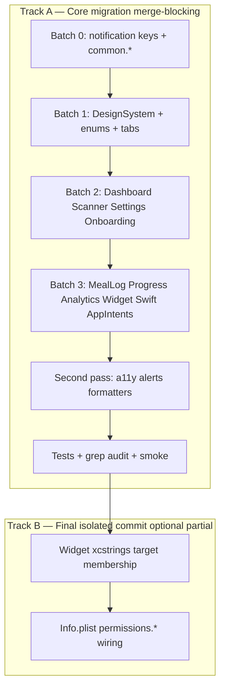

# PR11: String Catalog Migration App-Wide

## Context and baseline

PR10 created [Localizable.xcstrings](CalSnap/Resources/Localizable.xcstrings) with **5 notification strings** only ([PR-10.md](docs/implementation/PR-10.md) §4). Those keys currently use **English text as the key** (e.g. `"Weekly Weigh-In"`), which conflicts with the spec QA gate requiring **manual symbol keys** ([technical-spec.md](docs/technical-spec.md) line 1410).

| Metric | Value |
|--------|-------|
| Catalog keys today | 5 (notifications) |
| Swift files with hardcoded UI literals | ~55 (app + widget) |
| Estimated unique keys after dedup | ~250–280 |
| Test baseline | **94 passing** ([PR-10.md](docs/implementation/PR-10.md) §2) |

**Hard constraint:** string extraction only — no copy rewrites, no UX/flow changes, no SwiftData model edits, no PR9 token/layout changes, no new locales. Preserve single-user neutral wording from [PR-single-user-local-only-addendum.md](docs/implementation/PR-single-user-local-only-addendum.md) (optional name, no partner language).

### Must-have vs optional scope

**Must-have (merge-blocking):**

- All production app and widget **user-facing SwiftUI/UI strings** (titles, labels, buttons, empty states, sheets, toolbars)
- Accessibility labels and hints
- Alerts and confirmation dialogs
- Enum display labels (`MealType`, `ActivityLevel`, `AnalyticsTypes`, etc.)
- View-model validation and user-visible error messages surfaced in UI
- App Intent display metadata (title, description, shortcut phrases)
- Widget UI copy in Swift source (migrate strings in code even before target plumbing lands)

**Optional (non-blocking follow-up within same PR if clean; defer if pbxproj churn is painful):**

- Info.plist permission-string catalog wiring (`permissions.*` keys) — spec already defines required copy in [Info.plist](CalSnap/Resources/Info.plist); the urgent gap is in-app hardcoded UI text
- [CalSnap.xcodeproj/project.pbxproj](CalSnap.xcodeproj/project.pbxproj) widget-target catalog membership — required for widget runtime lookup, but core app migration can merge first; widget strings can land in catalog + Swift in earlier commits, with target wiring as the final isolated commit

### Literal-fidelity rule (non-negotiable)

Every catalog `value` must match the removed Swift literal **character-for-character** unless a spec-approved wording correction is explicitly called out in PR-11.md. This is a migration PR, not a copy-edit PR. Reviewers should flag any value diff that is not a pure key extraction.

---

## Key naming convention

All entries: `extractionState: manual`, `sourceLanguage: en`, English-only `localizations.en`.

```
{feature}.{surface}.{element}[.{variant}]
```

| Namespace | Examples |
|-----------|----------|
| `common.*` | `common.button.save`, `common.button.cancel`, `common.button.delete`, `common.empty.noMealData` |
| `app.*` | `app.tab.dashboard`, `app.tab.analytics`, `app.tab.settings` |
| `dashboard.*` | `dashboard.greeting.morning`, `dashboard.empty.noProfile.title` |
| `mealScanner.*` | `mealScanner.title.scan`, `mealScanner.alert.discard.title` |
| `mealLog.*` | `mealLog.title.todaysMeals`, `mealLog.alert.deleteMeal.title` |
| `progress.*` | `progress.title.weight`, `progress.button.logWeighIn` |
| `analytics.*` | `analytics.title.main`, `analytics.timeframe.7d` |
| `settings.*` | `settings.section.notifications`, `settings.alert.deleteAllData.title` |
| `onboarding.*` | `onboarding.welcome.subtitle`, `onboarding.nav.continue` |
| `notifications.*` | `notifications.weighIn.title` (rename from PR10) |
| `widget.*` | `widget.small.left`, `widget.config.calorieRing.title` |
| `intents.*` | `intents.openScanner.title`, `intents.openScanner.description` |
| `model.*` | `model.mealType.breakfast`, `model.activityLevel.sedentary.title` |
| `error.*` | `error.gemini.apiKeyMissing`, `error.validation.ageRange` |
| `permissions.*` | `permissions.camera.usageDescription` |
| `accessibility.*` or feature-scoped | `dashboard.calorieRing.accessibility.summary` |

**Dedup rule:** shared literals (`Cancel`, `Save`, `Delete`, `No meal data`, macro labels, API-key-missing copy) get **one** `common.*` or `error.*` key referenced from multiple call sites.

---

## Step 0: Normalize PR10 notification keys

Rename the 5 existing catalog entries and update [NotificationManager.swift](CalSnap/Core/Services/NotificationManager.swift):

| Old key (English-as-key) | New symbol key | English value (unchanged) |
|--------------------------|----------------|---------------------------|
| `Weekly Weigh-In` | `notifications.weighIn.title` | Weekly Weigh-In |
| `Time for your weekly weigh-in. Tap to log.` | `notifications.weighIn.body` | (same) |
| `Reminder: log your weight when you're ready.` | `notifications.weighIn.snoozeBody` | (same) |
| `Log Your Meals` | `notifications.dailyLog.title` | (same) |
| `Don't forget to log today's meals.` | `notifications.dailyLog.body` | (same) |

Replace `String(localized: "Weekly Weigh-In")` → `String(localized: "notifications.weighIn.title")`. No copy or scheduling behavior change.

---

## Step 1: Two-track implementation structure

PR11 has two tracks. **Track A (core migration)** is the merge-critical path. **Track B (project plumbing)** is isolated at the end and does not block merging Track A.



### Track A: Expand [Localizable.xcstrings](CalSnap/Resources/Localizable.xcstrings)

Add keys in batches (below). Each batch: add keys to catalog → update Swift call sites → run tests. Widget Swift files migrate to catalog keys in Track A even if the widget extension cannot resolve them at runtime until Track B lands.

### Track B: Project/target plumbing (final isolated commit)

1. **Widget target membership** — [Localizable.xcstrings](CalSnap/Resources/Localizable.xcstrings) is app-target only today. Add to **CalSnapWidget** Copy Bundle Resources in [project.pbxproj](CalSnap.xcodeproj/project.pbxproj) so widget views resolve keys at runtime.
2. **Info.plist permission strings (optional)** — Add 5 usage-description keys under `permissions.*` and wire via string-catalog Info.plist localization. English values identical to current plist text. Skip if project-file churn exceeds benefit; does not block core migration merge.

---

## Step 2: Substitution patterns and fallback policy

Use the minimal API per context — no new abstraction layer:

```swift
// SwiftUI static copy — LocalizedStringKey lookup
Text("dashboard.greeting.morning")
Button("common.button.save") { ... }
Section("settings.section.about") { ... }
.navigationTitle("analytics.title.main")

// Non-Text / VM / a11y / alerts / UNNotificationContent
String(localized: "error.gemini.apiKeyMissing")
Text(verbatim: dynamicFoodName) // keep for AI/user data — do NOT catalog

// App Intents
static let title: LocalizedStringResource = "intents.openScanner.title"

// Interpolation — catalog value uses format specifiers
// Key: dashboard.calorieRing.ofGoal  Value: "of %lld kcal goal"
String(localized: "dashboard.calorieRing.ofGoal \(target)")
```

### Fallback policy (when not to use a bare localization key)

Prefer the right tool for mixed static/dynamic content — do not force every string through a catalog key if it hurts readability or risks formatting regressions:

| Case | Preferred approach |
|------|-------------------|
| Pure static UI copy | Catalog key via `Text("key")` / `String(localized: "key")` |
| User/AI-generated content (food names, insights) | `Text(verbatim:)` — never catalog |
| Measurements and numbers (weight, kcal, grams) | Keep numeric formatting in code; catalog only the **static template** around formatted values (e.g. `"Weight: %@ lbs"`) or use `FormatStyle` / existing formatters where already in use |
| Dates and times | `FormatStyle` / `Date.FormatStyle` for locale-ready formatting; catalog static labels only (`"Goal date"`, not the formatted date string) |
| Mixed static + dynamic a11y | Compose: `String(localized: "template \(formattedValue)")` with catalog template, or concatenate localized prefix + formatted suffix when interpolation is awkward |
| Chart axis numeric ticks | Leave numeric tick values as computed numbers; catalog axis **title** strings only (`"Date"`, `"Weight"`) |

**Enum display properties** ([ActivityLevel.swift](CalSnap/Core/Models/ActivityLevel.swift), [MealType.swift](CalSnap/Core/Models/MealType.swift), [AnalyticsTypes.swift](CalSnap/Core/Utilities/AnalyticsTypes.swift)): keep Codable `rawValue` unchanged; replace UI-facing computed properties (`displayName`, `description`, `shortLabel`, `displayLabel`) with `String(localized: "model....")`.

**EmptyStateView** ([EmptyStateView.swift](CalSnap/DesignSystem/Components/EmptyStateView.swift)): component stays generic; migrate literals at **call sites** (Dashboard, Analytics, Progress, etc.).

**Parameterized VM strings** (high miss risk): [DashboardViewModel.swift](CalSnap/Features/Dashboard/DashboardViewModel.swift), [WeightProgressViewModel.swift](CalSnap/Features/Progress/WeightProgressViewModel.swift), [SettingsViewModel.swift](CalSnap/Features/Settings/SettingsViewModel.swift), [OnboardingViewModel.swift](CalSnap/Features/Onboarding/OnboardingViewModel.swift), [ScannerErrorBanner.swift](CalSnap/Features/MealScanner/ScannerErrorBanner.swift), [NutritionCalculator.swift](CalSnap/Core/Services/NutritionCalculator.swift) warnings, [UnitFormatters.swift](CalSnap/Core/Utilities/Extensions/UnitFormatters.swift) accessibility helpers.

**Service-layer strings (tight rule):** Only migrate strings **guaranteed to reach the user directly** — primarily `LocalizedError.errorDescription` on errors displayed in UI banners/alerts (e.g. [GeminiService.swift](CalSnap/Core/Services/GeminiService.swift) `GeminiError` cases surfaced via [ScannerErrorBanner.swift](CalSnap/Features/MealScanner/ScannerErrorBanner.swift)). Do **not** migrate internal prompts, debug text, implementation messages, or service strings better expressed as typed errors at the view-model boundary. When in doubt, migrate at the **UI presentation layer** (banner/alert copy) rather than deep in the service.

---

## Step 3: Migration batches (recommended commit order)

```mermaid
flowchart LR
    subgraph batch0 [Batch 0]
        NotifKeys[Normalize notification keys]
        CommonKeys[Seed common.* keys]
    end
    subgraph batch1 [Batch 1 Shared]
        DS[DesignSystem components]
        Models[Model enum labels]
        AppShell[RootView tabs]
    end
    subgraph batch2 [Batch 2 High traffic]
        Dash[Dashboard]
        Scanner[MealScanner]
        Settings[Settings]
        Onboard[Onboarding]
    end
    subgraph batch3 [Batch 3 Supporting]
        MealLog[MealLog]
        Progress[Progress]
        Analytics[Analytics]
        Widget[Widget Swift + Intents]
    end
    subgraph trackB [Track B Final commit]
        Plist[Widget target + optional Info.plist]
    end
    batch0 --> batch1 --> batch2 --> batch3 --> trackB
```



### Batch 0 — Foundation (~30 keys)

- Normalize PR10 notification keys
- Seed `common.*` shared actions, macro labels, empty-state trio, delete/discard alert copy
- Add `app.tab.*`, `intents.*`

### Batch 1 — Shared components (~45 keys, ~12 files)

| File | Notes |
|------|-------|
| [CalorieRingView.swift](CalSnap/DesignSystem/Components/CalorieRingView.swift) | remaining/over/goal band labels + a11y |
| [CalorieRingAccessibility.swift](CalSnap/DesignSystem/Accessibility/CalorieRingAccessibility.swift) | formatted a11y |
| [MacroBarView.swift](CalSnap/DesignSystem/Components/MacroBarView.swift), [MacroBarRow.swift](CalSnap/Features/Dashboard/MacroBarRow.swift) | legend + a11y |
| [ConfidenceBadge.swift](CalSnap/DesignSystem/Components/ConfidenceBadge.swift), [FoodItemRowView.swift](CalSnap/DesignSystem/Components/FoodItemRowView.swift), [NutrientStatRow.swift](CalSnap/DesignSystem/Components/NutrientStatRow.swift) | |
| [EmptyStateView.swift](CalSnap/DesignSystem/Components/EmptyStateView.swift) | a11y hint only |
| [ActivityLevel.swift](CalSnap/Core/Models/ActivityLevel.swift), [MealType.swift](CalSnap/Core/Models/MealType.swift), [AnalyticsTypes.swift](CalSnap/Core/Utilities/AnalyticsTypes.swift) | enum UI labels |
| [RootView.swift](CalSnap/App/RootView.swift) | tab labels |

### Batch 2 — High-traffic surfaces (~120 keys, ~25 files)

**Dashboard** (~9 files): [DashboardContentView.swift](CalSnap/Features/Dashboard/DashboardContentView.swift), [DashboardView.swift](CalSnap/Features/Dashboard/DashboardView.swift), [DashboardViewModel.swift](CalSnap/Features/Dashboard/DashboardViewModel.swift), [DailySummaryFooterView.swift](CalSnap/Features/Dashboard/DailySummaryFooterView.swift), [MacroBarCard.swift](CalSnap/Features/Dashboard/MacroBarCard.swift), [WeightTrendMiniChart.swift](CalSnap/Features/Dashboard/WeightTrendMiniChart.swift), [PlateauAlertSheet.swift](CalSnap/Features/Dashboard/PlateauAlertSheet.swift)

**MealScanner** (~14 files): [MealScannerView.swift](CalSnap/Features/MealScanner/MealScannerView.swift), [MealScannerCaptureView.swift](CalSnap/Features/MealScanner/MealScannerCaptureView.swift), [MealAnalysisResultView.swift](CalSnap/Features/MealScanner/MealAnalysisResultView.swift), [MealScannerViewModel.swift](CalSnap/Features/MealScanner/MealScannerViewModel.swift), [ScannerErrorBanner.swift](CalSnap/Features/MealScanner/ScannerErrorBanner.swift) (primary home for user-visible scanner errors; prefer migrating banner copy here over broad GeminiService edits), plus remaining scanner views/sheets. [GeminiService.swift](CalSnap/Core/Services/GeminiService.swift): **only** `GeminiError.errorDescription` strings confirmed displayed to users — never prompts like `"Reply with OK"` or meal-analysis system prompts

**Settings** (~2 files): [SettingsView.swift](CalSnap/Features/Settings/SettingsView.swift) (~80 literals — largest single file), [SettingsViewModel.swift](CalSnap/Features/Settings/SettingsViewModel.swift)

**Onboarding** (~11 files): all step views, [OnboardingNavigationBar.swift](CalSnap/Features/Onboarding/OnboardingNavigationBar.swift), [OnboardingViewModel.swift](CalSnap/Features/Onboarding/OnboardingViewModel.swift), [NutritionCalculator.swift](CalSnap/Core/Services/NutritionCalculator.swift) warnings

### Batch 3 — Supporting flows (~80 keys, ~18 files)

**MealLog:** [MealListView.swift](CalSnap/Features/MealLog/MealListView.swift), [MealDetailView.swift](CalSnap/Features/MealLog/MealDetailView.swift), [MealShareCardView.swift](CalSnap/Features/MealLog/MealShareCardView.swift), [MealRowView.swift](CalSnap/Features/MealLog/MealRowView.swift)

**Progress:** [WeightProgressView.swift](CalSnap/Features/Progress/WeightProgressView.swift), [WeightProgressViewModel.swift](CalSnap/Features/Progress/WeightProgressViewModel.swift), [WeighInView.swift](CalSnap/Features/Progress/WeighInView.swift), [WeighInViewModel.swift](CalSnap/Features/Progress/WeighInViewModel.swift)

**Analytics:** [AnalyticsView.swift](CalSnap/Features/Analytics/AnalyticsView.swift), section views, [AnalyticsViewModel.swift](CalSnap/Features/Analytics/AnalyticsViewModel.swift), [AnalyticsInsightCard.swift](CalSnap/Features/Analytics/AnalyticsInsightCard.swift)

**Widget + Intents:** [SmallCalorieWidget.swift](CalSnapWidget/SmallCalorieWidget.swift), [MediumMacroWidget.swift](CalSnapWidget/MediumMacroWidget.swift), [OpenScannerIntent.swift](CalSnap/AppIntents/OpenScannerIntent.swift)

**About/export/delete:** Settings about section + export/delete dialogs (already in SettingsView batch if not split)

**Track B (final commit, after QA pass):** Widget xcstrings target membership; optional Info.plist `permissions.*` wiring

---

## Explicit exclusions (do not migrate)

- Gemini **prompt** and internal implementation strings in [GeminiService.swift](CalSnap/Core/Services/GeminiService.swift) (e.g. `"Reply with OK"`, meal-analysis system prompts, request construction text)
- Service-layer messages not guaranteed to reach UI (prefer typed errors + presentation-layer copy)
- `Logger` / debug-only strings
- `#Preview` mock literals
- [CalSnapTests/](CalSnapTests/) fixtures and assertions
- Dynamic user/AI content: food names, `insightText`, `estimationNotes` — use `Text(verbatim:)`
- Raw `error.localizedDescription` passthrough from system/Keychain errors (unless wrapping a known app error)
- Numeric/chart tick values and formatted measurements where catalog keys would duplicate formatter output
- [CameraImagePicker.swift](CalSnap/Features/MealScanner/CameraImagePicker.swift) preview-only device message (optional — low priority)
- [OnboardingStep.swift](CalSnap/Features/Onboarding/OnboardingStep.swift) `title` properties (not currently displayed; migrate only if referenced in UI during audit)
- Info.plist permission strings (optional Track B; current plist text remains valid if deferred)

---

## QA gate (include verbatim in PR description)

**Important:** The grep audit targets **hardcoded user-facing UI copy**, not all string literals. Remaining literals are expected and acceptable for: dynamic AI/user content, debug/prompt text, SF Symbol names, Codable raw values, numeric formatting, `Text(verbatim:)`, and `#Preview` mocks.

### Automated

```bash
# 1. Build + test (baseline: 94 passing)
DEVELOPER_DIR=/Applications/Xcode.app/Contents/Developer \
  xcodebuild -scheme CalSnap -destination 'platform=iOS Simulator,name=iPhone 17' test

# 2. UI-copy grep — goal: zero hardcoded English UI literals in production views/widgets
#    Remaining hits require manual classification (acceptable vs miss)
rg '(Text|Label|Button|Section|ContentUnavailableView|navigationTitle|accessibilityLabel|accessibilityHint)\("' \
  CalSnap CalSnapWidget --glob '*.swift' \
  | rg -v '#Preview|Tests/|Reply with OK|verbatim'

# 3. VM/user-message audit — manual review; NOT a zero-match gate
#    Classify each hit: user-visible (must catalog) vs internal/prompt/formatting (exclude)
rg 'return "' CalSnap/Features CalSnap/DesignSystem CalSnap/Core --glob '*.swift' \
  | rg -v 'systemImage|figure\.|AppConstants|Reply with OK|\.csv|uuidString|GenerativeModel'
```

**Grep pass criteria:** Zero unexplained UI-copy hits in production SwiftUI surfaces after manual classification. Document any intentional remaining literals in PR-11.md §Known exceptions.

### Manual smoke (unchanged behavior)

- [ ] Onboarding: welcome → profile → goals → calorie preview → HealthKit → API keys → done
- [ ] Dashboard: greeting, calorie ring, macro bars, add meal, empty states
- [ ] Meal scanner: capture, analyze, manual entry, discard/save alerts
- [ ] Settings: profile save, notification toggles, export CSV sheet, delete-all confirmation
- [ ] Meal detail: edit, share, delete confirmation
- [ ] Widget: small + medium display after logging (simulator or device)
- [ ] Siri shortcut "Log a Meal" still opens scanner
- [ ] VoiceOver spot-check: calorie ring, meal row, primary buttons (labels resolve, not raw keys)

### Acceptance criteria mapping

| Criterion | Verification |
|-----------|--------------|
| No hardcoded user-facing English in production UI | UI-copy grep (zero unexplained hits) + manual spot-check |
| All strings use stable manual symbol keys | Inspect xcstrings; no English-as-key except removed in batch 0 |
| English-only V1 | Single `en` locale in catalog |
| Behavior/layout unchanged | Smoke checklist; no non-string diffs |
| PR10 notification copy preserved | Same English values, new key names |
| Single-user wording preserved | No new partner/multi-user strings introduced |
| 94 tests still pass | xcodebuild test |

---

## Documentation deliverable

Create [docs/implementation/PR-11.md](docs/implementation/PR-11.md) with:

- Objective and scope boundary (string migration only; must-have vs optional Track B)
- Literal-fidelity rule and fallback policy (abbreviated)
- Key naming table (abbreviated)
- File checklist with batch assignments (Track A vs B)
- Full grep commands + smoke checklist (copy from above)
- §Known exceptions — intentional remaining literals after grep classification
- Note that this closes technical-spec PR10 QA item "No hardcoded strings" and PR10 phase-2 deferral

### Recommended commit structure

1. Batch 0–3 + second pass (Track A) — one logical commit per batch or feature group
2. QA + docs
3. Final isolated commit: widget target membership + optional Info.plist (Track B)

---

## Risk mitigation

| Risk | Mitigation |
|------|------------|
| Missed a11y / alert / VM strings | Dedicated pass on `accessibilityLabel`, `.alert`, `confirmationDialog`, `errorDescription`, `validationError` after view pass |
| Key sprawl / inconsistency | Seed `common.*` first; enforce namespace table in PR-11.md |
| Diff noise | Track A feature-batch commits; Track B isolated at end; avoid drive-by formatting |
| Interpolation regressions | Follow fallback policy; prefer `%lld`/`%@` templates; verify in smoke |
| Widget can't resolve keys | Widget Swift migrates in Track A; Track B pbxproj membership enables runtime lookup |
| Accidental copy change | Literal-fidelity rule: catalog `value` must match removed literal exactly |
| Project-file churn blocks merge | Info.plist + widget target are non-blocking Track B; core migration merges independently |
| Service string scope creep | Migrate user-visible `LocalizedError` / banner copy only; leave prompts and internal messages |

---

## Files changed (summary)

| Category | Paths | Track |
|----------|-------|-------|
| Primary | [CalSnap/Resources/Localizable.xcstrings](CalSnap/Resources/Localizable.xcstrings) | A |
| App UI | ~45 view files under `CalSnap/Features/`, `CalSnap/DesignSystem/`, `CalSnap/App/` | A |
| Logic w/ UI strings | ~10 VM/model files; service edits limited to user-visible `LocalizedError` | A |
| Widget Swift | [CalSnapWidget/SmallCalorieWidget.swift](CalSnapWidget/SmallCalorieWidget.swift), [MediumMacroWidget.swift](CalSnapWidget/MediumMacroWidget.swift) | A |
| Intents | [CalSnap/AppIntents/OpenScannerIntent.swift](CalSnap/AppIntents/OpenScannerIntent.swift) | A |
| Docs | [docs/implementation/PR-11.md](docs/implementation/PR-11.md) (new) | A |
| Project | [CalSnap.xcodeproj/project.pbxproj](CalSnap.xcodeproj/project.pbxproj) (widget catalog membership) | B (optional partial) |
| Permissions | [CalSnap/Resources/Info.plist](CalSnap/Resources/Info.plist) | B (optional) |

**Tests added:** none expected (no behavior change). Existing 94 tests must remain green.
