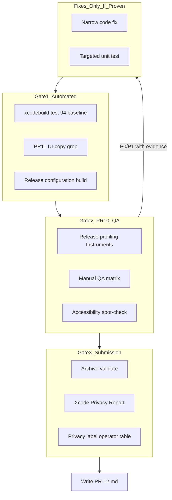

# PR12: Release Hardening and Submission Prep

## Baseline (PR11)

| Item | Value |
|------|-------|
| Tests | **94 passing** ([PR-11.md](docs/implementation/PR-11.md)) |
| Localization | **428** manual keys in [Localizable.xcstrings](CalSnap/Resources/Localizable.xcstrings); widget + test target membership done |
| Privacy manifest | [PrivacyInfo.xcprivacy](CalSnap/Resources/PrivacyInfo.xcprivacy) ships Health/Fitness, Photos/Videos, User Content + UserDefaults (CA92.1) |
| Widget | `CalSnapWidget` + App Group `group.com.calsnap.shared` |
| UITest target | **None** (manual QA + unit tests only for this PR) |

**Hard constraints (from request + [engineering-rules.md](docs/engineering-rules.md)):**
- No new features, no UI redesign, no SwiftData model changes
- Fix only bugs/compliance issues **provable** via tests, Release profiling, or documented manual QA
- Do not refactor pre-existing deferrals (e.g. `NWPathMonitor`/`DispatchQueue` in [MealScannerViewModel.swift](CalSnap/Features/MealScanner/MealScannerViewModel.swift), Info.plist `permissions.*` catalog wiring)

---

## Primary deliverable

Create **[docs/implementation/PR-12.md](docs/implementation/PR-12.md)** with four sections:

1. **Release checklist** — gate-by-gate pre-submission steps (automated + manual + archive)
2. **Bug list** — table: `ID | Severity | Area | Description | Evidence | Fix status`
3. **PR10 final QA validation** — each [technical-spec.md](docs/technical-spec.md) line 1400–1412 item mapped to pass/fail/waived + evidence
4. **App Store privacy & operator notes** — App Store Connect answers aligned to **actual runtime behavior** (below)

No other new markdown files unless a bug fix requires a one-line cross-reference.

### Documentation standards (required in PR-12.md)

**Every failed or waived QA item** must be a usable release record — not a vague pass/fail checkbox.

#### QA failure record (required for every non-pass)

| Field | Required content |
|-------|------------------|
| Screen / surface | e.g. Dashboard, Settings → Export, Meal scanner capture |
| Action sequence | Numbered steps to reproduce |
| Environment | Simulator **or** physical device (model); iOS version |
| Build config | Debug vs **Release** (Release required for perf items) |
| Expected | What should happen per spec or product intent |
| Actual | What happened instead |
| Repro scope | Simulator only / device only / both |

Passing items need only status + verification method (test name, grep clean, Instruments run id). Failures without this table are **incomplete** and block PR12 merge.

#### Waiver record (required for P2 and Waived items)

Any item not fixed in PR12 — including deferred spec items, doc-only mismatches, and known pre-existing patterns — must use:

| Field | Required content |
|-------|------------------|
| Severity | P2 or Waived |
| Issue | One-line description |
| Reason waived | Why fix is out of scope for PR12 |
| User impact | What the user experiences (or “none in normal use”) |
| App Review risk | Low / medium / high + one-sentence rationale |
| Next owner | Future PR or “post-v1 maintenance” |

Example waivers to anticipate: HealthKit height read type authorized but not fetched; Info.plist `permissions.*` catalog wiring (PR11 deferral); `NWPathMonitor`/`DispatchQueue` in scanner network check.

---

## Workflow



---

## Phase 1 — Automated regression gate

Run and record in PR-12.md §1:

```bash
# Unit tests (baseline: 94)
DEVELOPER_DIR=/Applications/Xcode.app/Contents/Developer \
  xcodebuild -scheme CalSnap -destination 'platform=iOS Simulator,name=iPhone 17' test

# PR11 UI-copy audit (from PR-11.md §7)
rg '(Text|Label|Button|Section|ContentUnavailableView|navigationTitle|accessibilityLabel|accessibilityHint)\("(Today|Delete|Cancel|...)' \
  CalSnap CalSnapWidget --glob '*.swift' || echo "PASS"

# Static perf hygiene triage (PR10 QA) — signals only, NOT proof
rg 'DateFormatter|NumberFormatter' CalSnap CalSnapWidget --glob '*.swift'
rg 'ForEach.*\.(sorted|filter)' CalSnap --glob '*.swift'
```

**Grep policy:** hits are **triage signals**, not automatic fix triggers. A grep match does not by itself justify a code change. Before filing a bug or editing code, confirm via **code review** (is it in `body`? is sort precomputed in VM?) or **Instruments** (body churn, scroll hitch). Record “grep hit → investigated → no action” in PR-12.md when cleared.

Also build **Release** (not Debug) for simulator/device:

```bash
xcodebuild -scheme CalSnap -configuration Release \
  -destination 'platform=iOS Simulator,name=iPhone 17' build
```

**Expected:** all green; any test/build failure becomes a bug-list entry with full **QA failure record** (see Documentation standards) before fixing.

---

## Phase 2 — Validate PR10 final QA checklist

Map each spec criterion to verification method and record pass/fail/waived in PR-12.md §3. PR11 already closed the **hardcoded strings** item; re-run grep as regression only.

**Manual matrix rule:** every flow/sheet row marked fail must include the full QA failure record (screen, steps, environment, build config, expected vs actual, simulator/device/both). Pass rows may cite verification method only.

| Spec criterion | Verification | Notes |
|----------------|--------------|-------|
| Cold launch &lt; 1.5s (iPhone 14+) | Release build on **physical device**; stopwatch or Instruments App Launch | [CalSnapApp.swift](CalSnap/App/CalSnapApp.swift) is minimal — flag only if measured &gt; 1.5s |
| No memory leaks | Instruments → Leaks, 5‑min happy path | Onboarding → log meal → dashboard scroll → settings |
| Dashboard scroll (Release, device) | SwiftUI template while scrolling [DashboardContentView.swift](CalSnap/Features/Dashboard/DashboardContentView.swift) / meal list | Watch body count / hitch rate |
| No formatter alloc in `body` | `rg` triage → code review if hit | Grep alone insufficient; confirm not in view `body` |
| Stable `Identifiable` list IDs | Code review + [DashboardViewModelTests.swift](CalSnapTests/DashboardViewModelTests.swift) meal sort | Re-verify `mealsByType` timestamp sort |
| No filter/sort inside `ForEach` | `rg` triage → code review if hit | Grep alone insufficient; confirm precomputed VM arrays |
| Gemini cancel on navigate away | Re-run `testCancelAnalysisResetsPhase` in [MealScannerViewModelTests.swift](CalSnapTests/MealScannerViewModelTests.swift) | `.onDisappear { cancelAnalysis() }` in [MealScannerView.swift](CalSnap/Features/MealScanner/MealScannerView.swift) |
| Sheets dismiss on swipe | Manual matrix (below) | Only add `interactiveDismissDisabled` if swipe loses user data |
| Keyboard avoidance | Manual on Forms | Settings, WeighIn, ManualMealEntry, onboarding steps |
| Hardcoded strings | PR11 grep | Regression gate |
| Privacy manifest complete | Xcode → Generate Privacy Report on archive | Compare to actual API use |
| Privacy nutrition labels accurate | Operator table §4 | Expand [PR-10.md](docs/implementation/PR-10.md) §8 with behavior audit |

### Manual QA matrix (combine PR10 §7 + PR11 §7 smoke)

Execute on simulator **and** spot-check critical paths on device (notifications, widget, Release perf):

| Flow | Pass criteria |
|------|---------------|
| Onboarding end-to-end | Profile → goals → HealthKit prompt → API keys → dashboard |
| Dashboard | Greeting, ring, macros, add meal, empty states |
| Meal scanner | Capture/analyze, manual entry, discard/save alerts, cancel mid-analysis |
| Settings | Profile save, HK toggles, notification toggles, CSV export share sheet, delete-all |
| Meal detail | Edit, share sheet, delete confirmation |
| Notifications | Weigh-in cold-launch sheet; daily-log tap → scanner ([NotificationManager.swift](CalSnap/Core/Services/NotificationManager.swift)) |
| Widget | Small + medium after log/delete/edit; updates after Settings target change without opening Dashboard |
| Siri | “Log a meal in CalSnap” → scanner ([OpenScannerIntent.swift](CalSnap/AppIntents/OpenScannerIntent.swift)) |
| VoiceOver | Ring, meal row, primary buttons speak **English copy**, not raw catalog keys |
| Dynamic Type XXXL | Dashboard + Settings readable (PR9 matrix) |
| Reduce Motion | Calorie ring spring disabled |

### Sheet / keyboard matrix (PR10 deferral closure)

| Sheet | File | Check |
|-------|------|-------|
| Weigh-in | [WeighInView.swift](CalSnap/Features/Progress/WeighInView.swift) | Swipe blocked while saving (`interactiveDismissDisabled`) |
| Plateau alert | [PlateauAlertSheet.swift](CalSnap/Features/Dashboard/PlateauAlertSheet.swift) | Swipe disabled (intentional) |
| Export CSV | [SettingsView.swift](CalSnap/Features/Settings/SettingsView.swift) `.sheet` + ShareSheet | Swipe dismiss OK (URL already written) |
| Share meal | [MealDetailView.swift](CalSnap/Features/MealLog/MealDetailView.swift) | Swipe dismiss OK |
| Custom analytics range | [AnalyticsView.swift](CalSnap/Features/Analytics/AnalyticsView.swift) | Revert on dismiss works |
| Food item editor | [MealScannerView.swift](CalSnap/Features/MealScanner/MealScannerView.swift) | No data loss on swipe |

---

## Phase 3 — Release-build profiling

Profile **Release** on a physical device (spec target: iPhone 14 class or newer):

1. **App Launch** — cold launch after kill; note time to interactive dashboard
2. **Leaks** — full happy path + repeated scanner open/close
3. **SwiftUI** — dashboard scroll with today’s meals populated

Document in PR-12.md: device model, iOS version, build config, measurements, and “no action” vs “fix filed” per finding. **Do not optimize** unless a metric clearly fails spec (e.g. launch &gt; 1.5s, visible scroll jank, leak with retain cycle evidence).

Apply [swiftui-performance](.agents/skills/swiftui-performance/SKILL.md) guidance when interpreting SwiftUI template output.

---

## Phase 4 — Accessibility verification

Audit-first using [swiftui-pro accessibility references](.agents/skills/swiftui-pro/references/accessibility.md):

- Re-run `testCalorieRingAccessibilityValue` — values now come from xcstrings via [CalorieRingAccessibility.swift](CalSnap/DesignSystem/Accessibility/CalorieRingAccessibility.swift); confirm English format unchanged
- VoiceOver spot-check on high-traffic surfaces (dashboard ring, meal rows, scanner primary actions)
- Icon-only buttons: confirm `Button("Label", systemImage:)` + `.labelStyle(.iconOnly)` pattern
- `accessibilityDifferentiateWithoutColor`: confidence/status not color-only ([ConfidenceBadge.swift](CalSnap/DesignSystem/Components/ConfidenceBadge.swift), calorie bands)

**Fix policy:** only release-blocking a11y failures (unlabeled primary control, raw localization key spoken, layout unusable at XXXL). Document non-blocking gaps as P2/deferred in bug list — do not expand scope to “every interactive element needs hint” unless a control is unusable.

---

## Phase 5 — Targeted tests (only for proven regressions)

**Default: 94 tests unchanged.** Add tests only when a bug is fixed or a gap is proven:

| Candidate area | When to add | Example |
|----------------|-------------|---------|
| [UserDataDeletionService.swift](CalSnap/Core/Services/UserDataDeletionService.swift) + widget | Delete-all leaves stale widget data | Assert `WidgetSyncService.clear()` side effect (Settings path already calls it) |
| [DataExportService.swift](CalSnap/Core/Services/DataExportService.swift) | Export corruption found | Extend [SettingsTests.swift](CalSnapTests/SettingsTests.swift) |
| Notification cold launch | Regression in tap routing | Extend [NotificationDailyLogTests.swift](CalSnapTests/NotificationDailyLogTests.swift) |
| Localization + a11y | `DesignSystemTests` drift from catalog | Update assertions to use `String(format: String(localized:), …)` not hardcoded English |

**Out of scope:** new `CalSnapUITests` target, snapshot SPM dependency, broad coverage drive.

---

## Phase 6 — App Store submission readiness

**Scope constraint:** this phase reconciles Privacy Report, entitlements, and operator documentation. It must **not** drift into metadata authoring (screenshots, marketing copy) or broad compliance refactors. Work stays in three buckets only: **manifest XML**, **operator notes in PR-12.md**, or **narrow code fix when runtime behavior is provably wrong**.

### Privacy mismatch resolution order

When Privacy Report, entitlements, plist strings, or App Store Connect answers disagree:

1. **Verify actual runtime behavior in code** (HealthKit read/write paths, photo/Gemini upload, widget App Group, notifications).
2. **Default fix:** update **PrivacyInfo.xcprivacy** and/or **PR-12.md operator notes** so declarations match behavior — not the reverse.
3. **Code fix only if** runtime behavior is incorrect (e.g. undeclared data collection, wrong API use) with concrete evidence (Privacy Report error, Instruments, repro steps).
4. **Do not** change runtime behavior to match an incorrect manifest or label assumption.

Examples:
- Height in HK auth types but never fetched → **operator note + waiver** (remove from auth types only if App Review rejects; otherwise document)
- Missing required-reason API in manifest → **add declaration** if API is actually used; do not add declarations for unused APIs
- Nutrition label says “Photos collected” but app only uses camera → fix **operator table**, not camera flow

### Archive validation

```bash
xcodebuild -scheme CalSnap -configuration Release \
  -destination 'generic/platform=iOS' archive -archivePath /tmp/CalSnap.xcarchive
# Validate in Xcode Organizer or `xcodebuild -exportArchive` if export plist exists
```

Confirm in PR-12.md §1:
- Bundle ID `com.calsnap.app` / widget `com.calsnap.app.widget`
- [Info.plist](CalSnap/Resources/Info.plist) usage strings match behavior
- [CalSnap.entitlements](CalSnap/Resources/CalSnap.entitlements): HealthKit + App Group; widget entitlements App Group only
- [AppIcon.appiconset](CalSnap/Resources/Assets.xcassets/AppIcon.appiconset/Contents.json) universal 1024 slot (PR9)
- Version `1.0` / build `1` — bump build only if resubmitting

### Privacy manifest vs runtime

Validate Privacy Report against code:

| Declared / entitled | Actual runtime |
|---------------------|----------------|
| HealthKit read: bodyMass, **height** (authorized in [HealthKitService.swift](CalSnap/Core/Services/HealthKitService.swift)) | **Only `fetchLatestWeight()` reads HK**; height requested in auth but not fetched — **waiver record** in PR-12.md; operator note only unless App Review rejects |
| HealthKit write | Meals (calories, protein, carbs, fat, fiber) when toggle on; bodyMass on weigh-in — gated by [AppStorageKey.healthKitWritesEnabled](CalSnap/Core/Utilities/Constants.swift) |
| Photos/Videos | Camera + PhotosPicker; JPEG stored in SwiftData `photoData`; sent to Gemini on user-initiated scan |
| User Content | Meal logs, weigh-ins, profile — local SwiftData only |
| UserDefaults CA92.1 | App Group widget sync + standard prefs |
| Network | Gemini HTTPS ([GeminiService.swift](CalSnap/Core/Services/GeminiService.swift)); USDA key stored in Keychain but **no USDA HTTP client in v1** — operator note only |
| Notifications | Local UNUserNotificationCenter only; no push server |
| Widget | Read-only App Group JSON; no network/HealthKit in extension |

If Privacy Report flags a **missing required-reason API**, add the declaration to the manifest when the API is **actually used** — do not declare APIs the app does not use. Do not change app code unless the runtime use itself is wrong.

---

## PR-12.md §4 — App Store privacy & operator checklist (content outline)

Expand [PR-10.md](docs/implementation/PR-10.md) §8 into operator-ready App Store Connect answers:

### Privacy Nutrition Labels (App Store Connect)

| Data type | Collected | Linked to identity | Used for tracking | Purpose | Operator notes |
|-----------|-----------|-------------------|-------------------|---------|----------------|
| Health & Fitness | Yes | No | No | App functionality | Weight read (optional sync); nutrition + weight writes when enabled |
| Photos/Videos | Yes | No | No | App functionality | Meal photos; camera/library; stored on device |
| User Content | Yes | No | No | App functionality | Meal logs, profile, weigh-ins — local only |

**Third-party / off-device (Review Notes + Privacy questionnaire free-text):**
- User-provided Gemini API key; meal **image + optional description** sent to Google Generative Language API on scan only
- No CalSnap backend; no account system; no ads/tracking (`NSPrivacyTracking` false)

### Capability-specific operator notes

| Capability | User-facing trigger | Data flow | Connect / Review fields |
|------------|----------------------|-----------|-------------------------|
| **HealthKit** | Onboarding + Settings toggles | Read weight; write macros/meals/weight | Select HealthKit; explain in Review Notes |
| **Camera / Photos** | Scanner capture / picker | Local storage + optional Gemini upload | Privacy labels + camera/plist strings |
| **Notifications** | Weigh-in schedule; optional daily log (default off) | Local scheduling only | Notification usage description already updated in PR10 |
| **Widget** | User adds widget | App Group read-only display | No extra privacy type; not a data collection surface |
| **Gemini** | Scan / API key test | HTTPS to Google; key in Keychain | Review Note: “Requires user-supplied Gemini API key” |
| **Export CSV** | Settings → Export | User-initiated temp file via share sheet | Not a new collection type; user-controlled export |
| **Delete all data** | Settings | SwiftData wipe + notification cancel + [WidgetSyncService.clear()](CalSnap/Core/Services/WidgetSyncService.swift) | Mention in privacy policy if published |

### Pre-submission operator checklist (non-code)

- [ ] App Store Connect app record created; bundle ID matches
- [ ] Privacy Nutrition Labels filled per §4 table
- [ ] App Privacy “Data Not Collected” **not** selected incorrectly
- [ ] Export compliance: app uses HTTPS only (Gemini); no custom encryption beyond OS
- [ ] Age rating questionnaire (health/nutrition app; no unrestricted web)
- [ ] Review Notes: Gemini API key required for meal scanning; demo account N/A (local-only)
- [ ] Screenshots + metadata (operator task — **out of code scope** for PR12)
- [ ] TestFlight smoke on device (optional but recommended)

---

## Bug severity taxonomy (PR-12.md §2)

| Severity | Definition | Action |
|----------|------------|--------|
| **P0** | Crash, data loss, App Store rejection, spec QA fail with evidence | Must fix in PR12 |
| **P1** | Broken core flow (scanner save, widget stale, notification routing) | Fix if proven; full QA failure record required |
| **P2** | Minor UX, doc mismatch, unused HK height read type | **Waiver record required**; fix only if trivial + proven |
| **Waived** | Spec item not met but accepted deferral (e.g. NWPathMonitor GCD, Info.plist catalog wiring) | **Waiver record required** — no fix in PR12 |

Start bug list empty at plan time; populate during execution. **No speculative fixes.**

P0/P1 bug-list rows must link to the QA failure record or test/profiling evidence. P2/Waived rows must include the full **waiver record** (reason, user impact, App Review risk, next owner).

---

## Explicit out of scope

- New features, UI redesign, design-token changes
- Full xcstrings / localization work (PR11 done)
- `CalSnapUITests` target or snapshot tests
- USDA API network integration
- Refactoring `NWPathMonitor`/`DispatchQueue` or `InteractivePopGestureDisabler` GCD usage
- Info.plist permission string catalog wiring (PR11 Track B deferral)
- Marketing assets (screenshots, app description copy)

---

## Recommended execution order

1. Automated gate (Phase 1) — establish green baseline
2. Manual QA matrix + sheet/keyboard checks (Phase 2)
3. Release profiling on device (Phase 3)
4. Accessibility spot-check (Phase 4)
5. Archive + Privacy Report (Phase 6)
6. Fix P0/P1 only + add narrow tests (Phase 5)
7. Re-run automated gate
8. Write [docs/implementation/PR-12.md](docs/implementation/PR-12.md) with all deliverables

---

## Files expected to change

| Path | Change |
|------|--------|
| [docs/implementation/PR-12.md](docs/implementation/PR-12.md) | **Create** — release checklist, bug list, QA validation, operator privacy notes |
| `CalSnapTests/*.swift` | **Only if** regression test added for a proven bug |
| `CalSnap/**/*.swift` | **Only if** narrow P0/P1 fix with evidence |
| [PrivacyInfo.xcprivacy](CalSnap/Resources/PrivacyInfo.xcprivacy) | **Only if** Privacy Report proves missing/incorrect API declaration |

**Acceptance for PR12 merge:**
- PR-12.md complete with all four deliverables
- 94+ tests passing (more only if new regression tests added)
- PR10 final QA checklist every row has documented status + evidence
- Every **fail** includes full QA failure record; every **P2/Waived** includes waiver record
- Grep hits either confirmed via review/Instruments or documented as cleared triage
- Privacy mismatches resolved manifest/operator-first unless runtime behavior is provably wrong
- No unproven code changes
