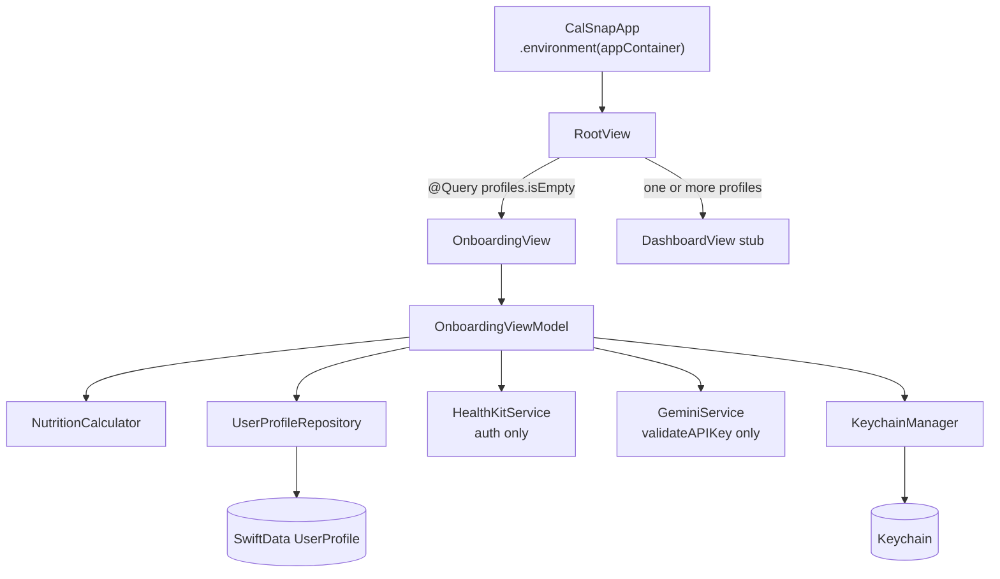
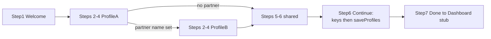

# PR2: User Profile & Onboarding Flow — Implementation Plan

**Sources:** [docs/technical-spec.md](docs/technical-spec.md) (PR 2 section), [docs/engineering-rules.md](docs/engineering-rules.md), PR1 baseline in [docs/implementation/PR-01.md](docs/implementation/PR-01.md)

**PR1 baseline already in repo:** SwiftData models, `NutritionCalculator`, `KeychainManager`, blank `RootView`, empty `AppContainer`, existing `CalSnap.xcodeproj`.

**Not part of this PR:** `docs/implementation/PR-02.md` — post-implementation documentation only; create/copy after code is complete and reviewed, not during the coding PR.

---

## Objective

Deliver a navigable 7-step onboarding wizard that creates one or two `UserProfile` records, persists them to SwiftData at end-of-flow, stores API keys in Keychain, requests HealthKit authorization, and routes returning users straight to a Dashboard placeholder.

---

## Resolved decisions

### Blocker A — Gemini SDK timing (approved spec deviation)

PR2 acceptance requires a test button that fires a trivial Gemini call. PR1/PR4 positioned the SDK in PR4. **Approved deviation:** pull forward `generative-ai-swift` SPM into PR2.

**PR2 Gemini scope (minimal):**

- Add `GeminiService` actor with `validateAPIKey(_:) async throws -> Bool` only
- Add minimal `GeminiError` cases needed for the validation flow
- Text-only trivial `generateContent` call using `AppConstants.Gemini.model`

**Explicitly not in PR2 `GeminiService`:**

- `analyzeMeal`
- Response schema
- Image handling
- Any PR4 meal-analysis logic

PR4 extends the **same** `GeminiService` actor.

### Decision C — USDA demo key

- Add `AppConstants.USDA.demoAPIKey = "DEMO_KEY"`
- Store custom USDA key in Keychain **only** if the user enters one
- Resolve at runtime: Keychain load first, else fallback to `AppConstants.USDA.demoAPIKey`
- Do not hardcode the demo key in the UI layer (use `APIKeyResolver`)

### Persistence timing (confirmed)

- **No mid-wizard saves**
- On Continue from step 6:
  1. `saveAPIKeys()` — Gemini to Keychain only if non-empty; USDA only if entered
  2. Call `saveProfiles(context:)`
  3. Advance to step 7 Done → Dashboard stub

### Project configuration workflow (confirmed)

- PR2 does **not** use xcodegen as part of the implementation workflow
- Configure **`CalSnap.xcodeproj` directly** (Xcode UI or targeted `project.pbxproj` edits)
- Do **not** include `project.yml` / `xcodegen generate` steps in this plan
- `project.yml` may exist from PR1 but is **not** part of PR2 workflow

PR2 project/config work is limited to:

- `CalSnap.entitlements` + HealthKit capability
- Info.plist HealthKit usage strings
- Register new source files in CalSnap / CalSnapTests targets
- Add `generative-ai-swift` SPM directly to the Xcode project (approved deviation)

### AppContainer / environment pattern (confirmed)

- **No custom `EnvironmentKey`**
- PR1 pattern only:
  - `CalSnapApp` injects with `.environment(appContainer)`
  - Views read with `@Environment(AppContainer.self)`
- `AppContainer` uses **concrete stored properties only** — no protocol-heavy DI graph

### Active profile handling (confirmed)

In `OnboardingViewModel`, `activeProfile` is a **computed binding** to `profileA` or `profileB` based on `currentProfileIndex` — never an independent copied struct.

### Repository scope (confirmed)

- `UserProfileRepository` allowed — thin, concrete struct
- Four methods only: `hasAnyProfile`, `fetchAll`, `save`, `makeUserProfile(from:)`
- No generalized repository architecture, protocol abstraction, or mock graph unless implementation proves absolutely necessary

### Open question B — Gemini key validation (resolved: skippable)

**Decision:** Gemini key is **skippable** during onboarding. User can finish onboarding without entering or validating a Gemini key; key can be added later (Settings in PR8).

**Step 6 behavior:**

- Continue is **always allowed** from step 6 (no requirement for non-empty key, successful test, or prior validation)
- Gemini secure field + Test button remain available for users who want to validate now
- `saveAPIKeys()` on Continue: write Gemini key to Keychain **only if** the field is non-empty; write USDA key **only if** entered (unchanged)
- If user skips Gemini key, nothing is written to `KeychainKey.geminiAPIKey`; meal scanning (PR4) remains gated by non-nil key per spec

### Supporting decisions (unchanged)

- **Unit conversion:** shared `UnitFormatters.swift` + thin `UserProfile+Display.swift`
- **Welcome vs Profile Setup names:** pre-fill step 2 from Welcome; allow edit

---

## Scope

### In scope

| Area | Deliverable |
|------|-------------|
| Onboarding UI | 7 steps per spec; steps 2–4 repeat per user when partner name provided |
| Launch gating | `RootView` routes on SwiftData profile existence only |
| Persistence | End-of-flow only via thin `UserProfileRepository` |
| Dual profile | Optional partner; save profile B only when name non-empty |
| Calorie preview | `NutritionCalculator`; deficit slider 250–500 (+750 with acknowledgment) |
| HealthKit | `HealthKitService.requestAuthorization()` only |
| Gemini | Approved SDK + `validateAPIKey` only; test button; key skippable on Continue |
| USDA key | Optional Keychain storage; runtime demo fallback |
| DI | `AppContainer` via PR1 environment pattern |
| Tests | Exactly 3 spec tests |

### Out of scope (strict)

- `docs/implementation/PR-02.md`
- Full `DashboardView` — **PR3** (stub only in PR2)
- Meal scanner UI, `analyzeMeal`, response schema — **PR4**
- `USDAService.search` — **PR4+**
- `HealthKitService` beyond authorization — **PR4–PR6**
- `MealRepository`, `WeighInRepository`
- Repository protocols, mock infrastructure, generalized persistence layer
- Design system — **PR9**
- Settings architecture — **PR8**
- Profile switcher UI — **PR3** (PR2 sets `@AppStorage("activeUserId")` to profile A UUID only)
- UI tests, snapshot tests, XCUITest
- Gemini/HealthKit network unit tests
- Camera/photo/notification permissions
- `project.yml` / xcodegen workflow steps

---

## Architecture



### Dual-user step loop (steps 2–4)



- `currentProfileIndex` (0 = A, 1 = B) drives steps 2–4.
- After step 4 for A: if partner name empty → step 5; else step 2 with index 1.
- `activeProfile` computed binding — all step 2–4 edits through `profileA` / `profileB`.

---

## AppContainer and environment

```swift
// CalSnapApp.swift
@State private var appContainer = AppContainer()
RootView()
    .environment(appContainer)

// RootView, OnboardingView, step views
@Environment(AppContainer.self) private var appContainer
```

- `RootView` does **not** re-inject or re-create `AppContainer`
- `OnboardingView` passes `appContainer` dependencies into `OnboardingViewModel` at init
- PR2 `AppContainer` properties (concrete): `healthKitService`, `geminiService`, `userProfileRepository`

---

## Files to create

| Path | Purpose |
|------|---------|
| `CalSnap/Features/Onboarding/OnboardingStep.swift` | Step enum |
| `CalSnap/Features/Onboarding/ProfileDraft.swift` | Draft struct + validation helpers |
| `CalSnap/Features/Onboarding/OnboardingViewModel.swift` | VM with computed `activeProfile` |
| `CalSnap/Features/Onboarding/OnboardingView.swift` | Step router |
| `CalSnap/Features/Onboarding/WelcomeStepView.swift` | Step 1 |
| `CalSnap/Features/Onboarding/ProfileSetupStepView.swift` | Step 2 |
| `CalSnap/Features/Onboarding/GoalSetupStepView.swift` | Step 3 |
| `CalSnap/Features/Onboarding/CalorieTargetPreviewStepView.swift` | Step 4 |
| `CalSnap/Features/Onboarding/HealthKitPermissionStepView.swift` | Step 5 |
| `CalSnap/Features/Onboarding/APIKeySetupStepView.swift` | Step 6 |
| `CalSnap/Core/Repositories/UserProfileRepository.swift` | Thin struct — 4 methods |
| `CalSnap/Core/Services/HealthKitService.swift` | `requestAuthorization()` only |
| `CalSnap/Core/Services/GeminiService.swift` | `validateAPIKey(_:)` + minimal `GeminiError` |
| `CalSnap/Core/Utilities/Extensions/UnitFormatters.swift` | Unit helpers |
| `CalSnap/Core/Models/UserProfile+Display.swift` | Display via formatters |
| `CalSnap/Core/Utilities/APIKeyResolver.swift` | Keychain resolution + USDA demo fallback |
| `CalSnap/Features/Dashboard/DashboardView.swift` | Stub only |
| `CalSnap/Resources/CalSnap.entitlements` | HealthKit |
| `CalSnapTests/OnboardingViewModelTests.swift` | 3 spec tests |

---

## Files to modify

| Path | Changes |
|------|---------|
| `CalSnap/App/RootView.swift` | `@Query` gating; `@Environment(AppContainer.self)` |
| `CalSnap/App/AppContainer.swift` | Concrete service + repository properties |
| `CalSnap/App/CalSnapApp.swift` | Initialize wired container; `.environment(appContainer)` |
| `CalSnap/Core/Utilities/Constants.swift` | `USDA.demoAPIKey`, onboarding bounds |
| `CalSnap/Core/Models/Enums.swift` | `ActivityLevel.systemImage` |
| `CalSnap/Resources/Info.plist` | HealthKit usage strings |
| `CalSnap.xcodeproj/project.pbxproj` | Files, entitlements, `generative-ai-swift` SPM |

**Do not modify:** `NutritionCalculator.swift`, meal/weigh-in models, PR1 tests, `project.yml`.

---

## File-by-file implementation notes

### `OnboardingViewModel.swift`

**Computed `activeProfile` (required):**

```swift
var activeProfile: ProfileDraft {
    get { currentProfileIndex == 0 ? profileA : profileB }
    set {
        if currentProfileIndex == 0 { profileA = newValue }
        else { profileB = newValue }
    }
}
```

**Key methods:**

- `canAdvance(from:)` — `testOnboardingValidation`
- `validateGoalTargetDate(_:)` — `testGoalDateMinimum`
- `validateDateOfBirth(_:)` — age 18–90
- `calculateTargets()` — `NutritionCalculator` for `activeProfile`
- `advance()` / `goBack()` — dual-user loop
- `saveProfiles(context:)` — once on step 6 Continue, after `saveAPIKeys()`
- `saveAPIKeys()` — write Gemini key only if non-empty; USDA only if entered
- `testGeminiKey(_:)` — `GeminiService.validateAPIKey` (optional; does not gate Continue)
- `requestHealthKit()` — non-blocking
- Step 6 Continue — **always allowed** (skippable Gemini key)

### `UserProfileRepository.swift`

```swift
struct UserProfileRepository {
    func hasAnyProfile(context: ModelContext) throws -> Bool
    func fetchAll(context: ModelContext) throws -> [UserProfile]
    func save(_ profile: UserProfile, context: ModelContext) throws
    func makeUserProfile(from draft: ProfileDraft) -> UserProfile
}
```

No protocols. No mock types. `makeUserProfile(from:)` used by save path and `testProfilePersistence`.

### `GeminiService.swift` (PR2 only)

- Actor with `validateAPIKey(_:) async throws -> Bool`
- Minimal `GeminiError` for validation flow
- Uses `generative-ai-swift` / `GoogleGenerativeAI`
- PR4 extends this actor — do not add meal-analysis types in PR2

### `HealthKitService.swift` (PR2 only)

- `requestAuthorization()` only
- Read/write type sets from spec; guard `isHealthDataAvailable()`

### `APIKeyResolver.swift`

```swift
// USDA: Keychain first, else AppConstants.USDA.demoAPIKey
// Gemini: Keychain load helper (no demo fallback)
```

### `RootView.swift`

- `@Query(sort: \UserProfile.createdAt) private var profiles`
- `profiles.isEmpty` → `OnboardingView()`
- One or more profiles → `DashboardView()` stub
- `@Environment(AppContainer.self)` — container from `CalSnapApp`, not re-injected

### `DashboardView.swift` (stub)

Placeholder only. No ring, macros, meals, FAB, profile switcher.

### `APIKeySetupStepView.swift`

- Gemini secure field + Test button + result indicator (optional for user)
- USDA optional field
- Continue always enabled; copy may note key can be added later in Settings

---

## PR2 unit tests only (exactly 3)

File: `CalSnapTests/OnboardingViewModelTests.swift`

| Test | Asserts |
|------|---------|
| `testOnboardingValidation()` | Empty `activeProfile.name` → `canAdvance` false; non-empty → true |
| `testGoalDateMinimum()` | 7 days out → rejected; 14+ days → accepted |
| `testProfilePersistence()` | In-memory container; `makeUserProfile(from:)` → save → fetch → fields match |

**Not in PR2:** UI tests, snapshot tests, HealthKit tests, Gemini network tests, extra validation tests, repository mocks.

---

## Implementation order

1. Project config in `CalSnap.xcodeproj`: entitlements, Info.plist, SPM, file registration
2. Core layer: formatters, resolver, repository, `HealthKitService`, minimal `GeminiService`
3. Wire `AppContainer` + `CalSnapApp`
4. `ProfileDraft`, `OnboardingStep`, `OnboardingViewModel` (skippable Gemini on step 6 Continue)
5. `OnboardingViewModelTests` — 3 tests green before UI
6. Step views + `OnboardingView`
7. `DashboardView` stub + `RootView` gating
8. Manual simulator QA (include skip-Gemini finish path)

---

## Acceptance criteria mapping

| Criterion | Implementation |
|-----------|----------------|
| Full onboarding navigable on simulator | 7 steps + dual-user loop |
| UserProfile(s) persisted on completion | `saveProfiles` once at end of step 6 |
| HealthKit authorization fires on step 5 | `requestAuthorization()` invoked |
| Gemini key in Keychain | Saved on step 6 Continue **only if** user entered a key (skippable) |
| Skip onboarding if profile exists | `RootView` `@Query` gating |
| PR2 unit tests pass | Exactly 3 tests |
| Gemini test button fires trivial call | Approved SDK + `validateAPIKey` (optional; does not block finish) |

---

## Assumptions (non-controversial)

- English-only copy in views
- Onboarding not re-enterable unless profiles deleted
- Partner shares app-level API keys and HealthKit authorization
- Simulator HealthKit: "fires" = `requestAuthorization` invoked
- Activity level icons use SF Symbols

## Risks

| Risk | Mitigation |
|------|------------|
| User skips Gemini key | Document in PR; PR4/PR8 gate meal scan / Settings key entry on non-nil Keychain key |
| Gemini SDK pull-forward | Validate-only service; document approved deviation in PR description |
| SwiftData in-memory test flakiness | `ModelConfiguration(isStoredInMemoryOnly: true)` |
| Dual-user navigation | Manual two-user QA checklist |
