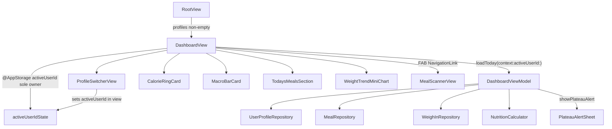

# PR3: Dashboard — Core Daily View — Implementation Plan

**Sources (conflict order):** [docs/technical-spec.md](docs/technical-spec.md) (PR 3 section), [docs/product-research.md](docs/product-research.md) (§14 Daily Dashboard, §13 plateau), [docs/engineering-rules.md](docs/engineering-rules.md), [docs/implementation/PR-02.md](docs/implementation/PR-02.md), PR1 baseline in [docs/implementation/PR-01.md](docs/implementation/PR-01.md)

**PR2 baseline already in repo:** `RootView` `@Query` gating, `DashboardView` stub with `@AppStorage(AppStorageKey.activeUserId)` + `@Query` profile resolution, `AppContainer` concrete services (`healthKitService`, `geminiService`, `userProfileRepository`), `UserProfile`/`MealEntry`/`WeighIn` models, `NutritionCalculator` (including `isOnPlateau`), `UnitFormatters`, onboarding persistence of profile A as active user.

**Not part of this PR:** `docs/implementation/PR-03.md` — create after implementation/review, not during coding.

---

## 1. Objective

Replace the PR2 `DashboardView` stub with the primary home screen: greeting + date, profile switcher, animated calorie ring, macro/fiber breakdown, today’s meals section (SwiftData-backed when data exists), 7-day weight sparkline, floating add button navigating to a minimal `MealScannerView` stub, and a plateau alert sheet when `NutritionCalculator.isOnPlateau` detects stagnation. Business logic lives in `DashboardViewModel`; views stay thin.

---

## 2. In scope

- **`DashboardViewModel`** — `@Observable @MainActor`; load today’s data, aggregate macros, progress color/remaining, plateau check + actions; **does not own active-user selection**
- **Thin repositories** — `MealRepository`, `WeighInRepository` (struct pattern matching `UserProfileRepository`; no protocols)
- **`AppContainer` wiring** — add `mealRepository`, `weighInRepository` as concrete stored properties
- **Dashboard UI components** (feature-local, not DesignSystem):
  - `ProfileSwitcherView`
  - `CalorieRingCard`
  - `MacroBarCard` (protein/carbs/fat bars + narrow fiber bar)
  - `TodaysMealsSection`
  - `WeightTrendMiniChart` (Swift Charts sparkline or empty state)
  - `PlateauAlertSheet`
- **`DashboardView` rewrite** — `NavigationStack`, scroll layout, FAB, sheet bindings, `@State` VM lifecycle matching `OnboardingView` pattern
- **`MealScannerView` stub** — placeholder only; navigation target for FAB
- **Plateau alert** — evaluate on load when ≥3 weigh-ins; sheet with Diet Break / Small Reduction / Dismiss (snooze)
- **Constants** — fiber target helper constant; AppStorage keys for plateau snooze + maintenance end date (per user)
- **Unit tests** — exactly three: `testDashboardCalcToday`, `testProgressColor`, `testRemaining`
- **`#Preview` on every new view file** — per engineering rules: `ProfileSwitcherView`, `CalorieRingCard`, `MacroBarCard`, `TodaysMealsSection`, `WeightTrendMiniChart`, `PlateauAlertSheet`, `MealScannerView`, and updated `DashboardView`
- **Xcode project** — register new files in `CalSnap.xcodeproj` directly (same PR2 maintenance rule; do not run xcodegen)

---

## 3. Out of scope

- Meal scanning, Gemini analysis, camera/PhotosUI (`MealScannerViewModel`, PR4)
- Meal logging CRUD, edit/delete, HealthKit dietary writes (PR4–PR5)
- `MealDetailView`, swipe-to-delete, meal row navigation (PR5)
- `WeighInView`, weekly reminder, full weight progress chart (PR6)
- Settings screen, persisted unit preference UI (PR8+)
- Design system pull-forward: `Colors.swift`, `Typography.swift`, `CalorieRingView` from PR9, snapshot/UI tests, accessibility test suite from PR9
- Widgets, notifications, analytics (PR10+)
- `UserProfile` schema changes unless blocker resolution explicitly approved during implementation
- PR4+ work of any kind

---

## 4. Issues / blockers to resolve before implementation

| # | Issue | Recommendation (proposed spec extension) | Decision needed? |
|---|-------|------------------------------------------|------------------|
| A | **Weight unit display** — PR2 onboarding `useLbsWeight` toggles are not persisted; spec says chart shows “lbs or kg” | PR3 uses **locale default**: `Locale.current.measurementSystem != .metric` → lbs via `UnitFormatters.formatWeight(kg:useLbs:)`. No Settings toggle in PR3. | No — document in PR description |
| B | **Plateau persistence** — spec actions (14-day maintenance, 2-week snooze) have no `UserProfile` fields | Store transient state in **AppStorage keyed by user UUID**: `plateauSnoozeUntil_{uuid}`, `maintenanceModeUntil_{uuid}`. Diet Break sets profile fields (see §7) + maintenance end date. `checkForPlateau()` **suppresses alert** while `maintenanceModeUntil > now`. Auto-reverting maintenance after 14 days is **not** PR3 scope (note for PR6/Settings). | No |
| C | **Meal row tap → MealDetailView** — listed in PR3 layout wireframe but `MealDetailView` is PR5 | PR3 rows are **display-only** (no navigation). Optional subtle disabled styling; no fake detail screen. | No |
| D | **Plateau detection is a PR3 proxy** — product-research frames plateau as **3 consecutive weekly weigh-ins**; PR6 introduces the weigh-in workflow | PR3 uses **`NutritionCalculator.isOnPlateau` on the last 3 recorded weigh-ins** (by date, any spacing) as a deliberate temporary proxy. Fresh users have zero records → plateau dormant. Manual QA seeds 3 plateau weigh-ins. PR6 replaces this with true weekly cadence + `testPlateauTriggeredOnSave`. | No |
| E | **Small Reduction “recalculates”** — spec text ambiguous | PR3: subtract **60 kcal** from `dailyCalorieTarget` (clamped to sex-based minimum), and **increase stored `deficitKcal` by the same delta** so `deficitKcal == tdee - dailyCalorieTarget` stays true. Update `updatedAt`. Do **not** re-run full TDEE pipeline (PR6 weigh-in recalc). | No |
| F | **Active profile ownership** — spec shows `loadToday(context:)` only; PR2 established `@AppStorage` in the view | **Proposed spec clarification:** keep method name but add parameter: `loadToday(context:activeUserId:)`. **`DashboardView` is sole owner** of `@AppStorage(AppStorageKey.activeUserId)`; VM never reads/writes `UserDefaults` for active user. View passes `activeUserId` on load; profile switch sets `@AppStorage` in the view, then reloads VM. | No |
| G | **`DashboardViewModel` `@MainActor`** — omitted in spec snippet | Match `OnboardingViewModel`: `@Observable @MainActor final class DashboardViewModel`. | No |
| H | **Plateau action field sync** — `UserProfile` stores `dailyCalorieTarget`, `deficitKcal`, and `updatedAt` together | Both plateau mutations must update **all three fields atomically** before `context.save()`. See §7 plateau action rules. | No |

---

## 5. Files to create

| Path | Purpose |
|------|---------|
| [CalSnap/Features/Dashboard/DashboardViewModel.swift](CalSnap/Features/Dashboard/DashboardViewModel.swift) | `@Observable @MainActor` VM: load, aggregate, progress, plateau, profile switch |
| [CalSnap/Features/Dashboard/ProfileSwitcherView.swift](CalSnap/Features/Dashboard/ProfileSwitcherView.swift) | Header control: static (1 profile) or `Menu` (2 profiles) |
| [CalSnap/Features/Dashboard/CalorieRingCard.swift](CalSnap/Features/Dashboard/CalorieRingCard.swift) | Circular progress ring + remaining kcal + goal subtitle + spring animation |
| [CalSnap/Features/Dashboard/MacroBarCard.swift](CalSnap/Features/Dashboard/MacroBarCard.swift) | Protein/carbs/fat segmented bars + fiber bar |
| [CalSnap/Features/Dashboard/TodaysMealsSection.swift](CalSnap/Features/Dashboard/TodaysMealsSection.swift) | Grouped meal list or empty state |
| [CalSnap/Features/Dashboard/WeightTrendMiniChart.swift](CalSnap/Features/Dashboard/WeightTrendMiniChart.swift) | Swift Charts 7-day sparkline or empty-state card |
| [CalSnap/Features/Dashboard/PlateauAlertSheet.swift](CalSnap/Features/Dashboard/PlateauAlertSheet.swift) | Sheet UI + action callbacks to VM |
| [CalSnap/Features/MealScanner/MealScannerView.swift](CalSnap/Features/MealScanner/MealScannerView.swift) | Minimal stub: title + “Coming in PR4” + dismiss |
| [CalSnap/Core/Repositories/MealRepository.swift](CalSnap/Core/Repositories/MealRepository.swift) | Fetch today’s meals for user |
| [CalSnap/Core/Repositories/WeighInRepository.swift](CalSnap/Core/Repositories/WeighInRepository.swift) | Fetch weigh-ins by 7-day date window (chart) and latest N by date (plateau proxy) |
| [CalSnapTests/DashboardViewModelTests.swift](CalSnapTests/DashboardViewModelTests.swift) | Three spec unit tests |

---

## 6. Files to modify

| Path | Change |
|------|--------|
| [CalSnap/Features/Dashboard/DashboardView.swift](CalSnap/Features/Dashboard/DashboardView.swift) | Full dashboard layout; `@State` VM; `NavigationStack`; FAB; plateau sheet |
| [CalSnap/App/AppContainer.swift](CalSnap/App/AppContainer.swift) | Add `mealRepository`, `weighInRepository` |
| [CalSnap/Core/Utilities/Constants.swift](CalSnap/Core/Utilities/Constants.swift) | `AppConstants.Nutrition.fiberGramsPer1000Kcal`; AppStorage key helpers for plateau/maintenance |
| [CalSnap.xcodeproj/project.pbxproj](CalSnap.xcodeproj/project.pbxproj) | Register all new Swift sources |

**Unchanged:** [CalSnap/App/RootView.swift](CalSnap/App/RootView.swift) keeps `@Query` onboarding gating; no custom EnvironmentKey.

---

## 7. File-by-file implementation notes

### Architecture overview



### `MealRepository.swift`

Thin struct (no protocol):

```swift
func fetchMeals(for userId: UUID, on calendarDay: Date, context: ModelContext) throws -> [MealEntry]
```

- Use `Calendar.current.startOfDay` for day bounds (`start...start+1day`)
- Predicate: `userId == userId && timestamp >= start && timestamp < end`
- Sort: `timestamp` ascending
- **No** insert/update/delete in PR3

### `WeighInRepository.swift`

Two methods — **date window for chart**, **latest-N for plateau proxy** (not interchangeable):

```swift
/// All weigh-ins for user with date in [startOfWindow, endOfReferenceDay], inclusive of calendar days.
func fetchWeighIns(
    for userId: UUID,
    from startOfWindow: Date,
    through endOfReferenceDay: Date,
    context: ModelContext
) throws -> [WeighIn]

/// Latest `count` weigh-ins by date ascending (for plateau proxy only).
func fetchLatestWeighIns(
    for userId: UUID,
    count: Int,
    context: ModelContext
) throws -> [WeighIn]
```

**Chart (`fetchWeighIns`):**
- Window = last **7 calendar days** inclusive: `start = calendar.startOfDay(for: referenceDate - 6 days)`, `end = calendar.startOfDay(for: referenceDate)` through end of that day (same pattern as `MealRepository` day bounds)
- Predicate: `userId == userId && date >= start && date < endPlusOneDay`
- Sort: `date` ascending
- Render whatever points exist in that window (0, 1, or many) — **not** “latest 7 records regardless of age”

**Plateau proxy (`fetchLatestWeighIns`):**
- Fetch all for user sorted by `date` ascending, return `suffix(count)` (default 3)
- Documented PR3 approximation until PR6 weekly cadence

### `Constants.swift`

Add to `AppConstants.Nutrition`:

```swift
static let fiberGramsPer1000Kcal: Double = 14.0  // product-research §14
```

Add to `AppStorageKey`:

```swift
static func plateauSnoozeUntil(userId: UUID) -> String
static func maintenanceModeUntil(userId: UUID) -> String
```

### `DashboardViewModel.swift`

**Dependencies (initializer, from `AppContainer`):**

- `UserProfileRepository`
- `MealRepository`
- `WeighInRepository`

**Stored properties (match spec + PR3 needs):**

| Property | Type | Notes |
|----------|------|-------|
| `activeProfile` | `UserProfile?` | Resolved on load |
| `profiles` | `[UserProfile]` | All profiles for switcher |
| `todaysMeals` | `[MealEntry]` | Today, active user |
| `todaysCalories` | `Int` | Sum of meal totals |
| `todaysProteinG` / `CarbsG` / `FatG` / `FiberG` | `Double` | Summed |
| `chartWeighIns` | `[WeighIn]` | Weigh-ins within last 7 **calendar days** (may be 0–N points) |
| `plateauWeighIns` | `[WeighIn]` | Latest 3 recorded (PR3 proxy; used only by `checkForPlateau`) |
| `showPlateauAlert` | `Bool` | Sheet binding |
| `isLoading` | `Bool` | Optional; brief load flash |

**Computed properties:**

| Property | Logic |
|----------|-------|
| `calorieProgress` | `Double(todaysCalories) / Double(activeProfile?.dailyCalorieTarget ?? 2000)` |
| `progressColor` | Map `calorieProgress` → system colors per spec thresholds (see below) |
| `remainingCalories` | `target - todaysCalories` (negative allowed for overages) |
| `macroTargets` | `NutritionCalculator.macroTargets(dailyCalories:proteinPct:carbsPct:fatPct:)` from active profile |
| `fiberTargetG` | `(Double(dailyCalorieTarget) / 1000.0) * AppConstants.Nutrition.fiberGramsPer1000Kcal` |
| `greeting` | Time-of-day prefix + `activeProfile?.name` |
| `formattedDate` | `Date.now` formatted with `.dateStyle = .full` |
| `useLbsForDisplay` | `Locale.current.measurementSystem != .metric` |
| `hasSecondProfile` | `profiles.count > 1` |

**Progress color thresholds (spec + product-research ±10% band):**

| Ratio | Color |
|-------|-------|
| `< 0.90` | `.green` |
| `0.90 ..< 1.10` | `.yellow` |
| `≥ 1.10` | `.red` |

Extract package-private/static helper for tests:

```swift
enum CalorieProgressBand { case under, onTrack, over }
static func progressBand(for ratio: Double) -> CalorieProgressBand
```

`progressColor` switches on `progressBand`.

**Active-user ownership rule:** `DashboardView` holds `@AppStorage(AppStorageKey.activeUserId)`. The VM **never** reads or writes `UserDefaults` for active user selection. Profile switcher callback updates `@AppStorage` in the view, then calls `loadToday(context:activeUserId:)`.

**Methods:**

```swift
func loadToday(context: ModelContext, activeUserId: String)
```

1. `profiles = try userProfileRepository.fetchAll(context:)`
2. Resolve `activeProfile`: if `UUID(uuidString: activeUserId)` matches a profile use it, else `profiles.first`
3. Guard let profile else return
4. `todaysMeals = try mealRepository.fetchMeals(for: profile.id, on: Date(), context:)`
5. Aggregate calories/macros from `todaysMeals` (single loop)
6. `chartWeighIns = try weighInRepository.fetchWeighIns(for: profile.id, from: sevenDayStart, through: Date(), context:)`
7. `plateauWeighIns = try weighInRepository.fetchLatestWeighIns(for: profile.id, count: AppConstants.Plateau.weeksToDetect, context:)`
8. `checkForPlateau(activeUserId: activeUserId)`

```swift
func checkForPlateau(activeUserId: String)
```

Suppress alert if **any** of:
- `maintenanceModeUntil_{uuid}` (AppStorage) > now
- `plateauSnoozeUntil_{uuid}` (AppStorage) > now

Then:
- If `plateauWeighIns.count < AppConstants.Plateau.weeksToDetect` (3) → `showPlateauAlert = false`; return
- `showPlateauAlert = NutritionCalculator.isOnPlateau(weighIns: plateauWeighIns)`

**Note:** PR3 plateau detection is a **proxy** using the last 3 recorded weigh-ins (any date spacing). PR6 replaces with consecutive weekly weigh-ins at save time.

```swift
func applyDietBreak(context: ModelContext, activeUserId: String)
func applySmallReduction(context: ModelContext, activeUserId: String)
func dismissPlateauAlert(activeUserId: String)
```

**Profile mutation rule (both actions):** always update `dailyCalorieTarget`, `deficitKcal`, and `updatedAt` together, then `try context.save()`. Do **not** wrap `context.save()` in `UserProfileRepository` — call directly in VM after in-memory mutation on the SwiftData model.

- **Diet Break:**
  - `dailyCalorieTarget = tdee`
  - `deficitKcal = 0` (maintenance — no deficit)
  - `updatedAt = Date()`
  - AppStorage: `maintenanceModeUntil_{uuid}` = now + 14 days
  - `showPlateauAlert = false`

- **Small Reduction** (product-research recommends ~50–75 kcal; spec uses 60):
  - `let minimum = sex-based floor from AppConstants.Deficit`
  - `let previousTarget = dailyCalorieTarget`
  - `dailyCalorieTarget = max(minimum, previousTarget - 60)`
  - `deficitKcal = tdee - dailyCalorieTarget` (stored deficit increases by the actual target reduction delta)
  - `updatedAt = Date()`
  - `showPlateauAlert = false`

- **Dismiss:**
  - AppStorage: `plateauSnoozeUntil_{uuid}` = now + 14 days
  - `showPlateauAlert = false`

**No `switchUser(to:)` on VM.** Profile switch is view-owned:

```swift
// DashboardView — ProfileSwitcherView callback
activeUserId = profile.id.uuidString
viewModel?.loadToday(context: modelContext, activeUserId: activeUserId)
```

### `DashboardView.swift`

- Replace stub body with `NavigationStack` + `ScrollView`
- **Toolbar / header:** trailing `ProfileSwitcherView`
- **Sections (top → bottom):** greeting+date, `CalorieRingCard`, `MacroBarCard`, `TodaysMealsSection`, `WeightTrendMiniChart`
- **FAB:** `ZStack` overlay — circular `+` button → `NavigationLink { MealScannerView() }` (or `navigationDestination`)
- **VM lifecycle** (mirror [OnboardingView.swift](CalSnap/Features/Onboarding/OnboardingView.swift)):
  - `@Environment(AppContainer.self)`, `@Environment(\.modelContext)`
  - `@AppStorage(AppStorageKey.activeUserId) private var activeUserId` — **sole owner of active-user state**
  - `@State private var viewModel: DashboardViewModel?`
  - `onAppear` create VM from `appContainer` repos
  - `.onAppear` + `.onChange(of: activeUserId)` → `viewModel?.loadToday(context: activeUserId: activeUserId)`
- **Sheet:** `.sheet(isPresented: $viewModel.showPlateauAlert)` → `PlateauAlertSheet`; pass `activeUserId` into action callbacks
- Remove inline `activeProfile` computed property from view — VM is source of truth after load; switcher reads `viewModel.profiles` + `viewModel.activeProfile`
- `#Preview`: in-memory container with one `UserProfile` from onboarding-like seed

### `ProfileSwitcherView.swift`

- **1 profile:** `HStack` with initials circle (`profile.name.prefix(1).uppercased()`) + name; no chevron; not tappable
- **2 profiles:** `Menu` label = same HStack + chevron; menu items = both profiles with checkmark on active; action → `onSwitch(profile)` (view sets `@AppStorage`, then reloads VM — **does not call VM switch method**)
- iPhone-native, top-trailing placement via toolbar
- **`#Preview`:** single-profile and dual-profile variants

### `CalorieRingCard.swift`

- Inputs: `consumed`, `target`, `remaining`, `progress`, `progressColor`
- `Circle().trim(from:0, to: progress.clamped 0...1)` stroke with `progressColor`
- Center: large bold `remaining` (can show negative with “over” styling if desired — tests cover negative remaining)
- Subtitle: `"of \(target) kcal goal"`
- `.animation(.spring(response: 0.6, dampingFraction: 0.8), value: progress)` on appear and updates
- **`#Preview`:** sample consumed/target values at under/on-track/over ratios

### `MacroBarCard.swift`

- Three horizontal `ProgressView` or custom rounded rects: protein / carbs / fat
- Label: `"Protein  \(Int(consumed))g / \(Int(target))g"` per macro
- Narrow fiber bar below using `fiberTargetG`
- Plain system styling; no PR9 `MacroBarView`
- **`#Preview`:** sample macro consumed/target values + fiber bar

### `TodaysMealsSection.swift`

**PR3 meal list semantics:**

- **Real SwiftData-backed list** when `todaysMeals` non-empty (supports future PR4 logs and test seeding)
- **Empty state** for fresh post-onboarding users: icon + “No meals logged today” + “Tap + to scan your first meal”
- Group meals by `MealType` in order: breakfast, lunch, dinner, snack (only sections with meals)
- Row content: SF Symbol by meal type, `timestamp` formatted `.shortened`, `totalCalories`, optional 44pt thumbnail from `photoData`
- **No tap action** (MealDetailView deferred to PR5)
- **`#Preview`:** empty state and populated grouped-meal variants

### `WeightTrendMiniChart.swift`

- **Use Swift Charts** (`import Charts`) — Apple framework, no new SPM dep; aligns with PR6 direction
- Input: `chartWeighIns` from VM (7-**day calendar window**, not latest-7-by-count)
- **≥ 2 points in window:** `Chart` with `LineMark` + `PointMark`; Y = weight converted per `useLbs`; X = date
- **0–1 points in window:** compact card — show `formatWeight(startingWeightKg)` from profile + copy “Your weight trend will appear after weekly weigh-ins”
- Do not fabricate weigh-in points from `startingWeightKg` on the chart (avoids misleading trend)
- **`#Preview`:** empty-state card and multi-point chart variants

### `PlateauAlertSheet.swift`

- Title explaining plateau (weight stable ~3 weeks)
- Three buttons wired to VM actions:
  1. **Diet Break** — eat at maintenance 2 weeks
  2. **Small Reduction** — reduce target by 60 kcal
  3. **Dismiss** — remind me later (2-week snooze)
- Plain `.sheet` presentation
- **`#Preview`:** sheet content in isolation (`.sheet` preview or standalone VStack wrapper)

### `MealScannerView.swift`

Minimal stub only:

```swift
struct MealScannerView: View {
    var body: some View {
        VStack(spacing: 16) {
            Image(systemName: "camera.viewfinder").font(.largeTitle)
            Text("Meal Scanner")
            Text("Coming in PR4")
                .foregroundStyle(.secondary)
        }
        .navigationTitle("Scan Meal")
        .navigationBarTitleDisplayMode(.inline)
    }
}
```

No camera permissions, no ViewModel, no Gemini.
- **`#Preview`:** wrapped in `NavigationStack`

### `AppContainer.swift`

```swift
let mealRepository = MealRepository()
let weighInRepository = WeighInRepository()
```

No `DashboardViewModel` singleton — created per-view like onboarding.

---

## 8. Tests

**File:** [CalSnapTests/DashboardViewModelTests.swift](CalSnapTests/DashboardViewModelTests.swift)

Pattern: `@MainActor`, in-memory `ModelContainer`, `@testable import CalSnap`.

| Test | Setup | Assert |
|------|-------|--------|
| `testDashboardCalcToday()` | Insert 1 profile + 3 `MealEntry` for same `userId` today with known totals | After `loadToday(context:activeUserId: profile.id.uuidString)`, totals equal sum of entries |
| `testProgressColor()` | Set `activeProfile` with target 2000; vary `todaysCalories` to ratios 0.89, 0.95, 1.15 | `progressBand(for:)` → `.under`, `.onTrack`, `.over` respectively |
| `testRemaining()` | Target 2000, consumed 2300 | `remainingCalories == -300` |

PR1 (`NutritionCalculatorTests`, `KeychainManagerTests`) and PR2 (`OnboardingViewModelTests`) must still pass.

**Not adding:** snapshot tests, UI tests, plateau action persistence tests, repository integration tests beyond VM (unless implementation reveals fragility — justify before adding).

---

## 9. Acceptance criteria mapping

| Spec acceptance criterion | Satisfied by |
|---------------------------|--------------|
| Dashboard renders with real data from onboarding-created profile | `loadToday` reads persisted `UserProfile`; ring/macros use `dailyCalorieTarget` + macro fractions |
| Calorie ring animates on load | `CalorieRingCard` spring animation on `progress` |
| Profile switcher functional with 2 users | `Menu` updates view-owned `@AppStorage` + `loadToday(context:activeUserId:)` reload |
| FAB navigates to MealScannerView (stub OK) | `NavigationStack` + `MealScannerView` placeholder |
| Plateau alert fires when detected | `checkForPlateau()` + sheet; QA with 3 seeded plateau weigh-ins |

| Spec test requirement | Satisfied by |
|-----------------------|--------------|
| `testDashboardCalcToday()` | Meal aggregation via `loadToday` |
| `testProgressColor()` | `progressBand(for:)` boundary tests |
| `testRemaining()` | Negative remaining on overage |

---

## 10. Risks / edge cases

| Risk | Mitigation |
|------|------------|
| Stale dashboard after profile switch | View sets `@AppStorage`; `.onChange(of: activeUserId)` reloads VM |
| `activeUserId` points to deleted/missing UUID | VM fallback to `profiles.first` when resolving in `loadToday` |
| Empty meals after onboarding | Empty state, zeros in ring (0% progress green) |
| Zero weigh-ins in 7-day window | Chart empty state; plateau dormant until ≥3 total records |
| Plateau proxy vs PR6 weekly cadence | Documented spec extension; PR3 uses last 3 records, not weekly spacing |
| Plateau reappears during maintenance | `checkForPlateau` suppresses while `maintenanceModeUntil > now` |
| `dailyCalorieTarget` / `deficitKcal` drift after plateau actions | Both actions update target + deficit + `updatedAt` atomically |
| Maintenance mode never auto-expires | Document limitation; PR6/Settings can restore deficit |
| Small reduction below safe minimum | Clamp target to sex-based floor; recompute `deficitKcal = tdee - target` |
| Swift Charts with 1 data point in window | Empty-state branch, not a broken chart |
| xcodegen wipes project | Edit `CalSnap.xcodeproj` only; same README warning as PR2 |

---

## 11. Definition of done

- [ ] Full dashboard layout replaces stub with all PR3 sections
- [ ] `DashboardViewModel` owns aggregation, progress, plateau; view owns `@AppStorage` profile switch
- [ ] `MealRepository` + `WeighInRepository` added; wired in `AppContainer`
- [ ] Profile switcher works for 1 and 2 profiles via `@AppStorage`
- [ ] Calorie ring animates; macro + fiber bars render
- [ ] Today’s meals: SwiftData list when data exists; empty state otherwise
- [ ] Weight sparkline uses Swift Charts for weigh-ins in the **last 7 calendar days**; sensible empty state when <2 points in window
- [ ] Plateau sheet presents; actions update `dailyCalorieTarget`, `deficitKcal`, `updatedAt` together; maintenance/snooze suppress re-alert
- [ ] `#Preview` on every new view file (engineering-rules compliance)
- [ ] FAB pushes `MealScannerView` stub
- [ ] Exactly three new unit tests in `DashboardViewModelTests`
- [ ] All unit tests pass: `DEVELOPER_DIR=/Applications/Xcode.app/Contents/Developer xcodebuild -scheme CalSnap -destination 'platform=iOS Simulator,name=iPhone 16' test`
- [ ] No PR4+ features, no DesignSystem pull-forward

---

## 12. Suggested implementation order

1. Extend `Constants.swift` (fiber constant + AppStorage key helpers)
2. Implement `MealRepository` + `WeighInRepository` (date-window + latest-N APIs)
3. Wire repositories into `AppContainer`
4. Implement `DashboardViewModel` core: `loadToday`, aggregation, computed progress/remaining, `progressBand` helper
5. Add `DashboardViewModelTests` (TDD-friendly: tests green before UI)
6. Implement plateau methods + `checkForPlateau`
7. Build dashboard subviews: `CalorieRingCard`, `MacroBarCard`, `TodaysMealsSection`, `WeightTrendMiniChart`, `ProfileSwitcherView`, `PlateauAlertSheet`
8. Rewrite `DashboardView` with `NavigationStack`, VM lifecycle, FAB, sheet
9. Add `MealScannerView` stub
10. Register files in `CalSnap.xcodeproj`; build & run full test suite
11. Manual QA: single/dual profile switch; empty dashboard post-onboarding; seeded meals + weigh-ins + plateau

---

## 13. Suggested commit sequence

1. **`feat: add MealRepository, WeighInRepository, and dashboard constants`**
2. **`feat: add DashboardViewModel with load, aggregation, and plateau logic`**
3. **`test: add DashboardViewModelTests (calc, progress color, remaining)`**
4. **`feat: add dashboard UI components (ring, macros, meals, weight chart, switcher)`**
5. **`feat: rewrite DashboardView with FAB navigation and plateau sheet`**
6. **`feat: add MealScannerView stub for PR4 navigation target`**

---

## 14. PR description snippet

> **PR3: Dashboard — core daily view**
>
> Replaces the PR2 dashboard stub with the full home screen: profile switcher, greeting, calorie ring, macro/fiber breakdown, today’s meals (SwiftData-backed or empty state), 7-day weight sparkline (Swift Charts), plateau alert sheet, and FAB → MealScannerView stub.
>
> **Spec extensions / reconciliations:**
> - Thin `MealRepository` + `WeighInRepository` added (spec directory) without protocol DI; wired via `AppContainer` like PR2 services.
> - `loadToday(context:activeUserId:)` — view owns `@AppStorage`; VM does not read/write active user from UserDefaults.
> - `@MainActor` on `DashboardViewModel` (matches `OnboardingViewModel`; spec snippet omitted it).
> - Weight chart uses weigh-ins from the **last 7 calendar days**, not the latest 7 records by count.
> - Plateau detection is a **PR3 proxy**: last 3 recorded weigh-ins (any spacing); PR6 adds true weekly cadence.
> - Plateau actions update `dailyCalorieTarget`, `deficitKcal`, and `updatedAt` together; maintenance mode suppresses re-alert until expiry.
> - Weight display uses locale default (lbs vs kg); onboarding imperial toggles remain non-persisted until Settings.
> - Plateau snooze + maintenance end dates stored in AppStorage keyed by user UUID (no model schema change).
> - Meal rows display-only; `MealDetailView` navigation deferred to PR5.
> - Diet break sets target to TDEE + `deficitKcal = 0`; small reduction subtracts 60 kcal from target and increases stored deficit accordingly.
> - Auto-revert maintenance after 14 days deferred to later PR.
> - `#Preview` on all new view files per engineering rules.
> - Project files registered in `CalSnap.xcodeproj` (do not run xcodegen).
>
> **Test plan:**
> - `xcodebuild -scheme CalSnap -destination 'platform=iOS Simulator,name=iPhone 16' test`
> - Manual: complete onboarding → empty dashboard; dual-user switch; seed 3 meals + verify totals; seed 3 plateau weigh-ins → alert + actions.
