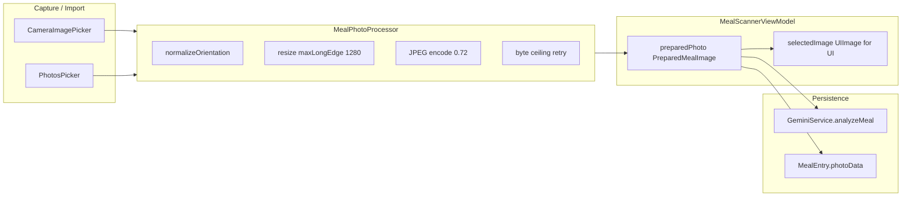

# PR4 Image Storage Addendum Implementation

## Context

PR4 already persists meal photos via `MealEntry.photoData` and hardens orientation + in-memory downsampling, but the policy is incomplete:

| Area | Current ([`MealScannerViewModel.swift`](CalSnap/Features/MealScanner/MealScannerViewModel.swift)) | Addendum target |
|------|------|-----------------|
| Max long edge | 1536 px | 1280 px |
| JPEG quality | 0.82 | initial 0.72 (tunable after validation) |
| Byte budget | none | preferred ≤500 KB, soft ≤750 KB, hard ≤1 MB with retry |
| Pipeline | `jpegData` re-run in `analyze()` and `makeMealEntry()` | one `PreparedMealImage` reused for Gemini + persistence |
| Location | static helpers on ViewModel | dedicated `MealPhotoProcessor` |

Your draft in [`pr4-image-storage-addendum.md`](pr4-image-storage-addendum.md) is the spec; this plan implements it as a **PR4 addendum**, not a later PR.

## Target architecture



**One-asset rule:** `preparedPhoto.data` is the only bytes sent to Gemini and written to SwiftData. No second persisted copy. UI keeps a decoded `UIImage` for preview only.

## Storage policy guardrails

These tighten the addendum spec and must appear in both implementation and [`docs/implementation/PR-04-addendum-image-storage.md`](docs/implementation/PR-04-addendum-image-storage.md):

- **Initial JPEG quality target: 0.72, tunable after validation.** Constants live in `AppConstants.MealPhoto`; adjust only after manual Gemini accuracy QA, not ad hoc in call sites.
- **Quality and dimension floors.** Do not reduce below the minimum visual-quality threshold or minimum long edge unless needed for hard-cap enforcement. Retry steps may tighten quality and/or long edge only when `byteCount > hardMaxBytes`; otherwise stay at initial quality and do not upscale small inputs.
- **Canonical output format.** Persisted photo format is always JPEG (`mimeType == "image/jpeg"`), regardless of input source format (HEIC, PNG, camera JPEG, etc.).
- **Edit-path reuse.** Editing an existing meal reuses the already-optimized stored image unless the user selects a new photo. `loadForEditing` wraps existing `photoData` via `prepared(fromPersistedJPEG:)` with no re-encode; `makeMealEntry()` / `updateMeal` writes the same bytes back unless `setSelectedPhoto(from:)` ran during this session.

## Implementation steps

### 1. Add policy constants

Extend [`CalSnap/Core/Utilities/Constants.swift`](CalSnap/Core/Utilities/Constants.swift) with `AppConstants.MealPhoto`:

- `maxLongEdgePx = 1280`
- `minLongEdgePx` — floor for hard-cap retries only (suggest 896; do not upscale inputs below `maxLongEdgePx`)
- `initialJPEGQuality = 0.72` — tunable after validation
- `minJPEGQuality` — visual-quality floor for hard-cap retries only (suggest 0.5)
- `preferredMaxBytes = 500_000`
- `softMaxBytes = 750_000`
- `hardMaxBytes = 1_000_000`
- `outputMIMEType = "image/jpeg"` — always persisted regardless of input format
- Retry steps for hard-cap enforcement only: lower quality toward `minJPEGQuality`, then reduce long edge toward `minLongEdgePx`; never go below floors except as last resort to satisfy `hardMaxBytes`

Keep magic numbers out of the processor body so tests can reference the same constants.

### 2. Create `MealPhotoProcessor`

**New file:** [`CalSnap/Core/Utilities/MealPhotoProcessor.swift`](CalSnap/Core/Utilities/MealPhotoProcessor.swift)

```swift
struct PreparedMealImage: Sendable {
    let data: Data
    let mimeType: String      // "image/jpeg"
    let pixelWidth: Int
    let pixelHeight: Int
    let byteCount: Int
}

enum MealPhotoProcessor {
    static func prepareForAnalysisAndStorage(_ image: UIImage) throws -> PreparedMealImage
}
```

**Required behavior (move logic from ViewModel static helpers):**

1. Normalize orientation (current `normalizedImage` logic)
2. Resize only when long edge exceeds `maxLongEdgePx` — **never upscale** small images; preserve aspect ratio
3. JPEG-encode at `initialJPEGQuality` (0.72); output is always JPEG regardless of input format (HEIC, PNG, etc.)
4. If `byteCount > hardMaxBytes`, retry with progressively tighter quality (down to `minJPEGQuality`) and/or smaller max long edge (down to `minLongEdgePx`) until under hard cap; do not reduce below floors unless required to satisfy the hard cap (throw only if all steps fail)
5. Return `PreparedMealImage` with dimensions derived from the final encoded bitmap

Add a small helper to wrap **already-persisted** bytes for edit/re-analyze paths:

```swift
static func prepared(fromPersistedJPEG data: Data) -> PreparedMealImage?
```

Used when loading an existing meal photo without re-encoding (backward compatibility; no migration/backfill).

Register the file in [`CalSnap.xcodeproj/project.pbxproj`](CalSnap.xcodeproj/project.pbxproj).

### 3. Refactor `MealScannerViewModel`

In [`CalSnap/Features/MealScanner/MealScannerViewModel.swift`](CalSnap/Features/MealScanner/MealScannerViewModel.swift):

- Add `var preparedPhoto: PreparedMealImage?`
- Add `func setSelectedPhoto(from image: UIImage)` that runs the processor once, sets `preparedPhoto`, and sets `selectedImage = UIImage(data: preparedPhoto.data)` for UI
- **`analyze()`** — build `MealAnalysisRequest` from `preparedPhoto.data` / `preparedPhoto.mimeType`; do not call `jpegData` again
- **`makeMealEntry()`** — set `photoData: preparedPhoto?.data`; no re-encode
- **`loadForEditing(meal:)`** — reuse already-optimized stored image: if `meal.photoData` exists, set `preparedPhoto = MealPhotoProcessor.prepared(fromPersistedJPEG:)` and decode `selectedImage` for display; **no re-encode**; legacy oversized photos pass through unchanged until user picks a new photo
- **`setSelectedPhoto(from:)`** — only path that runs the full processor; replaces `preparedPhoto` when user captures or imports a new image (including during edit if photo replacement is ever enabled)
- **`discard()` / `reAnalyze()`** — clear `preparedPhoto`
- Remove `jpegData`, `resizedForAnalysis`, and `normalizedImage` from the ViewModel (owned by processor)

`canAnalyze` continues to gate on `selectedImage != nil` (or `preparedPhoto != nil`—equivalent after refactor).

### 4. Update capture/import call sites

In [`CalSnap/Features/MealScanner/MealScannerView.swift`](CalSnap/Features/MealScanner/MealScannerView.swift), replace:

```swift
MealScannerViewModel.resizedForAnalysis(image)
MealScannerViewModel.normalizedImage(image)
```

with `viewModel.setSelectedPhoto(from: image)` (handle processor failure by clearing selection and surfacing `.unrecognizable` or a capture-level error as today).

No changes needed to downstream consumers that decode `photoData`:

- [`MealRowView.swift`](CalSnap/Features/MealLog/MealRowView.swift) — thumbnails
- [`MealDetailView.swift`](CalSnap/Features/MealLog/MealDetailView.swift) — detail + share
- [`MealRepository.swift`](CalSnap/Core/Repositories/MealRepository.swift) — unchanged API

### 5. Tests

**New file:** [`CalSnapTests/MealPhotoProcessorTests.swift`](CalSnapTests/MealPhotoProcessorTests.swift)

| Test | Assertion |
|------|-----------|
| `testPrepareMealPhotoNormalizesOrientation` | Rotated source → decoded output has `.up` orientation and expected aspect |
| `testPrepareMealPhotoDownsamplesLargeImage` | e.g. 4000×3000 input → `max(pixelWidth, pixelHeight) <= 1280` |
| `testPrepareMealPhotoUsesJPEGMimeType` | `mimeType == "image/jpeg"` |
| `testPrepareMealPhotoEnforcesHardByteCeiling` | noisy/large synthetic image → `byteCount <= hardMaxBytes` |
| `testPrepareMealPhotoDoesNotUpscaleOrBloatSmallImage` | small input (e.g. 200×200) → output dimensions unchanged (no upscale); `byteCount` stays modest (no unnecessary re-encode bloat vs. reasonable JPEG at initial quality) |

**Update** [`CalSnapTests/MealScannerViewModelTests.swift`](CalSnapTests/MealScannerViewModelTests.swift):

- Add `testMealEntryCreationStoresPreparedPhotoData` — set photo via `setSelectedPhoto`, assert `makeMealEntry().photoData` equals `preparedPhoto.data` and is ≤ hard cap
- Update `testMealEntryCreation` / analyze tests if they assume old encoding path

Register `MealPhotoProcessorTests.swift` in `project.pbxproj`.

**Verification command** (unchanged from PR-04):

```bash
DEVELOPER_DIR=/Applications/Xcode.app/Contents/Developer xcodebuild -scheme CalSnap -destination 'platform=iOS Simulator,name=iPhone 17' test
```

### 6. Documentation (PR4 addendum)

1. **Relocate spec** — move [`pr4-image-storage-addendum.md`](pr4-image-storage-addendum.md) → [`docs/implementation/PR-04-addendum-image-storage.md`](docs/implementation/PR-04-addendum-image-storage.md) and link it from [`docs/implementation/PR-04.md`](docs/implementation/PR-04.md).
2. **Patch PR-04.md** with:
   - Expanded objective: storage-optimized local meal-photo persistence
   - New in-scope bullets (processor, byte budget, shared pipeline, JPEG-only output, edit-path reuse)
   - New file row for `MealPhotoProcessor.swift` + `MealPhotoProcessorTests.swift`
   - Key implementation section: meal photo storage policy including guardrails (initial quality 0.72 tunable after validation, quality/dimension floors, always-JPEG output, edit reuse)
   - Additional acceptance criteria + test rows (including `testPrepareMealPhotoDoesNotUpscaleOrBloatSmallImage`)
   - Post-hardening row documenting migration from 1536/0.82 ad-hoc encode to addendum policy
3. **Update addendum text** when relocating — replace "Default compression quality target: 0.72" with "Initial JPEG quality target: 0.72, tunable after validation"; add floor, always-JPEG, and edit-reuse bullets to storage policy and acceptance criteria

Optional follow-up (out of this PR scope per addendum): a one-line cross-reference in [`docs/technical-spec.md`](docs/technical-spec.md) under `MealEntry.photoData` pointing to the addendum.

## Acceptance criteria (measurable)

- New captures/imports are normalized, downsampled only when long edge > 1280 px, JPEG-encoded, and persisted as a single optimized copy
- Persisted format is always JPEG regardless of input source format (HEIC, PNG, etc.)
- Persisted bytes from new meals are ≤1 MB hard cap in unit tests; typical images target ≤500 KB; quality/dimension floors respected unless hard-cap retry requires going lower
- Small images are not upscaled or unnecessarily bloated (`testPrepareMealPhotoDoesNotUpscaleOrBloatSmallImage`)
- Gemini analysis uses the same `preparedPhoto.data` as persistence (no second encode path)
- Dashboard thumbnails, meal detail, and share still render from stored `photoData`
- Edit flow reuses already-optimized `photoData` without re-encoding unless the user selects a new photo
- No SwiftData schema change; `MealRepository.save` unchanged

## Explicitly out of scope

Per the addendum: storage management UI, legacy photo backfill/compaction, separate thumbnail persistence, cloud sync, export/backup.

## Risk note (exception rule)

If manual QA shows Gemini accuracy drops materially at 1280/0.72, the addendum allows a **temporary larger in-memory analysis asset** only—persisted bytes must still follow the storage policy. Do not implement this unless testing proves it necessary; default is strict single-pipeline.
