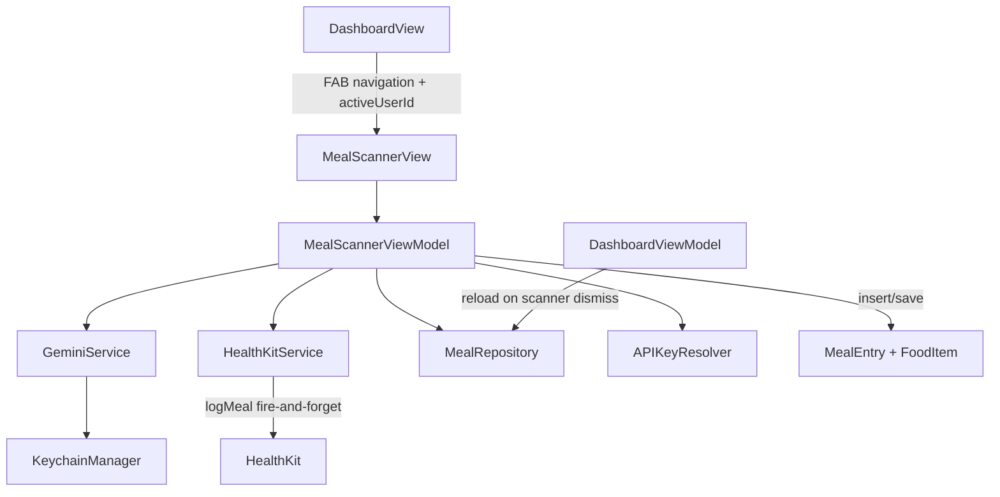
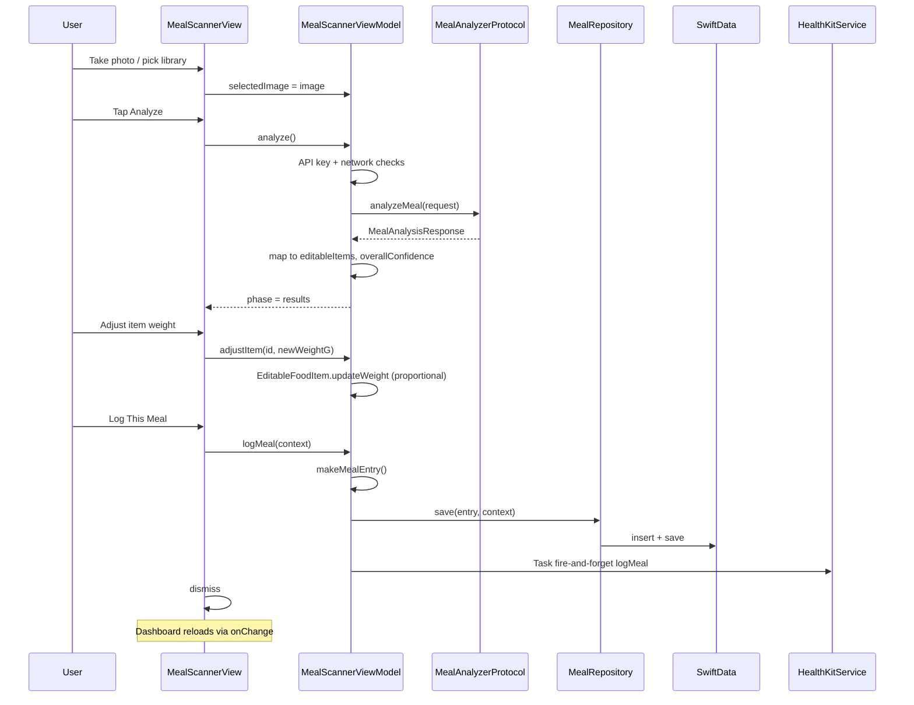

# PR4: Meal Scanner — Gemini Integration — Implementation Plan

**Sources (conflict order):** [`technical-spec.md`](docs/technical-spec.md) (PR 4 section, GeminiService, HealthKitService, testing strategy), [`product-research.md`](docs/product-research.md) (§8–9 confidence/flagging, §13 meal scanner flow), [`engineering-rules.md`](docs/engineering-rules.md), [`PR-03.md`](docs/implementation/PR-03.md), [`PR-02.md`](docs/implementation/PR-02.md)

> **Doc path note:** Spec and implementation records live under `docs/` in the CalSnap repo (`docs/technical-spec.md`, `docs/implementation/PR-03.md`, etc.). Links above use short labels; paths resolve to those canonical locations.

**PR1–PR3 baseline already in repo:** SwiftData models (`MealEntry`, `FoodItem`), `MealType.suggested(for:)`, `AppConstants.Gemini.confidenceThreshold` (0.60), `GeminiService.validateAPIKey` (actor, ephemeral `GenerativeModel`), `APIKeyResolver.resolvedGeminiAPIKey()`, `HealthKitService.requestAuthorization()` only, `MealRepository.fetchMeals`, `DashboardView` FAB → `MealScannerView` stub via `navigationDestination`, `@AppStorage(AppStorageKey.activeUserId)` owned by dashboard.

**Not part of this PR:** `PR-04.md` (create at `docs/implementation/PR-04.md` after implementation), USDA fallback (product-research §10 — deferred), `MealDetailView`/edit-delete (PR5), Settings API-key UI (PR8), `PrivacyInfo.xcprivacy` (PR10), `Localizable.strings` migration (PR10).

---

## 1. PR4 scope summary

Deliver the primary meal-logging flow end-to-end:

| Capability | Deliverable |
|---|---|
| Capture | Camera sheet + photo library picker; image preview |
| Context | Optional text description field |
| Analyze | `GeminiService.analyzeMeal(MealAnalysisRequest)` with structured JSON schema |
| Loading | Spinner + "Analyzing your meal..." |
| Results | `MealAnalysisResultView`: thumbnail, totals, macro split, per-item list, flagged items, estimation notes accordion, confidence badge, meal type selector |
| Edit | Inline weight edit sheet; proportional macro rescaling via `EditableFoodItem.updateWeight` |
| Errors | Offline, API/parse failures, all-items-flagged warning, unrecognizable image guidance; recovery via retry + manual entry |
| Manual fallback | `ManualMealEntryView` — multi-item form, same log path |
| Log | "Log This Meal" → SwiftData `MealEntry` + `FoodItem` cascade + `HealthKitService.logMeal` (fire-and-forget) |
| Discard | Reset state, dismiss navigation, **no persistence** |
| Re-analyze | Return to capture phase (keep image + description; user may change photo) |

**Spec-required unit tests (exactly three):** `testEditableFoodItemScaling()`, `testOverallConfidence()`, `testMealEntryCreation()`.

---

## 2. Dependencies on existing PR1–PR3 code



| Existing asset | PR4 usage |
|---|---|
| [`MealEntry`](CalSnap/Core/Models/MealEntry.swift) / [`FoodItem`](CalSnap/Core/Models/FoodItem.swift) | Persist logged meals; `photoData` external storage |
| [`MealType`](CalSnap/Core/Models/Enums.swift) | `suggested(for: Date())` default; user override in selector |
| [`AppConstants.Gemini`](CalSnap/Core/Utilities/Constants.swift) | `model`, `confidenceThreshold` |
| [`APIKeyResolver`](CalSnap/Core/Utilities/APIKeyResolver.swift) | Gate analyze calls; throw `GeminiError.apiKeyMissing` |
| [`GeminiService`](CalSnap/Core/Services/GeminiService.swift) | Extend with `analyzeMeal`, DTOs, schema, prompt |
| [`HealthKitService`](CalSnap/Core/Services/HealthKitService.swift) | Add `logMeal(_ entry: MealEntry)` |
| [`MealRepository`](CalSnap/Core/Repositories/MealRepository.swift) | Add `save(_:context:)` |
| [`AppContainer`](CalSnap/App/AppContainer.swift) | Unchanged wiring; view reads `geminiService`, `healthKitService`, `mealRepository` |
| [`DashboardView`](CalSnap/Features/Dashboard/DashboardView.swift) | Pass `activeUserId`; reload dashboard when scanner dismisses |
| `generative-ai-swift` 0.5.6 | Already in `Package.resolved` from PR2 |

---

## 3. Files to create

| Path | Layer |
|------|-------|
| [`CalSnap/Core/Services/MealAnalyzerProtocol.swift`](CalSnap/Core/Services/MealAnalyzerProtocol.swift) | Service protocol + test mock |
| [`CalSnap/Features/MealScanner/EditableFoodItem.swift`](CalSnap/Features/MealScanner/EditableFoodItem.swift) | Model helper |
| [`CalSnap/Features/MealScanner/MealScannerViewModel.swift`](CalSnap/Features/MealScanner/MealScannerViewModel.swift) | View model |
| [`CalSnap/Features/MealScanner/CameraImagePicker.swift`](CalSnap/Features/MealScanner/CameraImagePicker.swift) | UIKit bridge utility |
| [`CalSnap/Features/MealScanner/MacroSplitBar.swift`](CalSnap/Features/MealScanner/MacroSplitBar.swift) | View (results macro visualization) |
| [`CalSnap/Features/MealScanner/ConfidenceIndicator.swift`](CalSnap/Features/MealScanner/ConfidenceIndicator.swift) | View |
| [`CalSnap/Features/MealScanner/EstimationNotesAccordion.swift`](CalSnap/Features/MealScanner/EstimationNotesAccordion.swift) | View |
| [`CalSnap/Features/MealScanner/MealTypeSelector.swift`](CalSnap/Features/MealScanner/MealTypeSelector.swift) | View |
| [`CalSnap/Features/MealScanner/FoodItemRowView.swift`](CalSnap/Features/MealScanner/FoodItemRowView.swift) | View |
| [`CalSnap/Features/MealScanner/FoodItemEditSheet.swift`](CalSnap/Features/MealScanner/FoodItemEditSheet.swift) | View |
| [`CalSnap/Features/MealScanner/ScannerErrorBanner.swift`](CalSnap/Features/MealScanner/ScannerErrorBanner.swift) | View |
| [`CalSnap/Features/MealScanner/MealAnalysisResultView.swift`](CalSnap/Features/MealScanner/MealAnalysisResultView.swift) | View |
| [`CalSnap/Features/MealScanner/ManualMealEntryView.swift`](CalSnap/Features/MealScanner/ManualMealEntryView.swift) | View |
| [`CalSnapTests/MealScannerViewModelTests.swift`](CalSnapTests/MealScannerViewModelTests.swift) | Tests |

---

## 4. Files to modify

| Path | Change |
|------|--------|
| [`CalSnap/Core/Services/GeminiService.swift`](CalSnap/Core/Services/GeminiService.swift) | Add `MealAnalysisRequest`, `MealAnalysisResponse`, `analyzeMeal`, schema, prompt; reconcile `GeminiError` |
| [`CalSnap/Core/Services/HealthKitService.swift`](CalSnap/Core/Services/HealthKitService.swift) | Add `logMeal(_:)` for calories + protein + carbs + fat + fiber |
| [`CalSnap/Core/Repositories/MealRepository.swift`](CalSnap/Core/Repositories/MealRepository.swift) | Add `save(_ entry:context:)` |
| [`CalSnap/Features/MealScanner/MealScannerView.swift`](CalSnap/Features/MealScanner/MealScannerView.swift) | Replace stub with full flow |
| [`CalSnap/Features/Dashboard/DashboardView.swift`](CalSnap/Features/Dashboard/DashboardView.swift) | Pass `activeUserId`; reload on scanner dismiss |
| [`CalSnap/Resources/Info.plist`](CalSnap/Resources/Info.plist) | Add `NSCameraUsageDescription`, `NSPhotoLibraryUsageDescription` |
| [`CalSnap/Core/Models/Enums.swift`](CalSnap/Core/Models/Enums.swift) | Add shared `MealType.displayName` + `systemImage` (required — see §5) |
| [`CalSnap/Features/Dashboard/TodaysMealsSection.swift`](CalSnap/Features/Dashboard/TodaysMealsSection.swift) | Remove private `MealType` display extension; use shared helpers from `Enums.swift` |
| [`CalSnap.xcodeproj/project.pbxproj`](CalSnap.xcodeproj/project.pbxproj) | Register all new Swift sources (same PR2/PR3 rule: edit pbxproj directly; do not run xcodegen) |

**Unchanged:** `MealEntry`/`FoodItem` schema, `AppContainer` shape, `RootView`, onboarding flow.

---

## 5. File-by-file implementation plan

### [`CalSnap/Core/Services/MealAnalyzerProtocol.swift`](CalSnap/Core/Services/MealAnalyzerProtocol.swift) — **create** (service)

**Why:** Spec testing strategy requires protocol-based Gemini mocking.

**Contains:**
- `protocol MealAnalyzerProtocol { func analyzeMeal(_ request: MealAnalysisRequest) async throws -> MealAnalysisResponse }`
- `extension GeminiService: MealAnalyzerProtocol {}`
- `final class MockMealAnalyzer: MealAnalyzerProtocol` with `mockResponse`, `shouldThrow`, `lastRequest` capture
- `extension MealAnalysisResponse` test fixture `static var testDefault` (2 items, mixed confidence, notes)

**Depends on:** `MealAnalysisRequest`/`MealAnalysisResponse` (defined in `GeminiService.swift`)

**Tests:** Used indirectly by future integration tests; PR4 tests focus on VM static mappers + `EditableFoodItem`

---

### [`CalSnap/Core/Services/GeminiService.swift`](CalSnap/Core/Services/GeminiService.swift) — **modify** (service)

**Why:** Core PR4 external integration.

**Add types (per spec):**
```swift
struct MealAnalysisRequest {
    let imageData: Data
    let mimeType: String   // "image/jpeg" or "image/png"
    let textDescription: String?
}

struct MealAnalysisResponse: Codable {
    struct FoodItemResult: Codable { name, estimatedWeightG, calories, proteinG, carbsG, fatG, fiberG, confidence }
    struct MealTotal: Codable { calories, proteinG, carbsG, fatG, fiberG }
    let items: [FoodItemResult]
    let mealTotal: MealTotal
    let flaggedItems: [String]
    let estimationNotes: String
}
```

**Add to `actor GeminiService`:**
- `private static var responseSchema: Schema` — spec object schema with snake_case field names
- `func analyzeMeal(_ request: MealAnalysisRequest) async throws -> MealAnalysisResponse`
  1. `guard let apiKey = try APIKeyResolver.resolvedGeminiAPIKey(), !apiKey.isEmpty else { throw GeminiError.apiKeyMissing }`
  2. Build `GenerativeModel` with `AppConstants.Gemini.model`, `responseMIMEType: "application/json"`, `responseSchema`
  3. `buildPrompt(description:)` — spec prompt text + user context append
  4. `generateContent([textPart, imagePart])`
  5. Decode with `JSONDecoder.keyDecodingStrategy = .convertFromSnakeCase`; on failure throw `GeminiError.invalidJSON(message)`

**Reconcile `GeminiError`:**
- Add `case invalidJSON(String)` per spec
- Keep `validationFailed` for `validateAPIKey` (PR2)
- Update `apiKeyMissing` copy to **not** reference Settings (PR8): e.g. `"Gemini API key not configured. Add a key during setup or enter the meal manually."`

**Depends on:** `GoogleGenerativeAI`, `APIKeyResolver`, `AppConstants`

**Tests:** No direct Gemini network tests in PR4; covered via mocks + manual QA

---

### [`CalSnap/Core/Services/HealthKitService.swift`](CalSnap/Core/Services/HealthKitService.swift) — **modify** (service)

**Why:** PR4 acceptance: log writes dietary data.

**Add:**
```swift
func logMeal(_ entry: MealEntry) async throws
```
- Guard `HKHealthStore.isHealthDataAvailable()`
- Build `HKQuantitySample` array at `entry.timestamp`:
  - `.dietaryEnergyConsumed` — kcal
  - `.dietaryProtein` — grams
  - `.dietaryCarbohydrates` — grams
  - `.dietaryFatTotal` — grams
  - `.dietaryFiber` — grams
- `try await store.save(samples)`

**Caller pattern (per spec §Cursor instructions):** ViewModel fires `Task { try? await healthKitService.logMeal(entry) }` after SwiftData save — never blocks UI, never surfaces HK errors to user (console log only).

**Depends on:** `MealEntry`, existing `writeTypes` (already includes dietary types)

**Tests:** Not required in PR4 unit suite; manual QA on device/simulator with Health permissions

---

### [`CalSnap/Core/Repositories/MealRepository.swift`](CalSnap/Core/Repositories/MealRepository.swift) — **modify** (repository)

**Why:** Keep persistence access out of views; mirror thin-repo pattern from PR3.

**Add:**
```swift
func save(_ entry: MealEntry, context: ModelContext) throws {
    context.insert(entry)
    try context.save()
}
```
(`FoodItem` children inserted via `MealEntry.items` relationship before save.)

**Depends on:** SwiftData

**Tests:** Exercised indirectly by `testMealEntryCreation()` via in-memory `ModelContext`

---

### [`CalSnap/Features/MealScanner/EditableFoodItem.swift`](CalSnap/Features/MealScanner/EditableFoodItem.swift) — **create** (model helper)

**Why:** Spec-defined editable intermediate model between Gemini response and SwiftData.

**Contains:** Spec struct exactly:
- Properties: `id`, `name`, `weightG`, `calories`, `proteinG`, `carbsG`, `fatG`, `fiberG`, `confidence`, `isFlagged`
- `mutating func updateWeight(to newWeightG: Double)` — ratio scaling; guard `weightG > 0`
- `static func from(result: MealAnalysisResponse.FoodItemResult, flaggedNames: Set<String>) -> Self` — set `isFlagged` when `confidence < AppConstants.Gemini.confidenceThreshold` **or** name in `flaggedItems`
- `func toFoodItem() -> FoodItem` — maps to SwiftData model (`usdaFoodId: nil`)

**Depends on:** `AppConstants`, `FoodItem`, `MealAnalysisResponse`

**Tests:** `testEditableFoodItemScaling()`

---

### [`CalSnap/Features/MealScanner/MealScannerViewModel.swift`](CalSnap/Features/MealScanner/MealScannerViewModel.swift) — **create** (view model)

**Why:** All scanner business logic per MVVM rules.

**Annotation:** `@Observable @MainActor final class MealScannerViewModel`

**Phase enum:**
```swift
enum MealScannerPhase { case capture, analyzing, results, error, manual }
```

**Stored properties (spec + extensions):**
- `phase: MealScannerPhase`
- `selectedImage: UIImage?`
- `textDescription: String`
- `analysisResult: MealAnalysisResponse?`
- `editableItems: [EditableFoodItem]`
- `mealType: MealType` — init to `.suggested(for: Date())`
- `isAnalyzing: Bool` (mirrors phase or derived)
- `errorMessage: String?` / `scannerError: ScannerError?` (typed enum: offline, api, parse, unrecognizable, missingAPIKey)
- `estimationNotes: String?`
- `isManualEntry: Bool`
- `editingItemID: UUID?` — drives edit sheet
- `private var analyzeTask: Task<Void, Never>?`
- `private let userId: UUID`
- Injected: `mealAnalyzer: any MealAnalyzerProtocol`, `healthKitService: HealthKitService`, `mealRepository: MealRepository`

**Computed:**
- `totalCalories`, `totalProteinG`, `totalCarbsG`, `totalFatG`, `totalFiberG` — **sum `editableItems`** (not `mealTotal` after edits)
- `overallConfidence: Double` — `Self.computeOverallConfidence(items:)` = arithmetic mean of item confidences; empty → 0; **returns 0 when `isManualEntry`** (manual meals have no Gemini confidence)
- `confidenceLevel: ConfidenceLevel` — high ≥0.80, medium ≥0.60, low <0.60; **not used when `isManualEntry`**
- `showsConfidenceIndicator: Bool` — `!isManualEntry` (manual meals use a static "Manual entry" label instead)
- `allItemsFlagged: Bool` — non-empty && all `isFlagged`
- `canAnalyze: Bool` — `selectedImage != nil && !isAnalyzing`
- `canLog: Bool` — `!editableItems.isEmpty && editableItems.allSatisfy { $0.weightG > 0 && !$0.name.isEmpty }`
- `hasAdjustedItems: Bool` — any item weight differs from original analysis mapping OR manual mode

**Methods:**
| Method | Behavior |
|--------|----------|
| `analyze()` | Cancel prior task; check network (`URLError.notConnectedToInternet` / `NWPathMonitor` snapshot); require image; JPEG-encode image → `MealAnalysisRequest`; set `.analyzing`; call analyzer; map to `editableItems`; set `estimationNotes`; compute confidence; `.results` or `.error` |
| `applyAnalysis(_:)` | Map response items → `editableItems`; store `analysisResult` |
| `adjustItem(id:newWeightG:)` | Find item, `updateWeight`, set `isManuallyAdjusted` tracking |
| `enterManualEntry()` | Clear Gemini state; seed one empty `EditableFoodItem`; `.manual` |
| `addManualItem()` | Append blank item |
| `removeManualItem(id:)` | Remove if >1 item |
| `retryAnalyze()` | Clear error; re-call `analyze()` |
| `reAnalyze()` | Clear results + error; return `.capture` (retain image/description) |
| `discard()` | Cancel task; reset all state |
| `logMeal(context:) async` | Build `MealEntry` via `makeMealEntry()`; `mealRepository.save`; fire-and-forget HK; return success |
| `static func computeOverallConfidence(items: [EditableFoodItem]) -> Double` | Testable pure function |
| `func makeMealEntry() -> MealEntry` | Testable builder: totals from computed sums, `photoData` from JPEG-compressed `selectedImage`, **`geminiConfidence: isManualEntry ? 0 : overallConfidence`**, `isManuallyAdjusted: isManualEntry \|\| hasAdjustedItems`, `estimationNotes: isManualEntry ? nil : estimationNotes`, `items` via `toFoodItem()` |
| `func finishManualEntry()` | Validate items; set each item `confidence = 1.0`, `isFlagged = false`; set `isManualEntry = true`; transition to `.results` |
| `cancelAnalysis()` | Cancel `analyzeTask` on disappear |

**Image encoding helper (private/static):** `jpegData(from:maxPixelDimension:compressionQuality:)` → `(Data, mimeType)`; default max dimension 1536, quality 0.82 (assumption — keeps API payload reasonable and `photoData` bounded).

**Depends on:** All services above, `EditableFoodItem`, `MealEntry`, `Network` (or `Foundation` URLError)

**Tests:** `testOverallConfidence()`, `testMealEntryCreation()`

---

### [`CalSnap/Features/MealScanner/CameraImagePicker.swift`](CalSnap/Features/MealScanner/CameraImagePicker.swift) — **create** (utility / UIKit bridge)

**Why:** Camera capture (spec requires camera + library).

**Contains:** `struct CameraImagePicker: UIViewControllerRepresentable` wrapping `UIImagePickerController` with `sourceType = .camera`, `delegate` returning `UIImage` via binding/`onImagePicked`.

**Camera availability helper (same file or `MealScannerViewModel`):**
```swift
static var isCameraAvailable: Bool {
    UIImagePickerController.isSourceTypeAvailable(.camera)
}
```

**Depends on:** UIKit, SwiftUI

**Tests:** Manual QA only

---

### [`CalSnap/Features/MealScanner/MacroSplitBar.swift`](CalSnap/Features/MealScanner/MacroSplitBar.swift) — **create** (view)

**Why:** Results screen macro visualization (proportional P/C/F bar, not target-based like dashboard `MacroBarCard`).

**Props:** `proteinG`, `carbsG`, `fatG`

**UI:** Horizontal stacked bar with legend labels; handle zero-total edge case (gray placeholder).

**Depends on:** SwiftUI

**Tests:** None

---

### [`CalSnap/Features/MealScanner/ConfidenceIndicator.swift`](CalSnap/Features/MealScanner/ConfidenceIndicator.swift) — **create** (view)

**Why:** Spec confidence badge (High / Medium / Low).

**Props:** `level: ConfidenceLevel`, optional `score: Double`, `isManualEntry: Bool`

**UI:** When `isManualEntry`, render static gray capsule **"Manual entry"** (no score). Otherwise capsule badge High/Medium/Low with color (green/yellow/red) + accessibility label.

**Tests:** None

---

### [`CalSnap/Features/MealScanner/EstimationNotesAccordion.swift`](CalSnap/Features/MealScanner/EstimationNotesAccordion.swift) — **create** (view)

**Why:** Expandable Gemini reasoning.

**Props:** `notes: String`

**UI:** `DisclosureGroup` with secondary body text; hidden when empty.

**Tests:** None

---

### [`CalSnap/Features/MealScanner/MealTypeSelector.swift`](CalSnap/Features/MealScanner/MealTypeSelector.swift) — **create** (view)

**Why:** Breakfast/lunch/dinner/snack picker with auto-suggested default.

**Props:** `selection: Binding<MealType>`

**UI:** Segmented `Picker` or horizontal chip buttons using `MealType.allCases`; subtitle "Suggested: …" on appear.

**Depends on:** Shared `MealType.displayName` + `MealType.systemImage` on [`Enums.swift`](CalSnap/Core/Models/Enums.swift) (**required PR4 modify** — see §4 and §Approved decisions).

**Tests:** None

---

### [`CalSnap/Features/MealScanner/FoodItemRowView.swift`](CalSnap/Features/MealScanner/FoodItemRowView.swift) — **create** (view)

**Why:** Per-item row in results list.

**Props:** `item: EditableFoodItem`, `onEdit: () -> Void`

**UI:** Name, weight (g), calories, mini macro line; amber warning + "Adjust?" when `isFlagged`; tap → edit.

**Tests:** None

---

### [`CalSnap/Features/MealScanner/FoodItemEditSheet.swift`](CalSnap/Features/MealScanner/FoodItemEditSheet.swift) — **create** (view)

**Why:** Inline weight adjustment (spec: tap item → edit sheet).

**Props:** `item: Binding<EditableFoodItem>` or name + weight binding + `onSave: (Double) -> Void`

**UI:** Item name (read-only for Gemini items; editable name in manual mode), `TextField`/`Stepper` for weight in **grams** (metric internal), live preview of scaled calories/macros, Save/Cancel.

**Tests:** None (scaling logic tested on `EditableFoodItem`)

---

### [`CalSnap/Features/MealScanner/ScannerErrorBanner.swift`](CalSnap/Features/MealScanner/ScannerErrorBanner.swift) — **create** (view)

**Why:** Spec error rendering with recovery actions.

**Props:** `error: ScannerError`, `onRetry: () -> Void`, `onManualEntry: () -> Void`

**Copy mapping:**
| Error | Message | Actions |
|-------|---------|---------|
| offline | "Offline mode: manual entry only" | Manual entry (primary); hide retry |
| missingAPIKey | Key missing message | Manual entry |
| api | SDK/HTTP failure localized | Retry + Manual entry |
| parse | Parse failure | Retry + Manual entry |
| unrecognizable | Dark/empty items guidance | Re-analyze + Manual entry |
| allFlagged | Warning banner (non-blocking) | Shown inside results, not here |

**Tests:** None

---

### [`CalSnap/Features/MealScanner/MealAnalysisResultView.swift`](CalSnap/Features/MealScanner/MealAnalysisResultView.swift) — **create** (view)

**Why:** Spec results layout container.

**Props:** bindings to VM slices: image, totals, items, notes, confidence, mealType, flags

**Sections (top → bottom):**
1. Thumbnail (`selectedImage`)
2. Total calories (large)
3. `MacroSplitBar`
4. `FoodItemRowView` list
5. All-flagged warning banner when `allItemsFlagged`
6. `EstimationNotesAccordion`
7. `ConfidenceIndicator` **or** static "Manual entry" label when `isManualEntry` (no High/Medium/Low badge)
8. `MealTypeSelector`
9. Primary "Log This Meal" button (`disabled(!canLog)`)
10. Secondary "Re-analyze"
11. Destructive "Discard" (confirmation alert)

**Tests:** None

---

### [`CalSnap/Features/MealScanner/ManualMealEntryView.swift`](CalSnap/Features/MealScanner/ManualMealEntryView.swift) — **create** (view)

**Why:** Spec manual fallback.

**Props:** bindings to `editableItems`, add/remove callbacks, `onContinue` (transitions to `.results` phase with manual totals), `onLog` optional if logging from same screen

**Fields per item:** name (required), calories (required), protein/carbs/fat/fiber (optional, default 0), weightG (optional, default 100g for display consistency)

**UI:** "Add another item" button; **"Continue"** calls `finishManualEntry()` → transitions to `.results` (meal type selection + shared log button — same path as Gemini results).

**Tests:** None

---

### [`CalSnap/Features/MealScanner/MealScannerView.swift`](CalSnap/Features/MealScanner/MealScannerView.swift) — **modify** (view)

**Why:** Orchestrates full scanner flow.

**Init:** `init(activeUserId: String)` — resolve UUID; create `@State private var viewModel: MealScannerViewModel?`

**Environment:** `AppContainer`, `modelContext`, `dismiss`

**Capture phase UI:**
- Image preview (`selectedImage` or placeholder)
- **"Take Photo"** — only shown when `UIImagePickerController.isSourceTypeAvailable(.camera)`; presents `CameraImagePicker` via `fullScreenCover`
- **"Choose from Library"** — always shown; `PhotosPicker` (iOS 17)
- **Camera unavailable UX** (simulator, Mac Catalyst, denied hardware):
  - Hide or disable "Take Photo"
  - Show inline caption: *"Camera not available on this device. Choose a photo from your library or enter the meal manually."*
  - Photo library + manual entry remain fully functional — simulator QA uses library path exclusively
- TextField: "Add description (optional)"
- "Analyze" button (`disabled(!canAnalyze)`)
- Toolbar/link: "Enter manually" → `enterManualEntry()`
- Loading overlay when `.analyzing`

**Phase routing (`switch viewModel.phase`):**
- `.capture` — capture UI
- `.analyzing` — `ProgressView` + message
- `.results` — `MealAnalysisResultView`
- `.error` — `ScannerErrorBanner` above residual capture UI
- `.manual` — `ManualMealEntryView`

**Lifecycle:**
- `.onDisappear { viewModel?.cancelAnalysis() }`
- Discard → `viewModel.discard(); dismiss()`
- Log success → `dismiss()` (dashboard reload handled by parent)

**Depends on:** All scanner subviews, `PhotosUI`

**Tests:** Manual QA

---

### [`CalSnap/Features/Dashboard/DashboardView.swift`](CalSnap/Features/Dashboard/DashboardView.swift) — **modify** (view)

**Changes:**
- `navigationDestination`: `MealScannerView(activeUserId: activeUserId)`
- `.onChange(of: showScanner) { _, isShowing in if !isShowing { reloadDashboard() } }`

**Why:** Logged meals must appear in `TodaysMealsSection` on return.

**Tests:** None

---

### [`CalSnap/Resources/Info.plist`](CalSnap/Resources/Info.plist) — **modify**

Add spec strings:
- `NSCameraUsageDescription`
- `NSPhotoLibraryUsageDescription`

---

### [`CalSnap/Core/Models/Enums.swift`](CalSnap/Core/Models/Enums.swift) — **modify** (model helper)

**Why (required, not optional cleanup):** `MealTypeSelector` needs the same `displayName` / `systemImage` labels already used in `TodaysMealsSection`. Duplicating a private extension in a third file is out of scope for PR4 maintainability.

**Add to `MealType`:**
- `var displayName: String` — `rawValue.capitalized`
- `var systemImage: String` — breakfast/lunch/dinner/snack SF Symbols (same mapping as current `TodaysMealsSection` private extension)

**Depends on:** Foundation only

**Tests:** None (display-only)

---

### [`CalSnap/Features/Dashboard/TodaysMealsSection.swift`](CalSnap/Features/Dashboard/TodaysMealsSection.swift) — **modify** (view)

**Why:** Consume shared `MealType` helpers; remove the private `extension MealType` at file bottom to avoid drift.

**Change:** Delete private `displayName` / `systemImage` extension; no behavior change.

**Tests:** None (regression covered by existing dashboard tests + manual QA)

---

### [`CalSnapTests/MealScannerViewModelTests.swift`](CalSnapTests/MealScannerViewModelTests.swift) — **create**

**Setup:** In-memory `ModelContainer`; `MockMealAnalyzer`; fixed `userId`

| Test | Assert |
|------|--------|
| `testEditableFoodItemScaling()` | Item at 100g/200kcal/20p/30c/10f/5fiber → `updateWeight(200)` doubles all values |
| `testOverallConfidence()` | Items with 0.9 and 0.7 → mean 0.8 |
| `testMealEntryCreation()` | Given mock `MealAnalysisResponse.testDefault` mapped to `editableItems` (**Gemini path**, `isManualEntry == false`), `makeMealEntry()` produces correct totals, `userId`, `mealType`, child `FoodItem` count, `geminiConfidence == overallConfidence`, `isManuallyAdjusted == false` |

> Manual-entry persistence (`geminiConfidence == 0`, `isManuallyAdjusted == true`) is covered in **manual QA §9** — not a fourth unit test (spec requires exactly three).

---

## 6. Data flow / control flow



**Manual path:** Error or user chooses manual → `ManualMealEntryView` → `finishManualEntry()` → `.results` → log via `makeMealEntry()` with **`geminiConfidence = 0`**, **`isManuallyAdjusted = true`**, per-item **`confidence = 1.0`** / **`isFlagged = false`**, **`estimationNotes = nil`**, results UI shows **"Manual entry"** label instead of `ConfidenceIndicator`.

**Discard path:** `discard()` clears VM → `dismiss()` — no `context.insert`, no HK write.

---

## 7. Error-state plan

| Condition | Detection | UI | Recovery |
|-----------|-----------|-----|----------|
| No network | `URLError.notConnectedToInternet` or path unsatisfied before call | `ScannerErrorBanner` offline copy | Manual entry only |
| Missing API key | `APIKeyResolver` nil/empty before analyze | Error banner | Manual entry; Analyze disabled |
| Gemini API failure | SDK thrown error | Error banner | Retry + Manual entry |
| Parse failure | `GeminiError.invalidJSON` / decode error | Error banner | Retry + Manual entry |
| Empty items / zero confidence | `response.items.isEmpty` after success | Unrecognizable guidance | Re-analyze + Manual entry |
| All items flagged | `editableItems.allSatisfy(\.isFlagged)` | Yellow warning banner in results | User adjusts weights; log still allowed (warning, not hard block) |
| HealthKit write failure | `logMeal` throws | **Silent** (console only); SwiftData save still succeeds | N/A per spec |
| Navigate away mid-analyze | `onDisappear` | Cancel task | No partial save |
| Camera unavailable | `!UIImagePickerController.isSourceTypeAvailable(.camera)` | Hide/disable Take Photo; inline caption | Library picker + manual entry |

---

## 8. Testing plan

**Unit tests (required):** 3 tests in `MealScannerViewModelTests` as specified.

**Regression:** All PR1–PR3 tests must remain green (16 tests today).

**Command:**
```bash
DEVELOPER_DIR=/Applications/Xcode.app/Contents/Developer xcodebuild -scheme CalSnap -destination 'platform=iOS Simulator,name=iPhone 17' test
```

**No new UI/snapshot tests in PR4** (consistent with PR1–PR3 scope).

---

## 9. Manual QA plan

1. **Camera capture (device)** — FAB → Take Photo → capture → preview → Analyze (real API key in Keychain)
2. **Simulator / no camera** — Verify Take Photo hidden/disabled; caption shown; library + manual entry work
3. **Photo library** — Choose from Library → same flow
4. **Description** — Add text; verify notes/refinement in estimation notes (subjective)
5. **Results (Gemini)** — Totals match sum of items; macro bar renders; confidence badge shows High/Medium/Low
6. **Results (manual)** — Manual entry → Continue → results show "Manual entry" label (not confidence badge); log succeeds
7. **Flagged item** — Seed/mock low-confidence item → amber icon → edit weight → totals update live
8. **All flagged warning** — Mock all confidence < 0.6 → banner visible
9. **Log** — Log This Meal → dismiss → dashboard shows meal in correct `MealType` section with thumbnail + kcal
10. **Manual log persistence** — Logged manual meal has `geminiConfidence == 0`, `isManuallyAdjusted == true` in SwiftData
11. **HealthKit** — Verify dietary samples in Health app (simulator/device with permissions)
12. **Discard** — Discard with confirmation → no new meal on dashboard
13. **Re-analyze** — Returns to capture with image retained
14. **Offline** — Airplane mode → Analyze shows offline message → manual entry works
15. **No API key** — Skip key in onboarding → Analyze blocked/manual path works
16. **Retry** — Force API error (bad key) → Retry after fixing key
17. **Profile switch** — Log meal as user B; verify `userId` on `MealEntry` matches active profile
18. **Cancel mid-analyze** — Back swipe during spinner → no crash, no orphan data

---

## 10. Risks / edge cases

| Risk | Mitigation |
|------|------------|
| Gemini latency > 5s | Show loading state; no timeout in PR4 unless UX requires (note in QA) |
| Large photos blow memory/API limits | JPEG resize before request + `photoData` storage |
| `mealTotal` vs sum mismatch from Gemini | Always display totals from `editableItems` sums after mapping |
| Simulator camera unavailable | `isCameraAvailable` gate hides Take Photo; inline caption; library + manual entry are primary simulator paths |
| HealthKit unavailable on simulator | SwiftData save is source of truth; HK silently no-ops |
| User skips Gemini key in onboarding | Gate analyze; manual entry always available |
| Task retention after dismiss | `cancelAnalysis()` on disappear |
| SwiftData relationship insert order | Insert `MealEntry` with `items` array populated before `save` |
| Integer calorie rounding on scale | `Int(Double(calories) * ratio)` per spec |
| `weightG == 0` on adjust | Guard in `updateWeight`; disable log if any item has `weightG <= 0` |

---

## 11. Approved decisions (locked for implementation)

These were open questions in the draft plan; they are **resolved** and should not be re-litigated during PR4 coding unless product direction changes.

| Decision | Resolution |
|----------|------------|
| Missing Gemini API key | Disable Analyze when Keychain key is nil/empty; inline message + prominent "Enter manually" (no Settings reference until PR8) |
| Manual entry flow | `ManualMealEntryView` → `finishManualEntry()` → shared `.results` phase → "Log This Meal" (same as Gemini path) |
| Manual confidence / `geminiConfidence` | **Split semantics:** per-item `confidence = 1.0`, `isFlagged = false`; saved `MealEntry.geminiConfidence = 0` (no AI analysis); `isManuallyAdjusted = true`; `estimationNotes = nil`; results UI shows **"Manual entry"** label instead of `ConfidenceIndicator` |
| `MealType` display helpers | **Required PR4 modify:** move `displayName` + `systemImage` to `Enums.swift`; update `TodaysMealsSection` to consume them |
| Image compression | 1536px max edge, JPEG quality 0.82 (PR4 spec extension) |
| All-flagged log | Warning banner only; log remains enabled |
| `GeminiError` | Add `invalidJSON`; keep `validationFailed` for `validateAPIKey` |
| Camera unavailable | Hide/disable Take Photo when `!isSourceTypeAvailable(.camera)`; show inline caption; library + manual entry always available |

---

## Questions to resolve before implementation

**None remaining** — all material architecture/UX decisions are locked in §11 above.

**Confirmed out of scope:** USDA hybrid fallback (product-research §10) — PR4 spec does not include it.

---

## Contradictions surfaced (no guessing)

| Item | Spec | Repo today | Resolution |
|------|------|------------|------------|
| `GeminiError.invalidJSON` | Present | Missing | Add in PR4 |
| `GeminiError` Settings copy | "Go to Settings" | N/A | Use setup/manual-entry copy until PR8 |
| `GeminiService` model lifecycle | `init(apiKey:)` stored model | Ephemeral model in `validateAPIKey` | Keep per-call model + Keychain resolve (PR2 pattern) |
| USDA fallback | product-research | Not in PR4 spec | Out of scope — not a contradiction |

---

## 12. Recommended commit sequence

1. **`feat: add MealAnalysis DTOs, MealAnalyzerProtocol, and GeminiService.analyzeMeal`**
2. **`feat: add HealthKitService.logMeal for dietary writes`**
3. **`feat: add EditableFoodItem and MealScannerViewModel`**
4. **`test: add MealScannerViewModelTests (scaling, confidence, meal entry)`**
5. **`feat: add meal scanner UI components and CameraImagePicker`**
6. **`feat: implement MealScannerView flow and replace stub`**
7. **`feat: wire dashboard scanner navigation and reload on dismiss`**
8. **`chore: add camera and photo library Info.plist usage strings`**
9. **`refactor: share MealType display helpers on Enums`**
10. **`docs: add PR-04 implementation record`**

---

## Concise implementation recommendation

Implement PR4 as a **phase-driven `MealScannerViewModel`** with **protocol-injected Gemini analysis**, **sum-based totals from `editableItems`**, and **thin views** split like PR3 dashboard components. Extend existing services (`GeminiService`, `HealthKitService`, `MealRepository`) rather than new abstractions. Gate analyze on Keychain key + connectivity; always offer manual entry; **gate camera button on `isSourceTypeAvailable(.camera)`**. Manual meals use **split confidence semantics** (`geminiConfidence = 0` on meal, per-item confidence `1.0`, UI label "Manual entry"). Persist via `MealRepository.save`, then fire-and-forget HealthKit. **Required** `MealType` display helpers on `Enums.swift`. Register 14 new files + modify 9 in `project.pbxproj`; add 3 focused unit tests before UI polish.

---

## Exact files Cursor expects to touch in PR4

**Create (14):**
- `CalSnap/Core/Services/MealAnalyzerProtocol.swift`
- `CalSnap/Features/MealScanner/EditableFoodItem.swift`
- `CalSnap/Features/MealScanner/MealScannerViewModel.swift`
- `CalSnap/Features/MealScanner/CameraImagePicker.swift`
- `CalSnap/Features/MealScanner/MacroSplitBar.swift`
- `CalSnap/Features/MealScanner/ConfidenceIndicator.swift`
- `CalSnap/Features/MealScanner/EstimationNotesAccordion.swift`
- `CalSnap/Features/MealScanner/MealTypeSelector.swift`
- `CalSnap/Features/MealScanner/FoodItemRowView.swift`
- `CalSnap/Features/MealScanner/FoodItemEditSheet.swift`
- `CalSnap/Features/MealScanner/ScannerErrorBanner.swift`
- `CalSnap/Features/MealScanner/MealAnalysisResultView.swift`
- `CalSnap/Features/MealScanner/ManualMealEntryView.swift`
- `CalSnapTests/MealScannerViewModelTests.swift`

**Modify (9):**
- `CalSnap/Core/Services/GeminiService.swift`
- `CalSnap/Core/Services/HealthKitService.swift`
- `CalSnap/Core/Repositories/MealRepository.swift`
- `CalSnap/Features/MealScanner/MealScannerView.swift`
- `CalSnap/Features/Dashboard/DashboardView.swift`
- `CalSnap/Core/Models/Enums.swift`
- `CalSnap/Features/Dashboard/TodaysMealsSection.swift` (remove duplicate `MealType` helpers if moved)
- `CalSnap/Resources/Info.plist`
- `CalSnap.xcodeproj/project.pbxproj`

---

## Exact unit tests to add

In [`CalSnapTests/MealScannerViewModelTests.swift`](CalSnapTests/MealScannerViewModelTests.swift):

1. **`testEditableFoodItemScaling()`** — `updateWeight(to:)` at 2× doubles calories, protein, carbs, fat, fiber
2. **`testOverallConfidence()`** — arithmetic mean of item confidences
3. **`testMealEntryCreation()`** — `MealAnalysisResponse` → `editableItems` → `makeMealEntry()` matches expected SwiftData field values and child items
