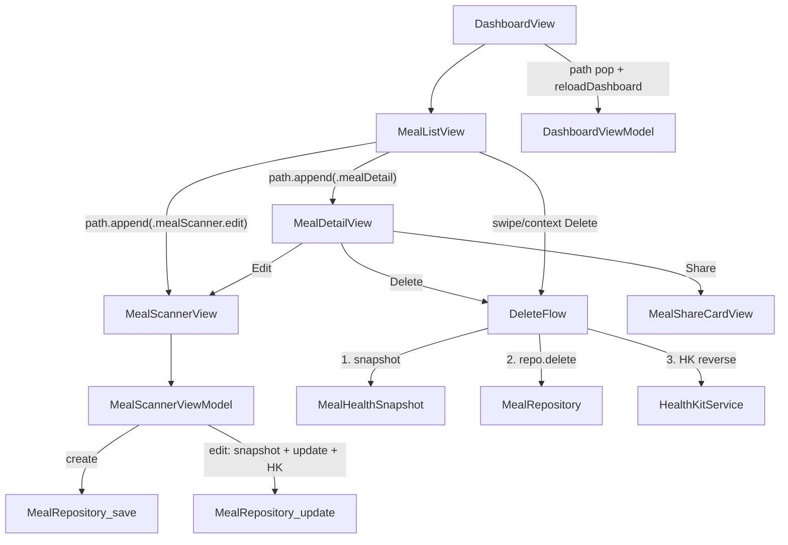

# PR5: Meal Detail, Edit & Daily Log

**Status:** Planned  
**Source of truth:** [`docs/technical-spec.md`](../docs/technical-spec.md) (PR 5 section), [`docs/engineering-rules.md`](../docs/engineering-rules.md), [`docs/product-research.md`](../docs/product-research.md), [`PR-04.md`](../docs/implementation/PR-04.md), [`PR-03.md`](../docs/implementation/PR-03.md), [`PR-02.md`](../docs/implementation/PR-02.md), [`PR-01.md`](../docs/implementation/PR-01.md)

---

## 1. Objective

Complete the daily log experience: view a logged meal, edit it through a pre-populated scanner, delete with SwiftData removal + HealthKit reversal, navigate from dashboard meal rows (tap / swipe / context menu), and add the compact Daily Summary Footer. Business logic stays in view models; views stay thin. New PR5 UI lives under `Features/MealLog/`.

**Builds on:** PR3 `DashboardViewModel.loadToday` / `aggregateMeals`; PR4 `MealScannerViewModel` results flow, `EditableFoodItem`, `MealRepository.save`, `HealthKitService.logMeal`.

---

## 2. In scope

- **`MealHealthSnapshot`** — value-type capture of dietary totals + timestamp before delete/edit HK writes
- **`MealRepository`** — `fetchMeal`, `delete` (void), `update`
- **`HealthKitService.reverseMeal(_ snapshot:)`** — negative dietary samples
- **`MealScannerViewModel` edit mode** — hydrate from saved meal, in-place update
- **`MealDetailView`** — read-only meal screen + Edit / Share / Delete
- **`MealListView`** — grouped meal list with swipe/context menu (replaces `TodaysMealsSection` usage)
- **`DailySummaryFooterView`** — fiber, net kcal, macro % text
- **`DashboardRoute`** — typed `NavigationStack` path (no bare `UUID?` routing state)
- **Scroll architecture** — locked embedded non-scrolling `List` inside dashboard `ScrollView`
- **Unit tests** — `testMealDeletion()`, `testMealEdit()`
- **`#Preview`** on every new view file

---

## 3. Out of scope

- `MealDetailView` naming under `Features/MealDetail/` (use `Features/MealLog/` instead)
- USDA hybrid fallback, Settings API-key UI, `PrivacyInfo.xcprivacy`, `Localizable.strings` (PR8–PR10)
- `WeighInView`, full weight chart (PR6)
- Storing HealthKit sample UUIDs on `MealEntry` (no schema change)
- `project.yml` / xcodegen — register files in `CalSnap.xcodeproj` only
- PR6+ work of any kind

---

## 4. Architecture (data flow)



**Refresh strategy (PR3/PR4 pattern):** `reloadDashboard()` → `loadToday(context:activeUserId:)` after path pop from scanner/detail, or immediately after delete. Document as spec extension (spec mentions Combine as an alternative).

---

## 5. ScrollView + List architecture (locked)

**Decision:** Keep the PR3 dashboard as a **`ScrollView` + `VStack`** for ring, macros, meals, footer, and weight chart. Swipe-to-delete requires `List` rows — do **not** nest a scrolling `List` inside the `ScrollView`.

**Chosen pattern — embedded non-scrolling `List`:**

`MealListView` renders a `List` with one `Section` per `MealType`, applies:

- `.listStyle(.plain)`
- `.scrollContentBackground(.hidden)`
- `.scrollDisabled(true)` — meal list does not scroll independently; outer `ScrollView` owns vertical scroll
- `.frame(height: mealListHeight)` — explicit height from row/section counts (e.g. `CGFloat(populatedRows + emptySections) * rowHeight + sectionHeaderPadding`)

Row height constant (~56pt) matches current `TodaysMealsSection` row layout. Recompute `mealListHeight` when `meals` changes.

**Why not alternatives:**

| Approach | Rejected because |
|----------|------------------|
| Full-dashboard `List` with card sections | Large PR3 layout rewrite; out of PR5 scope |
| Scrolling `List` inside `ScrollView` | Nested scroll conflicts, poor UX |
| `ScrollView` + custom swipe gesture | Reinvents `swipeActions`; fragile |
| Context-menu-only delete (no swipe) | Fails spec swipe-to-delete requirement |

`swipeActions` and `.contextMenu` attach to rows inside the non-scrolling `List`. Ring, macros, footer, and chart remain sibling views in the outer `ScrollView`.

---

## 6. Navigation (locked — typed routes)

Replace PR4's `navigationDestination(isPresented: $showScanner)` with a **single typed path** on the dashboard `NavigationStack`:

```swift
// CalSnap/Features/MealLog/DashboardRoute.swift
enum DashboardRoute: Hashable {
    case mealDetail(MealEntry)
    case mealScanner(MealScannerRoute)
}

enum MealScannerRoute: Hashable {
    case create(initialMealType: MealType?)
    case edit(MealEntry)
}
```

```swift
// DashboardView
@State private var navigationPath: [DashboardRoute] = []

NavigationStack(path: $navigationPath) { ... }
    .navigationDestination(for: DashboardRoute.self) { route in
        switch route {
        case .mealDetail(let meal):
            MealDetailView(meal: meal, onMealChanged: { reloadDashboard() }, path: $navigationPath)
        case .mealScanner(let scannerRoute):
            MealScannerView(activeUserId: activeUserId, route: scannerRoute)
        }
    }
```

**Rules:**

- **No** `@State private var selectedMealId: UUID?` or separate `showScanner` bool
- Row tap: `navigationPath.append(.mealDetail(meal))` — pass the live `MealEntry` from `viewModel.todaysMeals`
- Row edit / detail Edit: `navigationPath.append(.mealScanner(.edit(meal)))`
- FAB: `navigationPath.append(.mealScanner(.create(initialMealType: nil)))`
- Empty-section "Add Breakfast": `navigationPath.append(.mealScanner(.create(initialMealType: .breakfast)))`
- On meal changed (save/delete): `reloadDashboard()`; pop path as needed

**`MealEntry` in routes:** SwiftData `@Model` reference identity is stable within the session; destinations receive the model and re-fetch via `MealRepository.fetchMeal` on appear if totals must be fresh. If `MealEntry` fails `Hashable` at compile time, add `Hashable` via `PersistentIdentifier` equality wrapper — still a typed enum case, not a bare UUID optional.

**Migrate PR4 scanner entry:** Remove `isPresented` scanner destination; FAB and all meal actions use `navigationPath.append`.

---

## 7. Delete flow (pre-delete snapshot)

**Do not** return a deleted `MealEntry` from `MealRepository.delete`.

### `MealHealthSnapshot`

Create [`CalSnap/Core/Models/MealHealthSnapshot.swift`](CalSnap/Core/Models/MealHealthSnapshot.swift):

```swift
struct MealHealthSnapshot: Sendable, Equatable {
    let timestamp: Date
    let totalCalories: Int
    let totalProteinG: Double
    let totalCarbsG: Double
    let totalFatG: Double
    let totalFiberG: Double

    init(meal: MealEntry) { ... }
}
```

Value-type only — safe to pass to `HealthKitService` after SwiftData deletion.

### Repository

```swift
func fetchMeal(id: UUID, context: ModelContext) throws -> MealEntry?
func delete(id: UUID, context: ModelContext) throws  // void; no return
func update(_ entry: MealEntry, items: [FoodItem], context: ModelContext) throws
```

### Delete sequence (detail, swipe, context menu)

```
1. meal = fetchMeal(id:)           // guard nil → abort
2. snapshot = MealHealthSnapshot(meal: meal)
3. try mealRepository.delete(id: meal.id, context:)
4. Task { try? await healthKit.reverseMeal(snapshot) }   // fire-and-forget
5. reloadDashboard()
```

Snapshot is taken **before** `context.delete`. HK reversal uses the snapshot, not a post-delete model reference.

Extract shared helper (e.g. `MealDeletionService` static method or `MealDetailViewModel.deleteMeal`) to avoid duplicating steps 1–4 across `MealDetailView` and `DashboardView` delete alert.

### HealthKit

```swift
func reverseMeal(_ snapshot: MealHealthSnapshot) async throws
```

Negative-quantity `HKQuantitySample`s at `snapshot.timestamp` for all five dietary types. `logMeal(_ entry: MealEntry)` unchanged for creates; edit path may call `logMeal` on the updated entry after reversing the pre-edit snapshot.

---

## 8. Edit persistence strategy (locked — spec extension)

Document in PR description; implement exactly as follows:

| Field / behavior | On edit save |
|------------------|--------------|
| `MealEntry.id` | **Preserved** — in-place update, not delete+insert |
| `userId` | Preserved |
| `timestamp` | **Preserved** — original log time kept |
| `mealType`, `photoData`, `textDescription`, totals, confidence fields, `estimationNotes` | Overwritten from scanner VM |
| `FoodItem` children | **Replace** — delete all existing child `FoodItem`s from `ModelContext`, insert new items from `editableItems.map { $0.toFoodItem() }` |
| `FoodItem.id` | New UUIDs on replace (acceptable; no FK references elsewhere) |
| Scanner phase on open | Jump directly to `.results`; hide Re-analyze |
| HK | `reverseMeal(oldSnapshot)` then `logMeal(updatedEntry)` — fire-and-forget both |

`MealScannerViewModel.updateMeal(context:)`:

1. `let oldSnapshot = MealHealthSnapshot(meal: fetchedExisting)`
2. `try mealRepository.update(updatedEntry, items:, context:)`
3. `Task { reverseMeal(oldSnapshot); logMeal(updatedEntry) }`

`makeMealEntry()` when `isEditing`: use stored `editingMealId` + `editingTimestamp`, not `Date()` / new UUID.

---

## 9. Fiber target rule (locked — spec extension)

Spec example shows `"14g / 25g"` — **PR5 uses the existing PR3 formula**, not a fixed 25g:

```
fiberTargetG = (dailyCalorieTarget / 1000) × AppConstants.Nutrition.fiberGramsPer1000Kcal
```

Same source as `DashboardViewModel.fiberTargetG` and `MacroBarCard` fiber bar.

**Footer fiber color** (ratio = `todaysFiberG / fiberTargetG`, guard `fiberTargetG > 0`):

| Ratio | Color | Meaning |
|-------|-------|---------|
| ≥ 0.90 | `.green` | On target |
| 0.70 ..< 0.90 | `.yellow` | Below target |
| < 0.70 | `.red` | Chronically low |

Display: `"\(Int(todaysFiberG.rounded()))g / \(Int(fiberTargetG.rounded()))g"` with `fiberProgressColor`.

---

## 10. MealScannerViewModel edit mode

Extend [`CalSnap/Features/MealScanner/MealScannerViewModel.swift`](CalSnap/Features/MealScanner/MealScannerViewModel.swift):

| Addition | Purpose |
|----------|---------|
| `var editingMealId: UUID?` | nil = create |
| `private var editingTimestamp: Date?` | Preserve log time |
| `func loadForEditing(meal: MealEntry)` | Hydrate → `phase = .results` |
| `var isEditing: Bool` | UI branching |
| `func saveMeal(context:) async throws` | Routes create vs update |
| `func updateMeal(context:) async throws` | Snapshot → repo update → HK reverse+log |

Add `EditableFoodItem.from(foodItem:)` in [`EditableFoodItem.swift`](CalSnap/Features/MealScanner/EditableFoodItem.swift).

Extend [`MealScannerView.swift`](CalSnap/Features/MealScanner/MealScannerView.swift): accept `route: MealScannerRoute` instead of loose optional params; on appear resolve `.edit(meal)` → `loadForEditing`, `.create(type)` → set `mealType`.

Extend [`MealAnalysisResultView.swift`](CalSnap/Features/MealScanner/MealAnalysisResultView.swift): `isEditing` → `"Save Changes"`, hide Re-analyze.

---

## 11. MealLog views

| File | Purpose |
|------|---------|
| [`CalSnap/Features/MealLog/DashboardRoute.swift`](CalSnap/Features/MealLog/DashboardRoute.swift) | `DashboardRoute`, `MealScannerRoute` |
| [`CalSnap/Features/MealLog/MealDetailViewModel.swift`](CalSnap/Features/MealLog/MealDetailViewModel.swift) | Load, delete (snapshot flow), share image |
| [`CalSnap/Features/MealLog/MealDetailView.swift`](CalSnap/Features/MealLog/MealDetailView.swift) | Read-only layout; toolbar Edit / Share / Delete |
| [`CalSnap/Features/MealLog/MealShareCardView.swift`](CalSnap/Features/MealLog/MealShareCardView.swift) | `ImageRenderer` share card |
| [`CalSnap/Features/MealLog/MealListView.swift`](CalSnap/Features/MealLog/MealListView.swift) | Non-scrolling `List`, four sections, swipe, context menu, empty placeholders |

`MealDetailView` receives `meal: MealEntry` from route (not `mealId: UUID`). Reuses scanner subviews: `MacroSplitBar`, `FoodItemRowView`, `ConfidenceIndicator`.

`MealListView` callbacks drive path appends (no navigation inside the list view):

```swift
onSelect: (MealEntry) -> Void      // → .mealDetail
onEdit: (MealEntry) -> Void        // → .mealScanner(.edit)
onDelete: (MealEntry) -> Void      // → parent confirmation
onAdd: (MealType) -> Void          // → .mealScanner(.create)
```

---

## 12. Daily Summary Footer

**Create** [`CalSnap/Features/Dashboard/DailySummaryFooterView.swift`](CalSnap/Features/Dashboard/DailySummaryFooterView.swift) — dashboard-local, matches `CalorieRingCard` / `MacroBarCard` placement pattern.

Add to [`DashboardViewModel.swift`](CalSnap/Features/Dashboard/DashboardViewModel.swift):

- `netCalorieDelta`, `fiberProgressColor`, `actualMacroPercents`, `targetMacroPercents`

Insert in [`DashboardView.swift`](CalSnap/Features/Dashboard/DashboardView.swift) after `MealListView`, before `WeightTrendMiniChart`.

---

## 13. Files to create

| Path | Purpose |
|------|---------|
| `CalSnap/Core/Models/MealHealthSnapshot.swift` | Pre-delete / pre-edit HK value snapshot |
| `CalSnap/Features/MealLog/DashboardRoute.swift` | Typed navigation routes |
| `CalSnap/Features/MealLog/MealDetailView.swift` | Full-screen meal read + actions |
| `CalSnap/Features/MealLog/MealDetailViewModel.swift` | Load, delete, share |
| `CalSnap/Features/MealLog/MealShareCardView.swift` | Share card for `ImageRenderer` |
| `CalSnap/Features/MealLog/MealListView.swift` | Grouped list, swipe, context menu |
| `CalSnap/Features/Dashboard/DailySummaryFooterView.swift` | Compact daily summary |
| `CalSnapTests/MealLogCRUDTests.swift` | `testMealDeletion`, `testMealEdit` |
| `docs/implementation/PR-05.md` | Post-implementation record |

## 14. Files to modify

| Path | Change |
|------|--------|
| `CalSnap/Core/Repositories/MealRepository.swift` | `fetchMeal`, `delete` (void), `update` |
| `CalSnap/Core/Services/HealthKitService.swift` | `reverseMeal(MealHealthSnapshot)` |
| `CalSnap/Features/MealScanner/MealScannerViewModel.swift` | Edit mode, `saveMeal`/`updateMeal` |
| `CalSnap/Features/MealScanner/EditableFoodItem.swift` | `from(foodItem:)` |
| `CalSnap/Features/MealScanner/MealScannerView.swift` | `MealScannerRoute` param; path-driven entry |
| `CalSnap/Features/MealScanner/MealAnalysisResultView.swift` | `isEditing` UI |
| `CalSnap/Features/Dashboard/DashboardView.swift` | `NavigationStack(path:)`, `MealListView`, footer, delete alert |
| `CalSnap/Features/Dashboard/DashboardViewModel.swift` | Footer computed props |
| `CalSnap/Features/Dashboard/TodaysMealsSection.swift` | **Remove** — replaced by `MealListView` |
| `CalSnap.xcodeproj/project.pbxproj` | Register new sources; drop `TodaysMealsSection` if removed |

**Unchanged:** `MealEntry`/`FoodItem` schema, `AppContainer`, `RootView`, onboarding.

---

## 15. Test strategy

**File:** `CalSnapTests/MealLogCRUDTests.swift` (`@MainActor`, in-memory `ModelContainer`)

### `testMealDeletion()`

1. Insert profile + two meals today (800 + 700 kcal)
2. `loadToday` → `todaysCalories == 1500`
3. `let meal = fetchMeal(firstId)!`; `let snapshot = MealHealthSnapshot(meal: meal)` (snapshot constructed; HK not asserted)
4. `try mealRepository.delete(id: meal.id, context:)` — void return
5. Fetch `MealEntry` → count == 1
6. `loadToday` → `todaysCalories == 700`

### `testMealEdit()`

1. Insert profile + one meal (400 kcal) with one `FoodItem`
2. `loadToday` → baseline
3. `MealScannerViewModel.loadForEditing(meal:)` → `adjustItem` to double weight
4. `try await updateMeal(context:)`
5. `loadToday` → `todaysCalories == 800` (scaled); fetch meal → persisted totals match

**Regression:** 19 existing tests + 2 new = **21 total**.

```bash
DEVELOPER_DIR=/Applications/Xcode.app/Contents/Developer xcodebuild -scheme CalSnap -destination 'platform=iOS Simulator,name=iPhone 17' test
```

---

## 16. Acceptance criteria mapping

| Spec criterion | Implementation |
|----------------|----------------|
| All CRUD E2E | Create (PR4), read (`MealDetailView`), update (scanner edit), delete (detail + swipe/menu) |
| Dashboard totals after edit/delete | `reloadDashboard()` on path pop / delete |
| HK log + reversal | `logMeal` (PR4); `reverseMeal(snapshot)` on delete; reverse+log on edit |
| Tap → detail | `navigationPath.append(.mealDetail(meal))` |
| Swipe/context delete | `MealListView` non-scrolling `List` |
| Daily Summary Footer | `DailySummaryFooterView` |
| Share card | `MealShareCardView` + `ImageRenderer` |

---

## 17. Spec extensions (document in PR description)

1. **HealthKit reversal** — `MealHealthSnapshot` + negative dietary samples; no HK UUID fields on `MealEntry`.
2. **Delete flow** — snapshot captured **before** `MealRepository.delete`; repository returns void.
3. **Edit persistence** — in-place `MealEntry` update; preserve `id`/`userId`/`timestamp`; replace child `FoodItem`s; HK reverse old snapshot + log updated entry.
4. **Fiber target** — `(dailyCalorieTarget / 1000) × fiberGramsPer1000Kcal`; color bands at 90% / 70% of target.
5. **Dashboard refresh** — explicit `reloadDashboard()`, not Combine observation.
6. **Navigation** — typed `DashboardRoute` path; `MealEntry` carried in route cases; replaces `isPresented` scanner bool.
7. **List layout** — non-scrolling embedded `List` inside dashboard `ScrollView` for swipe support.
8. **Empty meal sections** — all four `MealType` sections always visible (change from PR3 hide-empty).
9. **Delete confirmation** — alert for swipe and context-menu delete.
10. **Feature folder** — PR5 meal CRUD UI under `Features/MealLog/`; `TodaysMealsSection` retired in favor of `MealListView`.

---

## 18. Risks and mitigations

| Risk | Mitigation |
|------|------------|
| HK negative samples not ideal vs `deleteObjects` | Document; device QA in Health app |
| `MealEntry` `Hashable` for `NavigationPath` | Use `PersistentIdentifier` wrapper if needed; still typed enum |
| Embedded `List` height miscalculation | Unit constant row height; test with 0/1/many meals per section in preview |
| Stale `MealEntry` in path after reload | Detail re-fetches on appear; pop path after delete |
| Duplicate HK on failed edit reverse | Best-effort fire-and-forget (PR4 pattern) |
| Removing `TodaysMealsSection` | Update `DashboardView` + pbxproj; previews move to `MealListView` |

---

## 19. Implementation sequence

1. `MealHealthSnapshot` + `MealRepository` CRUD
2. `HealthKitService.reverseMeal(snapshot)`
3. `DashboardRoute` + migrate `DashboardView` to `NavigationStack(path:)`
4. `MealScannerViewModel` edit mode + `EditableFoodItem.from(foodItem:)`
5. `MealLogCRUDTests`
6. `MealListView` (non-scrolling `List`)
7. `MealDetailViewModel` + `MealDetailView` + `MealShareCardView`
8. `DailySummaryFooterView` + VM footer props
9. Remove `TodaysMealsSection`; register pbxproj; full test run
10. `docs/implementation/PR-05.md`

---

## 20. Suggested commit sequence

1. `feat: add MealHealthSnapshot and MealRepository fetch, update, delete`
2. `feat: add HealthKitService.reverseMeal using MealHealthSnapshot`
3. `feat: add DashboardRoute and typed NavigationStack path`
4. `feat: add MealScannerViewModel edit mode and updateMeal`
5. `test: add MealLogCRUDTests for deletion and edit aggregates`
6. `feat: add MealListView with swipe and context menu actions`
7. `feat: add MealDetailView with share card and snapshot delete flow`
8. `feat: add DailySummaryFooterView and wire dashboard meal log`
9. `refactor: remove TodaysMealsSection in favor of MealListView`
10. `docs: add PR-05 implementation record`
