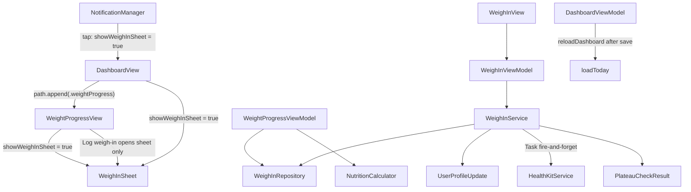

# PR6: Weight Logging & Weigh-In Flow

**Status:** Planned  
**Source of truth:** [`docs/technical-spec.md`](docs/technical-spec.md) (PR 6 section), [`docs/engineering-rules.md`](docs/engineering-rules.md), [`docs/product-research.md`](docs/product-research.md), [`PR-03.md`](PR-03.md), [`PR-04.md`](PR-04.md), [`PR-05.md`](PR-05.md)

**Implementation record output:** [`PR-06.md`](PR-06.md) (repo root, same convention as sibling PR files)

---

## 1. Objective

Deliver weekly weigh-in UX, dynamic TDEE/target recalculation on save, full `WeightProgressView` with Swift Charts projection, minimal weekly local notification scheduling, and HealthKit body-mass writes. Reuse PR3 repository/VM patterns, PR4/PR5 fire-and-forget HealthKit + `reloadDashboard()` lifecycle, and existing [`NutritionCalculator`](CalSnap/Core/Services/NutritionCalculator.swift) / [`WeighIn`](CalSnap/Core/Models/WeighIn.swift) model. **No schema changes.**

**Builds on:** PR3 [`WeighInRepository`](CalSnap/Core/Repositories/WeighInRepository.swift), [`DashboardViewModel`](CalSnap/Features/Dashboard/DashboardViewModel.swift) plateau logic; PR4 [`HealthKitService`](CalSnap/Core/Services/HealthKitService.swift) write pattern; PR5 [`DashboardRoute`](CalSnap/Features/MealLog/DashboardRoute.swift) typed `NavigationStack(path:)` + `reloadDashboard()`.

---

## 2. In scope

- **`WeighInView`** — sheet: weight input, lbs/kg toggle, date picker, TDEE/target preview, Save, Skip ("Remind me tomorrow")
- **`WeighInService`** — **single** save/recalc/HK/plateau pipeline used by both `WeighInView` and `WeightProgressView`
- **`WeightProgressView`** — header stats, progress bar, full Swift Charts (actual + dashed projection + goal line), stats grid, history list
- **Minimal `NotificationManager`** — schedule / cancel / snooze weekly reminder; notification tap sets dashboard sheet flag only
- **PR5 route extension** — add `.weightProgress` to existing `DashboardRoute`; no parallel routing types or stacks
- **Plateau upgrade** — replace PR3 "last 3 any-spacing" proxy with weekly cadence
- **Unit tests** — range-based and state-based assertions (not exact-date fragile)
- **`#Preview`** on every new view file

---

## 3. Out of scope

- Settings day/time pickers for reminder (PR8) — PR6 uses **temporary** AppStorage defaults (see §10)
- Analytics screen reuse of `WeightProgressView` (PR7)
- HealthKit weight **read** sync (PR8)
- Persisted unit preference UI (PR8) — continue `Locale.current.measurementSystem` via [`DashboardViewModel.useLbsForDisplay`](CalSnap/Features/Dashboard/DashboardViewModel.swift)
- Notification deep-link navigation, universal links, or any routing beyond dashboard sheet presentation
- Widgets, daily log reminders, Siri intents (PR10)
- `UserProfile` / `WeighIn` schema changes
- `project.yml` / xcodegen — register in [`CalSnap.xcodeproj`](CalSnap.xcodeproj) only

---

## 4. Architecture



### WeighInService — single pipeline

[`WeighInService`](CalSnap/Core/Services/WeighInService.swift) is the **only** save entry point. Both [`WeighInViewModel`](CalSnap/Features/Progress/WeighInViewModel.swift) and the weigh-in flow launched from [`WeightProgressView`](CalSnap/Features/Progress/WeightProgressView.swift) call it.

```swift
enum WeighInService {
    struct SaveResult {
        let weighIn: WeighIn
        let didTriggerPlateau: Bool  // informational; dashboard re-checks on reload
    }

    static func recalculate(profile: UserProfile, newWeightKg: Double) -> RecalculationResult
    static func save(
        profile: UserProfile,
        newWeightKg: Double,
        date: Date,
        weighInRepository: WeighInRepository,
        healthKitService: HealthKitService,
        context: ModelContext
    ) throws -> SaveResult
}
```

**`save` steps (atomic SwiftData, then async HK):**
1. `recalculate(profile:newWeightKg:)` → update `tdee`, `dailyCalorieTarget`, `deficitKcal`, `updatedAt`
2. Create + insert `WeighIn` with snapshot fields (`calculatedTDEE`, `adjustedDailyTarget`, `bmi`)
3. `context.save()`
4. `Task { try? await healthKitService.logBodyMass(...) }` — fire-and-forget (PR4 pattern)
5. Evaluate weekly plateau weigh-ins → return `didTriggerPlateau` (dashboard still calls `checkForPlateau()` after `reloadDashboard()`)

**`WeightProgressViewModel` does not save.** It loads/displays data and opens the shared weigh-in sheet; save always goes through `WeighInService` via `WeighInViewModel`.

### Recalculation contract (preserve deficit)

On save, **keep `profile.deficitKcal`** (honors PR3 Diet Break `0` and Small Reduction deltas):

```
newBMR  = NutritionCalculator.bmr(newWeightKg, height, age, sex)
newTDEE = NutritionCalculator.tdee(newBMR, activityLevel)
(target, effectiveDeficit, _) = NutritionCalculator.dailyTarget(newTDEE, profile.deficitKcal, sex)

profile.tdee = Int(newTDEE.rounded())
profile.dailyCalorieTarget = target
profile.deficitKcal = effectiveDeficit
profile.updatedAt = Date()
```

**Current weight for display:** latest `WeighIn` by `date`, else `startingWeightKg`. Do **not** mutate `startingWeightKg` on save.

### Plateau: weekly cadence (replaces PR3 proxy)

PR3 uses [`fetchLatestWeighIns(count: 3)`](CalSnap/Core/Repositories/WeighInRepository.swift) (any spacing). PR6 adds `fetchWeeklyPlateauWeighIns(for:count:minimumDaySpacing:context:)`:

- Fetch all weigh-ins for user, sort ascending
- Walk backward from most recent; keep entries ≥ **6 days** apart
- Take last **3**; pass to [`NutritionCalculator.isOnPlateau`](CalSnap/Core/Services/NutritionCalculator.swift)
- Update [`DashboardViewModel.loadToday`](CalSnap/Features/Dashboard/DashboardViewModel.swift) to use this fetch

After save: `reloadDashboard()` → `checkForPlateau()` → existing [`PlateauAlertSheet`](CalSnap/Features/Dashboard/PlateauAlertSheet.swift).

### Notification handling — minimal (PR6 only)

No navigation system, no `userInfo` routing, no notification-driven `NavigationStack` pushes.

| API | Purpose |
|-----|---------|
| `requestPermissionIfNeeded()` | Ask once when dashboard first schedules |
| `scheduleWeighInReminder(userId:name:)` | Weekly repeating local notification |
| `cancelWeighInReminder(userId:)` | Remove pending request for user |
| `snoozeUntilTomorrow(userId:)` | Skip flow: suppress prompt until tomorrow start-of-day |
| `onWeighInReminderTapped` callback | Sets `@State showWeighInSheet = true` on `DashboardView` |

**Tap handling:** lightweight `UNUserNotificationCenterDelegate` in [`CalSnapApp`](CalSnap/App/CalSnapApp.swift) forwards `WEIGH_IN` category taps to `NotificationManager`, which invokes a closure registered by `DashboardView.onAppear`. No route changes, no `activeUserId` switching from notification payload.

**Skip tomorrow:** `NotificationManager.snoozeUntilTomorrow` + AppStorage `weighInSnoozeUntil_{uuid}`; optionally reschedule one-off +24h notification. No `WeighIn` record.

Add `NSUserNotificationsUsageDescription` to [`Info.plist`](CalSnap/Resources/Info.plist).

### HealthKit body mass

[`HealthKitService.logBodyMass(kg:at:)`](CalSnap/Core/Services/HealthKitService.swift) is called **only** from `WeighInService.save` — not from view models directly.

### Navigation — extend PR5 `DashboardRoute` only

Extend the existing PR5 enum and `navigationDestination` switch in [`DashboardView`](CalSnap/Features/Dashboard/DashboardView.swift). **Do not** introduce `WeightRoute`, a second `NavigationStack`, or notification-driven path appends.

```swift
// DashboardRoute.swift — add one case to existing enum
enum DashboardRoute: Hashable {
    case mealDetail(MealEntry)
    case mealScanner(MealScannerRoute)
    case weightProgress          // PR6
}
```

- [`WeightTrendMiniChart`](CalSnap/Features/Dashboard/WeightTrendMiniChart.swift): tap → `navigationPath.append(.weightProgress)`
- `WeightProgressView`: "Log weigh-in" → `showWeighInSheet = true` (shared binding passed from `DashboardView`)
- `WeighInView`: `.sheet` on `DashboardView` only; dismissed after save → `reloadDashboard()`
- `reloadDashboard()` on weigh-in dismiss-after-save (same as PR5 `onMealSaved`)

---

## 5. Files to create

| Path | Purpose |
|------|---------|
| [`CalSnap/Features/Progress/WeighInView.swift`](CalSnap/Features/Progress/WeighInView.swift) | Sheet UI per spec |
| [`CalSnap/Features/Progress/WeighInViewModel.swift`](CalSnap/Features/Progress/WeighInViewModel.swift) | Draft state + preview; **save via `WeighInService` only** |
| [`CalSnap/Features/Progress/WeightProgressView.swift`](CalSnap/Features/Progress/WeightProgressView.swift) | Full chart, stats grid, history; opens sheet, does not save |
| [`CalSnap/Features/Progress/WeightProgressViewModel.swift`](CalSnap/Features/Progress/WeightProgressViewModel.swift) | Load/display only; chart series + stats |
| [`CalSnap/Core/Services/WeighInService.swift`](CalSnap/Core/Services/WeighInService.swift) | Sole save/recalc/HK/plateau pipeline |
| [`CalSnap/Core/Services/NotificationManager.swift`](CalSnap/Core/Services/NotificationManager.swift) | schedule / cancel / snooze + tap callback |
| [`CalSnapTests/WeighInTests.swift`](CalSnapTests/WeighInTests.swift) | Three PR6 spec tests (range/state-based) |

Use `Features/Progress/` per repo structure in technical-spec.

---

## 6. Files to modify

| Path | Change |
|------|--------|
| [`CalSnap/Core/Repositories/WeighInRepository.swift`](CalSnap/Core/Repositories/WeighInRepository.swift) | `save`, `fetchAll(for:sortDescending:)`, `fetchWeeklyPlateauWeighIns` |
| [`CalSnap/Core/Services/NutritionCalculator.swift`](CalSnap/Core/Services/NutritionCalculator.swift) | `projectedGoalDate(...)`, `weeklyLossRateKg(from:)` |
| [`CalSnap/Core/Services/HealthKitService.swift`](CalSnap/Core/Services/HealthKitService.swift) | `logBodyMass(kg:at:)` |
| [`CalSnap/Core/Utilities/Constants.swift`](CalSnap/Core/Utilities/Constants.swift) | AppStorage keys: reminder weekday/time, weigh-in snooze |
| [`CalSnap/Features/MealLog/DashboardRoute.swift`](CalSnap/Features/MealLog/DashboardRoute.swift) | Add `.weightProgress` to **existing** enum |
| [`CalSnap/Features/Dashboard/DashboardViewModel.swift`](CalSnap/Features/Dashboard/DashboardViewModel.swift) | Weekly plateau fetch |
| [`CalSnap/Features/Dashboard/DashboardView.swift`](CalSnap/Features/Dashboard/DashboardView.swift) | Extend existing `navigationDestination`; `showWeighInSheet`; notification callback |
| [`CalSnap/Features/Dashboard/WeightTrendMiniChart.swift`](CalSnap/Features/Dashboard/WeightTrendMiniChart.swift) | Tappable → `.weightProgress`; "Log weigh-in" sets sheet flag |
| [`CalSnap/App/AppContainer.swift`](CalSnap/App/AppContainer.swift) | Wire `notificationManager` |
| [`CalSnap/App/CalSnapApp.swift`](CalSnap/App/CalSnapApp.swift) | Minimal delegate → `NotificationManager` tap callback |
| [`CalSnap/Resources/Info.plist`](CalSnap/Resources/Info.plist) | `NSUserNotificationsUsageDescription` |
| [`CalSnap.xcodeproj/project.pbxproj`](CalSnap.xcodeproj/project.pbxproj) | Register new sources |

**Unchanged:** `WeighIn` model, `PlateauAlertSheet`, `UserProfile` schema, `RootView` onboarding gate, `MealScannerRoute`.

---

## 7. WeightProgressView detail

| Section | Implementation |
|---------|----------------|
| Header | Current (latest weigh-in), Start (`startingWeightKg`), Goal (`goalWeightKg`) via [`UnitFormatters`](CalSnap/Core/Utilities/Extensions/UnitFormatters.swift) |
| Progress bar | `start → current → goal` linear fraction |
| Chart | `LineMark`+`PointMark` (actual), dashed `LineMark` (projection from [`weightProjection`](CalSnap/Core/Services/NutritionCalculator.swift)), `RuleMark` (goal weight) |
| Stats | Lost so far, to goal, rate (~lbs/week from last 4 via `weeklyLossRateKg`), projected goal date via `projectedGoalDate` |
| History | All weigh-ins, most recent first |
| Empty state | Reuse mini-chart messaging; CTA sets `showWeighInSheet = true` |
| Save | **None in this view** — sheet → `WeighInView` → `WeighInService` |

Projection: iterate `weightProjection` until `weightKg <= goalWeightKg` or cap at 104 weeks; map week index → calendar date for chart X-axis.

---

## 8. Implementation steps

1. Extend `NutritionCalculator` with `projectedGoalDate` + `weeklyLossRateKg`
2. Extend `WeighInRepository` (save, fetchAll, weekly plateau fetch)
3. Implement `WeighInService` as sole save/recalc/HK/plateau pipeline
4. Add `HealthKitService.logBodyMass` (WeighInService-only caller)
5. Implement minimal `NotificationManager` + AppStorage keys + Info.plist + tap callback
6. Build `WeighInViewModel` / `WeighInView` (preview + save via `WeighInService`)
7. Build `WeightProgressViewModel` / `WeightProgressView` (display + sheet trigger only)
8. Extend PR5 `DashboardRoute` + `DashboardView.navigationDestination`; wire chart tap + sheet + plateau fetch
9. Add `WeighInTests` with range/state assertions
10. Register pbxproj; run full test suite (21 existing + 3 new = **24**)
11. Write [`PR-06.md`](PR-06.md) at repo root

---

## 9. Test plan

**Philosophy:** Range-based and state-based assertions only. No exact calendar dates, no exact TDEE integers without derived bounds. Use relative date offsets for setup; assert on relationships and boolean/count state.

**Command:**
```bash
DEVELOPER_DIR=/Applications/Xcode.app/Contents/Developer xcodebuild -scheme CalSnap -destination 'platform=iOS Simulator,name=iPhone 17' test
```

### `testWeighInRecalculation()` — `WeighInTests`

| Step | Action |
|------|--------|
| Setup | In-memory `ModelContainer`; male profile: `startingWeightKg=80`, `heightCm=178`, `activityLevel=.moderatelyActive`, `deficitKcal=350`; capture pre-save `tdee` and `dailyCalorieTarget` |
| Act | `WeighInService.save(..., newWeightKg: 78, ...)` |
| Assert (state/range) | `profile.tdee < preSaveTDEE`; `profile.dailyCalorieTarget < preSaveTarget`; `profile.deficitKcal` unchanged unless safety floor applied; `WeighIn.calculatedTDEE == profile.tdee`; `WeighIn.adjustedDailyTarget == profile.dailyCalorieTarget`; `WeighIn.bmi` within `24.0...25.0` for 78 kg / 178 cm |

### `testProjectedGoalDate()` — `WeighInTests`

| Step | Action |
|------|--------|
| Setup | `currentWeightKg=80`, `goalWeightKg=72`, male, 178 cm, age 35, `.moderatelyActive`, `dailyDeficitKcal=350`, `referenceDate = Date()` |
| Act | `NutritionCalculator.projectedGoalDate(...)` |
| Assert (range only) | Result is non-nil; `projectedDate > referenceDate`; weeks-to-goal ∈ **14...30** (computed via `dateComponents`, not string equality) |

Do **not** assert an exact day/month/year.

### `testPlateauTriggeredOnSave()` — `WeighInTests`

| Step | Action |
|------|--------|
| Setup | Profile + 2 prior weigh-ins at same `weightKg` (80.0), dates offset **−14d** and **−7d** from today (relative, not fixed anchors) |
| Act | `WeighInService.save(..., newWeightKg: 80.0, date: today)`; `DashboardViewModel.loadToday` |
| Assert (state only) | `viewModel.plateauWeighIns.count == 3`; `NutritionCalculator.isOnPlateau(weighIns: viewModel.plateauWeighIns) == true`; `viewModel.showPlateauAlert == true`; maintenance/snooze AppStorage keys absent |

Do **not** assert exact weigh-in dates in fetched records.

**Regression:** PR1–PR5 tests (21) must still pass.

### Manual QA

- Save weigh-in → dashboard ring target updates immediately
- Tap weight card → `WeightProgressView` via `.weightProgress` route
- Notification tap → weigh-in sheet only (no navigation push)
- Skip → no save; snooze suppresses sheet until tomorrow
- HealthKit write on device (simulator may no-op)
- Dual-user: separate reminder identifiers per UUID

---

## 10. Spec extensions (document in [`PR-06.md`](PR-06.md))

1. **Recalculation preserves `deficitKcal`** — only TDEE/target recomputed from new weight
2. **Plateau cadence** — last 3 weigh-ins with ≥6-day spacing (replaces PR3 count-based proxy)
3. **Notification identifier** — `weigh-in-{userId}` not `userName`
4. **Temporary reminder defaults (until PR8 Settings UI)** — PR6 schedules weekly reminders using hardcoded AppStorage defaults: **Sunday, 08:00** local time, per active user. PR8 Settings will expose day/time pickers that read/write the same AppStorage keys and call `NotificationManager.reschedule`. This is an intentional interim spec extension; PR6 acceptance does not require Settings UI.
5. **`NotificationManager` introduced in PR6** — minimal scope (schedule/cancel/snooze + sheet tap); PR10 extends for widgets/daily reminders
6. **Notification tap** — presents weigh-in sheet on dashboard only; no deep-link navigation
7. **Current weight** — latest `WeighIn`; `startingWeightKg` unchanged
8. **Projected goal date** — from `weightProjection` deficit model; observed rate (last 4) is display-only
9. **Skip tomorrow** — AppStorage snooze + optional one-off notification; no `WeighIn` record
10. **`WeighInService` sole pipeline** — both entry points save through one service; view models do not write HK or SwiftData directly
11. **PR5 route extension** — `.weightProgress` added to existing `DashboardRoute`; no parallel routing
12. **HealthKit** — fire-and-forget after SwiftData save (PR4 pattern)
13. **Reload** — `reloadDashboard()` on weigh-in dismiss-after-save (PR5 pattern)

---

## 11. Risks

| Risk | Mitigation |
|------|------------|
| PR6 spec says reminder day/time "set in Settings" but Settings is PR8 | Document as **temporary spec extension** (§10.4); PR8 adds pickers on same AppStorage keys |
| PR10 duplicates `NotificationManager` snippet | PR6 owns minimal file; PR10 extends only |
| Simulator: no HealthKit / notification inspection | Graceful no-op + device QA |
| Plateau fires on load AND save | Acceptable: save → reload → `checkForPlateau` |
| Projection with `deficitKcal == 0` (Diet Break) | `projectedGoalDate` returns nil; show "maintaining" copy |
| < 4 weigh-ins for rate stat | Show "—" or "Need more weigh-ins" |
| Sheet presented from `WeightProgressView` while on stack | Pass `showWeighInSheet` binding from `DashboardView`; dismiss progress or present sheet at dashboard level |

---

## 12. Suggested commit sequence

1. `feat: add projectedGoalDate and weekly rate helpers to NutritionCalculator`
2. `feat: add WeighInService as sole save/recalc/HK/plateau pipeline`
3. `feat: extend WeighInRepository with save and weekly plateau fetch`
4. `feat: add HealthKit body mass write`
5. `feat: add minimal NotificationManager with schedule/cancel/snooze`
6. `test: add WeighInTests with range/state assertions`
7. `feat: add WeighInView and WeightProgressView under Features/Progress`
8. `feat: extend DashboardRoute with weightProgress and wire dashboard sheet`
9. `chore: add NSUserNotificationsUsageDescription to Info.plist`
10. `docs: add PR-06.md implementation record`

---

## 13. Definition of done

- [ ] `WeighInService` is the only save path for both weigh-in entry points
- [ ] Weigh-in persists; dashboard TDEE/target update on save
- [ ] `WeightProgressView` reached via `.weightProgress` on existing PR5 `DashboardRoute`
- [ ] Chart: actual + projected + goal line (Swift Charts)
- [ ] Notification: schedule/cancel/snooze; tap opens dashboard sheet only
- [ ] HealthKit body mass write (fire-and-forget via `WeighInService`)
- [ ] Plateau uses weekly cadence; 3 identical weekly weigh-ins trigger alert
- [ ] Exactly 3 new unit tests; range/state assertions; 24 total passing
- [ ] `#Preview` on all new views
- [ ] [`PR-06.md`](PR-06.md) written at repo root
