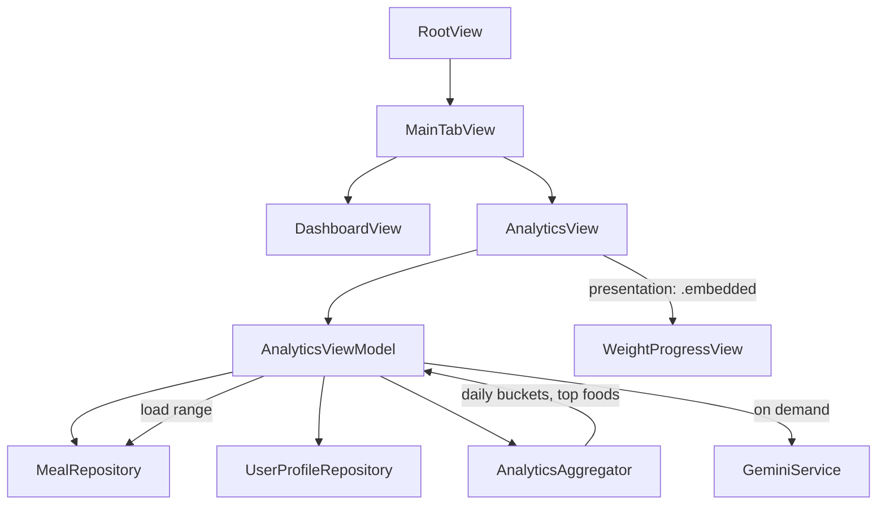

# PR7: Analytics & Insights Screen

**Source of truth:** [docs/technical-spec.md](docs/technical-spec.md) → **### PR 7: Analytics & Insights Screen**; [docs/implementation/PR-05.md](docs/implementation/PR-05.md); [docs/implementation/PR-06.md](docs/implementation/PR-06.md); [docs/engineering-rules.md](docs/engineering-rules.md) → **Architecture** (tab navigation)

**Builds on:** PR5 typed navigation + `reloadDashboard()` lifecycle; PR6 `WeightProgressView` / `WeighInRepository` range fetch pattern; PR3 `DashboardViewModel.progressBand(for:)` (±10% adherence).

---

## Objective

Deliver a new **Analytics** tab that aggregates `MealEntry` data over a user-selected timeframe (7D / 30D / 90D / Custom), renders all spec chart sections with Swift Charts, embeds weight progress as a sub-component, and generates a 2–3 sentence Gemini insight on demand from **aggregated stats only**.

---

## In scope

| Area | Deliverable |
|------|-------------|
| Tab shell | `TabView(selection:)` with Dashboard + Analytics tabs (per **engineering-rules.md → Architecture**) |
| Timeframe | `7D`, `30D`, `90D`, `Custom` (date-range sheet) |
| Dual user | Segmented profile picker when `profiles.count > 1`; shares `@AppStorage(AppStorageKey.activeUserId)` with dashboard |
| Data | `MealRepository.fetchMeals(for:from:through:)` mirroring [WeighInRepository.swift](CalSnap/Core/Repositories/WeighInRepository.swift) half-open day window |
| Aggregation | Pure `AnalyticsAggregator` (unit-testable) + `@MainActor @Observable AnalyticsViewModel` |
| Charts | Calorie adherence bar, macro stacked bars, fiber bars, day-of-week bars, time-of-day bars, macro split comparison, top-5 foods list |
| Weight | Embed PR6 weight UI (not full-screen push) |
| AI | `GeminiService.generateAnalyticsInsight(_:)` — plain text prompt/response, aggregates only |
| Tests | `testAdherenceCalculation`, `testDayOfWeekBreakdown`, `testTopFoodsAggregation` |

## Out of scope (defer to PR8+)

- Settings tab, API-key management UI (PR8) — insight card surfaces `GeminiError.apiKeyMissing` with copy pointing to Settings
- Alcohol calories, highest-calorie meals, fat-loss vs lean-mass estimates (in [product-research.md](docs/product-research.md) but **not** in PR7 technical-spec layout)
- HealthKit weight read sync, CSV export
- Automatic/scheduled insight generation
- Schema changes, new SPM packages
- `project.yml` / xcodegen — register in [CalSnap.xcodeproj/project.pbxproj](CalSnap.xcodeproj/project.pbxproj) only

---

## Architecture



**Load contract (PR5/PR6 pattern):**

```swift
.task(id: reloadToken) { viewModel.load(context: modelContext, activeUserId: activeUserId) }
```

`reloadToken` = composite of `selectedRange` + `activeUserId` (and `customRange` when applicable). On profile switch, clear `aiInsightText` and bump token.

**Layering:**

- **Repository** — SwiftData fetch only (date-filtered meals)
- **`AnalyticsAggregator`** — pure functions: daily rollups, adherence %, macro splits, day-of-week, time-of-day, top foods, weekend vs weekday averages
- **`AnalyticsViewModel`** — orchestrates fetch, calls aggregator, holds chart-ready series, calls Gemini
- **Views** — thin; child `View` structs per section (no `@ViewBuilder` computed properties)

---

## Data layer & aggregation strategy

### 1. `MealRepository` extension

Add to [MealRepository.swift](CalSnap/Core/Repositories/MealRepository.swift):

```swift
func fetchMeals(
    for userId: UUID,
    from startOfWindow: Date,
    through endOfReferenceDay: Date,
    context: ModelContext
) throws -> [MealEntry]
```

Copy predicate/window logic from `WeighInRepository.fetchWeighIns` (`startOfDay` window, `>= windowStart && < dayEnd`, sort by `timestamp`).

### 2. `DateRange` and supporting types

New file [CalSnap/Core/Utilities/AnalyticsTypes.swift](CalSnap/Core/Utilities/AnalyticsTypes.swift):

```swift
enum AnalyticsDateRange: Hashable, Sendable {
    case days(Int)          // 7, 30, 90
    case custom(start: Date, end: Date)
    func resolvedEnd(reference: Date) -> Date
    func resolvedStart(reference: Date) -> Date
}

struct DailyNutritionSummary: Sendable { date, calories, proteinG, carbsG, fatG, fiberG }
struct MacroSplit: Sendable { proteinPct, carbsPct, fatPct }  // kcal-weighted
enum Weekday: Int, CaseIterable { ... }  // Calendar weekday
enum TimeOfDayBucket: CaseIterable { morning, midday, evening, night }
struct TopFoodEntry: Sendable { name, count, avgCalories }
struct AnalyticsInsightPayload: Sendable { /* aggregates only — see Gemini section */ }
```

Hour buckets for time-of-day (spec: morning/midday/evening/night):

| Bucket | Hours (local) |
|--------|----------------|
| morning | 5..<11 |
| midday | 11..<15 |
| evening | 15..<21 |
| night | else |

### 3. Aggregation pipeline (`AnalyticsAggregator`)

New [CalSnap/Core/Services/AnalyticsAggregator.swift](CalSnap/Core/Services/AnalyticsAggregator.swift):

1. **Input:** `[MealEntry]`, `UserProfile`, `Calendar`
2. **Daily rollup:** Group meals by `startOfDay(timestamp)`; sum `totalCalories`, `totalProteinG`, etc. Produce one `DailyNutritionSummary` per day that has ≥1 meal. For **bar charts only**, fill the full selected calendar range with 0-kcal placeholders on days with no meals so the x-axis spans the timeframe.
3. **Adherence (locked):** Reuse `DashboardViewModel.progressBand(for:)` — a logged day is "on target" when `0.90 ≤ intake/target < 1.10`.

   **Denominator = days with ≥1 meal logged** (not all calendar days in range). Days with no meals are excluded from adherence % entirely — they are neither on-target nor off-target.

   ```
   adherencePct = onTargetLoggedDays / loggedDayCount × 100
   ```

   **Formal PR7 spec extension** (record in [docs/implementation/PR-07.md](docs/implementation/PR-07.md) § Spec extensions): PR7 technical-spec prose "% days on target" is interpreted as "% of **logged** days on target," consistent with dashboard daily adherence semantics and avoiding penalizing unlogged days as implicit under-target days.

4. **Macro split:** Kcal-weighted % from summed grams (same math as `DashboardViewModel.actualMacroPercents`, extracted to shared static on `NutritionCalculator`).
5. **Fiber (locked):** Daily fiber series; `daysMeetingFiberTarget` uses the **same profile-derived target as PR3–PR6**:

   ```
   fiberTargetG = (dailyCalorieTarget / 1000) × AppConstants.Nutrition.fiberGramsPer1000Kcal
   ```

   Extract to `NutritionCalculator.fiberTargetG(dailyCalorieTarget:)` (shared with `DashboardViewModel`). **Do not** use the fixed 25g prose from **PR 7 → Section: Fiber & Micronutrients** — that prose is superseded by the established PR3 formula. Document as formal PR7 spec extension in PR-07.md.
6. **Day of week:** Sum calories per `Weekday` across range.
7. **Weekend vs weekday:** Average daily calories for Sat+Sun vs Mon–Fri (text stat in Patterns section).
8. **Time of day:** Sum meal `totalCalories` into `TimeOfDayBucket` by `timestamp` hour.
9. **Top foods:** Flatten `meal.items`, group by normalized `name` (trim + lowercased key, display original casing of most frequent), sort by `count` desc, take 5, `avgCalories = totalCalories / count`.

**Performance:** Single repository fetch per reload; all aggregation in memory. Precompute series in `AnalyticsViewModel.load` — never sort/filter in view `body`.

### 4. Empty state

When **fewer than 3 distinct calendar days with ≥1 meal** in range: show single empty-state card ("Log at least 3 days of meals to see patterns") and hide chart sections + disable insight button. Weight section may still show if weigh-ins exist (optional: hide for consistency — prefer showing weight always).

---

## UI sections (maps 1:1 to spec layout)

New feature folder: `CalSnap/Features/Analytics/`

| Section | View file | Chart / content |
|---------|-----------|-----------------|
| Chrome | `AnalyticsView.swift` | `ScrollView` + `LazyVStack`; toolbar title "Analytics" |
| Timeframe | `AnalyticsTimeframePicker.swift` | `Picker` segmented: 7D / 30D / 90D / Custom; Custom → `.sheet` with start/end `DatePicker`, max end = today |
| Profile | inline in `AnalyticsView` | `Picker` segmented by profile name when `profiles.count > 1` |
| Calorie Adherence | `CalorieAdherenceSectionView.swift` | `BarMark` daily calories + `RuleMark` target; text: avg intake vs target, adherence % |
| Macro Trends | `MacroTrendsSectionView.swift` | Stacked `BarMark` (protein/carbs/fat kcal per day); side-by-side `MacroSplitBar` or `SectorMark` actual vs target |
| Fiber | `FiberSectionView.swift` | `BarMark` daily fiber; text: days meeting profile-derived fiber target |
| Patterns | `PatternsSectionView.swift` | Weekday `BarMark`; time-of-day `BarMark`; weekend vs weekday text; `TopFoodsListView` (top 5) |
| Weight Progress | inline in `AnalyticsView.swift` | Section header + `WeightProgressView(presentation: .embedded, …)` (see below) |
| Insights | `AnalyticsInsightCard.swift` | "Generate insight" `Button`; loading state; paragraph result or error |

**Color bands:** Reuse `CalorieProgressBand` colors from dashboard for adherence bars (green/yellow/red at ±10%).

**Accessibility:** Chart summary labels matching [WeightProgressView.swift](CalSnap/Features/Progress/WeightProgressView.swift) pattern; button labels for generate insight.

---

## WeightProgressView reuse (PR6)

**Problem:** [WeightProgressView.swift](CalSnap/Features/Progress/WeightProgressView.swift) wraps content in its own `ScrollView`, sets `.navigationTitle`, and toolbar — unsuitable inside Analytics `ScrollView`.

**Constraint:** Refactor `WeightProgressView` **only** enough to support an embedded presentation mode. **Do not** duplicate PR6 weight logic, re-compose child views in Analytics, or create a second analytics-specific weight stack.

**Minimal PR7 refactor** (no behavior change for dashboard push):

Add a `presentation` parameter to the existing `WeightProgressView`:

```swift
enum WeightProgressPresentation {
    case navigationStack  // default — current behavior
    case embedded         // section inside parent scroll
}

struct WeightProgressView: View {
    var presentation: WeightProgressPresentation = .navigationStack
    // existing: viewModel, onLogWeighIn, reloadTrigger
}
```

Implementation changes inside `WeightProgressView` only:

- Extract existing `VStack` content into a private `weightProgressContent` used by both modes
- `.navigationStack`: wrap in `ScrollView`, apply `.navigationTitle`, `.toolbar` (unchanged UX)
- `.embedded`: render `weightProgressContent` directly (no outer `ScrollView`, no nav chrome); optional inline "Log weigh-in" button in chart empty-state only (toolbar action omitted)
- `.task(id: reloadTrigger)` and `WeightProgressViewModel.load` unchanged in both modes

**Analytics wiring:**

```swift
// AnalyticsView.swift — Weight Progress section
Section("Weight Progress") {
    WeightProgressView(
        presentation: .embedded,
        viewModel: weightProgressViewModel,
        onLogWeighIn: { presentWeighInSheet(...) },
        reloadTrigger: weightProgressReloadTrigger
    )
}
```

- `AnalyticsView` owns `WeightProgressViewModel`, `reloadTrigger`, and `WeighInSheetContext` sheet (same pattern as [DashboardView.swift](CalSnap/Features/Dashboard/DashboardView.swift))
- No `AnalyticsWeightSectionView.swift` — a section header in `AnalyticsView` is sufficient
- Weight data remains **all-time** (not timeframe-filtered) per PR6 `load()` — formal spec extension in PR-07.md

Dashboard `.weightProgress` route continues using default `.navigationStack` presentation unchanged.

---

## Gemini insight generation

Extend [GeminiService.swift](CalSnap/Core/Services/GeminiService.swift):

```swift
func generateAnalyticsInsight(_ payload: AnalyticsInsightPayload) async throws(GeminiError) -> String
```

- Resolve API key via existing `APIKeyResolver.resolvedGeminiAPIKey()`
- Plain `generateContent(prompt)` — **no** JSON schema (unlike `analyzeMeal`)
- Prompt includes only: timeframe label, day count, avg calories vs target, adherence %, macro split actual vs target, fiber avg vs target, weekend vs weekday delta, top 3 food names + counts, weight trend direction (lost/gained kg over range if weigh-ins exist)
- **Explicitly exclude:** food photos, meal descriptions, individual meal timestamps, raw `FoodItem` lists beyond top-3 names

`AnalyticsViewModel.generateInsight(geminiService:)`:

- Guard `hasEnoughData`, `!isGeneratingInsight`
- Build `AnalyticsInsightPayload` from cached aggregates
- Set `aiInsightText` on success; surface `GeminiError` message on failure
- Clear prior insight when range/profile changes

Optional protocol for tests (follow PR4 mock pattern):

```swift
protocol AnalyticsInsightGenerating: Sendable {
    func generateAnalyticsInsight(_ payload: AnalyticsInsightPayload) async throws(GeminiError) -> String
}
extension GeminiService: AnalyticsInsightGenerating {}
```

Network call not unit-tested; VM state transitions tested with mock returning fixed string.

---

## Tab navigation wiring

Modify [RootView.swift](CalSnap/App/RootView.swift):

```swift
enum AppTab: Hashable { case dashboard, analytics }

TabView(selection: $selectedTab) {
    Tab("Dashboard", systemImage: "house.fill", value: .dashboard) {
        DashboardView()  // keeps own NavigationStack
    }
    Tab("Analytics", systemImage: "chart.bar.fill", value: .analytics) {
        NavigationStack {
            AnalyticsView()
        }
    }
}
```

- Each tab owns independent `NavigationStack` (engineering-rules)
- `@AppStorage(AppStorageKey.activeUserId)` on `AnalyticsView` — profile picker writes same key as dashboard
- Inject `AppContainer.geminiService` via `@Environment`

---

## Files to create

| Path | Purpose |
|------|---------|
| [CalSnap/Core/Utilities/AnalyticsTypes.swift](CalSnap/Core/Utilities/AnalyticsTypes.swift) | `AnalyticsDateRange`, `DailyNutritionSummary`, `MacroSplit`, `Weekday`, `TimeOfDayBucket`, `TopFoodEntry`, `AnalyticsInsightPayload` |
| [CalSnap/Core/Services/AnalyticsAggregator.swift](CalSnap/Core/Services/AnalyticsAggregator.swift) | Pure aggregation functions |
| [CalSnap/Features/Analytics/AnalyticsView.swift](CalSnap/Features/Analytics/AnalyticsView.swift) | Root scroll, sheets, weigh-in sheet, `.task` reload |
| [CalSnap/Features/Analytics/AnalyticsViewModel.swift](CalSnap/Features/Analytics/AnalyticsViewModel.swift) | Load, computed chart series, insight generation |
| [CalSnap/Features/Analytics/AnalyticsTimeframePicker.swift](CalSnap/Features/Analytics/AnalyticsTimeframePicker.swift) | Segmented picker + custom range sheet |
| [CalSnap/Features/Analytics/CalorieAdherenceSectionView.swift](CalSnap/Features/Analytics/CalorieAdherenceSectionView.swift) | Adherence chart + stats |
| [CalSnap/Features/Analytics/MacroTrendsSectionView.swift](CalSnap/Features/Analytics/MacroTrendsSectionView.swift) | Stacked macro bars + split comparison |
| [CalSnap/Features/Analytics/FiberSectionView.swift](CalSnap/Features/Analytics/FiberSectionView.swift) | Fiber chart + days-on-target |
| [CalSnap/Features/Analytics/PatternsSectionView.swift](CalSnap/Features/Analytics/PatternsSectionView.swift) | DOW, time-of-day, weekend text, top foods |
| [CalSnap/Features/Analytics/AnalyticsInsightCard.swift](CalSnap/Features/Analytics/AnalyticsInsightCard.swift) | On-demand insight UI |
| [CalSnapTests/AnalyticsTests.swift](CalSnapTests/AnalyticsTests.swift) | Three spec tests + helper fixtures |
| [docs/implementation/PR-07.md](docs/implementation/PR-07.md) | Implementation record (post-merge) |

## Files to modify

| Path | Change |
|------|--------|
| [CalSnap/Core/Repositories/MealRepository.swift](CalSnap/Core/Repositories/MealRepository.swift) | `fetchMeals(for:from:through:context:)` |
| [CalSnap/Core/Services/GeminiService.swift](CalSnap/Core/Services/GeminiService.swift) | `generateAnalyticsInsight(_:)` + prompt builder |
| [CalSnap/Core/Services/NutritionCalculator.swift](CalSnap/Core/Services/NutritionCalculator.swift) | `macroPercents(proteinG:carbsG:fatG:)`, `fiberTargetG(dailyCalorieTarget:)` — shared with dashboard |
| [CalSnap/Features/Progress/WeightProgressView.swift](CalSnap/Features/Progress/WeightProgressView.swift) | `WeightProgressPresentation` + conditional chrome/scroll only |
| [CalSnap/Features/Dashboard/DashboardViewModel.swift](CalSnap/Features/Dashboard/DashboardViewModel.swift) | Delegate `fiberTargetG` / macro % to `NutritionCalculator` (no behavior change) |
| [CalSnap/App/RootView.swift](CalSnap/App/RootView.swift) | `TabView` shell |
| [CalSnap.xcodeproj/project.pbxproj](CalSnap.xcodeproj/project.pbxproj) | Register new sources |

---

## Formal PR7 spec extensions

These are locked decisions to record in [docs/implementation/PR-07.md](docs/implementation/PR-07.md) § Spec extensions:

1. **Adherence denominator** — `% days on target` = `onTargetLoggedDays / loggedDayCount`. Only days with ≥1 meal count toward the denominator. Unlogged days are excluded (not treated as 0-kcal under-target days).
2. **Fiber target** — Use `NutritionCalculator.fiberTargetG(dailyCalorieTarget:)` (`(target / 1000) × fiberGramsPer1000Kcal`, currently 28g at 2000 kcal). Supersedes the fixed "25g minimum" prose in **PR 7 → Section: Fiber & Micronutrients**; consistent with PR3–PR6 dashboard behavior.
3. **Weight section timeframe** — All-time weigh-ins via existing `WeightProgressViewModel.load()`; not clipped to the analytics meal timeframe.
4. **`InsightsViewModel` naming** — Implement as `AnalyticsViewModel` per **PR 7 → AnalyticsViewModel** code block.

---

## Other risks

| Item | Resolution |
|------|------------|
| Weight embed duplication | Single `WeightProgressView` with `presentation` param; no analytics-specific weight VM or child-view recomposition |
| Custom range max span | Cap at 365 days to avoid unbounded fetch (spec extension) |
| Custom range invalid (start > end) | Clamp/swap in picker sheet before apply |
| Gemini latency | Show `ProgressView` on button; no auto-retry; manual re-tap |
| Dual-scroll | Embedded weight mode must not nest `ScrollView` |
| Chart density on 90D | Use `.chartXAxis` label thinning or scrollable chart frame height ~180–220 |
| `GeminiService` is `actor` | `await geminiService.generateAnalyticsInsight(...)` from `@MainActor` VM |
| Product-research extras (alcohol, highest meals) | Explicitly out of scope — no `FoodItem` alcohol field |

---

## Test plan (exact)

**File:** [CalSnapTests/AnalyticsTests.swift](CalSnapTests/AnalyticsTests.swift)

Use in-memory `ModelContainer` + helper `makeMeals(...)` factory (no network).

### `testAdherenceCalculation()`

**Setup:** Profile `dailyCalorieTarget = 2000`. Seven calendar days of `DailyNutritionSummary` (or meals rolled up by aggregator):

| Day | Calories | Expected band |
|-----|----------|---------------|
| 1 | 1800 | under |
| 2 | 1900 | on track |
| 3 | 2100 | on track |
| 4 | 2200 | over |
| 5 | 2000 | on track |
| 6 | 1700 | under |
| 7 | 2050 | on track |

**Assert:** `AnalyticsAggregator.adherencePercent(dailySummaries:target:)` == `4/7 * 100` ≈ `57.14` (4 on-target days out of 7 **logged** days; denominator = logged day count). Use `accuracy: 0.1`.

**Additional case:** Range with 7 calendar days but only 5 logged → denominator is 5, not 7.

### `testDayOfWeekBreakdown()`

**Setup:** Fixed `Calendar` with known weekday (or inject `Calendar` into aggregator). Meals on 2 Mondays (500 + 600 kcal), 1 Wednesday (800 kcal).

**Assert:** `dayOfWeekBreakdown[.monday] == 1100`, `.wednesday == 800`, other weekdays == 0 (or absent keys = 0).

### `testTopFoodsAggregation()`

**Setup:** 3 meals referencing items: "Chicken" ×4 (200 kcal each), "Rice" ×2 (150 each), "Broccoli" ×1, "Salmon" ×1, "Eggs" ×1, "Yogurt" ×1 (6 distinct foods).

**Assert:** `topFoods(limit: 5)` returns count==5, first.name=="Chicken", first.count==4, first.avgCalories==200; sorted by count descending.

**Regression:** Full suite (currently 64 tests) must pass.

```bash
DEVELOPER_DIR=/Applications/Xcode.app/Contents/Developer xcodebuild -scheme CalSnap -destination 'platform=iOS Simulator,name=iPhone 17' test
```

---

## Acceptance criteria mapping

| Criterion (spec) | Implementation | Verification |
|------------------|----------------|--------------|
| All charts render with real SwiftData data | Repository fetch → aggregator → section views with Swift Charts | Manual QA + in-memory integration smoke in tests |
| Timeframe picker refreshes all charts | `.task(id: reloadToken)` on range/profile change | Manual: switch 7D→30D→90D→Custom |
| Gemini insight &lt; 5s on demand | `generateInsight` button only; `isGeneratingInsight` UI | Manual on device with valid key |
| Graceful empty state when &lt; 3 days of data | `hasEnoughData` gate | Manual + unit test optional for threshold |
| `% days on target` (PR 7 → Section: Calorie Adherence) | `onTargetLoggedDays / loggedDayCount`; unlogged days excluded | `testAdherenceCalculation` + manual |
| `testDayOfWeekBreakdown` | `AnalyticsAggregator` | XCTest |
| `testTopFoodsAggregation` | `AnalyticsAggregator` | XCTest |

---

## Manual QA checklist

- [ ] Analytics tab appears after onboarding; dashboard tab unchanged
- [ ] 7D / 30D / 90D switch reloads all sections
- [ ] Custom range sheet: pick start/end, charts update
- [ ] Dual-user: segmented picker switches data; dashboard active user stays in sync
- [ ] Empty state with 0–2 logged days
- [ ] Calorie bars show target `RuleMark` at profile `dailyCalorieTarget`
- [ ] Adherence % uses logged-days denominator (unlogged days excluded); matches ±10% band from dashboard
- [ ] Fiber "days on target" uses profile-derived target (same as dashboard), not fixed 25g
- [ ] Top 5 foods correct after logging repeated items
- [ ] Weight section: chart + stats visible; "Log weigh-in" opens sheet; save refreshes embedded section
- [ ] Generate insight: success paragraph; missing API key shows actionable error; no raw food names beyond top-3 in network payload (inspect debug log if added)
- [ ] VoiceOver: chart summaries and insight button labels

---

## Implementation order

1. `AnalyticsTypes` + `AnalyticsAggregator` + tests (TDD for three spec tests)
2. `MealRepository` range fetch
3. `AnalyticsViewModel` + load pipeline
4. Section views + charts (adherence → macros → fiber → patterns)
5. `WeightProgressPresentation.embedded` on existing `WeightProgressView`; wire in `AnalyticsView`
6. `GeminiService.generateAnalyticsInsight`
7. `AnalyticsInsightCard` + VM wiring
8. `RootView` TabView shell
9. `PR-07.md` + full regression run
