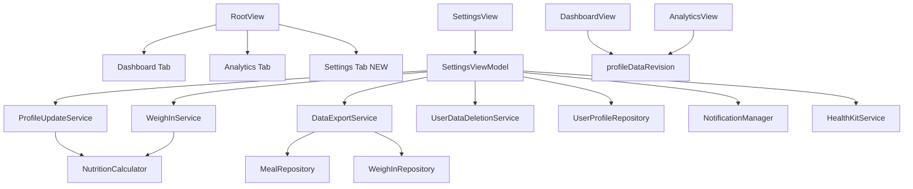

# PR8: Settings Screen Implementation Plan

**Source of truth:** [docs/technical-spec.md](docs/technical-spec.md) (PR 8), [docs/implementation/PR-06.md](docs/implementation/PR-06.md), [docs/implementation/PR-07.md](docs/implementation/PR-07.md), [docs/engineering-rules.md](docs/engineering-rules.md)

**Constraints:** No SwiftData schema changes, no new SPM packages, preserve existing Dashboard + Analytics `TabView` shell.

---

## Approved decisions (locked for implementation)

1. **Daily log reminders → PR10.** Technical-spec PR8 lists them; [PR-06.md §3](docs/implementation/PR-06.md) defers to PR10. **PR8 ships weekly weigh-in reminder UI only.** No placeholder UI, no AppStorage keys, no `NotificationManager` hooks for daily log in PR8. PR10 extends `NotificationManager` for daily reminders.

2. **`profileDataRevision` is the sole cross-tab refresh mechanism.** Bump `@AppStorage(AppStorageKey.profileDataRevision)` on profile save, partner add/remove, and data deletion. Dashboard and Analytics observe `.onChange(of: profileDataRevision)` and reload. No NotificationCenter, no `RootView` tab-selection relay, no `.onAppear`-only refresh.

3. **"Sync now" is active-user-only.** Fetch latest HealthKit body mass for the **currently selected profile** in Settings (`activeUserId`). If reads are enabled and weight differs from latest local weigh-in by ≥0.1 kg, call `WeighInService.save`. No meal backfill, no multi-user loop, no background observer.

4. **Minimal helper surface.** Only add types that clearly isolate testable business logic or remove real duplication. No standalone utilities for one-liner AppStorage reads, no per-section view files, no partner-specific view model, no onboarding form extraction in PR8.

---

## Architecture overview



Business logic lives in `SettingsViewModel` + three services (`ProfileUpdateService`, `DataExportService`, `UserDataDeletionService`). `SettingsView` holds all section UI as inline `Form` sections or small `private` child structs in the same file.

---

## Tab shell (PR7-compatible)

Modify [CalSnap/App/RootView.swift](CalSnap/App/RootView.swift):

- Extend `AppTab` with `.settings`
- Add third tab: `Tab("Settings", systemImage: "gearshape.fill", value: .settings) { NavigationStack { SettingsView() } }`
- **Do not** nest Settings inside Dashboard or Analytics stacks
- **Do not** change existing Dashboard/Analytics tab content or `activeUserId` contract

`SettingsView` mirrors [CalSnap/Features/Analytics/AnalyticsView.swift](CalSnap/Features/Analytics/AnalyticsView.swift):

- `@AppStorage(AppStorageKey.activeUserId)`
- `@Environment(AppContainer.self)` + `modelContext`
- Segmented profile picker when `profiles.count > 1`
- Single `.task(id: reloadToken)` creates VM and loads

---

## Section-by-section behavior

### 1. Profile (edit + recalculation)

**Draft model:** Reuse [ProfileDraft.swift](CalSnap/Features/Onboarding/ProfileDraft.swift) in `SettingsViewModel`. Add macro percent ints (`macroProteinPct`, `macroCarbsPct`, `macroFatPct`) mapped from `UserProfile.macroTarget*Pct * 100`.

**Load:** Map `UserProfile` → draft. Current weight = latest `WeighIn.weightKg` via `WeighInRepository.fetchLatestWeighIns(count: 1)`, else `startingWeightKg`.

**Preview ("Recalculate" button):** `ProfileUpdateService.preview(...)` — pure function using `NutritionCalculator` (same inputs as [WeighInService.recalculate](CalSnap/Core/Services/WeighInService.swift), with draft overrides for height/sex/DOB/activity).

**Save:**

| Field change | Action |
|---|---|
| Height, sex, DOB, activity, goal weight/date | `ProfileUpdateService.apply(to:draft:weightKg:)` updates profile + `updatedAt`; recalculates `tdee`, `dailyCalorieTarget`, `deficitKcal` using **current weight kg** |
| Macro sliders | Persist `macroTarget*Pct` as fractions; no TDEE change |
| Current weight (if changed) | `WeighInService.save(...)` — same PR6 pipeline |

**Read-only UI:** Minimum calorie floor from `AppConstants.Deficit.minCaloriesMale/Female`; TDEE + daily target from preview/saved values.

**Onboarding reuse (partner add only):** `AddPartnerFlowView` binds existing onboarding step views (`ProfileSetupStepView`, `GoalSetupStepView`, `CalorieTargetPreviewStepView`) to a configured `OnboardingViewModel` — no new form components, no extraction refactor in PR8.

### 2. Macro sliders (sum = 100%)

Macro constraint logic lives on **`ProfileUpdateService`** (static methods, tested via `testMacroSliderValidation`):

```swift
static func adjustMacroPercents(changed: MacroKind, newValue: Int, protein: Int, carbs: Int, fat: Int) -> (Int, Int, Int)
static func macroPercentsAreValid(protein: Int, carbs: Int, fat: Int) -> Bool
```

UI: three linked sliders in `SettingsView`; changing one redistributes the other two so sum stays 100. Disable Save when invalid.

### 3. Second user (add / remove)

**Add partner** (only when `profiles.count < 2`):

- `.sheet(item:)` → `AddPartnerFlowView` with internal `NavigationStack`
- Reuses `OnboardingViewModel` starting at `.profileSetup` (skip welcome, HealthKit, API keys)
- Save via `UserProfileRepository.makeUserProfile(from:)` + `save([newProfile], context:)`
- `notificationManager.scheduleWeighInReminder(userId:name:)` for new user
- Keep current `activeUserId`; bump `profileDataRevision`

**Remove partner** (only when `profiles.count == 2`):

- Confirmation alert naming the partner
- `UserDataDeletionService.deleteUserData(userId:...)`
- If removed user was `activeUserId`, switch to remaining profile; bump `profileDataRevision`

### 4. API keys

Reuse [OnboardingViewModel.saveAPIKeys/testGeminiKey](CalSnap/Features/Onboarding/OnboardingViewModel.swift) patterns inline in `SettingsViewModel` (or thin private methods — not a new type):

- Masked status: "Configured" / "Not set"
- `SecureField` for edit; empty submit = no change
- Test via `geminiService.validateAPIKey(key)` + existing `GeminiTestIndicatorView`
- Save via `KeychainManager`; immediate effect through `APIKeyResolver`

### 5. Health & integrations

**New AppStorage keys** in [Constants.swift](CalSnap/Core/Utilities/Constants.swift):

```swift
static let healthKitWritesEnabled = "healthKitWritesEnabled"           // default true
static let healthKitWeightReadsEnabled = "healthKitWeightReadsEnabled" // default true
```

**Gate writes** at existing fire-and-forget call sites (`UserDefaults` check before `Task`):

- [MealScannerViewModel](CalSnap/Features/MealScanner/MealScannerViewModel.swift)
- [MealDeletionService](CalSnap/Features/MealLog/MealDeletionService.swift)
- [WeighInService](CalSnap/Core/Services/WeighInService.swift) `logBodyMass`

**Weight reads:** Add `fetchLatestWeight() async throws -> Double?` to [HealthKitService](CalSnap/Core/Services/HealthKitService.swift).

**Sync now (approved scope):** Active user only — if reads enabled, fetch latest HK body mass; if differs from latest local weigh-in by ≥0.1 kg, `WeighInService.save`. No meal backfill, no multi-user sync, no background observer.

**Authorization:** Toggles on call `healthKitService.requestAuthorization()` when enabled.

### 6. Notifications (PR6 wiring only)

Wire UI to existing per-user keys via [NotificationManager](CalSnap/Core/Services/NotificationManager.swift):

- `AppStorageKey.weighInReminderWeekday/Hour/Minute(userId:)`

**Add on `NotificationManager`:**

```swift
func setReminderSchedule(userId: UUID, weekday: Int, hour: Int, minute: Int)
```

On picker change: persist → `cancelWeighInReminder` → `scheduleWeighInReminder`. Edit schedule for **currently selected profile** in Settings.

**Daily log reminder:** Explicitly **not in PR8** (approved → PR10). No UI, no keys, no stubs.

### 7. Units preferences

**New AppStorage keys:**

```swift
static let useLbsForWeight = "useLbsForWeight"
static let useImperialForHeight = "useImperialForHeight"
```

Read directly in view models — no `DisplayUnitPreferences` type:

```swift
// DashboardViewModel / AnalyticsViewModel
var useLbsForDisplay: Bool {
    UserDefaults.standard.object(forKey: AppStorageKey.useLbsForWeight) as? Bool
        ?? (Locale.current.measurementSystem != .metric)
}
```

Settings toggles write AppStorage; weigh-in sheet receives `useLbs` from the same read path.

### 8. Data (export + deletion)

**`DataExportService`** (pure, testable):

- Input: `[MealEntry]`, `[WeighIn]`
- Output: single CSV `String` with two header blocks (`# meals`, `# weigh_ins`)
- RFC4180 escaping; exclude `photoData`

**Share:** Move existing private `ShareSheet` from [MealDetailView](CalSnap/Features/MealLog/MealDetailView.swift) to `CalSnap/Core/Utilities/ShareSheet.swift` — justified duplication removal (MealDetail + Settings export).

**`UserDataDeletionService`:**

```swift
static func deleteUserData(userId: UUID, context: ModelContext, notificationManager: NotificationManager) throws
static func deleteAllUserData(context: ModelContext, notificationManager: NotificationManager) throws
```

Per user: `context.delete(profile)` (cascade), clear per-user AppStorage keys, `cancelWeighInReminder`. Do not delete Keychain keys.

**Export scope:** Selected profile in Settings picker (same as `activeUserId`).

### 9. About

- Version from `Bundle.main`
- Links to NIH Body Weight Planner, USDA Dietary Guidelines

---

## Propagation to Dashboard / Analytics (approved)

On profile save, partner add/remove, or data deletion:

1. `SettingsViewModel` increments `UserDefaults` / `@AppStorage` `profileDataRevision`
2. [DashboardView](CalSnap/Features/Dashboard/DashboardView.swift) `.onChange(of: profileDataRevision)` → `reloadDashboard()`
3. [AnalyticsView](CalSnap/Features/Analytics/AnalyticsView.swift) `.onChange(of: profileDataRevision)` → reload analytics + weight embed

This is the **only** cross-tab refresh path for PR8.

---

## Files to create

| File | Purpose |
|------|---------|
| `CalSnap/Features/Settings/SettingsView.swift` | Root `Form` with all sections (profile, partner, API keys, HK, notifications, units, data, about) as inline sections or `private` child structs |
| `CalSnap/Features/Settings/SettingsViewModel.swift` | Load/save orchestration, API key state, macro bindings, sync-now |
| `CalSnap/Features/Settings/AddPartnerFlowView.swift` | Abbreviated onboarding sheet; owns `OnboardingViewModel`, reuses existing step views |
| `CalSnap/Core/Services/ProfileUpdateService.swift` | Profile recalculation preview/apply + macro percent adjustment |
| `CalSnap/Core/Services/DataExportService.swift` | CSV generation |
| `CalSnap/Core/Services/UserDataDeletionService.swift` | Scoped deletion + AppStorage cleanup |
| `CalSnap/Core/Utilities/ShareSheet.swift` | Shared `UIActivityViewController` bridge (moved from MealDetailView) |
| `CalSnapTests/SettingsTests.swift` | Three PR8 unit tests |
| `docs/implementation/PR-08.md` | Implementation record (post-build) |

**Explicitly not creating:** `MacroTargetValidator`, `DisplayUnitPreferences`, `AddPartnerFlowViewModel`, per-section `*SectionView.swift` files, `ProfileFieldsForm` / `GoalFieldsForm` extractions.

---

## Files to modify

| File | Change |
|------|--------|
| [RootView.swift](CalSnap/App/RootView.swift) | Add Settings tab + `AppTab.settings` |
| [Constants.swift](CalSnap/Core/Utilities/Constants.swift) | AppStorage keys: units, HK toggles, `profileDataRevision` |
| [HealthKitService.swift](CalSnap/Core/Services/HealthKitService.swift) | `fetchLatestWeight()` |
| [NotificationManager.swift](CalSnap/Core/Services/NotificationManager.swift) | `setReminderSchedule` |
| [UserProfileRepository.swift](CalSnap/Core/Repositories/UserProfileRepository.swift) | `delete(userId:context:)` if not covered by deletion service |
| [MealRepository.swift](CalSnap/Core/Repositories/MealRepository.swift) | `fetchAll(for userId:context:)` for export |
| [WeighInService.swift](CalSnap/Core/Services/WeighInService.swift) | Gate HK body-mass write on `healthKitWritesEnabled` |
| [MealScannerViewModel.swift](CalSnap/Features/MealScanner/MealScannerViewModel.swift) | Gate HK writes |
| [MealDeletionService.swift](CalSnap/Features/MealLog/MealDeletionService.swift) | Gate HK reversal |
| [DashboardViewModel.swift](CalSnap/Features/Dashboard/DashboardViewModel.swift) | `useLbsForDisplay` reads `AppStorageKey.useLbsForWeight` with locale fallback |
| [AnalyticsViewModel.swift](CalSnap/Features/Analytics/AnalyticsViewModel.swift) | Same |
| [DashboardView.swift](CalSnap/Features/Dashboard/DashboardView.swift) | `.onChange(of: profileDataRevision)` reload |
| [AnalyticsView.swift](CalSnap/Features/Analytics/AnalyticsView.swift) | `.onChange(of: profileDataRevision)` reload |
| [MealDetailView.swift](CalSnap/Features/MealLog/MealDetailView.swift) | Import shared `ShareSheet` |
| [CalSnap.xcodeproj/project.pbxproj](CalSnap.xcodeproj/project.pbxproj) | Register PR8 sources |

---

## Test plan (`CalSnapTests/SettingsTests.swift`)

### `testMacroSliderValidation()`

- **Target:** `ProfileUpdateService.adjustMacroPercents` / `macroPercentsAreValid`
- **Act:** Change protein to 40 from (28, 47, 25)
- **Assert:** Sum = 100; all values ∈ 0...100
- **Act:** Invalid triple (30, 30, 30)
- **Assert:** `macroPercentsAreValid` returns false

### `testRecalculationOnProfileEdit()`

- **Target:** `ProfileUpdateService.preview`
- **Setup:** In-memory `UserProfile` (male, 80 kg, 175 cm, moderately active, deficit 350)
- **Act:** Height 180 cm → assert `tdee` increases vs baseline
- **Act:** Weight 75 kg → assert `tdee`/`dailyTarget` decrease; `deficitKcal` preserved unless floor applies
- Range assertions per PR6 philosophy

### `testCSVExport()`

- **Target:** `DataExportService.makeCSV(meals:weighIns:)`
- **Assert:** `# meals` / `# weigh_ins` markers, correct headers, UUIDs and scalar values present, no photo column

**Regression:** 72 tests after +3

```bash
DEVELOPER_DIR=/Applications/Xcode.app/Contents/Developer xcodebuild -scheme CalSnap -destination 'platform=iOS Simulator,name=iPhone 17' test
```

---

## Acceptance criteria mapping

| Spec criterion | Verification |
|---|---|
| Profile edits persist and propagate to dashboard | SwiftData save + `profileDataRevision` → dashboard reload → calorie ring updates |
| API key changes take effect immediately | `APIKeyResolver` per-call Keychain read |
| CSV export generates correctly and shares | `testCSVExport()` + Share sheet |
| Data deletion wipes only targeted user's records | `deleteUserData` scoped; partner intact; `deleteAllUserData` clears both |

---

## Spec extensions (approved)

| Extension | Decision |
|---|---|
| Daily log reminder | **Deferred to PR10** — PR8 notifications section is weigh-in only |
| Sync now scope | **Active user only** — latest HK body mass import |
| HK write gating | AppStorage toggles at call sites; log-only failures |
| Unit prefs | AppStorage overrides with locale fallback (no new type) |
| Profile weight edit | Creates `WeighIn` via `WeighInService`; other fields via `ProfileUpdateService` |
| `profileDataRevision` | **Sole cross-tab refresh mechanism** |

---

## Risks

| Risk | Mitigation |
|------|------------|
| Large `SettingsView.swift` | Use `private` child structs in same file; split only if file exceeds ~500 LOC |
| Macro slider rounding | Logic centralized in `ProfileUpdateService`; disable Save when sum ≠ 100 |
| Dashboard stale after edit | `profileDataRevision` only (approved) |
| Partner flow duplication | Reuse `OnboardingViewModel` + existing step views — no new VM type |

---

## Manual QA checklist

- [ ] Edit height → Recalculate → Save → dashboard target updates (via `profileDataRevision`)
- [ ] Change weight → new weigh-in row
- [ ] Macro sliders sum to 100
- [ ] Add/remove partner; data and notifications scoped correctly
- [ ] Gemini key test/save works without restart
- [ ] HK writes off → meal log succeeds, no HK samples
- [ ] Sync now imports HK weight for **active user only**
- [ ] Weigh-in reminder day/time persists and reschedules (no daily log UI present)
- [ ] Unit toggles affect dashboard, analytics, weigh-in sheet
- [ ] CSV share; delete scoped correctly

---

## Out of scope (unchanged)

- **Daily log reminders** (PR10 — explicitly approved deferral)
- Design system polish (PR9)
- Widgets, Siri (PR10)
- Schema / CloudKit migration
- Avatar upload
- Onboarding form extraction refactor
