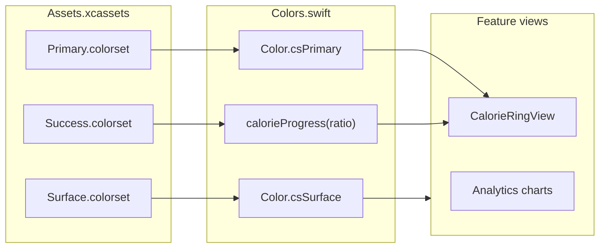
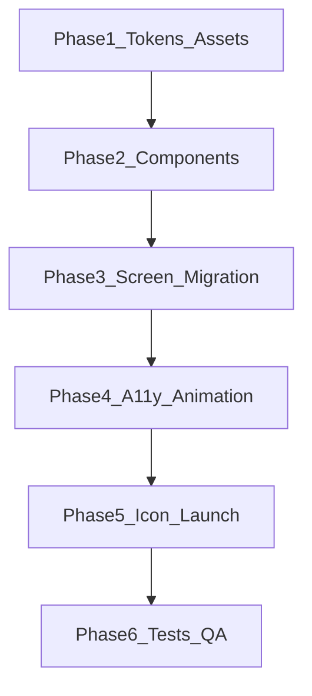

# PR9: Design System Polish & App-Wide UX

**Source of truth:** [docs/technical-spec.md](docs/technical-spec.md) → **PR 9: Design System Polish & App-Wide UX**  
**Builds on:** [docs/implementation/PR-07.md](docs/implementation/PR-07.md) (3-tab shell, `AnalyticsSectionCard`, chart sections, `CalorieProgressBand` sharing), [docs/implementation/PR-08.md](docs/implementation/PR-08.md) (`profileDataRevision`, Settings Form, unit display via `useLbsForDisplay`)

**Current baseline (audit):**
- No `DesignSystem/` folder; colors/fonts hardcoded (`.green`, `.blue`, `Color(.secondarySystemBackground)`)
- Assets: empty `AccentColor`, placeholder `AppIcon` (no PNG assigned), empty `UILaunchScreen` dict
- **Regression baseline:** [PR-08](docs/implementation/PR-08.md) documents **79** passing tests; current committed suite is **81** `func test*` methods across 11 files in `CalSnapTests/` (prior planning audit over-counted at 83 by including the private `testImage()` helper in `MealScannerViewModelTests`). **Before coding, run the full suite once and record the exact passing count in [docs/implementation/PR-09.md](docs/implementation/PR-09.md)** — that number is the PR9 regression floor.
- **No snapshot infra**, **no** `testCalorieRingAccessibilityValue`
- Partial a11y: `CalorieRingCard` leads; hints sparse; no Dashboard VoiceOver order
- Animation: spring ring only; no staggered scan results or chart first-appear animation

---

## Constraints (non-negotiable)

| Do not change | Rationale |
|---|---|
| SwiftData models, repositories, services (HK, Gemini, notifications) | PR9 is visual/a11y only |
| `RootView` tab enum/shell (`Dashboard` / `Analytics` / `Settings`) | PR7/PR8 architecture |
| `profileDataRevision` contract | Sole cross-tab refresh ([PR-08](docs/implementation/PR-08.md)) |
| Navigation routes (`DashboardRoute`, scanner flows, sheet vs push) | Avoid flow regressions |
| `CalorieProgressBand` thresholds (`..<0.90`, `0.90..<1.10`, else over) | Shared by Dashboard + Analytics ([PR-07](docs/implementation/PR-07.md)) |
| SPM dependency tree | Spec lists snapshot lib as optional; **user constraint: no new deps** |

---

## Phase 1 — Tokens & assets (foundation)

### Create

| File | Purpose |
|---|---|
| [CalSnap/DesignSystem/Colors.swift](CalSnap/DesignSystem/Colors.swift) | Spec `Color.cs*` wrappers + `calorieProgress(_ ratio:)` using **same thresholds** as `CalorieProgressBand.progressBand(for:)` |
| [CalSnap/DesignSystem/Typography.swift](CalSnap/DesignSystem/Typography.swift) | Spec fonts: `csLargeCalorie`, `csCardTitle`, `csBody`, `csCaption`, `csMacroLabel` |
| [CalSnap/DesignSystem/Modifiers/SectionCard.swift](CalSnap/DesignSystem/Modifiers/SectionCard.swift) | `View.sectionCard()` — padding, `csSurface` background, 16pt radius |
| Asset colorsets under [CalSnap/Resources/Assets.xcassets](CalSnap/Resources/Assets.xcassets) | `Primary`, `Secondary`, `Accent`, `Background`, `Surface`, `Success`, `Warning`, `Danger` — each with **light + dark** slots |
| **Spec extension:** `Protein`, `Carbs`, `Fat` colorsets | Not in PR9 spec prose but required to replace 3× duplicated macro hues; map to blue/orange/purple equivalents with dark variants |

### Dark-mode token strategy



- **Rule:** All semantic/status colors via `Color("Name")` → `cs*` statics. **Ban** `.green`/`.red`/`.white`/`.black` for status/UI chrome in migrated files.
- **Allowed system colors:** `.primary`, `.secondary`, `.tertiary` for text hierarchy; `Color.secondary.opacity(0.2)` for ring track (non-status decorative).
- Replace card backgrounds: `Color(.secondarySystemBackground)` → `.csSurface` (asset-backed, dark-aware).
- Wire `AccentColor.colorset` to match `Primary` so system `.accentColor` / `.borderedProminent` buttons align.

### Typography migration targets

Replace ad-hoc large calorie fonts in:
- [CalSnap/Features/Dashboard/CalorieRingCard.swift](CalSnap/Features/Dashboard/CalorieRingCard.swift) (`.largeTitle.bold().monospacedDigit()`)
- [CalSnap/Features/MealScanner/CalorieTotalView.swift](CalSnap/Features/MealScanner/CalorieTotalView.swift) (`.largeTitle.bold().scaled(by: 2.0)`)
- [CalSnap/Features/MealLog/MealShareCardView.swift](CalSnap/Features/MealLog/MealShareCardView.swift)

Use `.font(.csLargeCalorie.monospacedDigit())` or `.scaled(by:)` helper on token for Dynamic Type compliance.

---

## Phase 2 — Reusable components (extract, don’t rewrite flows)

### Migrate into `DesignSystem/Components/`

| New component | Source | Notes |
|---|---|---|
| `CalorieRingView` | Extract ring ZStack from [CalorieRingCard.swift](CalSnap/Features/Dashboard/CalorieRingCard.swift) | Ring + labels + a11y + spring; **no card chrome** |
| `MacroBarView` | Refactor [MacroSplitBar.swift](CalSnap/Features/MealScanner/MacroSplitBar.swift) | Spec’s horizontal segmented bar; token macro colors |
| `ConfidenceBadge` | Rename/refactor [ConfidenceIndicator.swift](CalSnap/Features/MealScanner/ConfidenceIndicator.swift) | Keep meal-level API; token colors |
| `NutrientStatRow` | New; consolidate inline stats | Replace `statBlock` in [CalorieAdherenceSectionView.swift](CalSnap/Features/Analytics/CalorieAdherenceSectionView.swift), `statColumn`/`statCard` in [WeightProgressView.swift](CalSnap/Features/Progress/WeightProgressView.swift), portions of [DailySummaryFooterView.swift](CalSnap/Features/Dashboard/DailySummaryFooterView.swift) |
| `EmptyStateView` | New | `icon`, `title`, `message`, optional `actionTitle` + `action` |
| `FoodItemRowView` | **Move** from [MealScanner/](CalSnap/Features/MealScanner/FoodItemRowView.swift) | Used by Scanner + Detail; apply `csSurface`, optional `ConfidenceBadge` for flagged items (icon + text, not color-only) |

### Leave in feature folders (do not extract)

| Component | Why |
|---|---|
| `CalorieRingCard`, `MacroBarCard`, `MacroBarRow` | Dashboard-specific multi-bar layout ≠ spec `MacroBarView` |
| `MealRowView`, `MealListView`, `TodaysMealsSection` | List/swipe/navigation coupling |
| `ProfileSwitcherView`, `PlateauAlertSheet`, `DashboardContentView` FAB | Dashboard-only chrome |
| Analytics chart sections (`CalorieAdherenceSectionView`, etc.) | Swift Charts layout stays local; only swap colors + `SectionCard` + `EmptyStateView` |
| `AnalyticsTimeframePicker`, `AnalyticsInsightCard` | Feature logic + Gemini |
| Scanner capture/camera/analyzing views | Camera full-screen exception per spec |
| `SettingsView` Form sections | Form-native layout; token swap only |
| `WeightProgressView` chart body | Embedded + standalone modes; keep VM wiring |
| Onboarding step views | **Out of minimum boundary** — token-only pass if time permits |

### Thin wrappers after extraction

- **`CalorieRingCard`** → `SectionCard` + `CalorieRingView(...)` (same public props)
- **`AnalyticsSectionCard`** → typealias or thin wrapper over `SectionCard` + title row (avoid breaking Analytics imports)
- **`MacroSplitBar`** → deprecated typealias to `MacroBarView` for one release cycle, or delete after call-site swap

---

## Phase 3 — Per-screen migration boundary

Minimum safe refactor = **visual + a11y only**. ViewModels keep APIs; no new `@Query`, no route changes, no reload-token changes.

### Dashboard

**Modify:** [DashboardContentView.swift](CalSnap/Features/Dashboard/DashboardContentView.swift), [CalorieRingCard.swift](CalSnap/Features/Dashboard/CalorieRingCard.swift), [MacroBarCard.swift](CalSnap/Features/Dashboard/MacroBarCard.swift), [MacroBarRow.swift](CalSnap/Features/Dashboard/MacroBarRow.swift), [DailySummaryFooterView.swift](CalSnap/Features/Dashboard/DailySummaryFooterView.swift), [MealListView.swift](CalSnap/Features/MealLog/MealListView.swift), [WeightTrendMiniChart.swift](CalSnap/Features/Dashboard/WeightTrendMiniChart.swift), [ProfileSwitcherView.swift](CalSnap/Features/Dashboard/ProfileSwitcherView.swift)

- Token swap for progress/macro/fiber colors via `Color.calorieProgress` + macro tokens
- FAB: `.foregroundStyle(.white)` → `.foregroundStyle(Color(.systemBackground))` or dedicated `csOnPrimary` asset (avoid hardcoded white)
- **VoiceOver order:** `.accessibilitySortPriority` — greeting (100) → ring (90) → macros (80) → meals (70) → weight (60) → FAB (50)
- **Do not touch:** [DashboardView.swift](CalSnap/Features/Dashboard/DashboardView.swift) reload/`profileDataRevision` wiring, [DashboardViewModel.swift](CalSnap/Features/Dashboard/DashboardViewModel.swift) aggregation/plateau logic

### Meal Scanner

**Modify:** [MealAnalysisResultView.swift](CalSnap/Features/MealScanner/MealAnalysisResultView.swift), [CalorieTotalView.swift](CalSnap/Features/MealScanner/CalorieTotalView.swift), [ScannerErrorBanner.swift](CalSnap/Features/MealScanner/ScannerErrorBanner.swift), [ManualMealEntryView.swift](CalSnap/Features/MealScanner/ManualMealEntryView.swift), [MealScannerCaptureView.swift](CalSnap/Features/MealScanner/MealScannerCaptureView.swift)

- Staggered item appearance in `MealAnalysisResultView` `ForEach` (index × 0.05s), disabled when `accessibilityReduceMotion`
- Keep `.sheet` for edit flows; camera stays full-screen
- **Do not touch:** [MealScannerViewModel.swift](CalSnap/Features/MealScanner/MealScannerViewModel.swift), HK write gating

### Meal Detail

**Modify:** [MealDetailView.swift](CalSnap/Features/MealLog/MealDetailView.swift) — adopt `MacroBarView`, moved `FoodItemRowView`, `ConfidenceBadge`, tokens; add hints on share/delete/edit buttons

### Progress

**Modify:** [WeightProgressView.swift](CalSnap/Features/Progress/WeightProgressView.swift), [WeighInView.swift](CalSnap/Features/Progress/WeighInView.swift)

- Replace inline empty states with `EmptyStateView` + log action
- Chart: `.animation(reduceMotion ? nil : .default, value: hasAnimated)` on **first appear only** (guard with `@State private var chartHasAppeared`)
- **Do not touch:** [WeightProgressViewModel.swift](CalSnap/Features/Progress/WeightProgressViewModel.swift), embedded presentation enum from PR7

### Analytics

**Modify:** [AnalyticsView.swift](CalSnap/Features/Analytics/AnalyticsView.swift), all `*SectionView.swift`, [AnalyticsInsightCard.swift](CalSnap/Features/Analytics/AnalyticsInsightCard.swift), [AnalyticsSectionCard.swift](CalSnap/Features/Analytics/AnalyticsSectionCard.swift)

- Section empties → `EmptyStateView` (message + optional action where sensible)
- Gate empty (`< 3 days`) → `EmptyStateView` with instructional copy; CTA uses **in-screen action only** (e.g. explanatory text pointing user to Dashboard FAB / meal logging — no tab switch)
- Chart bar colors → `Color.calorieProgress` / macro tokens
- **Do not modify [RootView.swift](CalSnap/App/RootView.swift)** or tab-selection behavior for Analytics empty-state CTAs — PR7/PR8 tab shell and `profileDataRevision` refresh contract stay intact
- **Do not touch:** [AnalyticsViewModel.swift](CalSnap/Features/Analytics/AnalyticsViewModel.swift), [AnalyticsAggregator.swift](CalSnap/Core/Services/AnalyticsAggregator.swift)

### Settings

**Modify:** [SettingsView.swift](CalSnap/Features/Settings/SettingsView.swift) — token colors for destructive buttons, section headers via `Typography`; add `.accessibilityHint` on HK toggles, export, delete

- **Do not touch:** [SettingsViewModel.swift](CalSnap/Features/Settings/SettingsViewModel.swift), `bumpProfileDataRevision()` call sites

---

## Phase 4 — Empty-state standardization

| Location | Current | PR9 target |
|---|---|---|
| Analytics gate | Text only in `AnalyticsSectionCard` | `EmptyStateView` + clear CTA |
| Analytics section no-data | Inline caption | `EmptyStateView` (no action OK for sub-sections) |
| Weight mini-chart / progress | Mixed patterns | `EmptyStateView` + "Log weigh-in" |
| Meal list per type | "Add Breakfast" button | Keep (already compliant) |
| Meal/scan not-found | `ContentUnavailableView` | `EmptyStateView` or keep Apple component with action ("Go back") |
| Settings | Loading spinner only | No empty state needed |

**Rule:** Primary screen-level empties require **copy + action**; chart sub-section empties require **copy** only.

---

## Phase 5 — Animation standards (safe application)

| Surface | Animation | Guard |
|---|---|---|
| Calorie ring | Existing spring on `ringProgress` | Already respects `accessibilityReduceMotion` — move to `CalorieRingView` |
| Scan results | Stagger opacity/offset 0.05s × index | Skip when reduce motion; do not delay button enablement |
| Progress + Analytics charts | Animate once on first appear | Reset flag only on timeframe change, not every `profileDataRevision` reload |
| Sheets | No change | Already `.sheet`; plateau/weigh-in unchanged |

**Risk control:** No `withAnimation` around navigation or data mutations; animation binds to display values only.

---

## Phase 6 — Accessibility checklist

Required by spec; apply during component extraction:

- Extract pure helper (testable):

```swift
// DesignSystem/Accessibility/CalorieRingAccessibility.swift
enum CalorieRingAccessibility {
    static func valueText(remaining: Int, target: Int) -> String
}
```

- Wire `CalorieRingView` to helper (matches existing `CalorieRingCard` accessibility copy)
- Add `.accessibilityHint` to interactive controls missing hints (FAB, meal rows, chart taps, Settings destructive actions)
- Icon-only buttons: already pattern `Button("Add meal", systemImage: "plus").labelStyle(.iconOnly)` on FAB — replicate elsewhere
- `accessibilityDifferentiateWithoutColor`: extend to chart legends and `FoodItemRowView` flagged state (symbol + label, not orange alone)
- Dynamic Type: audit with Xcode Accessibility Inspector at Large → XXXL on Dashboard + Settings Form

---

## Phase 7 — App icon & launch screen

| Asset | Action |
|---|---|
| [AppIcon.appiconset](CalSnap/Resources/Assets.xcassets/AppIcon.appiconset) | **Complete icon set** — every image slot declared in `Contents.json` must have an assigned asset (currently one universal 1024×1024 iOS slot; no empty placeholders). Design: plate + fork silhouette, green (`Primary`) accent. Validate via Xcode asset catalog (no warnings) and confirm icon appears in Simulator home screen + archive summary. If additional slots are added to `Contents.json` for device-specific idioms, populate **all** of them — spec acceptance is "icon set complete," not "source PNG exists on disk." |
| `LaunchWordmark.imageset` | "CalSnap" wordmark PNG/PDF, transparent background |
| [Info.plist](CalSnap/Resources/Info.plist) | `UILaunchScreen` → `UIImageName: LaunchWordmark`, `UIColorName: Background` |

No storyboard. System background via `Background` colorset.

---

## Tests

### Required (spec + no new deps)

| Test | File | Approach |
|---|---|---|
| `testCalorieRingAccessibilityValue()` | New [CalSnapTests/DesignSystemTests.swift](CalSnapTests/DesignSystemTests.swift) | Assert `CalorieRingAccessibility.valueText(remaining:800, target:2000)` and over-goal variant |
| `testCalorieProgressColorBands()` | Same file | Assert `Color.calorieProgress` mapping at 0.89 / 0.95 / 1.15 aligns with `CalorieProgressBand` (compare band enum, not pixel colors) |
| `testDesignSystemColorAssetsResolve()` | Same file | Instantiate each `Color.cs*` — no crash in test host |

**Regression:** all pre-PR9 tests must pass unchanged; baseline count recorded at implementation start (see **Current baseline** above — expect **81** today, not 83). `testProgressColor` in [DashboardViewModelTests.swift](CalSnapTests/DashboardViewModelTests.swift) stays — tests band logic, not colors. PR9 adds 3 new tests in `DesignSystemTests.swift` → expected post-PR9 total **84** (adjust if baseline differs).

### Approved test-scope extension: snapshot fallback

**Conscious tradeoff (approved for PR9):** The spec lists optional Dashboard light/dark UI snapshot tests, but PR9 explicitly **does not** add `swift-snapshot-testing` or any new SPM dependency. This is an intentional scope reduction, not an oversight — record it in [docs/implementation/PR-09.md](docs/implementation/PR-09.md) under **Spec extensions**.

**Substitutes (required for PR9 sign-off):**
1. **Manual QA matrix** in PR-09.md: Dashboard light/dark, Dynamic Type XXXL, Reduce Motion
2. **Focused unit tests:** `testCalorieRingAccessibilityValue()`, `testCalorieProgressColorBands()`, `testDesignSystemColorAssetsResolve()`
3. **Optional smoke test:** instantiate key design-system views in test host — body compiles/renders without crash (not pixel diff)
4. **Defer pixel snapshots to PR10** if product later approves snapshot SPM or XCUITest attachment workflow

---

## Files summary

### Create (~12)

- `CalSnap/DesignSystem/Colors.swift`
- `CalSnap/DesignSystem/Typography.swift`
- `CalSnap/DesignSystem/Accessibility/CalorieRingAccessibility.swift`
- `CalSnap/DesignSystem/Components/CalorieRingView.swift`
- `CalSnap/DesignSystem/Components/MacroBarView.swift`
- `CalSnap/DesignSystem/Components/ConfidenceBadge.swift`
- `CalSnap/DesignSystem/Components/NutrientStatRow.swift`
- `CalSnap/DesignSystem/Components/EmptyStateView.swift`
- `CalSnap/DesignSystem/Components/FoodItemRowView.swift` (moved)
- `CalSnap/DesignSystem/Modifiers/SectionCard.swift`
- `CalSnapTests/DesignSystemTests.swift`
- `docs/implementation/PR-09.md`
- 11 colorsets + `LaunchWordmark` + complete `AppIcon.appiconset` (all slots populated)

### Modify (~25)

- All six feature areas listed above + [CalSnap.xcodeproj/project.pbxproj](CalSnap.xcodeproj/project.pbxproj)
- Delete or typealias: [MacroSplitBar.swift](CalSnap/Features/MealScanner/MacroSplitBar.swift), [ConfidenceIndicator.swift](CalSnap/Features/MealScanner/ConfidenceIndicator.swift) after moves

### Do not modify

- Models, repositories, HK/Gemini/notification services
- [RootView.swift](CalSnap/App/RootView.swift) tab structure or tab-selection behavior (Analytics empty-state CTAs stay in-screen; no `selectedTab` wiring)
- `profileDataRevision` writers/readers semantics

---

## Acceptance criteria mapping

| Spec criterion | Verification |
|---|---|
| Light/dark mode — no broken colors | Asset colorsets + manual QA matrix; `testDesignSystemColorAssetsResolve` |
| Dynamic Type Large → XXXL | Typography tokens + manual QA on Dashboard/Settings |
| All empty states — clear copy + action | Empty-state inventory above; Analytics gate + weight empties |
| App icon set complete (all required sizes) | Every `AppIcon.appiconset` slot in `Contents.json` has an assigned image; no catalog warnings; visible on Simulator home screen |
| Calorie ring a11y value | `testCalorieRingAccessibilityValue` |
| Dashboard snapshots light/dark | **Approved extension:** manual QA matrix replaces snapshot tests for PR9 (see Tests section) |

---

## Spec extensions (document in PR-09.md)

1. **Macro colorsets** (`Protein`, `Carbs`, `Fat`) — asset-backed, not in original token list
2. **Snapshot tests — approved PR9 test-scope extension** — Dashboard light/dark snapshot tests from spec are **consciously omitted** for PR9 due to no-new-dependencies constraint; manual visual QA matrix + unit tests substitute; not an accidental gap
3. **Analytics empty gate CTA** — in-screen instructional copy only; no `RootView` / tab-selection changes; primary screen-level empty states elsewhere already have actions (meal list, weight chart)
4. **`CalorieProgressBand` stays in DashboardViewModel** — `Colors.calorieProgress` mirrors thresholds; color mapping is presentation-only
5. **Regression baseline count** — record exact pre-PR9 passing test count at implementation start (PR8 documented 79; current suite 81)

---

## Risk controls & implementation order



1. **Tokens first** — compile-safe; swap colors file-by-file
2. **Extract components** — keep old typealiases until call sites migrated
3. **One feature area per commit** — Dashboard → Scanner/Detail → Progress → Analytics → Settings
4. **Run full suite after each area** — `xcodebuild -scheme CalSnap test`; compare against baseline recorded at PR9 start (currently 81 pre-PR9 tests + 3 new = 84 expected)
5. **No ViewModel edits** except moving zero business logic
6. **Preview every touched view** — catch layout breaks early

**Highest regression risks:** chart re-animation on Analytics reload; stagger delaying scan log button; Dynamic Type overflow on `CalorieRingView` — mitigate with first-appear guards, non-blocking stagger, and `minimumScaleFactor` on large calorie text.
