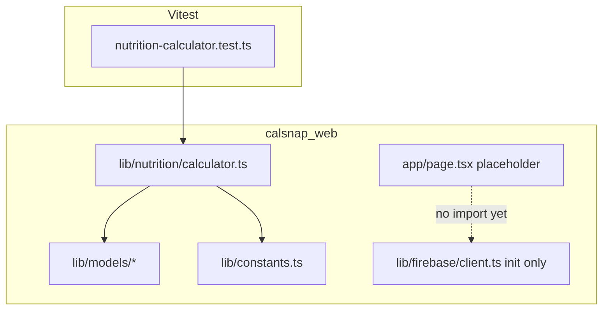

# PR W01: Project Scaffold and Core Infrastructure

## Objective

Establish the CalSnap Web skeleton in [`calsnap-web/`](calsnap-web/) (does not exist yet). Port all pure nutrition math and domain types from the iOS PR1 baseline, add Vitest coverage matching [`CalSnapTests/NutritionCalculatorTests.swift`](CalSnapTests/NutritionCalculatorTests.swift), initialize Firebase client SDK (no reads/writes), and ship a blank placeholder home page deployable to Vercel. Mirrors iOS [`docs/implementation/PR-01.md`](docs/implementation/PR-01.md) scope with web-specific deltas from [`.cursor/plans/calsnap_web_prs_4a5e9349.plan.md`](.cursor/plans/calsnap_web_prs_4a5e9349.plan.md).

**Source of truth:** [`docs/technical-spec.md`](docs/technical-spec.md) (Global Constants, NutritionCalculator, models), [`CalSnap/Core/Services/NutritionCalculator.swift`](CalSnap/Core/Services/NutritionCalculator.swift), [`CalSnap/Core/Utilities/Constants.swift`](CalSnap/Core/Utilities/Constants.swift).

---

## Sharpened decisions (locked)

| Decision | Choice | Rationale |
|----------|--------|-----------|
| `ActivityLevel` format | camelCase union (`'moderatelyActive'`, …) | Idiomatic TS; web-only Firestore (no iOS↔web data sync). Document delta from iOS Codable raw strings (`"Moderately Active"`) in `docs/implementation/web/README.md`. |
| Firebase init | Lazy singleton (`getFirebaseApp()`, `getAuth()`, …) | Build and dev succeed without env vars until first use; testable via Vitest smoke test with mocked env. |
| MealType tests | In W01 scope (4 cases) | Cheap parity guard; prevents hour-boundary drift before W04 scanner. |
| Vercel preview | Document setup only; **not** a merge gate | W01 has no Firebase usage in UI; `pnpm build` locally is sufficient acceptance. |

**Additional hardening (no user input needed):**

- Pin Node via [`calsnap-web/.nvmrc`](calsnap-web/.nvmrc) (`22`) + `"engines": { "node": ">=20" }` in `package.json` — matches Vercel default, reduces env drift.
- Add [`calsnap-web/.firebaserc`](calsnap-web/.firebaserc) with `"default": "demo-calsnap"` so `emulators:start` works without a real Firebase project login in W01.
- Add [`tests/unit/firebase-client.test.ts`](calsnap-web/tests/unit/firebase-client.test.ts) — sets mock `NEXT_PUBLIC_*` env, calls `getFirebaseApp()` once, asserts no throw (validates module compiles; not an integration test).
- W01 domain interfaces use `Date` for calculator paths; W02 introduces Firestore doc types with ISO/`Timestamp` at repository boundary (no dual-type split in W01).
- One-line pointer in root [`README.md`](README.md) to `calsnap-web/README.md`.

---

## In scope

| Area | Deliverable |
|------|-------------|
| Next.js app | `create-next-app` in `calsnap-web/` — App Router, TypeScript strict, Tailwind, ESLint, `pnpm` |
| Constants | [`calsnap-web/lib/constants.ts`](calsnap-web/lib/constants.ts) — full `AppConstants` from iOS (not `AppStorageKey`; iOS UserDefaults keys deferred to W08/W10) |
| Domain types | TypeScript interfaces + string enums in `calsnap-web/lib/models/` |
| Calculator | [`calsnap-web/lib/nutrition/calculator.ts`](calsnap-web/lib/nutrition/calculator.ts) — all 13 static methods from Swift |
| Firebase | [`calsnap-web/lib/firebase/client.ts`](calsnap-web/lib/firebase/client.ts) + [`calsnap-web/firebase.json`](calsnap-web/firebase.json) emulator ports |
| UI | Placeholder [`calsnap-web/app/page.tsx`](calsnap-web/app/page.tsx) only |
| Tests | Vitest: `nutrition-calculator.test.ts` (13), `meal-type.test.ts` (4), `firebase-client.test.ts` (smoke) |
| Repo hygiene | Root [`.gitignore`](.gitignore) updates; [`calsnap-web/.env.local.example`](calsnap-web/.env.local.example) |
| Deploy | Vercel root directory = `calsnap-web` |
| Docs | [`docs/implementation/web/PR-W01.md`](docs/implementation/web/PR-W01.md) + [`docs/implementation/web/README.md`](docs/implementation/web/README.md) (open decisions) |

## Out of scope

- Auth UI, middleware, Firestore rules, repositories, TanStack Query
- API routes, Gemini, shadcn/ui
- PWA, tab navigation, feature screens
- `KeychainManager` equivalent (web uses server-only `GEMINI_API_KEY` in W04)
- CI/GitHub Actions (W10)
- Any changes under `CalSnap/` iOS tree

---

## Architecture (W01 only)



Business logic lives in `lib/`; `app/` stays thin. Firebase exports exist but nothing imports them in W01 UI.

---

## Web vs iOS model deltas (lock in W01 types)

| Field / concept | iOS (SwiftData) | Web (TypeScript / Firestore-ready) |
|-----------------|-----------------|-------------------------------------|
| User / meal IDs | `UUID` | `string` (Firebase Auth UID or Firestore doc id) |
| Meal photo | `photoData: Data?` | `photoStoragePath?: string` (Storage path; populated in W04) |
| Weigh-in source | `sourceIsHealthKit: Bool` | Omit in W01 interface; add `source: 'manual'` in W06 if needed |
| Profile relationships | `@Relationship` arrays on `UserProfile` | No embedded arrays; subcollections in W02+ |
| ActivityLevel storage | iOS Codable raw strings (`"Moderately Active"`) | camelCase union (`moderatelyActive`); document web delta |
| ActivityLevel UI strings | `localizedTitle`, `systemImage` | Omit in W01; W09 copy module adds labels |
| Warning strings | Localized xcstrings | English literals matching [`scripts/build_localizable_catalog.py`](scripts/build_localizable_catalog.py) keys |

Macro defaults on `UserProfile` creation (for type default values / factory): protein `0.28`, carbs `0.47`, fat `0.25`.

---

## File tree to create

```
calsnap-web/
├── app/
│   ├── favicon.ico              # from create-next-app
│   ├── globals.css
│   ├── layout.tsx               # minimal root layout, metadata "CalSnap"
│   └── page.tsx                 # placeholder screen
├── lib/
│   ├── constants.ts
│   ├── firebase/
│   │   └── client.ts
│   ├── models/
│   │   ├── index.ts             # re-exports
│   │   ├── biological-sex.ts
│   │   ├── activity-level.ts
│   │   ├── meal-type.ts
│   │   ├── macro-split.ts
│   │   ├── user-profile.ts
│   │   ├── food-item.ts
│   │   ├── meal-entry.ts
│   │   └── weigh-in.ts
│   └── nutrition/
│       └── calculator.ts
├── tests/
│   └── unit/
│       ├── nutrition-calculator.test.ts
│       ├── meal-type.test.ts
│       └── firebase-client.test.ts
├── public/                      # empty or default from CNA
├── .env.local.example
├── .firebaserc                  # default project demo-calsnap (emulators only)
├── .nvmrc                       # 22
├── .gitignore                   # Next-specific (or rely on root)
├── eslint.config.mjs
├── firebase.json
├── next.config.ts
├── package.json
├── pnpm-lock.yaml
├── postcss.config.mjs
├── tsconfig.json
├── vitest.config.ts
└── README.md                    # dev commands, env vars, emulator note

docs/implementation/web/
├── README.md                    # open decisions + web stack summary
└── PR-W01.md                    # post-merge checklist (filled during impl)

.gitignore                       # add calsnap-web entries (modify existing)
```

---

## Step-by-step implementation

### 1. Scaffold Next.js app

From repo root:

```bash
pnpm create next-app@latest calsnap-web \
  --typescript \
  --tailwind \
  --eslint \
  --app \
  --no-src-dir \
  --import-alias "@/*" \
  --use-pnpm \
  --turbopack
```

Verify `tsconfig.json` has `"strict": true`. Do **not** add shadcn, TanStack Query, or zod.

**`package.json` scripts to add:**

```json
"test": "vitest run",
"test:watch": "vitest"
```

**Dev dependency:** `vitest` only (no `@testing-library` needed for W01).

### 2. Vitest config

[`calsnap-web/vitest.config.ts`](calsnap-web/vitest.config.ts):

- `environment: 'node'`
- `include: ['tests/**/*.test.ts']`
- Resolve `@/*` alias to project root (match Next `paths` in `tsconfig.json`)

### 3. Port `AppConstants` → `lib/constants.ts`

Port all nested enums from [`CalSnap/Core/Utilities/Constants.swift`](CalSnap/Core/Utilities/Constants.swift) as `const` objects with `as const` where helpful:

- `Gemini`, `Nutrition`, `Deficit`, `ActivityMultipliers`, `Plateau`, `WeightProjection`, `USDA`, `Onboarding`, `Notifications`, `MealPhoto`

Use `export const AppConstants = { ... } as const` pattern. Skip `AppStorageKey` (iOS UserDefaults).

### 4. Domain models (`lib/models/`)

**`biological-sex.ts`**

```typescript
export type BiologicalSex = 'male' | 'female';
export const BiologicalSex = { male: 'male', female: 'female' } as const;
```

**`activity-level.ts`** — camelCase union (web delta from iOS display raw values):

```typescript
export type ActivityLevel =
  | 'sedentary'
  | 'lightlyActive'
  | 'moderatelyActive'
  | 'veryActive'
  | 'extraActive';

export function activityMultiplier(level: ActivityLevel): number { ... }
```

Map to `AppConstants.ActivityMultipliers` by case. Document in web README that Firestore stores camelCase, not iOS `"Moderately Active"` strings.

**`meal-type.ts`**

```typescript
export type MealType = 'breakfast' | 'lunch' | 'dinner' | 'snack';

export function suggestedMealTypeForDate(date: Date): MealType {
  const hour = date.getHours(); // local timezone, mirrors Calendar.current
  if (hour >= 5 && hour < 11) return 'breakfast';
  if (hour >= 11 && hour < 15) return 'lunch';
  if (hour >= 15 && hour < 18) return 'snack';
  return 'dinner';
}
```

**`macro-split.ts`** — port from [`CalSnap/Core/Utilities/AnalyticsTypes.swift`](CalSnap/Core/Utilities/AnalyticsTypes.swift):

```typescript
export interface MacroSplit {
  proteinPct: number;
  carbsPct: number;
  fatPct: number;
}
```

**`user-profile.ts`**, **`food-item.ts`**, **`meal-entry.ts`**, **`weigh-in.ts`** — plain interfaces mirroring Swift properties with web deltas above. Include JSDoc on fields stored in metric units. Use `Date` for date fields in W01 (calculator + unit tests). W02 repositories introduce separate Firestore doc shapes with ISO strings or `Timestamp` at the persistence boundary — do not split types in W01.

**`weigh-in.ts`** for tests:

```typescript
export interface WeighIn {
  id: string;
  userId: string;
  date: Date;
  weightKg: number;
  calculatedTDEE?: number;
  adjustedDailyTarget?: number;
  bmi?: number;
}
```

### 5. Port `NutritionCalculator` → `lib/nutrition/calculator.ts`

Export a namespace object or plain functions (prefer named exports matching Swift):

| Swift method | TypeScript | Notes |
|--------------|------------|-------|
| `bmr` | `bmr(...)` | Mifflin-St Jeor |
| `tdee` | `tdee(...)` | |
| `dailyTarget` | `dailyTarget(...)` | Return `{ target, deficit, warnings }`; warnings use English strings from catalog |
| `macroTargets` | `macroTargets(...)` | |
| `macroPercents` | `macroPercents(...)` | Returns `MacroSplit` with rounded integer percents |
| `fiberTargetG` | `fiberTargetG(...)` | |
| `bmi` | `bmi(...)` | |
| `age` | `ageFromDateOfBirth(dob, referenceDate = new Date())` | Add optional `referenceDate` for deterministic tests |
| `weightProjection` | `weightProjection(...)` | 13 pairs for 12 weeks; retain `_ = currentTDEE` comment |
| `isOnPlateau` | `isOnPlateau(weighIns)` | Sort by date ascending; nil-safe min/max |
| `weeklyLossRateKg` | `weeklyLossRateKg(...)` | |
| `projectedGoalDate` | `projectedGoalDate(..., referenceDate?, calendar?)` | Use `Date` arithmetic (add weeks via ms) |
| `projectionPoints` | `projectionPoints(...)` | |

**Warning string templates** (match iOS semantics):

- `"Deficit capped at {n} kcal/day for safety."`
- `"Deficits above {n} kcal/day can trigger metabolic adaptation. Recommend 350 kcal/day."`
- `"Target floored to {n} kcal/day minimum for safety."`

No external dependencies in calculator module.

### 6. Firebase client init (lazy singleton)

**Dependency:** `firebase` (modular v11+).

[`calsnap-web/lib/firebase/client.ts`](calsnap-web/lib/firebase/client.ts):

```typescript
import { initializeApp, getApps, getApp, type FirebaseApp } from 'firebase/app';
import { getAuth, type Auth } from 'firebase/auth';
import { getFirestore, type Firestore } from 'firebase/firestore';
import { getStorage, type FirebaseStorage } from 'firebase/storage';

function requireEnv(name: string): string {
  const value = process.env[name];
  if (!value) throw new Error(`Missing ${name}`);
  return value;
}

let app: FirebaseApp | undefined;

export function getFirebaseApp(): FirebaseApp {
  if (app) return app;
  if (getApps().length) {
    app = getApp();
    return app;
  }
  app = initializeApp({
    apiKey: requireEnv('NEXT_PUBLIC_FIREBASE_API_KEY'),
    authDomain: requireEnv('NEXT_PUBLIC_FIREBASE_AUTH_DOMAIN'),
    projectId: requireEnv('NEXT_PUBLIC_FIREBASE_PROJECT_ID'),
    storageBucket: requireEnv('NEXT_PUBLIC_FIREBASE_STORAGE_BUCKET'),
    messagingSenderId: requireEnv('NEXT_PUBLIC_FIREBASE_MESSAGING_SENDER_ID'),
    appId: requireEnv('NEXT_PUBLIC_FIREBASE_APP_ID'),
  });
  return app;
}

export function getFirebaseAuth(): Auth {
  return getAuth(getFirebaseApp());
}

export function getFirestoreDb(): Firestore {
  return getFirestore(getFirebaseApp());
}

export function getFirebaseStorage(): FirebaseStorage {
  return getStorage(getFirebaseApp());
}
```

**W01 constraints:**

- Do not import `client.ts` from `app/page.tsx` or server components (placeholder builds without env vars).
- Validate module via `tests/unit/firebase-client.test.ts` only (mock env in test `beforeEach`).
- W02 auth provider becomes first production consumer of `getFirebaseAuth()`.

[`calsnap-web/.firebaserc`](calsnap-web/.firebaserc):

```json
{ "projects": { "default": "demo-calsnap" } }
```

[`calsnap-web/.env.local.example`](calsnap-web/.env.local.example):

```
NEXT_PUBLIC_FIREBASE_API_KEY=
NEXT_PUBLIC_FIREBASE_AUTH_DOMAIN=
NEXT_PUBLIC_FIREBASE_PROJECT_ID=
NEXT_PUBLIC_FIREBASE_STORAGE_BUCKET=
NEXT_PUBLIC_FIREBASE_MESSAGING_SENDER_ID=
NEXT_PUBLIC_FIREBASE_APP_ID=
# Server-only (W04+): GEMINI_API_KEY=
```

### 7. Firebase emulator config

[`calsnap-web/firebase.json`](calsnap-web/firebase.json):

```json
{
  "emulators": {
    "auth": { "port": 9099 },
    "firestore": { "port": 8080 },
    "storage": { "port": 9199 },
    "ui": { "enabled": true, "port": 4000 }
  }
}
```

No `firestore.rules` or `storage.rules` in W01 (W02/W04). Document in `calsnap-web/README.md`:

```bash
npx -y firebase-tools@latest emulators:start --project demo-calsnap
```

Developer must create/link a Firebase project before W02; W01 only needs config files.

### 8. Placeholder UI

[`calsnap-web/app/page.tsx`](calsnap-web/app/page.tsx):

- Mobile-first centered layout
- App name "CalSnap" + tagline from product spec: "Eat smart. Lose weight. No obsession."
- Neutral background via Tailwind (`bg-background` or `bg-neutral-50`)
- No navigation, no Firebase imports, no client components required

[`calsnap-web/app/layout.tsx`](calsnap-web/app/layout.tsx):

- `metadata.title = 'CalSnap'`
- System font stack; no dark mode tokens yet (W09)

### 9. Root `.gitignore` updates

Append to [`.gitignore`](.gitignore):

```
# CalSnap Web (Next.js)
calsnap-web/node_modules/
calsnap-web/.next/
calsnap-web/.env.local
calsnap-web/.vercel
calsnap-web/coverage/
```

### 10. Vercel subdirectory deploy (document only — not merge gate)

Document in PR-W01.md for post-merge setup:

1. Import repo in Vercel
2. Set **Root Directory** = `calsnap-web`
3. Framework Preset: Next.js; Build: `pnpm build`; Install: `pnpm install`
4. Add `NEXT_PUBLIC_FIREBASE_*` env vars before W02 (not required for W01 placeholder build)

W01 acceptance: local `pnpm build` passes. Vercel preview is optional until W02 auth.

### 11. Documentation

**[`docs/implementation/web/README.md`](docs/implementation/web/README.md)** — web stack summary + **open decisions** (from parent plan):

1. Gemini cost model — operator-funded vs user billing
2. Photo retention — indefinite vs TTL
3. Web Push — in-app reminder only vs FCM in W10
4. Account deletion — hard delete vs grace period

**[`docs/implementation/web/PR-W01.md`](docs/implementation/web/PR-W01.md)** — mirror PR-01 sections: objective, files created, tests, acceptance checklist, definition of done.

---

## Vitest test matrix (parity with iOS)

Port all cases from [`CalSnapTests/NutritionCalculatorTests.swift`](CalSnapTests/NutritionCalculatorTests.swift):

| Test | Assertion |
|------|-----------|
| `bmr male` | 80 kg, 178 cm, 51 yr, male → **1663** (±1) |
| `bmr female` | 65 kg, 163 cm, 48 yr, female → **1268** (±1) |
| `tdee` | BMR 1700 × 1.55 → **2635** (±0.1) |
| `dailyTarget floor` | male, TDEE 2000, deficit 1000 → target **1500**, deficit **750**, warning contains `"1500"` |
| `dailyTarget warnings` | TDEE 3000, deficit 800 → deficit **750**, **2** warnings (contain `"750"` and `"500"`) |
| `macroTargets` | 2000 kcal, 0.28/0.47/0.25 → protein **140**, carbs **235**, fat **55.6** (±0.1) |
| `bmi` | 80 kg, 178 cm → **25.2** (±0.1) |
| `ageFromDateOfBirth` | DOB 35 years ago → **35** (use fixed `referenceDate`) |
| `isOnPlateau` | 80.0, 80.1, 80.15 → **true** |
| `isOnPlateau insufficient` | 2 entries → **false** |
| `isOnPlateau spread too large` | 80.0, 80.15, 80.25 → **false** |
| `isOnPlateau unsorted input` | 4 entries out of order → **true** (port iOS date fixtures) |
| `weightProjection` | 12 weeks → **13** pairs, strictly decreasing weights |

**`meal-type.test.ts`** — port all 4 cases from [`CalSnapTests/MealTypeTests.swift`](CalSnapTests/MealTypeTests.swift) using fixed `Date` fixtures (hour 10 → breakfast, 11 → lunch, 17 → snack, 18 → dinner).

**`firebase-client.test.ts`** — mock all six `NEXT_PUBLIC_FIREBASE_*` vars; call `getFirebaseApp()`; assert defined; reset module singleton between tests if needed.

---

## Verification commands

```bash
cd calsnap-web
pnpm install
pnpm test                    # all Vitest green
pnpm lint
pnpm build                   # production build succeeds
pnpm dev                     # localhost placeholder renders

# Secrets audit (no GEMINI in client bundle)
pnpm build && grep -r "GEMINI_API_KEY" .next/static || echo "OK: no server secret in static"
```

Vercel preview optional for W01 (see sharpened decisions).

---

## Acceptance criteria

| Criterion | How verified |
|-----------|--------------|
| `pnpm dev` runs; placeholder page visible | Manual + local |
| `pnpm test` all green | CI-local |
| `pnpm build` succeeds | Local (Vercel optional for W01) |
| Full `NutritionCalculator` API ported | Code review vs Swift file |
| Domain types exported for W02 | `lib/models/index.ts` |
| Firebase lazy init + smoke test | `firebase-client.test.ts` green; no import from `app/` |
| MealType hour boundaries tested | `meal-type.test.ts` (4 cases) |
| `firebase.json` emulator ports defined | File present |
| No secrets in client bundle | Build grep; only `NEXT_PUBLIC_*` when Firebase wired |
| Root `.gitignore` covers web artifacts | Diff review |
| `docs/implementation/web/PR-W01.md` + README added | Docs review |

---

## Risks and mitigations

| Risk | Mitigation |
|------|------------|
| Firebase init crashes build without env | Lazy singleton; no import from `app/` in W01 |
| Dead Firebase code untested | `firebase-client.test.ts` smoke test with mocked env |
| `age()` flaky near birthday | Tests pass explicit `referenceDate` |
| `projectedGoalDate` week math differs Swift vs JS | Use same week-count loop as `weightProjection`; add test in W06 if needed |
| `ActivityLevel` Firestore string mismatch | Locked: camelCase union; document iOS delta in web README |
| Vercel monorepo misconfigured | Document Root Directory = `calsnap-web` in PR-W01.md |
| pnpm not installed locally | Document prerequisite in `calsnap-web/README.md` |

---

## Suggested commit sequence

1. `chore(web): scaffold Next.js app in calsnap-web`
2. `feat(web): add constants and domain models`
3. `feat(web): port NutritionCalculator from iOS`
4. `feat(web): add Firebase client init and emulator config`
5. `feat(web): add placeholder home page`
6. `test(web): add NutritionCalculator Vitest suite`
7. `docs(web): add PR-W01 implementation notes and web README`

---

## PR description snippet

> **PR W01: Web scaffold and core infrastructure**
>
> Adds `calsnap-web/` Next.js app with ported `NutritionCalculator`, domain types, Vitest tests, Firebase client init (unused), emulator config, and placeholder page. No auth, API routes, or feature UI.
>
> **Web deltas:** Firestore-oriented string IDs; meal photos as Storage paths; no Keychain/BYOK.
>
> **Test plan:** `cd calsnap-web && pnpm test && pnpm build`
