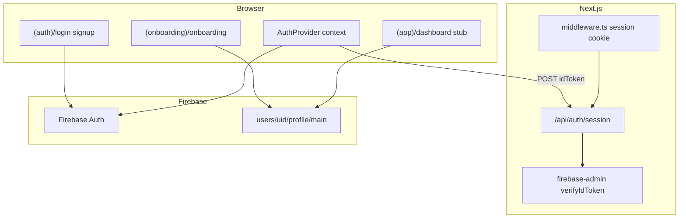

# PR W02: Auth and Onboarding — Detailed Implementation Plan

## Objective

Add Firebase Authentication and a five-step onboarding flow that persists exactly one profile per auth user in Firestore. Unauthenticated users cannot reach app routes; authenticated users with incomplete onboarding are redirected to the wizard; completed users land on a dashboard stub. Mirrors iOS [PR-02](docs/implementation/PR-02.md) behavior with web-specific removals (HealthKit, API keys) and Firestore instead of SwiftData.

**Depends on:** [PR-W01](docs/implementation/web/PR-W01.md) (`NutritionCalculator`, domain types, Firebase client init, `AppConstants.Onboarding`).

**Source of truth:** [`.cursor/plans/calsnap_web_prs_4a5e9349.plan.md`](.cursor/plans/calsnap_web_prs_4a5e9349.plan.md) (W02 section), [docs/technical-spec.md](docs/technical-spec.md) (PR 2), iOS [OnboardingViewModel.swift](CalSnap/Features/Onboarding/OnboardingViewModel.swift), [UserProfileRepository.swift](CalSnap/Core/Repositories/UserProfileRepository.swift).

---

## Sharpened decisions (lock before coding)

| Decision | Choice | Rationale |
|----------|--------|-----------|
| Firestore path | `users/{uid}/profile/main` (fixed doc id) | Matches roadmap `users/{uid}/profile`; one doc per uid; rules are simple |
| Profile gate field | `onboardingCompleted: boolean` on profile doc | Explicit; avoids inferring from partial docs |
| Onboarding steps | 5 steps (not iOS 7) | Drop HealthKit + API keys per roadmap |
| Auth gating | Session cookie + `firebase-admin` in middleware | Satisfies "unauthenticated cannot reach `(app)`" without client-only security theater |
| Onboarding gating | Client layout guard + Firestore read | Middleware cannot cheaply read Firestore; `(app)/layout.tsx` redirects incomplete users |
| UI styling | Plain Tailwind forms (no shadcn) | shadcn deferred to W09 per roadmap |
| Data fetching | Direct Firestore in hooks (no TanStack Query) | TanStack Query introduced in W03; keeps W02 scope tight |
| Date storage | Firestore `Timestamp` at boundary; `Date` in domain | W01 note: doc types introduced in W02 |
| `currentWeightKg` | Set to `startingWeightKg` at onboarding save | iOS derives from weigh-ins later; W06 adds weigh-in collection |
| Unit prefs | `useLbsForWeight`, `useImperialForHeight` on profile doc | Replaces iOS `UserDefaults` / `AppStorageKey` |
| Emulator dev | `NEXT_PUBLIC_USE_FIREBASE_EMULATOR=true` connects Auth + Firestore emulators | Uses existing [firebase.json](calsnap-web/firebase.json) ports |
| Display name | Optional; not required to advance | Per [PR-single-user-local-only-addendum](docs/implementation/PR-single-user-local-only-addendum.md) |

---

## Architecture



### Onboarding flow (web, 5 steps)

```
welcome → profileSetup → goalSetup → caloriePreview → [save to Firestore] → done → /dashboard
```

Save fires on **caloriePreview Continue** (equivalent to iOS save on API Keys Continue). `done` is a brief confirmation before redirect.

### Route groups

| Group | Paths | Guard |
|-------|-------|-------|
| `(auth)` | `/login`, `/signup` | Redirect to `/dashboard` if session exists |
| `(onboarding)` | `/onboarding` | Requires session; redirect to `/login` if none |
| `(app)` | `/dashboard` | Requires session + `onboardingCompleted` |
| root | `/` | Redirect: no session → `/login`; session + incomplete → `/onboarding`; else → `/dashboard` |

---

## Firestore schema: `users/{uid}/profile/main`

```typescript
// lib/models/profile-doc.ts (new)
interface ProfileDoc {
  // Identity / display
  name: string;                    // optional trimmed; default ""
  onboardingCompleted: boolean;    // false until save

  // Body (metric storage)
  sex: 'male' | 'female';
  dateOfBirth: Timestamp;
  heightCm: number;
  startingWeightKg: number;
  currentWeightKg: number;         // = startingWeightKg at onboarding
  goalWeightKg: number;
  goalTargetDate: Timestamp;
  activityLevel: ActivityLevel;

  // Targets (from NutritionCalculator at save)
  dailyCalorieTarget: number;
  tdee: number;
  deficitKcal: number;
  macroTargetProteinPct: number;   // 0.28
  macroTargetCarbsPct: number;     // 0.47
  macroTargetFatPct: number;       // 0.25

  // Display prefs
  useLbsForWeight: boolean;        // default true (iOS default)
  useImperialForHeight: boolean;   // default false

  createdAt: Timestamp;
  updatedAt: Timestamp;
}
```

**Not in W02:** `meals`, `weighIns` subcollections (W04/W06).

---

## In scope

### 1. Firebase project provisioning (documented, not merge-gated)

- Create/link real Firebase project; enable **Email/Password** + **Google** providers
- Add authorized domains: `localhost`, Vercel preview domain
- Extend [firebase.json](calsnap-web/firebase.json) with `auth` providers block + `firestore.rules` path
- Update [.env.local.example](calsnap-web/.env.local.example):
  - `NEXT_PUBLIC_USE_FIREBASE_EMULATOR=false`
  - `FIREBASE_ADMIN_PROJECT_ID`, `FIREBASE_ADMIN_CLIENT_EMAIL`, `FIREBASE_ADMIN_PRIVATE_KEY` (server-only, for session route)
- Add `pnpm emulators` script: `firebase emulators:start --project demo-calsnap`

### 2. Auth layer

| File | Purpose |
|------|---------|
| [calsnap-web/lib/firebase/admin.ts](calsnap-web/lib/firebase/admin.ts) | Lazy `firebase-admin` init (server-only) |
| [calsnap-web/lib/firebase/emulator.ts](calsnap-web/lib/firebase/emulator.ts) | Connect client SDK to emulators when env flag set |
| [calsnap-web/lib/auth/auth-context.tsx](calsnap-web/lib/auth/auth-context.tsx) | `'use client'` provider: `onAuthStateChanged`, sign-in/out helpers |
| [calsnap-web/lib/auth/use-auth.ts](calsnap-web/lib/auth/use-auth.ts) | Hook: `user`, `loading`, `signInWithEmail`, `signUpWithEmail`, `signInWithGoogle`, `signOut` |
| [calsnap-web/app/api/auth/session/route.ts](calsnap-web/app/api/auth/session/route.ts) | `POST`: verify ID token → set `__session` httpOnly cookie (5d); `DELETE`: clear cookie |

Google sign-in: `signInWithPopup` (desktop) with `signInWithRedirect` fallback note in docs for mobile Safari quirks.

### 3. Middleware

[calsnap-web/middleware.ts](calsnap-web/middleware.ts):

- Matcher: `/(app)/:path*`, `/onboarding`, `/login`, `/signup`, `/`
- Verify `__session` cookie via `firebase-admin` `verifySessionCookie` or verify ID token stored in cookie
- No session + `(app)` or `/onboarding` → redirect `/login`
- Session + `/login` or `/signup` → redirect `/` (root resolver handles onboarding vs dashboard)
- **Do not** read Firestore in middleware (onboarding gate lives in layout)

### 4. Profile repository

[calsnap-web/lib/repositories/profile.ts](calsnap-web/lib/repositories/profile.ts):

Port logic from [UserProfileRepository.swift](CalSnap/Core/Repositories/UserProfileRepository.swift):

- `makeProfileFromDraft(draft: ProfileDraft): UserProfile` — calls [calculator.ts](calsnap-web/lib/nutrition/calculator.ts) (same math as iOS `makeUserProfile`)
- `profileToDoc(profile, extras): ProfileDoc` / `docToProfile(doc): UserProfile`
- `getProfile(uid): Promise<UserProfile | null>`
- `saveProfile(uid, profile, extras): Promise<void>` — `setDoc` on `users/{uid}/profile/main`
- `isOnboardingComplete(uid): Promise<boolean>`

### 5. Onboarding domain + hook

| File | Purpose |
|------|---------|
| [calsnap-web/lib/onboarding/onboarding-step.ts](calsnap-web/lib/onboarding/onboarding-step.ts) | 5-step enum + titles |
| [calsnap-web/lib/onboarding/profile-draft.ts](calsnap-web/lib/onboarding/profile-draft.ts) | Port [ProfileDraft.swift](CalSnap/Features/Onboarding/ProfileDraft.swift) |
| [calsnap-web/lib/onboarding/validation.ts](calsnap-web/lib/onboarding/validation.ts) | `validateDateOfBirth`, `validateGoalTargetDate` using `AppConstants.Onboarding` |
| [calsnap-web/lib/onboarding/use-onboarding.ts](calsnap-web/lib/onboarding/use-onboarding.ts) | State machine: step nav, `calculateTargets`, deficit slider (250–500, 750 with acknowledgment), `saveProfile` |
| [calsnap-web/lib/utilities/unit-formatters.ts](calsnap-web/lib/utilities/unit-formatters.ts) | Port kg/lbs, cm/ft-in conversion from [UnitFormatters.swift](CalSnap/Core/Utilities/Extensions/UnitFormatters.swift) |

`use-onboarding.ts` mirrors iOS VM methods: `canAdvance`, `advance`, `goBack`, `updateDeficit`, `unlockHardDeficit`, `calculateTargets`.

### 6. UI pages and components

**Auth pages** (minimal mobile-first Tailwind):

- [calsnap-web/app/(auth)/layout.tsx](calsnap-web/app/(auth)/layout.tsx) — centered card layout
- [calsnap-web/app/(auth)/login/page.tsx](calsnap-web/app/(auth)/login/page.tsx) — email/password + Google + link to signup
- [calsnap-web/app/(auth)/signup/page.tsx](calsnap-web/app/(auth)/signup/page.tsx) — email/password + Google + link to login

**Onboarding** (single page, step switcher — port iOS container pattern):

- [calsnap-web/app/(onboarding)/layout.tsx](calsnap-web/app/(onboarding)/layout.tsx) — client guard: if `onboardingCompleted` → `/dashboard`
- [calsnap-web/app/(onboarding)/onboarding/page.tsx](calsnap-web/app/(onboarding)/onboarding/page.tsx) — progress bar, step content, back/continue
- Step components under `calsnap-web/components/onboarding/`:
  - `WelcomeStep.tsx` — tagline; cloud-storage note (replaces iOS "on-device" copy)
  - `ProfileSetupStep.tsx` — sex, DOB, height (ft/in toggle), weight (lbs/kg toggle); no required name
  - `GoalSetupStep.tsx` — goal weight, target date, activity level cards
  - `CalorieTargetPreviewStep.tsx` — TDEE, deficit slider, macro summary, ±15% science blurb, hard-deficit acknowledgment dialog
  - `OnboardingDoneStep.tsx` — brief completion; auto-redirect to `/dashboard`

**App stub:**

- [calsnap-web/app/(app)/layout.tsx](calsnap-web/app/(app)/layout.tsx) — client guard: fetch profile; if `!onboardingCompleted` → `/onboarding`
- [calsnap-web/app/(app)/dashboard/page.tsx](calsnap-web/app/(app)/dashboard/page.tsx) — stub: greeting + daily calorie target from profile (port iOS [DashboardView.swift](CalSnap/Features/Dashboard/DashboardView.swift) stub intent)

**Root:**

- Replace [calsnap-web/app/page.tsx](calsnap-web/app/page.tsx) with redirect resolver (or move logic to middleware + minimal loading page)
- Wrap [calsnap-web/app/layout.tsx](calsnap-web/app/layout.tsx) with `AuthProvider`

### 7. Firestore security rules

[calsnap-web/firestore.rules](calsnap-web/firestore.rules):

```
rules_version = '2';
service cloud.firestore {
  match /databases/{database}/documents {
    match /users/{userId}/profile/{profileId} {
      allow read, write: if request.auth != null && request.auth.uid == userId;
    }
  }
}
```

Deploy via `firebase deploy --only firestore:rules` (document in PR-W02.md; not merge gate).

### 8. Tests

| File | Cases |
|------|-------|
| [calsnap-web/tests/unit/onboarding-validation.test.ts](calsnap-web/tests/unit/onboarding-validation.test.ts) | Age 10 rejected; age 35 accepted; goal date 7d rejected; 14d accepted; name not required |
| [calsnap-web/tests/unit/profile-repository.test.ts](calsnap-web/tests/unit/profile-repository.test.ts) | `makeProfileFromDraft` → macro defaults 0.28/0.47/0.25; TDEE/target > 0; matches calculator for fixed draft |
| [calsnap-web/tests/integration/profile-firestore.test.ts](calsnap-web/tests/integration/profile-firestore.test.ts) | Round-trip write/read via Firestore emulator (`@firebase/rules-unit-testing`); rules deny cross-uid access |

Add devDependency: `@firebase/rules-unit-testing`. Add script: `"test:integration": "firebase emulators:exec --only firestore,auth 'vitest run tests/integration'"` (optional CI stretch; local merge gate = unit tests + manual emulator).

**Parity anchor:** Fixed `ProfileDraft` (80 kg, 178 cm, male, 35 yr, moderatelyActive, deficit 350) → same TDEE/target as [nutrition-calculator.test.ts](calsnap-web/tests/unit/nutrition-calculator.test.ts) BMR case.

### 9. Documentation

- Create [docs/implementation/web/PR-W02.md](docs/implementation/web/PR-W02.md) (mirror PR-W01 format: objective, files, tests, acceptance, PR snippet)
- Update [docs/implementation/web/README.md](docs/implementation/web/README.md) — W02 status, Firestore path, auth env vars
- Update [calsnap-web/README.md](calsnap-web/README.md) — auth setup, emulator workflow, Google OAuth domain steps

---

## Out of scope

- Dashboard ring, meals, tabs, TanStack Query (W03)
- Meal/weigh-in Firestore collections (W04/W06)
- Gemini API routes, `GEMINI_API_KEY` (W04)
- shadcn/ui, design tokens, dark mode (W09)
- Storage rules (W04)
- Playwright E2E, CI (W10)
- Password reset, email verification flows, account deletion (W08)
- Changes under `CalSnap/` iOS tree

---

## Dependencies to add

```json
{
  "dependencies": {
    "firebase-admin": "^13"
  },
  "devDependencies": {
    "@firebase/rules-unit-testing": "^4"
  }
}
```

No TanStack Query, zod, or shadcn in W02 unless validation needs justify minimal zod on `ProfileDoc` (optional; prefer typed mappers + tests).

---

## Acceptance criteria mapping

| Criterion (roadmap W02) | Satisfied by |
|-------------------------|--------------|
| New user signs up, completes onboarding, profile doc written | Signup → 5 steps → `saveProfile` → `users/{uid}/profile/main` |
| Returning user with `onboardingCompleted: true` skips to dashboard stub | `(onboarding)/layout` + root redirect |
| Unauthenticated users cannot reach `(app)` routes | `middleware.ts` + session cookie |
| Goal date validation (min 2 weeks) | `validation.ts` + unit test |
| Profile doc round-trip via emulator | integration test |
| Onboarding TDEE matches calculator | `profile-repository.test.ts` |
| Email + Google auth | login/signup pages + Firebase providers |
| Deficit slider 250–500, 750 with acknowledgment | `use-onboarding.ts` + CalorieTargetPreviewStep |
| Macro defaults 0.28 / 0.47 / 0.25 | `DEFAULT_USER_PROFILE_MACROS` + repository |
| No secrets in client bundle | `firebase-admin` server-only; grep build output |

---

## Risks and mitigations

| Risk | Mitigation |
|------|------------|
| Google popup blocked on mobile Safari | Document `signInWithRedirect`; test on iOS Safari manually |
| Middleware + client auth race on first load | Show loading spinner in `AuthProvider` and layout guards until `loading === false` |
| `firebase-admin` creds missing locally | Emulator + session route returns 503 with clear error; document `.env.local` |
| Firestore path ambiguity | Lock `profile/main`; document in README |
| W01 `app/page.tsx` placeholder removed | Root becomes redirect-only; update tests if any |

---

## Suggested implementation order

1. Firebase provisioning docs + `firestore.rules` + emulator connect helper
2. `firebase-admin` + `/api/auth/session` + `middleware.ts`
3. `AuthProvider` + auth pages (login/signup)
4. `ProfileDoc` types + `profile.ts` repository + unit tests
5. `ProfileDraft`, validation, `use-onboarding` hook
6. Onboarding step components + page
7. `(app)/dashboard` stub + layout guards + root redirect
8. Integration test + PR-W02.md + README updates
9. Verify: `pnpm test && pnpm lint && pnpm build`; manual signup → onboarding → dashboard on emulator

---

## Definition of done

- [ ] Email/password and Google sign-in work against Firebase (or emulators)
- [ ] Session cookie set on sign-in; middleware blocks `(app)` without session
- [ ] Five-step onboarding navigable; profile saved to `users/{uid}/profile/main`
- [ ] `onboardingCompleted: true` after save; incomplete users redirected to `/onboarding`
- [ ] Dashboard stub shows daily target from Firestore profile
- [ ] `firestore.rules` committed; cross-uid write denied
- [ ] Unit tests: validation + repository + calculator parity; integration test for round-trip
- [ ] `docs/implementation/web/PR-W02.md` + README updates
- [ ] No `firebase-admin` or `GEMINI_API_KEY` in client bundle

---

## PR description snippet

> **PR W02: Firebase Auth and onboarding**
>
> Adds email/Google auth, session middleware, five-step onboarding (no HealthKit/API keys), Firestore profile persistence at `users/{uid}/profile/main`, security rules, and dashboard stub.
>
> **Web deltas:** Firebase Auth replaces local-only install; cloud profile doc includes `onboardingCompleted` and unit prefs; Gemini remains server-side (W04).
>
> **Test plan:** `cd calsnap-web && pnpm test && pnpm lint && pnpm build`; manual: emulators → signup → onboarding → dashboard stub; relaunch skips onboarding.
