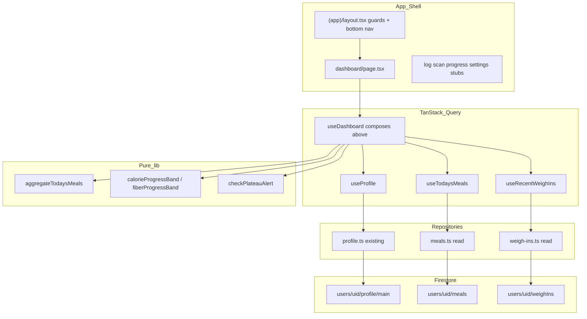

# PR W03: Dashboard — Core Daily View

## Objective

Deliver the primary authenticated home screen for CalSnap Web: greeting + date, animated calorie ring, macro/fiber bars, today's meals grouped by `MealType`, 7-day weight sparkline, floating scan CTA, and plateau alert sheet. Wire live Firestore reads for profile (existing), today's meals, and recent weigh-ins via TanStack Query. Mirrors iOS [PR-03](docs/implementation/PR-03.md) and the W03 section of [`.cursor/plans/calsnap_web_prs_4a5e9349.plan.md`](.cursor/plans/calsnap_web_prs_4a5e9349.plan.md).

**Depends on:** [PR-W01](docs/implementation/web/PR-W01.md) (domain types, `NutritionCalculator`, `AppConstants`), [PR-W02](docs/implementation/web/PR-W02.md) (auth, profile at `users/{uid}/profile/main`, `(app)` guards, plain Tailwind UI pattern).

**Source references (port behavior, not SwiftUI):**
- [DashboardViewModel.swift](CalSnap/Features/Dashboard/DashboardViewModel.swift) — aggregation, progress bands, plateau actions
- [MealRepository.swift](CalSnap/Core/Repositories/MealRepository.swift) — calendar-day meal fetch
- [WeighInRepository.swift](CalSnap/Core/Repositories/WeighInRepository.swift) — 7-day window + weekly plateau fetch
- [PR-03.md](docs/implementation/PR-03.md) — acceptance + test parity

---

## Sharpened decisions (locked — sharpen-plan 2026-06-27)

| Decision | Choice | Rationale |
|----------|--------|-----------|
| **Firestore doc types in W03** | **Full `MealEntryDoc` + `WeighInDoc` + mappers now** | W04/W06 write the same shape; one schema PR avoids rework (confirmed) |
| **Today's meals query** | **Range on `timestamp` + `orderBy` + `firestore.indexes.json`** | Scales; matches iOS calendar-day semantics; index is merge-gate artifact (confirmed) |
| **Plateau UX in W03** | **Full sheet** — Diet Break / Small Reduction / Remind Later | Pure logic + profile update; QA via emulator seed only; no weigh-in UI needed (confirmed) |
| **Plateau snooze / maintenance** | **`localStorage`** keys `plateauSnoozeUntil_{uid}`, `maintenanceModeUntil_{uid}` | Matches iOS AppStorage; no `ProfileDoc` schema change; cross-device sync deferred to W08 if needed (confirmed) |
| **`DailySummaryFooter`** | **Fiber progress + net calorie line only** | Useful without W05; macro % comparison deferred to W05 (confirmed) |
| **Scan entry points** | **FAB on dashboard + Scan tab stub** | Roadmap acceptance; FAB is primary home CTA; tab satisfies nav requirement (confirmed) |
| Data fetching | **TanStack Query v5** (`@tanstack/react-query`) | Roadmap W03; replaces dashboard stub's raw `useEffect` + `getProfile` |
| Query provider placement | Wrap inside [`app/layout.tsx`](calsnap-web/app/layout.tsx) via `AppProviders` | QueryClient wraps AuthProvider; devtools optional |
| Firestore meal path | `users/{uid}/meals/{mealId}` | Matches roadmap `users/{uid}/...`; W04 writes same path |
| Firestore weigh-in path | `users/{uid}/weighIns/{weighInId}` | camelCase collection id aligned with domain `WeighIn` |
| Meal items storage | **Embedded array** on meal doc | Single read for dashboard list; W04 analysis writes same shape |
| W03 repo scope | **Read-only** `meals.ts` + `weigh-ins.ts` | Writes deferred to W04 (meals) and W06 (weigh-ins) |
| Plateau weigh-in fetch | **`fetchWeeklyPlateauWeighIns`** (6-day spacing, 3 entries) | Aligns with evolved iOS behavior; constants in [`lib/constants.ts`](calsnap-web/lib/constants.ts) |
| Weight chart window | Last **7 calendar days** (not latest 7 records) | iOS PR-03 spec extension |
| Sparkline rendering | **Inline SVG** component | Avoid Recharts until W06 full progress chart |
| UI styling | Plain Tailwind (no shadcn) | Consistent with W02; design tokens in W09 |
| Progress colors | Tailwind semantic classes (`emerald` / `amber` / `red`) | W09 replaces with design tokens |
| Tab nav routes | Dashboard, Log, Scan, Progress, Settings | Roadmap differs from iOS (Analytics → W07) |
| Non-dashboard tabs | **Stub pages** with title + "Coming in W0N" copy | Satisfies tab nav acceptance without scope creep |
| Meal row tap | Display-only; no navigation | W05 adds detail/edit |
| Sign out | **Settings stub only**; dashboard header = greeting only | Cleaner home screen |
| Middleware | Extend matcher to `/log`, `/scan`, `/progress`, `/settings` | Session gate for all `(app)` routes; onboarding gate stays client-side in `(app)/layout` |
| Manual QA data | Seed via emulator UI or integration test helpers | No meal/weigh-in writes in app until W04/W06 |
| Calendar-day timezone | **Browser local timezone** via `date-window.ts` | Matches iOS `Calendar.current`; document in PR-W03 |

---

## Architecture



### Dashboard load sequence

```
useDashboard(uid)
  → useProfile(uid)                    // profile + unit prefs from ProfileDoc
  → useTodaysMeals(uid, today)         // calendar-day query
  → useRecentWeighIns(uid)             // 7-day chart + weekly plateau fetch
  → aggregateTodaysMeals(meals)        // sums + mealsByType
  → macroTargets / fiberTargetG        // from calculator
  → checkPlateauAlert(profile, plateauWeighIns, localStorage)
```

### Plateau actions (persist profile + localStorage)

| Action | Profile update | localStorage |
|--------|----------------|--------------|
| **Diet Break** | `dailyCalorieTarget = tdee`, `deficitKcal = 0` | `maintenanceModeUntil_{uid}` = now + 14d |
| **Small Reduction** | `dailyCalorieTarget = max(minCalories(sex), target - 60)`, `deficitKcal = tdee - target` | — |
| **Remind Later** | — | `plateauSnoozeUntil_{uid}` = now + 14d |

Use existing [`saveProfile`](calsnap-web/lib/repositories/profile.ts) (or a narrow `updateCalorieTargets` helper) with rollback on failure — alert stays open if save fails (iOS parity).

Suppress alert when: no profile, maintenance active, snooze active, fewer than 3 plateau weigh-ins, or `isOnPlateau()` false.

---

## Firestore schema (read paths only in W03)

### `users/{uid}/meals/{mealId}` — new `MealEntryDoc`

```typescript
// lib/models/meal-entry-doc.ts
interface MealEntryDoc {
  userId: string;
  timestamp: Timestamp;
  mealType: MealType;
  photoStoragePath?: string;
  textDescription?: string;
  totalCalories: number;
  totalProteinG: number;
  totalCarbsG: number;
  totalFatG: number;
  totalFiberG: number;
  geminiConfidence: number;
  isManuallyAdjusted: boolean;
  estimationNotes?: string;
  items: FoodItemDoc[];  // same fields as FoodItem, serialized
  createdAt: Timestamp;
  updatedAt: Timestamp;
}
```

Mappers: `mealDocToEntry`, `mealEntryToDoc` (doc mapper used by W04 tests; W03 only needs `docToEntry`).

**Query:** `where('timestamp', '>=', startOfDay)`, `where('timestamp', '<', endOfDay)`, `orderBy('timestamp')` — **requires** composite index on `timestamp`. Add [`firestore.indexes.json`](calsnap-web/firestore.indexes.json) and wire in [`firebase.json`](calsnap-web/firebase.json) (merge-gate artifact, not optional).

### `users/{uid}/weighIns/{weighInId}` — new `WeighInDoc`

```typescript
// lib/models/weigh-in-doc.ts
interface WeighInDoc {
  userId: string;
  date: Timestamp;           // weigh-in calendar day
  weightKg: number;
  calculatedTDEE?: number;
  adjustedDailyTarget?: number;
  bmi?: number;
  createdAt: Timestamp;
}
```

**Queries:**
- Chart: `date >= startOfDay(today - 6d)` through end of today
- Plateau: client-side weekly spacing filter on recent docs (port `fetchWeeklyPlateauWeighIns`)

### Security rules extension

Update [`firestore.rules`](calsnap-web/firestore.rules):

```
match /users/{userId}/meals/{mealId} {
  allow read, write: if request.auth != null && request.auth.uid == userId;
}
match /users/{userId}/weighIns/{weighInId} {
  allow read, write: if request.auth != null && request.auth.uid == userId;
}
```

Write rules included now so W04/W06 don't require a rules-only PR; W03 only exercises reads.

---

## Pure dashboard logic (test-first)

Create [`lib/dashboard/`](calsnap-web/lib/dashboard/) — no React, fully unit-testable:

| Module | Exports | iOS equivalent |
|--------|---------|----------------|
| [`aggregate-meals.ts`](calsnap-web/lib/dashboard/aggregate-meals.ts) | `aggregateTodaysMeals(meals)` → totals + `MealsByType` | `DashboardViewModel.aggregateMeals()` |
| [`calorie-progress.ts`](calsnap-web/lib/dashboard/calorie-progress.ts) | `CalorieProgressBand`, `calorieProgressBand(ratio)`, `fiberProgressBand(ratio)`, `remainingCalories`, `netCalorieSummary` | `CalorieProgressBand`, `FiberProgressBand` |
| [`greeting.ts`](calsnap-web/lib/dashboard/greeting.ts) | `dashboardGreeting(name, now)` → `"Good morning, Sam"` or `"Today"` | Dashboard header logic |
| [`plateau-state.ts`](calsnap-web/lib/dashboard/plateau-state.ts) | `isMaintenanceModeActive`, `isPlateauSnoozed`, `shouldShowPlateauAlert`, `applyDietBreakTargets`, `applySmallReductionTargets` | Plateau gating + target math |
| [`date-window.ts`](calsnap-web/lib/dashboard/date-window.ts) | `startOfLocalDay`, `calendarDayRange`, `lastNDaysWindow(7)` | Calendar helpers for repos |

**Progress band thresholds (must match iOS tests):**

| Band | Calorie ratio (`consumed / target`) | Fiber ratio |
|------|-------------------------------------|-------------|
| Green (`under` / `onTrack`) | `< 0.90` | `≥ 0.90` |
| Yellow (`onTrack` / `moderate`) | `0.90 – 1.10` | `0.70 – 0.90` |
| Red (`over` / `low`) | `≥ 1.10` | `< 0.70` |

---

## TanStack Query layer

| File | Purpose |
|------|---------|
| [`lib/queries/query-client.ts`](calsnap-web/lib/queries/query-client.ts) | Singleton `QueryClient`, default `staleTime` ~30s for dashboard |
| [`lib/queries/query-keys.ts`](calsnap-web/lib/queries/query-keys.ts) | `profile`, `todaysMeals(date)`, `weighIns(window)` |
| [`lib/queries/use-profile.ts`](calsnap-web/lib/queries/use-profile.ts) | Returns `UserProfile` + `ProfileExtras` (unit prefs) |
| [`lib/queries/use-todays-meals.ts`](calsnap-web/lib/queries/use-todays-meals.ts) | Today's meals; `enabled: !!uid` |
| [`lib/queries/use-recent-weigh-ins.ts`](calsnap-web/lib/queries/use-recent-weigh-ins.ts) | Chart + plateau weigh-ins |
| [`lib/queries/use-dashboard.ts`](calsnap-web/lib/queries/use-dashboard.ts) | Composes queries + pure lib; exposes aggregated view model |

Invalidate `profile` query after plateau diet break / small reduction saves.

**Root layout change** — wrap with `QueryClientProvider`:

```tsx
// app/layout.tsx (client wrapper or Providers.tsx)
<QueryClientProvider client={queryClient}>
  <AuthProvider>{children}</AuthProvider>
</QueryClientProvider>
```

Extract [`components/providers/AppProviders.tsx`](calsnap-web/components/providers/AppProviders.tsx) if needed to keep root layout clean.

---

## Repositories

### [`lib/repositories/meals.ts`](calsnap-web/lib/repositories/meals.ts) (new, read-only)

- `fetchMealsForCalendarDay(uid, day, db?)` → `MealEntry[]`
- `docToMealEntry(id, doc)` mapper
- Uses [`getFirestoreDb()`](calsnap-web/lib/firebase/client.ts) + emulator connect (W02 pattern)

### [`lib/repositories/weigh-ins.ts`](calsnap-web/lib/repositories/weigh-ins.ts) (new, read-only)

- `fetchWeighInsInWindow(uid, start, end)` → chart data
- `fetchWeeklyPlateauWeighIns(uid, count = 3)` → port iOS spacing algorithm
- `docToWeighIn(id, doc)` mapper

### [`lib/repositories/profile.ts`](calsnap-web/lib/repositories/profile.ts) (extend)

- Add `updateCalorieTargets(uid, { dailyCalorieTarget, deficitKcal })` for plateau actions (reuses `saveProfile` merge logic)

---

## UI components

All under [`components/dashboard/`](calsnap-web/components/dashboard/) — plain Tailwind, matching onboarding card pattern (`rounded-xl border bg-white p-6 shadow-sm`).

| Component | Props / behavior |
|-----------|------------------|
| **`CalorieRingCard`** | `consumed`, `target`, `remaining`, `progress`, `band` — SVG ring with CSS transition on mount; center shows remaining (negative allowed); subtitle `"of {target} kcal goal"`; band color on stroke |
| **`MacroBarCard`** | P/C/F bars with consumed/target grams; fiber bar with `fiberProgressBand`; fixed macro colors (neutral until W09) |
| **`TodaysMealsSection`** | `mealsByType`, empty state per section ("No breakfast logged yet"); rows show meal type icon (emoji or simple SVG), time, calories; **no tap handler** |
| **`WeightTrendMiniChart`** | `weighIns`, `startingWeightKg`, `useLbs`; SVG sparkline; empty state with starting weight label + "Log weigh-in in Progress" hint (sheet is W06) |
| **`DailySummaryFooter`** | Fiber consumed/target + net calorie line (`"+300 over goal"`); **no macro % row** (W05) |
| **`PlateauAlertSheet`** | Modal/dialog (native `<dialog>` or fixed overlay); three buttons; non-dismissable backdrop tap; copy from iOS plateau sheet |
| **`DashboardHeader`** | Greeting + formatted date; no sign out |
| **`ScanFab`** | Fixed bottom-right above tab bar; links to `/scan` via `next/link` |

### App shell — [`app/(app)/layout.tsx`](calsnap-web/app/(app)/layout.tsx)

Replace minimal wrapper with:

- Existing auth + onboarding guards (unchanged)
- Scrollable main area: `pb-20` (clearance for tab bar + FAB)
- Fixed bottom nav: 5 tabs with `aria-current="page"`, icons + labels, min 44px touch targets
- Active route detection via `usePathname()`

### Pages

| Route | File | W03 content |
|-------|------|-------------|
| `/dashboard` | [`app/(app)/dashboard/page.tsx`](calsnap-web/app/(app)/dashboard/page.tsx) | Full dashboard (replace stub) |
| `/log` | `app/(app)/log/page.tsx` | Stub → W05 |
| `/scan` | `app/(app)/scan/page.tsx` | Stub → W04; FAB + tab land here |
| `/progress` | `app/(app)/progress/page.tsx` | Stub → W06 |
| `/settings` | `app/(app)/settings/page.tsx` | Stub + sign out button → W08 |

### Dashboard page structure

```tsx
// dashboard/page.tsx — thin client page
<DashboardHeader greeting={...} date={...} />
<CalorieRingCard ... />
<MacroBarCard ... />
<TodaysMealsSection ... />
<DailySummaryFooter ... />   // partial
<WeightTrendMiniChart ... />
<ScanFab href="/scan" />
<PlateauAlertSheet open={...} onDietBreak onSmallReduction onDismiss />
```

Loading: skeleton placeholders or spinner cards while queries pending. Error: banner if profile fetch fails (reuse `SessionErrorBanner` pattern).

---

## Middleware update

Extend [`middleware.ts`](calsnap-web/middleware.ts):

```typescript
const APP_PATHS = ['/dashboard', '/log', '/scan', '/progress', '/settings'];
// matcher: APP_PATHS and APP_PATHS/:path*
```

Same session gate as `/dashboard` today.

---

## Tests (merge gate)

### Unit — [`tests/unit/dashboard-aggregation.test.ts`](calsnap-web/tests/unit/dashboard-aggregation.test.ts)

Port iOS `DashboardViewModelTests` core cases:

| Test | Verifies |
|------|----------|
| `aggregateTodaysMeals with 3 meals` | Correct calorie/macro/fiber totals + `mealsByType` grouping |
| `calorieProgressBand boundaries` | 0.89 → under, 0.95 → onTrack, 1.15 → over |
| `remainingCalories with overage` | Target 2000, consumed 2300 → remaining **-300** |
| `fiberTargetG at 2000 kcal` | **28 g** target |
| `fiberProgressBand thresholds` | onTrack / moderate / low at 2000 kcal target |
| `netCalorieSummary` | `"+300 over goal"` when over target |
| `shouldShowPlateauAlert` | Respects snooze, maintenance, `isOnPlateau` |
| `applyDietBreakTargets` | Target = TDEE, deficit 0 |
| `applySmallReductionTargets` | Female floor at 1200 kcal |

### Unit — repository mappers (optional small file)

- `mealDocToEntry` round-trip field mapping
- `weighInDocToEntry` date handling

### Integration (optional, emulator)

[`tests/integration/dashboard-firestore.test.ts`](calsnap-web/tests/integration/dashboard-firestore.test.ts):

- Seed 3 meals for today → `fetchMealsForCalendarDay` returns sorted list
- Seed 3 plateau weigh-ins (weekly spaced) → `fetchWeeklyPlateauWeighIns` returns 3

Run via existing `pnpm test:integration` + emulators.

**Merge gate:** `pnpm test && pnpm lint && pnpm build` (same as W01/W02).

---

## Acceptance criteria mapping

| Criterion (roadmap W03) | Satisfied by |
|-------------------------|--------------|
| Dashboard renders live Firestore data | TanStack Query + meal/weigh-in repos |
| Ring shows consumed/target/remaining correctly | `CalorieRingCard` + `aggregateTodaysMeals` |
| Plateau alert when `isOnPlateau` true | `PlateauAlertSheet` + weekly weigh-in fetch + localStorage gates |
| Tab navigation on 320px viewport | `(app)/layout` bottom nav + stub routes |
| Scan tab → `/scan` stub | Stub page + `ScanFab` |
| Progress color boundaries | `calorie-progress.ts` + unit tests |
| Remaining calories including overages | Unit test + ring displays negative remaining |

---

## Out of scope (explicit)

- Gemini scanner, `/api/analyze-meal`, Storage uploads (W04)
- Meal CRUD, log detail, swipe delete, share card (W05)
- Weigh-in sheet, TDEE recalc on save, full Recharts progress page (W06)
- Analytics tab/screen (W07)
- Settings profile edit, CSV export (W08)
- shadcn/ui, design tokens, dark mode, copy module (W09)
- PWA, Playwright E2E, CI (W10)
- Meal row navigation, photo thumbnails from Storage (W04/W05)
- In-app overdue weigh-in banner (README open decision #3; W10 stretch)

---

## Files to create

| Path | Purpose |
|------|---------|
| `lib/models/meal-entry-doc.ts` | Firestore meal doc type + mappers |
| `lib/models/weigh-in-doc.ts` | Firestore weigh-in doc type + mappers |
| `lib/dashboard/*.ts` | Pure aggregation, progress bands, plateau, date helpers |
| `lib/repositories/meals.ts` | Read today's meals |
| `lib/repositories/weigh-ins.ts` | Read chart + plateau weigh-ins |
| `lib/queries/*.ts` | Query client, keys, hooks |
| `components/providers/AppProviders.tsx` | QueryClient + Auth wrapper |
| `components/dashboard/*.tsx` | Ring, macros, meals, chart, footer, plateau, FAB, header |
| `components/app/BottomTabNav.tsx` | Tab bar component |
| `app/(app)/log/page.tsx` | Stub |
| `app/(app)/scan/page.tsx` | Stub |
| `app/(app)/progress/page.tsx` | Stub |
| `app/(app)/settings/page.tsx` | Stub + sign out |
| `tests/unit/dashboard-aggregation.test.ts` | Core logic tests |
| `tests/integration/dashboard-firestore.test.ts` | Optional emulator tests |
| `firestore.indexes.json` | Composite index for meals `timestamp` range query (required) |
| `docs/implementation/web/PR-W03.md` | Implementation record on merge |

## Files to modify

| Path | Change |
|------|--------|
| `package.json` | Add `@tanstack/react-query` |
| `app/layout.tsx` | Wrap with `AppProviders` |
| `app/(app)/layout.tsx` | Bottom nav + content padding |
| `app/(app)/dashboard/page.tsx` | Full dashboard (replace stub) |
| `lib/repositories/profile.ts` | `updateCalorieTargets` for plateau |
| `lib/models/index.ts` | Export new doc types |
| `firestore.rules` | Meals + weighIns subcollections |
| `firebase.json` | Indexes path if added |
| `middleware.ts` | Protect all app tab routes |
| `docs/implementation/web/README.md` | Mark W03 implemented; note TanStack Query baseline |

---

## Suggested implementation sequence

1. **Dependencies + providers** — `@tanstack/react-query`, `AppProviders`, query client/keys
2. **Firestore schema + rules** — doc types, mappers, rules extension, indexes
3. **Pure dashboard lib + unit tests** — aggregation, progress bands, plateau math (TDD)
4. **Repositories** — `meals.ts`, `weigh-ins.ts`; extend `profile.ts`
5. **Query hooks** — `useProfile`, `useTodaysMeals`, `useRecentWeighIns`, `useDashboard`
6. **Dashboard components** — ring, macros, meals, chart, footer, plateau sheet
7. **App shell** — bottom nav, stub routes, middleware matcher
8. **Dashboard page integration** — wire hooks → components; remove W02 placeholder
9. **Integration tests + docs** — optional Firestore tests; `PR-W03.md`; README update
10. **Manual QA** — emulators → onboarding → empty dashboard; seed meals/weigh-ins → verify ring + plateau

---

## Manual test plan

1. `pnpm emulators` + `pnpm dev` with emulator env (W02 flow)
2. Complete onboarding → dashboard shows ring at 0/target, empty meals, empty weight chart
3. In Emulator UI, add 3 meals under `users/{uid}/meals/` for today → refresh → ring/macros update
4. Add 3 weekly-spaced weigh-ins with flat weights → plateau sheet appears
5. Diet Break → target equals TDEE; sheet dismisses; re-open dashboard → no re-alert for 14 days
6. Resize viewport to 320px → tab bar usable; FAB not obscured
7. Navigate all 5 tabs → stubs render; Scan tab matches FAB destination

---

## Risks and mitigations

| Risk | Mitigation |
|------|------------|
| No meal data until W04 | Empty states + integration test seeds; document emulator seed steps in PR-W03 |
| Firestore composite index on `timestamp` | `firestore.indexes.json` required in PR; emulator fails/warns without it |
| Plateau untestable without seeded weigh-ins | Document emulator seed steps in PR-W03 manual test plan; unit tests cover logic |
| FAB + Scan tab feel redundant | FAB is dashboard-only primary action; Scan tab satisfies roadmap nav acceptance |
| localStorage snooze lost on new browser | Accept for W03 (iOS AppStorage same device scope); W08 may add ProfileDoc fields |
| Plateau fires without real weigh-ins in prod | Expected until W06; QA uses seeded data |
| Query stale after plateau save | `queryClient.invalidateQueries(profileKey)` on success |
| Bottom nav + FAB overlap | `pb-24` on scroll container; FAB `bottom-20` above nav |
| `localStorage` unavailable (SSR) | Access only in `useEffect` / client handlers |
| Timezone calendar-day boundaries | Use local timezone consistently in `date-window.ts`; document assumption |

---

## PR description snippet

> **PR W03: Dashboard — core daily view**
>
> Adds mobile app shell with bottom tab nav, TanStack Query, Firestore read repos for meals/weigh-ins, and the full dashboard: calorie ring, macro/fiber bars, today's meals, weight sparkline, plateau sheet, and scan FAB → `/scan` stub.
>
> **Web deltas:** Firestore subcollections replace SwiftData; plateau snooze/maintenance in localStorage; Log/Scan/Progress/Settings tabs (stubs except dashboard); SVG sparkline instead of Swift Charts.
>
> **Test plan:** `cd calsnap-web && pnpm test && pnpm lint && pnpm build` + manual emulator seed for meals/plateau weigh-ins.
