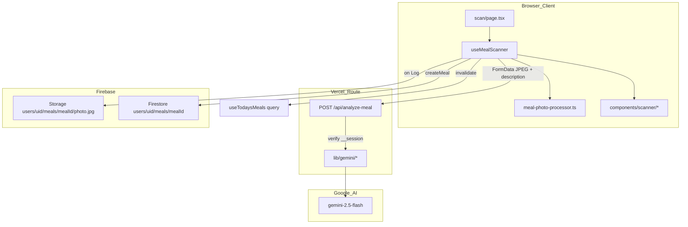
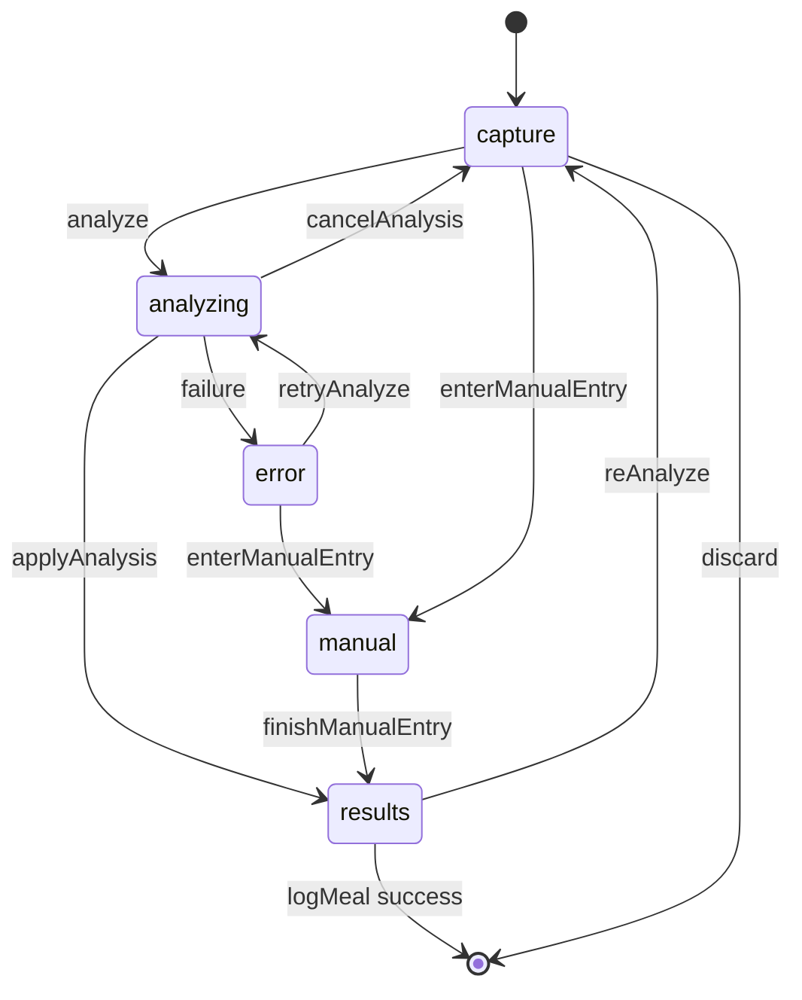

# PR W04: Meal Scanner — Gemini Integration

## Objective

Deliver the primary value-add feature for CalSnap Web: capture or pick a meal photo, compress client-side, analyze via server-side Gemini, review/edit results, and persist a `MealEntryDoc` + optional Storage photo. Mirrors iOS [PR-04](docs/implementation/PR-04.md) and the W04 section of [`.cursor/plans/calsnap_web_prs_4a5e9349.plan.md`](.cursor/plans/calsnap_web_prs_4a5e9349.plan.md).

**Depends on:**
- [PR-W01](docs/implementation/web/PR-W01.md) — domain types, `AppConstants.MealPhoto` / `AppConstants.Gemini`, `FoodItem`, `MealEntry`
- [PR-W02](docs/implementation/web/PR-W02.md) — auth, session cookie, `getAdminAuth`, `(app)` route guards
- [PR-W03](docs/implementation/web/PR-W03.md) — `MealEntryDoc` + mappers, read-only `meals.ts`, TanStack Query, `/scan` stub + `ScanFab`, Firestore rules for meals

**Source references (port behavior, not SwiftUI):**
- [`GeminiService.swift`](CalSnap/Core/Services/GeminiService.swift) + [`GeminiRESTClient.swift`](CalSnap/Core/Services/GeminiRESTClient.swift) — prompt, JSON schema, multimodal call
- [`MealAnalysisJSONParser.swift`](CalSnap/Core/Services/MealAnalysisJSONParser.swift) — resilient JSON extraction
- [`MealPhotoProcessor.swift`](CalSnap/Core/Utilities/MealPhotoProcessor.swift) — compression policy
- [`MealScannerViewModel.swift`](CalSnap/Features/MealScanner/MealScannerViewModel.swift) — phase machine, totals, manual semantics
- [`EditableFoodItem.swift`](CalSnap/Features/MealScanner/EditableFoodItem.swift) — weight-ratio scaling
- [`PR-04-addendum-image-storage.md`](docs/implementation/PR-04-addendum-image-storage.md) — single optimized JPEG pipeline

---

## Sharpened decisions (locked — sharpen-plan 2026-06-27)

| Decision | Choice | Rationale |
|----------|--------|-----------|
| **Gemini client** | `@google/genai` in route handler only | Official SDK; `GEMINI_API_KEY` never in client bundle |
| **API auth** | Verify `__session` cookie via `getAdminAuth().verifyIdToken()` | Reuses W02 session; same-origin `fetch` with cookies; extract `uid` from token |
| **Analyze request body** | `multipart/form-data`: `image` (JPEG blob) + optional `description` (string) | Avoids base64 inflation; prepared JPEG from `MealPhotoProcessor` |
| **Analyze vs persist** | Analyze sends bytes to API only; Storage upload on **Log This Meal** | Matches iOS (Gemini gets prepared bytes; Storage is persistence step); discard writes nothing |
| **Manual without photo** | **Allowed** — skip Storage upload; omit `photoStoragePath` on doc | iOS parity; manual is fallback when capture fails; no value forcing a photo |
| **Storage path** | `users/{uid}/meals/{mealId}/photo.jpg` | Roadmap + web delta (`photoStoragePath` on doc) |
| **Meal ID generation** | `crypto.randomUUID()` client-side before upload + Firestore write | Stable ID ties Storage object to Firestore doc |
| **FoodItem ID generation** | `crypto.randomUUID()` per item at creation (analysis map or manual add) | Stable keys for edit sheet / list reconciliation |
| **Totals source** | Sum of `editableItems`, not Gemini `meal_total` | iOS PR-04 approved semantics; `meal_total` used for sanity check only |
| **Manual entry semantics** | `geminiConfidence = 0`, per-item `confidence = 1.0`, `isManuallyAdjusted = true`, no estimation notes | iOS parity ([PR-04 §6](docs/implementation/PR-04.md)) |
| **Manual validation gates** | **Continue:** each item has non-empty name + `calories > 0`; **Log:** all items have name + `weightG > 0` | Matches iOS `ManualMealEntryView` + `MealScannerViewModel.canLog` |
| **Confidence UI** | Badge: high ≥0.8, medium 0.6–<0.8, low <0.6; banner when all items flagged | Uses `AppConstants.Gemini.confidenceThreshold` (0.6) |
| **Photo processor runtime** | Browser Canvas API (`createImageBitmap` + `OffscreenCanvas` or `<canvas>`) | No extra npm dep; constants already in [`lib/constants.ts`](calsnap-web/lib/constants.ts) |
| **Server image handling** | **Trust client JPEG** — validate MIME + max byte size only; no server re-encode | iOS sends same bytes to Gemini and Storage; re-encode duplicates `MealPhotoProcessor` and adds latency |
| **Scanner state** | `useMealScanner` hook in `lib/scanner/` (ViewModel port) + thin page/components | Keeps `app/(app)/scan/page.tsx` thin per engineering rules |
| **Post-log navigation** | `router.push('/dashboard')` + invalidate `queryKeys.todaysMeals` | Dashboard ring updates without full reload |
| **Unsaved work guard** | **In-app discard confirm** on bottom-tab nav + explicit Discard button + `beforeunload` | `beforeunload` alone misses SPA tab switches; iOS uses custom back + discard alert |
| **Storage write failure** | **Accept orphaned Storage object** if Firestore fails after upload | Simplest transaction; rare partial failure; W08 delete-all cleans up |
| **Network pre-check** | `navigator.onLine` before analyze; proceed if unknown (no 2s monitor on web v1) | Simpler than iOS NWPathMonitor; real failures surface as API errors |
| **Missing Gemini key** | API returns 503 `{ error: 'Analysis unavailable' }`; client shows recovery UI | Web has no user BYOK; operator configures `GEMINI_API_KEY` on Vercel |
| **Rate limiting** | **Defer to W10** — session auth gate only in W04 | Single-user MVP; operator cost risk is low; W10 hardening adds per-uid limits |
| **Edit existing meal** | Out of scope (W05) | No `loadForEditing` in W04 |
| **UI styling** | Plain Tailwind (W02/W03 pattern) | Design tokens deferred to W09 |
| **Abort on navigate-away** | Defer to W10 | Roadmap release hardening; optional `AbortController` on analyze fetch if time permits |

---

## Architecture



### Scanner phase state machine



| Phase | UI | Key actions |
|-------|-----|-------------|
| `capture` | Photo preview, optional description, Analyze / Manual entry | `<input type="file" accept="image/*" capture="environment">` + gallery picker |
| `analyzing` | Spinner + cancel | POST `/api/analyze-meal` |
| `results` | Totals, item list, meal type, confidence, Log / Re-analyze / Discard | Weight edit recalculates totals live |
| `manual` | Multi-item form (name, weight, calories, optional macros) | Continue when name + calories > 0 per item → results with manual semantics |
| `error` | Banner: offline, API, parse, unrecognizable | Retry, manual fallback |

---

## Implementation plan (by layer)

### 1. Dependencies and env

**Modify** [`calsnap-web/package.json`](calsnap-web/package.json):
- Add `@google/genai` (Gemini SDK for route handler)
- Add `zod` (response validation)

**Modify** [`calsnap-web/.env.local.example`](calsnap-web/.env.local.example):
- Uncomment `GEMINI_API_KEY=` with comment "required for W04 analyze route"

**Modify** [`calsnap-web/next.config.ts`](calsnap-web/next.config.ts) if SDK needs `serverExternalPackages` (check build; mirror `firebase-admin` pattern if needed).

---

### 2. Client photo processor

**Create** [`calsnap-web/lib/services/meal-photo-processor.ts`](calsnap-web/lib/services/meal-photo-processor.ts)

Port intent from iOS `MealPhotoProcessor`:

```typescript
export interface PreparedMealImage {
  blob: Blob;
  mimeType: 'image/jpeg';
  pixelWidth: number;
  pixelHeight: number;
  byteCount: number;
}

export async function prepareForAnalysisAndStorage(file: File): Promise<PreparedMealImage>
```

Algorithm (match [`AppConstants.MealPhoto`](calsnap-web/lib/constants.ts)):
1. Decode via `createImageBitmap(file)` (handles EXIF orientation in modern browsers)
2. Nested loop: `longEdgeRetrySteps` × `qualityRetrySteps`
3. Draw to canvas scaled to max long edge (never upscale)
4. `canvas.toBlob('image/jpeg', quality)`
5. Return first result with `byteCount <= hardMaxBytes`; throw `hardByteCapExceeded` if none

**Create** [`calsnap-web/tests/unit/meal-photo-processor.test.ts`](calsnap-web/tests/unit/meal-photo-processor.test.ts) — use small fixture PNGs or programmatic canvas in jsdom/node (may need `vitest` + `canvas` polyfill or test pure dimension math helpers separately). Minimum: test retry grid selection logic and byte-cap enforcement via extracted pure functions if full canvas unavailable in node.

---

### 3. Gemini library (server-only)

**Create** [`calsnap-web/lib/gemini/meal-analysis-schema.ts`](calsnap-web/lib/gemini/meal-analysis-schema.ts) — port `GeminiMealAnalysisSchema.jsonSchema()` as a typed object for `@google/genai` `responseSchema`.

**Create** [`calsnap-web/lib/gemini/meal-analysis-types.ts`](calsnap-web/lib/gemini/meal-analysis-types.ts):

```typescript
export interface MealAnalysisFoodItemResult { name, estimatedWeightG, calories, proteinG, ... confidence }
export interface MealAnalysisResponse { items, mealTotal, flaggedItems, estimationNotes }
```

**Create** [`calsnap-web/lib/gemini/meal-analysis-prompt.ts`](calsnap-web/lib/gemini/meal-analysis-prompt.ts) — port `buildMealAnalysisPrompt(description?)` from `GeminiService.swift` (USDA reference, caloric density rules, flag confidence < 0.6).

**Create** [`calsnap-web/lib/gemini/meal-analysis-parser.ts`](calsnap-web/lib/gemini/meal-analysis-parser.ts) — port `MealAnalysisJSONParser`:
- Strip markdown fences
- Balanced-brace extraction with escaped quotes
- Double-encoded JSON string handling
- `normalizedJSONData(from: string): unknown`

**Create** [`calsnap-web/lib/gemini/meal-analysis-zod.ts`](calsnap-web/lib/gemini/meal-analysis-zod.ts) — zod schema mirroring iOS JSON shape (snake_case input → map to camelCase domain).

**Create** [`calsnap-web/lib/gemini/analyze-meal.ts`](calsnap-web/lib/gemini/analyze-meal.ts):
- `analyzeMealImage({ imageBytes, mimeType, description? }): Promise<MealAnalysisResponse>`
- Uses `AppConstants.Gemini.model` (`gemini-2.5-flash`)
- Calls SDK with image part + prompt + JSON schema
- Parses via parser + zod; throws typed `GeminiAnalysisError` (`emptyResponse`, `invalidJSON`, `validationFailed`, `requestFailed`)

**Create** [`calsnap-web/tests/unit/meal-analysis-parser.test.ts`](calsnap-web/tests/unit/meal-analysis-parser.test.ts) — port iOS cases:
- Markdown fence strip
- Preamble text + inline JSON
- Double-encoded string
- Brace inside string value
- Plain text rejection

---

### 4. API route

**Create** [`calsnap-web/app/api/analyze-meal/route.ts`](calsnap-web/app/api/analyze-meal/route.ts)

```typescript
export async function POST(request: NextRequest) {
  // 1. Read __session cookie; verify via getAdminAuth().verifyIdToken()
  // 2. Guard GEMINI_API_KEY present → else 503
  // 3. Parse multipart: image File (required), description string (optional)
  // 4. Validate image/jpeg MIME + max size ≤ AppConstants.MealPhoto.hardMaxBytes (+ small buffer); no server re-encode
  // 5. const buffer = Buffer.from(await image.arrayBuffer())
  // 6. analyzeMealImage({ imageBytes: buffer, mimeType: 'image/jpeg', description })
  // 7. return NextResponse.json(response)
}
```

Error mapping:
| Condition | Status |
|-----------|--------|
| No session / invalid token | 401 |
| Missing image | 400 |
| Missing `GEMINI_API_KEY` | 503 |
| Gemini / parse failure | 502 with safe message |
| Empty items after parse | 422 `unrecognizable` |

**Create** [`calsnap-web/tests/unit/analyze-meal-route.test.ts`](calsnap-web/tests/unit/analyze-meal-route.test.ts) — mock `analyzeMealImage` and auth; verify 401 without cookie, 200 with mocked response, 503 without API key.

**Create** [`calsnap-web/lib/auth/verify-api-session.ts`](calsnap-web/lib/auth/verify-api-session.ts) — shared helper: read cookie from `NextRequest`, verify, return `{ uid: string }` or null (avoids duplicating auth logic).

---

### 5. Editable domain model

**Create** [`calsnap-web/lib/scanner/editable-food-item.ts`](calsnap-web/lib/scanner/editable-food-item.ts)

Port `EditableFoodItem`:
- Fields: `id`, `name`, `weightG`, `originalWeightG`, macros, `confidence`, `isFlagged`
- `updateWeight(to: number)` — proportional scaling (calories rounded)
- `fromAnalysisResult(result, flaggedNames)` — flag if confidence < 0.6 OR name in flaggedItems
- `emptyManual()` — 100g default, 0 calories
- `toFoodItem(): FoodItem`

**Create** [`calsnap-web/lib/scanner/meal-totals.ts`](calsnap-web/lib/scanner/meal-totals.ts):
- `sumEditableItems(items)` → totals
- `overallConfidence(items)` → arithmetic mean (0 for empty manual)
- `allItemsFlagged(items)`, `hasAdjustedItems(items, isManual)`

**Create** [`calsnap-web/tests/unit/editable-food-item.test.ts`](calsnap-web/tests/unit/editable-food-item.test.ts):
- `updateWeight` at 2× doubles calories and macros (iOS `testEditableFoodItemScaling`)
- `overallConfidence` mean
- Manual entry confidence semantics
- `hasAdjustedItems` when weight delta > 0.01g

---

### 6. Scanner hook (ViewModel port)

**Create** [`calsnap-web/lib/scanner/use-meal-scanner.ts`](calsnap-web/lib/scanner/use-meal-scanner.ts)

State:
```typescript
type MealScannerPhase = 'capture' | 'analyzing' | 'results' | 'error' | 'manual';
type ScannerError = 'offline' | 'api' | 'parse' | 'unrecognizable' | 'photoPrep';
```

Key methods (mirror iOS VM):
- `selectPhoto(file)` → runs `prepareForAnalysisAndStorage`, sets preview URL
- `analyze()` → checks online, sets analyzing, `fetch('/api/analyze-meal', { method: 'POST', body: formData, credentials: 'include' })`
- `applyAnalysis(response)` → maps to `editableItems`, phase results or unrecognizable error
- `enterManualEntry()` / `finishManualEntry()`
- `updateItemWeight(id, grams)` / `editItem(...)`
- `logMeal()` → calls repo (below), sets `isLogging`; gated by `canLog` (all items: name + weightG > 0)
- `discard()` / `reAnalyze()` / `retryAnalyze()` / `cancelAnalysis()`
- `hasUnsavedWork` — photo selected or items populated
- `canFinishManual` — all manual items have name + calories > 0
- Default `mealType` from `suggestedMealTypeForDate(new Date())`

`makeMealEntry(uid, mealId)` builds `MealEntry` with summed totals, `geminiConfidence`, `isManuallyAdjusted`, `estimationNotes`, `textDescription`, `timestamp: new Date()`.

---

### 7. Firebase Storage

**Create** [`calsnap-web/storage.rules`](calsnap-web/storage.rules):

```
rules_version = '2';
service firebase.storage {
  match /b/{bucket}/o {
    match /users/{userId}/meals/{mealId}/{fileName} {
      allow read, write: if request.auth != null && request.auth.uid == userId;
    }
  }
}
```

**Modify** [`calsnap-web/firebase.json`](calsnap-web/firebase.json):
```json
"storage": { "rules": "storage.rules" }
```

**Modify** [`calsnap-web/lib/firebase/emulator.ts`](calsnap-web/lib/firebase/emulator.ts):
- Add `connectStorageEmulator(storage, '127.0.0.1', 9199)` with same guard pattern as Auth/Firestore

**Modify** [`calsnap-web/lib/firebase/client.ts`](calsnap-web/lib/firebase/client.ts):
- Call `connectStorageToEmulator` inside `getFirebaseStorage()`

**Extend** [`calsnap-web/lib/repositories/meals.ts`](calsnap-web/lib/repositories/meals.ts):

```typescript
export function mealPhotoStoragePath(uid: string, mealId: string): string {
  return `users/${uid}/meals/${mealId}/photo.jpg`;
}

export async function uploadMealPhoto(uid, mealId, blob): Promise<string>
// ref(getFirebaseStorage(), path); uploadBytes; return path; skipped when no photo (manual without capture)

export async function createMeal(entry: MealEntry): Promise<string>
// setDoc(doc(db, 'users', uid, 'meals', entry.id), mealEntryToDoc(entry))
```

**Modify** [`calsnap-web/lib/models/meal-entry-doc.ts`](calsnap-web/lib/models/meal-entry-doc.ts):
- Keep `mealEntryToDoc` for creates; document that W05 will add update-aware mapper (or add optional `existingCreatedAt` param now to avoid W05 rework)

**Create** [`calsnap-web/lib/queries/use-log-meal.ts`](calsnap-web/lib/queries/use-log-meal.ts):
```typescript
export function useLogMeal(uid: string | undefined) {
  const qc = useQueryClient();
  return useMutation({
    mutationFn: async ({ entry, photoBlob? }) => { ... upload + createMeal ... },
    onSuccess: () => {
      qc.invalidateQueries({ queryKey: queryKeys.todaysMeals(uid!, localDayKey(new Date())) });
    },
  });
}
```

---

### 8. Scanner UI components

**Create** under [`calsnap-web/components/scanner/`](calsnap-web/components/scanner/):

| Component | Responsibility |
|-----------|----------------|
| `MealScannerCaptureView.tsx` | Hidden file inputs (camera + gallery), preview image, description textarea, Analyze + Manual buttons |
| `MealScannerAnalyzingView.tsx` | Loading state + Cancel |
| `ScannerErrorBanner.tsx` | Error message + Retry / Manual entry actions |
| `ManualMealEntryView.tsx` | Dynamic item cards (add/remove), name/weight/calories/macros inputs; Continue disabled until name + calories > 0 per item |
| `MealAnalysisResultView.tsx` | Photo thumb, calorie total, macro bars (reuse dashboard bar pattern or inline), item rows, notes accordion |
| `FoodItemRow.tsx` | Name, weight, calories, flag indicator; tap → edit |
| `FoodItemEditSheet.tsx` | Modal to edit weight (and name); calls `updateWeight` |
| `MealTypeSelector.tsx` | Segmented control over `MealType`; show suggested type hint |
| `ConfidenceBadge.tsx` | High/Medium/Low/Manual label + score |
| `EstimationNotesAccordion.tsx` | Collapsible Gemini notes (hidden for manual) |

**Replace** [`calsnap-web/app/(app)/scan/page.tsx`](calsnap-web/app/(app)/scan/page.tsx):
- Client component wiring `useAuth` + `useMealScanner` + `useLogMeal`
- Phase switch rendering
- **Unsaved work guards:** explicit Discard button; `beforeunload` on refresh/close; intercept bottom-tab nav in `(app)/layout` or scan page when `hasUnsavedWork` → discard confirm dialog (same pattern as iOS custom back)
- On successful log → `router.push('/dashboard')`

**Modify** [`calsnap-web/components/app/BottomTabNav.tsx`](calsnap-web/components/app/BottomTabNav.tsx) (or scan page wrapper):
- Accept optional `onNavigateAttempt?(href: string) => boolean` callback from scan page context, OR lift unsaved-work state via lightweight React context scoped to `(app)/layout` — only scan page sets it; tab clicks call confirm before `router.push`

**Optional small tweak** [`calsnap-web/components/dashboard/ScanFab.tsx`](calsnap-web/components/dashboard/ScanFab.tsx) — no change required; already links to `/scan`.

---

### 9. Error and edge states

| State | Trigger | UX |
|-------|---------|-----|
| Offline | `!navigator.onLine` before analyze | Error banner, retry when online |
| API failure | 502/500 from route | "Analysis failed" + retry + manual |
| Unrecognizable | Empty items / 422 | Same as iOS — suggest manual entry |
| Low confidence | All items flagged | Warning banner on results ("Review portions carefully") |
| Photo prep failure | `hardByteCapExceeded` | Error on capture with retry pick |
| Log failure (Storage) | Upload error | Inline error on results; no Firestore write |
| Log failure (Firestore) | Write error after upload | Inline error; **orphaned Storage object accepted** (W08 delete-all cleans up) |
| Double-tap Log | `isLogging` guard | Disable button + spinner |
| Manual without photo | Manual entry path, no `preparedPhoto` | Skip Storage; log Firestore doc without `photoStoragePath` |

**Log transaction order (locked):**
1. Generate `mealId`
2. If `preparedPhoto` present → `uploadMealPhoto` first
3. `createMeal` with `photoStoragePath` set (or omitted for photo-less manual)
4. On Firestore failure after upload → **do not rollback Storage**; document orphan policy in PR-W04.md

---

## Web deltas vs iOS PR-04

| Area | iOS | Web W04 |
|------|-----|---------|
| Gemini auth | User Keychain BYOK | Server `GEMINI_API_KEY` |
| Photo persistence | `MealEntry.photoData` (SwiftData) | Firebase Storage path on doc |
| HealthKit log | Fire-and-forget after save | Removed |
| Camera | UIKit `CameraImagePicker` | `<input capture="environment">` |
| API key missing error | Client-side Keychain check | Server 503 |
| Network check | NWPathMonitor 2s timeout | `navigator.onLine` |
| Dashboard refresh | Navigation pop reload | TanStack Query invalidation |
| Back guard | Custom nav back + discard alert | Tab-nav intercept + Discard button + `beforeunload` |
| Manual without photo | Allowed (no `photoData` required) | Allowed — omit `photoStoragePath` |
| Rate limiting | N/A (local API key) | Deferred to W10 |

---

## Out of scope (explicit)

- Meal detail / edit / delete ([W05](.cursor/plans/calsnap_web_prs_4a5e9349.plan.md))
- `loadForEditing` / `updateMeal`
- USDA hybrid fallback
- Analytics insight API ([W07](.cursor/plans/calsnap_web_prs_4a5e9349.plan.md))
- shadcn / design tokens ([W09](.cursor/plans/calsnap_web_prs_4a5e9349.plan.md))
- AbortController on navigate-away ([W10](.cursor/plans/calsnap_web_prs_4a5e9349.plan.md))
- Per-uid analyze rate limiting ([W10](.cursor/plans/calsnap_web_prs_4a5e9349.plan.md))
- Storage integration test in CI merge gate (optional stretch)

---

## Tests (merge gate)

```bash
cd calsnap-web && pnpm install && pnpm test && pnpm lint && pnpm build
```

| File | Cases |
|------|-------|
| `editable-food-item.test.ts` | 2× weight scaling; overall confidence; manual semantics; adjusted detection |
| `meal-analysis-parser.test.ts` | 5 parser cases from iOS |
| `analyze-meal-route.test.ts` | Auth gate; mocked success; missing API key |
| `meal-photo-processor.test.ts` | Byte cap / dimension helpers (full canvas if feasible) |

**Optional integration** (extend `test:integration` to include storage emulator):
- Seed user → createMeal + uploadMealPhoto → read back doc

---

## Manual QA plan

1. Emulators: set `NEXT_PUBLIC_USE_FIREBASE_EMULATOR=true`, add `GEMINI_API_KEY` for real analyze tests (or mock route in dev)
2. Complete onboarding → `/scan` via tab + dashboard FAB
3. **Gallery:** pick food photo → Analyze → results in ~5s on WiFi
4. Adjust item weight → totals update live
5. **Log This Meal** → redirect dashboard → ring/macros reflect new meal
6. **Discard** from results → no Firestore doc, no Storage object
7. **Manual entry (no photo):** add 2 items → log → `geminiConfidence === 0`, no `photoStoragePath`, no Storage object
8. **Manual entry (with photo):** optional — pick photo first, then switch to manual
9. **Error paths:** disable network → offline banner; invalid API key → 503 message
10. **Unsaved guard:** pick photo → tap Log tab → discard confirm appears; confirm discard → navigates; cancel → stays on scan
11. **Mobile:** camera input on iOS Safari + Chrome Android (320px viewport)
12. Verify `GEMINI_API_KEY` not in client bundle (`pnpm build` + grep `.next/static`)

---

## Acceptance criteria

| Criterion | Satisfied by |
|-----------|--------------|
| Camera and gallery work on mobile | Dual file inputs with `capture="environment"` |
| Analysis completes ~5s on WiFi | Server-side Gemini 2.5 Flash |
| Weight adjust recalculates totals | `EditableFoodItem.updateWeight` |
| Log persists meal + photo reference | `createMeal` + `uploadMealPhoto` |
| Discard writes nothing | No repo calls on discard |
| `GEMINI_API_KEY` never exposed | Route handler only; no `NEXT_PUBLIC_` prefix |
| Dashboard updates after log | Query invalidation |
| Low confidence banner | All flagged items warning |
| Storage rules uid-scoped | `storage.rules` |
| Manual log without photo | Skip Storage; doc has no `photoStoragePath` |
| Unsaved work on tab switch | Bottom-tab intercept + discard confirm |

---

## Documentation deliverable

**Create** [`docs/implementation/web/PR-W04.md`](docs/implementation/web/PR-W04.md) on merge — mirror [PR-W03.md](docs/implementation/web/PR-W03.md) format: objective, files created/modified, tests, manual plan, web deltas, PR description snippet.

**Update** [`docs/implementation/web/README.md`](docs/implementation/web/README.md) — W04 status → Implemented.

---

## Suggested implementation order

1. `editable-food-item` + tests (TDD, no deps)
2. `meal-analysis-parser` + zod + tests
3. `lib/gemini/analyze-meal.ts` (SDK integration)
4. `verify-api-session` + `/api/analyze-meal` route + route tests
5. `meal-photo-processor` + tests
6. Storage rules + emulator wiring
7. `meals.ts` write helpers + `use-log-meal`
8. `use-meal-scanner` hook
9. Scanner UI components
10. Replace scan page; manual QA
11. PR-W04.md + README index

---

## PR description snippet

> **PR W04: Meal Scanner — Gemini Integration**
>
> Implements camera/gallery capture, client JPEG compression, Firebase Storage upload, server-side Gemini 2.5 Flash analysis via `/api/analyze-meal`, editable results with proportional macro scaling, manual entry fallback, and Firestore meal persistence.
>
> **Web deltas:** server Gemini key (no BYOK); photos in Storage not Firestore; TanStack Query invalidation refreshes dashboard; no HealthKit.
>
> **Test plan:** `pnpm test && pnpm lint && pnpm build`; manual emulators + real photo analyze + log + discard.
