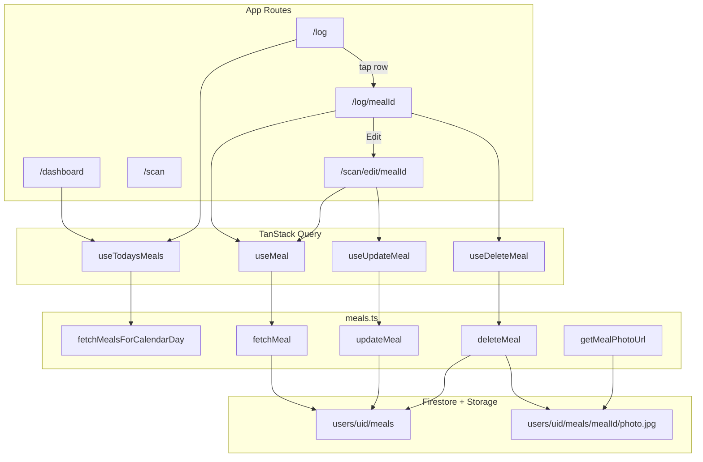
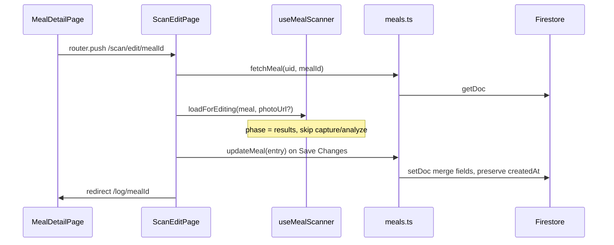

# PR W05: Meal Detail, Edit and Daily Log

## Objective

Deliver full meal lifecycle management on web: view today's meals in the Log tab, open read-only detail, edit via pre-populated scanner, delete with confirmation, share a summary card image, and complete the dashboard Daily Summary Footer. Mirrors iOS [PR-05](docs/implementation/PR-05.md) and the W05 section of [`.cursor/plans/calsnap_web_prs_4a5e9349.plan.md`](.cursor/plans/calsnap_web_prs_4a5e9349.plan.md).

**Depends on (already merged):**
- [PR-W03](docs/implementation/web/PR-W03.md) — `MealEntryDoc`, `fetchMealsForCalendarDay`, `useTodaysMeals`, `useDashboard`, `aggregateTodaysMeals`, `TodaysMealsSection`, partial `DailySummaryFooter`, bottom nav `/log` stub
- [PR-W04](docs/implementation/web/PR-W04.md) — `useMealScanner`, `editableFoodItemFromFoodItem`, `useLogMeal`, `createMeal`, `uploadMealPhoto`, scanner UI components

**Source references (port behavior, not SwiftUI):**
- [`MealRepository.swift`](CalSnap/Core/Repositories/MealRepository.swift) — `fetchMeal`, `update`, `delete`
- [`MealScannerViewModel.swift`](CalSnap/Features/MealScanner/MealScannerViewModel.swift) — `loadForEditing`, `updateMeal`, `editBaseline`, `makeMealEntry` identity preservation
- [`MealDetailView.swift`](CalSnap/Features/MealLog/MealDetailView.swift) + [`MealDetailViewModel.swift`](CalSnap/Features/MealLog/MealDetailViewModel.swift)
- [`MealListView.swift`](CalSnap/Features/MealLog/MealListView.swift) — grouped sections, swipe/context delete
- [`MealShareCardView.swift`](CalSnap/Features/MealLog/MealShareCardView.swift)
- [`DailySummaryFooterView.swift`](CalSnap/Features/Dashboard/DailySummaryFooterView.swift)
- [`CalSnapTests/MealLogCRUDTests.swift`](CalSnapTests/MealLogCRUDTests.swift)

---

## Sharpened decisions (locked — sharpen-plan 2026-06-27)

| Decision | Choice | Rationale |
|----------|--------|-----------|
| **Edit route** | [`/scan/edit/[mealId]`](calsnap-web/app/(app)/scan/edit/[mealId]/page.tsx) | Keeps create flow at `/scan` unchanged; passes `mealId` only (iOS post-review fix); middleware already covers `/scan/:path*` |
| **Edit data load** | `fetchMeal(uid, mealId)` on mount; fresh fetch before `loadForEditing` | Avoid stale meal object if edited elsewhere |
| **Edit identity** | Preserve `id`, `userId`, `timestamp`, `createdAt`; bump `updatedAt` only | iOS `updateMeal` parity; dashboard day bucket stays stable |
| **Edit photo change** | **No** — existing photo shown read-only on edit results; no re-upload in W05 | iOS edit lands on results without re-capture; smallest diff; replace photo = delete + re-log via scanner |
| **Edit photo display** | Load existing via `getDownloadURL(photoStoragePath)` for preview only | Detail + edit preview; `photoStoragePath` unchanged on save |
| **Post-edit redirect** | **`/log/[mealId]`** detail page | User confirms changes immediately; matches iOS dismiss-back-to-detail; dashboard refreshes via query invalidation in background |
| **Delete order** | **Firestore `deleteDoc` first**, then best-effort `deleteObject` | Meal doc is source of truth; UI succeeds once Firestore delete completes |
| **Delete Storage failure** | **Best-effort** — log/warn on Storage failure, do not roll back Firestore | Same orphan tolerance philosophy as W04 create; W08 delete-all cleans remaining Storage objects |
| **Delete errors** | Throw `MealNotFoundError` when doc missing | iOS `MealRepositoryError.mealNotFound` parity |
| **HealthKit** | **Omit entirely** | Web has no HealthKit; skip `MealHealthSnapshot` / reversal service |
| **Log tab scope** | **Today only** (same calendar day as dashboard) | Matches iOS dashboard embedded list; historical log deferred |
| **List row thumbnails** | **No** — icon + time + kcal on rows; photo on detail page only | Avoids N parallel `getDownloadURL` calls and list jank; detail is the photo surface |
| **Share card** | Hidden [`MealShareCard`](calsnap-web/components/meal-log/MealShareCard.tsx) + **`html2canvas`** → PNG blob | Closest to iOS `ImageRenderer`; card uses text/layout only (no cross-origin meal photo in canvas) |
| **Share delivery** | `navigator.share({ files })` when supported; else `<a download>` fallback | Mobile-first; no custom share sheet component |
| **Swipe delete** | **Action menu (⋯) on log rows + detail toolbar only** — no swipe-reveal | Master plan "swipe or context-menu" satisfied by context menu; native `swipeActions` has no reliable web equivalent without gesture libs |
| **Dashboard row delete** | **Out of scope** — tap row opens detail; delete from detail or log tab | Keeps dashboard section compact; log tab is primary delete surface |
| **Delete confirm** | `window.confirm` | Consistent with W04 discard confirm pattern |
| **Query invalidation** | Invalidate `todaysMeals(uid, dayKey)` for meal's calendar day + `meal(uid, mealId)` | Dashboard + detail refresh; use `localDayKey(meal.timestamp)` not only "today" |
| **Unsaved edit guard** | Extend W04 `UnsavedWorkProvider` to edit page; compare against `editBaseline` | iOS `InteractivePopGestureDisabler` equivalent via existing tab intercept + `beforeunload` |
| **UI styling** | Plain Tailwind (W02–W04 pattern) | Design tokens deferred to W09 |
| **Empty section CTA** | "Add Breakfast" etc. links to `/scan` (no meal-type query param v1) | iOS `onAdd` opens scanner; web v1 lands on scan capture |

---

## Architecture



**Edit flow (mirrors iOS `loadForEditing`):**



---

## Phase 1 — Repository and doc mappers

Extend [`calsnap-web/lib/repositories/meals.ts`](calsnap-web/lib/repositories/meals.ts):

| Function | Behavior |
|----------|----------|
| `fetchMeal(uid, mealId, db?)` | `getDoc`; return `MealEntry` or throw `MealNotFoundError` |
| `updateMeal(entry, existingCreatedAt, db?)` | `setDoc` with `mealEntryToUpdateDoc(entry, existingCreatedAt)` |
| `deleteMeal(uid, mealId, db?)` | `getDoc` → throw if missing → `deleteDoc` → best-effort `deleteObject` if `photoStoragePath` (Storage failure does not throw) |
| `getMealPhotoDownloadUrl(path)` | `getDownloadURL(ref(storage, path))` |

Extend [`calsnap-web/lib/models/meal-entry-doc.ts`](calsnap-web/lib/models/meal-entry-doc.ts):

- Add `mealEntryToUpdateDoc(entry, createdAt: Timestamp)` — preserves `createdAt`, sets `updatedAt: now`
- Keep `mealEntryToDoc` for **create** only (W04 unchanged)

Add [`calsnap-web/lib/repositories/meal-errors.ts`](calsnap-web/lib/repositories/meal-errors.ts):

- `MealNotFoundError` class for typed catch in UI

**Storage rules:** No change — owner read/write already scoped.

---

## Phase 2 — Query hooks and invalidation

Extend [`calsnap-web/lib/queries/query-keys.ts`](calsnap-web/lib/queries/query-keys.ts):

```typescript
meal: (uid: string, mealId: string) => ['meal', uid, mealId] as const,
```

New files:

| File | Purpose |
|------|---------|
| [`lib/queries/use-meal.ts`](calsnap-web/lib/queries/use-meal.ts) | `useMeal(uid, mealId)` — enabled when both defined |
| [`lib/queries/use-update-meal.ts`](calsnap-web/lib/queries/use-update-meal.ts) | `updateMeal` only (no photo re-upload in W05); invalidate `meal` + `todaysMeals` for `localDayKey(entry.timestamp)` |
| [`lib/queries/use-delete-meal.ts`](calsnap-web/lib/queries/use-delete-meal.ts) | `deleteMeal`; invalidate same keys; return deleted meal's dayKey for redirect |

Refactor [`lib/queries/use-log-meal.ts`](calsnap-web/lib/queries/use-log-meal.ts): extract shared `invalidateMealQueries(queryClient, uid, dayKey)` helper used by create/update/delete.

---

## Phase 3 — Scanner edit mode

Extend [`calsnap-web/lib/scanner/use-meal-scanner.ts`](calsnap-web/lib/scanner/use-meal-scanner.ts):

**New state:**
- `isEditing: boolean`
- `editingMealId: string | null`
- `editingTimestamp: Date | null`
- `existingPhotoStoragePath: string | undefined`
- `editBaseline: EditBaseline | null` (mealType, textDescription, item snapshots, totals)

**New methods:**
- `loadForEditing(meal: MealEntry, photoPreviewUrl?: string | null)` — port iOS ~347–372: set items via `editableFoodItemFromFoodItem`, `originalItemWeightsRef`, `isManualEntry = geminiConfidence === 0`, `phase = 'results'`, store baseline
- `cancelEdit()` — reset to capture (or navigate away; page handles routing)

**Modify:**
- `makeMealEntry(mealId?)` — when editing: use `editingMealId`, `editingTimestamp`, always carry `photoStoragePath: existingPhotoStoragePath` (no photo replacement in W05)
- `hasUnsavedWork` in edit mode — deep-compare against `editBaseline` (not merely `editableItems.length > 0`)
- `discard()` — clear edit fields

Update [`calsnap-web/components/scanner/MealAnalysisResultView.tsx`](calsnap-web/components/scanner/MealAnalysisResultView.tsx):

| Prop | Create | Edit (`isEditing`) |
|------|--------|---------------------|
| Primary CTA | "Log this meal" | "Save changes" |
| Secondary | "Re-analyze" | **hidden** |
| Tertiary | "Discard" | "Cancel" (confirm discard edits) |

New page [`app/(app)/scan/edit/[mealId]/page.tsx`](calsnap-web/app/(app)/scan/edit/[mealId]/page.tsx):

1. `useMeal(uid, mealId)` + photo URL fetch in `useEffect`
2. On success → `scanner.loadForEditing(meal, photoUrl)`
3. Wire `useUpdateMeal`; on save → `mutateAsync({ entry, existingCreatedAt })` (no photo blob) → discard → **`router.push('/log/[mealId]')`**
4. Reuse `UnsavedWorkProvider` intercept (same as W04 scan page)
5. Loading/error states: skeleton while fetching; `not found` → link back to `/log`

**Edit guard:** Throw if `updateMeal` called when `!isEditing` (unit test parity with iOS `notInEditMode`).

---

## Phase 4 — Meal detail page

New route [`app/(app)/log/[mealId]/page.tsx`](calsnap-web/app/(app)/log/[mealId]/page.tsx) — client component.

New components under [`components/meal-log/`](calsnap-web/components/meal-log/):

| Component | Purpose |
|-----------|---------|
| `MealDetailView.tsx` | Read-only layout: photo, meal type, timestamp, calorie total, macro summary, read-only item list, estimation notes + confidence badge |
| `MealDetailActions.tsx` | Toolbar: Edit → `/scan/edit/[mealId]`, Share, Delete |
| `MealShareCard.tsx` | 320px card matching iOS layout (meal type, brand "CalSnap", large kcal, P/C/F grams, timestamp) |
| `useMealShareImage.ts` | `html2canvas(cardRef)` → `Blob`; Web Share API or download; card is text-only (no meal photo) to avoid CORS canvas taint |

**Detail behaviors (iOS parity):**
- Photo: load from Storage URL; show placeholder if none
- Items: reuse [`FoodItemRow`](calsnap-web/components/scanner/FoodItemRow.tsx) with **optional `onEdit`** (read-only when omitted) — add `readOnly` variant or make `onEdit` optional
- Delete: confirm → `useDeleteMeal` → `router.replace('/log')` or `/dashboard`
- After returning from edit: TanStack Query refetch via invalidation (no manual reload token needed on web)

---

## Phase 5 — Log tab and dashboard meal list

Extract shared list from [`TodaysMealsSection`](calsnap-web/components/dashboard/TodaysMealsSection.tsx):

| File | Purpose |
|------|---------|
| `components/meal-log/MealListSection.tsx` | Four `MealType` sections, empty "Add [type]" CTA → `/scan`, meal rows |
| `components/meal-log/MealLogRow.tsx` | Row: meal-type icon, time, kcal; `Link` to `/log/[id]`; **⋯ action menu** (View/Edit/Delete) — no thumbnail |

Replace [`app/(app)/log/page.tsx`](calsnap-web/app/(app)/log/page.tsx) stub:

- Header "Today's Log" + date
- `useTodaysMeals(uid)` (same hook as dashboard)
- Render `MealListSection` with delete handler + confirm
- Empty global state when no meals today

Update `TodaysMealsSection`:

- Refactor to use `MealLogRow` (compact, no action menu required) OR wrap rows in `Link`
- Tap row → `/log/[mealId]`

**Delete entry points (acceptance):**
1. Log tab row **⋯ menu** → confirm → delete
2. Meal detail toolbar → confirm → delete → redirect `/log`

No swipe-reveal or dashboard-row delete in W05.

---

## Phase 6 — Complete DailySummaryFooter

Extend [`lib/queries/use-dashboard.ts`](calsnap-web/lib/queries/use-dashboard.ts) to expose:

- `netCalorieDelta` (already in [`calorie-progress.ts`](calsnap-web/lib/dashboard/calorie-progress.ts))
- `actualMacroPercents` via `macroPercents(proteinConsumed, carbsConsumed, fatConsumed)` from [`calculator.ts`](calsnap-web/lib/nutrition/calculator.ts)
- `targetMacroPercents` — round profile fractions × 100 (28/47/25)
- Pass existing `fiberBand` to footer (already computed, unused in UI)

Rewrite [`components/dashboard/DailySummaryFooter.tsx`](calsnap-web/components/dashboard/DailySummaryFooter.tsx) to match iOS [`DailySummaryFooterView`](CalSnap/Features/Dashboard/DailySummaryFooterView.swift):

1. **Section title** — "Daily summary"
2. **Fiber row** — `{consumed}g / {target}g` with color by `fiberBand` (`onTrack` green, `moderate` amber, `low` red)
3. **Net calories row** — summary text + color (over = red, under = green, on target = neutral) + optional icon
4. **Macro split caption** — `"Actual P/C/F: {aP}/{aC}/{aF}% · Target: {tP}/{tC}/{tF}%"` (English literals; W09 copy module later)
5. **Accessibility** — `aria-label` on fiber and macro rows

Update [`app/(app)/dashboard/page.tsx`](calsnap-web/app/(app)/dashboard/page.tsx) props accordingly.

---

## Phase 7 — Tests

### Unit (merge gate)

New [`tests/unit/meal-log-crud.test.ts`](calsnap-web/tests/unit/meal-log-crud.test.ts):

| Test | Verifies |
|------|----------|
| `testMealDeletion` | Remove meal from array → `aggregateTodaysMeals` calories/fiber decrease |
| `testMealEdit` | Double item weight in mock meal → totals update; `id`/`timestamp` unchanged in update mapper |
| `testMealEntryToUpdateDocPreservesCreatedAt` | `createdAt` unchanged, `updatedAt` bumped |
| `testUpdateMealRequiresEditMode` | Scanner hook throws/guards when not editing (if exposed as pure helper) |

Extend [`tests/unit/dashboard-aggregation.test.ts`](calsnap-web/tests/unit/dashboard-aggregation.test.ts):

| Test | Verifies |
|------|----------|
| `testFiberTargetFromCalorieTarget` | 2000 kcal → 28g fiber (may already exist — verify) |
| `testFiberProgressBandThresholds` | 90% / 70% thresholds |
| `testNetCalorieSummary` | "+300 over goal" copy |
| `testMacroSplitFormatting` | Pure helper for footer macro split string |

New [`tests/unit/meal-share-card.test.ts`](calsnap-web/tests/unit/meal-share-card.test.ts) (optional, light):

- Macro label formatting on share card props

### Integration (optional)

[`tests/integration/meal-crud-firestore.test.ts`](calsnap-web/tests/integration/meal-crud-firestore.test.ts):

- Create → fetch → update → delete round-trip in emulator
- Rules: owner can delete own meal

### Merge gate

```bash
cd calsnap-web && pnpm install && pnpm test && pnpm lint && pnpm build
```

---

## Files summary

### Created

| Path | Purpose |
|------|---------|
| `lib/repositories/meal-errors.ts` | Typed not-found error |
| `lib/queries/use-meal.ts` | Single-meal query |
| `lib/queries/use-update-meal.ts` | Update mutation |
| `lib/queries/use-delete-meal.ts` | Delete mutation |
| `lib/queries/invalidate-meals.ts` | Shared invalidation helper |
| `components/meal-log/MealListSection.tsx` | Grouped log list |
| `components/meal-log/MealLogRow.tsx` | Row with link + actions |
| `components/meal-log/MealDetailView.tsx` | Read-only detail body |
| `components/meal-log/MealDetailActions.tsx` | Edit/Share/Delete toolbar |
| `components/meal-log/MealShareCard.tsx` | Share card layout |
| `components/meal-log/use-meal-share-image.ts` | html2canvas + share/download |
| `app/(app)/log/[mealId]/page.tsx` | Detail route |
| `app/(app)/scan/edit/[mealId]/page.tsx` | Edit scanner route |
| `tests/unit/meal-log-crud.test.ts` | CRUD + aggregate tests |
| `tests/integration/meal-crud-firestore.test.ts` | Optional emulator test |
| `docs/implementation/web/PR-W05.md` | Merge doc |

### Modified

| Path | Change |
|------|--------|
| `lib/models/meal-entry-doc.ts` | `mealEntryToUpdateDoc` |
| `lib/repositories/meals.ts` | fetch/update/delete/photo URL |
| `lib/scanner/use-meal-scanner.ts` | Edit mode |
| `components/scanner/MealAnalysisResultView.tsx` | `isEditing` UI |
| `components/scanner/FoodItemRow.tsx` | Optional read-only mode |
| `components/dashboard/TodaysMealsSection.tsx` | Link rows to detail |
| `components/dashboard/DailySummaryFooter.tsx` | Full footer |
| `lib/queries/use-dashboard.ts` | Macro percents + delta |
| `lib/queries/use-log-meal.ts` | Shared invalidation |
| `app/(app)/log/page.tsx` | Full log tab |
| `app/(app)/dashboard/page.tsx` | Footer props |
| `package.json` | `html2canvas` dependency |
| `docs/implementation/web/README.md` | W05 status |

---

## Web deltas vs iOS PR-05

| Area | iOS | Web W05 |
|------|-----|---------|
| Delete side effects | SwiftData + HK reversal | Firestore + Storage delete only |
| Share | `ImageRenderer` + `ShareSheet` | `html2canvas` + Web Share API / download |
| Navigation | `NavigationStack` + `DashboardRoute` | Next.js routes `/log/[id]`, `/scan/edit/[id]` |
| Dashboard refresh | `reloadDashboard()` + reload token | TanStack Query invalidation |
| Swipe delete | Native `swipeActions` | ⋯ action menu on log rows (no swipe-reveal) |
| List thumbnails | Photo thumbnail in row | Icon only; photo on detail page |
| Edit photo | Can replace via new capture | Read-only preview; no replacement in W05 |
| Delete partial failure | HK reversal always attempted | Firestore first; Storage best-effort |
| Photo model | `photoData` bytes | `photoStoragePath` + `getDownloadURL` |
| Meal list on dashboard | Embedded non-scrolling `List` | Link-wrapped rows in scrollable page (W09 may refine) |
| Copy | String catalog keys | English literals until W09 |

---

## Out of scope

- Historical log (multi-day browse), date picker on Log tab
- Edit photo replacement / re-upload
- Swipe-reveal delete gestures
- Dashboard row delete (detail + log menu only)
- List row photo thumbnails
- USDA lookup, re-analyze on edit
- HealthKit snapshot / reversal services
- shadcn, design tokens, copy module (W09)
- Rate limiting, AbortController (W10)
- Account-wide Storage cleanup beyond per-meal delete (W08 delete-all)

---

## Acceptance criteria

| Criterion | Satisfied by |
|-----------|--------------|
| CRUD end-to-end on Firestore | fetch/update/delete repo + hooks |
| Dashboard totals update after edit/delete | Query invalidation on meal's calendar day |
| Log tab grouped by meal type with empty states | `MealListSection` on `/log` |
| Meal detail shows photo, items, macros, notes | `MealDetailView` |
| Edit reopens scanner at results with pre-populated items | `loadForEditing` + `/scan/edit/[mealId]` |
| Edit preserves id and timestamp | `makeMealEntry` + update mapper |
| Delete confirms before removing | Confirm on all delete paths |
| Share generates summary card image | `MealShareCard` + html2canvas |
| DailySummaryFooter shows fiber (colored), net kcal (colored), macro split | Footer + `useDashboard` props |
| Mobile delete affordance | ⋯ action menu on log rows + detail delete |
| Post-edit navigation | Lands on `/log/[mealId]` detail |
| Delete survives Storage failure | Firestore delete succeeds; orphan photo acceptable until W08 |
| `pnpm test && pnpm build` green | Unit tests + merge gate |

---

## Manual test plan

1. Emulators + `pnpm dev`; complete onboarding; log 2–3 meals via `/scan` (W04)
2. **Dashboard:** tap meal row → detail; verify ring totals match
3. **Log tab:** four sections populated; empty sections show "Add …" → `/scan`
4. **Detail:** photo loads from Storage; items read-only; estimation notes on scanned meals
5. **Edit:** Edit → `/scan/edit/[id]` lands on results with read-only photo preview; change weight → Save → **redirects to `/log/[id]` detail**; dashboard ring updates; id/timestamp unchanged in Firestore Emulator UI; no "Change photo" control present
6. **Delete:** from detail and log menu → confirm → meal gone; dashboard ring decreases; Storage object removed if photo existed
7. **Share:** Share on detail → image shared or downloaded; shows meal type, kcal, macros, timestamp
8. **Footer:** fiber color shifts at band thresholds; net kcal red/green; macro split line matches consumed vs profile targets
9. **Guards:** edit page tab switch with unsaved changes → confirm; Cancel on edit discards
10. **320px:** log list, detail toolbar, footer readable; touch targets ≥ 44px on action buttons

---

## Pull request

**Title:** PR W05: Meal detail, edit and daily log

**Summary**

- Adds meal fetch/update/delete repository methods, TanStack Query hooks, expanded `/log` tab, `/log/[mealId]` detail with share card, `/scan/edit/[mealId]` pre-populated edit flow, dashboard meal navigation, and complete DailySummaryFooter.

**Test plan:** merge gate commands above + manual CRUD/share/footer checklist.
