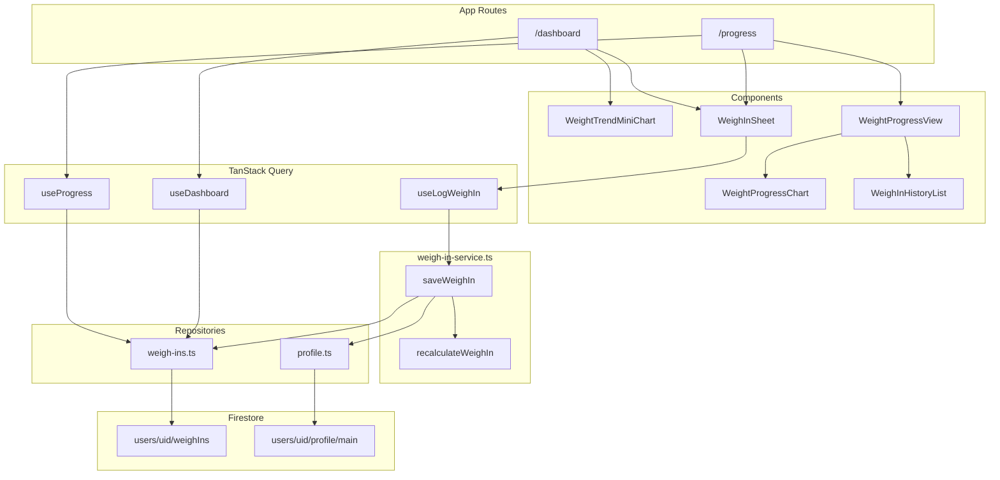

# PR W06: Weight Logging and Progress

## Objective

Deliver weekly weigh-in UX, dynamic TDEE/target recalculation on save, the full Progress tab with projected weight chart, and dashboard integration. Mirrors iOS [PR-06](docs/implementation/PR-06.md) and the W06 section of [`.cursor/plans/calsnap_web_prs_4a5e9349.plan.md`](.cursor/plans/calsnap_web_prs_4a5e9349.plan.md).

**Depends on (already implemented):**

- [PR-W01](docs/implementation/web/PR-W01.md) — `NutritionCalculator` (`weightProjection`, `isOnPlateau`, `weeklyLossRateKg`, `projectedGoalDate`, `projectionPoints`), `WeighIn` type, `AppConstants.Plateau` / `WeightProjection`
- [PR-W02](docs/implementation/web/PR-W02.md) — `ProfileDoc` with `currentWeightKg`, `tdee`, `dailyCalorieTarget`, `deficitKcal`, `useLbsForWeight`; [`profile.ts`](calsnap-web/lib/repositories/profile.ts) read/write
- [PR-W03](docs/implementation/web/PR-W03.md) — read-only [`weigh-ins.ts`](calsnap-web/lib/repositories/weigh-ins.ts), [`useRecentWeighIns`](calsnap-web/lib/queries/use-recent-weigh-ins.ts), [`WeightTrendMiniChart`](calsnap-web/components/dashboard/WeightTrendMiniChart.tsx), [`PlateauAlertSheet`](calsnap-web/components/dashboard/PlateauAlertSheet.tsx), plateau logic in [`plateau-state.ts`](calsnap-web/lib/dashboard/plateau-state.ts), `/progress` stub
- [PR-W05](docs/implementation/web/PR-W05.md) — TanStack mutation + [`invalidate-meals.ts`](calsnap-web/lib/queries/invalidate-meals.ts) pattern; bottom-sheet modal pattern in [`FoodItemEditSheet`](calsnap-web/components/scanner/FoodItemEditSheet.tsx)

**Source references (port behavior, not SwiftUI):**

- [`WeighInService.swift`](CalSnap/Core/Services/WeighInService.swift) — sole save/recalc pipeline
- [`WeighInViewModel.swift`](CalSnap/Features/Progress/WeighInViewModel.swift) — draft state, unit conversion, live preview
- [`WeightProgressViewModel.swift`](CalSnap/Features/Progress/WeightProgressViewModel.swift) — stats/chart derivations
- [`WeightProgressView.swift`](CalSnap/Features/Progress/WeightProgressView.swift) — screen layout
- [`WeighInTests.swift`](CalSnapTests/WeighInTests.swift) — test cases to port (minus notification/HealthKit)

---

## Sharpened decisions (locked — sharpen-plan 2026-06-27)

| Decision | Choice | Rationale |
|----------|--------|-----------|
| **Save atomicity** | Firestore `writeBatch`: weigh-in doc + profile update in one commit | Matches iOS single-context save; first batch write in web codebase |
| **Weigh-in ID** | `crypto.randomUUID()` | Same as meal create in W04 |
| **Service layer** | [`lib/services/weigh-in-service.ts`](calsnap-web/lib/services/weigh-in-service.ts) — `recalculateWeighIn`, `saveWeighIn` | iOS `WeighInService` parity; views/hooks call service only |
| **Recalc rule** | Preserve `deficitKcal`; recompute TDEE + daily target from new weight via existing `bmr` → `tdee` → `dailyTarget` | iOS PR6 spec extension §7.1 |
| **Profile fields updated on save** | `currentWeightKg`, `tdee`, `dailyCalorieTarget`, `deficitKcal` (if floor adjusts), `updatedAt` | [`WeighInService.save`](CalSnap/Core/Services/WeighInService.swift) lines 52–57 + web `ProfileDoc.currentWeightKg` |
| **Weigh-in snapshot fields** | `calculatedTDEE`, `adjustedDailyTarget`, `bmi` on `WeighInDoc` | Already in [`weigh-in-doc.ts`](calsnap-web/lib/models/weigh-in-doc.ts) |
| **`source` field** | Add optional `source: 'manual'` on `WeighInDoc` | [README web delta](docs/implementation/web/README.md); omit HealthKit flag |
| **Chart library** | **Recharts** (`recharts`) | Master plan W06; dashed projection + goal `ReferenceLine` are straightforward; dashboard mini-chart stays inline SVG |
| **Progress derivations** | Pure functions in [`lib/progress/progress-stats.ts`](calsnap-web/lib/progress/progress-stats.ts) | Testable port of `WeightProgressViewModel` computed properties |
| **All weigh-ins query** | `fetchAllWeighIns(uid)` — `orderBy('date', 'desc')`, no pagination limit | Weekly cadence → small collection; iOS `fetchAll` parity |
| **Query keys** | Add `queryKeys.allWeighIns(uid)` alongside existing window key | Progress page needs full history; dashboard keeps 7-day window |
| **Invalidation helper** | [`invalidate-weigh-ins.ts`](calsnap-web/lib/queries/invalidate-weigh-ins.ts) — invalidate `profile`, `weighIns` window, `allWeighIns` | Mirrors W05 `invalidateMealQueries`; also invalidates profile so ring target updates |
| **Weigh-in sheet UI** | Bottom sheet (same pattern as [`PlateauAlertSheet`](calsnap-web/components/dashboard/PlateauAlertSheet.tsx)) | No shadcn until W09 |
| **Sheet entry points** | Dashboard mini-chart tap + "Log weigh-in" button; Progress page header CTA + empty chart CTA | iOS dual entry; sheet state lifted in each page (no global provider) |
| **Unit toggle in sheet** | Local state only; `setUseLbs` converts displayed value (port `WeighInViewModel.setUseLbs`) | Does not persist `useLbsForWeight` — W08 Settings owns unit pref |
| **Initial weight in sheet** | `profile.extras.currentWeightKg` (maintained on save) | Web stores current weight on profile doc (unlike iOS latest-weigh-in-only) |
| **Date picker** | Default today; allow past dates for backfill; **reject future dates** on save | Prevents invalid entries |
| **Date storage** | **Normalize to `startOfLocalDay(date)`** before write | Matches [`date-window.ts`](calsnap-web/lib/dashboard/date-window.ts) meal pattern; predictable range queries |
| **Duplicate same-day entries** | **Allow append-only** — no duplicate-day rejection | iOS allows multiple; history is a log; latest-by-date drives `currentWeightKg` + chart |
| **Current weight after save** | Always set `currentWeightKg` to saved entry's weight (even if backdated) | Profile field reflects most recent save action; chart/stats use `max(by: date)` for display |
| **Weight validation** | `weightKg > 0` and within [`WEIGHT_RANGE_KG`](calsnap-web/lib/utilities/unit-formatters.ts) | iOS `canSave` guard |
| **"Remind me tomorrow"** | `localStorage` snooze key per uid (`weighInSnoozeUntil-{uid}`); **no save** | Web has no `NotificationManager` in W06; W10 in-app overdue banner reads same key |
| **Post-save plateau** | Invalidate queries; **shared `usePlateauAlert` hook** re-evaluates `shouldShowPlateauAlert` on refetch | No special-case `didTriggerPlateau` UI branch; single code path |
| **Plateau alert surface** | **`PlateauAlertSheet` on dashboard AND progress pages** via shared hook | User saving from `/progress` must see plateau alert without visiting dashboard |
| **Reminder prefs on profile** | Optional `ProfileDoc` fields; **`resolveReminderPrefs(doc)` read-time defaults** from [`AppConstants.Notifications`](calsnap-web/lib/constants.ts) | No migration write until W08 user edits; avoids side effects on read |
| **Mini chart tap targets** | **Split:** card body/chart → `/progress`; "Log weigh-in" button `stopPropagation` → opens sheet only | Prevents accidental navigation when logging |
| **Post-save navigation** | Stay on current tab; close sheet; queries refresh in place | Progress chart updates via invalidation; no redirect to dashboard |
| **HealthKit** | **Omit entirely** | Web delta across all PRs |
| **Dual-user** | **N/A** — web is single-user per Firebase account | Simplifies snooze/reminder keys |
| **Analytics embed** | **Out of scope** — W07 embeds weight progress | Keep progress components reusable but no `/analytics` route |

---

## Architecture



**Save pipeline (`saveWeighIn`):**

1. Validate weight + date (not future)
2. Normalize date → `startOfLocalDay(date)` via [`date-window.ts`](calsnap-web/lib/dashboard/date-window.ts)
3. `recalculateWeighIn(profile, newWeightKg)` → `{ tdee, dailyTarget, deficitKcal, bmi }`
4. Build `WeighIn` entry with snapshot fields + `source: 'manual'`
5. `writeBatch`: `set` weigh-in doc + `set` profile doc with updated targets and `currentWeightKg`
6. `fetchWeeklyPlateauWeighIns` → `isOnPlateau` → return `{ weighIn, didTriggerPlateau }`
7. Mutation `onSuccess` → `invalidateWeighInQueries` (profile + weigh-in queries)

---

## Implementation layers

### Layer 1 — Service + repository (business logic)

**Create [`lib/services/weigh-in-service.ts`](calsnap-web/lib/services/weigh-in-service.ts)**

```typescript
export interface WeighInRecalculation {
  tdee: number;
  dailyTarget: number;
  deficitKcal: number;
  bmi: number;
}

export interface SaveWeighInInput {
  uid: string;
  profile: UserProfile;
  profileExtras: ProfileExtras; // currentWeightKg, unit prefs, onboarding flag
  newWeightKg: number;
  date: Date;
}

export interface SaveWeighInResult {
  weighIn: WeighIn;
  updatedProfile: UserProfile;
  didTriggerPlateau: boolean;
}

export function recalculateWeighIn(profile: UserProfile, newWeightKg: number): WeighInRecalculation
export async function saveWeighIn(input: SaveWeighInInput, deps?: { db }): Promise<SaveWeighInResult>
```

Port logic from [`WeighInService.swift`](CalSnap/Core/Services/WeighInService.swift) using existing [`calculator.ts`](calsnap-web/lib/nutrition/calculator.ts) helpers.

**Extend [`lib/repositories/weigh-ins.ts`](calsnap-web/lib/repositories/weigh-ins.ts)**

- `fetchAllWeighIns(uid, sortDescending = true)` — full history for progress page
- `createWeighIn(uid, entry)` — single doc write (called inside batch from service, or service owns batch directly)

**Extend [`lib/repositories/profile.ts`](calsnap-web/lib/repositories/profile.ts)**

- `updateProfileAfterWeighIn(uid, profile, extras, recalc)` — builds updated `UserProfile` + `ProfileExtras` with new `currentWeightKg`, targets, `updatedAt`
- Used inside `writeBatch` in service (keep repo function pure for testability)

**Extend [`lib/models/weigh-in-doc.ts`](calsnap-web/lib/models/weigh-in-doc.ts)**

- Optional `source?: 'manual'` on doc + mapper

**Extend [`lib/models/profile-doc.ts`](calsnap-web/lib/models/profile-doc.ts)**

- Reminder pref fields (optional on read; **not written until W08 user edit**):

```typescript
weighInReminderEnabled?: boolean;      // default true via resolveReminderPrefs()
weighInReminderWeekday?: number;       // default AppConstants.Notifications.defaultReminderWeekday (Sunday=1)
weighInReminderHour?: number;        // default 8
weighInReminderMinute?: number;      // default 0
```

**Create [`lib/progress/reminder-prefs.ts`](calsnap-web/lib/progress/reminder-prefs.ts)**

- `resolveReminderPrefs(doc: ProfileDoc)` — merges missing fields from `AppConstants.Notifications` at read time; no Firestore write

Update `makeProfileFromDraft` to include defaults on **new** profiles only; existing profiles rely on `resolveReminderPrefs`.

---

### Layer 2 — Pure progress stats (testable)

**Create [`lib/progress/progress-stats.ts`](calsnap-web/lib/progress/progress-stats.ts)**

Port [`WeightProgressViewModel`](CalSnap/Features/Progress/WeightProgressViewModel.swift) derivations:

| Function | iOS equivalent |
|----------|----------------|
| `currentWeightKg(weighIns, startingWeightKg)` | `currentWeightKg` |
| `lostSoFarKg(...)` | `lostSoFarKg` |
| `toGoalKg(...)` | `toGoalKg` |
| `progressFraction(...)` | `progressFraction` |
| `deriveProgressStats(profile, weighIns)` | bundles rate, projected date, projection points, chart series |

Use existing calculator exports: `weeklyLossRateKg`, `projectedGoalDate`, `projectionPoints`, `ageFromDateOfBirth`.

**Create [`lib/progress/weigh-in-snooze.ts`](calsnap-web/lib/progress/weigh-in-snooze.ts)**

- `weighInSnoozeKey(uid)`, `snoozeWeighInUntilTomorrow(uid)`, `isWeighInSnoozed(uid, now)` — mirrors plateau snooze pattern in [`plateau-state.ts`](calsnap-web/lib/dashboard/plateau-state.ts)

---

### Layer 3 — TanStack Query hooks

**Extend [`lib/queries/query-keys.ts`](calsnap-web/lib/queries/query-keys.ts)**

```typescript
allWeighIns: (uid: string) => ['allWeighIns', uid] as const,
```

**Create [`lib/queries/invalidate-weigh-ins.ts`](calsnap-web/lib/queries/invalidate-weigh-ins.ts)**

```typescript
export function invalidateWeighInQueries(
  queryClient: QueryClient,
  uid: string,
  windowKey?: string, // today's dashboard window; pass localDayKey(now)
): void
```

Invalidates: `profile(uid)`, `weighIns(uid, windowKey)` if provided, `allWeighIns(uid)`.

**Create [`lib/queries/use-all-weigh-ins.ts`](calsnap-web/lib/queries/use-all-weigh-ins.ts)** — fetches full history

**Create [`lib/queries/use-progress.ts`](calsnap-web/lib/queries/use-progress.ts)** — composes `useProfile` + `useAllWeighIns` + `deriveProgressStats`; exposes formatted strings via `formatWeight` / rate formatters

**Create [`lib/queries/use-log-weigh-in.ts`](calsnap-web/lib/queries/use-log-weigh-in.ts)** — mutation wrapping `saveWeighIn`; `onSuccess` calls `invalidateWeighInQueries`

**Create [`lib/queries/use-plateau-alert.ts`](calsnap-web/lib/queries/use-plateau-alert.ts)** — extract plateau logic from [`use-dashboard.ts`](calsnap-web/lib/queries/use-dashboard.ts): `showPlateauAlert`, `applyDietBreak`, `applySmallReduction`, `dismissPlateauAlert`; shared by dashboard + progress pages

**Create [`lib/progress/use-weigh-in-form.ts`](calsnap-web/lib/progress/use-weigh-in-form.ts)** — client hook porting `WeighInViewModel`: weight input, `useLbs` toggle with conversion, date, live preview via `recalculateWeighIn`, `canSave`, error state

---

### Layer 4 — UI components

**Create [`components/progress/WeighInSheet.tsx`](calsnap-web/components/progress/WeighInSheet.tsx)**

Bottom sheet form:

- Large weight number input + unit segmented control
- Date input (`<input type="date">`, max = today)
- TDEE/target preview: "Your target adjusts from {old} to {new} kcal/day"
- Save (disabled when invalid/saving) + "Remind me tomorrow" (snooze + dismiss, no save)
- `role="dialog"`, `aria-modal`, focus trap minimal (match existing sheets)
- Props: `open`, `profile`, `profileExtras`, `onClose`, `onSaved(result)`, `uid`

**Create [`components/progress/WeightProgressHeader.tsx`](calsnap-web/components/progress/WeightProgressHeader.tsx)** — current / start / goal weights

**Create [`components/progress/WeightProgressBar.tsx`](calsnap-web/components/progress/WeightProgressBar.tsx)** — start → current → goal bar with `aria-valuenow`

**Create [`components/progress/WeightProgressChart.tsx`](calsnap-web/components/progress/WeightProgressChart.tsx)**

Recharts `LineChart`:

- **Actual:** solid line + dots from weigh-ins (ascending by date); single point → dot only
- **Projection:** dashed line from `projectionPoints` (display in user's unit via `displayWeight`)
- **Goal:** horizontal `ReferenceLine` at `goalWeightKg`
- Empty state: "Log your first weigh-in" button → opens sheet
- `role="img"` + descriptive `aria-label` summarizing trend (port iOS accessibility intent)

**Create [`components/progress/WeightProgressStatsGrid.tsx`](calsnap-web/components/progress/WeightProgressStatsGrid.tsx)** — 2×2 grid: lost so far, to goal, weekly rate, projected goal date

**Create [`components/progress/WeighInHistoryList.tsx`](calsnap-web/components/progress/WeighInHistoryList.tsx)** — sorted newest first; date + weight + optional BMI/TDEE snapshot

**Create [`components/progress/WeightProgressView.tsx`](calsnap-web/components/progress/WeightProgressView.tsx)** — composes above; "Log weigh-in" header button; loading skeletons

**Modify [`components/dashboard/WeightTrendMiniChart.tsx`](calsnap-web/components/dashboard/WeightTrendMiniChart.tsx)**

- Header row: title + "Log weigh-in" button (`onLogWeighIn`, `e.stopPropagation()`)
- Card body wrapped in `Link` to `/progress` (chart area + empty-state text)
- Empty state: separate "Log your first weigh-in" button also calls `onLogWeighIn` (does not navigate)
- New props: `onLogWeighIn?: () => void`

**Modify [`app/(app)/dashboard/page.tsx`](calsnap-web/app/(app)/dashboard/page.tsx)**

- Local `showWeighInSheet` state
- Pass `onLogWeighIn` to mini chart
- Render `WeighInSheet`; on save success close sheet, stay on dashboard
- Refactor to `usePlateauAlert` hook for `PlateauAlertSheet`

**Replace [`app/(app)/progress/page.tsx`](calsnap-web/app/(app)/progress/page.tsx)**

- Wire `WeightProgressView` + `WeighInSheet` + `PlateauAlertSheet` via `usePlateauAlert`
- On save: close sheet, stay on progress; chart refreshes via query invalidation
- Plateau alert appears on progress tab when conditions met after refetch

---

### Layer 5 — Dependencies

**Add to [`package.json`](calsnap-web/package.json):**

```json
"recharts": "^2.x"
```

Recharts 2.x works with React 19; verify peer deps at install time.

---

## Files summary

### Created (~18 files)

| Path | Purpose |
|------|---------|
| `lib/services/weigh-in-service.ts` | Recalc + batch save + plateau detection |
| `lib/progress/progress-stats.ts` | Pure stats/chart derivations |
| `lib/progress/weigh-in-snooze.ts` | localStorage snooze for "Remind me tomorrow" |
| `lib/progress/reminder-prefs.ts` | Read-time defaults for reminder fields |
| `lib/progress/use-weigh-in-form.ts` | Weigh-in sheet form state |
| `lib/queries/invalidate-weigh-ins.ts` | Shared cache invalidation |
| `lib/queries/use-plateau-alert.ts` | Shared plateau hook for dashboard + progress |
| `lib/queries/use-all-weigh-ins.ts` | Full history query |
| `lib/queries/use-progress.ts` | Progress page data hook |
| `lib/queries/use-log-weigh-in.ts` | Save mutation |
| `components/progress/WeighInSheet.tsx` | Weigh-in bottom sheet |
| `components/progress/WeightProgressView.tsx` | Full progress screen |
| `components/progress/WeightProgressHeader.tsx` | Header stats |
| `components/progress/WeightProgressBar.tsx` | Progress bar |
| `components/progress/WeightProgressChart.tsx` | Recharts chart |
| `components/progress/WeightProgressStatsGrid.tsx` | Stats grid |
| `components/progress/WeighInHistoryList.tsx` | History list |
| `tests/unit/weigh-in-service.test.ts` | Recalc + plateau on save |
| `tests/unit/progress-stats.test.ts` | Stats + projection derivations |
| `tests/integration/weigh-in-firestore.test.ts` | Optional emulator batch save |

### Modified (~8 files)

| Path | Change |
|------|--------|
| `lib/repositories/weigh-ins.ts` | `fetchAllWeighIns`, batch create helper |
| `lib/repositories/profile.ts` | `updateProfileAfterWeighIn`, reminder defaults |
| `lib/models/weigh-in-doc.ts` | Optional `source: 'manual'` |
| `lib/models/profile-doc.ts` | Reminder pref fields |
| `lib/queries/query-keys.ts` | `allWeighIns` key |
| `lib/queries/use-dashboard.ts` | Delegate plateau logic to `usePlateauAlert` |
| `components/dashboard/WeightTrendMiniChart.tsx` | Split tap: body → progress, log button → sheet |
| `app/(app)/dashboard/page.tsx` | Weigh-in sheet wiring |
| `app/(app)/progress/page.tsx` | Replace stub with full view |
| `package.json` / `pnpm-lock.yaml` | `recharts` |

### Documentation

| Path | Purpose |
|------|---------|
| `docs/implementation/web/PR-W06.md` | Merge checklist (mirror W05 format) |
| `docs/implementation/web/README.md` | Mark W06 implemented |

---

## Tests

### Unit (merge gate) — [`tests/unit/weigh-in-service.test.ts`](calsnap-web/tests/unit/weigh-in-service.test.ts)

Port iOS range/state assertions (no exact calendar dates):

| Test | Verifies |
|------|----------|
| `recalculateWeighIn lowers TDEE and target when weight drops` | 80→78 kg; deficit preserved |
| `recalculateWeighIn snapshot BMI in plausible range` | BMI ∈ 24–25 for test profile |
| `saveWeighIn returns didTriggerPlateau for 3 weekly flat weigh-ins` | After seeding 2 prior + save 3rd |
| `setUseLbs converts weight without changing kg value` | Form hook or pure conversion test |
| `weeklyLossRateKg from two weigh-ins 7 days apart` | ~1 kg/week |
| `projectionPoints reaches goal weight` | Last point ≤ goalWeightKg |
| `projectedGoalDate is future and weeks ∈ 14–30` | For standard test profile |
| `progressFraction clamps 0–1` | Edge cases at start/at goal |

### Unit — [`tests/unit/progress-stats.test.ts`](calsnap-web/tests/unit/progress-stats.test.ts)

- `currentWeightKg` falls back to `startingWeightKg`
- `lostSoFarKg` / `toGoalKg` non-negative
- History sort order helper (newest first)

### Integration (optional)

[`tests/integration/weigh-in-firestore.test.ts`](calsnap-web/tests/integration/weigh-in-firestore.test.ts): emulator batch write → profile `currentWeightKg` + weigh-in doc readable; TDEE changed.

### Merge gate

```bash
cd calsnap-web && pnpm install && pnpm test && pnpm lint && pnpm build
```

---

## Manual test plan

1. Emulators + `pnpm dev`; complete onboarding (note starting weight and target)
2. **Dashboard:** tap weight mini-chart → navigates to `/progress`
3. **Dashboard:** tap "Log weigh-in" → sheet opens with current weight prefilled in user's unit
4. Enter new weight → preview shows TDEE/target change before save
5. Toggle lbs/kg → displayed number converts; saved kg value consistent
6. Save → sheet closes → dashboard ring **target** updates without full page reload
7. **Progress:** chart shows actual line; with ≥2 weigh-ins dashed projection + goal line appear
8. Stats grid: lost/to goal/rate/projected date populate sensibly
9. History list: newest first; shows saved entries
10. Log 3 weekly flat weigh-ins from **Progress tab** → plateau sheet appears on progress (not only dashboard)
11. "Remind me tomorrow" → no Firestore write; sheet closes
12. Backdate a weigh-in → stored at start of that local day; duplicate same-day entry allowed
13. Resize to 320px → sheet + chart usable; touch targets ≥44px on primary actions

---

## Web deltas vs iOS PR-06

| Area | iOS | Web W06 |
|------|-----|---------|
| Persistence | SwiftData + same `ModelContext` | Firestore `writeBatch` (weigh-in + profile) |
| HealthKit body mass | Fire-and-forget write | **Omitted** |
| Notifications | `NotificationManager` schedule/snooze/tap | **Snooze in localStorage only**; reminder prefs on profile; delivery in W10 |
| Current weight source | Latest weigh-in or `startingWeightKg` | `ProfileDoc.currentWeightKg` synced on every save |
| Chart | Swift Charts | Recharts |
| Mini chart navigation | `NavigationStack` push | Next.js `Link` to `/progress` |
| Dual-user reminders | Per-profile scheduling | N/A (single Firebase user) |
| Unit pref persistence | Locale until PR8 | Profile `useLbsForWeight` from onboarding; sheet toggle is session-local |

---

## Acceptance criteria

| Criterion | Satisfied by |
|-----------|--------------|
| Weigh-in persists to Firestore | `saveWeighIn` batch write |
| Dashboard TDEE/target update immediately after save | `invalidateWeighInQueries` includes `profile` |
| Progress chart with actual + projection + goal line | `WeightProgressChart` + Recharts |
| Stats grid + history list | `WeightProgressView` |
| History sorted newest first | `fetchAllWeighIns` desc + list render |
| Plateau can trigger after flat weekly weigh-ins | Service returns `didTriggerPlateau`; existing dashboard plateau UI |
| Weekly reminder prefs stored on profile | New `ProfileDoc` fields with defaults |
| No HealthKit, no push delivery, no Gemini | Scope discipline |
| All unit tests green; build passes | Merge gate |

---

## Out of scope (explicit)

- HealthKit read/write
- Web Push / FCM / service worker notifications (W10)
- Settings UI for reminder day/time (W08)
- Analytics screen weight embed (W07)
- Weigh-in edit/delete (not in iOS PR6 either)
- shadcn / design tokens (W09)
- In-app overdue weigh-in banner (W10)

---

## PR metadata

**Title:** PR W06: Weight logging and progress

**Summary bullets:**

- Adds weigh-in save pipeline with TDEE recalculation, Firestore batch write, and plateau detection.
- Replaces `/progress` stub with full chart (Recharts), stats grid, and history.
- Wires weigh-in sheet from dashboard and progress; dashboard mini-chart links to progress and logs weigh-ins.

**Test plan:** merge gate commands + manual checklist above.
