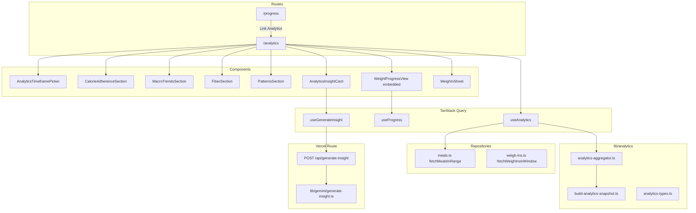

# PR W07: Analytics and Insights

## Objective

Deliver dietary habit analytics over user-selected timeframes (7D / 30D / 90D / Custom), on-demand Gemini insight generation from **aggregates only**, and an embedded weight-progress section — mirroring iOS [PR-07](docs/implementation/PR-07.md) and the W07 section of [`.cursor/plans/calsnap_web_prs_4a5e9349.plan.md`](.cursor/plans/calsnap_web_prs_4a5e9349.plan.md).

**Depends on (already implemented):**

| PR | Reuse |
|----|-------|
| [PR-W01](docs/implementation/web/PR-W01.md) | [`macroPercents`](calsnap-web/lib/nutrition/calculator.ts), [`fiberTargetG`](calsnap-web/lib/nutrition/calculator.ts), `AppConstants.Nutrition` cal/gram factors |
| [PR-W02](docs/implementation/web/PR-W02.md) | [`useProfile`](calsnap-web/lib/queries/use-profile.ts), [`getProfileWithExtras`](calsnap-web/lib/repositories/profile.ts) |
| [PR-W03](docs/implementation/web/PR-W03.md) | [`calorieProgressBand`](calsnap-web/lib/dashboard/calorie-progress.ts), [`date-window.ts`](calsnap-web/lib/dashboard/date-window.ts), [`MacroSplit`](calsnap-web/lib/models/macro-split.ts) |
| [PR-W04](docs/implementation/web/PR-W05.md) | Meal Firestore docs, [`fetchMeal`](calsnap-web/lib/repositories/meals.ts) patterns |
| [PR-W06](docs/implementation/web/PR-W06.md) | Recharts, [`WeightProgressView`](calsnap-web/components/progress/WeightProgressView.tsx), [`useProgress`](calsnap-web/lib/queries/use-progress.ts), [`WeighInSheet`](calsnap-web/components/progress/WeighInSheet.tsx), [`fetchWeighInsInWindow`](calsnap-web/lib/repositories/weigh-ins.ts) |

**Source references (port behavior, not SwiftUI):**

- [`AnalyticsAggregator.swift`](CalSnap/Core/Services/AnalyticsAggregator.swift) — all pure aggregation
- [`AnalyticsTypes.swift`](CalSnap/Core/Utilities/AnalyticsTypes.swift) — date range, summaries, buckets
- [`AnalyticsViewModel.swift`](CalSnap/Features/Analytics/AnalyticsViewModel.swift) — load pipeline + insight payload assembly
- [`GeminiService.swift`](CalSnap/Core/Services/GeminiService.swift) — `buildAnalyticsInsightPrompt` (lines 254–283)
- [`AnalyticsTests.swift`](CalSnapTests/AnalyticsTests.swift) — three unit tests to port

---

## Sharpen-plan Q&A (locked 2026-06-27)

| Question | Decision | Rationale |
|----------|----------|-----------|
| How discover `/analytics`? | **Progress page link only** | W03 locked 5-tab nav; Progress is the natural “trends” home; avoids dashboard clutter and scope creep |
| Embedded weight scope? | **Full content minus page chrome** (header, bar, chart, stats, history) | iOS `WeightProgressPresentation.embedded` parity; history is useful without navigating away |
| Who builds Gemini payload? | **Client sends `AnalyticsInsightPayload`**; server validates Zod schema + session | Matches iOS ViewModel→Gemini; aggregates-only; no server-side duplication of aggregation logic |
| Adherence calorie target? | **Current `profile.dailyCalorieTarget` at load time** for entire window | iOS parity; we store no per-day historical targets; mid-window TDEE recalc is edge-case acceptable |
| Plateau on analytics save? | **Yes** — `usePlateauAlert` + `PlateauAlertSheet` on analytics page | W06 established shared hook; user saving from embedded weigh-in must not miss plateau UX |

---

## Sharpened decisions (lock before coding)

| Decision | Choice | Rationale |
|----------|--------|-----------|
| **Route** | [`app/(app)/analytics/page.tsx`](calsnap-web/app/(app)/analytics/page.tsx) | Master plan W07; **not** a 6th bottom tab (W03 locked 5-tab nav) |
| **Discovery** | **Progress page only** — `Link` in [`/progress`](calsnap-web/app/(app)/progress/page.tsx) header ("Dietary analytics →") | Sharpen-plan: no dashboard footer link in W07 |
| **Aggregation layer** | Pure [`lib/analytics/analytics-aggregator.ts`](calsnap-web/lib/analytics/analytics-aggregator.ts) + [`build-analytics-snapshot.ts`](calsnap-web/lib/analytics/build-analytics-snapshot.ts) | iOS splits `AnalyticsAggregator` (pure) from `AnalyticsViewModel` (orchestration); keeps business logic out of components |
| **Adherence band** | Add `isCalorieIntakeOnTarget(calories, target)` to [`calorie-progress.ts`](calsnap-web/lib/dashboard/calorie-progress.ts) using existing `calorieProgressBand` (±10%) | iOS `CalorieProgressBand.isCalorieIntakeOnTarget`; avoids duplicating band math |
| **Adherence denominator** | `onTargetLoggedDays / loggedDayCount`; unlogged days in chart series count as 0 kcal but **excluded** from adherence % | iOS PR7 spec extension §6 |
| **Meal range fetch** | `fetchMealsInRange(uid, start, endInclusive)` in [`meals.ts`](calsnap-web/lib/repositories/meals.ts): `timestamp >= startOfDay(start)` AND `timestamp < endOfDayExclusive(end)` | Mirrors iOS `MealRepository.fetchMeals(from:through:)` |
| **Custom range** | Max 365 days; normalize start/end to local start-of-day; swap if inverted; reject future end dates | iOS `AnalyticsDateRange.maxCustomSpanDays` |
| **Empty-state gate** | `loggedDayCount >= 3` shows chart sections; `< 3` shows instructional empty state with CTA to `/scan` | Spec acceptance criteria |
| **Weight section timeframe** | **All-time** weigh-ins via existing `useProgress` / `fetchAllWeighIns` — **not** filtered by analytics timeframe | iOS PR7 §6.3 |
| **Weight embed** | `presentation: 'embedded'` omits page H1 + top toolbar only; **still renders** header, bar, chart, stats, history; parent wraps in [`AnalyticsSectionCard`](calsnap-web/components/analytics/AnalyticsSectionCard.tsx) | Sharpen-plan: full-minus-chrome; iOS embedded parity |
| **Weight section visibility** | Always shown below dietary sections — **even when `< 3` logged days** | iOS `AnalyticsView`: weight embed is outside `hasEnoughData` gate |
| **Insight card placement** | Inside `hasEnoughData` block, **above** weight section | Matches iOS section order |
| **Plateau on analytics** | Mount [`usePlateauAlert`](calsnap-web/lib/queries/use-plateau-alert.ts) + [`PlateauAlertSheet`](calsnap-web/components/dashboard/PlateauAlertSheet.tsx) on analytics page | Sharpen-plan: weigh-in from embed must trigger plateau UX |
| **Charts** | **Recharts** (already in W06) — `BarChart`, `ComposedChart`/`Bar` stacking, `ReferenceLine` for targets | Consistent with progress chart; no new chart library |
| **Insight API** | `POST /api/generate-insight` — session cookie auth, JSON body = client-built `AnalyticsInsightPayload`, server **Zod-validates + builds prompt only** (does not re-fetch meals) | Sharpen-plan: client-payload trust model; reject `loggedDayCount < 3` with 400 |
| **Adherence target** | Single `profile.dailyCalorieTarget` for all days in window | Sharpen-plan: no historical per-day targets in Firestore |
| **Insight payload top foods** | Send top **3** foods to Gemini (name + count only), full top 5 in UI | iOS `AnalyticsViewModel.generateInsight` uses `prefix(3)` |
| **Insight state** | Client-side `useState` for `insightText` / `insightError`; clear on timeframe or profile change, **not** on every refetch | iOS post-review fix (PR7 §9) |
| **API key missing** | 503 `"Insight unavailable"`; client shows generic unavailable message (no Settings API-key copy — web is operator-funded) | Web delta vs iOS BYOK |
| **Dual-user** | **N/A** — single Firebase account | Master plan W07 out of scope |
| **Design polish** | Tailwind literals, English strings inline | `EmptyStateView` + copy module deferred to W09 |
| **Firestore index** | Reuse existing single-field `meals.timestamp` ASC index in [`firestore.indexes.json`](calsnap-web/firestore.indexes.json) | Range + orderBy on same field; no composite needed |

---

## Architecture



**Data flow for analytics load:**

1. User selects timeframe → resolve `rangeStart` / `rangeEnd` (local calendar).
2. `useAnalytics(uid, range)` fetches profile + meals in range + weigh-ins in range (for insight weight delta only).
3. `buildAnalyticsSnapshot({ meals, profile, range })` returns immutable snapshot for all sections.
4. UI renders from snapshot; changing timeframe invalidates query via `rangeKey`.

---

## Implementation phases

### Phase 1 — Types and pure aggregation

**Create [`calsnap-web/lib/analytics/analytics-types.ts`](calsnap-web/lib/analytics/analytics-types.ts)**

Port from [`AnalyticsTypes.swift`](CalSnap/Core/Utilities/AnalyticsTypes.swift):

- `AnalyticsDateRange` — `days(n)` | `custom(start, end)` with `maxCustomSpanDays = 365`
- `resolvedStart(reference)` / `resolvedEnd(reference)` using [`startOfLocalDay`](calsnap-web/lib/dashboard/date-window.ts)
- `displayLabel` for presets (7D / 30D / 90D / Custom)
- `AnalyticsTimeframePreset` enum: `7D | 30D | 90D | custom`
- `DailyNutritionSummary`, `MacroSplit` (re-export or use existing), `Weekday`, `TimeOfDayBucket`, `TopFoodEntry`, `AnalyticsInsightPayload`

**Create [`calsnap-web/lib/analytics/analytics-aggregator.ts`](calsnap-web/lib/analytics/analytics-aggregator.ts)**

Port every static method from `AnalyticsAggregator.swift`:

| Function | Notes |
|----------|-------|
| `loggedDailySummaries(meals)` | Group by `startOfLocalDay(meal.timestamp)` |
| `chartDailySeries(loggedDays, start, end)` | Fill gaps with zero-kcal days |
| `adherencePercent(loggedDays, calorieTarget)` | Uses new `isCalorieIntakeOnTarget` |
| `averageDailyCalories` | |
| `macroSplit(proteinG, carbsG, fatG)` | Delegates to `macroPercents` |
| `daysMeetingFiberTarget` | |
| `dayOfWeekBreakdown(meals)` | Use `toWeekday(date)` helper: JS `getDay()` 0=Sun → `Weekday.sunday` (rawValue 1) … 6=Sat; **unit test with fixed local dates** | iOS `calendar.component(.weekday)` uses 1=Sunday; explicit mapping avoids off-by-one bugs |
| `timeOfDayBreakdown(meals)` | Hour buckets: 5–10 morning, 11–14 midday, 15–20 evening, else night |
| `weekendWeekdayAverages(loggedDays)` | Returns `null` if either bucket empty |
| `topFoods(meals, limit)` | Case-insensitive grouping; sort by count desc, then name |

**Create [`calsnap-web/lib/analytics/build-analytics-snapshot.ts`](calsnap-web/lib/analytics/build-analytics-snapshot.ts)**

Port `AnalyticsViewModel.load` aggregation block (lines 79–132) as a pure function:

```typescript
export interface AnalyticsSnapshot {
  rangeStart: Date;
  rangeEnd: Date;
  loggedDays: DailyNutritionSummary[];
  chartDailySeries: DailyNutritionSummary[];
  loggedDayCount: number;
  hasEnoughData: boolean;
  calorieTarget: number;
  adherencePct: number;
  averageDailyCalories: number;
  actualMacroSplit: MacroSplit;
  targetMacroSplit: MacroSplit;
  fiberTargetG: number;
  daysMeetingFiberTarget: number;
  dayOfWeekBreakdown: Record<Weekday, number>;
  timeOfDayBreakdown: Record<TimeOfDayBucket, number>;
  topFoods: TopFoodEntry[];
  weekendAverageCalories: number | null;
  weekdayAverageCalories: number | null;
  insightPayload: AnalyticsInsightPayload; // pre-built for API
}
```

`hasEnoughData = loggedDayCount >= 3`.

**Modify [`calsnap-web/lib/dashboard/calorie-progress.ts`](calsnap-web/lib/dashboard/calorie-progress.ts)**

```typescript
export function isCalorieIntakeOnTarget(calories: number, target: number): boolean {
  if (target <= 0) return false;
  return calorieProgressBand(calories / target) === 'onTrack';
}
```

---

### Phase 2 — Repository and query layer

**Extend [`calsnap-web/lib/repositories/meals.ts`](calsnap-web/lib/repositories/meals.ts)**

```typescript
export async function fetchMealsInRange(
  uid: string,
  rangeStart: Date,
  rangeEndInclusive: Date,
  db?: Firestore,
): Promise<MealEntry[]>
```

Query pattern (same as today's meals, wider window):

```typescript
const start = startOfLocalDay(rangeStart);
const end = endOfDayExclusive(rangeEndInclusive);
// where('timestamp', '>=', Timestamp.fromDate(start))
// where('timestamp', '<', Timestamp.fromDate(end))
// orderBy('timestamp')
```

**Extend [`calsnap-web/lib/queries/query-keys.ts`](calsnap-web/lib/queries/query-keys.ts)**

```typescript
analyticsMeals: (uid: string, rangeKey: string) => ['analyticsMeals', uid, rangeKey] as const,
```

`rangeKey` = `7d` | `30d` | `90d` | `custom:YYYY-MM-DD:YYYY-MM-DD` via helper in `analytics-types.ts`.

**Create [`calsnap-web/lib/queries/use-analytics.ts`](calsnap-web/lib/queries/use-analytics.ts)**

- Inputs: `uid`, `selectedRange: AnalyticsDateRange`
- Fetches: profile (or accept from parent), `fetchMealsInRange`, `fetchWeighInsInWindow` (for insight weight delta)
- `select`: runs `buildAnalyticsSnapshot`
- `staleTime`: match dashboard (~30s) or default

**Create [`calsnap-web/lib/queries/invalidate-analytics.ts`](calsnap-web/lib/queries/invalidate-analytics.ts)**

```typescript
export function invalidateAnalyticsQueries(queryClient, uid) {
  void queryClient.invalidateQueries({ queryKey: ['analyticsMeals', uid] });
}
```

**Modify [`calsnap-web/lib/queries/invalidate-meals.ts`](calsnap-web/lib/queries/invalidate-meals.ts)** — call `invalidateAnalyticsQueries` so log/edit/delete refreshes analytics.

---

### Phase 3 — Gemini insight API

**Create [`calsnap-web/lib/gemini/analytics-insight-prompt.ts`](calsnap-web/lib/gemini/analytics-insight-prompt.ts)**

Port `buildAnalyticsInsightPrompt` verbatim from Swift (lines 254–283).

**Create [`calsnap-web/lib/gemini/generate-insight.ts`](calsnap-web/lib/gemini/generate-insight.ts)**

- Mirror [`analyze-meal.ts`](calsnap-web/lib/gemini/analyze-meal.ts) structure
- `generateAnalyticsInsight(payload: AnalyticsInsightPayload): Promise<string>`
- `GoogleGenAI` text-only `generateContent` with `AppConstants.Gemini.model` + `maxTokens`
- `GeminiInsightError` with codes: `emptyResponse`, `requestFailed`
- Trim response; reject empty

**Create [`calsnap-web/app/api/generate-insight/route.ts`](calsnap-web/app/api/generate-insight/route.ts)**

| Step | Behavior |
|------|----------|
| Auth | `verifyApiSession` → 401 |
| API key | Missing `GEMINI_API_KEY` → 503 `{ error: 'Insight unavailable' }` |
| Body | JSON parse → Zod validate `AnalyticsInsightPayload` |
| Server guard | Reject `loggedDayCount < 3` → 400; schema allows only aggregate fields + `topFoods[{name,count,avgCalories}]` max 5 entries |
| Recompute | **None** — server does not re-fetch Firestore for insight (client-payload model) |
| Success | `{ insight: string }` |
| Errors | 502 on Gemini failure / empty response |

**Create [`calsnap-web/lib/queries/use-generate-insight.ts`](calsnap-web/lib/queries/use-generate-insight.ts)**

- `useMutation` wrapping `fetch('/api/generate-insight', { method: 'POST', credentials: 'include', body: JSON.stringify(payload) })`
- Parent page owns `insightText` / `insightError` state (not cache)

---

### Phase 4 — UI components

**Shared chrome**

| File | Purpose |
|------|---------|
| [`components/analytics/AnalyticsSectionCard.tsx`](calsnap-web/components/analytics/AnalyticsSectionCard.tsx) | White card + section title (port `AnalyticsSectionCard`) |
| [`components/analytics/AnalyticsTimeframePicker.tsx`](calsnap-web/components/analytics/AnalyticsTimeframePicker.tsx) | Segmented 7D/30D/90D/Custom; opens custom sheet |
| [`components/analytics/AnalyticsCustomRangeSheet.tsx`](calsnap-web/components/analytics/AnalyticsCustomRangeSheet.tsx) | Bottom sheet with start/end date inputs + Apply (W06 sheet pattern) |

**Chart sections** (all accept data from `AnalyticsSnapshot`)

| File | Chart | Key details |
|------|-------|-------------|
| [`CalorieAdherenceSection.tsx`](calsnap-web/components/analytics/CalorieAdherenceSection.tsx) | Recharts `BarChart` | Bar color from `calorieProgressBand`; dashed `ReferenceLine` at target; stats row: avg intake, target, % on target |
| [`MacroTrendsSection.tsx`](calsnap-web/components/analytics/MacroTrendsSection.tsx) | Stacked `BarChart` | Stack protein/carbs/fat kcal per day (`g * AppConstants.Nutrition.*CalPerGram`); actual vs target split columns below |
| [`FiberSection.tsx`](calsnap-web/components/analytics/FiberSection.tsx) | `BarChart` | Bars green/amber by `fiberG >= fiberTargetG`; target `ReferenceLine`; "X of Y days met fiber target" |
| [`PatternsSection.tsx`](calsnap-web/components/analytics/PatternsSection.tsx) | Horizontal bar lists or `BarChart` | DOW calories, time-of-day calories, weekend vs weekday text, top 5 foods list |
| [`AnalyticsInsightCard.tsx`](calsnap-web/components/analytics/AnalyticsInsightCard.tsx) | No chart | Generate button, loading spinner, insight text, error, disabled when `!hasEnoughData` |
| [`AnalyticsEmptyState.tsx`](calsnap-web/components/analytics/AnalyticsEmptyState.tsx) | — | "Log at least 3 days of meals" + link to `/scan` |

**Recharts conventions** (match W06 [`WeightProgressChart`](calsnap-web/components/progress/WeightProgressChart.tsx)):

- `ResponsiveContainer` width 100%, fixed height ~200px
- `aria-label` on chart wrapper summarizing key stats
- X-axis: short date labels; avoid overcrowding on 90D (tick interval)

---

### Phase 5 — Pages and navigation

**Create [`calsnap-web/app/(app)/analytics/page.tsx`](calsnap-web/app/(app)/analytics/page.tsx)**

Client page structure:

```
mx-auto max-w-lg px-4 py-8
├── h1 "Analytics"
├── AnalyticsTimeframePicker
├── [loading skeletons]
├── [error banner]
├── if hasEnoughData:
│   ├── CalorieAdherenceSection
│   ├── MacroTrendsSection
│   ├── FiberSection
│   ├── PatternsSection
│   └── AnalyticsInsightCard
│   else:
│   └── AnalyticsEmptyState
├── AnalyticsSectionCard "Weight progress"   ← always visible
│   └── WeightProgressView presentation="embedded"
├── WeighInSheet
└── PlateauAlertSheet                        ← shared usePlateauAlert
```

State management (port iOS `AnalyticsView` patterns):

- `timeframePreset`, `selectedRange`, custom sheet open/close
- On preset change → update `selectedRange`, clear insight
- On custom sheet dismiss without apply → revert preset (iOS `revertCustomPresetIfNeeded`)
- On apply custom → cap 365 days, set `selectedRange.custom`
- `WeighInSheet` + `PlateauAlertSheet` lifted here (mirror [`progress/page.tsx`](calsnap-web/app/(app)/progress/page.tsx)); on save → `invalidateWeighInQueries` + bump weight reload key

**Modify [`calsnap-web/components/progress/WeightProgressView.tsx`](calsnap-web/components/progress/WeightProgressView.tsx)**

```typescript
interface WeightProgressViewProps {
  uid: string;
  onLogWeighIn: () => void;
  presentation?: 'full' | 'embedded'; // default 'full'
}
```

- `full`: current behavior (H1 "Progress", log button in header)
- `embedded`: same content blocks (header, bar, chart, stats, history) — **no** page H1 or header log button; chart empty-state CTA still calls `onLogWeighIn`

**Modify [`calsnap-web/app/(app)/progress/page.tsx`](calsnap-web/app/(app)/progress/page.tsx)**

Add header row above `WeightProgressView`: `Link href="/analytics"` — "Dietary analytics →" (only discovery entry point in W07)

---

### Phase 6 — Tests and docs

**Unit tests — create [`calsnap-web/tests/unit/analytics-aggregator.test.ts`](calsnap-web/tests/unit/analytics-aggregator.test.ts)**

Port iOS `AnalyticsTests.swift` exactly:

| Test | Assertion |
|------|-----------|
| `adherencePercent` | 7 days @ 2000 target → 4/7 × 100; partial 5 days → 3/5 × 100 |
| `dayOfWeekBreakdown` | Fixed UTC calendar; Mon 1100, Wed 800 |
| `topFoods` | Chicken 4× @ 200 kcal leads; 5 entries sorted by frequency |

Add:

| Test | Assertion |
|------|-----------|
| `chartDailySeries` | 3-day window with 1 logged day → 3 entries, 2 zero-filled |
| `isCalorieIntakeOnTarget` | 1800–2200 on 2000 target → true; 1700/2300 → false |

**Unit tests — create [`calsnap-web/tests/unit/generate-insight-route.test.ts`](calsnap-web/tests/unit/generate-insight-route.test.ts)**

Mirror [`analyze-meal-route.test.ts`](calsnap-web/tests/unit/analyze-meal-route.test.ts):

- 401 without session
- 503 without `GEMINI_API_KEY`
- 400 invalid payload / `loggedDayCount < 3`
- 200 with mocked `generateAnalyticsInsight`

**Unit tests — create [`calsnap-web/tests/unit/analytics-insight-prompt.test.ts`](calsnap-web/tests/unit/analytics-insight-prompt.test.ts)**

- Prompt includes adherence %, macro splits, no image references
- Weekend/weekday lines present when provided
- Weight change line when `weightChangeKg` set

**Optional integration:** `fetchMealsInRange` against Firestore emulator (follow W02/W06 patterns).

**Docs:**

- Create [`docs/implementation/web/PR-W07.md`](docs/implementation/web/PR-W07.md) (mirror W06 format)
- Update [`docs/implementation/web/README.md`](docs/implementation/web/README.md) index → W07 Implemented

**Merge gate:**

```bash
cd calsnap-web && pnpm install && pnpm test && pnpm lint && pnpm build
```

---

## Manual test plan

1. Emulator + `pnpm dev`; user with ≥3 days of logged meals across the selected window
2. Navigate Progress → "Dietary analytics" → `/analytics` loads
3. Default 7D: calorie bars, macro stack, fiber, patterns populate
4. Switch 30D / 90D: all sections refetch and re-render
5. Custom range: pick 14-day window; verify cap at 365 days; cancel reverts preset
6. User with &lt;3 logged days: empty state with scan CTA; chart sections hidden; **weight section still visible**
7. Weight section shows all-time progress (not limited to 7D); log weigh-in from embedded chart CTA works
8. Log 3 flat weekly weigh-ins from analytics embed → plateau sheet appears on analytics tab
9. Tap "Generate insight" → 2–3 sentence response in &lt;5s; request body is JSON aggregates only (no photos)
10. Change timeframe → prior insight cleared
11. Log/edit/delete meal on another tab → return to analytics → data refreshed
12. Unauthenticated `POST /api/generate-insight` → 401; payload with `loggedDayCount: 2` → 400
13. Mobile 320px: segmented picker wraps; charts scroll horizontally if needed

---

## Web deltas vs iOS PR-07

| Area | iOS | Web W07 |
|------|-----|---------|
| Navigation | Analytics is primary tab | `/analytics` linked from Progress (5-tab nav unchanged) |
| Persistence | SwiftData range fetch | Firestore `fetchMealsInRange` |
| Gemini auth | User BYOK via Keychain | Server `GEMINI_API_KEY`; 503 when missing |
| API key error copy | Settings-specific | Generic "Insight unavailable" |
| Charts | Swift Charts | Recharts |
| Multi-profile | User switcher | Omitted (single Firebase user) |
| Insight transport | In-process `GeminiService` | `POST /api/generate-insight` |
| Weight progress | Embedded full `WeightProgressView` | Same via `presentation="embedded"` |

---

## Out of scope (do not implement in W07)

- Settings, CSV export, profile macro sliders (W08)
- Design tokens, `EmptyStateView`, copy module, dark mode (W09)
- PWA, Web Push, Playwright E2E (W10)
- Alcohol / highest-meal analytics (product-research only)
- Automatic scheduled insights
- Analytics in bottom tab nav
- Sending raw food names beyond top-N aggregate to Gemini

---

## Acceptance criteria

- [ ] `/analytics` renders live Firestore meal aggregates for authenticated user
- [ ] Timeframe picker (7D / 30D / 90D / Custom) refreshes all dietary chart sections
- [ ] Empty state when &lt;3 logged days with actionable scan CTA
- [ ] Embedded weight progress (all-time) always visible; weigh-in + plateau sheets work on analytics page
- [ ] `POST /api/generate-insight` returns 2–3 sentence insight in &lt;5s on demand
- [ ] Insight request body contains aggregates only (no photos, no full meal dump)
- [ ] Three aggregator unit tests + route test pass; merge gate green
- [ ] `docs/implementation/web/PR-W07.md` written; README index updated
