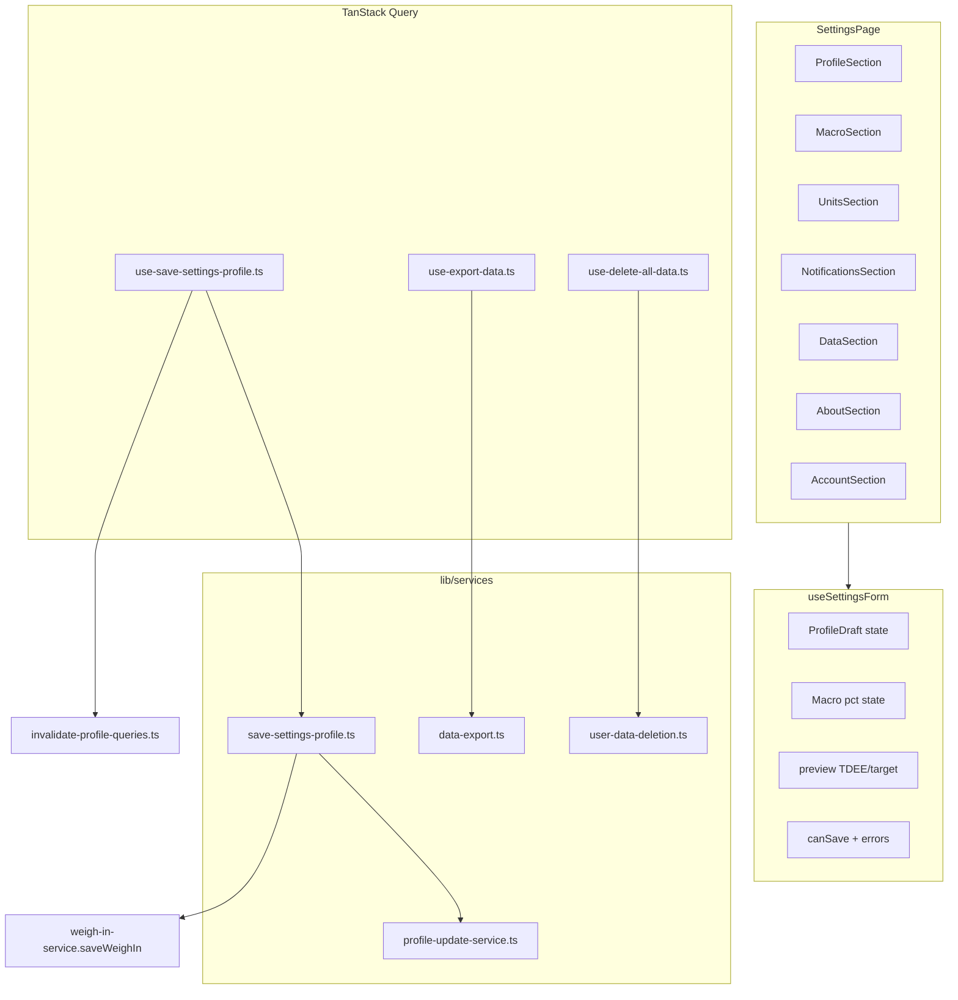

# PR W08: Settings

## Objective

Deliver the Settings tab with profile management (TDEE recalculation on edit), optional display name, macro sliders (sum = 100%), unit preferences, weekly weigh-in reminder prefs, CSV export, delete-all-data, About/science links, and sign-out — mirroring iOS [PR-08](docs/implementation/PR-08.md) and the W08 section of [`.cursor/plans/calsnap_web_prs_4a5e9349.plan.md`](.cursor/plans/calsnap_web_prs_4a5e9349.plan.md).

**Depends on (already implemented):**

| PR | Reuse |
|----|-------|
| [PR-W01](docs/implementation/web/PR-W01.md) | [`NutritionCalculator`](calsnap-web/lib/nutrition/calculator.ts), [`AppConstants`](calsnap-web/lib/constants.ts) |
| [PR-W02](docs/implementation/web/PR-W02.md) | [`ProfileDraft`](calsnap-web/lib/onboarding/profile-draft.ts), [`validation.ts`](calsnap-web/lib/onboarding/validation.ts), [`unit-formatters.ts`](calsnap-web/lib/utilities/unit-formatters.ts), [`saveProfile`](calsnap-web/lib/repositories/profile.ts) |
| [PR-W03](docs/implementation/web/PR-W03.md) | [`useProfile`](calsnap-web/lib/queries/use-profile.ts), bottom-tab `/settings` route |
| [PR-W05](docs/implementation/web/PR-W05.md) | [`deleteMeal`](calsnap-web/lib/repositories/meals.ts) photo cleanup pattern |
| [PR-W06](docs/implementation/web/PR-W06.md) | [`saveWeighIn`](calsnap-web/lib/services/weigh-in-service.ts), [`reminder-prefs.ts`](calsnap-web/lib/progress/reminder-prefs.ts), [`ACTIVITY_LEVEL_OPTIONS`](calsnap-web/lib/onboarding/activity-level-options.ts) |
| [PR-W07](docs/implementation/web/PR-W07.md) | [`invalidateAnalyticsQueries`](calsnap-web/lib/queries/invalidate-analytics.ts) |

**Source references (port behavior, not SwiftUI):**

- [`ProfileUpdateService.swift`](CalSnap/Core/Services/ProfileUpdateService.swift) — preview, apply, macro slider math
- [`DataExportService.swift`](CalSnap/Core/Services/DataExportService.swift) — CSV shape
- [`UserDataDeletionService.swift`](CalSnap/Core/Services/UserDataDeletionService.swift) — scoped wipe intent
- [`SettingsViewModel.swift`](CalSnap/Features/Settings/SettingsViewModel.swift) — save orchestration (weight → weigh-in)
- [`SettingsTests.swift`](CalSnapTests/SettingsTests.swift) — three unit tests to port

**Current state:** [`app/(app)/settings/page.tsx`](calsnap-web/app/(app)/settings/page.tsx) is a `StubPage` with sign-out only.

---

## Sharpen-plan Q&A (locked 2026-06-28)

| Question | Decision | Rationale |
|----------|----------|-----------|
| Delete-all-data scope? | **Hard-delete** all `users/{uid}/meals`, `weighIns`, `profile/main`, and Storage under `users/{uid}/meals/` | Master plan W08 acceptance; iOS scoped data wipe |
| Delete Firebase Auth account? | **No** — keep user signed in | Master plan W08 out of scope: "account email change flow"; iOS deletes local data only |
| Post-delete navigation? | **`router.replace('/onboarding')`** after `queryClient.clear()` | Profile doc gone → `isOnboardingComplete` false; user re-onboards |
| Delete confirmation? | **Destructive alert dialog** with typed confirm unnecessary (iOS uses single confirm) | iOS parity; keep friction low but require explicit confirm |
| API keys / HealthKit sections? | **Omitted** | Web deltas in master plan; operator-funded Gemini |
| Daily log reminder UI? | **Out of scope (W10)** | iOS PR-08 defers daily log to PR-10; W06 stored weigh-in reminder fields only |
| Unit prefs storage? | **ProfileDoc** (`useLbsForWeight`, `useImperialForHeight`) | W02 web model; not iOS `UserDefaults` |
| Cross-tab refresh? | **TanStack `invalidateProfileQueries`** | Web equivalent of iOS `profileDataRevision` |
| Profile weight change on save? | **Reuse `saveWeighIn`** when `|Δweight| ≥ 0.05 kg` | iOS PR-08 spec extension §6.4 |
| Deficit slider in Settings? | **No** — preserve `profile.deficitKcal` on recalc | iOS Settings preserves deficit; slider stays onboarding-only |
| Export delivery? | **Client blob download** (`URL.createObjectURL` + `<a download>`) | Web equivalent of iOS share sheet |
| Delete implementation? | **Client SDK** (authenticated user, existing rules) | No new API route; matches other Firestore CRUD |
| Design polish? | Tailwind literals, English strings inline | Copy module deferred to W09 |

---

## Sharpened decisions (lock before coding)

| Decision | Choice | Rationale |
|----------|--------|-----------|
| **Route** | Replace [`app/(app)/settings/page.tsx`](calsnap-web/app/(app)/settings/page.tsx) stub | W03 tab already points here |
| **Form state** | [`lib/settings/use-settings-form.ts`](calsnap-web/lib/settings/use-settings-form.ts) hook | Mirrors [`use-weigh-in-form.ts`](calsnap-web/lib/progress/use-weigh-in-form.ts); keeps page thin |
| **Business logic** | Pure services in `lib/services/` | Engineering rules: logic out of components |
| **Profile save** | [`save-settings-profile.ts`](calsnap-web/lib/services/save-settings-profile.ts) orchestrates apply + optional weigh-in | iOS `SettingsViewModel.saveProfile` parity |
| **Macro UI** | Three range inputs 0–100 with live sum indicator | iOS slider behavior; `adjustMacroPercents` keeps sum = 100 |
| **Preview TDEE** | Recompute on every draft/macro/weight change via `preview()` | iOS `refreshPreview()` |
| **Save button** | Explicit **Save profile** (not auto-save on blur) | Avoid accidental Firestore writes; iOS has explicit save + onDisappear auto-save — web ships explicit save only for W08 |
| **Reminder prefs** | Write to ProfileDoc on save (same mutation as profile) | W06 fields exist; delivery scheduling is W10 |
| **CSV columns** | Match iOS headers; weigh-in column `source` not `sourceIsHealthKit` | Web delta documented in PR-W08.md |
| **fetchAllMeals** | `orderBy('timestamp', 'asc')` on meals subcollection | Export needs full history |
| **Storage cleanup** | Delete each meal's `photoStoragePath` during meal doc delete; then `listAll` prefix `users/{uid}/meals` for orphans | Belt-and-suspenders for failed prior deletes |
| **Batch delete limit** | Chunk Firestore deletes at **450 ops/batch** | Under 500 Firestore batch cap |
| **localStorage cleanup** | Clear `plateauSnoozeKey`, `maintenanceModeKey`, `weighInSnoozeKey` for uid | iOS `clearPerUserDefaults` parity |
| **Sign out** | Keep at bottom of Settings (Account section) | Already on stub page |
| **About version** | Static `0.1.0` from [`package.json`](calsnap-web/package.json) | No build-time injection needed in W08 |
| **Password reset / email change** | Out of scope | Master plan W08 |

---

## Architecture



**Save flow:**

1. User edits draft + macros + unit/reminder prefs in `useSettingsForm`.
2. `preview()` runs on each change → show TDEE, daily target, minimum floor (read-only).
3. On **Save profile**: validate age, goal date, macro sum.
4. `apply()` merges draft into in-memory `UserProfile` (preserves `deficitKcal`).
5. If `|currentWeightKg - savedWeightKg| ≥ 0.05` → `saveWeighIn()` (batch weigh-in + profile with updated extras).
6. Else → `saveProfile()` with updated profile + extras (units, reminders, `currentWeightKg`).
7. `invalidateProfileQueries(uid)` → dashboard, progress, analytics refresh without full page reload.

**Delete flow:**

1. User taps **Delete all my data** → confirm dialog.
2. `deleteAllUserData(uid)`:
   - Fetch all meal docs → delete Storage photos → delete meal docs (chunked batches).
   - Fetch all weigh-in docs → delete (chunked).
   - Delete `profile/main`.
   - Clear uid-scoped `localStorage` keys.
3. `queryClient.clear()` → `router.replace('/onboarding')`.

---

## Implementation phases

### Phase 1 — Pure services (port iOS PR-08 core)

**Create [`calsnap-web/lib/services/profile-update-service.ts`](calsnap-web/lib/services/profile-update-service.ts)**

Port [`ProfileUpdateService.swift`](CalSnap/Core/Services/ProfileUpdateService.swift) verbatim:

| Export | Notes |
|--------|-------|
| `MacroKind` | `'protein' \| 'carbs' \| 'fat'` |
| `preview({ sex, dateOfBirth, heightCm, weightKg, activityLevel, deficitKcal })` | Returns `{ tdee, dailyTarget, deficitKcal, minimumCalories }` |
| `apply(profile, draft, weightKg)` | Mutates profile fields + recalculated TDEE/target; uses `trimmedName(draft)` |
| `applyMacroTargets(profile, proteinPct, carbsPct, fatPct)` | Stores 0–1 fractions |
| `macroPercentsAreValid` / `normalizedMacroPercents` / `adjustMacroPercents` | iOS parity |

**Create [`calsnap-web/lib/settings/profile-draft-from-profile.ts`](calsnap-web/lib/settings/profile-draft-from-profile.ts)**

```typescript
export function profileDraftFromProfile(
  profile: UserProfile,
  extras: ProfileExtras,
  currentWeightKg: number,
): ProfileDraft
```

Maps stored profile → editable draft; sets `weightKg` from `extras.currentWeightKg`; copies unit toggles from extras.

**Create [`calsnap-web/lib/settings/validation.ts`](calsnap-web/lib/settings/validation.ts)**

Compose existing [`validateDateOfBirth`](calsnap-web/lib/onboarding/validation.ts), [`validateGoalTargetDate`](calsnap-web/lib/onboarding/validation.ts), and `macroPercentsAreValid` into:

- `canSaveSettings(draft, macroPcts)` → boolean
- `settingsValidationMessage(...)` → string | null

**Create [`calsnap-web/lib/services/data-export.ts`](calsnap-web/lib/services/data-export.ts)**

Port [`DataExportService.makeCSV`](CalSnap/Core/Services/DataExportService.swift):

```
# meals
id,userId,timestamp,mealType,calories,proteinG,carbsG,fatG,fiberG,confidence,isManuallyAdjusted,description
# weigh_ins
id,userId,date,weightKg,tdee,target,bmi,source
```

Web deltas:
- IDs are Firebase strings (not UUID format requirement — still valid CSV)
- `source` column: `manual` or empty (not `sourceIsHealthKit`)
- `tdee` / `target` map from `calculatedTDEE` / `adjustedDailyTarget`
- ISO8601 timestamps; CSV escape for description field
- **No photo column** (iOS test asserts this)

**Create [`calsnap-web/lib/services/user-data-deletion.ts`](calsnap-web/lib/services/user-data-deletion.ts)**

```typescript
export async function deleteAllUserData(uid: string, deps?: { db?, storage? }): Promise<void>
```

Implementation:
- `deleteSubcollectionInBatches(db, 'users', uid, 'meals', onEachMeal?)` — call `deleteObject` when `photoStoragePath` set
- `deleteSubcollectionInBatches(db, 'users', uid, 'weighIns')`
- `deleteDoc(profile/main)`
- `deleteStoragePrefix(storage, users/${uid}/meals)` via `listAll` + parallel `deleteObject` (best-effort, log warnings)
- `clearUserLocalStorage(uid)` — plateau, maintenance, weigh-in snooze keys

**Create [`calsnap-web/lib/services/save-settings-profile.ts`](calsnap-web/lib/services/save-settings-profile.ts)**

```typescript
export interface SaveSettingsProfileInput {
  uid: string;
  profile: UserProfile;
  extras: ProfileExtras;
  draft: ProfileDraft;
  macroProteinPct: number;
  macroCarbsPct: number;
  macroFatPct: number;
  currentWeightKg: number;
  savedWeightKg: number;
  reminderPrefs: ResolvedReminderPrefs;
  unitPrefs: { useLbsForWeight: boolean; useImperialForHeight: boolean };
}
```

Logic:
1. Clone profile; `apply()` + `applyMacroTargets()`.
2. Build updated `ProfileExtras` (units, reminders, `currentWeightKg`).
3. If weight delta ≥ 0.05 kg → `saveWeighIn({ ... })` with profile that includes non-weight edits.
4. Else → `saveProfile(uid, updatedProfile, updatedExtras)`.
5. Return `{ profile, extras, didTriggerPlateau? }`.

---

### Phase 2 — Repository extensions

**Extend [`calsnap-web/lib/repositories/meals.ts`](calsnap-web/lib/repositories/meals.ts)**

```typescript
export async function fetchAllMeals(
  uid: string,
  sortAscending = true,
  db?: Firestore,
): Promise<MealEntry[]>
```

`orderBy('timestamp', sortAscending ? 'asc' : 'desc')` — export uses ascending.

**Extend [`calsnap-web/lib/repositories/profile.ts`](calsnap-web/lib/repositories/profile.ts)** (if needed)

Optional helper `updateProfileExtras(uid, partialExtras)` — only if `save-settings-profile` can stay DRY; otherwise inline in `saveProfile` call is sufficient.

---

### Phase 3 — Query layer and invalidation

**Create [`calsnap-web/lib/queries/invalidate-profile-queries.ts`](calsnap-web/lib/queries/invalidate-profile-queries.ts)**

```typescript
export function invalidateProfileQueries(queryClient: QueryClient, uid: string): void {
  void queryClient.invalidateQueries({ queryKey: queryKeys.profile(uid) });
  void queryClient.invalidateQueries({ queryKey: queryKeys.allWeighIns(uid) });
  void queryClient.invalidateQueries({ queryKey: ['todaysMeals', uid] });
  void queryClient.invalidateQueries({ queryKey: ['weighIns', uid] });
  void queryClient.invalidateQueries({ queryKey: ['analyticsMeals', uid] });
  void queryClient.invalidateQueries({ queryKey: ['meal', uid] });
}
```

**Create [`calsnap-web/lib/queries/use-save-settings-profile.ts`](calsnap-web/lib/queries/use-save-settings-profile.ts)**

- `useMutation` wrapping `saveSettingsProfile`
- `onSuccess`: `invalidateProfileQueries`; return `didTriggerPlateau` for optional plateau sheet (defer mounting plateau on settings unless weigh-in path returns true — mirror progress/dashboard if triggered)

**Create [`calsnap-web/lib/queries/use-export-data.ts`](calsnap-web/lib/queries/use-export-data.ts)**

- Fetches `fetchAllMeals` + `fetchAllWeighIns(uid, false)`
- Calls `makeCSV` → triggers browser download
- Filename: `calsnap-{slug}-export.csv` (slug from trimmed display name or `export`)

**Create [`calsnap-web/lib/queries/use-delete-all-data.ts`](calsnap-web/lib/queries/use-delete-all-data.ts)**

- `useMutation` → `deleteAllUserData`
- `onSuccess`: `queryClient.clear()` + `router.replace('/onboarding')`

---

### Phase 4 — Settings form hook

**Create [`calsnap-web/lib/settings/use-settings-form.ts`](calsnap-web/lib/settings/use-settings-form.ts)**

State loaded from `useProfile`:
- `draft`, `macroProteinPct/CarbsPct/FatPct` (ints 0–100)
- `currentWeightKg`, `savedWeightKg` (from `extras.currentWeightKg`)
- `useLbsForWeight`, `useImperialForHeight`
- `reminderPrefs` (from `resolveReminderPrefs`)
- `previewTDEE`, `previewTarget`, `minimumCalories`
- `adjustMacro(changed, newValue)` delegates to `adjustMacroPercents`
- `refreshPreview()` on draft/weight/macro changes
- `canSave`, `validationMessage`, `isDirty` (compare to loaded snapshot)

Height imperial helpers: reuse `cmToFeetInches` / `feetInchesToCm` from [`unit-formatters.ts`](calsnap-web/lib/utilities/unit-formatters.ts) (same pattern as [`ProfileSetupStep.tsx`](calsnap-web/components/onboarding/ProfileSetupStep.tsx)).

---

### Phase 5 — UI components

**Create [`calsnap-web/components/settings/`](calsnap-web/components/settings/)**

| Component | Content |
|-----------|---------|
| `SettingsSectionCard.tsx` | Reuse or mirror [`AnalyticsSectionCard`](calsnap-web/components/analytics/AnalyticsSectionCard.tsx) pattern — titled card with padding |
| `ProfileSection.tsx` | Display name, sex, DOB, height (cm or ft/in), current weight stepper, activity level radios, goal weight, goal date, read-only TDEE/target/minimum, Recalculate button (calls `refreshPreview`) |
| `MacroTargetsSection.tsx` | Three sliders + sum label (red when ≠ 100) |
| `UnitsSection.tsx` | Toggles for lbs/kg and ft-in/cm |
| `NotificationsSection.tsx` | Weigh-in reminder enabled toggle, weekday select (Sun–Sat), time input; note: "Reminders coming in a future update" or silent save-only (W10 delivers) |
| `DataSection.tsx` | Export CSV button, Delete all data (destructive) |
| `AboutSection.tsx` | Version `0.1.0`, links to [NIH Body Weight Planner](https://www.niddk.nih.gov/bwp) and [Dietary Guidelines](https://www.dietaryguidelines.gov) |
| `AccountSection.tsx` | Sign out button (existing stub behavior) |
| `DeleteDataDialog.tsx` | Modal confirm — title, warning copy, Cancel / Delete |

**Replace [`app/(app)/settings/page.tsx`](calsnap-web/app/(app)/settings/page.tsx)**

- `useAuth` + `useProfile` + `useSettingsForm`
- Loading / error states
- Sticky or inline save bar when `isDirty && canSave`
- Save → `useSaveSettingsProfile`; show save error inline
- Export → `useExportData` with loading state
- Delete → `DeleteDataDialog` → `useDeleteAllData`
- Optional: mount `PlateauAlertSheet` if save returns `didTriggerPlateau` (same components as dashboard)

Reuse onboarding field markup from [`ProfileSetupStep`](calsnap-web/components/onboarding/ProfileSetupStep.tsx) / [`GoalSetupStep`](calsnap-web/components/onboarding/GoalSetupStep.tsx) where practical — extract shared subcomponents only if duplication exceeds ~40 lines (prefer copy for W08 scope discipline).

---

### Phase 6 — Tests and docs

**Unit tests — create [`calsnap-web/tests/unit/profile-update-service.test.ts`](calsnap-web/tests/unit/profile-update-service.test.ts)**

Port iOS `SettingsTests.swift`:

| Test | Assertion |
|------|-----------|
| `macro slider validation` | `adjustMacroPercents` sums to 100; invalid triple fails `macroPercentsAreValid`; `normalizedMacroPercents` fixes 33/33/33 |
| `recalculation on profile edit` | Taller height → higher TDEE/target; lighter weight → lower TDEE/target; deficit preserved |
| `empty display name is valid` | `trimmedName({ name: '  ' }) === ''`; `canSaveSettings` true with blank name |

**Unit tests — create [`calsnap-web/tests/unit/data-export.test.ts`](calsnap-web/tests/unit/data-export.test.ts)**

Port `testCSVExport`:
- Contains `# meals`, `# weigh_ins`, header rows
- Sample meal/weigh-in IDs and values present
- No `photoStoragePath` / `photoData` in output

**Unit tests — create [`calsnap-web/tests/unit/save-settings-profile.test.ts`](calsnap-web/tests/unit/save-settings-profile.test.ts)** (mock Firestore)

- Weight unchanged → `saveProfile` called, not `saveWeighIn`
- Weight delta ≥ 0.05 → `saveWeighIn` called

**Optional integration — [`calsnap-web/tests/integration/delete-all-data-firestore.test.ts`](calsnap-web/tests/integration/delete-all-data-firestore.test.ts)**

Emulator: seed profile + 1 meal + 1 weigh-in → delete → assert collections empty.

**Docs:**

- Create [`docs/implementation/web/PR-W08.md`](docs/implementation/web/PR-W08.md) (mirror W07 format)
- Update [`docs/implementation/web/README.md`](docs/implementation/web/README.md) — W08 Implemented; lock open decision #4: *immediate hard delete of user data; Auth account retained*

**Merge gate:**

```bash
cd calsnap-web && pnpm install && pnpm test && pnpm lint && pnpm build
```

---

## Manual test plan

1. Emulator + `pnpm dev`; user with meals, weigh-ins, and completed onboarding
2. Settings tab loads all sections (not stub)
3. Edit display name to blank → Save succeeds; dashboard greeting uses "Today"
4. Change height → preview TDEE/target update before save; Save → dashboard ring target updates without reload
5. Change current weight by ≥0.5 kg → Save creates new weigh-in; progress history shows entry
6. Adjust protein slider → carbs/fat rebalance; sum stays 100; invalid state disables Save
7. Toggle lbs/kg → weight stepper range/step changes; saved values remain correct in kg
8. Toggle ft/in height → imperial pickers appear; saved `heightCm` consistent
9. Change weigh-in reminder weekday/time → Save → profile doc fields updated
10. Export CSV → file downloads; opens in spreadsheet with correct headers and rows
11. Delete all data → confirm → redirected to onboarding; Firestore collections empty; re-onboard works
12. Sign out → `/login` (unchanged from stub)
13. Mobile 320px: sections scroll; save button reachable; sliders usable

---

## Web deltas vs iOS PR-08

| Area | iOS | Web W08 |
|------|-----|---------|
| API keys | Gemini + USDA Keychain | Omitted (server Gemini) |
| HealthKit | Toggles + Sync Now | Omitted |
| Daily log reminder | Deferred to PR-10 | Deferred to W10 |
| Unit prefs | `UserDefaults` | `ProfileDoc` fields |
| Cross-tab refresh | `profileDataRevision` | TanStack `invalidateProfileQueries` |
| CSV share | `UIActivityViewController` | Browser file download |
| Data delete | SwiftData cascade | Firestore batch delete + Storage `listAll` |
| Post-delete | Empty local store | Redirect `/onboarding`; Auth session kept |
| Auto-save on leave | `onDisappear` save | Explicit Save only (W08) |
| Weigh-in `source` column | `sourceIsHealthKit` | `source` = `manual` |

---

## Out of scope (explicit)

- Password reset, email change, Firebase Auth account deletion
- Daily log reminder UI and Web Push delivery (W10)
- Stripe/billing
- shadcn polish, copy module, dark mode (W09)
- Deficit slider in Settings
- PWA, Playwright E2E (W10)

---

## Files summary

**Create (~20 files):**

- `lib/services/profile-update-service.ts`, `data-export.ts`, `user-data-deletion.ts`, `save-settings-profile.ts`
- `lib/settings/profile-draft-from-profile.ts`, `validation.ts`, `use-settings-form.ts`
- `lib/queries/invalidate-profile-queries.ts`, `use-save-settings-profile.ts`, `use-export-data.ts`, `use-delete-all-data.ts`
- `components/settings/*` (7–8 components)
- `tests/unit/profile-update-service.test.ts`, `data-export.test.ts`, `save-settings-profile.test.ts`
- `docs/implementation/web/PR-W08.md`

**Modify (~3 files):**

- `app/(app)/settings/page.tsx` — full implementation
- `lib/repositories/meals.ts` — `fetchAllMeals`
- `docs/implementation/web/README.md` — index + locked deletion decision
