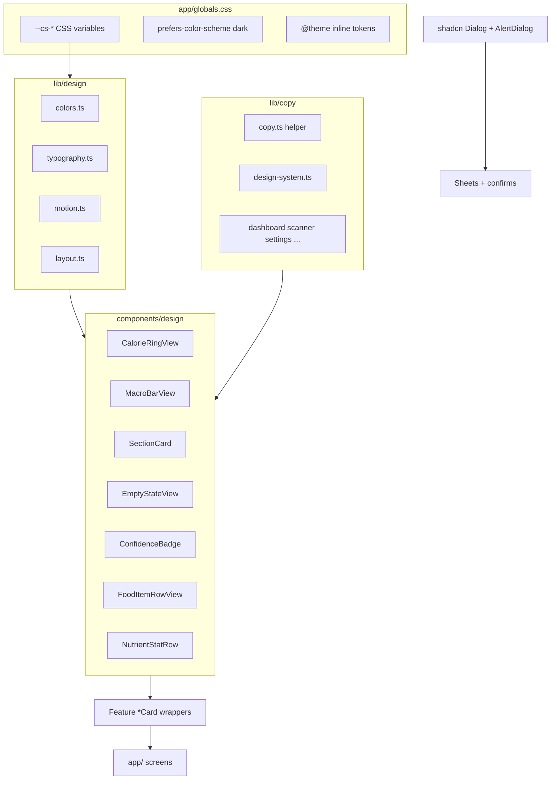

# PR W09: Design System Polish and UX

## Objective

Deliver the production visual language for CalSnap Web: design tokens, dark mode, accessibility, animations, and a centralized English copy module — mirroring iOS [PR-9](docs/implementation/PR-09.md) and the W09 section of [`.cursor/plans/calsnap_web_prs_4a5e9349.plan.md`](.cursor/plans/calsnap_web_prs_4a5e9349.plan.md).

**Depends on (already implemented):**

| PR | Reuse |
|----|-------|
| [PR-W01](docs/implementation/web/PR-W01.md) | Tailwind v4 baseline, [`globals.css`](calsnap-web/app/globals.css) |
| [PR-W03](docs/implementation/web/PR-W03.md) | [`CalorieRingCard`](calsnap-web/components/dashboard/CalorieRingCard.tsx), [`MacroBarCard`](calsnap-web/components/dashboard/MacroBarCard.tsx), [`calorie-progress.ts`](calsnap-web/lib/dashboard/calorie-progress.ts) band logic |
| [PR-W04](docs/implementation/web/PR-W04.md) | [`ConfidenceBadge`](calsnap-web/components/scanner/ConfidenceBadge.tsx), [`FoodItemRow`](calsnap-web/components/scanner/FoodItemRow.tsx), [`MealAnalysisResultView`](calsnap-web/components/scanner/MealAnalysisResultView.tsx) |
| [PR-W05](docs/implementation/web/PR-W05.md) | Meal log empty states, share card |
| [PR-W06](docs/implementation/web/PR-W06.md) | Progress charts, [`WeighInSheet`](calsnap-web/components/progress/WeighInSheet.tsx) |
| [PR-W07](docs/implementation/web/PR-W07.md) | [`AnalyticsSectionCard`](calsnap-web/components/analytics/AnalyticsSectionCard.tsx), [`AnalyticsEmptyState`](calsnap-web/components/analytics/AnalyticsEmptyState.tsx) |
| [PR-W08](docs/implementation/web/PR-W08.md) | [`SettingsSectionCard`](calsnap-web/components/settings/SettingsSectionCard.tsx), settings sections |

**Source references (port behavior, not SwiftUI):**

- [`CalSnap/DesignSystem/`](CalSnap/DesignSystem/) — 10 files: colors, typography, 6 components, section modifier, calorie ring a11y
- [`CalSnap/Resources/Assets.xcassets/*.colorset/`](CalSnap/Resources/Assets.xcassets/) — light/dark hex pairs
- [`Localizable.xcstrings`](CalSnap/Resources/Localizable.xcstrings) — 31 `designSystem.*` keys
- iOS animation patterns: [`CalorieRingView.swift`](CalSnap/DesignSystem/Components/CalorieRingView.swift) spring; [`MealAnalysisResultView`](CalSnap/Features/MealScanner/MealAnalysisResultView.swift) stagger

**Current state:** W01–W08 UI is functional but pre-design-system — ~20 duplicated card class strings (`rounded-xl border border-neutral-200 bg-white`), neutral/emerald Tailwind literals, no `lib/design/` or `lib/copy/`, no dark mode, partial a11y, no focus traps in 5 dialog sheets.

---

## Sharpen-plan Q&A (locked 2026-06-28)

| Question | Decision | Rationale |
|----------|----------|-----------|
| Dark mode trigger? | **System preference only** — `prefers-color-scheme` CSS vars; `.dark` class on `<html>` for tests only; **no Settings appearance toggle** | iOS PR-9 uses adaptive asset colors with no user override; avoids new Settings section and localStorage state in a polish PR |
| shadcn scope? | **Init + theme vars + Dialog + AlertDialog + Button** — sheets and confirms get focus trap/Escape; **forms stay native HTML** | Master plan requires shadcn theme; W01–W08 custom inputs work — full form primitive migration is scope creep |
| Copy migration depth? | **Full sweep** — all user-facing strings in `components/`, `app/`, and string-returning `lib/` helpers move to `lib/copy/` | W09 acceptance criterion: no hardcoded strings outside copy module; partial migration creates two conventions |
| MacroBarCard UX? | **Add iOS `MacroBarView` composition bar above existing target progress rows + fiber** | iOS parity for design component without regressing W03 target-progress UX users already have |
| Primary CTA color? | **`csPrimary` green for all primary CTAs** — replace `bg-neutral-900` | Brand alignment with iOS warm-green primary; tokens exist for contrast pairing via `csOnPrimary` |
| Native `window.confirm`? | **Migrate to shadcn AlertDialog** — meal delete + any other confirms; strings from copy module | Consistent a11y (focus trap, ARIA), styling, and copy discipline; `window.confirm` blocks main thread and ignores theme |

---

## Sharpened decisions (lock before coding)

| Decision | Choice | Rationale |
|----------|--------|-----------|
| shadcn components added | `dialog`, `alert-dialog`, `button` only | Dialog-only scope per sharpen Q&A |
| Dark mode trigger | `prefers-color-scheme` only | System-only per sharpen Q&A |
| Macro bar UX | Composition bar + target rows + fiber | Both per sharpen Q&A |
| Copy migration | Full sweep | Full sweep per sharpen Q&A |
| Primary CTA | `bg-cs-primary text-cs-on-primary` | Green primary per sharpen Q&A |
| Confirm dialogs | `AlertDialog` replaces `window.confirm` | Migrate-all per sharpen Q&A |
| Fiber in macro card | Keep fiber target row in `MacroBarCard` | Web dashboard enhancement from W03 — not removed |
| Component location | `components/design/` for shared primitives | Feature folders import from there |
| Animation library | CSS transitions + `useReducedMotion` hook | No Framer Motion — minimize deps |
| App icon / launch screen | Out of scope | Web icons deferred to W10 PWA manifest |
| Snapshot tests | Vitest + optional `@testing-library/react` for ring a11y | W10 adds Playwright E2E |
| ESLint copy guard | Document in PR-W09.md; **do not enforce in W09** | Avoid blocking merge on legacy test fixtures |

---

## Architecture



**Layering (iOS parity):**

| Layer | Responsibility | Example |
|-------|----------------|---------|
| `lib/design/` | Tokens, color functions, motion constants | `calorieProgressColor(band)` |
| `lib/copy/` | i18n-ready strings | `copy('designSystem.calorieRing.remaining')` |
| `components/design/` | Dumb presentation components | `CalorieRingView` — props in, no Firestore |
| `components/{feature}/` | Feature wrappers + layout | `CalorieRingCard` wraps ring + `SectionCard` |
| `app/` | Thin page wiring | imports hooks + feature components |

---

## Phase 1 — Design tokens and theme foundation

### 1.1 Create [`calsnap-web/lib/design/colors.ts`](calsnap-web/lib/design/colors.ts)

Port [`Colors.swift`](CalSnap/DesignSystem/Colors.swift):

- Export light/dark hex maps from iOS assets (Primary `#3DA35D` / `#5BC97A`, Background `#F2F2F7` / `#000000`, Surface `#FFFFFF`, Success/Warning/Danger, Protein/Carbs/Fat)
- Re-export band types from [`calorie-progress.ts`](calsnap-web/lib/dashboard/calorie-progress.ts) (keep band **logic** there; move **color mapping** here)
- `calorieProgressColor(band: CalorieProgressBand): string` → CSS var reference
- `fiberProgressColor(band: FiberProgressBand): string`
- `confidenceBadgeStyles(level)` — consolidate from [`ConfidenceBadge.tsx`](calsnap-web/components/scanner/ConfidenceBadge.tsx)

### 1.2 Create [`calsnap-web/lib/design/typography.ts`](calsnap-web/lib/design/typography.ts)

Port [`Typography.swift`](CalSnap/DesignSystem/Typography.swift) as Tailwind class bundles:

| Token | Web classes |
|-------|-------------|
| `csLargeCalorie` | `text-[52px] font-bold tabular-nums tracking-tight` |
| `csCardTitle` | `text-lg font-semibold text-cs-foreground` |
| `csBody` | `text-base text-cs-foreground` |
| `csCaption` | `text-sm text-cs-muted` |
| `csMacroLabel` | `text-[13px] font-medium` |

### 1.3 Create [`calsnap-web/lib/design/layout.ts`](calsnap-web/lib/design/layout.ts)

Shared dimensions from iOS components:

- Ring: 180px, stroke 16, over-stroke 20
- Macro bar height 12, radius 6, legend dot 8px
- Section card radius 16, padding 16–24
- Min touch target 44px (`min-h-11 min-w-11`)

### 1.4 Create [`calsnap-web/lib/design/motion.ts`](calsnap-web/lib/design/motion.ts)

- `RING_SPRING_MS = 600`, easing constant matching iOS `spring(response: 0.6, dampingFraction: 0.8)`
- `SCAN_STAGGER_MS = 50`, `SCAN_FADE_MS = 300`
- `useReducedMotion(): boolean` — `matchMedia('(prefers-reduced-motion: reduce)')` with SSR-safe default

### 1.5 Rewrite [`calsnap-web/app/globals.css`](calsnap-web/app/globals.css)

Tailwind v4 `@theme` block wiring all `--color-cs-*` tokens:

```css
@import "tailwindcss";

@custom-variant dark (&:where(.dark, .dark *));

@theme inline {
  --color-cs-primary: var(--cs-primary);
  --color-cs-background: var(--cs-background);
  --color-cs-surface: var(--cs-surface);
  /* ... all 12 tokens ... */
}

:root {
  --cs-primary: #3DA35D;
  --cs-background: #F2F2F7;
  /* light values from Assets.xcassets */
}

@media (prefers-color-scheme: dark) {
  :root {
    --cs-primary: #5BC97A;
    --cs-background: #000000;
    /* dark values */
  }
}
```

Replace hardcoded `body { background: #fafafa }` with `bg-cs-background text-cs-foreground`.

### 1.6 Install shadcn foundation

```bash
cd calsnap-web && pnpm dlx shadcn@latest init
pnpm dlx shadcn@latest add dialog alert-dialog button
```

- Add [`calsnap-web/lib/utils/cn.ts`](calsnap-web/lib/utils/cn.ts) (`clsx` + `tailwind-merge`)
- Map shadcn `--primary` → `--cs-primary`, `--background` → `--cs-background`, etc. in `globals.css`
- **Do not** add Input, Slider, Select in W09

---

## Phase 2 — Copy module (full sweep)

### 2.1 Create [`calsnap-web/lib/copy/`](calsnap-web/lib/copy/)

| File | Contents |
|------|----------|
| `copy.ts` | `copy(key: CopyKey, params?: Record<string, string \| number>): string` with `{{name}}` interpolation |
| `keys.ts` | Union type of all copy keys |
| `design-system.ts` | 31 iOS `designSystem.*` strings (English) |
| `common.ts` | Tab labels, loading, generic errors |
| `auth.ts` | Login/signup copy |
| `onboarding.ts` | Move from [`activity-level-options.ts`](calsnap-web/lib/onboarding/activity-level-options.ts) labels/descriptions |
| `dashboard.ts` | Greeting, plateau, meals section, footer |
| `scanner.ts` | Capture, analysis, manual entry, confidence |
| `meal-log.ts` | Log, detail, delete confirm, share |
| `progress.ts` | Weigh-in, chart labels, stats |
| `analytics.ts` | Timeframes, insight, empty state |
| `settings.ts` | Section titles, validation messages (move from [`validation.ts`](calsnap-web/lib/settings/validation.ts)) |
| `index.ts` | Re-export `copy` + namespaces |

**Migration rule:** Components import `copy(...)` only; lib helpers that return user-facing strings call `copy()` internally.

### 2.2 Create [`calsnap-web/lib/design/calorie-ring-accessibility.ts`](calsnap-web/lib/design/calorie-ring-accessibility.ts)

Port [`CalorieRingAccessibility.swift`](CalSnap/DesignSystem/Accessibility/CalorieRingAccessibility.swift):

```typescript
export function calorieRingAccessibilityValue(remaining: number, target: number): string
export function calorieRingAccessibilityLabel(): string
export function calorieBandLabel(band: CalorieProgressBand): string
```

---

## Phase 3 — Shared design components

Create [`calsnap-web/components/design/`](calsnap-web/components/design/):

### 3.1 `SectionCard.tsx`

Port [`SectionCard.swift`](CalSnap/DesignSystem/Modifiers/SectionCard.swift) — replace `SettingsSectionCard` and `AnalyticsSectionCard`.

### 3.2 `EmptyStateView.tsx`

Port [`EmptyStateView.swift`](CalSnap/DesignSystem/Components/EmptyStateView.swift) — replace `AnalyticsEmptyState` and inline empties.

### 3.3 `CalorieRingView.tsx`

Extract from [`CalorieRingCard.tsx`](calsnap-web/components/dashboard/CalorieRingCard.tsx); port iOS spring, over-ring, a11y, contrast band labels.

### 3.4 `MacroBarView.tsx` + refactor `MacroBarCard`

- **New:** iOS composition segmented bar (protein/carbs/fat gram proportions)
- **Keep:** per-macro target progress rows + fiber row below composition bar

### 3.5 `ConfidenceBadge.tsx`, `FoodItemRowView.tsx`, `NutrientStatRow.tsx`

Move/enhance per plan; token colors + copy keys.

### 3.6 `PrimaryButton.tsx`

`bg-cs-primary text-cs-on-primary min-h-11 rounded-xl` — replace all `bg-neutral-900` primary CTAs.

---

## Phase 4 — Dialog/sheet accessibility

### 4.1 Sheet overlays → shadcn `Dialog`

| Component | File |
|-----------|------|
| Weigh-in | [`WeighInSheet.tsx`](calsnap-web/components/progress/WeighInSheet.tsx) |
| Plateau alert | [`PlateauAlertSheet.tsx`](calsnap-web/components/dashboard/PlateauAlertSheet.tsx) |
| Food item edit | [`FoodItemEditSheet.tsx`](calsnap-web/components/scanner/FoodItemEditSheet.tsx) |
| Analytics custom range | [`AnalyticsCustomRangeSheet.tsx`](calsnap-web/components/analytics/AnalyticsCustomRangeSheet.tsx) |
| Delete data | [`DeleteDataDialog.tsx`](calsnap-web/components/settings/DeleteDataDialog.tsx) |

Create shared [`components/design/AppDialog.tsx`](calsnap-web/components/design/AppDialog.tsx).

### 4.2 Confirm flows → shadcn `AlertDialog`

Replace `window.confirm` with `ConfirmDialog` wrapper:

| Location | Copy key |
|----------|----------|
| [`app/(app)/log/page.tsx`](calsnap-web/app/(app)/log/page.tsx) | `mealLog.deleteConfirm` |
| [`MealDetailActions.tsx`](calsnap-web/components/meal-log/MealDetailActions.tsx) | same |
| Scanner discard (if confirm used) | `scanner.discardConfirm` |
| Any other grep hits for `window.confirm` | add keys to `common.ts` |

Props: `open`, `titleKey`, `messageKey`, `confirmLabelKey`, `cancelLabelKey`, `destructive?`, `onConfirm`.

---

## Phase 5 — Animations

| Target | Implementation |
|--------|----------------|
| Calorie ring | CSS transition on `stroke-dashoffset` ~600ms spring easing; skip when reduced motion |
| Scan results | Food items `opacity 0→1` with `transition-delay: index * 50ms` |
| Progress charts | Recharts `isAnimationActive={!reducedMotion}` |
| Loading skeletons | `animate-pulse` with `bg-cs-muted/20` |

---

## Phase 6 — App-wide token + copy migration

Screen order: shell → dashboard → scanner → log → progress → analytics → settings → auth/onboarding.

**Global replacements:**

| Old | New |
|-----|-----|
| `bg-neutral-50` | `bg-cs-background` |
| `bg-white` (cards) | `bg-cs-surface` |
| `border-neutral-200` | `border-cs-border` |
| `text-neutral-900` | `text-cs-foreground` |
| `text-neutral-500/600` | `text-cs-muted` |
| `bg-neutral-900 text-white` | `bg-cs-primary text-cs-on-primary` |
| `stroke-emerald/amber/red-500` | `calorieProgressColor(band)` |

**Empty states to fix:**

- [`log/page.tsx`](calsnap-web/app/(app)/log/page.tsx) — `EmptyStateView` + Scan CTA
- [`WeighInHistoryList.tsx`](calsnap-web/components/progress/WeighInHistoryList.tsx) — `EmptyStateView` + weigh-in action

---

## Phase 7 — Accessibility hardening

| Requirement | Action |
|-------------|--------|
| Calorie ring ARIA | `role="progressbar"`, `aria-valuenow`, `aria-valuetext`, `aria-label` |
| Color-independent status | Band label+icon when `prefers-contrast: more` or `forced-colors: active` |
| 44px touch targets | Audit all buttons; fix plateau options, timeframe chips |
| XL text scaling | `clamp()` / `min-w-0` on ring center number; test 320px at 200% zoom |
| Reduced motion | Gate all W09 animations via `useReducedMotion` |

---

## Phase 8 — Tests and documentation

### Unit tests (merge gate)

| File | Covers |
|------|--------|
| `tests/unit/design-colors.test.ts` | Band → color token mapping |
| `tests/unit/calorie-ring-accessibility.test.ts` | Port iOS accessibility value test |
| `tests/unit/copy.test.ts` | Interpolation, all `designSystem.*` keys resolve |

### Documentation

- Create [`docs/implementation/web/PR-W09.md`](docs/implementation/web/PR-W09.md)
- Update [`docs/implementation/web/README.md`](docs/implementation/web/README.md) — W09 → Implemented

---

## Out of scope

- New features, routes, Firestore schema changes
- PWA manifest, service worker, Web Push (W10)
- Playwright E2E (W10)
- shadcn Input/Slider/Select migration
- Settings appearance toggle (system-only dark mode)
- i18n runtime locale switching
- ESLint copy guard enforcement (document only)

---

## Merge gate

```bash
cd calsnap-web && pnpm install && pnpm test && pnpm lint && pnpm build
```
