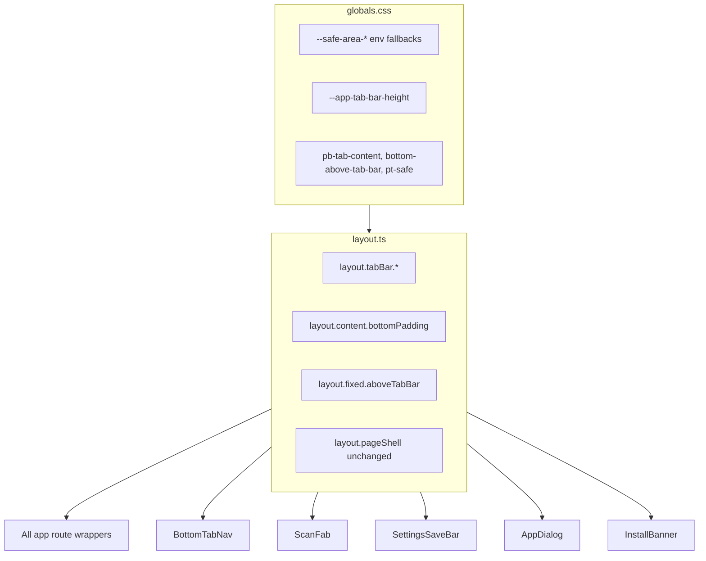

# WO01 — Native Shell & Safe Areas (Planning)

**Deliverables (this phase):**

- [docs/implementation/web/PR-WO01.md](docs/implementation/web/PR-WO01.md) — WR-format spec (audit, file changes, tests, manual QA, acceptance, findings template)
- [.cursor/plans/pr_wo01_native_shell_safe_areas.plan.md](.cursor/plans/pr_wo01_native_shell_safe_areas.plan.md) — this file (synced Cursor implementation plan)

**Canonical scope:** [web_optimization_sprint_68cb0f71.plan.md](web_optimization_sprint_68cb0f71.plan.md) WO01 section + WO01 sharpened decisions (16 locked, rounds 1–3).

**Depends on:** WR10 (goal-pathway) merged to `main`; full merge gate green from `calsnap-web/`:

```bash
pnpm lint && pnpm test && pnpm build && pnpm test:integration && pnpm test:e2e
```

**Downstream:** WO02 (PWA launch), WO03 (tab blur + sheet polish) both depend on WO01 tokens.

---

## Sharpened decisions (locked 2026-07-01)

| # | Question | **Resolved answer** | Rationale |
|---|----------|---------------------|-----------|
| 1 | Bottom padding layering | **Pages only** — remove shell `pb-20`; every app route uses `layout.content.bottomPadding` via `pageShell` | Eliminates double-padding stack (~176px today); single scroll inset per route |
| 2 | Dark `themeColor` | **`darkColors.background` (#000000)** | Edge-to-edge dark shell; avoids green status-bar flash in standalone |
| 3 | AppDialog safe-area | **Pad `DialogContent` bottom when `sheet=true`** | No consumer uses `footer` prop; children hold CTAs |
| 4 | Settings scroll padding | **Conditional** — `bottomPadding` normally; `bottomPaddingWithSaveBar` when `form.isDirty` | Avoid excess scroll when save bar hidden |
| 5 | E2E `/log` route | **Best-effort** — merge-blocking stays login/onboarding/dashboard/settings | Matches WR07 pattern for scan/progress/analytics |
| 6 | Onboarding top safe-area | **Defer** — add `pt-safe` only if iPhone standalone QA shows notch overlap | No tab bar; lower WO01 risk |
| 7 | Install banner spacing | **`pt-safe` on `InstallPromptBanner` wrapper only** | Scoped to install UX; no global shell top padding |
| 8 | Tab bar height source | **CSS var `--app-tab-bar-height`** = measured row (`min-h-11` + `py-2` + border) + `--safe-area-bottom`; `layout.ts` exports class strings referencing var | One numeric source for fixed chrome + page padding |
| 9 | Forbidden-class guard | **PR checklist + manual grep in `final-gate`** — no ESLint rule in WO01 | ESLint copy guard remains WO05/WR07 P3 deferral |
| 10 | `/scan` bottom padding | **Same `layout.content.bottomPadding` as other tab routes** | Scan is a tab; no special-case token |

**No open sharpen questions remain.**

### Round 3 (2026-07-01)

| # | Decision | Locked |
|---|----------|--------|
| 11 | Scroll padding | Tab height + **1rem** |
| 12 | Light themeColor | **Keep primary** |
| 13 | Forbidden grep | Include **pb-28** + raw **pb-[** |
| 14 | E2E tab bar | **Extend dashboard test** (merge-blocking) |
| 15 | PR-WO01 timing | **Scaffold now** — [PR-WO01.md](../../docs/implementation/web/PR-WO01.md) authored |
| 16 | Centered dialogs | **Out of scope** |

---

## Current baseline (audit inputs)

| Gap | Evidence today |
|-----|----------------|
| No safe-area / viewport-fit | Zero `env(safe-area-inset-*)` or `viewportFit` in `calsnap-web/app/layout.tsx` |
| Static light `themeColor` only | `viewport.themeColor: lightColors.primary` — no dark variant |
| No `black-translucent` status bar | `appleWebApp` lacks `statusBarStyle` |
| Ad-hoc bottom spacing | `pb-20` shell, `pb-24`/`pb-28` pages, `bottom-16`/`bottom-20` fixed chrome |
| Double padding risk | Shell `pb-20` **and** page `pb-24` stack (~176px) |
| `pageShell` partial adoption | Dashboard/settings use `layout.pageShell`; log/progress/analytics/scan use raw `mx-auto max-w-lg px-4` |
| Settings save bar sm bug | `sm:bottom-0` overlaps tab bar on wider viewports |
| ScanFab dashboard-only | Already true — only dashboard imports `ScanFab` |
| AppDialog sheets | No safe-area bottom padding; no consumer uses `footer` prop |
| Install banner | No top safe-area spacing under `viewport-fit: cover` |

**Out of scope (locked):** tab blur, splash/maskable icons, skeletons, forms/keyboard, query tuning, Serwist changes, view transitions, PageHeader/large titles, overscroll rubber-band (WO03).

**Design rule (locked):** One source of truth for bottom spacing — **no new** `pb-20` / `pb-24` / `bottom-16` / `bottom-20` in page files after WO01. Post-merge **manual grep** (PR checklist + `final-gate` todo) must return zero hits in `app/` and `components/` (except token definitions in `layout.ts` / `globals.css`). No ESLint rule in WO01.

---

## Proposed token architecture



### `lib/design/layout.ts`

| Export | Purpose |
|--------|---------|
| `layout.tabBar.height` | Documented constant: 44px row (`min-h-11`) + vertical padding — used in tests/docs |
| `layout.tabBar.nav` | Class string for `<nav>` — includes safe-area bottom padding |
| `layout.fixed.aboveTabBar` | Fixed-position offset for FAB + settings save bar |
| `layout.content.bottomPadding` | Page scroll clearance above tab bar + safe area |
| `layout.content.bottomPaddingWithSaveBar` | Settings dirty state — tab bar + save bar + safe area |
| `layout.pageShell` | Unchanged; pages compose `cn(layout.pageShell, layout.content.bottomPadding, …)` |

**No convenience helper** — explicit `cn()` at call sites (grep-friendly).

### `app/globals.css`

- `:root` — `--safe-area-*: env(safe-area-inset-*, 0px)`
- `--app-tab-bar-content-height` — `min-h-11` + `py-2` + border ≈ **61px**
- `--app-tab-bar-height` — `calc(content-height + safe-area-bottom)`
- `--app-save-bar-height` — save bar block (~56–60px)
- Utilities: `pt-safe`, `pb-tab-content`, `bottom-above-tab-bar`

### `app/layout.tsx`

- `viewportFit: 'cover'`
- Dual `themeColor`: light `primary`, dark `background` (#000)
- `appleWebApp.statusBarStyle: 'black-translucent'`

---

## File-by-file changes

### Foundation

- `lib/design/layout.ts` — tabBar/content/fixed exports
- `app/globals.css` — safe-area vars + utilities
- `app/layout.tsx` — viewport + meta

### Fixed chrome

- `BottomTabNav.tsx` — `layout.tabBar.nav`
- `ScanFab.tsx` — `layout.fixed.aboveTabBar`
- `settings/page.tsx` — save bar `layout.fixed.aboveTabBar`; remove `sm:bottom-0`; conditional content padding

### App shell

- `(app)/layout.tsx` — **remove `pb-20`**

### Route migrations (all branches)

- `dashboard/page.tsx`, `log/page.tsx`, `log/[mealId]/page.tsx`, `scan/page.tsx`, `scan/edit/[mealId]/page.tsx`, `progress/page.tsx`, `analytics/page.tsx`, `settings/page.tsx`

### Sheets + install banner

- `AppDialog.tsx` — `DialogContent` bottom pad when `sheet=true`
- `InstallPromptBanner.tsx` — `pt-safe` on banner wrapper only

---

## Implementation order

1. Prereq gate → 2. Tokens → 3. Viewport/meta → 4. Fixed chrome → 5. Shell → 6. Routes → 7. Sheets/banner → 8. Grep → 9. Tests → 10. PR-WO01.md

---

## Tests

**Unit:** `tests/unit/layout-safe-area.test.ts` — token exports, safe-area refs, 0px fallback.

**E2E:** extend `viewport-320.spec.ts` — dashboard tab bar visible + content coexist (merge-blocking); `/log` best-effort.

**Manual:** iPhone standalone — tab bar, FAB, settings save bar, weigh-in sheet, install banner; Android best-effort.

---

## Acceptance criteria

- WR10 merged; merge gate green before/after
- Viewport-fit + dual themeColor + black-translucent
- All app tab routes on `pageShell` + `bottomPadding`; shell has no bottom padding
- Zero forbidden spacing classes (manual grep)
- Settings save bar fixed above tab bar; conditional dirty padding
- Unit + E2E green (17+ E2E); PR-WO01.md complete

See [wo01_native_shell_safe_areas_5ccf4f16.plan.md](wo01_native_shell_safe_areas_5ccf4f16.plan.md) for full findings matrix, manual QA table, and PR-WO01 section outline.
