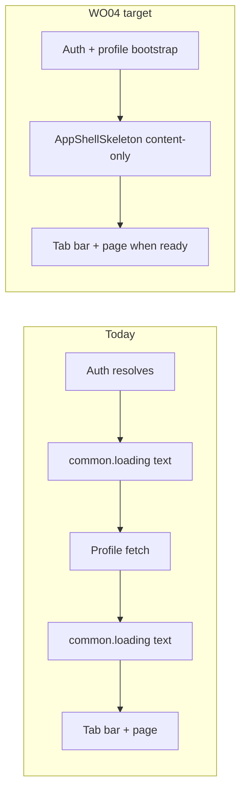

# WO04 — Loading States & Auth Bootstrap

**Deliverables (planning phase):**

- [docs/implementation/web/PR-WO04.md](docs/implementation/web/PR-WO04.md) — WR/WO-format spec (audit, sharpened decisions, file changes, tests, acceptance)
- [.cursor/plans/pr_wo04_loading_bootstrap.plan.md](.cursor/plans/pr_wo04_loading_bootstrap.plan.md) — synced Cursor implementation plan

**Canonical scope:** [web_optimization_sprint_68cb0f71.plan.md](.cursor/plans/web_optimization_sprint_68cb0f71.plan.md) WO04 section, narrowed per user lock (no scan skeleton, no `*Skeleton` migration, no profile prefetch).

**Depends on:** WO01 (`4ea0500`) + WO02 (`c2ab40f`) + WO03 (`6e1a511`) merged to `main`.

**Baseline merge gate** (from `calsnap-web/`):

```bash
pnpm lint && pnpm test && pnpm build && pnpm test:integration && pnpm test:e2e
```

Post-WO03 unit baseline: **216 tests** (39 files); E2E **18 specs** unchanged.

---

## Problem summary



| Area | Current | Target |
|------|---------|--------|
| App auth gate | Text in [`app/(app)/layout.tsx`](calsnap-web/app/(app)/layout.tsx) | `AppShellSkeleton` — dashboard-shaped, **no tab bar** until `ready` |
| Login / signup | Text in [`login/page.tsx`](calsnap-web/app/(auth)/login/page.tsx), [`signup/page.tsx`](calsnap-web/app/(auth)/signup/page.tsx) | `AuthFormSkeleton` inside existing auth card shell |
| Onboarding gate | Text in [`onboarding/layout.tsx`](calsnap-web/app/(onboarding)/layout.tsx) + [`onboarding/page.tsx`](calsnap-web/app/(onboarding)/onboarding/page.tsx) | `OnboardingStepSkeleton` (progress bar + card) |
| Settings | Single `h-96` pulse block in [`settings/page.tsx`](calsnap-web/app/(app)/settings/page.tsx) | Title + **3×** `SectionCardSkeleton` (Profile, Macro, Units) |
| Meal detail / edit | Inline `animate-pulse` in [`log/[mealId]/page.tsx`](calsnap-web/app/(app)/log/[mealId]/page.tsx), [`scan/edit/[mealId]/page.tsx`](calsnap-web/app/(app)/scan/edit/[mealId]/page.tsx) | Shared `MealDetailSkeleton` (both loading branches on edit route) |
| Shared primitive | Ad-hoc `animate-pulse` + `bg-cs-muted/20` | [`components/design/Skeleton.tsx`](calsnap-web/components/design/Skeleton.tsx) — pulse gated by `useReducedMotion()` |

**Explicitly out of scope:**

- Migrating existing dashboard/progress `*Skeleton` exports
- Profile prefetch or new fetch paths in [`auth-context.tsx`](calsnap-web/lib/auth/auth-context.tsx)
- **Scan capture skeleton** — deferred; app layout gates auth; no visible bootstrap delay on `/scan`
- Skipping/coordinating dashboard page skeleton after bootstrap (see decision #13)
- New E2E specs

---

## Sharpened decisions (locked for WO04)

| # | Decision | Resolved |
|---|----------|----------|
| 1 | App shell bootstrap surface | `AppShellSkeleton` composes **existing** dashboard skeleton exports; `layout.pageShell` + `layout.content.bottomPadding` |
| 2 | Tab bar during bootstrap | **Never render** `BottomTabNav` / `InstallPromptBanner` until `ready === true` |
| 3 | Layout gate condition | Single check: `if (!ready) return <AppShellSkeleton />` — drop redundant `loading \|\| !user` |
| 4 | `useRequireAuth` loading | `profile.isPending` while `user` exists (not only `isLoading`); **no prefetch** |
| 5 | `Skeleton.tsx` pulse | `animate-pulse` when `!useReducedMotion()`; static fill when reduced motion |
| 6 | Settings skeleton sections | Page title + **3× `SectionCardSkeleton`** only (Profile, Macro, Units) — **not** Notifications/Data/About/Account |
| 7 | Meal detail skeleton API | `MealDetailSkeleton` with `variant: 'detail' \| 'edit'` and `showPhoto?: boolean` (default `true`) |
| 8 | Auth skeleton placement | `AuthFormSkeleton` replaces page children only; [`(auth)/layout.tsx`](calsnap-web/app/(auth)/layout.tsx) card chrome unchanged |
| 9 | Onboarding skeleton layout | Progress bar + card + footer placeholders; **defensive** `OnboardingStepSkeleton` on page **and** layout |
| 10 | `common.loading` on gates | **Zero** on app/auth/onboarding gates; keep for submit states (`auth.login.submitting`, etc.) |
| 11 | Unit tests | `tests/unit/skeleton.test.ts` — reduced-motion class + smoke renders |
| 12 | E2E delta | **0** new specs |
| 13 | Dashboard double skeleton | **Accept** — `AppShellSkeleton` at bootstrap, then unchanged dashboard page skeletons while queries load; gates-only scope |
| 14 | Scan route | **Defer entirely** — no `ScanCaptureSkeleton` in WO04 |
| 15 | Edit route non-results phase | Replace inline pulse with `MealDetailSkeleton variant="edit" showPhoto={false}` |
| 16 | Gate skeleton a11y | `aria-busy="true"` on gate skeleton root wrappers only; no new copy keys; inner decorative blocks `aria-hidden` where appropriate |
| 17 | Settings pulse / reduced motion | **Accept mismatch** — `SettingsPageSkeleton` uses `SectionCardSkeleton` as-is; do not migrate `SectionCardSkeleton` |
| 18 | Meal detail title layout | `MealDetailSkeleton` includes title placeholder; loaded page keeps separate `<header><h1>` (unchanged) |
| 19 | Profile bootstrap flag | `Boolean(user) && profile.isPending` only — layout gates on `!ready`; no `isFetching` broadening |
| 20 | Unit test nav assert | **Merge-blocking** — `AppShellSkeleton` must not render `common.nav.main` navigation landmark |

### Sharpen round 2 rationale (2026-07-01)

| Choice | Why |
|--------|-----|
| 3 settings sections | Master-plan alignment + minimal diff; lower sections are smaller and paint fast — full 7-section mirror is unnecessary layout-shift insurance |
| Accept double skeleton | Same visual shape (dashboard blocks); avoiding it needs bootstrap context shared into pages — violates gates-only scope |
| Defer scan | Auth gate is upstream; scan has no query bootstrap delay worth a dedicated skeleton |
| Replace both edit pulses | DRY + consistent meal-route UX; `showPhoto={false}` covers `phase !== 'results'` slim state |
| Defensive onboarding page skeleton | Cheap insurance against layout/page race; consistent skeleton UX if layout gate ever relaxes |

### Sharpen round 3 rationale (2026-07-01)

| Choice | Why |
|--------|-----|
| `aria-busy` only | Removes visible loading text without hiding state from assistive tech; avoids new copy keys / hidden `common.loading` in DOM |
| Accept settings pulse mismatch | Gates-only lock forbids `SectionCardSkeleton` migration; one settings screen inconsistency is acceptable vs duplicating section markup |
| Skeleton includes meal title | Matches current loading branch; loaded `<header><h1>` unchanged — minimal diff |
| `isPending` only | `!ready` is the real layout gate; `isPending` closes the enable gap without prolonging skeleton on background refetch |
| Required nav unit assert | Cheap regression test for core WO04 invariant (no phantom tab bar during bootstrap) |

---

## Implementation plan

### 1. `Skeleton.tsx` primitive

New [`calsnap-web/components/design/Skeleton.tsx`](calsnap-web/components/design/Skeleton.tsx):

```tsx
'use client';
// Skeleton({ className }) → cn('rounded bg-cs-muted/20', !reducedMotion && 'animate-pulse', className)
```

Gates-only — do **not** change [`SectionCard.tsx`](calsnap-web/components/design/SectionCard.tsx) or dashboard/progress `*Skeleton` files.

### 2. `AppShellSkeleton`

New [`calsnap-web/components/app/AppShellSkeleton.tsx`](calsnap-web/components/app/AppShellSkeleton.tsx):

- Compose unchanged: `DashboardHeaderSkeleton`, `CalorieRingCardSkeleton`, `MacroBarCardSkeleton`, `TodaysMealsSectionSkeleton`, `DailySummaryFooterSkeleton`, `WeightTrendMiniChartSkeleton`
- Mirror [`dashboard/page.tsx`](calsnap-web/app/(app)/dashboard/page.tsx) loading branch
- **No** tab bar, install banner, or ScanFab

### 3. `useRequireAuth` single-skeleton bootstrap

[`calsnap-web/lib/auth/auth-context.tsx`](calsnap-web/lib/auth/auth-context.tsx):

```ts
const profileBootstrapping = Boolean(user) && profile.isPending;
const loading = authLoading || profileBootstrapping;
```

[`calsnap-web/app/(app)/layout.tsx`](calsnap-web/app/(app)/layout.tsx): `if (!ready)` → content-only shell with `AppShellSkeleton` on `<main aria-busy="true">`.

### 4. Auth gate skeletons

[`AuthFormSkeleton`](calsnap-web/components/auth/AuthFormSkeleton.tsx) → login + signup (`if (loading || user)`); root wrapper `aria-busy="true"`.

### 5. Onboarding gate skeletons

[`OnboardingStepSkeleton`](calsnap-web/components/onboarding/OnboardingStepSkeleton.tsx) → onboarding layout **and** onboarding page (defensive); root `aria-busy="true"`.

### 6. Settings skeleton

[`SettingsPageSkeleton`](calsnap-web/components/settings/SettingsPageSkeleton.tsx): title + **3×** `SectionCardSkeleton`.

### 7. `MealDetailSkeleton`

[`MealDetailSkeleton`](calsnap-web/components/meal-log/MealDetailSkeleton.tsx):

| Variant | Blocks |
|---------|--------|
| `detail` | Title placeholder (loaded page keeps separate `<header><h1>`), photo (`aspect-[4/3]`), 2–3 macro row stubs |
| `edit` + `showPhoto={true}` | Title, photo, form block (`h-24`) — `mealQuery.isLoading` |
| `edit` + `showPhoto={false}` | Title, form block only — `scanner.phase !== 'results'` |

Wire [`log/[mealId]/page.tsx`](calsnap-web/app/(app)/log/[mealId]/page.tsx) (`variant="detail"`) and [`scan/edit/[mealId]/page.tsx`](calsnap-web/app/(app)/scan/edit/[mealId]/page.tsx) (both branches).

---

## Design contract

### Bootstrap state machine

| State | `ready` | UI (app routes) |
|-------|---------|-----------------|
| Auth pending | `false` | `AppShellSkeleton` |
| No user (redirecting `/login`) | `false` | `AppShellSkeleton` |
| User + profile pending | `false` | `AppShellSkeleton` |
| User + onboarding incomplete | `false` | `AppShellSkeleton` |
| User + onboarded | `true` | Tab bar + children → page may show own data skeletons |

### Residual risks

| Risk | Notes |
|------|-------|
| Dashboard double skeleton | **Accepted** — document in PR-WO04 §7; WO05 perf sign-off if LCP concern |
| Settings lower sections pop-in | **Accepted** — 3 core sections only |
| Settings `SectionCardSkeleton` always pulses | **Accepted** — gates-only; no `SectionCardSkeleton` migration |
| Scan flash | **Deferred** — fix-only in future PR if device QA finds issue |

---

## Tests

- **Unit:** `tests/unit/skeleton.test.ts` (~5–7 tests); 216 → ~222
  - `Skeleton` omits `animate-pulse` when reduced motion mocked
  - Smoke render: `AppShellSkeleton`, `AuthFormSkeleton`, `MealDetailSkeleton`
  - **Merge-blocking:** `AppShellSkeleton` does not render `navigation` named `copy('common.nav.main')`
- **E2E:** 18 specs unchanged; no loading-text selectors

---

## Acceptance criteria

- [x] `Skeleton.tsx` + reduced-motion gating
- [x] `AppShellSkeleton` content-only; `!ready` gate in `(app)/layout`
- [x] Auth/onboarding gates: skeletons, no `common.loading` text
- [x] Settings: title + 3 `SectionCardSkeleton`
- [x] `MealDetailSkeleton` on detail + both edit-route branches
- [x] `useRequireAuth` uses `profile.isPending`; no prefetch
- [x] Dashboard/progress `*Skeleton` exports untouched
- [x] Scan skeleton **not** added
- [x] Gate skeleton roots use `aria-busy="true"` (no visible loading text)
- [x] Unit test: `AppShellSkeleton` has no tab nav landmark
- [x] `PR-WO04.md` + README updated

---

## Implementation order

1. Merge gate baseline → PR-WO04 §2
2. `Skeleton.tsx` → `AppShellSkeleton` → `useRequireAuth` + `(app)/layout`
3. `AuthFormSkeleton` → login/signup
4. `OnboardingStepSkeleton` → layout + page
5. `SettingsPageSkeleton` → settings
6. `MealDetailSkeleton` → meal detail + scan edit (both branches)
7. `skeleton.test.ts` → full merge gate
8. `PR-WO04.md` + README
