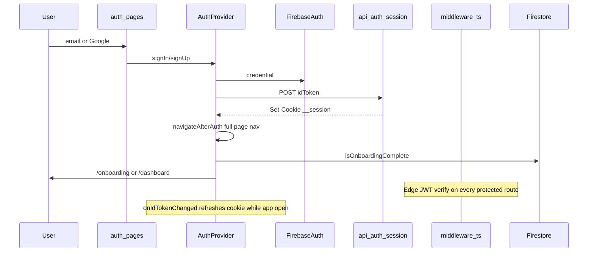

# WR02 — Auth, Session & Onboarding

**Sprint:** Post-build review PR 2 ([REVIEW-MASTER-PLAN.md](docs/implementation/web/REVIEW-MASTER-PLAN.md))  
**Depends on:** [PR-WR01.md](docs/implementation/web/PR-WR01.md) (merge gate green, E2E helpers)  
**Reviews:** [PR-W02.md](docs/implementation/web/PR-W02.md) original W02 acceptance criteria  
**Mode:** Planning only — no code until approved

---

## Locked decisions (sharpen-plan, 2026-06-30)

| Decision | Choice | Rationale |
|----------|--------|-----------|
| Session cookie (WR02-SESS-01) | **Migrate to `createSessionCookie` / `verifySessionCookie`** | Cookie `maxAge` (5d) must match verifiable session lifetime; raw ID tokens expire ~1h |
| E2E sign-out helper | **Navigate to `/settings` → click Sign out** | Exercises real user path; copy key `settings.account.signOut` is stable |
| 320px / keyboard audit | **Manual spot-check only** on `/login`, `/signup`, `/onboarding`; document in PR-WR02.md | WR07 owns merge-blocking Playwright viewport matrix |
| Auth error mapping scope | **Login/signup essentials only** | Map: `invalid-credential`, `email-already-in-use`, `weak-password`, `too-many-requests`, `network-request-failed`; reuse existing Google mappings in `firebaseAuthErrorMessage` |
| Imperial/metric tests | **Unit test only** (P2 if time) | `saveProfileFromDraft` preserves `useImperialForHeight` + `heightCm`; E2E stays on defaults |
| Edge session verify (round 2) | **Keep jose/JWKS on Edge** — update `session-edge.ts` for Admin session-cookie JWTs | `verifySessionCookie` is Node-only; middleware stays Edge-compatible |
| Emulator session (round 2) | **Emulator fallback: raw ID token POST + existing emulator decode** | `createSessionCookie` often unsupported in Auth emulator; E2E unchanged |
| Firestore gate failure (round 2) | **Document only** — catch → `/onboarding` stays; defer UX fix to residual risks | Avoid scope creep; behavior is safe (restrictive) |
| E2E error coverage (round 2) | **Returning-user login only** — auth errors via unit tests | Minimal merge-blocking E2E surface |
| Google sign-off timing (round 2) | **Parallel to merge** — CI green merges; sign-off recorded in PR-WR02.md before sprint closes | WR08 re-validates production |
| checkRevoked (round 3) | **Middleware: false; API routes: true** | Fast edge gate; revocation enforced on privileged server routes |
| Session POST env detect (round 3) | **Server-side emulator flag** (`FIREBASE_AUTH_EMULATOR_HOST` / admin init) — not client body hint | Server decides createSessionCookie vs ID-token path |
| Edge dual verify (round 3) | **Try session-cookie JWT first, then ID-token** in `session-edge.ts` | Single middleware supports emulator + production cookies |
| Implementation order (round 3) | **Audit-then-fix** — baseline → audit checklist → P0/P1 fixes → tests → final gate | Findings doc drives fixes; no premature coding |
| WR02-SESS-02 (round 3) | **P2 if confirmed** — unify projectId fallback; not merge-blocking | Only matters when env unset |

---

## Current architecture (baseline)



**Post-sprint fixes already on `main`** (audit starting point, not re-implement):
- `d3dba44` — Google popup/redirect strategy, `navigateAfterAuth`, redirect singleton
- `fdb6194` — `/__/auth/*` proxy, `resolve-auth-domain.ts`, min age 16
- `444b6f6` — body-metric normalize/validate on step advance
- `ee134a0` — `HeightInputFields.tsx`, `layout.pageShell` overflow fixes

---

## Phase 0 — Pre-flight (before any edits)

Run merge gate from `calsnap-web/` and record counts in [PR-WR02.md](docs/implementation/web/PR-WR02.md):

```bash
pnpm lint && pnpm test && pnpm build && pnpm test:integration && pnpm test:e2e
```

**Expected baseline (from WR01):** 184 unit tests, 11 integration, 1 E2E (`happy-path.spec.ts`).

---

## Phase 1 — Systematic audit

Walk UI → hook → service → repository → API for each scope area. Log every finding with ID `WR02-{AREA}-{NN}`, severity P0–P3, and status.

### 1.1 Email auth + session cookie

| File | Audit focus |
|------|-------------|
| [app/(auth)/login/page.tsx](calsnap-web/app/(auth)/login/page.tsx) | Form submit, error display, loading states |
| [app/(auth)/signup/page.tsx](calsnap-web/app/(auth)/signup/page.tsx) | Same; password `minLength={6}` |
| [lib/auth/auth-context.tsx](calsnap-web/lib/auth/auth-context.tsx) | `establishSession`, `onIdTokenChanged`, email sign-in path |
| [app/api/auth/session/route.ts](calsnap-web/app/api/auth/session/route.ts) | Cookie flags, token type stored |
| [lib/auth/session-edge.ts](calsnap-web/lib/auth/session-edge.ts) | Edge JWT `exp` check vs cookie `maxAge` |
| [lib/auth/verify-api-session.ts](calsnap-web/lib/auth/verify-api-session.ts) | API route parity with middleware |
| [middleware.ts](calsnap-web/middleware.ts) | Matcher coverage, redirect matrix |

**Checklist:**
- [ ] Signup → `POST /api/auth/session` → `__session` httpOnly cookie set
- [ ] Login → same; middleware allows `/dashboard` on next navigation
- [ ] Logout → `DELETE /api/auth/session` + Firebase `signOut`
- [ ] Unauthenticated `/dashboard` → `/login`
- [ ] Authenticated `/login` → `/` (root resolver)
- [ ] Session cookie `maxAge` (5 days) aligns with token verification semantics

**Initial finding (verify during audit):**

| ID | Sev | Finding |
|----|-----|---------|
| WR02-SESS-01 | **P1** | Cookie stores raw Firebase **ID token** (~1h JWT `exp`) with 5-day `maxAge`. Middleware rejects expired JWT while cookie persists → user bounces to `/login` after ~1h idle. `onIdTokenChanged` only refreshes while client is active. |
| WR02-AUTH-01 | **P1** | Email login/signup surfaces raw `err.message` (e.g. `Firebase: Error (auth/invalid-credential)`) — deferred from WR01 |
| WR02-SESS-02 | P2 | `session-edge.ts` projectId fallback `demo-calsnap` vs `next.config.ts` default `calsnap-web` — **locked: fix if confirmed, not merge-blocking** |

**P1 fix direction for WR02-SESS-01:** Migrate to Firebase Admin `createSessionCookie(idToken, { expiresIn: '5d' })` in POST route (production). **POST env detect (locked):** branch on server emulator config (`FIREBASE_AUTH_EMULATOR_HOST` / admin init) — not client hint. **Edge (locked):** [session-edge.ts](calsnap-web/lib/auth/session-edge.ts) tries session-cookie JWT verify first, then ID-token verify (jose/JWKS). **Node API (locked):** `verifySessionCookie(id, checkRevoked: true)` in [verify-api-session.ts](calsnap-web/lib/auth/verify-api-session.ts). **Middleware (locked):** `checkRevoked: false` for performance. **Emulator (locked):** POST stores raw ID token when emulator active. Keep `onIdTokenChanged` refresh.

**P1 fix direction for WR02-AUTH-01 (locked scope):** Extract `lib/auth/firebase-auth-errors.ts` with `mapFirebaseAuthError(error)`. Map login/signup codes only: `auth/invalid-credential`, `auth/email-already-in-use`, `auth/weak-password`, `auth/too-many-requests`, `auth/network-request-failed` → new keys in [lib/copy/auth.ts](calsnap-web/lib/copy/auth.ts). Reuse existing Google mappings. Wrap `signInWithEmail` / `signUpWithEmail` to throw mapped messages; login/signup pages keep generic fallback only.

### 1.2 Google OAuth

| File | Audit focus |
|------|-------------|
| [lib/auth/google-sign-in-strategy.ts](calsnap-web/lib/auth/google-sign-in-strategy.ts) | Popup desktop / redirect mobile UA |
| [lib/auth/google-redirect.ts](calsnap-web/lib/auth/google-redirect.ts) | Strict Mode singleton |
| [lib/auth/auth-bootstrap.ts](calsnap-web/lib/auth/auth-bootstrap.ts) | Early redirect consume |
| [lib/auth/auth-redirect-state.ts](calsnap-web/lib/auth/auth-redirect-state.ts) | Session clear gating |
| [lib/firebase/resolve-auth-domain.ts](calsnap-web/lib/firebase/resolve-auth-domain.ts) | localhost → Firebase domain; prod → app host |
| [next.config.ts](calsnap-web/next.config.ts) | `/__/auth/:path*` rewrite |
| [components/auth/SessionErrorBanner.tsx](calsnap-web/components/auth/SessionErrorBanner.tsx) | OAuth error surfacing |

**Checklist:**
- [ ] Desktop emulator: popup flow → session → routing
- [ ] Mobile UA (Playwright device or DevTools): redirect flow
- [ ] Localhost uses Firebase-hosted auth domain (not broken HTTPS localhost handler)
- [ ] Production Vercel: custom domain + `/__/auth` proxy (manual sign-off only)

**CI constraint:** No Google OAuth E2E — document manual QA matrix in PR-WR02.md § Manual sign-off.

### 1.3 Post-auth routing

| File | Audit focus |
|------|-------------|
| [lib/auth/navigate-after-auth.ts](calsnap-web/lib/auth/navigate-after-auth.ts) | `window.location.assign` for cookie visibility |
| [app/page.tsx](calsnap-web/app/page.tsx) | Root resolver |
| [app/(app)/layout.tsx](calsnap-web/app/(app)/layout.tsx) | Client onboarding gate |
| [app/(onboarding)/layout.tsx](calsnap-web/app/(onboarding)/layout.tsx) | Reverse gate (complete → dashboard) |
| [lib/repositories/profile.ts](calsnap-web/lib/repositories/profile.ts) | `isOnboardingComplete`, `saveProfileFromDraft` |

**Checklist:**
- [ ] New user (no profile doc) → `/onboarding`
- [ ] Returning user (`onboardingCompleted: true`) → `/dashboard`, skips wizard
- [ ] Complete user cannot stay on `/onboarding` (layout redirects)
- [ ] Incomplete user cannot stay on `(app)` routes (layout redirects)
- [ ] Firestore read failure behavior documented (both layouts default to onboarding) — **locked: document only, no P1 fix**

### 1.4 Onboarding wizard (5 steps)

| Step | Component | Advance / save |
|------|-----------|----------------|
| 1 welcome | [WelcomeStep.tsx](calsnap-web/components/onboarding/WelcomeStep.tsx) | Continue |
| 2 profile | [ProfileSetupStep.tsx](calsnap-web/components/onboarding/ProfileSetupStep.tsx) | Validate + normalize |
| 3 goal | [GoalSetupStep.tsx](calsnap-web/components/onboarding/GoalSetupStep.tsx) | Goal date 14–730d |
| 4 calorie | [CalorieTargetPreviewStep.tsx](calsnap-web/components/onboarding/CalorieTargetPreviewStep.tsx) | **saveProfileFromDraft** |
| 5 done | [OnboardingDoneStep.tsx](calsnap-web/components/onboarding/OnboardingDoneStep.tsx) | Auto-redirect 2s |

| File | Audit focus |
|------|-------------|
| [lib/onboarding/use-onboarding.ts](calsnap-web/lib/onboarding/use-onboarding.ts) | Step machine, deficit slider 250–500 + 750 unlock |
| [lib/onboarding/validation.ts](calsnap-web/lib/onboarding/validation.ts) | minAgeYears, height/weight ranges |
| [lib/constants.ts](calsnap-web/lib/constants.ts) | `minAgeYears: 16` web delta |

**Checklist:**
- [ ] Profile persists at `users/{uid}/profile/main` with `onboardingCompleted: true`
- [ ] Unit prefs (`useLbsForWeight`, `useImperialForHeight`) saved in doc extras
- [ ] Goal date min 14 days (unit test exists)
- [ ] Deficit slider bounds match W02 spec
- [ ] **minAgeYears 16:** document as intentional web delta — do not change to iOS 18

### 1.5 Imperial/metric inputs + mobile layout

| File | Audit focus |
|------|-------------|
| [HeightInputFields.tsx](calsnap-web/components/design/HeightInputFields.tsx) | ft/in ↔ cm toggle, clamp 120–230 cm |
| [LocalNumberInput.tsx](calsnap-web/components/design/LocalNumberInput.tsx) | Unmount commit (WR01 fix) |
| [lib/utilities/unit-formatters.ts](calsnap-web/lib/utilities/unit-formatters.ts) | Round-trip helpers |
| [lib/design/layout.ts](calsnap-web/lib/design/layout.ts) | `pageShell` 320px constraints |

**Checklist:**
- [ ] Imperial height edit → save → profile doc `heightCm` correct (unit test)
- [ ] Lbs weight round-trip through draft → Firestore (existing unit-formatters tests)
- [ ] 320px viewport: no horizontal scroll on `/login`, `/signup`, `/onboarding` (manual spot-check; full E2E deferred to WR07)
- [ ] Keyboard: email/password/date inputs visible when focused (manual spot-check)

**Test gap to close in WR02:**

| ID | Sev | Finding |
|----|-----|---------|
| WR02-ONB-01 | P2 | No test that `saveProfileFromDraft` preserves `useImperialForHeight: true` + correct `heightCm` |
| WR02-ONB-02 | P3 | E2E `completeOnboarding` uses defaults only — **intentional**; imperial covered by unit test only |

Add unit test in [profile-repository.test.ts](calsnap-web/tests/unit/profile-repository.test.ts) for `saveProfileFromDraft` with `useImperialHeight: true` + correct `heightCm` (P2 if time; not merge-blocking).

### 1.6 Firestore rules

| File | Audit focus |
|------|-------------|
| [firestore.rules](calsnap-web/firestore.rules) | Owner-only `users/{userId}/profile/{profileId}` |
| [tests/integration/profile-firestore.test.ts](calsnap-web/tests/integration/profile-firestore.test.ts) | Owner read/write; cross-user deny |

**Checklist:** Rules match W02; integration tests pass unchanged.

---

## Phase 2 — Fixes (P0/P1 only)

Priority order:

1. **Session durability (WR02-SESS-01)** — **locked:** production `createSessionCookie` + Edge jose session-JWT verify + Node `verifySessionCookie`; emulator ID-token fallback
2. **Auth error mapping (WR02-AUTH-01)** — **locked scope:** 5 login/signup codes + existing Google codes → `lib/copy/auth.ts`
3. **Project ID fallback alignment (WR02-SESS-02)** — **locked P2:** unify if confirmed during audit; not merge-blocking

P2 if time remains: imperial `saveProfileFromDraft` unit test (WR02-ONB-01). No imperial E2E in WR02.

---

## Implementation order (locked, round 3)

1. Run merge gate baseline → record in PR-WR02.md §2
2. Complete audit checklist → findings matrix (no code yet beyond doc scaffold)
3. Fix all P0/P1 (session migration, auth errors)
4. Add unit tests + `login-returning-user.spec.ts` + `signOut` helper
5. Manual 320px spot-check + Google sign-off table (parallel)
6. Run final merge gate → close open P0/P1

**Locked: do not change** `minAgeYears` from 16 to 18 — document under Residual risks (carried from WR01-CONST-01).

---

## Phase 3 — Tests

### Merge-blocking E2E (CI)

New spec: [tests/e2e/login-returning-user.spec.ts](calsnap-web/tests/e2e/login-returning-user.spec.ts)

```typescript
// Pseudocode — uses WR01 helpers
test('login returning user skips onboarding', async ({ page }) => {
  const { email, password } = await createOnboardedUser(page);
  await signOut(page);                    // NEW helper — see below
  await loginWithEmail(page, email, password);
  await waitForDashboard(page);
  await expect(page).not.toHaveURL(/\/onboarding/);
});
```

**Helper additions** in [tests/e2e/helpers/auth.ts](calsnap-web/tests/e2e/helpers/auth.ts):
- `signOut(page)` — **locked:** `gotoAppRoute(page, '/settings')` → click `copy('settings.account.signOut')` → `expect(page).toHaveURL(/\/login/)`
- Export from [helpers/index.ts](calsnap-web/tests/e2e/helpers/index.ts)

No changes to `happy-path.spec.ts` required beyond possible helper import.

**E2E scope (locked):** single spec `login-returning-user.spec.ts` only — no wrong-password or duplicate-email E2E; auth error mapping verified by unit tests.

### Unit tests (merge gate)

| File | Cases |
|------|-------|
| New `firebase-auth-errors.test.ts` | Maps all 5 locked login/signup codes + 3 Google codes → copy strings |
| Session route / edge verify tests | Mock admin auth; assert `createSessionCookie` path; session-edge tries session JWT then ID-token; API uses `checkRevoked: true` |
| P2: profile imperial flag | `saveProfileFromDraft` with `useImperialHeight: true` — unit only, not E2E |

### Manual QA only (production Vercel)

**Timing (locked):** parallel to WR02 merge — CI green is merge gate; manual sign-off recorded in PR-WR02.md before review sprint closes; WR08 re-validates production.

Document in PR-WR02.md § Manual sign-off:

| Scenario | Environment |
|----------|-------------|
| Google popup sign-in | Desktop browser, production domain |
| Google redirect sign-in | Mobile Safari/Chrome, production domain |
| `/__/auth` handler loads | Production custom domain |
| Email signup + onboarding | Production (smoke) |

---

## Phase 4 — Deliverables

### [docs/implementation/web/PR-WR02.md](docs/implementation/web/PR-WR02.md) (create on implementation)

Structure mirrors [PR-WR01.md](docs/implementation/web/PR-WR01.md):

1. Audit checklist (§1) — pass/fail per scope item
2. Baseline merge gate snapshot — before/after counts
3. Findings matrix — all `WR02-*` IDs, P0–P3, status
4. Fix list — file + rationale
5. E2E helper contract updates (`signOut`)
6. Acceptance criteria (checkboxes)
7. Residual risks — minAge 16, Google manual-only, Firestore gate failure UX, session edge cases, P3 deferred
8. Manual Google OAuth sign-off table (production Vercel)
9. Files changed index

### Cursor plan

[.cursor/plans/pr_wr02_auth_onboarding.plan.md](.cursor/plans/pr_wr02_auth_onboarding.plan.md) — this document, synced after implementation.

---

## Acceptance criteria (WR02 complete)

- [ ] Merge gate green before and after
- [ ] Zero open **P0/P1** in auth/session/onboarding scope
- [ ] Email signup/login → session cookie → protected routes work in emulator E2E
- [ ] **New E2E:** returning user login skips onboarding (CI)
- [ ] Google OAuth manual sign-off recorded for production Vercel
- [ ] User-facing auth errors use `lib/copy` (no raw Firebase strings on login/signup)
- [ ] 5-step onboarding saves `users/{uid}/profile/main` with `onboardingCompleted: true`
- [ ] `minAgeYears: 16` documented as intentional web delta
- [ ] `PR-WR02.md` complete with findings matrix + residual risks
- [ ] No real Gemini in CI

---

## Out of scope (locked)

- Password reset, email verification, account deletion (W08 / master plan)
- Full 320px E2E matrix (WR07)
- Full keyboard matrix (WR07)
- iOS tree changes
- Changing minAge to 18

---

## Risk notes

| Risk | Mitigation |
|------|------------|
| `createSessionCookie` changes break emulator E2E | **Locked:** emulator ID-token fallback path; E2E uses emulators unchanged |
| Edge session JWT verify differs from ID token | **Locked:** dual verify in `session-edge.ts` — session cookie first, ID token fallback |
| checkRevoked latency on middleware | **Locked:** `checkRevoked: false` on Edge; `true` on API routes only |
| Google OAuth untestable in CI | Explicit manual sign-off; popup/redirect logic covered by unit tests for UA detection only |
| Settings-dependent `signOut` E2E helper | Stable copy key `settings.account.signOut` already in use |
| Session migration touches middleware + API routes | Single PR; run full merge gate; verify `happy-path` + new login spec |
