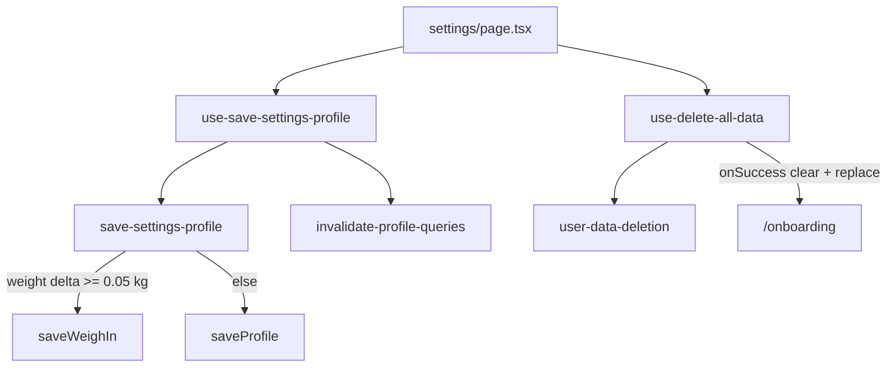

# WR06: Settings & Data Lifecycle

**Canonical plan:** [.cursor/plans/pr_wr06_settings_lifecycle.plan.md](pr_wr06_settings_lifecycle.plan.md) (this file)  
**Depends on:** [PR-WR05.md](../../docs/implementation/web/PR-WR05.md) (8 E2E / 6 specs green)  
**Reviews:** [PR-W08.md](../../docs/implementation/web/PR-W08.md)

---

## All sharpen questions — resolved

| # | Question | **Resolved answer** |
|---|----------|---------------------|
| 1 | Save E2E field | **Activity `moderatelyActive` → `sedentary`** — avoids weigh-in path + plateau sheet |
| 2 | Save E2E assertion | **Calorie target only** (`toBeLessThan`) — not macros |
| 3 | Target flake fallback | **Primary: `toBeLessThan`** — onboarding leaves `moderatelyActive`; sedentary multiplier strictly lower. Fallback `veryActive` + `toBeGreaterThan` only if CI flakes (document in residual risks) |
| 4 | Post-save navigation | **Bottom tab** scoped to `common.nav.main` → link `common.nav.dashboard` |
| 5 | `gotoSettings` | **`gotoAppRoute('/settings')`** + assert heading `settings.title` |
| 6 | Save success signal | **Save bar hidden** (`settings.saveProfile` absent, 15s); **`scrollIntoViewIfNeeded`** before click |
| 7 | Delete E2E depth | **UI only** — confirm → `/onboarding` → `completeOnboarding` → `/dashboard` |
| 8 | Delete dialog role | **`alertdialog`** (Radix AlertDialog) — not `dialog` |
| 9 | Delete confirm button | **`common.button.delete`** inside `alertdialog`; wait title `settings.deleteDialog.title` first |
| 10 | Delete seeding | **No** meal/photo seed |
| 11 | Delete Firestore assert | **No** Node helper — session kept implicitly (re-onboard without `/login`) |
| 12 | Delete isolation | **`createOnboardedUser` per test**; Playwright `workers: 1` |
| 13 | Copy fix scope | **`page.tsx` only** — simplify `dataErrorMessage` with `isError` + copy keys |
| 14 | CSV profile section | **No** — meals + weigh-ins only (iOS parity, P3 residual) |
| 15 | Delete integration test | **Defer** WR06-SET-02 to residual risks |
| 16 | Export / About / sign-out E2E | **Audit-only** — sign-out in `login-returning-user` |
| 17 | Red baseline | **Fix-first** before WR06 scope |
| 18 | Analytics re-audit | **No** unless merge gate regression |
| 19 | `changeActivityLevel` type | **`ActivityLevel`** union from `@/lib/models/activity-level` |
| 20 | Merge gate local env | **`JAVA_HOME`** OpenJDK 21 for Firebase emulators (macOS Homebrew path in PR-WR06 §2) |
| 21 | CI E2E retries | **2 retries** in CI per [playwright.config.ts](../../calsnap-web/playwright.config.ts) |

**No open questions remain.**

---

## Baseline

```bash
cd calsnap-web
pnpm lint && pnpm test && pnpm build && pnpm test:integration && pnpm test:e2e
```

**Expected:** 201 unit (38 files), 11 integration (5 files), **8 E2E / 6 specs**  
**Target:** **10 E2E / 8 spec files** (+2)

If baseline fails: fix blockers first, record counts, then proceed.

**Local emulator note:** `JAVA_HOME=/opt/homebrew/opt/openjdk@21/libexec/openjdk.jdk/Contents/Home` (macOS Homebrew).

---

## Architecture



---

## Audit checklist → [PR-WR06.md](../../docs/implementation/web/PR-WR06.md) §1

| ID | Check | Expected |
|----|-------|----------|
| S1–S13 | Sections, recalc, macros, units, reminders, export, delete, sign-out, about, feedback | Pass (code review) |
| S14 | Copy-only errors | **Fixed** — WR06-SET-01 |
| S15 | Mobile layout classes | Pass — 320px → WR07 |
| S16 | Plateau from settings weight save | Manual QA only |
| S17–S18 | Deficit not editable; empty name OK | Pass by design |
| S19 | Analytics / Gemini / 320px | Out of scope |
| S20 | New E2E specs | **Fixed** — WR06-E2E-01/02 |

---

## Findings matrix

| ID | Sev | Finding | Action |
|----|-----|---------|--------|
| WR06-SET-01 | **P1** | Raw `error.message` on settings page | Copy-only + simplify `dataErrorMessage` |
| WR06-E2E-01 | **P1** | No settings save → dashboard E2E | `settings-save-updates-target.spec.ts` |
| WR06-E2E-02 | **P1** | No delete-all → re-onboard E2E | `delete-all-reonboard.spec.ts` |
| WR06-SET-02 | P2 | No `deleteAllUserData` integration test | Residual |
| WR06-SET-03 | P2 | CSV not E2E | Manual §8 |
| WR06-SET-04 | P2 | Plateau from settings weight save | Manual; no weight in save E2E |
| WR06-SET-05 | P2 | 320px settings matrix | WR07 |
| WR06-SET-06 | P3 | CSV no profile section | iOS parity residual |
| WR06-SET-07 | P3 | Reminder prefs unused in banner | WR04-PROG-07 |
| WR06-SET-08 | P3 | Storage delete `console.warn` only | WR08 |

---

## P1: Copy fix — [page.tsx](../../calsnap-web/app/(app)/settings/page.tsx)

| Location | Resolved implementation |
|----------|-------------------------|
| `handleSave` catch | `setSaveError(copy('settings.error.saveFailed'))` only |
| Save banner | `saveMutation.isError ? copy('settings.error.saveGeneric') : saveError` |
| Export / delete | `exportMutation.isError ? copy('settings.error.exportFailed') : null` and same for delete; `dataErrorMessage = exportError ?? deleteError` |
| Profile load | `copy('settings.error.profileLoad')` only |

Remove all `error instanceof Error ? error.message` branches.

---

## E2E helpers — [settings.ts](../../calsnap-web/tests/e2e/helpers/settings.ts)

```typescript
import type { ActivityLevel } from '@/lib/models/activity-level';

// gotoSettings(page)
//   gotoAppRoute(page, '/settings')
//   expect(page.getByRole('heading', { name: copy('settings.title') })).toBeVisible()

// changeActivityLevel(page, level: ActivityLevel)
//   page.getByRole('radio', { name: copy(`common.activity.${level}.label`) }).check()

// saveSettingsProfile(page)
//   const btn = page.getByRole('button', { name: copy('settings.saveProfile') })
//   await btn.scrollIntoViewIfNeeded()
//   await btn.click()
//   await expect(btn).toBeHidden({ timeout: 15_000 })

// openDeleteAllDialog(page)
//   await page.getByRole('button', { name: copy('settings.data.deleteAll') }).click()
//   await expect(page.getByRole('alertdialog')).toBeVisible()
//   await expect(page.getByText(copy('settings.deleteDialog.title'))).toBeVisible()

// confirmDeleteAllData(page)
//   await page.getByRole('alertdialog')
//     .getByRole('button', { name: copy('common.button.delete') }).click()
//   await expect(page).toHaveURL(/\/onboarding/, { timeout: 15_000 })

// gotoDashboardFromTab(page)
//   await page.getByRole('navigation', { name: copy('common.nav.main') })
//     .getByRole('link', { name: copy('common.nav.dashboard') }).click()
//   await expect(page).toHaveURL(/\/dashboard/)
```

Export from [index.ts](../../calsnap-web/tests/e2e/helpers/index.ts). Reuse `readDashboardCalorieTarget` from [weigh-in.ts](../../calsnap-web/tests/e2e/helpers/weigh-in.ts).

---

## Merge-blocking E2E

### 1. [settings-save-updates-target.spec.ts](../../calsnap-web/tests/e2e/settings-save-updates-target.spec.ts)

1. `createOnboardedUser(page)`
2. `previousTarget = await readDashboardCalorieTarget(page)`
3. `gotoSettings(page)` → `changeActivityLevel(page, 'sedentary')`
4. `saveSettingsProfile(page)`
5. `gotoDashboardFromTab(page)`
6. `await expect.poll(() => readDashboardCalorieTarget(page), { timeout: 15_000 }).toBeLessThan(previousTarget)`

### 2. [delete-all-reonboard.spec.ts](../../calsnap-web/tests/e2e/delete-all-reonboard.spec.ts)

1. `createOnboardedUser(page)`
2. `gotoSettings` → `openDeleteAllDialog` → `confirmDeleteAllData`
3. `completeOnboarding(page)` — no `/login` visit
4. `expect(page).toHaveURL(/\/dashboard/)`

---

## Flake mitigations (locked)

- `expect.poll` 15s on dashboard target
- Activity radio: `sedentary` label = `"Sedentary"`
- Delete: `alertdialog` + title before confirm
- Tab nav scoped via `common.nav.main`
- `scrollIntoViewIfNeeded` on Save
- No weight edits in settings-save spec
- CI: 2 retries on E2E failures
- `JAVA_HOME` for local emulator runs

---

## Final sharpen — stress test (no open questions)

| Risk | Mitigation (locked) |
|------|---------------------|
| Delete button → `Deleting…` | Click `Delete` immediately after title visible |
| Target reader ambiguity | Same regex as WR04 weigh-in helper |
| Re-onboard same uid | `completeOnboarding` creates fresh profile doc |
| Form remount after save | Wait for Save bar hidden |
| Sedentary ≈ previous target | Unlikely; `veryActive` fallback in residual risks only |

**Verdict:** Implementation-ready.

---

## Implementation order

1. Baseline gate → `PR-WR06.md` §2 skeleton (**fix-first if red**)
2. Audit S1–S20 → findings matrix
3. P1 copy fix (`page.tsx`)
4. `settings.ts` helpers + barrel
5. Two E2E specs
6. P2 only if trivial; else defer
7. Final gate → complete `PR-WR06.md`, update [PR-WR01.md](../../docs/implementation/web/PR-WR01.md) §5

---

## Deliverables

- [docs/implementation/web/PR-WR06.md](../../docs/implementation/web/PR-WR06.md) — §1–§9 (WR05 structure)

---

## Acceptance criteria

- [ ] Merge gate green before and after (8→10 E2E)
- [ ] Zero open P0/P1 in settings scope
- [ ] S14 + S20 fixed; S1–S13 Pass
- [ ] Copy-only settings errors + simplified `dataErrorMessage`
- [ ] Two new E2E specs green
- [ ] WR05 analytics untouched unless regression
- [ ] No real Gemini in CI

---

## Out of scope

- CSV download E2E, macro dashboard E2E, Firestore delete Node assertions
- `deleteAllUserData` integration test
- 320px / keyboard matrix (WR07)
- Analytics re-audit (WR05)

---

## Residual risks (expected §7)

- CSV export not E2E-covered; no profile doc section (iOS parity)
- `deleteAllUserData` no integration test
- Sedentary `toBeLessThan` flake → fallback `veryActive` documented only if needed
- Reminder weekday/hour unused in banner (WR04-PROG-07)
- Plateau sheet from settings weight save (manual)
- 320px settings layout → WR07
- Storage delete best-effort warnings → WR08
