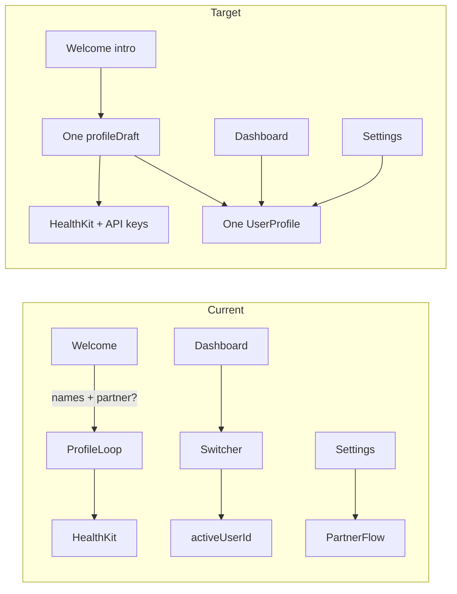

# Single-User Local-Only Corrective Implementation Plan

## Context

The addendum in [`pr-single-user-local-only-addendum.md`](pr-single-user-local-only-addendum.md) reverses an earlier dual-profile MVP assumption. The codebase still encodes that model in several places:

| Area | Current state | Target state |
|------|---------------|--------------|
| Onboarding | `profileA`/`profileB`, partner loop, required names | One `profileDraft`, no names required |
| Dashboard | `ProfileSwitcherView`, `@AppStorage(activeUserId)` | Single resolved profile, neutral header |
| Settings | Partner add/remove, multi-profile picker, required name on save | Optional display name only, single-user copy |
| Analytics | Profile segmented picker + `activeUserId` | Same single-profile resolution (collateral) |

`RootView` already gates on profile existence via `@Query` — no change needed beyond documenting the “one profile is canonical” rule.



---

## Phase 0 — Promote addendum to source of truth (docs)

Before code changes, update specs so future PRs inherit the corrected direction.

**Add**
- Copy or link addendum into [`docs/implementation/PR-single-user-local-only-addendum.md`](docs/implementation/PR-single-user-local-only-addendum.md) (canonical location under `docs/implementation/`).

**Amend implementation records**
- [`docs/implementation/PR-02.md`](docs/implementation/PR-02.md): Remove dual-user loop, `activeUserId` on save, partner/name acceptance criteria; add addendum acceptance criteria (one profile, no required name, local-only welcome copy).
- [`docs/implementation/PR-03.md`](docs/implementation/PR-03.md): Remove `ProfileSwitcherView`, `activeUserId` ownership, dual-profile acceptance criteria; add neutral-header / no-switcher criteria.
- [`docs/implementation/PR-08.md`](docs/implementation/PR-08.md): Remove partner add/remove, `AddPartnerFlowView`; add optional display-name field and single-user data-deletion copy.

**Amend master spec** (targeted edits only — PR2/3/8 sections in [`docs/technical-spec.md`](docs/technical-spec.md)):
- PR2 (~L803–823): single-profile onboarding; welcome = intro + local-only note; no partner names.
- PR3 (~L870–936): remove profile switcher; dashboard header = greeting or neutral “Today”.
- PR8 (~L1234–1235): remove partner add/remove; optional display name in Settings.

Add a short “Product direction” note at the top of the PR2 section stating: **one install = one person, local-only, no auth, no in-app switching**.

---

## Phase 1 — Shared single-profile resolution (repository invariant)

Introduce one resolution path used by all view models instead of scattering `resolveActiveProfile(from:activeUserId:)`.

**Non-negotiable:** `fetchPrimaryProfile` must use an explicit `createdAt` sort — not `fetchAll(...).first` without ordering. This turns the single-user rule into an enforceable repository contract.

**[`CalSnap/Core/Repositories/UserProfileRepository.swift`](CalSnap/Core/Repositories/UserProfileRepository.swift)**

Add with a doc comment on the method and a brief file-level note:

```swift
/// Returns the single canonical local profile: earliest `createdAt` wins.
/// Multiple profiles are legacy/debug data only; callers must not expose switching UI.
func fetchPrimaryProfile(context: ModelContext) throws -> UserProfile? {
    var descriptor = FetchDescriptor<UserProfile>(
        sortBy: [SortDescriptor(\.createdAt, order: .forward)]
    )
    descriptor.fetchLimit = 1
    return try context.fetch(descriptor).first
}
```

Optionally refactor `fetchAll` to share the same `SortDescriptor(\.createdAt, order: .forward)` so all repository reads are consistent.

**Legacy-data rule (code + tests)**
- Document in repository: when two profiles exist, the app always uses the one with the earliest `createdAt`; extra profiles are ignored by product UI.
- Add an automated regression test (see Phase 1 tests below) — not manual-only.

**Remove duplicated private `resolveActiveProfile` helpers** from:
- [`DashboardViewModel`](CalSnap/Features/Dashboard/DashboardViewModel.swift)
- [`SettingsViewModel`](CalSnap/Features/Settings/SettingsViewModel.swift)
- [`AnalyticsViewModel`](CalSnap/Features/Analytics/AnalyticsViewModel.swift)

**`AppStorageKey.activeUserId`**
- Stop writing it in onboarding.
- Remove all view-layer `@AppStorage(AppStorageKey.activeUserId)` usages.
- Remove the constant once no references remain (including [`UserDataDeletionService`](CalSnap/Core/Services/UserDataDeletionService.swift) after audit).

### Phase 1 tests — new [`CalSnapTests/PrimaryProfileResolutionTests.swift`](CalSnapTests/PrimaryProfileResolutionTests.swift)

**`testLegacyMultiProfileStoreResolvesEarliestCreatedProfile`**
1. Insert two `UserProfile` records with distinct `createdAt` values (older = canonical).
2. Assert `fetchPrimaryProfile` returns the older profile.
3. Load dashboard, settings, and analytics VMs via `loadToday(context:)` / `load(context:)` and assert each resolves the **same** profile id.
4. Assert no VM exposes `hasSecondProfile` or a partner concept (properties removed).

This test encodes the legacy-data rule so “first profile only” is not a manual-checklist assumption.

---

## Phase 1b — Service-layer audit (non-UI active-user assumptions)

A second pass beyond view/VM cleanup. Per-user **keys keyed by profile UUID** (plateau snooze, weigh-in reminders, HK toggles) remain valid for the single canonical profile — the audit is about removing **multi-profile selection** logic, not deleting per-user AppStorage helpers.

| File | Audit action |
|------|--------------|
| [`UserDataDeletionService`](CalSnap/Core/Services/UserDataDeletionService.swift) | `deleteAllUserData` may keep looping all profiles (cleans legacy stores); remove `activeUserId` key cleanup once constant is deleted. Confirm `deleteUserData` is only called for primary profile from Settings. |
| [`NotificationManager`](CalSnap/Core/Services/NotificationManager.swift) | Per-`userId` reminder APIs stay; callers (`DashboardView`, `SettingsViewModel`) schedule/cancel for **primary profile id only** — remove multi-profile `for profile in profiles` loops. |
| [`SettingsViewModel`](CalSnap/Features/Settings/SettingsViewModel.swift) | “Sync Now” imports HK weight for primary profile only; remove any `activeUserId` parameter from `load` / sync paths. |
| [`HealthKitService`](CalSnap/Core/Services/HealthKitService.swift) | Write gating via AppStorage toggles is global — no change unless copy references “active user”. |
| [`WeighInService`](CalSnap/Core/Services/WeighInService.swift) | Writes scoped by `profile.id` — confirm callers pass primary profile id. |
| [`MealRepository`](CalSnap/Core/Repositories/MealRepository.swift) / [`WeighInRepository`](CalSnap/Core/Repositories/WeighInRepository.swift) | `for userId:` params stay; all call sites use primary profile id. |
| [`DataExportService`](CalSnap/Core/Services/DataExportService.swift) | Export uses primary profile’s meals/weigh-ins only; no “export active user vs partner” branching. |
| [`Constants.swift`](CalSnap/Core/Utilities/Constants.swift) | Remove `AppStorageKey.activeUserId` after grep-clean. |

Update [`docs/implementation/PR-08.md`](docs/implementation/PR-08.md) spec language: replace “active-user sync” with “primary-profile HealthKit sync”.

---

## Phase 2 — PR2: Onboarding simplification

Primary file: [`CalSnap/Features/Onboarding/OnboardingViewModel.swift`](CalSnap/Features/Onboarding/OnboardingViewModel.swift)

### ViewModel collapse

| Remove | Replace with |
|--------|--------------|
| `profileA`, `profileB`, `currentProfileIndex` | `var profileDraft = ProfileDraft()` |
| `activeProfile` get/set over A/B | Direct `profileDraft` access (or thin `binding(_:)` on `profileDraft`) |
| `hasPartner`, `activeProfileTitle` | Static step titles |
| Dual-user branches in `advance()` / `goBack()` | Linear flow: welcome → profileSetup → goalSetup → caloriePreview → healthKit → apiKeys → done |
| `saveProfiles` batch + `activeUserId` write | `saveProfile(context:)` inserting exactly one profile |
| Name checks in `canAdvance` / `validationMessage` | Welcome: always true; profileSetup: DOB only |

`saveProfile` should persist `UserProfile(name: "")` when no display name is provided (`makeUserProfile` already uses `draft.trimmedName`).

### Step view updates

**[`WelcomeStepView.swift`](CalSnap/Features/Onboarding/WelcomeStepView.swift)**
- Remove both name text fields.
- Add: app name, tagline, short on-device/local-storage note, Continue (handled by nav bar).
- Welcome step no longer blocks on input.

**[`ProfileSetupStepView.swift`](CalSnap/Features/Onboarding/ProfileSetupStepView.swift)**
- Remove name `TextField`.
- Title: `"Your profile"` (static).

**[`GoalSetupStepView.swift`](CalSnap/Features/Onboarding/GoalSetupStepView.swift)**
- `"Goals for \(name)"` → `"Your goals"`.

**[`CalorieTargetPreviewStepView.swift`](CalSnap/Features/Onboarding/CalorieTargetPreviewStepView.swift)**
- `"Calorie target for \(name)"` → `"Your calorie target"`.

**[`OnboardingStepContent.swift`](CalSnap/Features/Onboarding/OnboardingStepContent.swift)**
- Remove `.id("…-\(currentProfileIndex)")` modifiers (no longer needed without profile switching).

### Copy requirements (blank `UserProfile.name`)

When display name is empty, UI must use neutral copy — no personalized or partner-oriented strings:

| Surface | Empty-name copy | With display name |
|---------|-----------------|-------------------|
| Dashboard header (primary line) | `"Today"` | `"Good morning, {name}"` (time-of-day prefix + name) |
| Onboarding profile setup title | `"Your profile"` | unchanged (name not collected in onboarding) |
| Onboarding goal setup title | `"Your goals"` | unchanged |
| Onboarding calorie preview title | `"Your calorie target"` | unchanged |
| Settings name field label | `"Display name (optional)"` | same |

Update [`DashboardViewModel.greeting`](CalSnap/Features/Dashboard/DashboardViewModel.swift): when `name.isEmpty`, return `"Today"` instead of a time-of-day-only greeting (`"Good morning"`). Date remains on the secondary line via `formattedDate`.

### Tests — [`CalSnapTests/OnboardingViewModelTests.swift`](CalSnapTests/OnboardingViewModelTests.swift)

| Test | Updated behavior |
|------|------------------|
| `testOnboardingValidation` | Missing DOB-age fields block profileSetup; empty `name` does **not** block |
| `testGoalDateMinimum` | Unchanged |
| `testProfilePersistence` | Draft with empty name persists; assert `saved.name == ""` (or omit name assertion) |

---

## Phase 3 — PR3: Dashboard simplification

### Delete
- [`CalSnap/Features/Dashboard/ProfileSwitcherView.swift`](CalSnap/Features/Dashboard/ProfileSwitcherView.swift) — remove from target.

### [`DashboardViewModel`](CalSnap/Features/Dashboard/DashboardViewModel.swift)

- Change `loadToday(context:activeUserId:)` → `loadToday(context:)`.
- Resolve profile via `fetchPrimaryProfile`.
- Remove `hasSecondProfile` and the `profiles` array (no multi-profile notification loop).
- Update `greeting` per copy requirements: empty name → `"Today"`.

### [`DashboardView.swift`](CalSnap/Features/Dashboard/DashboardView.swift)

Remove:
- `@AppStorage(AppStorageKey.activeUserId)`
- `onChange(of: activeUserId)`, `syncActiveUserIdIfNeeded`, `suppressActiveUserIdReload`
- `onProfileSwitch` callback
- Multi-profile loop in `scheduleReminderIfNeeded` — schedule for single `activeProfile` only
- `presentWeighInSheet` active-user switching branch

### [`DashboardContentView.swift`](CalSnap/Features/Dashboard/DashboardContentView.swift)

- Remove toolbar `ProfileSwitcherView`.
- Replace `activeUserId: String` param with `userId: UUID` from `viewModel.activeProfile?.id` for `MealScannerView`, or pass profile id at navigation time.
- Remove `onProfileSwitch` parameter.

### [`MealScannerView.swift`](CalSnap/Features/MealScanner/MealScannerView.swift)

- Prefer `userId: UUID` over `activeUserId: String` (cleaner single-user API). Update call sites and previews.

### Tests — [`CalSnapTests/DashboardViewModelTests.swift`](CalSnapTests/DashboardViewModelTests.swift)

- Update all `loadToday(context:activeUserId:)` calls to `loadToday(context:)`.
- `testLoadTodayResetsPlateauAlertWhenNoProfile`: empty store → no profile → alert cleared (unchanged intent).

---

## Phase 4 — PR8: Settings simplification

### Delete
- [`CalSnap/Features/Settings/AddPartnerFlowView.swift`](CalSnap/Features/Settings/AddPartnerFlowView.swift) — remove from target.

### [`SettingsViewModel.swift`](CalSnap/Features/Settings/SettingsViewModel.swift)

Remove:
- `hasSecondProfile`, `partnerProfile`, `deletePartnerData`
- `load(context:activeUserId:)` → `load(context:)` using `fetchPrimaryProfile`
- Name requirement in `canSaveProfile` and `profileValidationMessage`

Retain optional name in `ProfileDraft` / save path — empty string is valid.

### [`SettingsView.swift`](CalSnap/Features/Settings/SettingsView.swift)

Remove:
- `@AppStorage(activeUserId)`, `profileSelection` picker for multi-profile
- `secondUserSection`, `showAddPartner`, `showRemovePartnerConfirmation`, `removePartner()`
- Segmented “Editing” picker when `profiles.count > 1`
- “Delete All Data for Both Users” button and alert

Update profile section:
- Label: **Display name (optional)** with footnote: “Used for greetings and export metadata. Leave blank for neutral copy.”
- Place name field at top of profile section (optional, editable, clearable).

Update data section copy:
- “Delete All My Data” → confirm single local profile deletion (no “both users” language).
- Delete confirmation alert text: single-user scoped.

`reloadToken` should depend on `profileDataRevision` only (not `activeUserId`).

### Tests — [`CalSnapTests/SettingsTests.swift`](CalSnapTests/SettingsTests.swift)

Existing three tests remain valid.

**Required addition — `testEmptyDisplayNameIsValidAndPersists`**
1. Seed a primary `UserProfile` in memory.
2. Load `SettingsViewModel`; set `draft.name = ""` with otherwise valid biometrics/macros.
3. Assert `canSaveProfile == true` and `profileValidationMessage == nil`.
4. Call `saveProfile(context:)`; fetch primary profile; assert `name == ""`.

---

## Phase 5 — Collateral cleanup (same PR)

These are not named in the addendum but must change to avoid leaving dead multi-user UI/state.

**[`AnalyticsView.swift`](CalSnap/Features/Analytics/AnalyticsView.swift) + [`AnalyticsViewModel.swift`](CalSnap/Features/Analytics/AnalyticsViewModel.swift)**
- Remove profile segmented picker and `@AppStorage(activeUserId)`.
- `load(context:)` resolves primary profile same as dashboard.

**[`UserDataDeletionService`](CalSnap/Core/Services/UserDataDeletionService.swift)**
- Keep `deleteUserData` / `deleteAllUserData` as-is (still useful for scoped delete).
- Update any alert copy in Settings that references “both users”.

**[`CalSnap.xcodeproj/project.pbxproj`](CalSnap.xcodeproj/project.pbxproj)**
- Unregister deleted Swift files.

---

## Phase 6 — Verification

**Automated**
```bash
DEVELOPER_DIR=/Applications/Xcode.app/Contents/Developer \
  xcodebuild -scheme CalSnap \
  -destination 'platform=iOS Simulator,name=iPhone 17' test
```

**Manual simulator checklist**
1. Fresh install: onboarding completes without entering a name; exactly one `UserProfile` in store.
2. Relaunch: skips onboarding.
3. Dashboard: no profile switcher; header shows `"Today"` when name empty.
4. Settings: optional display name saves; clearing name works; no partner section.
5. Set display name → dashboard greeting includes name.
6. Meal scan / log still associates meals with the single profile id.
7. Analytics tab: no profile picker.
8. Legacy data: simulator with 2 profiles shows earliest-`createdAt` profile only, no switcher (also covered by `testLegacyMultiProfileStoreResolvesEarliestCreatedProfile`).

---

## Suggested commit sequence (single corrective PR)

1. `docs: add single-user local-only addendum and update PR-02/03/08 specs`
2. `refactor: add deterministic fetchPrimaryProfile with createdAt sort`
3. `test: add primary profile resolution and legacy multi-profile regression tests`
4. `refactor: simplify onboarding to single-profile flow`
5. `refactor: remove dashboard profile switcher and activeUserId`
6. `refactor: remove partner settings flow; optional display name`
7. `refactor: audit services for multi-profile assumptions; simplify analytics`
8. `test: add empty display name settings test; update onboarding and dashboard tests`

---

## Acceptance criteria (addendum-aligned)

- CalSnap behaves as single-user from onboarding through settings
- Onboarding does not require a user name
- Normal operation persists exactly one profile
- `fetchPrimaryProfile` uses `createdAt` ascending with `fetchLimit = 1` (repository invariant)
- Legacy two-profile stores resolve the earliest-created profile consistently across dashboard, settings, and analytics
- Dashboard has no profile-switching UI; empty name shows `"Today"`
- Settings allow editing an optional display name; empty name saves successfully (unit tested)
- Neutral copy table satisfied for onboarding step titles
- No product copy references partner or dual-user flows
- Service layer audited: no active-user selection outside primary-profile resolution
- `UserProfile.name` remains in schema; empty string default during onboarding
- Full unit test suite passes

---

## Explicitly out of scope

- SwiftData schema migration to remove `name` or enforce single-profile constraint
- Cleanup utility to delete extra legacy profiles (defensive `first` only)
- Auth, cloud sync, or multi-device features
- Design system polish (PR9)
- Daily log reminders (PR10)
