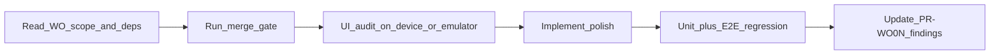
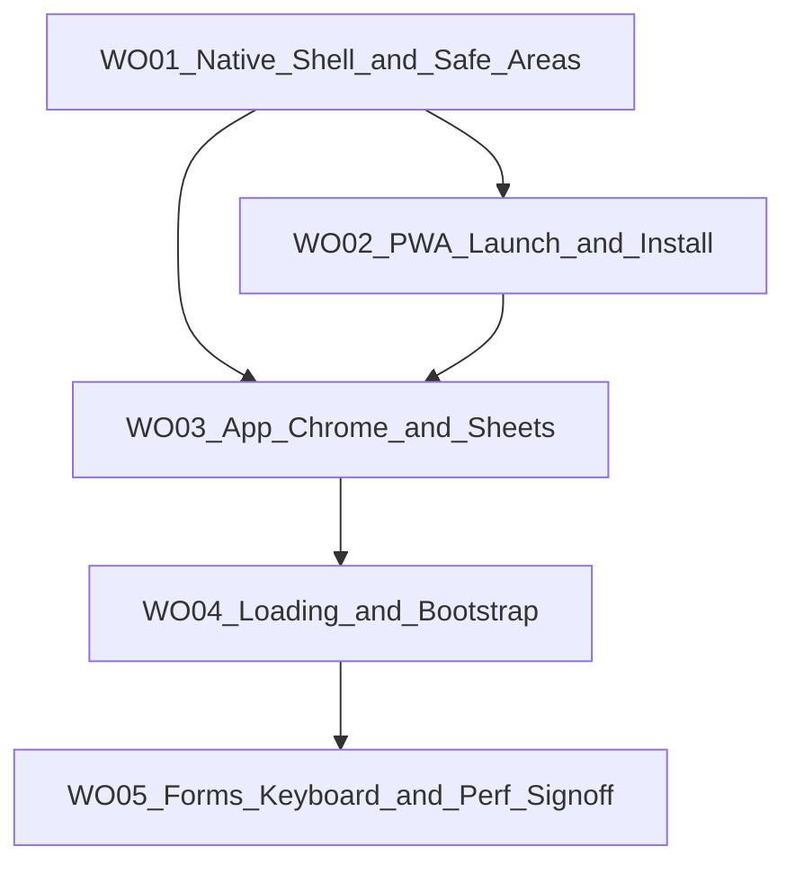

# CalSnap Web — Frontend Optimization Sprint (WO01–WO05)

## Purpose

The W01–W10 build sprint and WR01–WR08 review sprint delivered a feature-complete, installable PWA. This sprint closes the **native-feel gap** on mobile Safari/Chrome: safe areas, launch chrome, app shell polish, consistent loading UX, keyboard/forms, and a documented performance baseline.

**In scope:** UI/UX polish for the current feature set; PWA install/launch improvements that do not add offline meal logging or cached authenticated pages.

**Out of scope (locked — same as [REVIEW-MASTER-PLAN.md](docs/implementation/web/REVIEW-MASTER-PLAN.md)):**
Web Push/FCM, offline meal logging, swipe-to-delete, settings appearance toggle, 3-tab IA redesign, USDA fallback, historical meal log, HealthKit, per-uid Gemini rate limiting, new routes/features.

**IA decision (locked):** Keep the existing **5-tab bar** (Dashboard, Log, Scan, Progress, Settings). Analytics remains reachable from Progress.

---

## Sharpened decisions (locked 2026-07-01)


| Question                  | Choice                                                                                                                  | Rationale                                                                                                                                  |
| ------------------------- | ----------------------------------------------------------------------------------------------------------------------- | ------------------------------------------------------------------------------------------------------------------------------------------ |
| **WR10 blocker**          | **Land goal-pathway before WO01 starts**                                                                                | WR10 touches onboarding/settings/layout — same files as WO01–WO04; merge first to avoid conflict churn                                     |
| **View Transitions**      | **Defer entirely**                                                                                                      | Unsaved-work guard on `/scan` + React state make route transitions high-risk for low gain; tab bar + sheet polish deliver most native feel |
| **iOS splash scope**      | **Minimal — 2–3 common iPhone sizes + dark variants**                                                                   | Covers majority of devices; full Apple matrix is diminishing returns; generic fallback acceptable on rare sizes                            |
| **Input 16px (iOS zoom)** | **All form inputs on mobile** (`text-base sm:text-sm`)                                                                  | iOS zoom triggers on any focused input under 16px — partial coverage leaves surprise zoom in settings/auth                                 |
| **Query tuning**          | **Conservative — `refetchOnWindowFocus: false` globally; keep 30s staleTime**                                           | Tab switches shouldn't flash spinners; longer stale is a data-freshness tradeoff — tune per-query only if spinners observed in WO05 audit  |
| **Safe-area QA gate**     | **CSS/layout unit tests + mandatory real-device iOS standalone sign-off; extend 320px E2E for layout regressions only** | Playwright cannot emulate `env(safe-area-inset-*)`; injecting fake vars in CI gives false confidence                                       |


### Sharpened decisions — round 2 (locked 2026-07-01)


| Question                      | Choice                                                                                | Rationale                                                                                                                                    |
| ----------------------------- | ------------------------------------------------------------------------------------- | -------------------------------------------------------------------------------------------------------------------------------------------- |
| **PageHeader / large titles** | **Defer**                                                                             | Touches every tab route + copy/layout; tab bar + sheet polish deliver most native feel without large-title reflow risk                       |
| **Overscroll rubber-band**    | **Disable in standalone/PWA only**                                                    | Preserves normal browser scroll on desktop/mobile Safari; removes "webby" bounce in installed app via `display-mode: standalone` media query |
| **Profile prefetch (WO04)**   | **Skip**                                                                              | Skeleton-only bootstrap is sufficient; prefetch adds fetch-path complexity and race conditions with auth gate                                |
| **AppShellSkeleton shape**    | **Content-only — no phantom tab bar**                                                 | Avoids flashing tab chrome before auth confirmed; keeps E2E selectors stable (tab bar appears only after `ready === true`)                   |
| **Manual QA sprint gate**     | **WO05 documents checklist with Pending rows — code-complete without operator block** | Matches WR sprint pattern; operator signs WR07/WR08 rows asynchronously on production devices                                                |
| **Lighthouse a11y scope**     | **Fix all audit failures found; scores informative only**                             | Failures are actionable regressions; numeric score targets remain non-blocking per WR07 policy                                               |


### Sharpened decisions — round 3 (locked 2026-07-01)


| Question                       | Choice                                                                                  | Rationale                                                                                              |
| ------------------------------ | --------------------------------------------------------------------------------------- | ------------------------------------------------------------------------------------------------------ |
| **pageShell consolidation**    | **All app routes** in WO01 — analytics, log, progress, meal detail included             | Single padding source; ad-hoc `mx-auto max-w-lg pb-24` is how safe-area bugs return                    |
| **Settings save bar position** | **Always above tab bar + safe area — remove `sm:bottom-0`**                             | Tab bar is fixed on all breakpoints; flush save bar on sm+ overlaps tab chrome                       |
| **ScanFab scope**              | **Dashboard only**                                                                      | Scan is already a tab; duplicate FAB elsewhere adds clutter                                            |
| **PWA asset pipeline (WO02)**  | **`pnpm generate:pwa-assets` script (sharp) — commit generated PNGs**                     | Reproducible from apple-touch-icon; avoids hand-maintained image drift                                 |
| **Skeleton refactor (WO04)**   | **Gates-only — do not migrate existing \*Skeleton exports**                             | Minimizes WO04 diff and E2E risk; dashboard/progress skeletons already work                            |
| **Android safe-area QA**       | **iPhone standalone required; Android Chrome PWA best-effort documented**                 | iOS is primary native-feel target; Android verified when device available                             |


---

## Prerequisites (before WO01)

1. **Land in-flight work (merge-blocking)** — uncommitted goal-pathway changes ([PR-WR10-goal-pathway.md](docs/implementation/web/PR-WR10-goal-pathway.md)) **must merge to `main` before WO01 begins** — no parallel work on layout/onboarding/settings files.
2. **Green merge gate** from `calsnap-web/`:
  ```bash
   pnpm lint && pnpm test && pnpm build && pnpm test:integration && pnpm test:e2e
  ```
3. **Create sprint docs** — add [docs/implementation/web/OPTIMIZATION-MASTER-PLAN.md](docs/implementation/web/OPTIMIZATION-MASTER-PLAN.md) mirroring this plan; each WO PR gets its own `PR-WO0N.md` + `.cursor/plans/pr_wo0N_*.plan.md` during its planning phase (same workflow as WR sprint).

---

## Agent workflow (every WO PR)




1. Read this master plan + the WO-specific section + relevant WR residual risks ([PR-WR07.md](docs/implementation/web/PR-WR07.md) §7, [PR-WR08.md](docs/implementation/web/PR-WR08.md) §7).
2. Establish baseline merge gate; record counts before changes.
3. Audit on **320px mobile viewport** and, for WO01–WO02, **iOS Safari standalone** (real device or BrowserStack).
4. Fix all P0/P1 findings in scope; defer P2/P3 to **Residual risks** in `PR-WO0N.md`.
5. Every WO PR must keep **17+ E2E tests green**; add E2E only where listed (WO01 safe-area, WO05 keyboard spot-check optional).
6. No real Gemini in CI.

---

## Dependency graph




WO01 is the foundation — all fixed-position chrome (`BottomTabNav`, `ScanFab`, settings save bar, sheets) depends on shared safe-area tokens. WO02–WO03 can overlap planning but should merge sequentially.

---

## Current gaps (baseline for the sprint)


| Gap                         | Evidence                                                                                                        | Target PR  |
| --------------------------- | --------------------------------------------------------------------------------------------------------------- | ---------- |
| No safe-area handling       | Zero `env(safe-area-inset-*)` / `viewport-fit` in codebase                                                      | WO01       |
| Hard-coded bottom offsets   | `pb-20`, `pb-24`, `bottom-16`, `bottom-20` scattered across app routes                                          | WO01, WO03 |
| Static light `themeColor`   | [app/layout.tsx](calsnap-web/app/layout.tsx) uses `lightColors.primary` only                                    | WO01, WO02 |
| No maskable icons / splash  | [manifest.webmanifest](calsnap-web/public/manifest.webmanifest) `purpose: any` only; WR08-PWA-01 deferred       | WO02       |
| Solid tab bar               | [BottomTabNav.tsx](calsnap-web/components/app/BottomTabNav.tsx) opaque surface, no blur                         | WO03       |
| Sheets lack iOS affordances | [AppDialog.tsx](calsnap-web/components/design/AppDialog.tsx) — no drag handle, no safe-area footer              | WO03       |
| Text-only auth/app gates    | [app/(app)/layout.tsx](calsnap-web/app/(app)/layout.tsx) shows `common.loading` string                          | WO04       |
| Partial skeleton coverage   | Dashboard/progress have skeletons; settings uses one pulse block; auth/onboarding gates are text                | WO04       |
| iOS input zoom risk         | [form-field.ts](calsnap-web/lib/design/form-field.ts) uses `text-sm` (14px)                                     | WO05       |
| No keyboard inset hook      | No `visualViewport` usage                                                                                       | WO05       |
| Lighthouse baseline pending | [PR-WR07.md](docs/implementation/web/PR-WR07.md) §4, [PR-WR08.md](docs/implementation/web/PR-WR08.md) §8 row 18 | WO05       |
| Tab-switch refetch          | [query-client.ts](calsnap-web/lib/queries/query-client.ts) `refetchOnWindowFocus: true`, 30s stale              | WO05       |


---

## WO01 — Native Shell & Safe Areas

**Depends on:** Goal-pathway WIP landed; WR08 complete.

**Objective:** Edge-to-edge standalone layout that respects notches and home indicators on iOS/Android PWA.

### Scope


| Layer             | Key paths                                                                                                                                                                                                                                                                                                                                  |
| ----------------- | ------------------------------------------------------------------------------------------------------------------------------------------------------------------------------------------------------------------------------------------------------------------------------------------------------------------------------------------ |
| Viewport          | [app/layout.tsx](calsnap-web/app/layout.tsx) — add `viewportFit: 'cover'`; dark/light `themeColor` via CSS media or dual meta                                                                                                                                                                                                              |
| Safe-area tokens  | Extend [lib/design/layout.ts](calsnap-web/lib/design/layout.ts) + [app/globals.css](calsnap-web/app/globals.css) with utility classes, e.g. `pb-safe`, `pt-safe`, `bottom-safe-fixed` using `env(safe-area-inset-*)`                                                                                                                       |
| App shell         | [app/(app)/layout.tsx](calsnap-web/app/(app)/layout.tsx) — replace hard `pb-20` with token-driven padding                                                                                                                                                                                                                                  |
| Tab bar           | [components/app/BottomTabNav.tsx](calsnap-web/components/app/BottomTabNav.tsx) — `padding-bottom: env(safe-area-inset-bottom)`                                                                                                                                                                                                             |
| FAB               | [components/dashboard/ScanFab.tsx](calsnap-web/components/dashboard/ScanFab.tsx) — **dashboard only**; position above tab bar + safe area                                                                                                                                                                                                  |
| Settings save bar | [app/(app)/settings/page.tsx](calsnap-web/app/(app)/settings/page.tsx) — **always** above tab bar + safe area on all breakpoints; **remove `sm:bottom-0`**                                                                                                                                                                                  |
| Page content      | **All app routes** → `layout.pageShell` + `layout.content.bottomPadding`: dashboard, log, log/[mealId], scan/edit/[mealId], progress, analytics — eliminate ad-hoc `mx-auto max-w-lg pb-24`                                                                                                                                                |
| Sheets (baseline) | [components/design/AppDialog.tsx](calsnap-web/components/design/AppDialog.tsx) — safe-area padding on bottom sheet footer                                                                                                                                                                                                                  |
| Install banner    | [components/pwa/InstallPromptBanner.tsx](calsnap-web/components/pwa/InstallPromptBanner.tsx) — margin/padding respects top safe area when shown in app shell                                                                                                                                                                               |
| iOS meta          | `appleWebApp.statusBarStyle: 'black-translucent'` in root metadata                                                                                                                                                                                                                                                                         |


### Design contract

- Export `**layout.tabBar.height**` (44px content + safe area) and `**layout.content.bottomPadding**` as Tailwind class strings consumed by all app routes — **single source of truth**; no new magic numbers in page files after this PR.
- Safe-area utilities must degrade gracefully in non-notch browsers (`env()` resolves to `0px`).
- Do **not** change Serwist caching policy or add offline authenticated pages.

### Tests

- **Unit (merge-blocking):** safe-area class builder / layout token snapshot test (new `tests/unit/layout-safe-area.test.ts`) — verify token strings include `env(safe-area-inset-*)` and degrade to `0px`.
- **E2E (merge-blocking):** extend [tests/e2e/viewport-320.spec.ts](calsnap-web/tests/e2e/viewport-320.spec.ts) — assert tab bar and dashboard content visible; no horizontal scroll (layout regression only; **not** a safe-area substitute).
- **Manual (merge-blocking for WO01 sign-off):** real iPhone in **standalone mode** — tab bar, FAB, settings save bar clear of home indicator. **Android Chrome PWA: best-effort** (document in PR-WO01 if device unavailable). Playwright safe-area injection is **out of scope** (false confidence).

### Acceptance criteria

- All app routes scroll content above tab bar + safe area on 320px (flat viewport).
- Standalone iOS on physical device: no clipped CTAs at bottom of dashboard, settings, weigh-in sheet.
- Merge gate green; `PR-WO01.md` with findings matrix.

---

## WO02 — PWA Launch & Install Polish

**Depends on:** WO01 (viewport-fit and theme colors wired).

**Objective:** First-second launch and Add-to-Home-Screen experience matches native app expectations.

### Scope


| Item                 | Key paths                                                                                                                                                                                                                                                                                                                       |
| -------------------- | ------------------------------------------------------------------------------------------------------------------------------------------------------------------------------------------------------------------------------------------------------------------------------------------------------------------------------- |
| Maskable icon        | New `public/icon-maskable-512.png`; update [manifest.webmanifest](calsnap-web/public/manifest.webmanifest) with `purpose: "maskable"` entry (keep existing `any` icons)                                                                                                                                                         |
| Asset script         | Add `pnpm generate:pwa-assets` using **sharp** devDependency — generates maskable icon + splash PNGs from [public/apple-touch-icon.png](calsnap-web/public/apple-touch-icon.png); **commit outputs**; document regen in PR-WO02                                                                                                   |
| Splash screens       | Add `apple-touch-startup-image` link tags in [app/layout.tsx](calsnap-web/app/layout.tsx) for **2–3 common iPhone sizes** (e.g. 1170×2532, 1284×2778) × light + dark — script output; accept iOS generic fallback on other sizes                                                                                                    |
| Manifest polish      | `orientation: "portrait"`, verify `start_url: "/dashboard"`, `display: "standalone"`, `background_color` / `theme_color` aligned with [lib/design/colors.ts](calsnap-web/lib/design/colors.ts)                                                                                                                                  |
| Standalone detection | [lib/pwa/install-storage.ts](calsnap-web/lib/pwa/install-storage.ts) — verify `display-mode: standalone` + `navigator.standalone`; hide install banner reliably                                                                                                                                                                 |
| Install UX           | [InstallPromptBanner.tsx](calsnap-web/components/pwa/InstallPromptBanner.tsx) — safe-area aware; optional subtle entrance animation (respect reduced motion)                                                                                                                                                                    |
| Copy                 | [lib/copy/pwa.ts](calsnap-web/lib/copy/pwa.ts) — refine iOS A2HS instructions if needed after device QA                                                                                                                                                                                                                         |
| SW unchanged         | [app/sw.ts](calsnap-web/app/sw.ts) — **no** navigation caching changes; installability-only policy preserved                                                                                                                                                                                                                    |


### Tests

- Unit: manifest JSON schema sanity test (required fields, icon purposes).
- E2E: existing suite unchanged (PWA install not automatable in CI).
- Manual (required sign-off rows): WR08 §8 rows 13–15 — iOS Safari A2HS, Android Chrome install, standalone opens logged-in dashboard.

### Acceptance criteria

- Android install shows non-cropped icon (maskable).
- iOS launch shows splash (not white flash) before dashboard.
- Install banner hidden in standalone mode.
- `PR-WO02.md` documents device QA evidence placeholders.

---

## WO03 — App Chrome, Tab Bar & Sheets

**Depends on:** WO01 layout tokens; WO02 standalone meta complete.

**Objective:** Visual and interaction patterns that read as iOS-native: translucent tab bar and polished bottom sheets. **View Transitions deferred** (see Sharpened decisions).

### Scope


| Area             | Key paths                                                                                                                                                                                                                                                                             |
| ---------------- | ------------------------------------------------------------------------------------------------------------------------------------------------------------------------------------------------------------------------------------------------------------------------------------- |
| Tab bar material | [BottomTabNav.tsx](calsnap-web/components/app/BottomTabNav.tsx) — `bg-cs-surface/80 backdrop-blur-md` (or similar), hairline top border; active tab uses existing `cs-primary`                                                                                                        |
| Bottom sheets    | [AppDialog.tsx](calsnap-web/components/design/AppDialog.tsx) + [dialog.tsx](calsnap-web/components/ui/dialog.tsx): drag-handle pill (`w-10 h-1 rounded-full bg-cs-border mx-auto mb-3`); sheet slide-up animation tuned for mobile; safe-area footer padding (extends WO01)           |
| Sheet consumers  | [WeighInSheet.tsx](calsnap-web/components/progress/WeighInSheet.tsx), [PlateauAlertSheet.tsx](calsnap-web/components/dashboard/PlateauAlertSheet.tsx), [FoodItemEditSheet.tsx](calsnap-web/components/scanner/FoodItemEditSheet.tsx) — verify footer buttons sit above home indicator |
| Overlay          | Dialog overlay opacity/easing — slightly softer on mobile (`bg-black/30`)                                                                                                                                                                                                             |
| Scan FAB         | [ScanFab.tsx](calsnap-web/components/dashboard/ScanFab.tsx) — shadow/elevation token; **dashboard-only** (unchanged); no overlap with tab bar after WO01 offsets                                                                                                                                               |
| Overscroll       | [globals.css](calsnap-web/app/globals.css) — `overscroll-behavior-y: none` on `body` **when `@media (display-mode: standalone)`** only; leave normal browser overscroll unchanged                                                                                                     |


### Out of scope for WO03

- **View Transitions API** — deferred to post-sprint (unsaved-work guard risk)
- **PageHeader / iOS large titles** — deferred to post-sprint (round 2 sharpen)
- Swipe-to-dismiss sheets (complex Radix extension — defer to residual risks)
- Changing tab count or icons

### Tests

- E2E: all existing specs green; viewport-320 still passes with blurred tab bar.
- Manual: weigh-in sheet + plateau sheet focus trap on mobile.

### Acceptance criteria

- Tab bar reads as floating iOS-style chrome (blur + safe area).
- All sheets show drag handle; primary actions ≥44px and above home indicator.
- Reduced motion disables sheet slide animations.
- `PR-WO03.md` complete.

---

## WO04 — Loading States & Auth Bootstrap

**Depends on:** WO03 app shell stable (padding tokens final).

**Objective:** Eliminate "website loading" flashes; consistent skeleton UX across all routes.

### Scope


| Area               | Current state                                                                                                              | Target                                                                                                                                 |
| ------------------ | -------------------------------------------------------------------------------------------------------------------------- | -------------------------------------------------------------------------------------------------------------------------------------- |
| App auth gate      | Text in [app/(app)/layout.tsx](calsnap-web/app/(app)/layout.tsx)                                                           | `**AppShellSkeleton` — content-only** (dashboard-shaped skeleton, **no phantom tab bar**); tab bar renders only after `ready === true` |
| Auth pages         | Text in [login/page.tsx](calsnap-web/app/(auth)/login/page.tsx), [signup/page.tsx](calsnap-web/app/(auth)/signup/page.tsx) | Auth form skeleton matching page layout                                                                                                |
| Onboarding gate    | Text in [onboarding/layout.tsx](calsnap-web/app/(onboarding)/layout.tsx)                                                   | Onboarding step skeleton (progress bar + card)                                                                                         |
| Settings           | Single pulse block in [settings/page.tsx](calsnap-web/app/(app)/settings/page.tsx)                                         | Multi-section skeleton matching Profile/Macro/Units sections                                                                           |
| Scan               | No dedicated loading                                                                                                       | Minimal scan capture skeleton if query/bootstrap delay exists                                                                          |
| Meal detail / edit | Ad-hoc pulse in [log/[mealId]/page.tsx](calsnap-web/app/(app)/log/[mealId]/page.tsx), edit route                           | Reuse shared `MealDetailSkeleton` component                                                                                            |
| Shared primitive   | —                                                                                                                          | `components/design/Skeleton.tsx` — pulse gated by `useReducedMotion()`; **gates-only** — do not migrate existing `*Skeleton` exports |


**Reuse (do not rewrite in WO04):** Dashboard ([CalorieRingCardSkeleton](calsnap-web/components/design/CalorieRingView.tsx), etc.), Progress ([WeightProgressView.tsx](calsnap-web/components/progress/WeightProgressView.tsx)), Analytics dynamic sections already use [SectionCardSkeleton](calsnap-web/components/design/SectionCard.tsx). Migration of these to `Skeleton.tsx` is **out of scope** (round 3 sharpen).

### Auth bootstrap polish

- [auth-context.tsx](calsnap-web/lib/auth/auth-context.tsx) / `useRequireAuth` — minimize double flash by keeping **content-only skeleton** visible until `ready === true` (no intermediate text state).
- **No profile prefetch** — skeleton-only approach (round 2 sharpen); do not add new fetch paths in WO04.

### Tests

- Unit: `AppShellSkeleton` renders without throwing; snapshot optional.
- E2E: happy-path and login specs still pass (skeletons must not block selectors used by tests).
- No new merge-blocking E2E unless flake discovered.

### Acceptance criteria

- Zero user-visible `common.loading` text on app/auth/onboarding gates (skeleton or null).
- Settings loading mirrors final page structure.
- Cold navigation to dashboard shows structured skeleton within first paint.
- `PR-WO04.md` complete.

---

## WO05 — Forms, Keyboard & Performance Sign-off

**Depends on:** WO01–WO04 merged.

**Objective:** Native form behavior on iOS mobile web; tab-switch performance; close out deferred manual QA from WR07/WR08.

### Scope

#### Forms & keyboard


| Item                | Key paths                                                                                                                                                                                                                                                                                              |
| ------------------- | ------------------------------------------------------------------------------------------------------------------------------------------------------------------------------------------------------------------------------------------------------------------------------------------------------ |
| iOS zoom prevention | [form-field.ts](calsnap-web/lib/design/form-field.ts) — `**text-base sm:text-sm` on all form inputs** (16px mobile minimum); audit auth inputs using separate class strings                                                                                                                            |
| Keyboard inset hook | New `lib/hooks/use-keyboard-inset.ts` using `visualViewport` — expose `keyboardInset` for sheets and onboarding                                                                                                                                                                                        |
| Sheet scroll        | Apply hook in [WeighInSheet.tsx](calsnap-web/components/progress/WeighInSheet.tsx), [ManualMealEntryView.tsx](calsnap-web/components/scanner/ManualMealEntryView.tsx), onboarding steps — scroll focused field into view                                                                               |
| Input modes         | Audit [LocalNumberInput.tsx](calsnap-web/components/design/LocalNumberInput.tsx), [HeightInputFields.tsx](calsnap-web/components/design/HeightInputFields.tsx), [LocalDateInput.tsx](calsnap-web/components/design/LocalDateInput.tsx) — `inputMode`, `enterKeyhint`, `autoComplete` where appropriate |
| Onboarding/settings | [components/onboarding/*](calsnap-web/components/onboarding/), [components/settings/](calsnap-web/components/settings/)* — verify no permanent keyboard occlusion at 320px                                                                                                                             |


#### Performance (no new features)


| Item            | Key paths                                                                                                                                                                                                                                                                                 |
| --------------- | ----------------------------------------------------------------------------------------------------------------------------------------------------------------------------------------------------------------------------------------------------------------------------------------- |
| Query tuning    | [query-client.ts](calsnap-web/lib/queries/query-client.ts) — set `**refetchOnWindowFocus: false**` globally; **keep `staleTime: 30_000`**; per-query overrides only if WO05 audit observes visible tab-switch spinners (document in PR-WO05)                                              |
| Standalone perf | Verify WO04 skeletons don't regress LCP; no new eager imports                                                                                                                                                                                                                             |
| Lighthouse doc  | Create [docs/implementation/web/PERF-BASELINE.md](docs/implementation/web/PERF-BASELINE.md) — capture Mobile Lighthouse on HTTPS prod/preview for `/dashboard`, `/scan`, `/settings`; **fix all a11y audit failures**; numeric score targets (Perf ≥70, A11y ≥90) remain informative only |


#### Manual QA closure (operator — document only, non-blocking)

Document pending rows from [PR-WR07.md](docs/implementation/web/PR-WR07.md) §8 and [PR-WR08.md](docs/implementation/web/PR-WR08.md) §8 in `PR-WO05.md` with **Pending** sign-off table. Sprint is **code-complete** when merge gate is green; operator completes device QA asynchronously (round 2 sharpen — same pattern as WR sprint).

### Tests

- Unit: `use-keyboard-inset` hook with mocked `visualViewport` events.
- Unit: form field class includes 16px on mobile breakpoint.
- E2E: optional keyboard smoke — focus weigh-in input in emulator (best-effort, not merge-blocking if flaky).

### Acceptance criteria

- iOS Safari: focusing settings/onboarding numeric fields does not trigger page zoom.
- Weigh-in sheet: weight input remains visible when keyboard open (manual device sign-off).
- PERF-BASELINE.md populated; **all Lighthouse a11y audit failures fixed** (scores informative only).
- WR07/WR08 manual UI checklist documented in `PR-WO05.md` (Pending operator sign-off — non-blocking).
- Sprint success criteria below met.

---

## Documentation deliverables


| Artifact             | Path                                                                                                       | When                   |
| -------------------- | ---------------------------------------------------------------------------------------------------------- | ---------------------- |
| Master plan          | [docs/implementation/web/OPTIMIZATION-MASTER-PLAN.md](docs/implementation/web/OPTIMIZATION-MASTER-PLAN.md) | Sprint start           |
| Per-PR spec          | `docs/implementation/web/PR-WO01.md` … `PR-WO05.md`                                                        | Each PR planning phase |
| Per-PR Cursor plan   | `.cursor/plans/pr_wo0N_*.plan.md`                                                                          | Each PR planning phase |
| Performance baseline | [docs/implementation/web/PERF-BASELINE.md](docs/implementation/web/PERF-BASELINE.md)                       | WO05                   |
| README index update  | [docs/implementation/web/README.md](docs/implementation/web/README.md)                                     | WO05 close-out         |


---

## Suggested timeline


| PR   | Focus                          | Est. effort |
| ---- | ------------------------------ | ----------- |
| WO01 | Safe areas + layout tokens     | 1 day       |
| WO02 | PWA launch assets + install QA | 0.5–1 day   |
| WO03 | Tab bar, sheets, motion        | 1–1.5 days  |
| WO04 | Loading skeletons + bootstrap  | 1 day       |
| WO05 | Forms, keyboard, perf sign-off | 1–1.5 days  |


**Total:** ~5–6 agent-days sequential.

---

## Sprint success criteria

1. iOS Safari standalone: no safe-area clipping on tab bar, FAB, settings save bar, or sheet CTAs.
2. PWA install verified on at least one iOS and one Android device (WO02 manual).
3. No user-visible plain-text loading gates on app/auth/onboarding routes.
4. Tab bar uses translucent blur material; sheets have drag handles and safe-area footers.
5. Mobile Lighthouse baseline documented; zero open P0/P1 a11y issues from audit.
6. CI merge gate green throughout; E2E regression suite intact.
7. Each `PR-WO0N.md` contains findings matrix + residual risks.
8. Deferred product features remain unimplemented.

---

## Residual risks (expected deferrals across sprint)


| Risk                          | Likely PR   | Notes                                                    |
| ----------------------------- | ----------- | -------------------------------------------------------- |
| Swipe-to-dismiss sheets       | WO03        | Radix Dialog lacks native swipe; document only           |
| Full offline app shell        | —           | Locked out of scope                                      |
| Web Push notifications        | —           | Locked out of scope                                      |
| View Transitions (all routes) | Post-sprint | Deferred in sharpen-plan — unsaved-work guard complexity |
| PageHeader / large titles     | Post-sprint | Deferred round 2 — per-tab layout churn                  |
| Profile prefetch on session   | WO04        | Skipped round 2 — skeleton-only bootstrap                |
| Existing \*Skeleton migration | WO04        | Skipped round 3 — gates-only                             |
| ScanFab on log/progress       | —           | Dashboard-only per round 3                               |
| iOS haptics                   | —           | Limited Vibration API; not worth pursuing                |
| 3-tab IA parity with iOS      | —           | Explicitly deferred                                      |
| ESLint copy guard             | WO05        | P3 carryover from WR07                                   |


