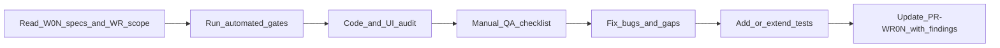
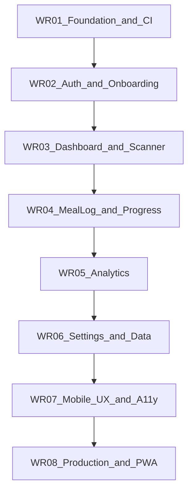

# CalSnap Web — Master Review & Improvement Plan

## Purpose

The W01–W10 build sprint delivered a feature-complete CalSnap Web MVP ([`docs/implementation/web/README.md`](docs/implementation/web/README.md)). This plan defines the **post-build review sprint**: eight sequential PRs (**WR01–WR08**) where each agent audits a consolidated feature area, fixes bugs, closes test gaps, and applies web-specific polish (mobile UX, performance, accessibility).

**In scope:** Spec parity with W01–W10, bug fixes, test expansion, mobile/a11y/perf polish, production hardening per [`ROLLOUT.md`](docs/implementation/web/ROLLOUT.md).

**Out of scope (locked):** Web Push/FCM, historical meal log, USDA fallback, offline meal logging, HealthKit, password reset, Firebase Auth account deletion, alcohol analytics, swipe-to-delete, weigh-in edit/delete.

---

## Sharpened decisions (locked)

These decisions were confirmed during plan stress-testing and govern all WR PRs:

| Decision | Choice | Rationale |
|----------|--------|-----------|
| **Uncommitted WIP** | Land as standalone pre-WR02 commit | Keeps WR02 audit scope clean; avoids mixing unknown WIP with review findings |
| **Production infra** | Firebase cloud + Vercel both live | WR08 validates against real production paths (ROLLOUT Phases 4–5), not first-time setup |
| **E2E expansion** | Incremental — each WR adds specs, CI stays green | Prevents test-debt accumulation; catches regressions early |
| **Lighthouse** | Document baseline in WR07; fix regressions + a11y failures only | Baseline informs future work without flaky CI gates |
| **Deferred findings** | Residual risks section in each `PR-WR0N.md` | Single source of truth; no GitHub issue overhead for P2/P3 |
| **Gemini in CI** | Never — mock in unit/E2E; real API manual only (ROLLOUT Phase 3) | Avoids cost, flakiness, and secret exposure in automated pipelines |

### Pre-sprint prerequisite (before WR01)

Commit and merge the current uncommitted work on `main`:

- `HeightInputFields.tsx`, onboarding/settings layout fixes, `LocalDateInput` / `LocalNumberInput` changes
- Verify: `pnpm lint && pnpm test && pnpm build && pnpm test:integration && pnpm test:e2e` pass after landing

WR02 audits this landed code; it does not absorb WIP.

---

## Agent workflow (every WR PR)

Each WR PR follows the same execution loop. Individual planning phases will produce a per-PR doc at `docs/implementation/web/PR-WR0N.md`.



### Per-PR agent instructions

1. **Read sources of truth**
   - Relevant [`PR-W0N.md`](docs/implementation/web/) implementation specs
   - [`docs/product-research.md`](docs/product-research.md) for product behavior
   - [`docs/technical-spec.md`](docs/technical-spec.md) for domain logic parity (nutrition, plateau, models)
   - This master plan + the WR-specific section below

2. **Establish baseline** — from `calsnap-web/`:
   ```bash
   pnpm lint && pnpm test && pnpm build && pnpm test:integration && pnpm test:e2e
   ```
   Record pass/fail before making changes.

3. **Audit** — for each checklist item: trace UI → hook/query → service → repository → Firestore/API. Log findings in the PR doc with severity:
   - **P0** — broken core flow, data loss, auth bypass
   - **P1** — feature incorrect vs spec, bad error handling
   - **P2** — UX/a11y/mobile regression
   - **P3** — polish, perf, code quality

4. **Fix** — address all P0/P1 in the PR; P2 as time permits; P3 deferred to **Residual risks** section in `PR-WR0N.md` (not GitHub issues).

5. **Test** — every bug fix gets a regression test where practical. **Each WR must add its listed E2E specs before merge** (incremental gate). Gemini is always mocked in automated tests.

6. **Deliverables per PR**
   - Code fixes in `calsnap-web/`
   - `docs/implementation/web/PR-WR0N.md` with: findings matrix (P0–P3), fixes applied, **residual risks** (deferred P2/P3)
   - Green CI merge gate including new E2E specs
   - Manual QA sign-off for items in that PR's checklist

### Merge gate (all WR PRs)

```bash
cd calsnap-web
pnpm lint && pnpm test && pnpm build && pnpm test:integration && pnpm test:e2e
```

---

## Dependency graph



WR07 intentionally comes **after** functional PRs so mobile/a11y polish isn't overwritten by feature fixes. WR08 validates production paths last.

---

## Known issues to prioritize (post-sprint commits)

Six commits after W10 (`714289b`–`ee134a0`) fixed production auth, Gemini parsing, Google sign-in, body-metric inputs, and mobile layout overflow. **Uncommitted work** (onboarding/settings layouts, `HeightInputFields.tsx`) must be **landed as a pre-sprint commit** before WR01 — see Sharpened decisions above.

| Area | Signal | Target WR |
|------|--------|-----------|
| Google OAuth on custom Vercel domains | `d3dba44`, `fdb6194` | WR02 |
| Session cookie / post-auth redirect loop | `714289b`, `d3dba44` | WR02 |
| Body-metric inputs (height, weight, imperial) | `444b6f6`, `HeightInputFields.tsx` (pre-landed) | WR02 |
| Mobile layout overflow (onboarding, settings) | `ee134a0`, layout changes (pre-landed) | WR02, WR07 |
| Gemini meal analysis parsing | `714289b` | WR03 |
| Production Firebase env wiring | `714289b` | WR08 |

---

## WR01 — Foundation, CI & Domain Logic

**Reviews:** W01 scaffold, shared `lib/` domain layer  
**Depends on:** Nothing (entry point)

### Audit scope

| Layer | Key paths |
|-------|-----------|
| Nutrition math | [`lib/nutrition/`](calsnap-web/lib/nutrition/) — parity with iOS `NutritionCalculator` |
| Domain models | [`lib/models/`](calsnap-web/lib/models/) — Firestore mappers, activity level unions |
| Copy module | [`lib/copy/`](calsnap-web/lib/copy/) — no hardcoded user strings in `app/` or `components/` |
| CI | [`.github/workflows/calsnap-web.yml`](.github/workflows/calsnap-web.yml) |
| Unit tests | [`tests/unit/`](calsnap-web/tests/unit/) — 33 files; identify missing edge cases |

### Review checklist

- [ ] All CI jobs green on `main`; document any flaky tests
- [ ] `NutritionCalculator` outputs match iOS spec cases (BMR, TDEE, deficit, macro split, hard-deficit unlock)
- [ ] Activity level enum ↔ Firestore storage ↔ display copy consistency
- [ ] Zod schemas align with Gemini response normalization
- [ ] No `GEMINI_API_KEY` or `FIREBASE_ADMIN_*` in client bundle
- [ ] Test helpers/factories exist for downstream E2E expansion

### Test expansion

- Add missing nutrition edge-case tests (imperial height, boundary ages, extreme weights)
- Add shared E2E fixture utilities if not present

### Acceptance criteria

- CI fully green; findings doc with zero open P0/P1 in domain layer
- Nutrition calculator has explicit iOS parity test matrix

---

## WR02 — Auth, Session & Onboarding

**Reviews:** W02 Firebase Auth, middleware, 5-step onboarding  
**Depends on:** WR01

### Audit scope

| Area | Key paths |
|------|-----------|
| Auth | [`lib/auth/`](calsnap-web/lib/auth/), [`components/providers/AuthProvider`](calsnap-web/components/providers/) |
| Session API | [`app/api/auth/session/route.ts`](calsnap-web/app/api/auth/session/route.ts) |
| Middleware | [`middleware.ts`](calsnap-web/middleware.ts) |
| Onboarding | [`app/(onboarding)/`](calsnap-web/app/(onboarding)/), [`components/onboarding/`](calsnap-web/components/onboarding/) |
| Profile write | [`lib/repositories/profile-repository.ts`](calsnap-web/lib/repositories/profile-repository.ts) |
| Security rules | [`firestore.rules`](calsnap-web/firestore.rules) — profile path |

### Review checklist

- [ ] Email signup → session cookie → protected route access
- [ ] Sign out clears cookie; middleware redirects unauthenticated users
- [ ] Google sign-in: popup (desktop) and redirect (mobile) strategies
- [ ] Google auth on custom domain via `/__/auth/*` proxy ([`next.config.ts`](calsnap-web/next.config.ts))
- [ ] Post-auth navigation: new user → onboarding; returning user → dashboard
- [ ] All 5 onboarding steps validate and persist to `users/{uid}/profile/main`
- [ ] Imperial/metric height and weight inputs round-trip correctly ([`HeightInputFields.tsx`](calsnap-web/components/design/HeightInputFields.tsx))
- [ ] Calorie preview step: hard-deficit unlock, target display
- [ ] Onboarding gate in [`app/(app)/layout.tsx`](calsnap-web/app/(app)/layout.tsx) — incomplete profile cannot access app routes
- [ ] Mobile: no horizontal overflow at 320px on onboarding screens
- [ ] Keyboard does not permanently obscure inputs on auth/onboarding

### Test expansion (merge-blocking)

- **E2E (required):** login flow — returning user skips onboarding (`tests/e2e/login.spec.ts` or equivalent)
- Unit: onboarding validation edge cases, auth redirect state
- Integration: profile CRUD already exists — extend for validation failures
- Google auth: manual only on production Vercel domain (not automatable in CI)

### Manual QA (ROLLOUT Phase 2 subset)

Auth & onboarding section from [`ROLLOUT.md`](docs/implementation/web/ROLLOUT.md) lines 182–190.

### Acceptance criteria

- Fresh signup → onboarding → dashboard works on emulator and production Firebase
- Google sign-in works on localhost and production Vercel domain
- Zero P0/P1 onboarding validation or persistence bugs

---

## WR03 — Dashboard & Meal Scanner (Core Loop)

**Reviews:** W03 dashboard + W04 scanner/AI pipeline  
**Depends on:** WR02 (auth + profile required)

### Audit scope

| Area | Key paths |
|------|-----------|
| Dashboard | [`app/(app)/dashboard/`](calsnap-web/app/(app)/dashboard/), [`lib/dashboard/`](calsnap-web/lib/dashboard/) |
| App shell | [`app/(app)/layout.tsx`](calsnap-web/app/(app)/layout.tsx), [`BottomTabNav`](calsnap-web/components/app/BottomTabNav.tsx) |
| Scanner | [`app/(app)/scan/`](calsnap-web/app/(app)/scan/), [`lib/scanner/`](calsnap-web/lib/scanner/) |
| AI route | [`app/api/analyze-meal/route.ts`](calsnap-web/app/api/analyze-meal/route.ts) |
| Gemini | [`lib/gemini/`](calsnap-web/lib/gemini/) |
| Photo processing | [`lib/services/meal-photo-processor.ts`](calsnap-web/lib/services/meal-photo-processor.ts) |
| Plateau (dashboard) | [`lib/dashboard/plateau`](calsnap-web/lib/dashboard/) |

### Review checklist

- [ ] Dashboard calorie ring, macro bars, fiber match logged meals + profile targets
- [ ] Today's meals section links to detail; empty state correct
- [ ] Weight sparkline renders with 0, 1, and N weigh-ins
- [ ] Plateau sheet: diet break, small reduction, snooze — actions persist
- [ ] Tab navigation works; unsaved-work guard blocks nav during scan/edit
- [ ] Photo upload (gallery/file input) → JPEG compression → API call
- [ ] Real Gemini analysis returns parsed items with confidence badges
- [ ] Manual meal entry fallback when AI fails (503, timeout, bad photo)
- [ ] Navigate-away mid-scan: AbortController + generation guard prevents stale UI
- [ ] Log meal writes Firestore doc + Storage photo; dashboard invalidates
- [ ] Low-confidence banner when score &lt; 0.60
- [ ] Error messages user-friendly; no raw API errors exposed

### Test expansion (merge-blocking)

- **E2E (required):** scanner error-path — mock 503 → manual entry fallback
- Unit: meal analysis parser edge cases (malformed Gemini JSON)
- Integration: meal write + dashboard read (exists — verify photo Storage path)

### Manual QA (ROLLOUT Phase 3 — real Gemini, not CI)

Meal scanner section with **real** `GEMINI_API_KEY` on emulators or production Firebase. Never add real Gemini calls to CI.

### Acceptance criteria

- Core loop (scan or manual → log → dashboard update) works with real Gemini
- Plateau sheet functional with test data
- No stale scan results after navigation

---

## WR04 — Meal Log & Progress

**Reviews:** W05 meal log + W06 weigh-in/progress  
**Depends on:** WR03 (meals must exist to test log/progress)

### Audit scope

| Area | Key paths |
|------|-----------|
| Meal log | [`app/(app)/log/`](calsnap-web/app/(app)/log/), [`components/meal-log/`](calsnap-web/components/meal-log/) |
| Meal edit | [`app/(app)/scan/edit/[mealId]/`](calsnap-web/app/(app)/scan/edit/) |
| Share card | [`components/meal-log/`](calsnap-web/components/meal-log/) + `html2canvas` |
| Progress | [`app/(app)/progress/`](calsnap-web/app/(app)/progress/), [`lib/progress/`](calsnap-web/lib/progress/) |
| Weigh-in | [`lib/services/weigh-in-service.ts`](calsnap-web/lib/services/weigh-in-service.ts) |
| Reminder banner | [`WeighInReminderBanner`](calsnap-web/components/dashboard/), [`lib/progress/weigh-in-reminder.ts`](calsnap-web/lib/progress/weigh-in-reminder.ts) |

### Review checklist

- [ ] `/log` groups today's meals by type; tap → detail
- [ ] Meal detail: items, totals, photo, confidence, meal type
- [ ] Edit meal: adjust items/weights → save → dashboard totals update immediately
- [ ] Delete meal: confirm dialog → removed from log and dashboard
- [ ] Share card renders and exports image
- [ ] Weigh-in sheet: validation, save, dialog dismiss
- [ ] Weigh-in triggers TDEE recalc and daily calorie target update on dashboard
- [ ] Progress chart: history, projection line, stats
- [ ] Weigh-in history list (newest first)
- [ ] Overdue weigh-in banner on dashboard when 7+ days (with reminder enabled)
- [ ] Banner snooze persists; opens weigh-in sheet on tap
- [ ] Link from progress → analytics works

### Test expansion (merge-blocking)

- **E2E (required):** meal edit + delete flow (`tests/e2e/meal-crud.spec.ts` or equivalent)
- **E2E (required):** weigh-in updates dashboard calorie target (assertion on ring/target text)
- Unit: TDEE recalc after weigh-in batch

### Acceptance criteria

- Full meal CRUD cycle with immediate dashboard sync
- Weigh-in → target recalc verified by test
- Reminder banner behavior matches W10 spec

---

## WR05 — Analytics & Insights

**Reviews:** W07 analytics screen + AI insights  
**Depends on:** WR04 (needs multi-day meal + weigh-in data)

### Audit scope

| Area | Key paths |
|------|-----------|
| Analytics page | [`app/(app)/analytics/`](calsnap-web/app/(app)/analytics/) |
| Aggregator | [`lib/analytics/`](calsnap-web/lib/analytics/) |
| Charts | [`components/analytics/`](calsnap-web/components/analytics/) |
| Insight API | [`app/api/generate-insight/route.ts`](calsnap-web/app/api/generate-insight/route.ts) |
| Insight hook | [`use-generate-insight`](calsnap-web/lib/queries/) |

### Review checklist

- [ ] Timeframe picker: 7D / 30D / 90D / custom range
- [ ] Calorie adherence chart uses ±10% band from product spec
- [ ] Macro trend charts, fiber section, pattern detection render with sparse and rich data
- [ ] Empty states when insufficient data
- [ ] Insight generation requires ≥3 logged days; shows appropriate message otherwise
- [ ] Real Gemini insight returns 2–3 sentences from aggregates only (no PII in prompt)
- [ ] Navigate-away mid-insight: generation guard prevents stale text
- [ ] Analytics reachable from progress link (not in tab bar — intentional)
- [ ] Plateau alerts consistent with dashboard/progress

### Test expansion (merge-blocking)

- Unit: aggregator with fixture data across date ranges
- **E2E (required):** analytics page renders with seeded emulator data
- Unit: insight route with mocked Gemini (never real API in CI)

### Manual QA (ROLLOUT Phase 3 — real Gemini, not CI)

Analytics insight with real Gemini after 3+ days of meals.

### Acceptance criteria

- All timeframe modes render without errors
- Insight generation works with sufficient data; graceful empty state without

---

## WR06 — Settings & Data Lifecycle

**Reviews:** W08 settings, export, delete-all  
**Depends on:** WR02 (profile), WR04 (weigh-in data for export)

### Audit scope

| Area | Key paths |
|------|-----------|
| Settings page | [`app/(app)/settings/`](calsnap-web/app/(app)/settings/), [`components/settings/`](calsnap-web/components/settings/) |
| Form state | [`lib/settings/`](calsnap-web/lib/settings/) |
| Export | [`lib/services/data-export.ts`](calsnap-web/lib/services/data-export.ts) |
| Deletion | [`lib/services/user-data-deletion.ts`](calsnap-web/lib/services/user-data-deletion.ts) |
| Macro targets | [`MacroTargetsSection`](calsnap-web/components/settings/MacroTargetsSection.tsx) |

### Review checklist

- [ ] Profile edits (weight, goals, activity) recalculate TDEE/targets; dashboard reflects changes
- [ ] Macro sliders sum to 100%; save persists; dashboard macros update
- [ ] Unit preferences (lbs, imperial height) affect display across app
- [ ] Weigh-in reminder prefs save (in-app banner only — note future Web Push in copy)
- [ ] CSV export downloads complete data (meals, weigh-ins, profile)
- [ ] Delete all data: confirmation → wipes Firestore subcollections + Storage → user re-onboards
- [ ] Sign out works from settings
- [ ] About section links to `/privacy`
- [ ] Mobile: settings page no overflow; all sections scroll correctly
- [ ] Save/error feedback visible to user

### Test expansion (merge-blocking)

- **E2E (required):** settings profile edit → dashboard target change
- **E2E (required):** delete all data → user re-onboards
- E2E: export triggers download (or verify response)
- Integration: delete-all clears user data (careful with emulator cleanup)

### Acceptance criteria

- Settings save/load round-trip for all sections
- Export and delete-all verified against emulator data
- Macro slider validation enforced

---

## WR07 — Mobile UX, Accessibility & Performance

**Reviews:** W09 design system + cross-cutting polish  
**Depends on:** WR02–WR06 (all features stable)

### Audit scope

| Area | Key paths |
|-------|-----------|
| Design tokens | [`lib/design/`](calsnap-web/lib/design/), [`app/globals.css`](calsnap-web/app/globals.css) |
| Shared components | [`components/design/`](calsnap-web/components/design/) |
| Dark mode | `prefers-color-scheme` tokens |
| Copy | [`lib/copy/`](calsnap-web/lib/copy/) |
| Layout | [`lib/design/layout.ts`](calsnap-web/lib/design/layout.ts) |

### Review checklist

- [ ] **320px width** — no horizontal scroll on every route (auth, onboarding, dashboard, log, scan, progress, analytics, settings)
- [ ] **200% text zoom** — layout holds; no clipped text or overlapping controls
- [ ] **Keyboard matrix** — auth, onboarding, settings, weigh-in sheet, manual meal entry: inputs remain visible; no trapped focus
- [ ] **Touch targets** — minimum 44×44px on primary actions (FAB, tab bar, buttons)
- [ ] **Dark mode** — all screens readable; charts and rings use token colors
- [ ] **Focus indicators** — visible on interactive elements
- [ ] **Calorie ring** — accessible labels (existing `calorie-ring-accessibility.test.ts` passes)
- [ ] **Copy audit** — no hardcoded strings outside `lib/copy/`
- [ ] **Animation** — reduced-motion respected where applicable
- [ ] **Performance baseline** — record Mobile Lighthouse scores for dashboard, scan, settings in `PR-WR07.md` (document only; not a CI gate)
- [ ] **Bundle** — no obvious bloat; lazy-load heavy routes if needed (analytics charts, html2canvas)
- [ ] **React Query** — stale times appropriate; no redundant refetches on tab switch
- [ ] **Images** — meal photos sized appropriately; compression before upload

### Test expansion (merge-blocking)

- **E2E (required):** Playwright viewport tests at 320px for critical routes (auth, onboarding, dashboard, settings)
- Lighthouse: manual Mobile Lighthouse run on dashboard, scan, settings — scores recorded in `PR-WR07.md`
- No Lighthouse CI gate; fix any a11y failures found during audit regardless of score

### Acceptance criteria

- PR-W10 manual QA items 5–7 (Lighthouse, keyboard, 320px/zoom) signed off
- Lighthouse baseline documented in `PR-WR07.md` (reference targets: Perf ≥70, A11y ≥90 — informative, not blocking)
- Zero horizontal overflow on primary flows; all a11y failures from audit fixed

---

## WR08 — Production, PWA & Security Hardening

**Reviews:** W10 PWA/release + ROLLOUT Phases 4–5 against **live Firebase cloud + Vercel**  
**Depends on:** WR01–WR07

### Audit scope

| Area | Key paths |
|------|-----------|
| PWA | [`app/sw.ts`](calsnap-web/app/sw.ts), [`public/manifest.webmanifest`](calsnap-web/public/manifest.webmanifest), [`InstallPromptBanner`](calsnap-web/components/pwa/) |
| Privacy | [`app/privacy/page.tsx`](calsnap-web/app/privacy/page.tsx) |
| Security rules | [`firestore.rules`](calsnap-web/firestore.rules), [`storage.rules`](calsnap-web/storage.rules) |
| Env | [`.env.local.example`](calsnap-web/.env.local.example) |
| Deploy | [`ROLLOUT.md`](docs/implementation/web/ROLLOUT.md) Phases 4–5 |

### Review checklist

- [ ] PWA manifest valid; icons present; `display: standalone`
- [ ] Service worker builds with `next build --webpack`; NetworkOnly for `/api/*` and auth HTML
- [ ] Install prompt banner shows on eligible browsers; defers after dismiss
- [ ] Add to Home Screen tested on iOS Safari + Android Chrome (HTTPS required)
- [ ] PWA standalone opens logged-in dashboard (not login loop)
- [ ] `/privacy` accurate vs actual data practices (Firebase, Gemini, Storage, no third-party analytics)
- [ ] Firestore rules: user can only read/write own `users/{uid}/**`
- [ ] Storage rules: user can only access own meal photos
- [ ] Integration tests cover unauthenticated denial cases
- [ ] Production Firebase: rules deployed, authorized domains include Vercel URL
- [ ] Vercel env vars complete per ROLLOUT 5.2 table
- [ ] No `NEXT_PUBLIC_USE_FIREBASE_EMULATOR=true` in production
- [ ] Session cookie works with `FIREBASE_ADMIN_*` on Vercel (no redirect loop)
- [ ] Scanner 503 when `GEMINI_API_KEY` missing — clear user message
- [ ] Rate limiting / abuse considerations documented (optional: basic API route guards)

### Test expansion

- Storage rules integration tests (exists — verify coverage)
- Document production smoke test script (abbreviated ROLLOUT Phase 4.7 + 5.5)

### Manual QA (ROLLOUT Phase 5 — live infra)

Full production manual QA matrix from [`PR-W10.md`](docs/implementation/web/PR-W10.md) lines 46–58 and [`ROLLOUT.md`](docs/implementation/web/ROLLOUT.md) Phase 5.5. Run against **existing** Firebase cloud + Vercel deployment (not first-time setup).

Includes: email + Google auth on production domain, real Gemini scan + insight, PWA install on physical devices.

### Acceptance criteria

- Production Vercel deployment passes full smoke test (infra already live)
- PWA install verified on at least one iOS and one Android device
- Security rules audit complete with no P0/P1 gaps
- Privacy page reviewed and accurate

---

## Test coverage gap inventory (address across WR PRs)

| Gap | Current state | Target WR |
|-----|---------------|-----------|
| E2E: login returning user | Missing | WR02 (**merge-blocking**) |
| E2E: scanner 503 → manual entry | Missing | WR03 (**merge-blocking**) |
| E2E: meal edit/delete | Missing | WR04 (**merge-blocking**) |
| E2E: weigh-in → target update | Missing | WR04 (**merge-blocking**) |
| E2E: analytics page render | Missing | WR05 (**merge-blocking**) |
| E2E: settings save | Missing | WR06 (**merge-blocking**) |
| E2E: delete all data | Missing | WR06 (**merge-blocking**) |
| E2E: Google auth | Manual only | WR02, WR08 (production domain) |
| E2E: 320px viewport | Missing | WR07 (**merge-blocking**) |
| Component/UI unit tests | None (no RTL) | WR07 (only if high-value) |
| Real Gemini | Manual only (ROLLOUT Phase 3) | WR03, WR05, WR08 — **never in CI** |

---

## Documentation deliverables

| Artifact | Path | When |
|----------|------|------|
| Master plan (this doc) | `docs/implementation/web/REVIEW-MASTER-PLAN.md` | Now |
| Per-PR review spec | `docs/implementation/web/PR-WR01.md` … `PR-WR08.md` | Each PR's planning phase |
| Per-PR Cursor plan | `.cursor/plans/pr_wr0N_*.plan.md` | Each PR's planning phase |
| Findings / sign-off | Section in each `PR-WR0N.md` | End of each WR PR |
| Lighthouse baseline | `PR-WR07.md` or `docs/implementation/web/PERF-BASELINE.md` | WR07 |
| Production smoke checklist | `PR-WR08.md` | WR08 |

---

## Suggested execution timeline

| PR | Focus | Est. effort |
|----|-------|-------------|
| WR01 | Foundation & CI | 0.5–1 day |
| WR02 | Auth & onboarding | 1–2 days |
| WR03 | Dashboard & scanner | 1–2 days |
| WR04 | Meal log & progress | 1–2 days |
| WR05 | Analytics | 1 day |
| WR06 | Settings & data | 1 day |
| WR07 | Mobile/a11y/perf | 1–2 days |
| WR08 | Production & PWA | 1–2 days |

**Total:** ~8–12 agent-days sequential. WR01–WR06 are primarily functional; WR07–WR08 are polish and production.

---

## Success criteria (review sprint complete)

1. All ROLLOUT Phases 1–5 manual QA items signed off
2. CI merge gate green on `main`
3. E2E covers: signup, login, onboarding, scan (mocked), log, edit, delete, weigh-in, settings save
4. Real Gemini scan + insight verified on production Firebase + Vercel
5. Mobile Lighthouse baseline documented; no P0/P1 a11y issues
6. PWA install works on iOS Safari and Android Chrome
7. Zero open P0/P1 bugs against W01–W10 acceptance criteria
8. Each `PR-WR0N.md` contains findings matrix and residual risk list
