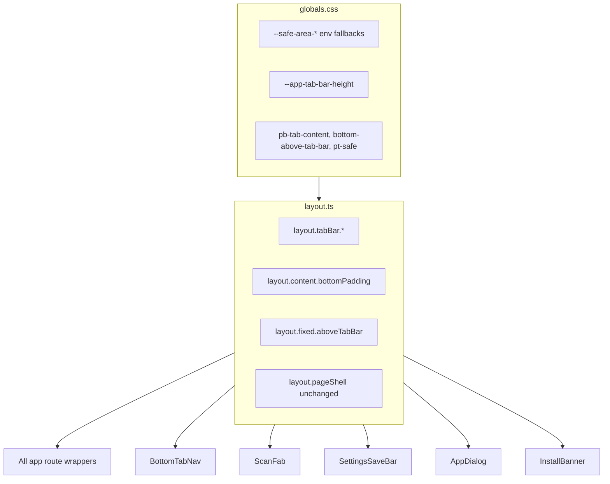

# WO01 — Native Shell & Safe Areas (Planning)

**Deliverables (this phase):**

- [docs/implementation/web/PR-WO01.md](docs/implementation/web/PR-WO01.md) — WR-format spec (audit, file changes, tests, manual QA, acceptance, findings template)
- [.cursor/plans/pr_wo01_native_shell_safe_areas.plan.md](.cursor/plans/pr_wo01_native_shell_safe_areas.plan.md) — synced Cursor implementation plan with todos

**Canonical scope:** [web_optimization_sprint_68cb0f71.plan.md](.cursor/plans/web_optimization_sprint_68cb0f71.plan.md) WO01 section + round 1–3 sharpened decisions.

**Depends on:** WR10 (goal-pathway) merged to `main`; full merge gate green from `calsnap-web/`:

```bash
pnpm lint && pnpm test && pnpm build && pnpm test:integration && pnpm test:e2e
```

**Downstream:** WO02 (PWA launch), WO03 (tab blur + sheet polish) both depend on WO01 tokens.

**Canonical plan file:** sync this document to [.cursor/plans/pr_wo01_native_shell_safe_areas.plan.md](.cursor/plans/pr_wo01_native_shell_safe_areas.plan.md) on approval.

---

## Sharpened decisions (locked 2026-07-01)


| #   | Question                 | **Resolved answer**                                                                                                                                        | Rationale                                                                           |
| --- | ------------------------ | ---------------------------------------------------------------------------------------------------------------------------------------------------------- | ----------------------------------------------------------------------------------- |
| 1   | Bottom padding layering  | **Pages only** — remove shell `pb-20`; every app route uses `layout.content.bottomPadding` via `pageShell`                                                 | Eliminates double-padding stack (~176px today); single scroll inset per route       |
| 2   | Dark `themeColor`        | `**darkColors.background` (#000000)**                                                                                                                      | Edge-to-edge dark shell; avoids green status-bar flash in standalone                |
| 3   | AppDialog safe-area      | **Pad `DialogContent` bottom when `sheet=true`**                                                                                                           | No consumer uses `footer` prop; children hold CTAs                                  |
| 4   | Settings scroll padding  | **Conditional** — `bottomPadding` normally; `bottomPaddingWithSaveBar` when `form.isDirty`                                                                 | Avoid excess scroll when save bar hidden                                            |
| 5   | E2E `/log` route         | **Best-effort** — merge-blocking stays login/onboarding/dashboard/settings                                                                                 | Matches WR07 pattern for scan/progress/analytics                                    |
| 6   | Onboarding top safe-area | **Defer** — add `pt-safe` only if iPhone standalone QA shows notch overlap                                                                                 | No tab bar; lower WO01 risk                                                         |
| 7   | Install banner spacing   | `**pt-safe` on `InstallPromptBanner` wrapper only**                                                                                                        | Scoped to install UX; no global shell top padding                                   |
| 8   | Tab bar height source    | **CSS var `--app-tab-bar-height`** = measured row (`min-h-11` + `py-2` + border) + `--safe-area-bottom`; `layout.ts` exports class strings referencing var | One numeric source for fixed chrome + page padding                                  |
| 9   | Forbidden-class guard    | **PR checklist + manual grep in `final-gate`** — no ESLint rule in WO01                                                                                    | ESLint copy guard remains WO05/WR07 P3 deferral                                     |
| 10  | `/scan` bottom padding   | **Same `layout.content.bottomPadding` as other tab routes**                                                                                                | Scan is a tab; no special-case token                                                |
| 11  | Scroll padding formula   | `**--app-tab-bar-height + 1rem**` — `layout.content.bottomPadding` utility                                                                                 | Last content not flush against tab chrome; fixes double-layer without going minimal |
| 12  | Light `themeColor`       | **Keep `lightColors.primary` (#3DA35D)** — unchanged from today                                                                                            | Brand green browser chrome in light mode; dark stays `#000`                         |
| 13  | Forbidden grep scope     | `**pb-20|pb-24|pb-28|bottom-16|bottom-20` + raw `pb-[` in app/components** — exclude `layout.ts` + `globals.css`                                           | Covers settings `pb-28`; blocks new arbitrary padding                               |
| 14  | E2E tab bar assertion    | **Extend merge-blocking dashboard test** — add nav visibility to existing spec                                                                             | No new spec file; layout regression on critical route                               |
| 15  | PR-WO01.md timing        | **Scaffold in planning phase** — checklist + sharpened decisions + Pending findings; gate counts filled during implementation                              | Matches WR sprint workflow                                                          |
| 16  | Centered dialogs         | **Out of scope** — `ConfirmAlertDialog` is centered modal, not bottom-fixed                                                                                | Safe-area WO01 targets fixed bottom chrome + bottom sheets only                     |


**No open sharpen questions remain.**

---

## Current baseline (audit inputs)


| Gap                               | Evidence today                                                                                                                        |
| --------------------------------- | ------------------------------------------------------------------------------------------------------------------------------------- |
| No safe-area / viewport-fit       | Zero `env(safe-area-inset-*)` or `viewportFit` in [calsnap-web/app/layout.tsx](calsnap-web/app/layout.tsx)                            |
| Static light `themeColor` only    | `viewport.themeColor: lightColors.primary` — no dark variant                                                                          |
| No `black-translucent` status bar | `appleWebApp` lacks `statusBarStyle`                                                                                                  |
| Ad-hoc bottom spacing             | `pb-20` shell ([app/(app)/layout.tsx](calsnap-web/app/(app)/layout.tsx)), `pb-24`/`pb-28` pages, `bottom-16`/`bottom-20` fixed chrome |
| Double padding risk               | Shell `pb-20` **and** page `pb-24` stack (~176px) — consolidation must leave **one** token-driven inset                               |
| `pageShell` partial adoption      | Dashboard/settings use `layout.pageShell`; log/progress/analytics/scan still use raw `mx-auto max-w-lg px-4`                          |
| Settings save bar sm bug          | `sm:bottom-0` overlaps tab bar on wider viewports ([settings/page.tsx L199](calsnap-web/app/(app)/settings/page.tsx))                 |
| ScanFab dashboard-only            | Already true — only [dashboard/page.tsx](calsnap-web/app/(app)/dashboard/page.tsx) imports `ScanFab`                                  |
| AppDialog sheets                  | No safe-area bottom padding; **no consumer uses `footer` prop** — buttons live in `children` (WeighInSheet, FoodItemEditSheet, etc.)  |
| Install banner                    | No top safe-area spacing for notch/status bar under `viewport-fit: cover`                                                             |


**Out of scope (locked):** tab blur, splash/maskable icons, skeletons, forms/keyboard, query tuning, Serwist changes, view transitions, PageHeader/large titles, overscroll rubber-band (WO03).

**Design rule (locked):** One source of truth for bottom spacing — **no new** ad-hoc bottom spacing in page files after WO01. Post-merge **manual grep** (PR checklist + `final-gate` todo): zero hits for `pb-20`, `pb-24`, `pb-28`, `bottom-16`, `bottom-20`, or raw `pb-[` in `app/` and `components/` (except token definitions in `layout.ts` / `globals.css`). No ESLint rule in WO01.

---

## Proposed token architecture




### [lib/design/layout.ts](calsnap-web/lib/design/layout.ts)

Extend exports (exact class strings TBD at implementation to match rendered tab bar):


| Export                                    | Purpose                                                                                                |
| ----------------------------------------- | ------------------------------------------------------------------------------------------------------ |
| `layout.tabBar.height`                    | Documented constant: 44px row (`min-h-11`) + vertical padding — used in tests/docs                     |
| `layout.tabBar.nav`                       | Class string for `<nav>` — includes safe-area bottom padding                                           |
| `layout.fixed.aboveTabBar`                | Fixed-position offset for FAB + settings save bar (tab bar + safe area)                                |
| `layout.content.bottomPadding`            | Page scroll clearance above tab bar + safe area                                                        |
| `layout.content.bottomPaddingWithSaveBar` | Settings dirty state — tab bar + save bar + safe area                                                  |
| `layout.pageShell`                        | Keep existing column constraint; pages compose `cn(layout.pageShell, layout.content.bottomPadding, …)` |


**No convenience helper** — use explicit `cn(layout.pageShell, layout.content.bottomPadding)` at call sites (grep-friendly).

### [app/globals.css](calsnap-web/app/globals.css)

Add CSS custom properties and Tailwind v4 `@utility` classes:

- `:root` — `--safe-area-top/right/bottom/left: env(safe-area-inset-*, 0px)`
- `--app-tab-bar-content-height` — measured from nav row: `min-h-11` (44px) + `py-2` (16px) + `border-t` (1px) ≈ **61px**
- `--app-tab-bar-height` — `calc(var(--app-tab-bar-content-height) + var(--safe-area-bottom))`
- `--app-save-bar-height` — save bar block (~56–60px from `py-3` + `min-h-11` button)
- `--app-content-bottom-padding` — `calc(var(--app-tab-bar-height) + 1rem)` (sharpen #11)
- Utilities: `pt-safe`, `pb-tab-content` (uses `--app-content-bottom-padding`), `pb-tab-content-with-save-bar`, `bottom-above-tab-bar`
- All `env()` calls use `0px` fallback for non-notch browsers

### [app/layout.tsx](calsnap-web/app/layout.tsx)


| Change                       | Detail                                                                                                               |
| ---------------------------- | -------------------------------------------------------------------------------------------------------------------- |
| `viewportFit: 'cover'`       | Next.js `Viewport` export                                                                                            |
| Dark/light `themeColor`      | Array: light `**lightColors.primary**` (sharpen #12, unchanged); dark `**darkColors.background**` (#000, sharpen #2) |
| `appleWebApp.statusBarStyle` | `'black-translucent'`                                                                                                |


---

## File-by-file changes

### Foundation (implement first)


| File                                                                 | Change                                                |
| -------------------------------------------------------------------- | ----------------------------------------------------- |
| [calsnap-web/lib/design/layout.ts](calsnap-web/lib/design/layout.ts) | Add `tabBar`, `content`, `fixed` token exports        |
| [calsnap-web/app/globals.css](calsnap-web/app/globals.css)           | Safe-area CSS vars + utility classes                  |
| [calsnap-web/app/layout.tsx](calsnap-web/app/layout.tsx)             | `viewportFit`, dual `themeColor`, `black-translucent` |


### Fixed chrome


| File                                                                                         | Change                                                                                                                                                                                               |
| -------------------------------------------------------------------------------------------- | ---------------------------------------------------------------------------------------------------------------------------------------------------------------------------------------------------- |
| [calsnap-web/components/app/BottomTabNav.tsx](calsnap-web/components/app/BottomTabNav.tsx)   | Apply `layout.tabBar.nav`; `padding-bottom: env(safe-area-inset-bottom, 0px)` via utility                                                                                                            |
| [calsnap-web/components/dashboard/ScanFab.tsx](calsnap-web/components/dashboard/ScanFab.tsx) | Replace `bottom-20` with `layout.fixed.aboveTabBar`                                                                                                                                                  |
| [calsnap-web/app/(app)/settings/page.tsx](calsnap-web/app/(app)/settings/page.tsx)           | Save bar: `layout.fixed.aboveTabBar`; **remove `sm:bottom-0`**; content wrapper: `bottomPadding` default, `**bottomPaddingWithSaveBar` when `form.isDirty**`; apply tokens to loading/error branches |


### App shell


| File                                                                 | Change                                                                                      |
| -------------------------------------------------------------------- | ------------------------------------------------------------------------------------------- |
| [calsnap-web/app/(app)/layout.tsx](calsnap-web/app/(app)/layout.tsx) | **Remove `pb-20`** — bottom clearance moves to per-page `layout.content.bottomPadding` only |


### Route migrations → `layout.pageShell` + `layout.content.bottomPadding`

Replace `mx-auto max-w-lg px-4 … pb-24` (and dashboard `pb-24` duplicates) in **all branches** (loading, error, success):


| File                                                                                                   | Notes                                                               |
| ------------------------------------------------------------------------------------------------------ | ------------------------------------------------------------------- |
| [calsnap-web/app/(app)/dashboard/page.tsx](calsnap-web/app/(app)/dashboard/page.tsx)                   | 3 skeleton/error/content wrappers; keep `ScanFab` dashboard-only    |
| [calsnap-web/app/(app)/log/page.tsx](calsnap-web/app/(app)/log/page.tsx)                               |                                                                     |
| [calsnap-web/app/(app)/log/[mealId]/page.tsx](calsnap-web/app/(app)/log/[mealId]/page.tsx)             | Loading/error branches currently missing bottom padding             |
| [calsnap-web/app/(app)/scan/page.tsx](calsnap-web/app/(app)/scan/page.tsx)                             | Add same `layout.content.bottomPadding` as other tabs (sharpen #10) |
| [calsnap-web/app/(app)/scan/edit/[mealId]/page.tsx](calsnap-web/app/(app)/scan/edit/[mealId]/page.tsx) | 4 wrapper divs                                                      |
| [calsnap-web/app/(app)/progress/page.tsx](calsnap-web/app/(app)/progress/page.tsx)                     |                                                                     |
| [calsnap-web/app/(app)/analytics/page.tsx](calsnap-web/app/(app)/analytics/page.tsx)                   |                                                                     |
| [calsnap-web/app/(app)/settings/page.tsx](calsnap-web/app/(app)/settings/page.tsx)                     | Loading/error wrappers need bottom padding token                    |


**Not in scope:** [onboarding/page.tsx](calsnap-web/app/(onboarding)/onboarding/page.tsx) — no tab bar; `**pt-safe` deferred** until iPhone standalone QA shows notch overlap (sharpen #6).

### Sheets + install banner


| File                                                                                                     | Change                                                                                                                           |
| -------------------------------------------------------------------------------------------------------- | -------------------------------------------------------------------------------------------------------------------------------- |
| [calsnap-web/components/design/AppDialog.tsx](calsnap-web/components/design/AppDialog.tsx)               | When `sheet=true`: bottom safe-area padding on `**DialogContent` only** (sharpen #3) — do not migrate consumers to `footer` prop |
| [calsnap-web/components/pwa/InstallPromptBanner.tsx](calsnap-web/components/pwa/InstallPromptBanner.tsx) | `**pt-safe` on banner wrapper only** (sharpen #7) — not on app shell or `<main>`                                                 |


**WO03 follow-up (document as residual):** drag handle, blur tab bar, sheet consumer spot-checks — not WO01.

---

## Implementation order

1. **Prereq gate** — confirm WR10 on `main`; run merge gate; record baseline counts in PR-WO01 §2
2. **Tokens** — `globals.css` vars/utilities → `layout.ts` exports → unit test skeleton
3. **Root viewport/meta** — `app/layout.tsx`
4. **Fixed chrome** — `BottomTabNav` → `ScanFab` → settings save bar
5. **Shell** — remove `pb-20` from `(app)/layout.tsx`
6. **Route sweep** — migrate all 8 app route files (every render branch)
7. **Sheets + banner** — `AppDialog`, `InstallPromptBanner`
8. **Verification grep** — extended forbidden-class pattern (sharpen #13)
9. **Tests** — unit + E2E extension; re-run full merge gate
10. **Docs** — populate PR-WO01 findings matrix; sync cursor plan todos

---

## Tests

### Unit (merge-blocking) — new [tests/unit/layout-safe-area.test.ts](calsnap-web/tests/unit/layout-safe-area.test.ts)


| Test                    | Assert                                                                                                    |
| ----------------------- | --------------------------------------------------------------------------------------------------------- |
| Token exports exist     | `layout.tabBar.height`, `layout.content.bottomPadding`, `layout.fixed.aboveTabBar` defined                |
| Safe-area references    | Token strings or linked CSS utilities include `env(safe-area-inset-bottom` (or `var(--safe-area-bottom)`) |
| Graceful degradation    | CSS fallback resolves to `0px` when env unset (parse globals.css or test computed utility definition)     |
| No magic reintroduction | Snapshot/grep guard that `layout.content.bottomPadding` is the canonical page class                       |


Pattern: follow [design-colors.test.ts](calsnap-web/tests/unit/design-colors.test.ts) — import from `@/lib/design/layout`.

### E2E (merge-blocking) — extend [tests/e2e/viewport-320.spec.ts](calsnap-web/tests/e2e/viewport-320.spec.ts)

**Layout regression only — not a safe-area substitute.**


| Addition                                                    | Assert                                                                           |
| ----------------------------------------------------------- | -------------------------------------------------------------------------------- |
| Dashboard tab bar visible (**merge-blocking**, sharpen #14) | Extend existing dashboard test — nav + calorie ring + `assertNoHorizontalScroll` |
| Log route (**best-effort**, sharpen #5)                     | `/log` — no horizontal scroll; meal log title visible                            |
| Settings unchanged contract                                 | Existing settings test still passes; WR06 `saveSettingsProfile` still green      |


**Explicitly out of scope:** Playwright `env(safe-area-inset-*)` injection, BrowserStack in CI.

### Manual (merge-blocking for WO01 operator sign-off)


| Scenario                                 | Device                 | Pass criteria                                                    |
| ---------------------------------------- | ---------------------- | ---------------------------------------------------------------- |
| Tab bar vs home indicator                | iPhone, standalone PWA | Labels/icons fully above home indicator                          |
| Dashboard ScanFab                        | iPhone standalone      | FAB above tab bar; no overlap with home indicator                |
| Settings save bar (dirty)                | iPhone standalone      | Save CTA above tab bar on **all** widths; no `sm:bottom-0` flush |
| Weigh-in sheet primary buttons           | iPhone standalone      | Save/Cancel above home indicator                                 |
| Install banner (browser, not standalone) | iPhone Safari          | Banner clears notch/status bar when eligible                     |
| Android Chrome PWA                       | Best-effort            | Document Pass/Fail/Skipped in PR-WO01 §8                         |


---

## PR-WO01.md section outline (match WR format)

Mirror [PR-WR01.md](docs/implementation/web/PR-WR01.md) / [PR-WR07.md](docs/implementation/web/PR-WR07.md):

1. **Audit checklist** — pre/post grep for forbidden classes; route-by-route `pageShell` adoption; viewport meta; fixed chrome offsets
2. **Baseline merge gate snapshot** — before/after table (expect +5–8 unit tests, +1–2 E2E assertions; 17+ E2E total must stay green)
3. **Findings matrix** — template IDs `WO01-LAY-01` … (populate during implementation)
4. **Fix list** — file → change → finding ID
5. **Design contract** — token table + forbidden patterns
6. **E2E delta** — viewport-320 extensions documented
7. **Manual sign-off §8** — matrix above with Pending rows
8. **Acceptance criteria** — checklist below
9. **Residual risks §7** — template entries
10. **Files changed index**

### Findings template (pre-seeded)


| ID            | Sev | Area     | Finding                                      | Status  |
| ------------- | --- | -------- | -------------------------------------------- | ------- |
| WO01-LAY-01   | P1  | Layout   | No safe-area tokens; ad-hoc bottom spacing   | Pending |
| WO01-LAY-02   | P1  | Layout   | Double shell+page bottom padding             | Pending |
| WO01-LAY-03   | P1  | Settings | `sm:bottom-0` save bar overlaps tab bar      | Pending |
| WO01-VP-01    | P1  | Viewport | Missing `viewport-fit: cover`                | Pending |
| WO01-VP-02    | P2  | Meta     | Static light `themeColor` only               | Pending |
| WO01-VP-03    | P2  | Meta     | Missing `black-translucent` status bar       | Pending |
| WO01-SHEET-01 | P2  | Sheets   | AppDialog sheet lacks safe-area bottom inset | Pending |
| WO01-PWA-01   | P2  | Install  | Install banner ignores top safe area         | Pending |
| WO01-TEST-01  | P1  | Tests    | No layout safe-area unit tests               | Pending |


### Residual risks template


| Risk                                            | Notes                                                                 |
| ----------------------------------------------- | --------------------------------------------------------------------- |
| Playwright cannot verify real safe areas        | Manual iPhone standalone required; document Android best-effort       |
| AppDialog consumers use `children` not `footer` | WO01 pads sheet `DialogContent`; WO03 verifies all sheet CTAs         |
| Tab bar blur / drag handle                      | WO03                                                                  |
| Onboarding top inset                            | Deferred (sharpen #6); add only if iPhone standalone QA shows overlap |
| ESLint forbidden spacing rule                   | Deferred (sharpen #9); manual grep only in WO01                       |
| Exact tab bar height drift                      | Centralized in `layout.ts` + CSS var; change one place                |
| Centered alert dialogs (`ConfirmAlertDialog`)   | Out of scope (sharpen #16) — centered modals, not bottom-fixed        |


---

## Acceptance criteria

- [ ] WR10 merged; merge gate green before and after WO01
- [ ] `viewport-fit: cover`, dual `themeColor`, `black-translucent` status bar wired
- [ ] All **app tab routes** use `layout.pageShell` + `layout.content.bottomPadding` (every render branch)
- [ ] `(app)/layout.tsx` has no bottom padding magic number
- [ ] Zero `pb-20` / `pb-24` / `bottom-16` / `bottom-20` in `app/` + `components/` (except token defs)
- [ ] Settings save bar above tab bar on all breakpoints (`sm:bottom-0` removed); conditional save-bar scroll padding when dirty
- [ ] ScanFab dashboard-only; positioned via `layout.fixed.aboveTabBar`
- [ ] `tests/unit/layout-safe-area.test.ts` merge-blocking green
- [ ] `viewport-320.spec.ts` extended; 17+ E2E tests green; WR06 settings/delete specs unchanged
- [ ] `PR-WO01.md` complete with findings matrix + manual §8 Pending rows
- [ ] No Serwist / offline / new product features

---

## Cursor plan todos (`.cursor/plans/pr_wo01_native_shell_safe_areas.plan.md`)

Sync with PR-WO01 during implementation:

- `prereq-gate` — WR10 on main; baseline merge gate counts
- `safe-area-tokens` — globals.css + layout.ts
- `viewport-meta` — app/layout.tsx
- `fixed-chrome` — BottomTabNav, ScanFab, settings save bar
- `app-shell` — remove pb-20 from (app)/layout.tsx
- `route-migration` — all 8 app route files
- `sheets-banner` — AppDialog + InstallPromptBanner
- `unit-tests` — layout-safe-area.test.ts
- `e2e-viewport` — extend viewport-320.spec.ts
- `docs-wo01` — PR-WO01.md findings + manual matrix
- `final-gate` — full merge gate + forbidden-class grep

