# WO02 — PWA Launch & Install (Planning Deliverables)

**Goal:** Produce two planning artifacts (no implementation code in this phase):

- [docs/implementation/web/PR-WO02.md](docs/implementation/web/PR-WO02.md) — WR-format spec (audit checklist, file-by-file changes, implementation order, tests, manual QA matrix, acceptance criteria, findings/residual risks template)
- [.cursor/plans/pr_wo02_pwa_launch_install.plan.md](.cursor/plans/pr_wo02_pwa_launch_install.plan.md) — synced Cursor implementation plan with todos

**Canonical scope:** [web_optimization_sprint_68cb0f71.plan.md](.cursor/plans/web_optimization_sprint_68cb0f71.plan.md) WO02 section + sharpened decisions (rounds 1–3, especially PWA asset pipeline row).

**Depends on:** WO01 **merged to `main`** ([PR-WO01.md](docs/implementation/web/PR-WO01.md), commit `4ea0500`) — ships `viewportFit: 'cover'`, dual `themeColor`, `black-translucent`, and `InstallPromptBanner` `pt-safe`. **Prereq satisfied.** Run merge gate on `main` before WO02 implementation and record counts in PR-WO02 §2.

```bash
cd calsnap-web
pnpm lint && pnpm test && pnpm build && pnpm test:integration && pnpm test:e2e
```

**Downstream:** WO03 (tab blur + sheet polish) depends on WO02 standalone meta/splash being complete.

---

## Current baseline (pre-WO02 audit inputs)


| Gap                        | Evidence today                                                                                                             | WO02 target                                                                                  |
| -------------------------- | -------------------------------------------------------------------------------------------------------------------------- | -------------------------------------------------------------------------------------------- |
| No maskable icon           | [manifest.webmanifest](calsnap-web/public/manifest.webmanifest) — `purpose: "any"` only on 192/512                         | Add `icon-maskable-512.png` + manifest entry                                                 |
| No splash / startup images | [app/layout.tsx](calsnap-web/app/layout.tsx) — no `apple-touch-startup-image` links                                        | 2 pairs (4 PNGs) × light/dark                                                                |
| No asset pipeline          | No `sharp`; no `generate:pwa-assets` in [package.json](calsnap-web/package.json)                                           | Script from [apple-touch-icon.png](calsnap-web/public/apple-touch-icon.png)                  |
| Manifest incomplete        | Missing `orientation`; colors OK but not documented against tokens                                                         | `orientation: "portrait"`; colors aligned with [colors.ts](calsnap-web/lib/design/colors.ts) |
| WR08-PWA-01 deferred       | [PR-WR08.md](docs/implementation/web/PR-WR08.md) §1.1 — maskable deferred P3                                               | **Closed in WO02**                                                                           |
| Standalone detection       | [install-storage.ts](calsnap-web/lib/pwa/install-storage.ts) — `matchMedia('standalone')` + `navigator.standalone`         | Audit only; fix if gap found                                                                 |
| Install banner UX          | [InstallPromptBanner.tsx](calsnap-web/components/pwa/InstallPromptBanner.tsx) — functional; `pt-safe` from WO01; no motion | Opacity fade on mount + `useReducedMotion`                                                   |
| SW policy                  | [app/sw.ts](calsnap-web/app/sw.ts) — `NetworkOnly` navigations/API                                                         | **No changes**                                                                               |


**Already good (do not regress):**

- `display: standalone`, `start_url: /dashboard`, `scope: /`
- Install eligibility: `markPwaInstallEligible` on onboarding complete → banner in [(app)/layout.tsx](calsnap-web/app/(app)/layout.tsx)
- Dual viewport `themeColor` + `black-translucent` (WO01)

---

## Sharpened decisions (locked — document in PR-WO02 §0)


| #   | Decision                     | Locked answer                                                                                                                                           |
| --- | ---------------------------- | ------------------------------------------------------------------------------------------------------------------------------------------------------- |
| 1   | Splash matrix size           | **2 pairs (4 PNGs)** — iPhone 14/15/16 + Pro Max/Plus; light + dark each                                                                                |
| 2   | Rare device sizes            | **Accept generic iOS fallback** (white/green flash acceptable on edge sizes)                                                                            |
| 3   | Asset pipeline               | `**pnpm generate:pwa-assets` (sharp devDep) — commit generated PNGs**                                                                                   |
| 4   | Source asset                 | `**public/apple-touch-icon.png**` — single source for maskable + splashes                                                                               |
| 5   | Icon regen scope             | **Maskable 512 + splash PNGs only** — do not regenerate `icon-192.png` / `icon-512.png` unless drift found in QA                                        |
| 6   | Maskable safe zone           | **512×512 canvas; logo scaled to ~80% center; fill with `lightColors.primary`**                                                                         |
| 7   | Splash backgrounds           | **Light: `lightColors.background` (#F2F2F7); dark: `darkColors.background` (#000)**                                                                     |
| 8   | Script color source          | **Inline hex in `.mjs` with “must match colors.ts” comment**; unit test imports `colors.ts` for drift detection                                         |
| 9   | Startup image wiring         | **Manual `<link rel="apple-touch-startup-image">` tags** via `components/pwa/PwaStartupImages.tsx` imported from root layout — not Metadata API primary |
| 10  | Manifest `theme_color`       | **Keep `lightColors.primary`** — manifest has no dark variant; viewport meta handles runtime (WO01)                                                     |
| 11  | E2E                          | **Unchanged** — PWA install not automatable in CI                                                                                                       |
| 12  | Serwist / SW                 | **No caching or navigation policy changes**                                                                                                             |
| 13  | Install banner in standalone | **Must not render** — audit-only; no proactive `fullscreen`/`minimal-ui` unless device QA fails                                                         |
| 14  | Copy changes                 | **Device-QA-driven only** — refine [pwa.ts](calsnap-web/lib/copy/pwa.ts) if iOS steps unclear                                                           |
| 15  | Banner animation             | **Ship subtle opacity fade on mount; skip when `useReducedMotion()`** — in scope for WO02 merge                                                         |
| 16  | Head injection               | **Explicit `<head>` in root layout** — `PwaStartupImages` renders `<link>` children inside `<html><head>`                                               |
| 17  | Unit test scope              | **Manifest JSON + filesystem** — assert maskable + 4 splash PNGs exist; maskable manifest `src` matches filename                                        |
| 18  | Manual QA environment        | **Vercel preview OR production HTTPS** — not `next dev`; satisfies WR08 §8 rows 13–15                                                                   |
| 19  | Copy default                 | **Leave `pwa.ts` unchanged in code PR** — refine only if device QA notes confusion                                                                      |
| 20  | CI asset pipeline            | **Commit PNGs only; no CI `generate:pwa-assets`** — unit test filesystem asserts catch missing files                                                    |
| 21  | Maskable manifest entry      | **Third icon entry** — `icon-maskable-512.png` `purpose: "maskable"`; keep existing `any` 192/512 unchanged                                             |


### Locked splash matrix (4 files — document in PR-WO02)


| Output file                       | Pixel size | Device target               | Media query (for `<link>`)                                                                                         |
| --------------------------------- | ---------- | --------------------------- | ------------------------------------------------------------------------------------------------------------------ |
| `splash-iphone14-light.png`       | 1170×2532  | iPhone 14/15/16 (6.1")      | `(device-width: 390px) and (device-height: 844px) and (-webkit-device-pixel-ratio: 3) and (orientation: portrait)` |
| `splash-iphone14-dark.png`        | 1170×2532  | same, dark mode             | same + `(prefers-color-scheme: dark)`                                                                              |
| `splash-iphone14promax-light.png` | 1284×2778  | iPhone 14 Pro Max / 15 Plus | `(device-width: 430px) and (device-height: 932px) and (-webkit-device-pixel-ratio: 3) and (orientation: portrait)` |
| `splash-iphone14promax-dark.png`  | 1284×2778  | same, dark                  | same + dark                                                                                                        |


Script should log generated paths and remind operator to re-run after changing `apple-touch-icon.png`. **Do not** generate 13 mini / SE-class sizes in WO02.

---

## PR-WO02.md section outline (match [PR-WR01.md](docs/implementation/web/PR-WR01.md) / [PR-WO01.md](docs/implementation/web/PR-WO01.md))

### §0 Sharpened decisions

Table above (21 rows — sharpen rounds 1–2).

### §1 Audit checklist


| Scope item                | Pre-audit                               | Post-fix target                                                          |
| ------------------------- | --------------------------------------- | ------------------------------------------------------------------------ |
| Maskable icon in manifest | Fail — `any` only                       | Pass — `purpose: "maskable"` entry                                       |
| `orientation: portrait`   | Fail — absent                           | Pass                                                                     |
| Colors vs `colors.ts`     | Partial — values match but undocumented | Pass — documented + verified                                             |
| iOS startup splash links  | Fail — none                             | Pass — 4 `<link rel="apple-touch-startup-image">` via `PwaStartupImages` |
| Asset regen script        | Fail — none                             | Pass — `pnpm generate:pwa-assets`                                        |
| Standalone hides banner   | Pass (code review)                      | Pass — verify no regression                                              |
| SW unchanged              | Pass                                    | Pass — diff excludes `app/sw.ts`                                         |
| Unit manifest test        | Fail — none                             | Pass — new test file                                                     |


### §2 Baseline merge gate snapshot

Template table (lint / unit / build / integration / e2e counts). Record WO01 baseline from main post-merge (expect ~210+ unit tests from WO01).

### §3 Findings matrix (template IDs)


| ID           | Sev | Area     | Finding                                                      | Status  |
| ------------ | --- | -------- | ------------------------------------------------------------ | ------- |
| WO02-PWA-01  | P1  | Icons    | No maskable icon — Android crops on install                  | Pending |
| WO02-PWA-02  | P1  | Launch   | No iOS splash — white flash on cold start                    | Pending |
| WO02-PWA-03  | P2  | Manifest | Missing `orientation: portrait`                              | Pending |
| WO02-PWA-04  | P2  | Tooling  | No reproducible PWA asset pipeline                           | Pending |
| WO02-PWA-05  | P2  | UX       | Install banner lacks entrance polish (fade + reduced motion) | Pending |
| WO02-TEST-01 | P1  | Tests    | No manifest sanity unit test                                 | Pending |


Fill Status during implementation; defer P2/P3 to §7 if out of time.

### §4 Fix list (file-by-file)


| File                                                          | Change                                                                                                                                | Finding          |
| ------------------------------------------------------------- | ------------------------------------------------------------------------------------------------------------------------------------- | ---------------- |
| `scripts/generate-pwa-assets.mjs`                             | **New** — sharp pipeline: maskable 512 + 4 splash PNGs; inline hex (comment: must match `colors.ts`)                                  | WO02-PWA-04      |
| `package.json`                                                | Add `sharp` devDep; `"generate:pwa-assets": "node scripts/generate-pwa-assets.mjs"`                                                   | WO02-PWA-04      |
| `public/icon-maskable-512.png`                                | **Generated** — commit                                                                                                                | WO02-PWA-01      |
| `public/splash-iphone14-*.png`, `splash-iphone14promax-*.png` | **Generated** — commit (4 files)                                                                                                      | WO02-PWA-02      |
| `public/manifest.webmanifest`                                 | Add **third** icon entry (`icon-maskable-512.png`, `purpose: "maskable"`); keep existing `any` 192/512; add `orientation: "portrait"` | WO02-PWA-01/03   |
| `components/pwa/PwaStartupImages.tsx`                         | **New** — server component; 4 `<link rel="apple-touch-startup-image">` with media queries                                             | WO02-PWA-02      |
| `app/layout.tsx`                                              | Add explicit `<head>`; render `<PwaStartupImages />` inside `<head>`                                                                  | WO02-PWA-02      |
| `lib/pwa/install-storage.ts`                                  | **Audit only** — document behavior; fix only if device QA finds P1 gap                                                                | Audit            |
| `components/pwa/InstallPromptBanner.tsx`                      | Subtle opacity fade on mount; `useReducedMotion()` disables animation                                                                 | WO02-PWA-05      |
| `lib/copy/pwa.ts`                                             | **No change by default** — refine only if §8 device QA notes confusion                                                                | Optional post-QA |
| `tests/unit/manifest-pwa.test.ts`                             | **New** — manifest JSON + 5 PNG filesystem asserts + maskable src                                                                     | WO02-TEST-01     |


**Out of scope (explicit in PR-WO02):** `app/sw.ts`, Serwist config, tab blur (WO03), skeletons (WO04), new E2E specs, Playwright safe-area hacks.

### §5 Design contract

- **Single source icon:** `apple-touch-icon.png` → all generated assets
- **Regen workflow:** `pnpm generate:pwa-assets` after icon change; commit outputs
- **Color alignment:**

```text
manifest.background_color  → lightColors.background  (#F2F2F7)
manifest.theme_color       → lightColors.primary     (#3DA35D)
splash fill (light)        → lightColors.background
splash fill (dark)         → darkColors.background   (#000000)
maskable canvas fill       → lightColors.primary
```

- **Startup image wiring:** `components/pwa/PwaStartupImages.tsx` — explicit `<link rel="apple-touch-startup-image" href="..." media="..." />` for all 4 splash files. Rendered inside **explicit `<head>`** in root layout (`<html><head><PwaStartupImages /></head><body>…`). Metadata API **not** used.
- **Manifest icons:** Three entries total — existing `icon-192.png` + `icon-512.png` (`purpose: "any"`) **plus** new `icon-maskable-512.png` (`purpose: "maskable"` only).
- **Icon regen boundary:** Script outputs maskable + splash only; existing `icon-192.png` / `icon-512.png` unchanged unless QA finds visual drift.
- **Color drift guard:** Script uses inline hex; `manifest-pwa.test.ts` imports `lightColors` / `darkColors` from `colors.ts` and asserts manifest colors.
- **CI:** No `generate:pwa-assets` in merge gate — committed PNGs are source of truth; unit test `fs.existsSync` on 5 asset paths catches omissions.

### §6 Tests

**New unit (merge-blocking):** `tests/unit/manifest-pwa.test.ts`

- Read `public/manifest.webmanifest` (fs)
- Assert: `name`, `short_name`, `start_url`, `display`, `scope`, `icons` array
- Assert: two icons with `purpose: "any"` (192 + 512) — unchanged from W10
- Assert: one icon with `purpose: "maskable"` pointing to `/icon-maskable-512.png` (512×512)
- Assert: `orientation === "portrait"`
- Assert: `background_color` / `theme_color` match `lightColors.background` / `lightColors.primary` from `colors.ts`
- Assert: filesystem — `public/icon-maskable-512.png` + 4 `public/splash-iphone14*.png` / `splash-iphone14promax*.png` exist

**E2E:** No changes — existing 17+ specs must stay green.

**Manual (merge-blocking for WO02 sign-off):** [PR-WR08.md](docs/implementation/web/PR-WR08.md) §8 rows 13–15 on **Vercel preview or production HTTPS** (not `next dev`).

### §7 Residual risks (template)


| Risk                               | Notes                                                                                                            |
| ---------------------------------- | ---------------------------------------------------------------------------------------------------------------- |
| Incomplete splash matrix           | Rare iPhones show generic fallback — accepted per sharpened decision                                             |
| Manifest vs runtime dark theme     | Manifest `theme_color` stays light primary; dark shell uses viewport meta (WO01)                                 |
| Mid-session install                | User adds to home screen without reload — banner may flash once until navigation; document if observed           |
| PWA QA requires preview/prod build | Serwist disabled in dev ([WR08](docs/implementation/web/PR-WR08.md)); sign-off on **preview or prod HTTPS only** |
| Android maskable QA                | Best-effort if no device; iOS primary                                                                            |
| Startup image media query drift    | Apple viewport changes — regen script + docs                                                                     |


### §8 Manual sign-off matrix

Map directly to WR08 §8 rows 13–15:


| #   | Scenario                            | Environment                                       | Pass criteria                                       | Signed off |
| --- | ----------------------------------- | ------------------------------------------------- | --------------------------------------------------- | ---------- |
| 13  | Add to Home Screen — iOS Safari     | iPhone Safari on **Vercel preview or prod HTTPS** | Installs; icon correct; opens standalone            | Pending    |
| 14  | Add to Home Screen — Android Chrome | Android Chrome on **preview or prod HTTPS**       | Install prompt or manual; maskable icon not cropped | Pending    |
| 15  | Standalone → logged-in dashboard    | Installed PWA (**preview or prod**)               | Lands on `/dashboard`; no login redirect loop       | Pending    |
| —   | Cold launch splash                  | iPhone standalone                                 | Branded splash (not white flash) before dashboard   | Pending    |
| —   | Banner hidden in standalone         | iPhone/Android standalone                         | No install banner after install                     | Pending    |


Also reference WO01 row: install banner vs notch in browser mode (already `pt-safe`).

### §9 Acceptance criteria

- [x] WO01 merged to `main` (`4ea0500`)
- [ ] Merge gate green on `main` before and after WO02
- [ ] `pnpm generate:pwa-assets` produces maskable + splash PNGs; outputs committed
- [ ] Manifest has **third** maskable icon entry + `orientation: portrait`; existing `any` icons unchanged
- [ ] `PwaStartupImages` in explicit root `<head>` serves 4 startup `<link>` tags
- [ ] Install banner opacity fade shipped; respects `useReducedMotion()`
- [ ] `manifest-pwa.test.ts` green — manifest JSON + 5 PNG filesystem asserts
- [ ] E2E suite unchanged count, all green
- [ ] `app/sw.ts` untouched
- [ ] §8 manual rows documented (Pending operator sign-off)
- [ ] `PR-WO02.md` findings matrix complete

### §10 Files changed index

New / modified lists mirroring §4.

---

## Implementation order (for Cursor plan todos)

```mermaid
flowchart LR
  Gate[Prereq_WO01_merge_gate]
  Script[generate_pwa_assets_sharp]
  Assets[Commit_PNG_outputs]
  Manifest[manifest_polish]
  Layout[startup_image_links]
  Audit[install_storage_audit]
  Banner[InstallPromptBanner_polish]
  Copy[pwa_copy_optional]
  Test[manifest_unit_test]
  Doc[PR-WO02_findings]
  Gate --> Script --> Assets --> Manifest --> Layout --> Audit --> Banner --> Copy --> Test --> Doc
```




1. **Prereq gate** — WO01 on `main` (**done** — `4ea0500`); run merge gate; record §2 baseline
2. **Script + sharp** — `scripts/generate-pwa-assets.mjs` + package.json script
3. **Run + commit assets** — maskable + 4 splash PNGs in `public/`
4. **Manifest** — maskable entry, orientation, color verification
5. **PwaStartupImages + layout** — manual startup `<link>` tags
6. **install-storage audit** — document only; fix only if device QA P1
7. **InstallPromptBanner** — opacity fade + reduced motion (in scope)
8. **Copy** — adjust if manual QA finds unclear iOS steps
9. **Unit test** — `manifest-pwa.test.ts`
10. **Final gate** — full merge gate; fill findings + manual QA tables

---

## Asset script spec (implementation detail for planning doc)

**Input:** `public/apple-touch-icon.png`

**Outputs:**


| File                                     | Dimensions | Generation logic                                                  |
| ---------------------------------------- | ---------- | ----------------------------------------------------------------- |
| `icon-maskable-512.png`                  | 512×512    | Solid `#3DA35D` background; center icon at ~410px (80% safe zone) |
| `splash-iphone14-{light,dark}.png`       | 1170×2532  | Fill light/dark background; center icon (~20% of short edge)      |
| `splash-iphone14promax-{light,dark}.png` | 1284×2778  | Same layout                                                       |


**Not generated:** `icon-192.png`, `icon-512.png` (unchanged unless QA finds drift).

**Dependencies:** `sharp` (devDependency only)

**Idempotent:** Overwrite outputs; print manifest of files written

**Document in PR-WO02:** Regen instructions in §5 + script header comment (mirror [wipe-firebase-data.mjs](calsnap-web/scripts/wipe-firebase-data.mjs) style)

---

## PwaStartupImages head wiring (locked — round 2)

Root [app/layout.tsx](calsnap-web/app/layout.tsx) structure after WO02:

```tsx
<html lang="en" className="h-full antialiased">
  <head>
    <PwaStartupImages />
  </head>
  <body className="min-h-full flex flex-col font-sans">
    …
  </body>
</html>
```

- `PwaStartupImages` is a **server component** (no `'use client'`)
- Renders exactly 4 self-closing `<link rel="apple-touch-startup-image" href="…" media="…" />` elements
- Dark variants append  `and (prefers-color-scheme: dark)` to the base device media query
- Link order: light before dark per device size (Safari first-match wins)

---

## install-storage audit checklist (audit-only — locked)

Review [install-storage.ts](calsnap-web/lib/pwa/install-storage.ts) — expected behavior:

- `readInstallBannerEligible` returns `false` when `isStandaloneDisplayMode()` — **already implemented**
- `isStandaloneDisplayMode`: `display-mode: standalone` OR `navigator.standalone` — **covers iOS Safari A2HS**
- **Do not** proactively add `fullscreen` / `minimal-ui` / `visibilitychange` listeners in WO02 — fix only if device QA row 15 or banner-in-standalone fails
- Session cache (`installBannerSession`) — document mid-session edge case in §7, do not refactor unless P1

---

## InstallPromptBanner polish spec (in scope — locked)

- Reuse `[useReducedMotion](calsnap-web/lib/design/motion.ts)` from `@/lib/design/motion`
- Ship subtle opacity fade on mount (`transition-opacity duration-300` or equivalent); **no animation** when `reducedMotion === true`
- Do **not** change eligibility logic or `pt-safe` wrapper from WO01
- Android: keep `beforeinstallprompt` CTA path unchanged
- Close WO02-PWA-05 in findings matrix when shipped (not deferred to WO03)

---

## Cursor plan file structure

Mirror [pr_wo01_native_shell_safe_areas.plan.md](.cursor/plans/pr_wo01_native_shell_safe_areas.plan.md):

- YAML frontmatter with `name`, `overview`, `todos` (one todo per implementation step above)
- Links to master plan + PR-WO02.md
- Sharpened decisions table
- Current baseline table
- File-by-file + implementation order
- Tests + manual QA
- Acceptance criteria
- `isProject: false`

---

## What the planning agent delivers (this phase only)

1. Write **full content** of `docs/implementation/web/PR-WO02.md` using sections §0–§10 above (findings Status = Pending; §2 counts = placeholders until implementation)
2. Write **full content** of `.cursor/plans/pr_wo02_pwa_launch_install.plan.md` synced with PR-WO02
3. **No code changes** to `calsnap-web/` in planning phase

After user approves this plan, the implementation agent executes WO02 per PR-WO02.md.