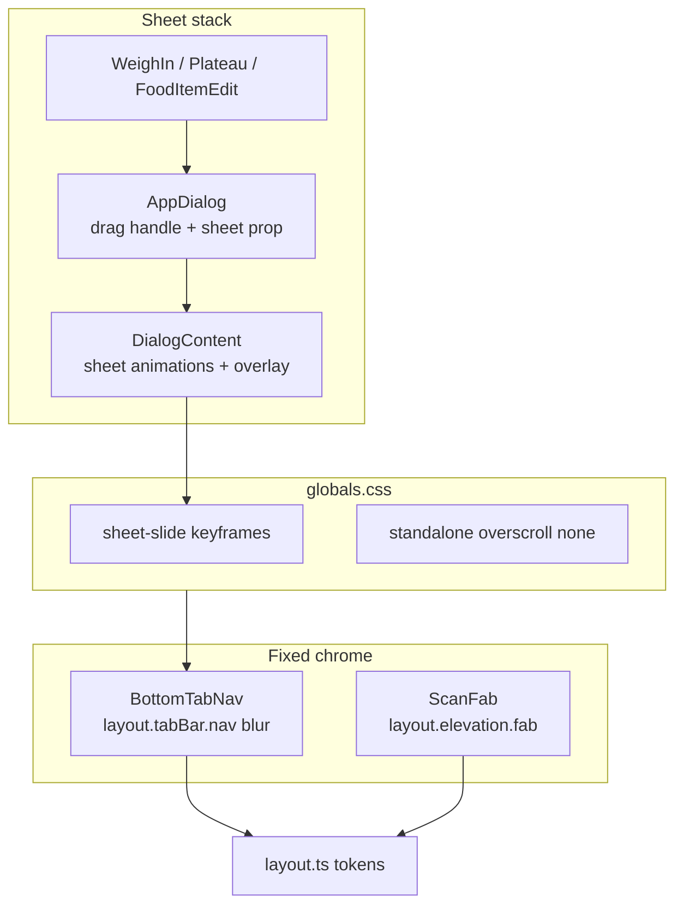

# WO03 — App Chrome, Tab Bar & Sheets

**Deliverables (planning phase):**
- [docs/implementation/web/PR-WO03.md](docs/implementation/web/PR-WO03.md) — WR-format spec (audit, sharpened decisions, file changes, tests, manual QA)
- [.cursor/plans/pr_wo03_app_chrome_tab_bar_sheets.plan.md](.cursor/plans/pr_wo03_app_chrome_tab_bar_sheets.plan.md) — synced Cursor implementation plan

**Canonical scope:** [web_optimization_sprint_68cb0f71.plan.md](.cursor/plans/web_optimization_sprint_68cb0f71.plan.md) WO03 section + user scope lock.

**Depends on:** WO01 + WO02 merged to `main` (confirmed). Baseline merge gate from `calsnap-web/`:

```bash
pnpm lint && pnpm test && pnpm build && pnpm test:integration && pnpm test:e2e
```

**Downstream:** WO04 (loading skeletons) depends on WO03 padding/chrome being stable.

---

## Current baseline (post WO01/WO02)

| Area | Current state | Gap |
|------|---------------|-----|
| Tab bar | Opaque `bg-cs-surface` in [`layout.tabBar.nav`](calsnap-web/lib/design/layout.ts) | No blur/translucency |
| Bottom sheets | [`AppDialog`](calsnap-web/components/design/AppDialog.tsx) positions bottom on mobile but inherits centered `zoom-in-95` from [`dialog.tsx`](calsnap-web/components/ui/dialog.tsx) | Wrong motion for iOS sheet |
| Drag handle | None | Missing affordance |
| Overlay | `bg-black/40` globally in `dialog.tsx` | Master plan wants softer sheet overlay |
| ScanFab | Inline `shadow-lg` in [`ScanFab.tsx`](calsnap-web/components/dashboard/ScanFab.tsx) | No design token |
| Overscroll | Not gated | Rubber-band still active in standalone PWA |
| Sheet footers | WO01 `pb-sheet-safe` on sheet `DialogContent` | CTAs need audit on 3 consumers |
| Animations lib | No `tailwindcss-animate` in [`package.json`](calsnap-web/package.json); only `chart-fade-in` keyframe in [`globals.css`](calsnap-web/app/globals.css) | Sheet slide must be explicit CSS keyframes |

**Precedent to reuse:** Settings save bar already uses translucent chrome — `bg-cs-surface/95 backdrop-blur` in [`settings/page.tsx`](calsnap-web/app/(app)/settings/page.tsx). Tab bar should use the master-plan spec (`/80` + `backdrop-blur-md`).

---

## Sharpened decisions (locked for WO03)

### Round 1 (planning)

| # | Question | Resolved answer | Rationale |
|---|----------|-----------------|-----------|
| 1 | Tab bar material | **`bg-cs-surface/80 backdrop-blur-md`** + existing `border-t border-cs-border`; token lives in `layout.tabBar.nav` | Lighter float reads more iOS-native over scrolling content; settings save bar stays `/95` (different chrome role) |
| 2 | Drag handle | **Decorative pill, mobile sheet only** (`sm:hidden`); `aria-hidden="true"` | Swipe-to-dismiss out of scope — handle is visual affordance only |
| 3 | Sheet motion (mobile) | **Slide up from bottom** via custom `@keyframes` in `globals.css` | No `tailwindcss-animate` dep; zoom-in is wrong for bottom sheets |
| 4 | Sheet motion (sm+) | **Keep centered zoom/fade** (existing classes) | AppDialog already switches to centered modal at `sm:` |
| 5 | Reduced motion | **CSS-only** — `prefers-reduced-motion` + `motion-reduce:animate-none` (see #22) | No AppDialog JS; avoids hydration mismatch |
| 6 | Overlay softening | **`bg-black/30` when `sheet=true` only**; [`alert-dialog.tsx`](calsnap-web/components/ui/alert-dialog.tsx) stays `/40` | Scope lock — centered confirms unchanged |
| 7 | Dialog refactor | **Add `sheet?: boolean` prop to `DialogContent`**; AppDialog passes it through | Clean split of overlay + animation vs className overrides |
| 8 | Elevation token | **`layout.elevation.fab`** string in `layout.ts` | One FAB token; no new `elevation.ts` file for a single export |
| 9 | Overscroll | **`overscroll-behavior-y: none` on `body` inside `@media (display-mode: standalone)` only** | Round-2 sprint lock; browser scroll unchanged |
| 10 | Sheet consumer scope | **Explicit verify:** WeighIn, Plateau, FoodItemEdit only | AnalyticsCustomRangeSheet inherits AppDialog polish; no dedicated audit row |
| 11 | E2E delta | **0 new specs** — existing 18 must stay green; viewport-320 tab nav assertion unchanged | Sprint contract |
| 12 | Unit tests | **Extend [`layout-safe-area.test.ts`](calsnap-web/tests/unit/layout-safe-area.test.ts)** with tab-bar blur, fab elevation, standalone overscroll asserts | Keeps layout token tests together |

### Round 2 (sharpen-plan 2026-07-01)

| # | Question | Resolved answer | Rationale |
|---|----------|-----------------|-----------|
| 13 | Tab bar opacity vs save bar | **`/80` (not `/95`)** | Tab bar floats over scrolling content; save bar overlays static form — different visual jobs |
| 14 | Mobile sheet top radius | **`rounded-t-2xl`** on mobile sheet | iOS sheets show visible top radius; add alongside existing `rounded-b-none` |
| 15 | Close X on mobile sheets | **Keep** top-right X | Swipe-to-dismiss deferred; X + backdrop are only explicit dismiss paths |
| 16 | Centered dialog `animate-in` | **Sheet slide only** — do not fix centered zoom or add `tailwindcss-animate` | Minimal diff; alert-dialog untouched; centered motion is pre-existing/no-op risk accepted |
| 17 | Overlay `/30` scope | **`sheet=true` prop only** | Not all mobile dialogs; not global; AppDialog sheets only |
| 18 | Footer audit count | **3 sheets** (WeighIn, Plateau, FoodItemEdit) | 4th AppDialog consumer inherits; spot-check optional in manual QA |

### Round 3 (sharpen-plan 2026-07-01)

| # | Question | Resolved answer | Rationale |
|---|----------|-----------------|-----------|
| 19 | Sheet slide easing | **`ease-out`, 300ms** (`SHEET_SLIDE_MS`) | Predictable with Radix open/close; no spring overshoot on dismiss |
| 20 | FAB elevation value | **`shadow-lg dark:shadow-lg`** in `layout.elevation.fab` | Preserves current look; tokenizes without subjective rgba tuning |
| 21 | Tab bar blur fallback | **No `supports-[backdrop-filter]` guard** | iOS PWA primary target; simpler token string |
| 22 | Reduced motion impl | **CSS-only** — `@media (prefers-reduced-motion: reduce)` + `motion-reduce:animate-none` on sheet classes | No JS in AppDialog; avoids hydration mismatch |
| 23 | Overscroll target | **`body` only** inside `@media (display-mode: standalone)` | Matches sprint spec; minimal surface area |
| 24 | Overlay fade timing | **Opacity only** (`/30` vs `/40`); keep existing **200ms** fade-in/out | Sheet slide carries the motion; no coordinated overlay retiming |

**No open sharpen questions remain.**

## Architecture



---

## Implementation plan

### 1. Tab bar blur material

**File:** [`calsnap-web/lib/design/layout.ts`](calsnap-web/lib/design/layout.ts)

Update `layout.tabBar.nav` from:

```23:23:calsnap-web/lib/design/layout.ts
    nav: 'fixed inset-x-0 bottom-0 z-10 border-t border-cs-border bg-cs-surface pb-safe',
```

To include `bg-cs-surface/80 backdrop-blur-md` (no `supports-[backdrop-filter]` guard — decision #21).

**File:** [`calsnap-web/components/app/BottomTabNav.tsx`](calsnap-web/components/app/BottomTabNav.tsx) — no direct class changes if token is updated in `layout.ts`.

**Verify:** Content scrolls beneath tab bar visually on dashboard at 320px; E2E tab nav selector unchanged.

---

### 2. Sheet infrastructure (`dialog.tsx` + `AppDialog.tsx`)

**File:** [`calsnap-web/components/ui/dialog.tsx`](calsnap-web/components/ui/dialog.tsx)

- Extend `DialogContent` with optional `sheet?: boolean`.
- When `sheet=true`:
  - Overlay: `bg-black/30` only (decision #24) — keep existing **200ms** fade-in/out classes; do not retime overlay to match sheet slide.
  - Mobile (default, `< sm`): apply sheet slide classes (`ease-out`, 300ms); **remove** `zoom-in-95` / center translate on mobile (AppDialog already sets `top-auto bottom-0 translate-y-0`).
  - `sm+`: keep existing centered zoom/fade classes unchanged (do **not** add `tailwindcss-animate` or fix centered motion in WO03).
- Export unchanged API for non-sheet callers.
- **Keep** top-right close X on all breakpoints (decision #15).
- **Do not** import `useReducedMotion` in `dialog.tsx` — reduced motion is CSS-only (decision #22).

**File:** [`calsnap-web/components/design/AppDialog.tsx`](calsnap-web/components/design/AppDialog.tsx)

- Pass `sheet={sheet}` to `DialogContent`.
- Extend mobile sheet positioning classes with **`rounded-t-2xl`** (keep `rounded-b-none`; `sm:rounded-2xl` for centered fallback).
- Render drag handle **before** `DialogHeader` when `sheet`:

```tsx
<div className="mx-auto mb-3 h-1 w-10 rounded-full bg-cs-border sm:hidden" aria-hidden />
```

- **No** `useReducedMotion()` in AppDialog — sheet slide gated via CSS `prefers-reduced-motion` only (decision #22).
- Keep existing WO01 classes: `pb-sheet-safe`, bottom positioning, `sm:` centered fallback.

**File:** [`calsnap-web/lib/design/motion.ts`](calsnap-web/lib/design/motion.ts)

- Add `SHEET_SLIDE_MS = 300` and `SHEET_SLIDE_EASING = 'ease-out'` (align duration with `SCAN_FADE_MS`; easing locked decision #19).

**File:** [`calsnap-web/app/globals.css`](calsnap-web/app/globals.css)

Add keyframes + utility classes:

```css
@keyframes sheet-slide-in {
  from { transform: translateY(100%); }
  to { transform: translateY(0); }
}
@keyframes sheet-slide-out {
  from { transform: translateY(0); }
  to { transform: translateY(100%); }
}
/* Utility classes: 300ms ease-out; disabled under prefers-reduced-motion */
```

Wire classes on sheet `DialogContent` for mobile only (`max-sm:` or default-mobile). Use `motion-reduce:animate-none` and wrap keyframe utilities in `@media (prefers-reduced-motion: no-preference)` (decision #22). Duration/easing: **300ms ease-out** (decisions #19, #24).

---

### 3. ScanFab elevation token

**File:** [`calsnap-web/lib/design/layout.ts`](calsnap-web/lib/design/layout.ts)

```ts
elevation: {
  fab: 'shadow-lg dark:shadow-lg',
},
```

Maps to current `ScanFab` appearance (decision #20) — no custom rgba values.

**File:** [`calsnap-web/components/dashboard/ScanFab.tsx`](calsnap-web/components/dashboard/ScanFab.tsx) — swap inline `shadow-lg` → `layout.elevation.fab`.

**Verify:** FAB still clears tab bar via `layout.fixed.aboveTabBar` (WO01); no position changes.

---

### 4. Standalone-only overscroll

**File:** [`calsnap-web/app/globals.css`](calsnap-web/app/globals.css)

```css
@media (display-mode: standalone) {
  body {
    overscroll-behavior-y: none;
  }
}
```

**`body` only** (decision #23). Do **not** apply in browser mode (desktop/mobile Safari tab) — sprint round-2 lock.

---

### 5. Sheet consumer footer audit (verify-only)

Audit each consumer; change only if P1 gap found:

| Sheet | File | Footer pattern | Expected pass |
|-------|------|----------------|---------------|
| Weigh-in | [`WeighInSheet.tsx`](calsnap-web/components/progress/WeighInSheet.tsx) | CTAs in `children`; Primary/Secondary `min-h-11` | `pb-sheet-safe` clears home indicator |
| Plateau | [`PlateauAlertSheet.tsx`](calsnap-web/components/dashboard/PlateauAlertSheet.tsx) | Option cards + ghost dismiss `min-h-11` | Last button above safe area |
| Food item edit | [`FoodItemEditSheet.tsx`](calsnap-web/components/scanner/FoodItemEditSheet.tsx) | Cancel/Save row `min-h-11 flex-1` | Buttons above safe area |

**Likely outcome:** No consumer diffs — WO01 `pb-sheet-safe` + existing `min-h-11` should pass. Document audit rows in PR-WO03 §1.

**Inherited (no audit row):** [`AnalyticsCustomRangeSheet.tsx`](calsnap-web/components/analytics/AnalyticsCustomRangeSheet.tsx) — gets drag handle, slide, overlay, and radius via AppDialog; optional spot-check in manual QA only.

**Out of scope:** [`ConfirmAlertDialog`](calsnap-web/components/design/ConfirmAlertDialog.tsx) / `alert-dialog.tsx` overlay and motion.

---

## Tests

### Unit (merge-blocking)

Extend [`tests/unit/layout-safe-area.test.ts`](calsnap-web/tests/unit/layout-safe-area.test.ts):

- `layout.tabBar.nav` contains `backdrop-blur`
- `layout.elevation.fab` equals `'shadow-lg dark:shadow-lg'`
- `globals.css` contains `@media (display-mode: standalone)` + `overscroll-behavior-y: none`
- `globals.css` contains sheet slide keyframes (e.g. `sheet-slide-in`)

**Expected delta:** +1 test file or +3–4 `it()` blocks; ~212 → ~216 unit tests.

### E2E (merge-blocking)

- **No new specs** — all 18 existing tests green
- [`viewport-320.spec.ts`](calsnap-web/tests/e2e/viewport-320.spec.ts): tab nav + calorie ring still visible; no horizontal scroll with blurred tab bar

### Manual (document in PR-WO03 §8 — Pending operator)

| Scenario | Environment | Pass criteria |
|----------|-------------|---------------|
| Tab bar translucency | iPhone standalone PWA | Content subtly visible through blur; hairline separator |
| Weigh-in sheet motion | iPhone Safari 320px | Slide up; primary Save ≥44px; above home indicator |
| Plateau sheet focus trap | iPhone Safari | Tab cycle stays in sheet; dismiss works |
| Reduced motion | iOS Reduce Motion ON | Sheet opens without slide |
| Standalone overscroll | iPhone standalone | No rubber-band bounce on dashboard scroll end |
| Browser overscroll | iPhone Safari browser | Normal bounce preserved |
| ScanFab elevation | Dashboard standalone | FAB visually floats above content; no tab overlap |

---

## Out of scope (explicit)

- View Transitions API
- PageHeader / iOS large titles
- Swipe-to-dismiss sheets
- Skeletons / loading gates (WO04)
- Keyboard inset / 16px inputs (WO05)
- Manifest / SW / PWA asset changes
- Tab count / icon changes
- `ConfirmAlertDialog` polish

---

## Residual risks (document in PR-WO03 §7)

| Risk | Notes |
|------|-------|
| Swipe-to-dismiss | Radix has no native swipe; drag handle is decorative only |
| `backdrop-filter` perf | Low risk on single tab bar; monitor on older devices |
| Sheet slide + Radix focus trap | Test weigh-in/plateau manually |
| Centered dialog `animate-in` no-op | Accepted deferral — WO03 fixes sheet slide only; no `tailwindcss-animate` dep |
| Playwright cannot test standalone overscroll | Manual sign-off only |
| Dark mode blur contrast | Verify tab labels readable over scrolled content |

---

## Implementation order

1. Run merge gate on `main`; record baseline counts in PR-WO03 §2
2. Add sheet keyframes + standalone overscroll to `globals.css`
3. Add `SHEET_SLIDE_MS` to `motion.ts`
4. Refactor `dialog.tsx` — `sheet` prop, overlay + animation split
5. Update `AppDialog.tsx` — drag handle, pass `sheet`, reduced motion
6. Update `layout.ts` — tab bar blur + `elevation.fab`
7. Update `ScanFab.tsx` — use elevation token
8. Audit WeighIn / Plateau / FoodItemEdit footers; fix only if P1
9. Extend unit tests; run full merge gate
10. Fill PR-WO03 findings matrix + §8 Pending manual rows

---

## Acceptance criteria

- Tab bar uses translucent blur material + safe area (WO01 tokens preserved)
- All AppDialog sheets show drag handle + `rounded-t-2xl` on mobile; slide-up motion on open/close; close X retained
- Reduced motion disables sheet slide (CSS `prefers-reduced-motion` only; no AppDialog JS)
- Sheet overlay `bg-black/30`; alert dialogs unchanged
- ScanFab uses `layout.elevation.fab`; position unchanged
- Standalone PWA disables vertical overscroll; browser mode unchanged
- WeighIn / Plateau / FoodItemEdit primary actions ≥44px and above home indicator (audit documented)
- Merge gate green; E2E count unchanged (18); PR-WO03 complete
