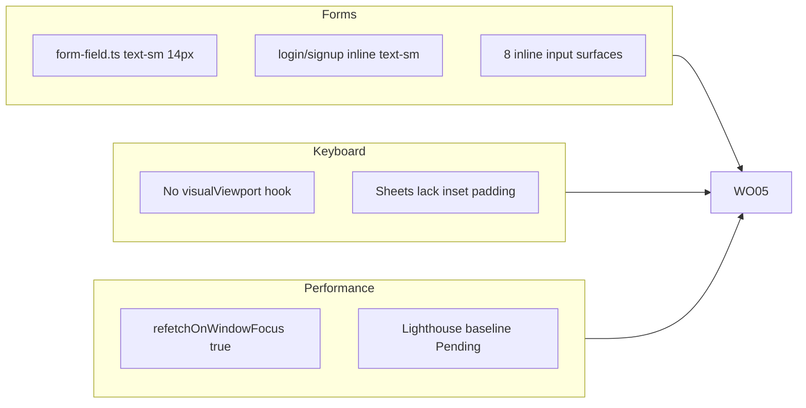
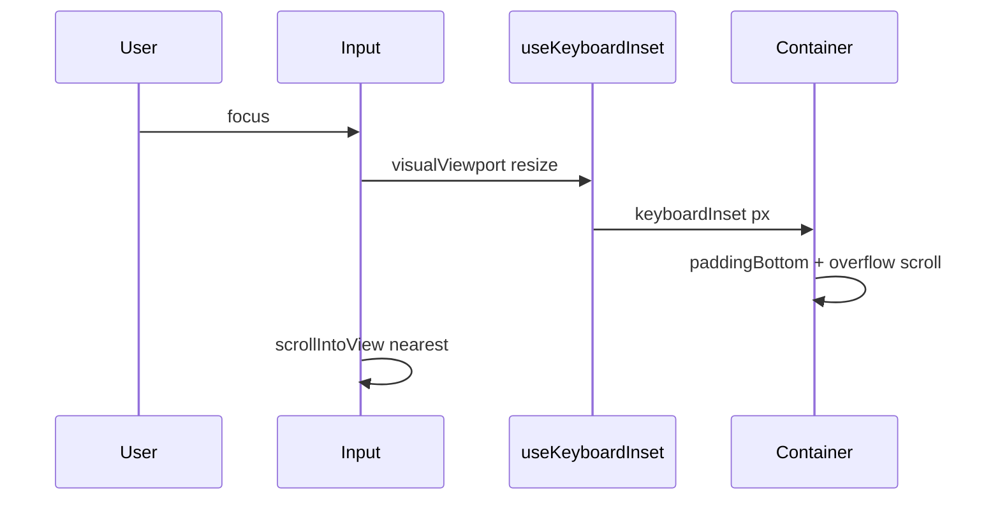

# WO05 — Forms, Keyboard & Performance Sign-off

**Depends on:** WO01–WO04 merged to `main` (layout tokens, sheets, skeleton bootstrap stable).  
**Doc format:** Match [PR-WR01.md](docs/implementation/web/PR-WR01.md) / [PR-WO01.md](docs/implementation/web/PR-WO01.md) section structure.  
**Master scope:** [web_optimization_sprint_68cb0f71.plan.md](.cursor/plans/web_optimization_sprint_68cb0f71.plan.md) § WO05.

---

## Sharpened decisions (locked — do not re-open)

### Round 1 (master plan)

| #   | Decision               | Choice                                                                                                                                                                                             |
| --- | ---------------------- | -------------------------------------------------------------------------------------------------------------------------------------------------------------------------------------------------- |
| 1   | Mobile input font size | `text-base sm:text-sm` on **all** visible text inputs, number inputs, date inputs, textareas, and selects                                                                                          |
| 2   | Central token          | Update `[formFieldInputClassName](calsnap-web/lib/design/form-field.ts)`; migrate inline duplicates                                                                                                |
| 3   | Query tuning           | `refetchOnWindowFocus: false` globally; **keep** `staleTime: 30_000`; per-query overrides only if tab-switch spinners observed in audit                                                            |
| 4   | Keyboard hook location | New `[lib/hooks/use-keyboard-inset.ts](calsnap-web/lib/hooks/use-keyboard-inset.ts)` — `useSyncExternalStore` + `visualViewport` (same pattern as `[motion.ts](calsnap-web/lib/design/motion.ts)`) |
| 5   | Keyboard integration   | Consumer-level padding + `scrollIntoView` on focus — **not** a global `AppDialog` change                                                                                                           |
| 6   | Keyboard consumers     | WeighInSheet, FoodItemEditSheet, ManualMealEntryView, onboarding page shell, **settings page scroll container** |
| 7   | Lighthouse policy      | Fix **all** a11y audit failures; numeric targets (Perf ≥70, A11y ≥90) informative only ([WR07 §4](docs/implementation/web/PR-WR07.md))                                                             |
| 8   | Manual QA              | Document WR07 §8 + WR08 §8 rows as **Pending** in PR-WO05 §8 — non-blocking for merge                                                                                                              |
| 9   | E2E delta              | **0 new specs** — skip keyboard E2E entirely (Playwright cannot emulate iOS virtual keyboard)                                                                                                      |
| 10  | ESLint copy guard      | P3 defer — residual risk only                                                                                                                                                                      |
| 11  | Sprint docs            | Create missing `[OPTIMIZATION-MASTER-PLAN.md](docs/implementation/web/OPTIMIZATION-MASTER-PLAN.md)` at close-out; mark WO01–WO05 complete in README                                                |

### Round 2 (sharpen-plan — locked 2026-07-01)

| # | Question | Locked answer | Rationale |
|---|----------|---------------|-----------|
| 12 | Keyboard inset layer | **Consumer-only** — each form surface wraps its own scroll container; `AppDialog` unchanged | PlateauAlertSheet has no inputs; global sheet change is higher regression risk for low gain |
| 13 | Settings page keyboard | **Include** — apply hook to settings page scroll container | WR07 keyboard matrix lists settings; save bar already above tab bar (WO01); lower fields at 320px are the real occlusion risk |
| 14 | Lighthouse environment | **Vercel preview HTTPS** (logged-in onboarded session) | Repeatable, safe to iterate a11y fixes; document preview URL + date in PERF-BASELINE.md (note prod parity in §8 manual) |
| 15 | Inline input migration | **Import `formFieldInputClassName` + `formFieldFocusRingClassName`** on every inline surface (incl. textarea) | Single token source of truth; grep gate stays one class name |
| 16 | Keyboard E2E | **Skip entirely** — no `keyboard-weigh-in.spec.ts` | Manual §8 is the real gate; emulator focus ≠ iOS keyboard behavior |

### Round 3 (sharpen-plan — locked 2026-07-01)

| # | Question | Locked answer | Rationale |
|---|----------|---------------|-----------|
| 17 | Auth page 16px token | **Import `formFieldInputClassName` directly** — remove auth-local `inputClassName` string | Focus ring already embedded in token; eliminates duplicate class strings |
| 18 | Settings save bar + keyboard | **Bump fixed save bar `bottom` by `keyboardInset`** when keyboard open | Save bar is `position: fixed`; scroll padding alone does not move it above the keyboard |
| 19 | Focus scroll helper | **Export `scrollFormFieldIntoView(event)`** from `use-keyboard-inset.ts` | Single implementation; consumers wire `onFocus`; respects `useReducedMotion()` |
| 20 | Manual meal numeric fields | **Keep raw `<input type="number">`** — add `inputMode` + token classes only | Minimal diff; no `LocalNumberInput` migration in final polish PR |
| 21 | Lighthouse a11y boundary | **Audit 3 routes only** (`/dashboard`, `/scan`, `/settings`); apply global token/component fixes when root cause is shared | Matches WR07/WR08 scope; no extra route audits |
| 22 | Query client unit test | **Add `tests/unit/query-client.test.ts`** — assert `refetchOnWindowFocus: false` + `staleTime: 30_000` | Prevents silent regression of conservative tuning |


---

## Current gaps (pre-WO05 audit)




| Gap                | Evidence                                                                                                                                                                                             | WO05 fix                                                                        |
| ------------------ | ---------------------------------------------------------------------------------------------------------------------------------------------------------------------------------------------------- | ------------------------------------------------------------------------------- |
| iOS zoom risk      | `[form-field.ts](calsnap-web/lib/design/form-field.ts)` L7 `text-sm`; auth `[login/page.tsx](calsnap-web/app/(auth)`/login/page.tsx) L16                                                             | `text-base sm:text-sm` everywhere                                               |
| No keyboard inset  | Zero `visualViewport` usage                                                                                                                                                                          | `useKeyboardInset()` hook                                                       |
| Tab-switch refetch | `[query-client.ts](calsnap-web/lib/queries/query-client.ts)` L8 `refetchOnWindowFocus: true`                                                                                                         | Set `false`                                                                     |
| Lighthouse pending | [PR-WR07 §4](docs/implementation/web/PR-WR07.md), [PR-WR08 §8 row 18](docs/implementation/web/PR-WR08.md)                                                                                            | Run + fix a11y → `[PERF-BASELINE.md](docs/implementation/web/PERF-BASELINE.md)` |
| inputMode gaps     | `[ManualMealEntryView](calsnap-web/components/scanner/ManualMealEntryView.tsx)`, `[FoodItemEditSheet](calsnap-web/components/scanner/FoodItemEditSheet.tsx)` use `type="number"` without `inputMode` | Audit + add `inputMode` / `enterKeyHint`                                        |


**Already OK (no change unless audit finds issue):** `[LocalNumberInput](calsnap-web/components/design/LocalNumberInput.tsx)` (`inputMode` prop), `[HeightInputFields](calsnap-web/components/design/HeightInputFields.tsx)` (`numeric`), WeighIn weight field (`text-4xl` >> 16px), auth `autoComplete` on email/password.

---

## Phase 1 — Baseline merge gate

From `calsnap-web/`:

```bash
pnpm lint && pnpm test && pnpm build && pnpm test:integration && pnpm test:e2e
```

Record counts in PR-WO05 §2 (expected post-WO04: **222** unit tests, **18** E2E, per [PR-WO04.md](docs/implementation/web/PR-WO04.md)).

**Input audit grep** (document hits in §1):

```bash
rg 'text-sm' calsnap-web --glob '*.{tsx,ts}' | rg 'input|textarea|select|formField'
```

---

## Phase 2 — 16px mobile inputs

### 2a. Central token

`[calsnap-web/lib/design/form-field.ts](calsnap-web/lib/design/form-field.ts)`:

```ts
// text-sm → text-base sm:text-sm
'... px-3 py-2 text-base sm:text-sm text-cs-foreground'
```

Fixes all consumers of `formFieldInputClassName`: onboarding steps, settings (`ProfileSection`, `NotificationsSection`), `HeightInputFields`.

### 2b. Auth pages

Replace auth-local `inputClassName` with direct import of `formFieldInputClassName` in both:

- [`app/(auth)/login/page.tsx`](calsnap-web/app/(auth)/login/page.tsx) — drop separate `formFieldFocusRingClassName` import (already in token)
- [`app/(auth)/signup/page.tsx`](calsnap-web/app/(auth)/signup/page.tsx) — same

Add while touching: `inputMode="email"` on email fields; `enterKeyHint="go"` on password (login) / `done` (signup).

### 2c. Inline input surfaces (import shared tokens — no local `text-base sm:text-sm` duplicates)


| File                                                                                              | Inputs          | Action                                                                                          |
| ------------------------------------------------------------------------------------------------- | --------------- | ----------------------------------------------------------------------------------------------- |
| `[ManualMealEntryView.tsx](calsnap-web/components/scanner/ManualMealEntryView.tsx)`               | 5 text/number   | `formFieldInputClassName` only (ring embedded); add `inputMode` on number fields — **no** `LocalNumberInput` migration |
| `[FoodItemEditSheet.tsx](calsnap-web/components/scanner/FoodItemEditSheet.tsx)`                   | 2               | `formFieldInputClassName` only (ring embedded)                                                  |
| `[WeighInSheet.tsx](calsnap-web/components/progress/WeighInSheet.tsx)`                            | date input L123 | `formFieldInputClassName` (weight `text-4xl` unchanged)                                         |
| `[AnalyticsCustomRangeSheet.tsx](calsnap-web/components/analytics/AnalyticsCustomRangeSheet.tsx)` | 2 date          | `formFieldInputClassName`                                                                       |
| `[MealScannerCaptureView.tsx](calsnap-web/components/scanner/MealScannerCaptureView.tsx)`         | textarea L87    | `formFieldInputClassName` — textarea uses same token as inputs                                    |


**Post-fix grep gate:** zero inline `text-sm` on `<input`, `<textarea`, `<select` class strings; all form controls reference `formFieldInputClassName` (auth pages import token directly — no local duplicate string).

---

## Phase 3 — `useKeyboardInset` hook

### API contract (PR-WO05 §5)

```ts
/** Pixels of virtual keyboard overlapping the layout viewport bottom. 0 when closed or unsupported. */
export function useKeyboardInset(): number

/** Scroll focused form control into view; respects useReducedMotion for behavior. */
export function scrollFormFieldIntoView(event: FocusEvent<HTMLElement>): void
```

**Implementation sketch** ([`lib/hooks/use-keyboard-inset.ts`](calsnap-web/lib/hooks/use-keyboard-inset.ts)):

- `useSyncExternalStore(subscribe, getSnapshot, getServerSnapshot)`
- Subscribe to `visualViewport` `resize` + `scroll` events
- Snapshot: `Math.max(0, window.innerHeight - vv.height - vv.offsetTop)`
- SSR / no `visualViewport`: return `0`
- `scrollFormFieldIntoView`: `event.currentTarget.scrollIntoView({ block: 'nearest', behavior: reducedMotion ? 'instant' : 'smooth' })`




### Integration points (consumer-only — `AppDialog` unchanged)


| Consumer | Change |
|----------|--------|
| [`WeighInSheet.tsx`](calsnap-web/components/progress/WeighInSheet.tsx) | Wrap form in `overflow-y-auto` container; `style={{ paddingBottom: keyboardInset }}`; `onFocus={scrollFormFieldIntoView}` on weight + date inputs |
| [`FoodItemEditSheet.tsx`](calsnap-web/components/scanner/FoodItemEditSheet.tsx) | Same pattern on form wrapper |
| [`ManualMealEntryView.tsx`](calsnap-web/components/scanner/ManualMealEntryView.tsx) | `paddingBottom: keyboardInset` on root div; `onFocus={scrollFormFieldIntoView}` on card inputs |
| [`onboarding/page.tsx`](calsnap-web/app/(onboarding)/onboarding/page.tsx) | Inset on `layout.pageShell` scroll container; footer CTAs stay above keyboard at 320px |
| [`settings/page.tsx`](calsnap-web/app/(app)/settings/page.tsx) | Inset on main scroll container; **dirty save bar** gets `bottom` offset += `keyboardInset` when `form.isDirty`; `onFocus={scrollFormFieldIntoView}` on profile/macro inputs |


**Explicitly out of scope:** `AppDialog` global `keyboardAware` prop; `PlateauAlertSheet` (no inputs); centered `ConfirmAlertDialog`; `AnalyticsCustomRangeSheet` keyboard (lower traffic — residual risk).

---

## Phase 4 — inputMode / enterKeyHint audit


| Surface                            | inputMode             | enterKeyHint    | autoComplete |
| ---------------------------------- | --------------------- | --------------- | ------------ |
| Auth email                         | `email`               | `next`          | already set  |
| Auth password                      | —                     | `go` / `done`   | already set  |
| Manual meal name                   | —                     | `next`          | `off`        |
| Manual meal weight/calories/macros | `decimal` / `numeric` | `next` / `done` | `off`        |
| FoodItemEditSheet weight           | `decimal`             | `done`          | —            |
| WeighIn weight                     | `decimal`             | `done`          | —            |
| Height fields                      | `numeric`             | —               | already set  |
| Date inputs                        | — (native picker)     | —               | —            |


Propagate via `LocalNumberInput` `...rest` where not already explicit.

---

## Phase 5 — Query client tuning

`[calsnap-web/lib/queries/query-client.ts](calsnap-web/lib/queries/query-client.ts)`:

```ts
refetchOnWindowFocus: false,  // was true
staleTime: 30_000,            // unchanged
```

**Post-change audit:** Tab-switch manually (dashboard ↔ log ↔ settings) on 320px — confirm no loading spinners within 30s stale window. If a query flashes, add targeted override in that hook only and document in PR-WO05 findings.

Leave `[use-meal.ts](calsnap-web/lib/queries/use-meal.ts)` `staleTime: fresh ? 0 : undefined` unchanged (post-log freshness).

---

## Phase 6 — Lighthouse + PERF-BASELINE.md

### Run on **Vercel preview HTTPS** (locked sharpen decision #14)

1. Deploy branch to Vercel preview (or use latest WO05 preview URL).
2. Sign in with onboarded test account in Chrome incognito.
3. Mobile preset, throttling on; run against:
   - `/dashboard`
   - `/scan`
   - `/settings`

Document preview deployment URL, commit SHA, and date. Note in PERF-BASELINE §8 that WR08 operator smoke may re-run on production URL separately.

### Deliverable: `[docs/implementation/web/PERF-BASELINE.md](docs/implementation/web/PERF-BASELINE.md)`

Structure (mirror WR07 §4 table + methodology):

- **Vercel preview URL**, date, Chrome version
- Scores table (Perf / A11y / BP / SEO × 3 pages)
- **A11y failures found → fix mapping** (required)
- Informative targets note (Perf ≥70, A11y ≥90 non-blocking)
- Link to PR-WO05 findings matrix

### Expected a11y fix areas (fix whatever audit reports)

- Missing / duplicate labels on form controls
- Color contrast on muted text or chart axes
- Focus order or `aria-*` on interactive chips
- Button accessible names

Re-run Lighthouse after fixes until **zero a11y audit failures** on the 3 audited routes (scores may still be below 90). Do **not** expand audit to `/log`, `/progress`, or `/analytics` — apply shared fixes globally when root cause is a design token or shared component.

---

## Phase 7 — Documentation close-out

### New files


| File                                                                                                         | Purpose                                                |
| ------------------------------------------------------------------------------------------------------------ | ------------------------------------------------------ |
| `[docs/implementation/web/PR-WO05.md](docs/implementation/web/PR-WO05.md)`                                   | Full PR spec (WR01 format)                             |
| `[docs/implementation/web/PERF-BASELINE.md](docs/implementation/web/PERF-BASELINE.md)`                       | Lighthouse baseline                                    |
| `[docs/implementation/web/OPTIMIZATION-MASTER-PLAN.md](docs/implementation/web/OPTIMIZATION-MASTER-PLAN.md)` | Mirror cursor sprint plan; mark WO01–WO05 **Complete** |
| `[.cursor/plans/pr_wo05_forms_keyboard_perf.plan.md](.cursor/plans/pr_wo05_forms_keyboard_perf.plan.md)`     | Agent implementation plan                              |


### PR-WO05.md sections

1. Header (Status, Sprint, Depends on WO04, Plan link)
2. Sharpened decisions (table above)
3. Audit checklist (16px grep, keyboard, query, Lighthouse)
4. Baseline merge gate snapshot (before/after counts)
5. Findings matrix (`WO05-FORM-01`, `WO05-KB-01`, `WO05-QUERY-01`, `WO05-A11Y-01`, …)
6. Fix list (file → change)
7. Design contract (hook API, form field class, query defaults)
8. Tests (unit table)
9. Residual risks (ESLint copy guard P3, Android keyboard variance, AnalyticsCustomRangeSheet keyboard deferral)
10. **Manual sign-off** — consolidated Pending tables (below)
11. Acceptance criteria checklist
12. Files changed index

### PR-WO05 §8 — Manual sign-off tables (all Pending)

**A. WR07 carryover** ([PR-WR07.md §8](docs/implementation/web/PR-WR07.md)):


| Scenario                                                             | Environment    | Signed off |
| -------------------------------------------------------------------- | -------------- | ---------- |
| Light + dark all tabs                                                | Local browser  | Pending    |
| 320px + 200% zoom primary flows                                      | DevTools       | Pending    |
| Keyboard matrix (login, onboarding, settings, weigh-in, manual meal) | Local / device | Pending    |
| Mobile Lighthouse ×3                                                 | Chrome Mobile  | Pending    |
| Reduced motion — scan stagger + charts                               | Local          | Pending    |


**B. WR08 carryover** ([PR-WR08.md §8](docs/implementation/web/PR-WR08.md)) — reference full matrix rows 1–20 + pre-flight; all **Pending** except row 12 (CI Done) and rules deploy Done.

**C. WO05-specific**:


| Scenario              | Environment         | Pass criteria                                            | Signed off |
| --------------------- | ------------------- | -------------------------------------------------------- | ---------- |
| iOS Safari input zoom | iPhone Safari 320px | No page zoom on settings/onboarding numeric focus | Pending |
| Settings keyboard | iPhone Safari 320px | Lower profile fields visible; save bar reachable above keyboard | Pending |
| Weigh-in keyboard | iPhone standalone | Weight input visible; save CTA reachable | Pending |
| Tab switch no spinner | iOS PWA             | Dashboard ↔ Log ↔ Settings within 30s — no refetch flash | Pending    |


**D. Optimization sprint completion** (from master plan success criteria §):


| Criterion                                     | Status                 |
| --------------------------------------------- | ---------------------- |
| Safe-area / PWA / chrome / skeleton (WO01–04) | Done (code)            |
| 16px inputs + keyboard hook (WO05)            | Pending implementation |
| PERF-BASELINE + zero a11y failures            | Pending Lighthouse run |
| CI merge gate green                           | Pending final gate     |
| Manual device QA                              | Pending operator       |


### README update (`[docs/implementation/web/README.md](docs/implementation/web/README.md)`)

- WO05 row → `Complete` + link `PR-WO05.md`
- Add `PERF-BASELINE.md` and `OPTIMIZATION-MASTER-PLAN.md` links under Optimization sprint section
- Note: "Optimization sprint code-complete; operator manual QA Pending"

---

## Phase 8 — Tests

### Merge-blocking unit tests


| File | Tests |
|------|-------|
| `tests/unit/use-keyboard-inset.test.ts` (new) | Mock `visualViewport`: closed → 0; resized → positive inset; SSR snapshot → 0; unsubscribe on unmount; `scrollFormFieldIntoView` calls `scrollIntoView` with correct `behavior` when reduced motion mocked |
| `tests/unit/form-field.test.ts` (new) | `formFieldInputClassName` contains `text-base` + `sm:text-sm` |
| `tests/unit/query-client.test.ts` (new) | `createQueryClient()` defaults: `refetchOnWindowFocus: false`, `staleTime: 30_000` |


**Expected delta:** +8–10 unit tests (222 → ~230–232).

### E2E (no new specs — sharpen decision #16)

**Do not add** `keyboard-weigh-in.spec.ts` or any keyboard-focused E2E. Playwright cannot emulate iOS virtual keyboard; manual §8 is the gate.

All **18** existing specs must stay green (no selector changes expected).

---

## Acceptance criteria

- [ ] All form inputs use `text-base sm:text-sm` on mobile (grep gate clean)
- [ ] `useKeyboardInset` hook + unit tests
- [ ] Keyboard inset applied in WeighInSheet, FoodItemEditSheet, ManualMealEntryView, onboarding page, settings page
- [ ] `AppDialog` unchanged (consumer-only integration)
- [ ] Auth pages import `formFieldInputClassName` directly (no local duplicate)
- [ ] `scrollFormFieldIntoView` exported + wired on keyboard consumer inputs
- [ ] Settings dirty save bar bumps `bottom` by `keyboardInset` when keyboard open
- [ ] `inputMode` / `enterKeyHint` audit complete on listed surfaces
- [ ] `refetchOnWindowFocus: false`; `staleTime: 30_000` preserved; `query-client.test.ts` passes
- [ ] PERF-BASELINE.md populated from **Vercel preview** HTTPS run
- [ ] All Lighthouse **a11y audit failures** fixed on 3 audited routes (re-run verified)
- [ ] PR-WO05.md complete with WR07/WR08 Pending §8 tables
- [ ] OPTIMIZATION-MASTER-PLAN.md + README close-out
- [ ] Merge gate green; zero open P0/P1 in WO05 scope
- [ ] No new product features; deferred items unchanged

---

## Residual risks (document in PR-WO05 §9)


| Risk | Notes |
|------|-------|
| ESLint copy guard | P3 carryover from WR07 — not in WO05 scope |
| Android keyboard / visualViewport variance | Best-effort; iOS primary |
| Playwright keyboard E2E | Skipped by design — manual §8 required |
| Dashboard double skeleton LCP | WO04 accepted; verify no regression in Lighthouse doc |
| `AnalyticsCustomRangeSheet` keyboard | Deferred — date picker sheet; lower traffic |
| Preview vs prod Lighthouse delta | Scores may differ; operator may re-run on prod per WR08 §8 |


