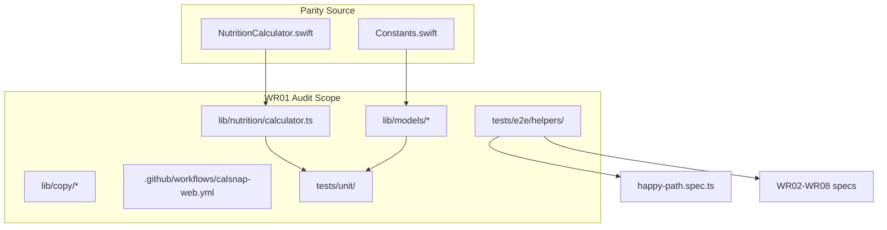

# WR01 — Foundation, CI & Domain Logic

## Context

Post-build review sprint entry point ([REVIEW-MASTER-PLAN.md](docs/implementation/web/REVIEW-MASTER-PLAN.md)). WR01 re-validates W01 deliverables against [PR-W01.md](docs/implementation/web/PR-W01.md) and live iOS sources (`CalSnap/Core/Services/NutritionCalculator.swift`, `CalSnap/Core/Utilities/Constants.swift`). The app has grown beyond W01 (auth, scanner, etc.) but WR01 scope stays on foundation + shared domain.

**Locked constraints:** Fix all P0/P1; defer P3 to residual risks; never call real Gemini in CI; shared E2E helpers are merge-blocking.

**User decisions (locked for this plan):**
- `minAgeYears: 16` — intentional web delta (iOS is 18)
- `Gemini.maxTokens: 4096` — intentional web delta (iOS/technical-spec is 2048)

**Sharpened decisions (plan stress-test):**
- **E2E depth:** Minimal extract + `loginUser` — auth (signup + login), api-mocks, fixtures, navigation; domain helpers (scanner, meal-log, etc.) deferred to WR02+
- **Mapper tests:** Test in-place from `lib/repositories/profile.ts` — no colocate/refactor in WR01
- **Calendar parity:** Document as platform delta; add 1–2 fixed-date web tests for projection helpers; no iOS rewrite or golden fixtures
- **P2 scope:** P1 fixes only — all P2 items deferred to residual risks / later WRs
- **Baseline failure:** Fix-first — any Step 0 merge gate failure is P0; block domain/E2E work until green
- **loginWithEmail verification:** Helper only — no WR01 login E2E spec; WR02 adds first login test
- **Auth API shape:** Granular helpers (`uniqueTestEmail`, `signUpWithEmail`, `loginWithEmail`, `completeOnboarding`) + composite `createOnboardedUser(page)` for happy-path and WR04+
- **Implementation order:** Baseline → unit tests (mappers + calculator) → E2E helpers → happy-path refactor → `PR-WR01.md` → verify gate
- **Web delta documentation:** `PR-WR01.md` residual risks only — no inline code comments or README changes for minAge/maxTokens
- **Mock lifecycle:** Explicit per spec — each test calls `mockAnalyzeMeal(page)` at start; no Playwright fixture or global mock
- **createOnboardedUser return:** `{ email, password }` — WR02 login spec reuses credentials
- **Mapper test depth:** Happy-path round-trip only — one test per entity (meal, weigh-in, profile)
- **Happy-path domain steps:** Scan + weigh-in stay inline in `happy-path.spec.ts`; WR03/WR04 extract domain helpers
- **Plan deliverable:** Copy/sync to repo at `.cursor/plans/pr_wr01_foundation.plan.md` per REVIEW-MASTER-PLAN
- **E2E password:** Export `E2E_TEST_PASSWORD` constant from `auth.ts` — single source matching current happy-path

---

## Step 0 — Merge gate baseline (before any code changes)

Run from `calsnap-web/` and record pass/fail + counts in [PR-WR01.md](docs/implementation/web/PR-WR01.md):

```bash
pnpm lint && pnpm test && pnpm build && pnpm test:integration && pnpm test:e2e
```

CI already mirrors this in [.github/workflows/calsnap-web.yml](.github/workflows/calsnap-web.yml) (unit job: lint + test + build + GEMINI bundle grep; integration + e2e jobs parallel/sequential).

**Failure protocol (locked):** If any step fails, stop audit work, triage as P0, fix until green, then resume WR01. Do not proceed with helper extraction or test expansion on a red baseline.

---

## Audit findings matrix

| ID | Sev | Area | Finding | Action |
|----|-----|------|---------|--------|
| WR01-E2E-01 | **P1** | E2E | Only `helpers/onboarding.ts` + inline mocks in `happy-path.spec.ts`; no shared auth/api-mock/fixture utilities for WR02–WR08 | **Fix** — build helper scaffold (merge-blocking) |
| WR01-MAP-01 | **P1** | Models | Zero round-trip unit tests for `mealDocToEntry`/`mealEntryToDoc`, `weighInDocToEntry`/`weighInToDoc`, `profileToDoc`/`docToProfile` | **Fix** — add `tests/unit/model-mappers.test.ts` |
| WR01-CAL-01 | **P1** | Nutrition | 5 of 13 calculator functions lack direct unit tests: `macroPercents`, `fiberTargetG`, `weeklyLossRateKg`, `projectedGoalDate`, `projectionPoints` | **Fix** — expand [nutrition-calculator.test.ts](calsnap-web/tests/unit/nutrition-calculator.test.ts) |
| WR01-CAL-02 | **P2** | Nutrition | `dailyTarget` female floor (1200), deficit thresholds (500/750), all 5 `activityMultiplier` levels untested | **Defer** → residual risks |
| WR01-CAL-03 | **P2** | Nutrition | Calendar semantics differ from iOS for `ageFromDateOfBirth`, `weeklyLossRateKg`, `projectedGoalDate`, `projectionPoints` (JS `days×7` vs `Calendar.weekOfYear`) | **Document** in residual risks; add 1–2 fixed-date web tests in calculator expansion (no rewrite) |
| WR01-COPY-01 | **P2** | Copy | `app/` + `components/` clean (all use `copy()`); API routes + some `lib/queries` throw hardcoded English | **Defer** → WR07 |
| WR01-COPY-02 | **P2** | Copy | `use-generate-insight.ts:40` surfaces raw `body.error` for non-503 failures | **Defer** → WR07 |
| WR01-CONST-01 | **P3** | Constants | `minAgeYears` 16 vs iOS 18 | **Residual risk** — intentional web delta |
| WR01-CONST-02 | **P3** | Constants | `maxTokens` 4096 vs iOS 2048 | **Residual risk** — intentional web delta |
| WR01-CONST-03 | **P3** | Constants | `defaultReminderWeekday` 0 (JS) vs 1 (Calendar) — same Sunday | Document in residual risks |
| WR01-CI-01 | **P3** | CI | No `merge-gate` npm script | Optional: add `"merge-gate": "pnpm lint && ..."` to [package.json](calsnap-web/package.json) |
| WR01-DOC-01 | **P3** | Docs | [technical-spec.md](docs/technical-spec.md) AppConstants/NutritionCalculator sections stale vs live iOS/web | Note in residual risks; do not edit spec in WR01 |
| WR01-ARCH-01 | **P3** | Models | Profile mappers live in [profile.ts](calsnap-web/lib/repositories/profile.ts) not colocated with `profile-doc.ts` | Document; optional colocate in follow-up |

**P0:** None identified in domain layer audit.

**Already satisfied (no action):**
- All 13 calculator functions ported in [calculator.ts](calsnap-web/lib/nutrition/calculator.ts)
- PR-W01 13-case nutrition matrix covered in [nutrition-calculator.test.ts](calsnap-web/tests/unit/nutrition-calculator.test.ts)
- `meal-type.test.ts` (4 cases), `firebase-client.test.ts` smoke
- CI covers full merge gate + client-bundle GEMINI grep
- `app/` + `components/` copy centralized via [lib/copy/](calsnap-web/lib/copy/)

---

## Fix list (implementation order)

**Locked sequence:** Step 0 baseline → unit tests → E2E helpers → happy-path refactor → `PR-WR01.md` → final merge gate.

### 1. Unit tests (after green baseline)

#### 1a. Model mapper round-trip tests

New file `tests/unit/model-mappers.test.ts`. **Import mappers from current locations — no refactor.** **Depth (locked):** one happy-path round-trip test per entity — no optional-field or error-case tests in WR01.

- **Meal:** from [meal-entry-doc.ts](calsnap-web/lib/models/meal-entry-doc.ts) — `mealEntryToDoc` → `mealDocToEntry`
- **WeighIn:** from [weigh-in-doc.ts](calsnap-web/lib/models/weigh-in-doc.ts) — round-trip
- **Profile:** from [profile.ts](calsnap-web/lib/repositories/profile.ts) — `profileToDoc` + `docToProfile` with representative `ProfileExtras`

Use fixed `Date` / `Timestamp.fromDate(...)` fixtures (match pattern in [meal-log-crud.test.ts](calsnap-web/tests/unit/meal-log-crud.test.ts)).

#### 1b. Nutrition calculator test expansion

Add to [nutrition-calculator.test.ts](calsnap-web/tests/unit/nutrition-calculator.test.ts) — **P1 only:**

| Case | Expected |
|------|----------|
| `macroPercents` | Known macro totals → correct pct split; zero-total → zeros |
| `fiberTargetG(2000)` | 28g (14g per 1000 kcal) |
| `weeklyLossRateKg` | null with &lt;2 entries; positive rate with 2+ spaced entries |
| `projectedGoalDate` | null when deficit ≤0 or at goal; future date when losing |
| `projectionPoints` | empty when deficit ≤0; decreasing weights when valid |

Include 1–2 fixed-`referenceDate` cases for `projectedGoalDate` / `projectionPoints` to lock web behavior (calendar delta documented in residual risks, not rewritten).

Mirror iOS test values from `CalSnapTests/NutritionCalculatorTests.swift` where applicable.

### 2. Shared E2E helpers (merge-blocking)

**Scope:** Minimal extract + login (not full domain scaffold). WR02+ adds scanner, meal-log, weigh-in, settings, analytics helpers.

Extract patterns from [happy-path.spec.ts](calsnap-web/tests/e2e/happy-path.spec.ts) into `tests/e2e/helpers/`:

```
tests/e2e/helpers/
├── index.ts              # barrel re-exports
├── auth.ts               # E2E_TEST_PASSWORD, uniqueTestEmail(), signUpWithEmail(), loginWithEmail(), createOnboardedUser() → { email, password }
├── api-mocks.ts          # mockAnalyzeMeal(page, json|status) — caller invokes per test
├── onboarding.ts         # (exists) completeOnboarding
├── fixtures.ts           # firstItemName(), totalCalories() from meal-analysis.json
├── navigation.ts         # waitForDashboard(page), gotoAppRoute(page, path)
└── fixtures/
    └── meal-analysis.json   # (exists)
```

**Auth API (locked):**
- **Constants:** `E2E_TEST_PASSWORD` exported from `auth.ts` (matches current `'test-password-123'`)
- **Granular:** `uniqueTestEmail()`, `signUpWithEmail(page, { email?, password? })`, `loginWithEmail(page, { email, password? })`, `completeOnboarding(page)`
- **Composite:** `createOnboardedUser(page)` → signup + wait for onboarding + `completeOnboarding` → dashboard; **returns `{ email, password }`**
- **`loginWithEmail`:** Implement and document; **no WR01 E2E spec** — WR02’s “returning user skips onboarding” is first consumer

**Mock lifecycle (locked):** Each spec calls `mockAnalyzeMeal(page)` explicitly at the top — no Playwright fixture extension or global `beforeEach`.

**Not in WR01:** `mockGenerateInsight`, `insight-response.json`, scanner/meal-log/weigh-in/settings/analytics/viewport helper files — WR02+ owns these.

### 3. Refactor happy-path.spec.ts

- Use `createOnboardedUser(page)` (capture `{ email, password }` even if unused in this spec)
- Call `mockAnalyzeMeal(page)` at spec start
- Derive meal assertions from fixture JSON via `fixtures.ts` helpers
- **Keep scan → log → weigh-in steps inline** — do not extract to scanner/weigh-in helpers (WR03/WR04)
- Keep single existing test — no new login smoke spec

Document helper API in `PR-WR01.md` § "E2E helper contract" for WR02–WR08.

### 4. Author PR-WR01.md + sync plan + final verify

Write audit doc (includes intentional web deltas in residual risks only — no `constants.ts` or README edits). Copy this plan to [`.cursor/plans/pr_wr01_foundation.plan.md`](.cursor/plans/pr_wr01_foundation.plan.md) in the repo. Re-run full merge gate.

---

## Documentation deliverables

### [docs/implementation/web/PR-WR01.md](docs/implementation/web/PR-WR01.md) (create during implementation)

Sections:
1. **Audit checklist** — WR01 scope items from master plan with pass/fail
2. **Baseline merge gate** — command output snapshot (date, pass/fail, test counts)
3. **Findings matrix** — table above, updated with fix status
4. **Fix list** — what changed and why
5. **E2E helper contract** — exported helpers + usage for WR02–WR08
6. **Acceptance criteria** — checklist (below)
7. **Residual risks** — intentional deltas + deferred P2/P3

### [.cursor/plans/pr_wr01_foundation.plan.md](.cursor/plans/pr_wr01_foundation.plan.md)

This file (actionable implementation plan).

---

## Architecture (domain layer)



---

## Acceptance criteria

- [ ] Merge gate green locally and in CI
- [ ] Zero open P0/P1 in domain layer (findings matrix all resolved or downgraded with rationale)
- [ ] PR-W01 13-case nutrition matrix still passes
- [ ] 5 previously untested calculator functions have direct unit tests
- [ ] Firestore mapper round-trip tests for meal, weigh-in, profile
- [ ] `loginWithEmail` helper implemented and documented (no WR01 login E2E spec — WR02 validates)
- [ ] `createOnboardedUser()` returns `{ email, password }` for downstream reuse
- [ ] `PR-WR01.md` complete with findings matrix + residual risks
- [ ] No real Gemini calls in CI (route mocks + `.env.e2e` dummy key unchanged)

---

## Residual risks (defer to later WRs)

| Risk | Notes | Target |
|------|-------|--------|
| `minAgeYears` 16 vs iOS 18 | Intentional web delta per product decision | Document only |
| `maxTokens` 4096 vs iOS 2048 | Intentional web delta | Document only |
| Calendar/date parity | JS vs `Calendar` may diverge on DST/week boundaries; 1–2 fixed-date web tests lock current behavior | WR04 if user-visible drift |
| `dailyTarget` female floor / deficit thresholds | Untested edge cases | WR01 deferred P2 |
| Meal-type boundary hours | 4→dinner, 14→lunch untested | WR01 deferred P2 |
| API route hardcoded errors | Not in WR01 copy scope (`app/`/`components/` only) | WR07 full copy audit |
| `use-generate-insight` raw API errors | Surfaces server strings to UI | WR07 |
| Firebase `err.message` on auth pages | Raw provider errors shown | WR02 auth review |
| Profile mapper location | In repository not `lib/models/` | Document only; no WR01 refactor |
| `merge-gate` npm script | Manual 5-command chain | P3 — add anytime |
| technical-spec.md stale | Missing fiber/projection constants | Out of WR01 scope |
| ESLint copy enforcement | No rule preventing new hardcoded strings | WR07 |
| `loginWithEmail` untested in CI until WR02 | Helper-only delivery per plan; WR02 adds first login spec | WR02 |
| E2E domain helpers | scanner, meal-log, weigh-in, settings, analytics, viewport | WR02–WR07 |

---

## Files expected to change

| File | Change |
|------|--------|
| `calsnap-web/tests/e2e/helpers/auth.ts` | New |
| `calsnap-web/tests/e2e/helpers/api-mocks.ts` | New |
| `calsnap-web/tests/e2e/helpers/fixtures.ts` | New |
| `calsnap-web/tests/e2e/helpers/navigation.ts` | New |
| `calsnap-web/tests/e2e/helpers/index.ts` | New |
| `calsnap-web/tests/e2e/happy-path.spec.ts` | Refactor to helpers |
| `calsnap-web/tests/unit/model-mappers.test.ts` | New |
| `calsnap-web/tests/unit/nutrition-calculator.test.ts` | Expand (P1 cases only) |
| `docs/implementation/web/PR-WR01.md` | New audit doc |
| `.cursor/plans/pr_wr01_foundation.plan.md` | Sync from sharpened plan (repo deliverable) |

**Out of scope:** Feature UI changes, auth/onboarding logic, API route rewrites, iOS tree edits, technical-spec updates.

---

## Verification (post-implementation)

```bash
cd calsnap-web
pnpm lint && pnpm test && pnpm build && pnpm test:integration && pnpm test:e2e
```

Manual: confirm `happy-path.spec.ts` still covers signup → onboarding → scan → log → weigh-in using shared helpers.
