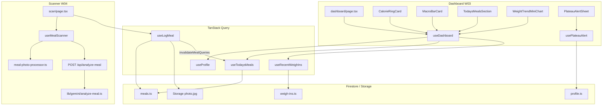

# WR03: Dashboard & Meal Scanner (Core Loop)

> **Superseded by deliverable:** [pr_wr03_dashboard_scanner.plan.md](./pr_wr03_dashboard_scanner.plan.md) — this file retains the sharpened planning decisions; implementation status lives in [PR-WR03.md](../../docs/implementation/web/PR-WR03.md).

## Context

WR03 is the third PR in the post-build review sprint ([REVIEW-MASTER-PLAN.md](docs/implementation/web/REVIEW-MASTER-PLAN.md)). It consolidates audits of **W03** ([PR-W03.md](docs/implementation/web/PR-W03.md)) and **W04** ([PR-W04.md](docs/implementation/web/PR-W04.md)) — the daily home screen and meal capture/AI pipeline.

**Depends on:** [PR-WR01.md](docs/implementation/web/PR-WR01.md) (merge gate, E2E helpers) and [PR-WR02.md](docs/implementation/web/PR-WR02.md) (auth/onboarding, `login-returning-user.spec.ts`).

**WR02 handoff — do not re-audit unless broken:**

- Google OAuth production sign-off (manual, WR08)
- 320px / keyboard matrix → WR07
- Firestore gate failure UX in `(app)/layout.tsx` → residual risk only

### Sharpened decisions (locked)


| Decision                           | Choice                                                                                                                                                                                                                        |
| ---------------------------------- | ----------------------------------------------------------------------------------------------------------------------------------------------------------------------------------------------------------------------------- |
| Dashboard audit scope              | **W03 core only** — ring, macros, meals list, sparkline, plateau, FAB/tabs. Post-W03 UI (weigh-in sheet/reminder, meal row links, macro-split footer) touched only if it breaks the core loop (e.g. log → dashboard refresh). |
| Edit route (`/scan/edit/[mealId]`) | **Shared P1 fixes only** — apply log/save error copy on edit page; do not re-audit W05 edit baseline/diff logic unless audit finds a core-loop break.                                                                         |
| E2E helpers                        | **Extract now** — add `tests/e2e/helpers/scanner.ts`; refactor `happy-path.spec.ts` + new spec to use shared upload/analyze/manual/log steps.                                                                                 |
| Midnight rollover                  | **Defer P3** — document in residual risks; no refetch/dayKey fix in WR03.                                                                                                                                                     |
| E2E manual-entry path              | **503 error path only** — photo upload → analyze fails → Enter manually → log → dashboard (matches REVIEW-MASTER-PLAN). Capture-view manual-without-photo is out of merge-blocking scope.                                     |
| ROLLOUT Phase 3 sign-off           | **Doc-only** — checklist in `PR-WR03.md` §8 pending operator QA; does not block merge (same pattern as WR02 Google OAuth).                                                                                                    |


**Round 2 (locked):**


| Decision                          | Choice                                                                                                                         |
| --------------------------------- | ------------------------------------------------------------------------------------------------------------------------------ |
| Log/save error fix (WR03-SCAN-01) | **Always generic copy** — `copy('scanner.error.logFailed')` / `saveFailed`; never surface `error.message` to users             |
| Plateau audit exit                | **Unit + integration pass** + manual plateau checklist in §8 (operator seeds weigh-ins); no new plateau E2E                    |
| Unsaved-work guard                | **Code-review audit** + Phase 3 manual checkbox only; no WR03 E2E                                                              |
| happy-path refactor               | **Both specs must pass** — refactor `happy-path.spec.ts` to use `scanner.ts` helpers; CI green on all 3 E2E specs before merge |
| Git baseline                      | **Current working tree** — run baseline including any uncommitted WR02 WIP; WR03 proceeds from whatever is green now           |
| P2 fix budget                     | **P0/P1 only** — P2 (fetch timeout, Discard UX) → residual risks unless <30 min fix during audit                               |


**Round 3 (locked):**


| Decision                     | Choice                                                                                                                                                                           |
| ---------------------------- | -------------------------------------------------------------------------------------------------------------------------------------------------------------------------------- |
| Dashboard/plateau raw errors | **P1 in WR03** — extend generic-copy fix to `dashboard/page.tsx`, `use-plateau-alert.ts`, `plateau-actions.ts`; never `error.message` in `SessionErrorBanner`                    |
| Aggregation verification     | **Unit tests + E2E refresh sufficient** — trust `dashboard-aggregation.test.ts` + log→dashboard E2E; manual §8 seed optional; add integration test only if audit finds P0/P1 bug |
| PR packaging                 | **WR03 PR may include WR02 WIP** in tree — one green merge gate; document combined state in `PR-WR03.md`                                                                         |
| E2E file structure           | **Separate spec** — `scanner-error-manual-entry.spec.ts` (one test), mirrors `login-returning-user.spec.ts` pattern                                                              |
| Copy audit depth             | **Error surfaces only** — scanner + dashboard banners; full `lib/copy` sweep → WR07                                                                                              |
| Low-confidence banner        | **Phase 3 manual only** — unit tests cover `allItemsFlagged`; no low-confidence E2E in WR03                                                                                      |


---

## Baseline merge gate (run before and after)

```bash
cd calsnap-web
pnpm lint && pnpm test && pnpm build && pnpm test:integration && pnpm test:e2e
```

**Expected starting point:** Run baseline on **current working tree** (may include uncommitted WR02 WIP). Post-WR02 target: ~201 unit tests, 11 integration, **2** E2E specs. Record actual counts in `PR-WR03.md` §2.

---

## Architecture — core loop data flow




---

## Audit workflow

Follow the standard WR agent workflow (read specs → baseline → audit UI→hook→service→repo→API → fix P0/P1 → tests → deliver docs).

### 1. Dashboard audit ([PR-W03.md](docs/implementation/web/PR-W03.md))


| Area               | Key paths                                                                                                                                                                                                             | Verify                                                                                                                                                                    |
| ------------------ | --------------------------------------------------------------------------------------------------------------------------------------------------------------------------------------------------------------------- | ------------------------------------------------------------------------------------------------------------------------------------------------------------------------- |
| Calorie ring       | [use-dashboard.ts](calsnap-web/lib/queries/use-dashboard.ts), [calorie-progress.ts](calsnap-web/lib/dashboard/calorie-progress.ts), [CalorieRingCard.tsx](calsnap-web/components/dashboard/CalorieRingCard.tsx)       | `consumed/target/remaining`, bands (`under` <0.9, `onTrack` 0.9–1.1, `over` ≥1.1), ring stroke capped at 100%                                                             |
| Macro/fiber bars   | [MacroBarCard.tsx](calsnap-web/components/dashboard/MacroBarCard.tsx), `macroTargets()` from [calculator.ts](calsnap-web/lib/nutrition/calculator.ts)                                                                 | Consumed vs profile `macroTarget*Pct`; fiber target = 28g/2000 kcal                                                                                                       |
| Today's meals      | [aggregate-meals.ts](calsnap-web/lib/dashboard/aggregate-meals.ts), [TodaysMealsSection.tsx](calsnap-web/components/dashboard/TodaysMealsSection.tsx)                                                                 | Grouped by `MealType`, sorted by timestamp; local calendar day via [date-window.ts](calsnap-web/lib/dashboard/date-window.ts)                                             |
| Weight sparkline   | [WeightTrendMiniChart.tsx](calsnap-web/components/dashboard/WeightTrendMiniChart.tsx), [weigh-ins.ts](calsnap-web/lib/repositories/weigh-ins.ts)                                                                      | 7-day window; ≥2 points for chart; empty state + CTA                                                                                                                      |
| Plateau sheet      | [plateau-state.ts](calsnap-web/lib/dashboard/plateau-state.ts), [use-plateau-alert.ts](calsnap-web/lib/queries/use-plateau-alert.ts), [PlateauAlertSheet.tsx](calsnap-web/components/dashboard/PlateauAlertSheet.tsx) | 3 weekly-spaced weigh-ins, <0.23 kg spread; Diet Break → TDEE + 14d maintenance; Small Reduction → −60 kcal (floors); Remind Later → 14d snooze in `localStorage` per uid |
| App shell          | [layout.tsx](calsnap-web/app/(app)/layout.tsx), [BottomTabNav.tsx](calsnap-web/components/app/BottomTabNav.tsx), [ScanFab.tsx](calsnap-web/components/dashboard/ScanFab.tsx)                                          | 5 tabs; FAB → `/scan`; `pb-20` clearance                                                                                                                                  |
| Query invalidation | [invalidate-meals.ts](calsnap-web/lib/queries/invalidate-meals.ts), plateau actions                                                                                                                                   | Post-log dashboard refresh; plateau actions invalidate `profile` + analytics                                                                                              |


**Existing test coverage:** [dashboard-aggregation.test.ts](calsnap-web/tests/unit/dashboard-aggregation.test.ts), [plateau-diet-break.test.ts](calsnap-web/tests/unit/plateau-diet-break.test.ts), [dashboard-firestore.test.ts](calsnap-web/tests/integration/dashboard-firestore.test.ts). No hook/component E2E for plateau.

### 2. Scanner & AI pipeline audit ([PR-W04.md](docs/implementation/web/PR-W04.md))


| Area                               | Key paths                                                                                                                                                          | Verify                                                                                                                       |
| ---------------------------------- | ------------------------------------------------------------------------------------------------------------------------------------------------------------------ | ---------------------------------------------------------------------------------------------------------------------------- |
| Phase machine                      | [use-meal-scanner.ts](calsnap-web/lib/scanner/use-meal-scanner.ts), [scan/page.tsx](calsnap-web/app/(app)/scan/page.tsx)                                           | `capture → analyzing → results/error/manual`; edit route: error-copy fix only, no W05 edit audit                             |
| Photo → compress → API             | [meal-photo-processor.ts](calsnap-web/lib/services/meal-photo-processor.ts), [analyze-meal/route.ts](calsnap-web/app/api/analyze-meal/route.ts)                    | Retry grid, 1MB cap; session auth; JPEG-only; missing key → 503                                                              |
| Manual fallback                    | [ScannerErrorBanner.tsx](calsnap-web/components/scanner/ScannerErrorBanner.tsx), [ManualMealEntryView.tsx](calsnap-web/components/scanner/ManualMealEntryView.tsx) | 503/502/422/offline/photoPrep → copy-mapped errors + "Enter manually"; manual → `results` with `geminiConfidence: 0`         |
| AbortController + generation guard | [analyze-generation.ts](calsnap-web/lib/scanner/analyze-generation.ts), `use-meal-scanner.ts`                                                                      | Already shipped (W10 early); stale responses ignored; abort on discard/unmount                                               |
| Unsaved-work guard                 | [unsaved-work-context.tsx](calsnap-web/lib/scanner/unsaved-work-context.tsx), [BottomTabNav.tsx](calsnap-web/components/app/BottomTabNav.tsx)                      | Tab intercept + `beforeunload` + discard confirm; `hasUnsavedWork` true during `analyzing`                                   |
| Low-confidence banner              | [MealAnalysisResultView.tsx](calsnap-web/components/scanner/MealAnalysisResultView.tsx), [meal-totals.ts](calsnap-web/lib/scanner/meal-totals.ts)                  | `allItemsFlagged` when every item <0.60 — **matches iOS** (`MealScannerViewModel.allItemsFlagged`)                           |
| User-friendly errors               | [lib/copy/scanner.ts](calsnap-web/lib/copy/scanner.ts), [lib/copy/dashboard.ts](calsnap-web/lib/copy/dashboard.ts)                                                 | Analyze errors mapped; audit **error surfaces only** (scanner log/save + dashboard/plateau banners) — full copy sweep → WR07 |
| Log meal → persist → invalidate    | [use-log-meal.ts](calsnap-web/lib/queries/use-log-meal.ts), [meals.ts](calsnap-web/lib/repositories/meals.ts)                                                      | Storage upload then Firestore `setDoc`; `invalidateMealQueries(uid, localDayKey)`                                            |


**Existing test coverage:** `editable-food-item`, `meal-photo-processor`, `meal-analysis-parser`, `analyze-meal-route`, `analyze-generation`, `meal-scanner-abort` unit tests. Happy-path E2E covers mocked 200 analyze → log → dashboard.

**Real Gemini:** Manual only per [ROLLOUT.md](docs/implementation/web/ROLLOUT.md) Phase 3 — never in CI.

---

## Preliminary findings matrix (validate during audit)


| ID           | Sev    | Area      | Finding                                                                                                                                                                                                                                                                         | Likely action                                                                      |
| ------------ | ------ | --------- | ------------------------------------------------------------------------------------------------------------------------------------------------------------------------------------------------------------------------------------------------------------------------------- | ---------------------------------------------------------------------------------- |
| WR03-SCAN-01 | **P1** | Scanner   | Log/save errors surface raw `error.message` in scan + edit pages                                                                                                                                                                                                                | **Fix:** always `copy('scanner.error.logFailed')` / `saveFailed`                   |
| WR03-DASH-04 | **P1** | Dashboard | Raw `error.message` in [dashboard/page.tsx](calsnap-web/app/(app)/dashboard/page.tsx) (profile load, query errors) and plateau paths ([use-plateau-alert.ts](calsnap-web/lib/queries/use-plateau-alert.ts), [plateau-actions.ts](calsnap-web/lib/dashboard/plateau-actions.ts)) | **Fix:** always generic `lib/copy` keys — same pattern as WR03-SCAN-01 (sharpened) |
| WR03-E2E-01  | **P1** | E2E       | No merge-blocking spec for 503 → manual → log → dashboard ([REVIEW-MASTER-PLAN.md](docs/implementation/web/REVIEW-MASTER-PLAN.md) test gap)                                                                                                                                     | **Add** `scanner-error-manual-entry.spec.ts`                                       |
| WR03-DASH-01 | P3     | Dashboard | `now` frozen at mount in `useDashboard` / `usePlateauAlert` — no midnight rollover without remount                                                                                                                                                                              | **Deferred** — residual risk (sharpened decision)                                  |
| WR03-SCAN-02 | P2     | Scanner   | No client-side fetch timeout on analyze — hung requests fail as generic `api`                                                                                                                                                                                                   | Residual risk unless <30 min fix during audit (sharpened)                          |
| WR03-SCAN-03 | P2     | Scanner   | Header Discard hidden during `analyzing` but tab-nav guard still active (Cancel button + tab confirm)                                                                                                                                                                           | Residual risk unless <30 min fix during audit (sharpened)                          |
| WR03-DASH-02 | P3     | Dashboard | No automated plateau sheet E2E                                                                                                                                                                                                                                                  | Residual risk                                                                      |
| WR03-DASH-03 | P3     | Dashboard | No `useDashboard` / `usePlateauAlert` hook tests                                                                                                                                                                                                                                | Residual risk unless audit finds wiring bug                                        |
| WR03-SCAN-04 | P3     | Scanner   | Storage orphan if Firestore write fails after upload                                                                                                                                                                                                                            | Accepted per W04; document in residual risks                                       |
| WR03-SCAN-05 | P3     | Scanner   | Rate limiting absent                                                                                                                                                                                                                                                            | Deferred to WR08 / out of scope                                                    |


Audit may surface additional P0/P1 (e.g. aggregation mismatch, plateau persistence failure, invalidation gap) — log in findings matrix with evidence.

---

## Merge-blocking E2E: scanner error path

**New file:** [tests/e2e/scanner-error-manual-entry.spec.ts](calsnap-web/tests/e2e/scanner-error-manual-entry.spec.ts)

**Flow:**

1. `mockAnalyzeMeal(page, 503)` — uses existing [api-mocks.ts](calsnap-web/tests/e2e/helpers/api-mocks.ts) numeric status overload
2. `createOnboardedUser(page)` — WR01/WR02 auth helper
3. `/scan` → `input[type="file"]` + `test-photo.jpg` → Analyze
4. Assert `role="alert"` contains `copy('scanner.error.api')`
5. Click `copy('scanner.capture.manualEntry')` → fill name + calories (weight defaults 100g)
6. Continue → Log this meal → `/dashboard`
7. Assert `getByRole('link', { name: /300 kcal/ })` visible

**Required helper extraction** (sharpened decision): add [tests/e2e/helpers/scanner.ts](calsnap-web/tests/e2e/helpers/scanner.ts) with shared steps; refactor [happy-path.spec.ts](calsnap-web/tests/e2e/happy-path.spec.ts) to use them. Suggested exports:

- `uploadTestPhotoAndAnalyze(page)` — file input + Analyze + wait for result or error
- `fillManualMealItem(page, { name, calories, weightG? })` — manual form + Continue
- `logMealAndExpectDashboard(page, expectedKcal)` — Log this meal + URL + kcal link assertion

**Not in scope for WR03 E2E:** capture-view manual-without-analyze, unsaved-work guard, real Gemini, camera/gallery buttons, plateau sheet.

---

## Fix strategy

1. **P0/P1 only** — fix all discovered P0/P1 before merge; P2 only if <30 min during audit; otherwise → residual risks in `PR-WR03.md` §7
2. **WR03-SCAN-01 + WR03-DASH-04:** Replace all user-facing `error.message` with generic copy keys — scanner log/save + dashboard/plateau `SessionErrorBanner` paths (sharpened)
3. **Regression tests:** No unit test required for generic-copy swap unless audit adds branching logic
4. **Plateau sign-off:** Existing unit/integration tests + manual §8 checklist — no new plateau automation (sharpened)
5. **Unsaved-work:** Trace code paths in audit; verify via Phase 3 manual only (sharpened)
6. **No scope creep:** Do not re-implement W05 edit flow, W06 weigh-in, W07 copy audit, or W08 rate limiting

---

## Manual QA sign-off (ROLLOUT Phase 3)

Record in `PR-WR03.md` §8 — operator runs locally with real `GEMINI_API_KEY`:

- [ ] Photo analyze → results → log → dashboard ring/macros update
- [ ] Adjust item weight → totals recalculate
- [ ] Navigate away mid-analyze → no stale results (generation guard)
- [ ] Low-confidence banner when all items <0.60 *(Phase 3 manual with real Gemini — unit tests cover logic)*
- [ ] Manual entry without photo (`geminiConfidence === 0`, no Storage path)
- [ ] Plateau sheet with 3 flat weekly weigh-ins → Diet Break / Small Reduction / Remind Later persist correctly *(manual — unit/integration cover logic; operator seeds in emulator)*
- [ ] Tab unsaved-work confirm during results phase *(manual Phase 3 — code-review in audit)*

**Dashboard spot-checks (emulator, no Gemini):**

- [ ] Seed 3 meals for today → ring/macros/meals list match Firestore totals
- [ ] Scan FAB and tab nav to `/scan`
- [ ] 320px: tab bar + FAB usable (full matrix deferred to WR07)

---

## Deliverables


| Artifact    | Path                                                                                                                                                                                    |
| ----------- | --------------------------------------------------------------------------------------------------------------------------------------------------------------------------------------- |
| Audit doc   | [docs/implementation/web/PR-WR03.md](docs/implementation/web/PR-WR03.md) — checklist, findings matrix (P0–P3), fix list, residual risks, acceptance criteria, baseline/final merge gate |
| Cursor plan | `.cursor/plans/pr_wr03_dashboard_scanner.plan.md`                                                                                                                                       |
| E2E spec    | `tests/e2e/scanner-error-manual-entry.spec.ts`                                                                                                                                          |
| E2E helpers | `tests/e2e/helpers/scanner.ts` (+ refactor `happy-path.spec.ts`)                                                                                                                        |


### PR-WR03.md structure (mirror WR01/WR02)

1. Audit checklist (dashboard + scanner tables with Pass/Fixed/Fail)
2. Baseline + final merge gate snapshots
3. Findings matrix with IDs, severity, status
4. Fix list (file → change → why)
5. E2E helper contract updates (if any)
6. Acceptance criteria (checkboxes)
7. Residual risks
8. Manual sign-off (Phase 3 + dashboard spot-checks)

### Acceptance criteria

- [ ] Merge gate green before and after
- [ ] Zero open **P0/P1** in dashboard + scanner scope
- [ ] Dashboard widgets match logged data + profile targets (verified by audit + existing unit tests)
- [ ] Plateau actions persist (unit tests + manual if needed)
- [ ] Scanner 503 → manual fallback → log → dashboard refresh works
- [ ] Analyze + log/save + dashboard/plateau errors use `lib/copy` (no raw API/Firebase strings)
- [ ] **E2E:** 3 specs green in CI (`happy-path`, `login-returning-user`, `scanner-error-manual-entry`) — happy-path refactored to shared scanner helpers
- [ ] No real Gemini in CI
- [ ] `PR-WR03.md` complete with findings matrix + residual risks

---

## Key files likely touched


| File                                              | Change                                            |
| ------------------------------------------------- | ------------------------------------------------- |
| `app/(app)/dashboard/page.tsx`                    | Generic copy for SessionErrorBanner errors (P1)   |
| `lib/queries/use-plateau-alert.ts`                | Generic copy for plateau action errors (P1)       |
| `lib/dashboard/plateau-actions.ts`                | Generic copy for diet-break failures (P1)         |
| `app/(app)/scan/page.tsx`                         | Log error generic copy (P1)                       |
| `app/(app)/scan/edit/[mealId]/page.tsx`           | Save error copy mapping (P1)                      |
| `tests/e2e/scanner-error-manual-entry.spec.ts`    | New merge-blocking spec                           |
| `tests/e2e/helpers/scanner.ts`                    | Shared upload/analyze/manual/log steps (required) |
| `tests/e2e/helpers/index.ts`                      | Re-export new helpers                             |
| `tests/e2e/happy-path.spec.ts`                    | Refactor to use scanner helpers                   |
| `docs/implementation/web/PR-WR03.md`              | Audit deliverable                                 |
| `.cursor/plans/pr_wr03_dashboard_scanner.plan.md` | Implementation plan                               |


Additional files only if audit discovers P0/P1 bugs in dashboard aggregation, plateau persistence, query invalidation, or analyze route.