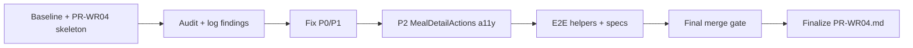

# WR04: Meal Log & Progress — Review Sprint Plan

**Depends on:** [PR-WR03.md](docs/implementation/web/PR-WR03.md) (merge gate green, scanner E2E helpers)  
**Reviews:** [PR-W05.md](docs/implementation/web/PR-W05.md) + [PR-W06.md](docs/implementation/web/PR-W06.md)  
**Master workflow:** [REVIEW-MASTER-PLAN.md](docs/implementation/web/REVIEW-MASTER-PLAN.md) §Agent workflow + merge gate

---

## Sharpened decisions (locked — 2026-06-30)


| Decision                      | Choice                                                                                       | Rationale                                                                                             |
| ----------------------------- | -------------------------------------------------------------------------------------------- | ----------------------------------------------------------------------------------------------------- |
| Meal delete E2E entry point   | **Log list ⋯ menu only**                                                                     | Matches W05 action split (dashboard rows link-only); shorter spec; detail delete covered in manual QA |
| Weigh-in target assertion     | **Relative decrease only** (`newTarget < previousTarget`)                                    | Avoids brittle coupling to onboarding TDEE math; still proves invalidation + profile refetch          |
| P2 in-scope                   | `**MealDetailActions` nested Link+button only**                                              | Clear a11y regression with small diff; other P2s → residual risks                                     |
| Reminder banner verification  | **Manual QA in PR-WR04 §8 only**                                                             | Not merge-blocking; E2E backdate seeding is heavy for WR04                                            |
| `happy-path.spec.ts` weigh-in | **Leave as-is** (dialog smoke only)                                                          | `weigh-in-updates-target.spec.ts` owns target assertion; no duplication                               |
| Meal edit E2E mechanism       | **FoodItemEditSheet weight change** (tap item → increase weightG → save item → Save Changes) | Matches scanned-meal edit UX; no direct kcal field on edit path                                       |
| Meal edit assertion           | **Relative** — kcal link visible and ≠ original 382                                          | Avoids linear scale math coupling                                                                     |
| Meal E2E file layout          | **One file, two `test()` blocks** in `meal-edit-delete.spec.ts`                              | Shared setup possible; isolated failure signals; matches WR03 pattern                                 |
| `MealDetailActions` fix       | **Link styled with button surface classes**                                                  | No nested button; consistent with `MealLogRow` menu links                                             |
| Share hook P1                 | **Always fix** `use-meal-share-image.ts` to copy-only                                        | Same WR03 error-handling rule                                                                         |
| Progress → analytics          | **Manual QA only** (PR-WR04 §8)                                                              | Not merge-blocking per master plan                                                                    |
| E2E test isolation            | **Full independent setup per `test()`** — each calls `createOnboardedUser` + scan + log      | Test A’s edited meal never affects Test B                                                             |
| Edit post-save assertions     | **Detail page + `/log` tab + dashboard**                                                     | Save lands on `/log/[mealId]`; assert all three surfaces                                              |
| `fillWeighInWeightKg`         | **Convert kg → lbs internally** (70 kg → 154 lbs in input)                                   | Matches onboarding `useLbsWeight: true` default                                                       |
| `gotoMealLog`                 | **Bottom tab** (`common.nav.log`)                                                            | Exercises real nav                                                                                    |
| `PR-WR04.md` timing           | **Skeleton + initial baseline at start; finalize after fixes**                               | Matches WR03 workflow                                                                                 |
| Delete assertion              | **Meal kcal link absent** on `/log` + dashboard only                                         | No empty-state assertion required                                                                     |


---

## Current state (pre-audit)

W05/W06 are **implemented**. WR03 validated dashboard/scanner and only touched edit save-error copy on `/scan/edit/[mealId]`. Meal log + progress are largely **unaudited**.


| Area                                                  | Status                                                          |
| ----------------------------------------------------- | --------------------------------------------------------------- |
| Meal CRUD + queries                                   | Present — repo, hooks, `invalidateMealQueries`                  |
| Routes `/log`, `/log/[mealId]`, `/scan/edit/[mealId]` | Present                                                         |
| Share card (`html2canvas`)                            | Present — weak unit test                                        |
| Weigh-in service + batch save                         | Present — good unit/integration coverage                        |
| Progress chart + history                              | Present — Recharts, stats in `lib/progress/`                    |
| Reminder banner (7+ days)                             | Present — unit tests, no E2E                                    |
| E2E meal edit/delete                                  | **Missing** (merge-blocking gap)                                |
| E2E weigh-in → target change                          | **Partial** — happy-path saves dialog only, no target assertion |


**Merge gate baseline (WR03 final):** 201 unit tests, 11 integration, **3 E2E** specs.

```bash
cd calsnap-web
pnpm lint && pnpm test && pnpm build && pnpm test:integration && pnpm test:e2e
```

---

## Architecture (audit layers)

```mermaid
flowchart TB
  subgraph mealFlow [Meal lifecycle W05]
    LogPage["/log page"]
    DetailPage["/log/mealId"]
    EditPage["/scan/edit/mealId"]
    LogPage --> DetailPage
    DetailPage --> EditPage
    EditPage -->|"useUpdateMeal"| FSMeals[(Firestore meals)]
    DetailPage -->|"useDeleteMeal"| FSMeals
    FSMeals --> InvMeals[invalidateMealQueries]
    InvMeals --> TodaysMeals[todaysMeals + meal + analytics]
  end

  subgraph weighFlow [Weigh-in W06]
    Sheet[WeighInSheet]
    Sheet -->|"useLogWeighIn"| Svc[saveWeighIn]
    Svc --> FSBatch[(weighIns + profile batch)]
    FSBatch --> InvWI[invalidateWeighInQueries]
    InvWI --> Profile[profile + allWeighIns + weighIns window]
    Profile --> DashRing[CalorieRingCard target]
  end
```




**Key invalidation hubs:**

- Meals: `[lib/queries/invalidate-meals.ts](calsnap-web/lib/queries/invalidate-meals.ts)` — `todaysMeals`, optional `meal`, analytics
- Weigh-ins: `[lib/queries/invalidate-weigh-ins.ts](calsnap-web/lib/queries/invalidate-weigh-ins.ts)` — `profile`, `allWeighIns`, `weighIns(window)`, analytics

---

## Phase 1 — Baseline + audit checklist

Run merge gate **before** any changes; record counts in `PR-WR04.md` §2.

### 1.1 Meal log (W05) — manual + code audit


| #   | Check                                                                                      | Key files                                                                                                                                                                                                              |
| --- | ------------------------------------------------------------------------------------------ | ---------------------------------------------------------------------------------------------------------------------------------------------------------------------------------------------------------------------- |
| L1  | `/log` groups today by `MealType` (breakfast→snack); empty sections show “Add …” → `/scan` | `[app/(app)/log/page.tsx](calsnap-web/app/(app)`/log/page.tsx), `[MealListSection.tsx](calsnap-web/components/meal-log/MealListSection.tsx)`, `[aggregate-meals.ts](calsnap-web/lib/dashboard/aggregate-meals.ts)`     |
| L2  | Row tap → detail; ⋯ menu: View / Edit / Delete (dashboard rows link-only, no ⋯)            | `[MealLogRow.tsx](calsnap-web/components/meal-log/MealLogRow.tsx)`, `[TodaysMealsSection.tsx](calsnap-web/components/dashboard/TodaysMealsSection.tsx)`                                                                |
| L3  | Detail: photo, read-only items, confidence/manual badge, estimation notes                  | `[MealDetailView.tsx](calsnap-web/components/meal-log/MealDetailView.tsx)`, `[log/[mealId]/page.tsx](calsnap-web/app/(app)`/log/[mealId]/page.tsx)                                                                     |
| L4  | Edit: `loadForEditing` + baseline guard; Save → `/log/[id]`; dashboard totals refresh      | `[scan/edit/[mealId]/page.tsx](calsnap-web/app/(app)`/scan/edit/[mealId]/page.tsx), `[edit-baseline.ts](calsnap-web/lib/scanner/edit-baseline.ts)`, `[use-update-meal.ts](calsnap-web/lib/queries/use-update-meal.ts)` |
| L5  | Delete: confirm dialog; removed from `/log` + dashboard                                    | `[use-delete-meal.ts](calsnap-web/lib/queries/use-delete-meal.ts)`                                                                                                                                                     |
| L6  | Share: off-screen `MealShareCard` → `html2canvas` → Web Share / download                   | `[use-meal-share-image.ts](calsnap-web/components/meal-log/use-meal-share-image.ts)`                                                                                                                                   |
| L7  | All user-facing errors use `lib/copy` (WR03 pattern)                                       | log/detail delete, share, edit save (save already fixed WR03)                                                                                                                                                          |
| L8  | `MealNotFoundError` → friendly not-found copy                                              | `[meal-errors.ts](calsnap-web/lib/repositories/meal-errors.ts)`                                                                                                                                                        |


### 1.2 Weigh-in & progress (W06)


| #   | Check                                                                                                    | Key files                                                                                                                                                          |
| --- | -------------------------------------------------------------------------------------------------------- | ------------------------------------------------------------------------------------------------------------------------------------------------------------------ |
| W1  | WeighInSheet: validation (`WEIGHT_RANGE_KG`, no future date), preview TDEE/target                        | `[use-weigh-in-form.ts](calsnap-web/lib/progress/use-weigh-in-form.ts)`, `[weigh-in-service.ts](calsnap-web/lib/services/weigh-in-service.ts)`                     |
| W2  | Save → batch write weigh-in + profile; `recalculateWeighIn` updates `dailyCalorieTarget`                 | `[weigh-in-service.ts](calsnap-web/lib/services/weigh-in-service.ts)`, `[profile.ts](calsnap-web/lib/repositories/profile.ts)`                                     |
| W3  | Dashboard ring target updates via `invalidateWeighInQueries` → `useProfile` refetch (no direct callback) | `[use-log-weigh-in.ts](calsnap-web/lib/queries/use-log-weigh-in.ts)`, `[CalorieRingView.tsx](calsnap-web/components/design/CalorieRingView.tsx)`                   |
| W4  | Progress chart: ascending actual line; dashed projection when ≥2 weigh-ins; goal reference line          | `[WeightProgressChart.tsx](calsnap-web/components/progress/WeightProgressChart.tsx)`, `[progress-stats.ts](calsnap-web/lib/progress/progress-stats.ts)`            |
| W5  | History newest first; stats use recency tie-breaking                                                     | `[WeighInHistoryList.tsx](calsnap-web/components/progress/WeighInHistoryList.tsx)`                                                                                 |
| W6  | Reminder banner: 7+ days, `weighInReminderEnabled`, localStorage snooze                                  | `[weigh-in-reminder.ts](calsnap-web/lib/progress/weigh-in-reminder.ts)`, `[WeighInReminderBanner.tsx](calsnap-web/components/dashboard/WeighInReminderBanner.tsx)` |
| W7  | Progress → analytics link works                                                                          | `[progress/page.tsx](calsnap-web/app/(app)`/progress/page.tsx)                                                                                                     |
| W8  | Save errors use `lib/copy` only                                                                          | `[WeighInSheet.tsx](calsnap-web/components/progress/WeighInSheet.tsx)`, `[WeightProgressView.tsx](calsnap-web/components/progress/WeightProgressView.tsx)`         |


### 1.3 Out of scope — do not re-audit unless broken

From WR03 handoff + master plan locks:

- Scanner/dashboard generic error banner (WR03-DASH-05)
- Storage orphan on failed Firestore write → **WR08**
- Real Gemini manual QA → ROLLOUT Phase 3 (doc-only sign-off)
- 320px viewport matrix → **WR07**
- Historical log, swipe delete, weigh-in edit/delete, push notifications

---

## Phase 2 — Pre-identified findings matrix (validate during audit)


| ID           | Sev    | Area     | Finding                                                                                                                                                                                      | Likely fix                                                       |
| ------------ | ------ | -------- | -------------------------------------------------------------------------------------------------------------------------------------------------------------------------------------------- | ---------------------------------------------------------------- |
| WR04-MEAL-01 | **P1** | Meal log | Delete errors surface raw `error.message` on `[log/page.tsx](calsnap-web/app/(app)`/log/page.tsx) L74–76 and `[log/[mealId]/page.tsx](calsnap-web/app/(app)`/log/[mealId]/page.tsx) L131–133 | Always `copy('mealLog.error.deleteFailed')` (WR03 pattern)       |
| WR04-PROG-01 | **P1** | Progress | `WeighInSheet` save catch uses `err.message` fallback (`[WeighInSheet.tsx](calsnap-web/components/progress/WeighInSheet.tsx)` L64–66)                                                        | Always `copy('progress.weighIn.error.saveFailed')`               |
| WR04-PROG-02 | **P1** | Progress | `WeightProgressView` surfaces `progress.error.message` (`[WeightProgressView.tsx](calsnap-web/components/progress/WeightProgressView.tsx)`)                                                  | Use `copy('progress.error.loadFailed')` / `partialLoad`          |
| WR04-E2E-01  | **P1** | E2E      | No meal edit + delete E2E                                                                                                                                                                    | New spec + `meal-log.ts` helpers                                 |
| WR04-E2E-02  | **P1** | E2E      | Happy-path weigh-in saves default weight (80 kg) with **no target assertion**                                                                                                                | New spec: lower weight → assert ring `ofGoal` text changes       |
| WR04-MEAL-02 | P2     | a11y     | `MealDetailActions`: `<button>` inside `<Link>` (`[MealDetailActions.tsx](calsnap-web/components/meal-log/MealDetailActions.tsx)` L25–28)                                                    | **In scope** — style `Link` as button or `router.push` on button |
| WR04-MEAL-03 | P2     | UX       | Log delete failure: dialog closes, `mealIdToDelete` cleared in `finally` — user must re-open ⋯                                                                                               | **Deferred** → residual risks                                    |
| WR04-MEAL-04 | P2     | Tests    | `[meal-share-card.test.ts](calsnap-web/tests/unit/meal-share-card.test.ts)` never renders `MealShareCard`                                                                                    | **Deferred** → residual risks; share verified manual §8          |
| WR04-PROG-03 | P2     | Progress | History list uses Firestore `date desc` only; stats use `createdAt`/id tie-break — same-day order may differ                                                                                 | **Deferred** → residual risks                                    |
| WR04-PROG-04 | P2     | Reminder | `WeighInReminderBanner` session `dismissed` state not tied to snooze on first click                                                                                                          | **Deferred** → residual risks; manual snooze check §8            |
| WR04-PROG-05 | P2     | Tests    | No unit test for exactly **7** days overdue boundary (`>= 7`)                                                                                                                                | **Deferred** → residual risks (8-day case exists)                |
| WR04-MEAL-05 | P3     | Share    | Share card shows P/C/F only (no fiber)                                                                                                                                                       | Residual — iOS parity check; defer unless spec requires          |
| WR04-PROG-06 | P3     | Progress | `didTriggerPlateau` from save ignored on dashboard/progress (only settings handles it)                                                                                                       | Residual — plateau uses `usePlateauAlert` refetch                |
| WR04-PROG-07 | P3     | Reminder | Weekday/hour/minute prefs stored but banner is days-since-only (W06 delta)                                                                                                                   | Residual — settings UI in WR06                                   |
| WR04-ARCH-01 | P3     | Queries  | `useWeighInReminder` duplicates `allWeighIns` fetch                                                                                                                                          | Residual — cache-shared, no refactor unless trivial              |


**Target:** Zero open P0/P1 after implementation.

---

## Phase 3 — Fixes (P0/P1 required; one locked P2)

### P1 error-copy fixes (mirror WR03)


| File                                                                                                     | Change                                                                       |
| -------------------------------------------------------------------------------------------------------- | ---------------------------------------------------------------------------- |
| `[app/(app)/log/page.tsx](calsnap-web/app/(app)`/log/page.tsx)                                           | Delete error → `copy('mealLog.error.deleteFailed')` only                     |
| `[app/(app)/log/[mealId]/page.tsx](calsnap-web/app/(app)`/log/[mealId]/page.tsx)                         | Same                                                                         |
| `[components/progress/WeighInSheet.tsx](calsnap-web/components/progress/WeighInSheet.tsx)`               | Save error → `copy('progress.weighIn.error.saveFailed')` only                |
| `[components/progress/WeightProgressView.tsx](calsnap-web/components/progress/WeightProgressView.tsx)`   | Load errors → copy keys only                                                 |
| `[components/meal-log/use-meal-share-image.ts](calsnap-web/components/meal-log/use-meal-share-image.ts)` | Non-abort errors → `copy('mealLog.share.error.failed')` only (**locked P1**) |


### P2 fix (locked in-scope)


| File                                                                             | Change                                                                                                                    |
| -------------------------------------------------------------------------------- | ------------------------------------------------------------------------------------------------------------------------- |
| `[MealDetailActions.tsx](calsnap-web/components/meal-log/MealDetailActions.tsx)` | Replace nested `<SecondaryButton>` with `<Link>` using button surface classes (`min-h-11`, full width, secondary styling) |


**Deferred P2 → PR-WR04 residual risks:** delete-failure UX (WR04-MEAL-03), share card unit test (WR04-MEAL-04), history sort alignment (WR04-PROG-03), reminder dismiss/snooze edge (WR04-PROG-04), 7-day boundary unit test (WR04-PROG-05).

### Optional unit additions (only if audit finds gaps)

- `invalidateMealQueries` smoke test
- `editBaselinesEqual` edge cases

---

## Phase 4 — E2E (merge-blocking)

### New helpers

`**[tests/e2e/helpers/meal-log.ts](calsnap-web/tests/e2e/helpers/meal-log.ts)**` (export via `[helpers/index.ts](calsnap-web/tests/e2e/helpers/index.ts)`):


| Export                                                        | Purpose                                                                                                                    |
| ------------------------------------------------------------- | -------------------------------------------------------------------------------------------------------------------------- |
| `gotoMealLog(page)`                                           | Click bottom tab `common.nav.log`; wait for `mealLog.title`                                                                |
| `openMealRowActions(page, calories)`                          | ⋯ button on row matching `{calories} kcal`                                                                                 |
| `openMealEditFromLog(page, calories)`                         | Menu → Edit → wait `/scan/edit/`                                                                                           |
| `editScannedItemWeight(page, itemName, newWeightG)`           | Click item `designSystem.foodItem.editHint` button on named row → `FoodItemEditSheet` → fill weight → `common.button.save` |
| `saveMealEdits(page)`                                         | Click `scanner.result.saveChanges`; expect URL `/log/[mealId]` (detail)                                                    |
| `expectMealCaloriesChanged(page, previousCalories)`           | Assert a `{N} kcal` link visible where `N !== previousCalories`                                                            |
| `expectMealCaloriesChangedOnSurfaces(page, previousCalories)` | After edit save: assert on **current page (detail)** → `gotoMealLog` → assert → dashboard tab → assert                     |
| `deleteMealFromLogList(page, calories)`                       | ⋯ → Delete → confirm `mealLog.confirm.deleteAction` (**sole delete entry point for E2E**)                                  |
| `expectMealAbsent(page, calories)`                            | `{calories} kcal` link **not visible** on `/log` and `/dashboard` (no empty-state assertion)                               |


`**[tests/e2e/helpers/weigh-in.ts](calsnap-web/tests/e2e/helpers/weigh-in.ts)**`:


| Export                                              | Purpose                                                                                 |
| --------------------------------------------------- | --------------------------------------------------------------------------------------- |
| `readDashboardCalorieTarget(page)`                  | Parse text from `designSystem.calorieRing.ofGoal` (“of **N** kcal goal”)                |
| `openWeighInFromDashboard(page)`                    | Click `dashboard.weight.logWeighIn`; expect dialog                                      |
| `fillWeighInWeightKg(page, weightKg)`               | Convert kg → rounded lbs (`displayWeight`); clear/fill dialog `input[type="number"]`    |
| `saveWeighIn(page)`                                 | Click `progress.weighIn.save`; dialog hidden                                            |
| `logWeighInAndExpectLowerTarget(page, newWeightKg)` | Capture target before → save at lower weight → assert `newTarget < previousTarget` only |


**Weigh-in E2E note:** Onboarding defaults (`[profile-draft.ts](calsnap-web/lib/onboarding/profile-draft.ts)`): **80 kg**, `useLbsWeight: true`. Saving the same weight does **not** change TDEE. Spec must enter a materially lower weight (e.g. **70 kg** / ~154 lbs) and assert `readDashboardCalorieTarget` decreases.

### New specs

1. `**tests/e2e/meal-edit-delete.spec.ts**` — **one file, two fully independent tests** (each: `mockAnalyzeMeal` → `createOnboardedUser` → scan → log at 382 kcal)
  **Test A — `edit scanned meal updates detail, log, and dashboard`**
  - `gotoMealLog` → `openMealEditFromLog(page, 382)`
  - `editScannedItemWeight(page, firstItemName(), 200)` — chicken 150g → 200g
  - `saveMealEdits` → `expectMealCaloriesChangedOnSurfaces(page, 382)` (detail, then `/log` tab, then dashboard)
   **Test B — `delete meal from log list removes from log and dashboard`**
  - Independent setup: scan log at 382 kcal
  - `deleteMealFromLogList(page, 382)` (⋯ menu only)
  - `expectMealAbsent(page, 382)` on `/log` and dashboard (link absent only)
2. `**tests/e2e/weigh-in-updates-target.spec.ts**`
  - `createOnboardedUser` (no scan needed)
  - `logWeighInAndExpectLowerTarget(page, 70)` — relative assertion only
  - `**happy-path.spec.ts` unchanged** — keeps dialog open/save smoke; no target assertion

**Optional refactor:** Extract shared `expectMealKcalLink` from `[scanner.ts](calsnap-web/tests/e2e/helpers/scanner.ts)` `logMealAndExpectDashboard` to avoid duplication.

**E2E count after WR04:** 3 → **5** specs (happy-path, login-returning, scanner-error, meal-edit-delete, weigh-in-target).

---

## Phase 5 — Deliverables

### 0. Doc workflow (locked)

1. **Start:** Create `PR-WR04.md` skeleton (sections 1–2 empty checklist + initial merge gate baseline)
2. **During:** Record audit Pass/Fixed results and findings as discovered
3. **End:** Finalize matrix, fix list, acceptance criteria, residual risks, §8 manual sign-off

### 1. `[docs/implementation/web/PR-WR04.md](docs/implementation/web/PR-WR04.md)` (new)

Mirror [PR-WR03.md](docs/implementation/web/PR-WR03.md) structure:

1. Audit checklist (§1.1 meal, §1.2 progress) with Pass/Fixed results
2. Baseline + final merge gate snapshots
3. Findings matrix P0–P3 with IDs above
4. Fix list (files changed)
5. E2E helper contract (meal-log + weigh-in)
6. Acceptance criteria (checkboxes)
7. Residual risks (P3 + WR03 handoff items not re-audited)
8. Manual sign-off table (share card export, reminder banner 7+ days, progress chart — emulator QA)
9. Files changed index

### 2. `[.cursor/plans/pr_wr04_meal_log_progress.plan.md](.cursor/plans/pr_wr04_meal_log_progress.plan.md)` (new)

Actionable todos matching this plan; mark complete during implementation.

### 3. Update cross-refs

- Add meal-log / weigh-in helper section to [PR-WR01.md](docs/implementation/web/PR-WR01.md) §5 (helper contract), following WR03 scanner cross-ref pattern.

---

## Phase 6 — Verification

### Automated (merge-blocking)

```bash
cd calsnap-web
pnpm lint && pnpm test && pnpm build && pnpm test:integration && pnpm test:e2e
```

### Manual QA (emulator, document in PR-WR04 §8)


| Scenario                                               | Environment                 |
| ------------------------------------------------------ | --------------------------- |
| Log 2–3 meals → `/log` sections + dashboard links      | Emulator                    |
| Detail photo, confidence, estimation notes             | Emulator + Storage          |
| Edit item weights → totals on detail + ring consumed   | Emulator                    |
| Delete from detail page (manual only — E2E uses log ⋯) | Emulator                    |
| Delete from log ⋯ menu                                 | E2E + Emulator              |
| Share → PNG download/share                             | Local browser (html2canvas) |
| Weigh-in sheet validation (out of range, future date)  | Emulator                    |
| Progress chart projection (≥2 weigh-ins)               | Emulator                    |
| Overdue banner after 7+ days (seed or backdate)        | **Manual only** (not E2E)   |
| Snooze “Remind me tomorrow” persists reload            | **Manual only** (not E2E)   |
| Progress → analytics link                              | **Manual only** (not E2E)   |


**Not in WR04:** Real Gemini, 320px matrix, production smoke.

---

## Acceptance criteria (WR04 complete when)

- [ ] Merge gate green before **and** after changes
- [ ] Zero open **P0/P1** in meal log + progress scope
- [ ] Meal list/detail/edit/delete/share audited vs W05
- [ ] Weigh-in → TDEE recalc → dashboard target audited vs W06
- [ ] Query invalidation verified for meal CRUD and weigh-in writes
- [ ] **New E2E:** `meal-edit-delete.spec.ts`
- [ ] **New E2E:** `weigh-in-updates-target.spec.ts` (relative target decrease)
- [ ] **P2 locked:** `MealDetailActions` a11y fix
- [ ] `PR-WR04.md` complete with findings matrix + residual risks (incl. deferred P2s)
- [ ] No real Gemini in CI

---

## Implementation order




**Estimated touch surface:** ~10–14 files (5 P1 error-copy fixes, 1 P2 a11y fix, 2 helper modules, 2 E2E specs, 2 docs). Deferred P2s stay in residual risks only.