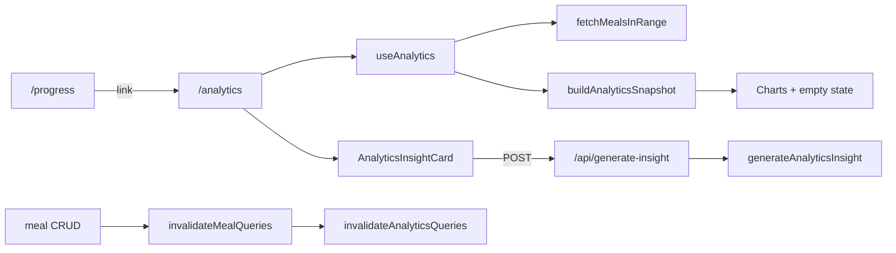

# WR05 — Analytics & Insights (Review Sprint)

## Context

WR05 audits the implemented W07 analytics stack ([PR-W07.md](docs/implementation/web/PR-W07.md)) after WR01–WR04 are complete ([PR-WR04.md](docs/implementation/web/PR-WR04.md)). Current merge gate baseline: **6 E2E tests in 5 spec files**, **201 unit tests**, integration + lint + build green.

Analytics is **not** in the bottom tab bar — discovery is intentional via Progress → “Dietary analytics →” ([`app/(app)/progress/page.tsx`](calsnap-web/app/(app)/progress/page.tsx)).



---

## Locked decisions (sharpen-plan)

| Decision | Choice | Rationale |
|----------|--------|-----------|
| Stale insight after meal CRUD | **P1 fix in WR05** | User-visible incorrect coaching after data changes is spec-incorrect UX, not polish |
| E2E scope | **2 merge-blocking tests** (+ optional 3rd for mocked insight) | Covers empty vs rich states — the sprint gap; custom range / invalidation are lower ROI in CI |
| Meal seeding | **Node helper + `createMeal` on emulator** | Reuses repository + integration patterns; UI scan cannot backdate |
| Insight API errors | **Client-only copy fix** | User never sees `body.error`; server strings stay for logs — minimal diff |
| Custom range E2E | **Manual QA only** | `normalizeCustomRange` covered by unit tests if audit finds gap |
| Stale insight mechanism | **Extended `insightContextKey`** | Includes data identity beyond profile; no `useEffect` on `dataUpdatedAt` |
| Insight context fields | **`rangeKey + loggedDayCount + adherencePct`** | Catches same-day calorie edits when day count unchanged |
| Empty-state E2E setup | **Zero meals** | Fresh onboarded user; simplest proof of `<3 days` gate |
| Mocked insight E2E | **Skip in WR05** | Unit route tests + ROLLOUT Phase 3; 2 E2E tests sufficient |
| `normalizeCustomRange` tests | **Audit-driven only** | Add if gap found; not a standalone deliverable |
| Seed helper API | **`seedMealsOnDistinctDays(credentials, n)`** | Node signs into Auth emulator; no `page.evaluate` uid |

---

## Phase 0 — Baseline (before any code changes)

From `calsnap-web/`:

```bash
pnpm lint && pnpm test && pnpm build && pnpm test:integration && pnpm test:e2e
```

Record counts in [PR-WR05.md](docs/implementation/web/PR-WR05.md) §2 (expect ~201 unit, 6 E2E, 11 integration). Requires Java 21+ for emulators.

**Do not re-audit** (unless regressions found): WR04 meal/progress error copy, reminder banner, share fiber parity, WR03 dashboard error banner, WR07 320px matrix.

---

## Phase 1 — Audit checklist

Work UI → hook → service → repository → API. Log each item Pass / Fail / N/A with finding IDs.

### 1.1 Timeframe picker

| ID | Check |
|----|-------|
| A1 | Default **7D** on load; presets **7D / 30D / 90D / Custom** in [`AnalyticsTimeframePicker.tsx`](calsnap-web/components/analytics/AnalyticsTimeframePicker.tsx) |
| A2 | Preset change updates `selectedRange` via `presetToDateRange` and **clears insight** (`clearInsight`) |
| A3 | Custom sheet: apply uses `normalizeCustomRange` (swap inverted dates, clamp end to today, max **365** days) |
| A4 | Custom cancel reverts to `presetBeforeCustom` ([`revertCustomPresetIfNeeded`](calsnap-web/app/(app)/analytics/page.tsx)) |
| A5 | Query key varies by range (`analyticsRangeKey` in [`analytics-types.ts`](calsnap-web/lib/analytics/analytics-types.ts)) → refetch on switch |

### 1.2 Aggregation & charts

| ID | Check |
|----|-------|
| A6 | `hasEnoughData` = `loggedDayCount >= 3` ([`build-analytics-snapshot.ts`](calsnap-web/lib/analytics/build-analytics-snapshot.ts)) |
| A7 | Calorie adherence uses `isCalorieIntakeOnTarget` ±10% ([`calorie-progress.ts`](calsnap-web/lib/dashboard/calorie-progress.ts)); `adherencePercent` over **logged days only** |
| A8 | Macro trends: actual vs target split + daily stacked chart |
| A9 | Fiber: `fiberTargetG`, days met target, daily bars |
| A10 | Patterns: DOW, TOD, weekend/weekday (hidden when group empty), top foods (top 5) |
| A11 | **Sparse data** (1–2 days): `EmptyStateView` with `analytics.empty.*` + CTA → `/scan` |
| A12 | **Rich data** (≥3 distinct days): all four dietary sections + insight card render |
| A13 | **Weight section always visible** — embedded `WeightProgressView` below dietary content |

### 1.3 Insight generation

| ID | Check |
|----|-------|
| A14 | Generate button disabled when `!hasEnoughData` ([`AnalyticsInsightCard.tsx`](calsnap-web/components/analytics/AnalyticsInsightCard.tsx)) |
| A15 | API rejects `loggedDayCount < 3` with 400 ([`route.ts`](calsnap-web/app/api/generate-insight/route.ts)) |
| A16 | Prompt uses **aggregates only** — no photos/PII ([`analytics-insight-prompt.ts`](calsnap-web/lib/gemini/analytics-insight-prompt.ts)); unit test already covers |
| A17 | `AbortController` on unmount / re-generate ([`use-generate-insight.ts`](calsnap-web/lib/queries/use-generate-insight.ts)); navigate-away does not apply stale text (component unmounts) |
| A18 | Insight cached with context that includes **data identity** (not profile-only); cleared on timeframe change and when meal aggregates change |
| A19 | **Never real Gemini in CI** — mock route in E2E; real API manual ROLLOUT Phase 3 only |

### 1.4 Invalidation & plateau

| ID | Check |
|----|-------|
| A20 | `invalidateAnalyticsQueries` called from [`invalidate-meals.ts`](calsnap-web/lib/queries/invalidate-meals.ts), weigh-in, profile, plateau paths |
| A21 | Meal edit/delete elsewhere → return to analytics → charts refetch (manual or E2E spot-check) |
| A22 | `usePlateauAlert` + `PlateauAlertSheet` on analytics page; embedded weigh-in CTA works |

### 1.5 Error copy (P1 focus)

| ID | Check |
|----|-------|
| A23 | Page load errors use `copy('analytics.error.loadFailed')` only — **not** raw `error.message` |
| A24 | Insight errors use `copy('analytics.insight.*')` only — **not** API `body.error` strings like `"Unauthorized"` |
| A25 | 503 maps to `analytics.insight.unavailable` (already in hook) |

**Known audit gaps (likely P1):**

- [`analytics/page.tsx`](calsnap-web/app/(app)/analytics/page.tsx) L147–154: surfaces `analyticsQuery.error.message`
- [`use-generate-insight.ts`](calsnap-web/lib/queries/use-generate-insight.ts) L40: `throw new Error(body.error ?? …)` exposes server English
- [`use-analytics.ts`](calsnap-web/lib/queries/use-analytics.ts) L29: throws `'Profile not found'` (raw string)

---

## Phase 2 — Anticipated findings matrix

| ID | Sev | Area | Finding | Likely fix |
|----|-----|------|---------|------------|
| WR05-E2E-01 | **P1** | E2E | No analytics E2E (merge-blocking per master plan) | New spec + helpers |
| WR05-ANAL-01 | **P1** | Copy | Insight errors show raw API `body.error` | Map all non-503 failures to `copy('analytics.insight.error')` in hook; page catch uses copy only |
| WR05-ANAL-02 | **P1** | Copy | Analytics load shows raw `error.message` / `Profile not found` | `useAnalytics` throw copy key or page always `copy('analytics.error.loadFailed')` |
| WR05-ANAL-03 | **P1** | UX | Stale insight text after meal CRUD (context key is profile-only) | Extend `insightContextKey` with `rangeKey + loggedDayCount + adherencePct` |
| WR05-ANAL-04 | P2 | a11y | No `data-testid` on sections (copy-based selectors OK) | Optional stable testids only if copy selectors flaky in CI |
| WR05-ANAL-05 | P2 | Tests | No unit test for `normalizeCustomRange` 365-day trim / date swap | Add unit cases if audit confirms gap (custom range is manual QA, not E2E) |
| WR05-ANAL-06 | P2 | Tests | No abort/navigation unit test for insight mutation | Mirror [`meal-scanner-abort.test.ts`](calsnap-web/tests/unit/meal-scanner-abort.test.ts) if audit confirms gap |
| WR05-ANAL-07 | P3 | Nav | `common.nav.analytics` unused; no analytics → progress back link | Residual — intentional W07 |
| WR05-ANAL-08 | P3 | UX | Duplicate weight UX on analytics vs progress | Residual — W07 embed by design |
| WR05-ANAL-09 | P3 | Layout | 320px picker wrap / chart usability | Defer to WR07 |

**Fix all P0/P1.** P2 as time permits. P3 → residual risks in PR-WR05.md.

---

## Phase 3 — Implementation fixes (minimal diff)

### P1 copy fixes

1. **[`use-generate-insight.ts`](calsnap-web/lib/queries/use-generate-insight.ts)** — On `!response.ok` (except 503): always `throw new Error(copy('analytics.insight.error'))`. Never pass through `body.error`.
2. **[`analytics/page.tsx`](calsnap-web/app/(app)/analytics/page.tsx)** — Load error banner: always `copy('analytics.error.loadFailed')`. Insight catch: always `copy('analytics.insight.error')` (AbortError still no-op).
3. **[`use-analytics.ts`](calsnap-web/lib/queries/use-analytics.ts)** — Replace `throw new Error('Profile not found')` with `throw new Error(copy('analytics.error.loadFailed'))` (import `copy`).

No change to API route English strings (client-only fix; server messages remain for logs/debug).

### P1 stale insight fix (WR05-ANAL-03)

In [`analytics/page.tsx`](calsnap-web/app/(app)/analytics/page.tsx), extend insight cache key so meal CRUD invalidation does not leave outdated text. **Locked:** context-key approach only (no `useEffect` on `dataUpdatedAt`).

```typescript
const insightContextKey =
  profile && snapshot
    ? [
        profile.dailyCalorieTarget,
        profile.updatedAt.getTime(),
        analyticsRangeKey(selectedRange),
        snapshot.loggedDayCount,
        snapshot.adherencePct,
      ].join('-')
    : '';
```

`adherencePct` changes when same-day calories are edited without changing `loggedDayCount`. If audit finds edge cases (macro-only edits with identical adherence), consider adding `snapshot.averageDailyCalories` as a sixth field.

### Optional P2 (if time in sprint)

- Unit tests for `normalizeCustomRange` edge cases **only if audit confirms gap**.

---

## Phase 4 — E2E (merge-blocking)

### New files

| File | Purpose |
|------|---------|
| [`tests/e2e/analytics-page.spec.ts`](calsnap-web/tests/e2e/analytics-page.spec.ts) | Merge-blocking analytics coverage |
| [`tests/e2e/helpers/analytics.ts`](calsnap-web/tests/e2e/helpers/analytics.ts) | Navigation, assertions, Node emulator meal seeding |
| [`tests/e2e/helpers/index.ts`](calsnap-web/tests/e2e/helpers/index.ts) | Export new helpers |

**Not in WR05 scope:** `mockGenerateInsight` in `api-mocks.ts` (deferred — insight E2E skipped; unit route tests suffice).

### Meal seeding strategy

`hasEnoughData` requires **≥3 meals on distinct calendar days** (`loggedDailySummaries`). UI scan flow only logs “today” — **cannot** satisfy analytics via scan alone.

**Locked:** Node-side emulator helper in `analytics.ts`:

1. `seedMealsOnDistinctDays(credentials, dayCount)` — Node signs into Auth emulator with same email/password as `createOnboardedUser`, obtains `uid`, connects Firestore emulator.
2. Call [`createMeal`](calsnap-web/lib/repositories/meals.ts) with minimal `MealEntry` objects — timestamps on today, yesterday, and two days ago (local noon).
3. `page.goto('/analytics')` or navigate from Progress so TanStack Query refetches.

Pattern mirrors [`tests/integration/meal-crud-firestore.test.ts`](calsnap-web/tests/integration/meal-crud-firestore.test.ts) `makeEntry()` factory.

### Spec structure (2 merge-blocking tests, 1 file)

**Test 1 — Empty state (zero meals)** *(merge-blocking)*

- `createOnboardedUser` only — **no meals logged**
- Progress tab → click `copy('progress.link.analytics')`
- Assert `copy('analytics.empty.title')` visible
- Assert `copy('analytics.section.weightProgress')` visible (embedded weight)
- Assert Generate insight button disabled (`hasEnoughData` false)

**Test 2 — Sections with seeded data** *(merge-blocking)*

- `createOnboardedUser` → `seedMealsOnDistinctDays(credentials, 3)` (Node emulator seeding)
- `gotoAnalyticsFromProgress(page)` — validates Progress → analytics discovery (WR04 handoff)
- Assert section headings: calorie adherence, macro trends, fiber, patterns (`copy('analytics.section.*')`)
- Click **30D** preset → sections still visible (refetch)
- **Do not** call real Gemini

**Not in E2E (manual QA):** custom range apply/cancel/365-day clamp, meal-delete → chart refresh, plateau sheet, mocked insight generation.

### Helper contract (for PR-WR05.md §5 + PR-WR01 cross-ref)

| Export | Behavior |
|--------|----------|
| `gotoAnalyticsFromProgress(page)` | Progress tab → dietary analytics link → `/analytics` |
| `expectAnalyticsEmptyState(page)` | Empty title + scan CTA |
| `expectAnalyticsDietarySections(page)` | Four section titles visible |
| `seedMealsOnDistinctDays(credentials, dayCount)` | Node Auth emulator sign-in → Firestore `createMeal` on distinct local days |

Follow WR04 conventions: `copy()` selectors, 15s timeouts, `expect.poll` for async Firestore.

### Net merge gate delta

Expect **+2 E2E tests** (6 → **8**), 5→6 spec files (+1 `analytics-page.spec.ts`).

---

## Phase 5 — Unit test touchpoints (audit-driven)

Existing coverage is strong ([`analytics-aggregator.test.ts`](calsnap-web/tests/unit/analytics-aggregator.test.ts), [`analytics-insight-prompt.test.ts`](calsnap-web/tests/unit/analytics-insight-prompt.test.ts), [`generate-insight-route.test.ts`](calsnap-web/tests/unit/generate-insight-route.test.ts)).

Add only if audit confirms gap:

- `normalizeCustomRange` — swap, future end clamp, 365-day trim
- Hook copy regression — assert `useGenerateInsight` never surfaces `body.error` (mock fetch)

---

## Phase 6 — Deliverables

### [`docs/implementation/web/PR-WR05.md`](docs/implementation/web/PR-WR05.md)

Mirror [PR-WR04.md](docs/implementation/web/PR-WR04.md) structure:

1. Audit checklist (§1) — A1–A25 results
2. Baseline / final merge gate snapshot (§2)
3. Findings matrix P0–P3 (§3)
4. Fix list with file paths (§4)
5. E2E helper contract (§5)
6. Acceptance criteria (§6)
7. Residual risks (§7) — P3 + WR04 handoff items not re-audited
8. Manual sign-off table (§8) — **ROLLOUT Phase 3** for real Gemini insight
9. Files changed index (§9)

### [`.cursor/plans/pr_wr05_analytics_insights.plan.md`](.cursor/plans/pr_wr05_analytics_insights.plan.md)

Actionable todos linked to phases above (baseline → audit → P1 fixes → E2E → docs → final gate).

### Update cross-refs

- [PR-WR01.md](docs/implementation/web/PR-WR01.md) §5 — analytics helper exports
- [REVIEW-MASTER-PLAN.md](docs/implementation/web/REVIEW-MASTER-PLAN.md) test gap row — mark analytics E2E done when merged

---

## Phase 7 — Manual QA (not CI)

Per [ROLLOUT.md](docs/implementation/web/ROLLOUT.md) **Phase 3** (real `GEMINI_API_KEY`):

- Log meals on 3+ different days in emulator
- Progress → analytics link (closes WR04 manual pending W7)
- Generate insight → 2–3 sentences, &lt;10s
- Timeframe change clears prior insight
- Navigate away mid-generation → no stale insight on return
- Meal edit/delete → charts refresh **and** insight cleared or regenerated context invalidated

Phase 2 emulator QA (no Gemini): timeframe picker, **custom range (apply/cancel/365-day clamp)**, empty vs rich states, embedded weigh-in.

---

## Acceptance criteria (WR05 complete)

- [ ] Merge gate green **before and after**
- [ ] Zero open **P0/P1** in analytics + insight scope
- [ ] A1–A25 audited; matrix in PR-WR05.md
- [ ] P1 copy: user-facing errors from `lib/copy` only on analytics page + insight flow
- [ ] `invalidateAnalyticsQueries` verified wired to meal CRUD (A20)
- [ ] **New E2E:** `analytics-page.spec.ts` with **2** tests (zero-meal empty state + seeded sections)
- [ ] **P1:** stale insight context key includes `rangeKey + loggedDayCount + adherencePct` (WR05-ANAL-03)
- [ ] No real Gemini in CI (insight E2E skipped; route unit tests cover API)
- [ ] PR-WR05.md + Cursor plan committed
- [ ] WR04 handoff items not re-opened without regression

---

## Risk notes

| Risk | Mitigation |
|------|------------|
| E2E seeding flakiness | Use repository `createMeal` against emulator; distinct local midnights; `expect.poll` |
| Recharts timing in CI | Assert section **titles** and summary text, not canvas pixels |
| `GEMINI_API_KEY=test-not-used` passes route key check | No insight E2E in WR05; real Gemini manual Phase 3 only |
| Node seeding auth mismatch | Reuse exact E2E credentials from `createOnboardedUser`; connect to same emulator ports as Playwright webServer |
