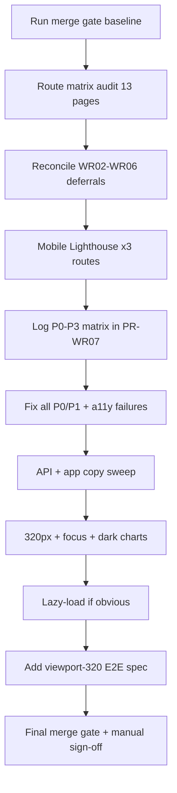

# WR07: Mobile UX, Accessibility & Performance

**Depends on:** [PR-WR06.md](docs/implementation/web/PR-WR06.md) — merge gate **10 E2E / 8 specs**, **201 unit**, **11 integration**  
**Reviews:** [PR-W09.md](docs/implementation/web/PR-W09.md) design system + [REVIEW-MASTER-PLAN.md](docs/implementation/web/REVIEW-MASTER-PLAN.md) WR07 section  
**Out of scope (locked):** New features, Lighthouse CI gate, re-audit of WR06 settings save/delete E2E, CSV export E2E, delete-all Storage warnings (WR08), reminder prefs vs banner (WR04 residual)

---

## Sharpened decisions (resolved)

| # | Question | **Resolved answer** |
|---|----------|---------------------|
| 1 | API error contract | **Stable machine `code` + localized `error` from `copy()`** — routes return `{ error, code }`; clients branch on `code` (fixes `use-meal-scanner` string coupling) |
| 2 | Recharts dark mode | **`useChartColors()`** via `useSyncExternalStore` (same pattern as `useReducedMotion`) — swap `lightColors` / `darkColors` in 5 chart surfaces |
| 3 | 320px E2E merge-blocking | **4 routes only:** `/login`, `/onboarding`, `/dashboard`, `/settings`. `/scan`, `/progress`, `/analytics` — best-effort in same spec; failures → residual risk, not merge block |
| 4 | Lighthouse environment | **Local production build:** `pnpm build && pnpm start` + emulators + logged-in session. Document env/date in PR-WR07 §4 (not `pnpm dev`, not Vercel-only) |
| 5 | 200% zoom failures | **Fix P2 on primary flows** (auth, onboarding, dashboard, settings, scan); other routes document-only in §8 residual |
| 6 | Bundle lazy-load scope | **Analytics section `next/dynamic` + html2canvas on-demand only** — do not lazy-load `WeightProgressChart` unless Lighthouse flags `/progress` |

**No open sharpen questions remain.**

---

## Baseline (before any changes)

```bash
cd calsnap-web
pnpm lint && pnpm test && pnpm build && pnpm test:integration && pnpm test:e2e
```

Record counts in [PR-WR07.md](docs/implementation/web/PR-WR07.md) §2. Note `JAVA_HOME` for local emulators (same as WR06).

**Expected starting point:** 201 unit (38 files), 11 integration (5 files), 10 E2E (8 spec files).

---

## Audit workflow



### Route inventory (13 pages)

| Route | Audit focus |
|-------|-------------|
| `/login`, `/signup` | 320px, keyboard, focus rings, copy |
| `/onboarding` | 320px (WR02 deferred), keyboard step nav, `HeightInputFields` overflow |
| `/dashboard` | Ring a11y unit test, FAB ≥44px, `ScanFab` vs tab bar, dark mode |
| `/scan`, `/scan/edit/[mealId]` | Tab bar, manual entry keyboard, reduced motion stagger |
| `/log`, `/log/[mealId]` | Row actions touch target, share (html2canvas bundle) |
| `/progress` | Chart dark tokens, weigh-in sheet keyboard |
| `/analytics` | Picker wrap (WR05-ANAL-09), chart readability dark mode |
| `/settings` | 320px save bar + sliders (WR06-SET-05), fixed bar `bottom-16` vs tab nav |
| `/privacy` | Readable at 320px (spot-check only) |

**Do not re-audit** unless merge-gate regression: settings save/delete E2E, analytics Gemini paths, WR05 chart data logic.

---

## 1. Deferred findings to close in WR07

| ID | Source | WR07 action |
|----|--------|-------------|
| WR02 §8 | 320px auth/onboarding | E2E + layout fixes if scroll found |
| WR03-COPY-01 | API hardcoded errors | Centralize in `lib/copy/api.ts` + shared codes |
| WR03 scope | Full copy sweep | Grep audit `app/`, `components/`, `lib/queries/` |
| WR05-ANAL-09 | Analytics 320px picker/charts | Verify `flex-wrap` picker; chart container `min-w-0` |
| WR06-SET-05 | Settings 320px | Save bar reachable above tab nav; macro sliders |
| WR01-COPY-01/02 | API + insight errors | API routes; verify `use-generate-insight.ts` already uses `copy()` (likely **close as verified**) |

**Explicitly remain residual (not WR07):** WR06-SET-02/03/07/08, WR04 meal delete UX, WR03 scanner timeout/offline, WR02-GATE-01, ESLint copy rule (P3 doc only unless trivial).

---

## 2. Audit checklist (log Pass/Fail in PR-WR07 §1)

### 2.1 Mobile layout (320px)

- **Horizontal scroll:** `document.documentElement.scrollWidth <= clientWidth` on every route (E2E + manual spot-check).
- **Overflow guards:** Confirm [`layout.pageShell`](calsnap-web/lib/design/layout.ts) (`min-w-0`, `overflow-x-hidden`) on app shells; [`app/(app)/layout.tsx`](calsnap-web/app/(app)/layout.tsx) already sets `overflow-x-hidden` on main.
- **Known risk areas:**
  - Settings fixed save bar (`bottom-16` above tab nav) — [settings/page.tsx](calsnap-web/app/(app)/settings/page.tsx)
  - Analytics timeframe picker — already `flex-wrap` in [AnalyticsTimeframePicker.tsx](calsnap-web/components/analytics/AnalyticsTimeframePicker.tsx)
  - Calorie ring 180px on 320px — number truncation via `min-w-0` in [CalorieRingView.tsx](calsnap-web/components/design/CalorieRingView.tsx)
  - Scan FAB `bottom-20` — [ScanFab.tsx](calsnap-web/components/dashboard/ScanFab.tsx) (`h-14` = 56px, meets 44px)

### 2.2 200% text zoom (manual)

Per [PR-W10.md](docs/implementation/web/PR-W10.md) item 7: Chrome DevTools → 320px width + **200% browser zoom**. Document per-route Pass/Fail in PR-WR07 §8. No CI automation.

**Severity policy:** Clipped/overlapping controls on **primary flows** (auth, onboarding, dashboard, settings, scan) → **P2 fix**. All other routes → document in residual risks only.

### 2.3 Keyboard matrix (manual primary)

| Surface | Checks |
|---------|--------|
| `/login`, `/signup` | Tab order; focused input not clipped |
| `/onboarding` | Step inputs + Next/Back reachable |
| `/settings` | Save bar not trapping focus; sliders operable |
| Weigh-in sheet | Dialog focus trap + Escape; weight input visible |
| Manual meal entry | Add item, fields, Log CTA |

Radix Dialog/AlertDialog already provide focus trap — verify no double-scroll or clipped fields. Document in PR-WR07 §8; no merge-blocking keyboard E2E unless a P1 trap bug is found.

### 2.4 Touch targets (≥44px)

| Control | Current | Action |
|---------|---------|--------|
| Tab bar links | `min-h-11` (44px) | Pass — [BottomTabNav.tsx](calsnap-web/components/app/BottomTabNav.tsx) |
| Scan FAB | `h-14 min-w-14` | Pass |
| Primary buttons | `min-h-11` default variant | Pass — [button.tsx](calsnap-web/components/ui/button.tsx) |
| `button` `sm` variant | `min-h-9` (36px) | Audit usages; bump to `min-h-11` only on primary mobile CTAs if found |
| Meal log ⋯ menu | `min-h-11 min-w-11` | Pass — [MealLogRow.tsx](calsnap-web/components/meal-log/MealLogRow.tsx) |
| `layout.touchTarget` token | **Unused** | Apply to any undersized icon-only controls found in audit |

### 2.5 Dark mode readability

- **CSS tokens:** [`globals.css`](calsnap-web/app/globals.css) `@media (prefers-color-scheme: dark)` + `.dark` class.
- **Gap (likely P2 a11y fix):** All Recharts surfaces import **`lightColors` only** — [CalorieAdherenceSection.tsx](calsnap-web/components/analytics/CalorieAdherenceSection.tsx), MacroTrends, Fiber, Patterns, [WeightProgressChart.tsx](calsnap-web/components/progress/WeightProgressChart.tsx). Axis ticks / reference lines may fail contrast in dark mode.
- **Fix approach (locked):** Add `useChartColors()` in [`lib/design/colors.ts`](calsnap-web/lib/design/colors.ts) using `useSyncExternalStore` — subscribe to `prefers-color-scheme: dark` **and** `.dark` on `documentElement` (for tests). Returns `lightColors` or `darkColors`. Apply in all 5 Recharts surfaces. Calorie ring stays on CSS tokens — keep unit test green.

### 2.6 Focus indicators

- **Buttons:** `focus-visible:ring-2 ring-cs-primary` on [button.tsx](calsnap-web/components/ui/button.tsx) — Pass.
- **Gap:** Form inputs use [`formFieldInputClassName`](calsnap-web/lib/design/form-field.ts) and auth inline classes **without** `focus-visible` ring. Add shared `focus-visible:ring-2 focus-visible:ring-cs-primary focus-visible:ring-offset-2` to `form-field.ts` + auth input classes.
- **Custom controls:** Analytics timeframe `button`, tab `Link`, `MealTypeSelector` — add `focus-visible:` ring where missing (match button pattern).
- **Dialog close:** Uses `focus:ring` not `focus-visible` — acceptable if Lighthouse passes; align to `focus-visible` if flagged.

### 2.7 Calorie ring a11y

- Keep [calorie-ring-accessibility.test.ts](calsnap-web/tests/unit/calorie-ring-accessibility.test.ts) passing — no string changes without updating copy keys in [`lib/copy/design-system.ts`](calsnap-web/lib/copy/design-system.ts).

### 2.8 Reduced motion

| Consumer | Status |
|----------|--------|
| CalorieRingView | Uses `useReducedMotion` |
| MealAnalysisResultView | Stagger gated |
| WeightTrendMiniChart | `chart-fade-in` gated |
| WeightProgressChart | `isAnimationActive={!reducedMotion}` |
| Analytics BarCharts (4 sections) | **Not gated** — set `isAnimationActive={!reducedMotion}` |
| `chart-fade-in` in globals.css | No `@media (prefers-reduced-motion)` — optional CSS guard |

### 2.9 Copy audit

**Primary violations (confirmed):**

- [`app/api/analyze-meal/route.ts`](calsnap-web/app/api/analyze-meal/route.ts) — 10 error strings
- [`app/api/generate-insight/route.ts`](calsnap-web/app/api/generate-insight/route.ts) — 7 error strings
- [`app/api/auth/session/route.ts`](calsnap-web/app/api/auth/session/route.ts) — `Missing idToken`, raw `error.message` leak

**Client coupling:** [use-meal-scanner.ts](calsnap-web/lib/scanner/use-meal-scanner.ts) line 258 compares `body.error === 'Analysis parse failed'`.

**Implementation pattern (locked — `code` + `copy()`):**

1. Add [`lib/copy/api.ts`](calsnap-web/lib/copy/api.ts) with keys like `api.analyze.unauthorized`, `api.analyze.parseFailed`, etc.; register in [`lib/copy/keys.ts`](calsnap-web/lib/copy/keys.ts).
2. Add [`lib/api/error-codes.ts`](calsnap-web/lib/api/error-codes.ts) — string union constants (e.g. `analysis_parse_failed`) exported for routes and clients.
3. API routes return `{ error: copy('api...'), code: ApiErrorCode }` on all error responses.
4. Update `use-meal-scanner` to branch on `body.code === ApiErrorCode.AnalysisParseFailed` (not English `error` string).
5. Session route: map known failures to copy keys + codes; **never** return raw Firebase/admin `error.message` to client.
6. Grep `app/` + `components/` for remaining literals; `lib/queries/use-meal.ts` `'Missing uid or mealId'` is internal — leave unless exposed to UI.
7. Extend [`tests/unit/session-route.test.ts`](calsnap-web/tests/unit/session-route.test.ts) if session error shape changes.

**ESLint copy guard:** Document as P3 residual in PR-WR07 §7 (W09 noted optional; skip unless trivial).

### 2.10 Performance (obvious bloat only)

| Target | Current | Fix |
|--------|---------|-----|
| Analytics Recharts (5 chart surfaces) | Static imports on [analytics/page.tsx](calsnap-web/app/(app)/analytics/page.tsx) | `next/dynamic` per section with `ssr: false` + existing `SectionCardSkeleton` |
| html2canvas | Top-level import in [use-meal-share-image.ts](calsnap-web/components/meal-log/use-meal-share-image.ts) | `const html2canvas = (await import('html2canvas')).default` inside share handler |
| WeightProgressChart | Static import on `/progress` | **Out of scope** unless Lighthouse flags `/progress` perf |
| Images | Meal photos | No change unless Lighthouse flags |

**Do not** add Lighthouse CI, bundle analyzer CI, or refactor query layers.

---

## 3. Mobile Lighthouse (document only)

**Environment (locked):** Local production server — `pnpm build && pnpm start` with Firebase emulators running; establish session via onboarded test account in browser before each run. Record **"local prod build + emulators"** in PR-WR07 §4.

Run **Chrome Lighthouse → Mobile** (incognito, throttling on):

| Page | URL | Informative targets |
|------|-----|---------------------|
| Dashboard | `/dashboard` | Perf ≥70, A11y ≥90 |
| Scan | `/scan` | Perf ≥70, A11y ≥90 |
| Settings | `/settings` | Perf ≥70, A11y ≥90 |

Record in PR-WR07 §4 table: Perf, A11y, Best Practices, SEO per page + date + environment.

**Policy:** Fix **all a11y failures** Lighthouse reports regardless of score; perf fixes limited to analytics lazy-load + html2canvas (locked scope). Scores are **not** merge-blocking.

---

## 4. Merge-blocking E2E: 320px viewport spec

### New files

- [`tests/e2e/helpers/viewport.ts`](calsnap-web/tests/e2e/helpers/viewport.ts)
- [`tests/e2e/viewport-320.spec.ts`](calsnap-web/tests/e2e/viewport-320.spec.ts)
- Export from [`tests/e2e/helpers/index.ts`](calsnap-web/tests/e2e/helpers/index.ts)

### Helper contract

```ts
export const MOBILE_VIEWPORT = { width: 320, height: 568 } as const;

export async function setMobileViewport(page: Page): Promise<void>;

/** documentElement.scrollWidth <= clientWidth + 1px (subpixel tolerance) */
export async function assertNoHorizontalScroll(page: Page): Promise<void>;

/** Optional: key heading/landmark visible */
export async function assertRouteReady(page: Page, heading: string | RegExp): Promise<void>;
```

### Spec structure (one `test.describe` with `beforeEach` viewport)

| Test | Setup | Assert |
|------|-------|--------|
| Login | `page.goto('/login')` | No horizontal scroll; `auth.login.title` heading |
| Onboarding | `signUpWithEmail` → `/onboarding` | No scroll; onboarding step visible |
| Dashboard | `createOnboardedUser` | No scroll; calorie ring progressbar or dashboard title |
| Settings | onboarded → `gotoSettings` | No scroll; save profile control in DOM |
| Scan | onboarded → `gotoAppRoute('/scan')` | No scroll; scan capture or title |
| Progress | onboarded → `/progress` | No scroll; progress heading |
| Analytics | empty-state onboarded user | No scroll; analytics title |

**Merge-blocking (locked):** login, onboarding, dashboard, settings — **4 tests must pass CI**.

**Best-effort (same spec, not merge-blocking):** scan, progress, analytics — implement if stable; document skip reason in PR-WR07 §7 if deferred.

**Playwright config:** Keep single `chromium` project; `setMobileViewport` in `beforeEach` for viewport spec only; desktop specs stay 1280×720.

**Target:** 10 → **14 E2E** (4 blocking + up to 3 best-effort) in **9 spec files**.

---

## 5. Findings matrix template (PR-WR07 §3)

Pre-populate likely findings; confirm/update during audit:

| ID | Sev | Area | Finding | Planned fix |
|----|-----|------|---------|-------------|
| WR07-LAY-01 | P2 | Charts | Recharts use `lightColors` in dark mode | `useChartColors()` |
| WR07-A11Y-01 | P2 | Forms | Inputs lack `focus-visible` ring | `form-field.ts` + auth inputs |
| WR07-COPY-01 | P2 | API | 22+ hardcoded API error strings | `lib/copy/api.ts` + error codes |
| WR07-COPY-02 | P2 | Session | Raw `error.message` in session route | Copy mapping |
| WR07-MOT-01 | P3 | Motion | Analytics charts ignore reduced motion | `isAnimationActive` |
| WR07-PERF-01 | P3 | Bundle | Eager recharts + html2canvas | dynamic import |
| WR07-E2E-01 | P1 | E2E | No 320px viewport tests | `viewport-320.spec.ts` |

Escalate any horizontal scroll on critical routes to **P1**.

---

## 6. Fix implementation order

1. **Baseline merge gate** — record §2
2. **Manual + automated audit** — route matrix, Lighthouse x3, grep copy
3. **P0/P1 + a11y failures** — layout scroll, focus, dark charts, session error leak
4. **Copy sweep** — API routes + client code coupling
5. **Reduced motion + perf** — analytics animation gate, dynamic imports
6. **E2E viewport spec** — helpers + 4–7 tests
7. **Unit tests** — extend `copy.test.ts` for new API keys; optional `error-codes` test; keep calorie-ring test green
8. **Final merge gate** — record §2 delta
9. **Docs** — complete PR-WR07.md + update [README.md](docs/implementation/web/README.md) WR07 status

---

## 7. Files likely touched

| Area | Files |
|------|-------|
| Copy/API | `lib/copy/api.ts`, `lib/copy/keys.ts`, `lib/api/error-codes.ts`, 3 API routes, `use-meal-scanner.ts` |
| A11y/layout | `lib/design/form-field.ts`, auth pages, analytics chart components, `WeightProgressChart.tsx`, `globals.css` (optional reduced-motion) |
| Perf | `app/(app)/analytics/page.tsx`, `use-meal-share-image.ts` |
| E2E | `tests/e2e/helpers/viewport.ts`, `viewport-320.spec.ts`, `helpers/index.ts` |
| Docs | `docs/implementation/web/PR-WR07.md`, `.cursor/plans/pr_wr07_mobile_a11y_perf.plan.md`, `README.md` |

---

## 8. Acceptance criteria

- [ ] Merge gate green **before and after**; E2E count documented (10 → N)
- [ ] Zero open **P0/P1** in WR07 scope
- [ ] All Lighthouse **a11y failures** fixed (scores documented, not gated)
- [ ] 320px E2E: minimum `/login`, `/onboarding`, `/dashboard`, `/settings` — no horizontal scroll
- [ ] Copy: no user-facing literals in `app/api/`; `app/` + `components/` verified
- [ ] `calorie-ring-accessibility.test.ts` still passes
- [ ] WR06 flows untouched (settings save, delete-all E2E still pass)
- [ ] [PR-WR07.md](docs/implementation/web/PR-WR07.md) complete: checklist, findings matrix, fix list, Lighthouse table, residual risks, manual sign-off §8
- [ ] No real Gemini in CI

---

## 9. Residual risks (expected §7)

| Risk | Notes |
|------|-------|
| 200% zoom on secondary routes | Manual doc-only; primary flows fixed at P2 |
| Best-effort viewport tests (scan/progress/analytics) | May skip with residual note if CI flake |
| Keyboard matrix | Manual sign-off; no full E2E matrix |
| Lighthouse perf &lt;70 | Document only unless trivial win from lazy-load |
| ESLint copy rule | P3 — defer |
| `button` `sm` on desktop-only surfaces | Fix only if mobile-visible |
| Chart colors SSR hydration | `useChartColors` must use `useSyncExternalStore` pattern like `useReducedMotion` |
| Analytics viewport E2E flake | Seed meals in test or accept empty-state assertion |

---

## 10. Manual sign-off (PR-WR07 §8)

| Scenario | Environment |
|----------|-------------|
| Light + dark all tabs | Local browser |
| 320px + 200% zoom all routes | DevTools |
| Keyboard matrix (5 surfaces) | Local |
| Mobile Lighthouse x3 | Chrome Lighthouse Mobile |
| Reduced motion OS setting | Scan stagger + chart animations off |

**Not in WR07:** CSV export download, delete-all Storage warnings, PWA install, production Google OAuth.
