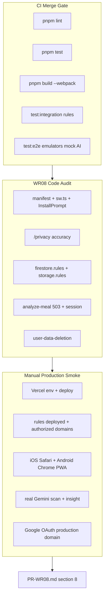

# WR08: Production, PWA & Security Hardening

**Canonical plan:** [`.cursor/plans/pr_wr08_production_pwa_security.plan.md`](.cursor/plans/pr_wr08_production_pwa_security.plan.md)  
**Depends on:** [PR-WR07.md](docs/implementation/web/PR-WR07.md) — merge gate **206 unit / 11 integration / 17 E2E (9 specs)**  
**Reviews:** [PR-W10.md](docs/implementation/web/PR-W10.md) + [REVIEW-MASTER-PLAN.md](docs/implementation/web/REVIEW-MASTER-PLAN.md) WR08 + [ROLLOUT.md](docs/implementation/web/ROLLOUT.md) Phases 4–5

---

## Sharpened decisions (resolved)

| # | Question | **Resolved answer** |
|---|----------|---------------------|
| 1 | Rate limiting (`WR03-SCAN-04`) | **Document-only (locked).** No rate-limit code. `PR-WR08.md` §7 abuse notes: session-gated routes block anonymous Gemini abuse; per-uid cost exposure is operator risk; P3 residual. No Redis/Upstash. |
| 2 | Storage orphan on log fail (`WR03-SCAN-02`) | **Implement P2 fix** in [`use-log-meal.ts`](calsnap-web/lib/queries/use-log-meal.ts): `try/catch` around `createMeal`; on failure, `deleteObject` uploaded `photoStoragePath` (best-effort). Unit test with mocked repo. |
| 3 | Delete-all Storage `console.warn` (`WR06-SET-08`) | **Defer P3** — prefix wipe + per-meal delete already best-effort; document in residual risks unless audit finds user-visible data-loss P1. |
| 4 | Firestore negative rule tests | **Add P2** cross-user deny cases to existing [`meal-crud-firestore.test.ts`](calsnap-web/tests/integration/meal-crud-firestore.test.ts) and [`weigh-in-firestore.test.ts`](calsnap-web/tests/integration/weigh-in-firestore.test.ts) — mirror [`profile-firestore.test.ts`](calsnap-web/tests/integration/profile-firestore.test.ts) pattern. No new test file. |
| 5 | Privacy session cookie gap | **Fix P2 if confirmed** — add one `privacy.section.*` paragraph in [`lib/copy/privacy.ts`](calsnap-web/lib/copy/privacy.ts) for HTTP-only session cookie used for auth (no third-party analytics). |
| 6 | PWA maskable icons | **Defer P3** unless manual Lighthouse installability audit fails on Android. |
| 7 | New E2E specs | **None merge-blocking** unless audit finds P0/P1 automation gap. Keep **17 E2E green**. Optional best-effort: unauthenticated `/privacy` loads (not merge-blocking). |
| 8 | Lighthouse scores | **Manual only** in WR08 §8 — consolidate WR07 §4 pending rows. **Fix P0/P1 a11y only** (locked); record all scores even if Perf &lt;70 or A11y &lt;90. Not CI-gated. |
| 9 | Production smoke environment | **Live Vercel production URL** for Google OAuth + PWA HTTPS. Email/password OK on preview; Google sign-off on production domain per [ROLLOUT 5.4](docs/implementation/web/ROLLOUT.md). |
| 10 | Rules deploy verification | **Operator checklist** in PR-WR08 §8 — confirm `firebase deploy --only firestore:rules,storage:rules` to same `projectId` as Vercel `NEXT_PUBLIC_FIREBASE_PROJECT_ID`. Integration tests prove rule *logic*; prod deploy is manual gate. |
| 11 | Real Gemini in CI | **Never** — production smoke manual only (locked). |
| 12 | Sprint close-out | Update [README.md](docs/implementation/web/README.md) WR02–WR08 statuses; mark WR08 complete in REVIEW-MASTER-PLAN success criteria when §8 signed off. |
| 13 | Gemini 503 on production | **Unit test + code audit only (locked).** Do not unset `GEMINI_API_KEY` on prod/preview. WR03 E2E mock 503 + `analyze-meal-route.test.ts` suffice for sign-off. |
| 14 | Production smoke depth | **Full 20-scenario matrix (locked)** — consolidates WR02–WR07 + ROLLOUT 4–5; not abbreviated. |

**No open sharpen questions remain** (second sharpen pass 2026-06-30).

---

## Baseline merge gate

```bash
cd calsnap-web
pnpm lint && pnpm test && pnpm build && pnpm test:integration && pnpm test:e2e
```

**Expected (WR07 final):** 206 unit (38 files), 11 integration (5 files), 17 E2E (9 spec files)  
**Local note:** `JAVA_HOME` for OpenJDK 21 when running integration/E2E emulators.

Run baseline **before** audit and **after** all fixes. Document counts in `PR-WR08.md` §2.

---

## Architecture — production validation flow



---

## Phase 1 — Automated audit (code + CI)

### 1.1 PWA ([`app/sw.ts`](calsnap-web/app/sw.ts), [`manifest.webmanifest`](calsnap-web/public/manifest.webmanifest))

| Check | Expected | Action if fail |
|-------|----------|----------------|
| `display: standalone`, icons 192+512 | Present | Fix manifest |
| `start_url: /dashboard`, `scope: /` | Present | Verify cold-start → login OK, not redirect loop |
| SW builds via `next build --webpack` | `public/sw.js` emitted | CI already runs build |
| `NetworkOnly` for `/api/*`, navigations, `/__/auth/*`, Firebase hosts | Lines 19–38 in `sw.ts` | P0 if cached auth/API |
| Install banner after onboarding | `markPwaInstallEligible` + [`InstallPromptBanner`](calsnap-web/components/pwa/InstallPromptBanner.tsx) | P1 if broken |
| SW disabled in dev | `next.config.ts` Serwist `disable: development` | Document — PWA QA needs preview/prod build |

**Current state:** Foundation strong; gaps are manual device QA + optional maskable icons (P3).

### 1.2 Privacy ([`app/privacy/page.tsx`](calsnap-web/app/privacy/page.tsx), [`lib/copy/privacy.ts`](calsnap-web/lib/copy/privacy.ts))

| Check | Expected |
|-------|----------|
| Public without login | `middleware.ts` `PUBLIC_PATHS` includes `/privacy` |
| Firebase Auth, Firestore, Storage, Gemini server-side | Copy sections accurate |
| No third-party analytics | Stated in `notCollected` |
| Delete-all flow matches [`user-data-deletion.ts`](calsnap-web/lib/services/user-data-deletion.ts) | Auth account retained |
| Session cookie disclosure | **Add P2** if missing after grep |

Settings link via [`AboutSection.tsx`](calsnap-web/components/settings/AboutSection.tsx).

### 1.3 Security rules

**Firestore** ([`firestore.rules`](calsnap-web/firestore.rules)): owner-only `users/{uid}/profile|meals|weighIns`.

**Storage** ([`storage.rules`](calsnap-web/storage.rules)): owner-only `users/{uid}/meals/{mealId}/{fileName}`.

| Check | Verification |
|-------|--------------|
| Unauthenticated deny | `profile-firestore.test.ts`, `storage-rules.test.ts` |
| Cross-user deny — meals/weighIns | **Add** in Phase 2 |
| Invalid storage path default deny | Document — default Firebase deny, optional test |
| Rules deployed to prod | Operator §8 checklist |

### 1.4 Environment ([`.env.local.example`](calsnap-web/.env.local.example))

Cross-check against [ROLLOUT 5.2](docs/implementation/web/ROLLOUT.md) table:

- All `NEXT_PUBLIC_FIREBASE_*` + `NEXT_PUBLIC_USE_FIREBASE_EMULATOR=false` on Vercel
- `FIREBASE_ADMIN_*` trio for session cookies
- `GEMINI_API_KEY` server-only
- Add comment in `.env.local.example`: **never** set emulator=true on Vercel (P2 doc fix if missing)

### 1.5 API routes

| Route | Check |
|-------|-------|
| [`analyze-meal/route.ts`](calsnap-web/app/api/analyze-meal/route.ts) | Missing key → **503** + `AnalysisUnavailable`; session → 401 |
| [`generate-insight/route.ts`](calsnap-web/app/api/generate-insight/route.ts) | Same 503 pattern |
| Client 503 UX | [`use-meal-scanner.ts`](calsnap-web/lib/scanner/use-meal-scanner.ts) branches on `code` → manual entry |
| E2E regression | [`scanner-error-manual-entry.spec.ts`](calsnap-web/tests/e2e/scanner-error-manual-entry.spec.ts) stays green |

### 1.6 Deletion lifecycle

Audit [`user-data-deletion.ts`](calsnap-web/lib/services/user-data-deletion.ts): meals → weighIns → profile → storage prefix → localStorage keys. WR06 E2E [`delete-all-reonboard.spec.ts`](calsnap-web/tests/e2e/delete-all-reonboard.spec.ts) must remain green.

---

## Phase 2 — Fixes (P0/P1 required; P2 as scoped above)

### Anticipated fix list

| ID | Sev | File | Change |
|----|-----|------|--------|
| WR08-STOR-01 | P2 | `lib/queries/use-log-meal.ts` | Compensating Storage delete on `createMeal` failure |
| WR08-STOR-02 | P2 | `tests/unit/` (new or extend) | Mock repos — assert delete called on Firestore fail |
| WR08-RULE-01 | P2 | `tests/integration/meal-crud-firestore.test.ts` | Cross-uid read/write denied |
| WR08-RULE-02 | P2 | `tests/integration/weigh-in-firestore.test.ts` | Cross-uid read/write denied |
| WR08-PRIV-01 | P2 | `lib/copy/privacy.ts` | Session cookie paragraph (if audit confirms gap) |
| WR08-ENV-01 | P2 | `.env.local.example` | Vercel/emulator=false warning comment |
| WR08-RATE-01 | P3 | `PR-WR08.md` §7 only | Abuse notes — **no code** (locked sharpen decision) |

**Audit may surface additional P0/P1** (e.g. manifest broken, SW caches `/api`, session redirect loop on prod) — fix all before sign-off.

### Rate limiting (locked — document only)

`PR-WR08.md` §7 documents:

- `/api/analyze-meal` and `/api/generate-insight` require valid session (`verifyApiSession`)
- No anonymous Gemini access; operator-funded key
- Authenticated per-uid abuse possible but out of scope for v1; defer to future Redis/WAF if needed
- Cross-reference `WR03-SCAN-04` as closed P3 residual

---

## Phase 3 — Production smoke (manual, live Firebase + Vercel)

Consolidates pending sign-offs from WR02 §8, WR03 §8, WR04 §8, WR05 §8, WR06 §8, WR07 §8 into **PR-WR08.md §8**.

### Operator pre-flight

- [ ] Vercel production env complete ([ROLLOUT 5.2](docs/implementation/web/ROLLOUT.md))
- [ ] `NEXT_PUBLIC_USE_FIREBASE_EMULATOR=false`
- [ ] Firebase authorized domains include production Vercel URL
- [ ] Rules deployed: `pnpm exec firebase deploy --only firestore:rules,storage:rules`
- [ ] `GEMINI_API_KEY` set on Vercel; redeploy if changed

### Core flows (production URL)

| # | Scenario | Source WR |
|---|----------|-----------|
| 1 | Email signup → onboarding → dashboard | ROLLOUT 4.7 / 5.5 |
| 2 | Returning user login skips onboarding | WR02 |
| 3 | **Google OAuth** popup (desktop) + redirect (mobile) | WR02 carryover |
| 4 | Real Gemini scan → log → photo in cloud Storage | WR03 |
| 5 | Meal edit + delete → dashboard updates | WR04 |
| 6 | Weigh-in → calorie target update | WR04 |
| 7 | Analytics insight (≥3 days data, real Gemini) | WR05 |
| 8 | Settings profile save → target change | WR06 |
| 9 | CSV export download | WR06 |
| 10 | Delete all data → re-onboard | WR06 |
| 11 | Session cookie — no post-login kick to `/login` | ROLLOUT troubleshooting |
| 12 | Scanner 503 when `GEMINI_API_KEY` missing | WR03 — **unit test + route audit only**; do not unset prod key |

### PWA + polish (devices required)

| # | Scenario | Pass criteria |
|---|----------|---------------|
| 13 | Add to Home Screen — **iOS Safari** | Installs; opens standalone |
| 14 | Add to Home Screen — **Android Chrome** | `beforeinstallprompt` CTA or manual |
| 15 | PWA standalone → logged-in dashboard | No login redirect loop |
| 16 | Weigh-in reminder banner (7+ days overdue) | WR04 manual |
| 17 | `/privacy` accuracy review | Matches live practices |
| 18 | Mobile Lighthouse ×3 (dashboard, scan, settings) | Record scores; fix P0/P1 a11y |
| 19 | 320px + 200% zoom spot-check | WR07 matrix |
| 20 | Keyboard matrix (auth, onboarding, settings, weigh-in, manual meal) | WR07 matrix |

### Troubleshooting reference

Use [ROLLOUT troubleshooting table](docs/implementation/web/ROLLOUT.md) for login loop, permission denied, Google auth, scanner 503, PWA install.

---

## Phase 4 — Deliverables

### [`docs/implementation/web/PR-WR08.md`](docs/implementation/web/PR-WR08.md) (new)

Mirror WR07 structure:

1. **Audit checklist** — PWA, privacy, rules, env, API, deletion (pass/fail table)
2. **Baseline merge gate** — before/after counts
3. **Findings matrix** — P0–P3 with IDs, status
4. **Fix list** — files changed
5. **Integration test delta** — meals/weighIns deny cases
6. **Abuse / rate-limit notes** — implemented or residual
7. **Residual risks** — P3 deferred items + serverless rate-limit caveat
8. **Manual sign-off table** — consolidated WR02–WR07 + ROLLOUT 4–5; operator initials + date
9. **Sprint completion sign-off** — checklist vs [REVIEW-MASTER-PLAN success criteria](docs/implementation/web/REVIEW-MASTER-PLAN.md)
10. **Files changed index**

### [`.cursor/plans/pr_wr08_production_pwa_security.plan.md`](.cursor/plans/pr_wr08_production_pwa_security.plan.md)

This file — todos tracked below.

### [README.md](docs/implementation/web/README.md)

Update review sprint table: WR02–WR04 → Implemented (if audit-only); WR08 → Implemented when done.

---

## Sprint completion criteria (WR08 closes review sprint)

From [REVIEW-MASTER-PLAN.md](docs/implementation/web/REVIEW-MASTER-PLAN.md):

1. ROLLOUT Phases 4–5 signed off in PR-WR08 §8
2. CI merge gate green on `main`
3. E2E covers signup through settings (17 tests — no regression)
4. Real Gemini scan + insight on production
5. Lighthouse baseline captured; no open P0/P1 a11y
6. PWA install verified iOS + Android
7. Zero open P0/P1 vs W01–W10 acceptance
8. All eight `PR-WR0N.md` docs complete with findings + residual risks

---

## Out of scope (locked)

Web Push/FCM, offline meal logging, Redis rate limiting, Firebase Auth account deletion, new merge-blocking E2E unless audit gap, real Gemini in CI, password reset.

---

## Risk summary

| Risk | Mitigation |
|------|------------|
| Google OAuth only works on prod domain | Test on production URL; email on preview |
| Authenticated Gemini abuse (no rate limit) | Documented P3 residual in §7 |
| Storage orphan edge cases | Compensating delete in log flow |
| Operator skips rules deploy | Explicit §8 checklist item |
| WR02–WR07 manual debt | Single consolidated §8 table in PR-WR08 |
