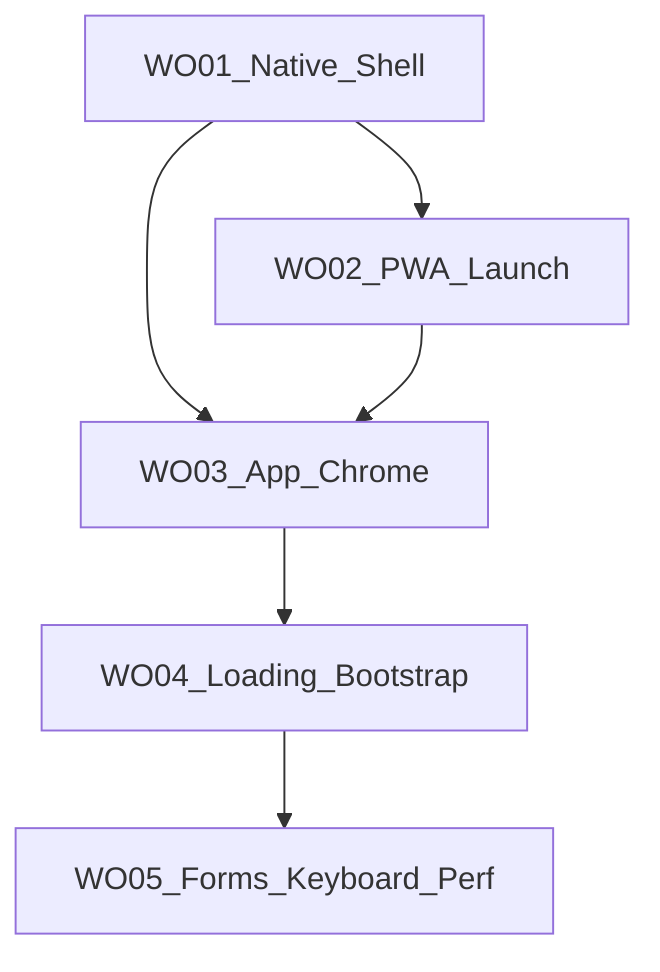

# CalSnap Web — Optimization Sprint Master Plan (WO01–WO05)

**Status:** Code-complete (2026-07-01). Operator manual QA Pending — see [PR-WO05.md](./PR-WO05.md) §8.  
**Cursor plan:** [.cursor/plans/web_optimization_sprint_68cb0f71.plan.md](../../.cursor/plans/web_optimization_sprint_68cb0f71.plan.md)

---

## Purpose

Close the **native-feel gap** on mobile Safari/Chrome for the feature-complete CalSnap Web PWA: safe areas, launch chrome, app shell polish, loading UX, keyboard/forms, and documented performance baseline.

**In scope:** UI/UX polish for the current 5-tab IA.  
**Out of scope:** Web Push, offline meal logging, swipe-to-delete, 3-tab IA, new product features.

---

## Sprint index

| PR | Doc | Status | Focus |
|----|-----|--------|-------|
| WO01 | [PR-WO01.md](./PR-WO01.md) | **Complete** (`4ea0500`) | Native shell & safe areas |
| WO02 | [PR-WO02.md](./PR-WO02.md) | **Complete** (`c2ab40f`) | PWA launch & install |
| WO03 | [PR-WO03.md](./PR-WO03.md) | **Complete** (`6e1a511`) | App chrome & sheets |
| WO04 | [PR-WO04.md](./PR-WO04.md) | **Complete** | Loading states & auth bootstrap |
| WO05 | [PR-WO05.md](./PR-WO05.md) | **Complete** | Forms, keyboard & perf sign-off |

**Performance baseline:** [PERF-BASELINE.md](./PERF-BASELINE.md)

---

## Dependency graph



---

## Locked sharpened decisions (sprint-wide)

| Topic | Choice |
|-------|--------|
| IA | Keep 5-tab bar; Analytics from Progress |
| View Transitions | Defer entirely |
| Input 16px | `text-base sm:text-sm` on all form controls (WO05) |
| Query tuning | `refetchOnWindowFocus: false`; `staleTime: 30_000` (WO05) |
| Keyboard inset | Consumer-only `useKeyboardInset`; `AppDialog` unchanged (WO05) |
| Lighthouse | Fix all a11y failures; scores informative only (WO05) |
| Manual QA | Document Pending rows; non-blocking for merge |
| Safe-area QA | CSS unit tests + mandatory iOS standalone sign-off |

---

## Success criteria

| Criterion | Status |
|-----------|--------|
| Safe-area / PWA / chrome / skeleton (WO01–04) | **Done** (code) |
| 16px inputs + keyboard hook (WO05) | **Done** (code) |
| PERF-BASELINE + a11y fixes on 3 routes | **Done** (code); Lighthouse scores Pending operator |
| CI merge gate green | Pending CI (integration/E2E) |
| Manual device QA | Pending operator |

---

## Merge gate

From `calsnap-web/`:

```bash
pnpm lint && pnpm test && pnpm build && pnpm test:integration && pnpm test:e2e
```

**WO05 final counts:** 232 unit tests (+10), 18 E2E (unchanged), lint + build green.

---

## Residual risks (sprint close-out)

| Risk | Owner |
|------|-------|
| Operator manual QA (WR07/WR08/WO05 §8) | Operator |
| Lighthouse numeric scores on Vercel preview | Operator |
| ESLint copy guard | P3 defer |
| `AnalyticsCustomRangeSheet` keyboard inset | WO05 defer |
| Dashboard double skeleton LCP | WO04 accepted |

---

## Post-sprint: iPhone PWA + Settings UX

Device QA on iPhone 17 (2026-07-01) found standalone-PWA shell bugs while Safari browser mode was already correct. Follow-up PR documented in [PR-IPHONE-SAFARI-UX.md](./PR-IPHONE-SAFARI-UX.md):

- Flex-footer tab bar (replaces fixed positioning)
- Standalone-only top safe-area on scroll shells
- Settings header Save + DOB overflow fixes
- ScanFab removed

**WO05 final counts (pre–iPhone fix):** 232 unit tests, 18 E2E. **Post–iPhone fix:** 236 unit tests (+4), 18 E2E unchanged.

---

## Related docs

- [REVIEW-MASTER-PLAN.md](./REVIEW-MASTER-PLAN.md) — WR01–WR08 review sprint
- [README.md](./README.md) — full PR index
