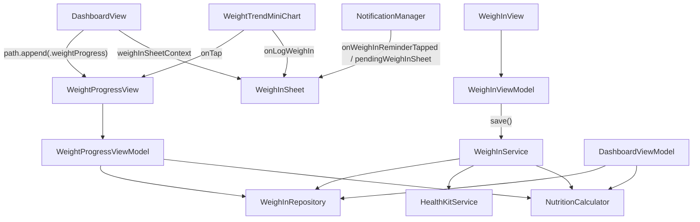

# PR6: Weight Logging & Weigh-In Flow

**Status:** Implemented  
**Source of truth:** [`docs/technical-spec.md`](../technical-spec.md) (PR 6 section), [`docs/engineering-rules.md`](../engineering-rules.md), [`PR-03.md`](./PR-03.md), [`PR-04.md`](./PR-04.md), [`PR-05.md`](./PR-05.md)

---

## 1. Objective

Deliver weekly weigh-in UX, dynamic TDEE/target recalculation on save, a full weight progress screen with Swift Charts projection, minimal weekly local notification scheduling, and HealthKit body-mass writes. Reuse PR3 plateau logic, PR4 fire-and-forget HealthKit patterns, and PR5 typed `NavigationStack` routing. **No schema changes.**

---

## 2. In scope

- **`WeighInService`** — sole save / recalc / HealthKit / plateau-detection pipeline
- **`WeighInView` + `WeighInViewModel`** — sheet: weight input, lbs/kg toggle with conversion, date picker, TDEE/target preview, Save, “Remind me tomorrow”
- **`WeightProgressView` + `WeightProgressViewModel`** — header stats, progress bar, Swift Charts (actual + projection + goal), stats grid, history list
- **`NotificationManager`** — schedule / cancel / snooze weekly reminders; notification tap → dashboard weigh-in sheet
- **PR5 route extension** — `.weightProgress` on existing `DashboardRoute`
- **Weekly plateau cadence** — replaces PR3 “last N weigh-ins regardless of spacing” proxy
- **`NutritionCalculator` helpers** — `projectedGoalDate`, `weeklyLossRateKg`, `projectionPoints`
- **`WeighInRepository` extensions** — `save`, `fetchAll`, `fetchWeeklyPlateauWeighIns`
- **`HealthKitService.logBodyMass`** — called only from `WeighInService`
- **Dashboard wiring** — mini-chart tap → progress screen; weigh-in sheet; dual-user reminder scheduling
- **Unit tests** — five range/state assertions in `WeighInTests`
- **`#Preview`** on every new view file

---

## 3. Out of scope

- Settings day/time pickers for reminders (PR8) — PR6 uses **temporary** AppStorage defaults (Sunday 08:00 per user)
- Analytics screen reuse of `WeightProgressView` (PR7)
- HealthKit weight **read** sync (PR8)
- Persisted unit-preference UI (PR8) — display units follow `Locale.current.measurementSystem` via `DashboardViewModel.useLbsForDisplay`
- Notification deep links, universal links, or routing beyond dashboard sheet presentation
- Widgets, daily log reminders, Siri intents (PR10)
- `UserProfile` / `WeighIn` schema changes
- `project.yml` / xcodegen — sources registered in `CalSnap.xcodeproj` only

---

## 4. Architecture



**Save pipeline (`WeighInService.save`):**

1. Recalculate TDEE, daily target, BMI from new weight (preserves `deficitKcal` unless safety floor applies)
2. Update `UserProfile` (`tdee`, `dailyCalorieTarget`, `deficitKcal`, `updatedAt`)
3. Insert `WeighIn` via `WeighInRepository.save`
4. Fire-and-forget `HealthKitService.logBodyMass` (log-only on failure)
5. Fetch weekly plateau weigh-ins; return `SaveResult` with `didTriggerPlateau`

Both weigh-in entry points (`WeighInView` from dashboard sheet, future progress-screen trigger) use this single service. View models do not write SwiftData or HealthKit directly.

---

## 5. Files created

| Path | Purpose |
|------|---------|
| `CalSnap/Core/Services/WeighInService.swift` | Recalculate + save + HK + plateau `SaveResult` |
| `CalSnap/Core/Services/NotificationManager.swift` | `@MainActor` `UNUserNotificationCenterDelegate`; schedule/cancel/snooze; cold-launch pending sheet |
| `CalSnap/Features/Progress/WeighInView.swift` | Weigh-in sheet UI (`NavigationStack` + `Form`) |
| `CalSnap/Features/Progress/WeighInViewModel.swift` | Draft state, live preview, `setUseLbs(_:)`, save via `WeighInService` |
| `CalSnap/Features/Progress/WeightProgressView.swift` | Full progress screen with Swift Charts |
| `CalSnap/Features/Progress/WeightProgressViewModel.swift` | Display-only load, chart points, stats formatting |
| `CalSnapTests/WeighInTests.swift` | Five PR6 unit tests |

---

## 6. Files modified

| Path | Change |
|------|--------|
| `CalSnap/Core/Services/NutritionCalculator.swift` | `weeklyLossRateKg`, `projectedGoalDate`, `projectionPoints` |
| `CalSnap/Core/Repositories/WeighInRepository.swift` | `save`, `fetchAll`, `fetchWeeklyPlateauWeighIns` (≥6-day spacing) |
| `CalSnap/Core/Services/HealthKitService.swift` | `logBodyMass(kg:at:)` |
| `CalSnap/Core/Utilities/Constants.swift` | `AppConstants.Notifications`, `AppStorageKey` reminder/snooze keys |
| `CalSnap/Features/MealLog/DashboardRoute.swift` | `.weightProgress` case |
| `CalSnap/Features/Dashboard/DashboardViewModel.swift` | `latestWeighInKg`, weekly `plateauWeighIns` fetch, `chartWeighIns` |
| `CalSnap/Features/Dashboard/DashboardView.swift` | `WeighInSheetContext`, `.sheet(item:)`, progress navigation, notification wiring, dual-user reminders |
| `CalSnap/Features/Dashboard/WeightTrendMiniChart.swift` | Tappable card, header “Log weigh-in”, empty-state CTA |
| `CalSnap/App/AppContainer.swift` | `@MainActor`; wire `notificationManager` |
| `CalSnap/Resources/Info.plist` | `NSUserNotificationsUsageDescription` |
| `CalSnap.xcodeproj/project.pbxproj` | Register PR6 sources under `Features/Progress` |

---

## 7. Spec extensions

1. **Recalculation preserves `deficitKcal`** — only TDEE/target recomputed from new weight unless `dailyTarget` safety floor adjusts deficit
2. **Plateau cadence** — last 3 weigh-ins with ≥6-day spacing (`weeklyPlateauMinimumDaySpacing`); replaces PR3 count-based proxy
3. **Notification identifier** — `weigh-in-{userId}` (not user name); `userId` in notification `userInfo`
4. **Temporary reminder defaults (until PR8)** — Sunday 08:00 local time per user via AppStorage; PR8 Settings will read/write same keys
5. **Notification tap** — presents weigh-in sheet on dashboard only; no deep-link navigation push
6. **`WeighInService` sole pipeline** — view models call service only; no direct HK/SwiftData writes from views
7. **PR5 route extension** — `.weightProgress` on existing `DashboardRoute`; no parallel routing types
8. **HealthKit** — fire-and-forget after SwiftData save (PR4 pattern); errors logged, not shown to user
9. **Current weight for sheet** — latest `WeighIn.weightKg`, else `startingWeightKg`
10. **Skip / snooze** — AppStorage snooze until tomorrow; weekly reminder taps respect snooze; `-snooze` follow-up notifications always open sheet; manual “Log weigh-in” ignores snooze
11. **Projected goal date** — from `weightProjection` deficit model; observed weekly rate (last 4 weigh-ins) is display-only
12. **Sheet presentation** — `.sheet(item: $weighInSheetContext)` so sheet never presents without a profile
13. **Dual-user reminders** — `scheduleReminderIfNeeded()` schedules for every profile in `viewModel.profiles`
14. **Chart rendering** — single weigh-in: `PointMark` only; ≥2 entries: `LineMark` + `PointMark`; dashed projection + goal `RuleMark` unchanged

---

## 8. Key implementation details

### `WeighInView` / `WeighInViewModel`

- Weight field uses `Text(_, format: .number.precision(.fractionLength(1)))`
- Unit picker uses custom `Binding` → `setUseLbs(_:)` converts displayed value between kg/lbs
- Live TDEE/target preview via `WeighInService.recalculate`
- Save returns `WeighInService.SaveResult`; `onSaved` callback passes result to dashboard
- “Remind me tomorrow” calls `await notificationManager.snoozeUntilTomorrow(userId:)` (permission-checked)

### `WeightProgressView`

- Loads via `.task`; reloads when weigh-in sheet dismisses (`onChange(of: showWeighInSheet)`)
- Empty chart shows “Log your first weigh-in” button
- Stats: lost so far, to goal, weekly rate (or “—”), projected goal date (or “Maintaining” / “—”)

### `DashboardView`

- Private `WeighInSheetContext: Identifiable` holds profile + current weight + unit preference
- `presentWeighInSheet(using:)` guards on `activeProfile`
- `weighInSheetBinding(for:)` maps bool binding for `WeightProgressView` — setter calls `presentWeighInSheet` when set `true`
- On save: `reloadDashboard()`, `scheduleReminderIfNeeded()`, `checkForPlateau()` when `didTriggerPlateau`
- Notification: registers `onWeighInReminderTapped`; drains `consumePendingWeighInSheet()` on appear for cold launch

### `NotificationManager`

- `@MainActor class` conforming to `UNUserNotificationCenterDelegate`
- `handleWeighInReminderTap(userId:isSnoozeRequest:)` — weekly taps blocked when `isWeighInSnoozed`; snooze notifications always open sheet
- `pendingWeighInSheet` when callback not yet registered (cold launch)
- Injected via `AppContainer` — no singleton

---

## 9. Tests

**Philosophy:** Range-based and state-based assertions only. No exact calendar dates or fragile TDEE integers.

| Test | Verifies |
|------|----------|
| `testWeighInRecalculation()` | 80→78 kg lowers TDEE/target; deficit preserved; `WeighIn` snapshot fields match profile; BMI ∈ 24…25 |
| `testProjectedGoalDate()` | Non-nil; `projectedDate > referenceDate`; weeks-to-goal ∈ 14…30 |
| `testPlateauTriggeredOnSave()` | 3 weekly identical weigh-ins at −14d/−7d/today → `showPlateauAlert == true` |
| `testPendingWeighInSheetConsumedOnce()` | Pending flag set when no callback; consumed exactly once |
| `testSnoozeBlocksWeeklyReminderTapOnly()` | Weekly tap blocked during snooze; `-snooze` tap opens sheet |

**Regression:** 26 tests total (21 PR1–PR5 + 5 PR6).

```bash
DEVELOPER_DIR=/Applications/Xcode.app/Contents/Developer xcodebuild -scheme CalSnap -destination 'platform=iOS Simulator,name=iPhone 17' test
```

---

## 10. Manual QA

- [ ] Save weigh-in → dashboard calorie ring target updates immediately
- [ ] Tap weight mini-chart → `WeightProgressView` via `.weightProgress`
- [ ] “Log weigh-in” on dashboard mini-chart and progress screen opens sheet
- [ ] Unit toggle converts displayed weight correctly
- [ ] Notification tap (weekly) → weigh-in sheet on dashboard
- [ ] Cold launch from notification tap → sheet opens after dashboard loads
- [ ] “Remind me tomorrow” → no save; weekly tap suppressed until snooze expires; snooze notification tap opens sheet
- [ ] Save from progress screen while on stack → chart/stats refresh on sheet dismiss
- [ ] Dual-user: separate reminder identifiers per `userId`
- [ ] HealthKit body mass write on device (simulator may log auth errors)
- [ ] Plateau alert after 3 flat weekly weigh-ins

---

## 11. Post-review fixes

| Issue | Fix |
|-------|-----|
| `WeightProgressView` stale after save | Reload on `showWeighInSheet` dismiss |
| Unit toggle didn't convert weight | `WeighInViewModel.setUseLbs(_:)` + custom picker `Binding` |
| Notification cold-launch race | `pendingWeighInSheet` + `consumePendingWeighInSheet()` |
| `isWeighInSnoozed` unused | `handleWeighInReminderTap` checks snooze for weekly taps; `-snooze` bypasses |
| Dual-user reminders | `scheduleReminderIfNeeded` loops all `profiles` |
| Empty progress chart CTA | “Log your first weigh-in” in `WeightProgressView` |
| Single weigh-in chart | `PointMark` only when count &lt; 2 |
| Snooze permission | `snoozeUntilTomorrow` awaits `requestPermissionIfNeeded` |
| Blank weigh-in sheet | `.sheet(item: $weighInSheetContext)` — no presentation without profile |
| `didTriggerPlateau` unused | `onSaved(SaveResult)` → `checkForPlateau()` after reload |
| Mini chart empty CTA | “Log your first weigh-in” on `WeightTrendMiniChart` |
| `WeightProgressView` load | `.task` for initial load |
| Progress “Log weigh-in” binding noop | `weighInSheetBinding(for:)` setter calls `presentWeighInSheet` when set `true` |

---

## 12. Definition of done

- [x] `WeighInService` is the only save path for weigh-in entry points
- [x] Weigh-in persists; dashboard TDEE/target update on save
- [x] `WeightProgressView` reached via `.weightProgress` on PR5 `DashboardRoute`
- [x] Chart: actual + projected + goal line (Swift Charts)
- [x] Notification: schedule/cancel/snooze; tap opens dashboard sheet (including cold launch)
- [x] HealthKit body mass write (fire-and-forget via `WeighInService`)
- [x] Plateau uses weekly cadence (≥6-day spacing)
- [x] Five new unit tests; 26 total passing — verified 2026-06-14
- [x] `#Preview` on `WeighInView`, `WeightProgressView`
- [x] Post-review fixes applied (see §11)

---

## 13. Builds on / hands off to

| PR | Relationship |
|----|----------------|
| PR3 | `WeighInRepository` fetch helpers, `DashboardViewModel` plateau alert UI |
| PR4 | HealthKit fire-and-forget write pattern |
| PR5 | `DashboardRoute` typed navigation, `reloadDashboard()` lifecycle |
| PR7 | Will embed `WeightProgressView` in Analytics |
| PR8 | Settings reminder day/time pickers on same AppStorage keys |
| PR10 | Extends `NotificationManager` for daily reminders and widgets |
