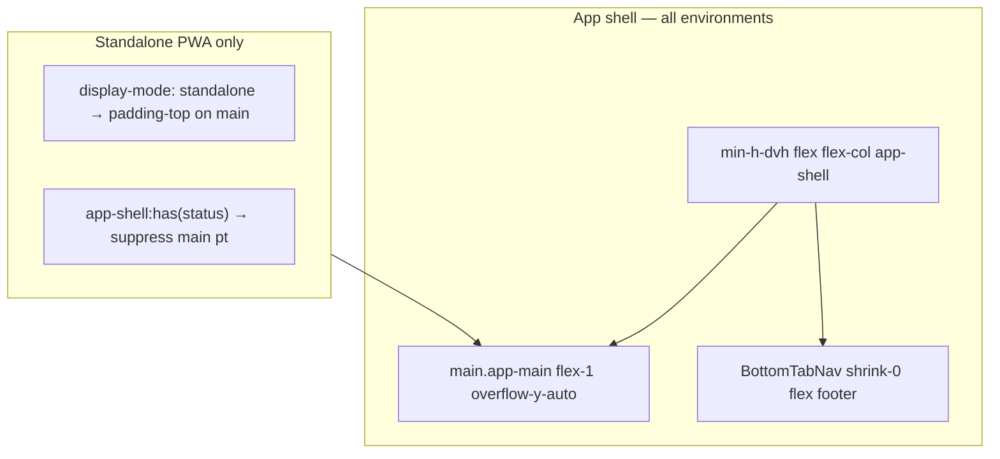

# PR: iPhone PWA + Settings UX Fixes

**Status:** Complete — merge gate green locally (236 unit, 18 E2E). §8 manual sign-off Pending (operator).  
**Depends on:** WO01–WO05 merged to `main`  
**Plan:** [.cursor/plans/iphone_safari_ux_fixes_3637e941.plan.md](../../.cursor/plans/iphone_safari_ux_fixes_3637e941.plan.md)

Post-sprint device QA on iPhone 17 found standalone-PWA shell bugs (log tab nav, top inset) plus cross-environment settings issues (DOB overflow, floating save bar). Safari mobile nav/spacing was already correct — changes must not regress browser mode.

---

## Sharpened decisions (locked)

| # | Decision | Choice |
|---|----------|--------|
| 1 | Tab bar | Flex footer globally (`min-h-dvh flex-col`, in-flow nav) — fixes standalone log nav |
| 2 | Top inset | Standalone-only via `@media (display-mode: standalone)` on `.app-main` / `.onboarding-main` |
| 3 | Safari guard | No global `pt-safe` on `<main>`; no `py-*` → `pb-*` on tab pages |
| 4 | Content padding | `layout.content.bottomPadding` → `pb-6` (tab bar no longer overlays content) |
| 5 | Settings Save | Header `PrimaryButton`, always visible, disabled when clean |
| 6 | ScanFab | Removed — scan remains on tab bar |
| 7 | Scroll-to-top | `useLayoutEffect` on pathname when navigating to tab roots |
| 8 | Install banner | Suppress duplicate standalone top inset on `main` when banner visible (`:has`) |

---

## 1. Test matrix (device QA)

| Issue | Standalone PWA | Safari mobile |
|-------|----------------|---------------|
| Log tab nav too high | **Fixed** — flex footer | **No change** (was OK) |
| Top content under notch | **Fixed** — standalone-only `pt` on main | **No change** (was OK) |
| Settings DOB overflow | **Fixed** | **Fixed** |
| Settings save bar jumps | **Fixed** — header Save | **Fixed** |
| ScanFab redundant | **Removed** | **Removed** |

---

## 2. Merge gate

**Command** (from `calsnap-web/`):

```bash
pnpm lint && pnpm test && pnpm build && pnpm test:integration && pnpm test:e2e
```

> **Note:** Integration/E2E require Java 21+ (`JAVA_HOME=/opt/homebrew/opt/openjdk@21` on macOS Homebrew).

| Step | Result | Count |
|------|--------|-------|
| `pnpm lint` | Pass | — |
| `pnpm test` | Pass | **236** tests (44 files) — **+4** |
| `pnpm build` | Pass | — |
| `pnpm test:integration` | Pass | 15 tests |
| `pnpm test:e2e` | Pass | 18 tests |

**Unit delta:** +4 tests (`scroll-main.test.ts`).  
**E2E delta:** settings helper expects Save **disabled** (not hidden); viewport-320 DOB width assertion.

---

## 3. Supersedes (WO01 / WO03 / WO05)

| Prior token / component | Disposition |
|-------------------------|-------------|
| `layout.fixed.aboveTabBar` | **Removed** — flex footer model |
| `layout.content.bottomPaddingWithSaveBar` | **Removed** — header Save |
| `layout.elevation.fab` | **Removed** — ScanFab deleted |
| `ScanFab.tsx` | **Deleted** |
| `--app-tab-bar-height`, `.pb-tab-content`, save-bar CSS | **Removed** |
| WO01 decision #6 onboarding `pt-safe` | **Resolved** — standalone-only on `.onboarding-main` |
| WO05 settings floating save bar + keyboard bump | **Superseded** — header Save; `keyboardInset` on content only |

Historical WO01/WO03/WO05 docs remain for audit trail; this PR is the current source of truth for shell layout and settings chrome.

---

## 4. Architecture



---

## 5. Manual sign-off

**PWA retest:** force-close installed app and relaunch from home-screen icon after deploy (SW may cache shell).

### Standalone PWA

| Scenario | Signed off |
|----------|------------|
| Log tab nav flush on `/log` | Pending |
| Top titles clear of notch | Pending |
| Settings DOB inside card | Pending |
| Settings header Save (no floating bar) | Pending |
| No ScanFab on dashboard | Pending |

### Safari mobile (regression)

| Scenario | Signed off |
|----------|------------|
| Log tab nav unchanged | Pending |
| Top spacing unchanged (no extra standalone gap) | Pending |
| Settings DOB + header Save | Pending |
| No ScanFab | Pending |

---

## 6. Acceptance criteria

- [x] Flex-footer shell; tab bar not `position: fixed`
- [x] Standalone-only top safe-area on `app-main` + `onboarding-main`
- [x] No global `pt-safe` on `<main>`; tab page `py-*` unchanged
- [x] Settings header Save always visible; floating bar removed
- [x] DOB overflow fixed (LocalDateInput, ProfileSection, global date CSS)
- [x] ScanFab removed; copy keys removed
- [x] Dead layout/CSS tokens removed
- [x] Scroll-to-top on tab root navigation (post-route `useLayoutEffect`)
- [x] E2E + unit tests updated
- [x] Merge gate green
- [ ] §8 operator device QA

---

## 7. Files changed index

**New**

- `calsnap-web/lib/app/scroll-main.ts`
- `calsnap-web/lib/app/tab-navigation.ts`
- `calsnap-web/tests/unit/scroll-main.test.ts`
- `docs/implementation/web/PR-IPHONE-SAFARI-UX.md`

**Modified**

- `calsnap-web/app/(app)/layout.tsx`
- `calsnap-web/app/(app)/settings/page.tsx`
- `calsnap-web/app/(app)/dashboard/page.tsx`
- `calsnap-web/app/(onboarding)/layout.tsx`
- `calsnap-web/app/globals.css`
- `calsnap-web/components/app/BottomTabNav.tsx`
- `calsnap-web/components/design/LocalDateInput.tsx`
- `calsnap-web/components/settings/ProfileSection.tsx`
- `calsnap-web/components/settings/SettingsPageSkeleton.tsx`
- `calsnap-web/lib/design/layout.ts`
- `calsnap-web/lib/copy/settings.ts`
- `calsnap-web/lib/copy/dashboard.ts`
- `calsnap-web/tests/unit/layout-safe-area.test.ts`
- `calsnap-web/tests/e2e/helpers/settings.ts`
- `calsnap-web/tests/e2e/viewport-320.spec.ts`
- `docs/implementation/web/README.md`
- `docs/implementation/web/OPTIMIZATION-MASTER-PLAN.md`
- `docs/implementation/web/PR-WO01.md`
- `docs/implementation/web/PR-WO03.md`
- `docs/implementation/web/PR-WO05.md`

**Deleted**

- `calsnap-web/components/dashboard/ScanFab.tsx`
